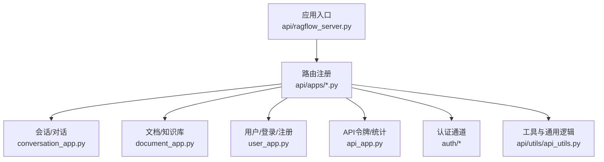
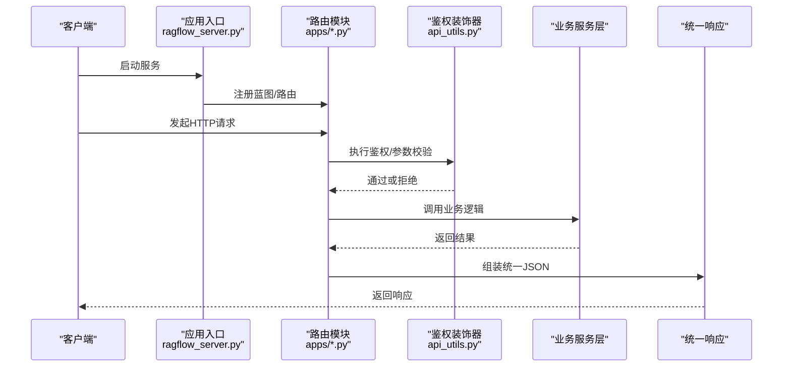
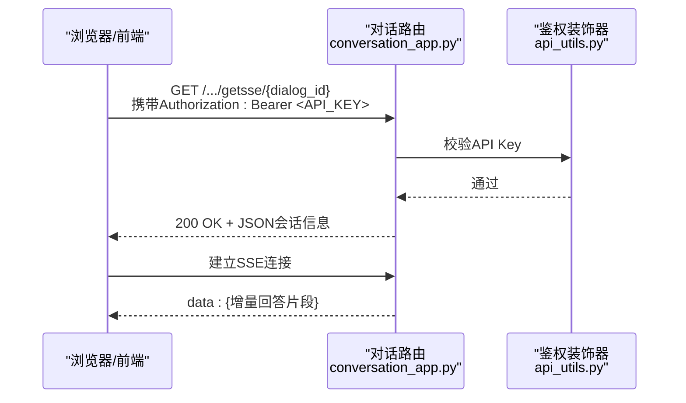
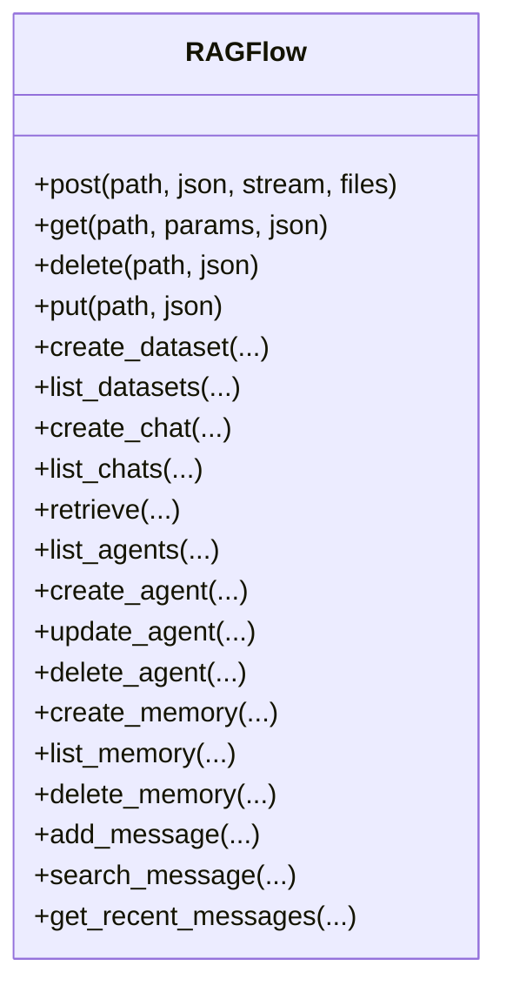
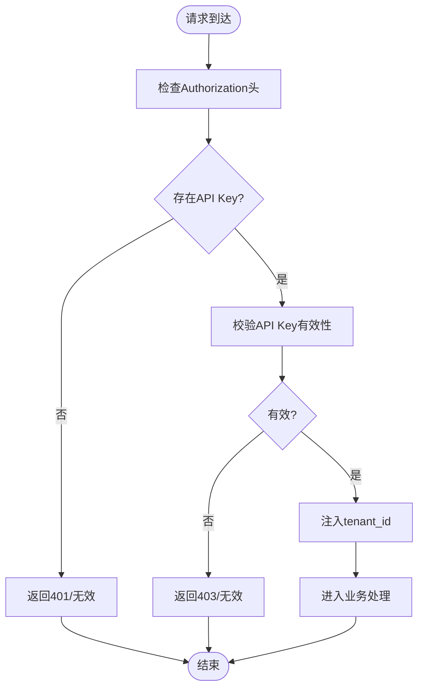
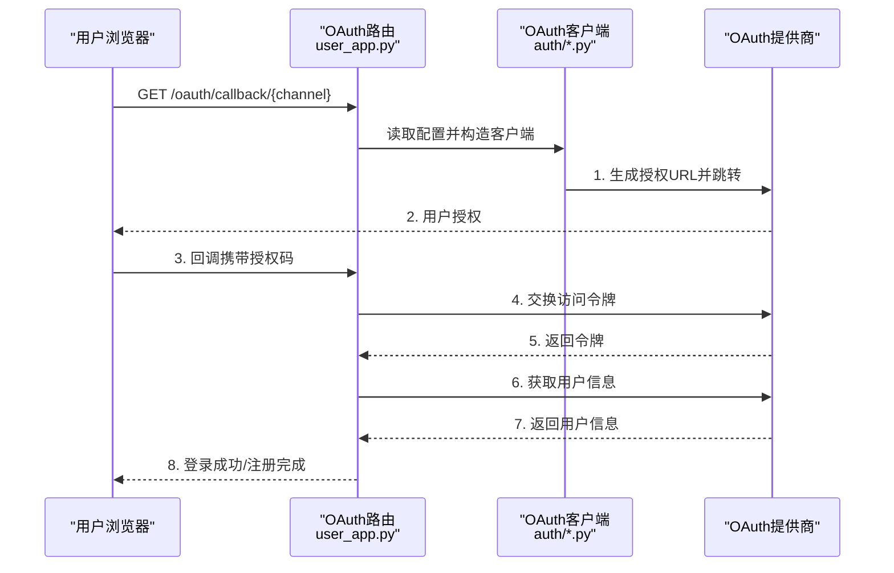
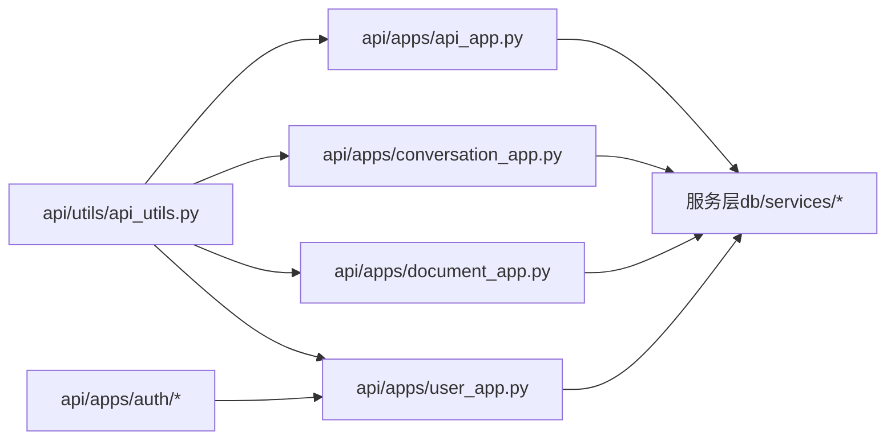

# API参考

<cite>
**本文引用的文件**
- [api/ragflow_server.py](file://api/ragflow_server.py)
- [api/apps/api_app.py](file://api/apps/api_app.py)
- [api/apps/conversation_app.py](file://api/apps/conversation_app.py)
- [api/apps/document_app.py](file://api/apps/document_app.py)
- [api/apps/user_app.py](file://api/apps/user_app.py)
- [api/apps/auth/__init__.py](file://api/apps/auth/__init__.py)
- [api/apps/auth/oauth.py](file://api/apps/auth/oauth.py)
- [api/apps/auth/github.py](file://api/apps/auth/github.py)
- [api/apps/auth/oidc.py](file://api/apps/auth/oidc.py)
- [api/utils/api_utils.py](file://api/utils/api_utils.py)
- [sdk/python/ragflow_sdk/ragflow.py](file://sdk/python/ragflow_sdk/ragflow.py)
- [admin/client/ragflow_client.py](file://admin/client/ragflow_client.py)
- [docs/references/http_api_reference.md](file://docs/references/http_api_reference.md)
</cite>

## 目录
1. [简介](#简介)
2. [项目结构](#项目结构)
3. [核心组件](#核心组件)
4. [架构总览](#架构总览)
5. [详细组件分析](#详细组件分析)
6. [依赖关系分析](#依赖关系分析)
7. [性能考虑](#性能考虑)
8. [故障排查指南](#故障排查指南)
9. [结论](#结论)
10. [附录](#附录)

## 简介
本参考文档面向RAGFlow平台的API与SDK使用者，系统梳理REST API端点、认证与授权机制、SDK使用方式、WebSocket与实时通信、以及版本管理与兼容性策略。文档以仓库中的实际实现为依据，提供端到端的接口说明、调用流程图与排障建议，帮助开发者快速集成与稳定运行。

## 项目结构
RAGFlow后端基于Quart（异步WSGI）提供REST API，核心入口在应用启动脚本中初始化数据库、运行配置与路由注册。各业务域通过独立的应用模块（如对话、文档、用户、认证等）组织路由与服务层。

图表来源
- [api/ragflow_server.py:76-157](file://api/ragflow_server.py#L76-L157)
- [api/apps/conversation_app.py:1-479](file://api/apps/conversation_app.py#L1-L479)
- [api/apps/document_app.py:1-953](file://api/apps/document_app.py#L1-L953)
- [api/apps/user_app.py:1-1063](file://api/apps/user_app.py#L1-L1063)
- [api/apps/api_app.py:1-118](file://api/apps/api_app.py#L1-L118)
- [api/apps/auth/__init__.py:1-41](file://api/apps/auth/__init__.py#L1-L41)
- [api/utils/api_utils.py:1-736](file://api/utils/api_utils.py#L1-L736)

章节来源
- [api/ragflow_server.py:76-157](file://api/ragflow_server.py#L76-L157)

## 核心组件
- 应用入口与生命周期
  - 初始化日志、数据库、运行配置与插件管理
  - 注册信号处理器与后台任务（进度更新）
  - 启动HTTP服务（Quart）
- 认证与授权
  - 基于API Key的鉴权装饰器
  - OAuth/OIDC/GitHub第三方登录通道
  - 用户登录/注册/登出与会话管理
- 业务域API
  - 对话/聊天（含SSE流式输出）
  - 文档上传/解析/检索/元数据管理
  - 数据集管理与分页查询
  - 用户与租户信息、模型设置
  - API令牌生成、列表与统计

章节来源
- [api/ragflow_server.py:47-157](file://api/ragflow_server.py#L47-L157)
- [api/utils/api_utils.py:238-302](file://api/utils/api_utils.py#L238-L302)
- [api/apps/auth/__init__.py:22-41](file://api/apps/auth/__init__.py#L22-L41)

## 架构总览
RAGFlow采用“应用模块化 + 统一响应体 + 装饰器鉴权”的架构设计。请求从HTTP入口进入，经由装饰器进行鉴权与参数校验，再路由到具体业务模块，最终返回统一格式的JSON响应。

图表来源
- [api/ragflow_server.py:148-157](file://api/ragflow_server.py#L148-L157)
- [api/utils/api_utils.py:150-197](file://api/utils/api_utils.py#L150-L197)
- [api/utils/api_utils.py:238-302](file://api/utils/api_utils.py#L238-L302)

## 详细组件分析

### REST API 端点总览
以下为HTTP API的关键端点与行为摘要（详见文档目录下的完整参考）：
- 对话与聊天
  - 创建/获取/删除会话
  - 流式/非流式对话完成
  - 消息删除与点赞反馈
  - 关键词检索、思维导图生成
- 文档与知识库
  - 上传文件/网页抓取
  - 列表过滤、元数据更新
  - 运行状态变更、重命名、删除
  - 文件下载、图片缩略图
- 数据集管理
  - 创建/删除/更新数据集
  - 分页查询与排序
- 用户与认证
  - 登录/注册/登出
  - 第三方OAuth/OIDC/GitHub回调
  - 用户资料与租户信息
- API令牌与统计
  - 新建令牌、列出令牌
  - 删除令牌、统计查询

章节来源
- [docs/references/http_api_reference.md:1-6716](file://docs/references/http_api_reference.md#L1-L6716)
- [api/apps/conversation_app.py:37-479](file://api/apps/conversation_app.py#L37-L479)
- [api/apps/document_app.py:52-953](file://api/apps/document_app.py#L52-L953)
- [api/apps/user_app.py:65-1063](file://api/apps/user_app.py#L65-L1063)
- [api/apps/api_app.py:26-118](file://api/apps/api_app.py#L26-L118)

### WebSocket 与实时通信
- SSE（Server-Sent Events）
  - 会话SSE：用于流式对话输出
  - 认证：通过Authorization头中的API Key进行校验
  - 场景：长连接持续推送增量内容，适合浏览器端实时展示

图表来源
- [api/apps/conversation_app.py:110-129](file://api/apps/conversation_app.py#L110-L129)
- [api/utils/api_utils.py:268-302](file://api/utils/api_utils.py#L268-L302)

章节来源
- [api/apps/conversation_app.py:110-129](file://api/apps/conversation_app.py#L110-L129)

### GraphQL 查询（概念说明）
- 当前仓库未发现GraphQL服务端实现或查询定义
- 若需GraphQL能力，可在现有服务层之上扩展Schema与Resolver，遵循统一响应体规范

[本节为概念性说明，不直接分析具体源码文件]

### SDK 使用指南

#### Python SDK
- 安装与初始化
  - 通过pip安装包（见项目根目录说明）
  - 初始化客户端：传入API Key与基础URL
- 主要功能
  - 数据集：创建、删除、列表、查询
  - 聊天：创建、删除、列表、检索
  - 智能体：创建、更新、删除、列表
  - 内存：创建、列表、删除、消息增删查
- 示例（路径）
  - [sdk/python/ragflow_sdk/ragflow.py:27-376](file://sdk/python/ragflow_sdk/ragflow.py#L27-L376)

图表来源
- [sdk/python/ragflow_sdk/ragflow.py:27-376](file://sdk/python/ragflow_sdk/ragflow.py#L27-L376)

章节来源
- [sdk/python/ragflow_sdk/ragflow.py:27-376](file://sdk/python/ragflow_sdk/ragflow.py#L27-L376)

#### 管理CLI（Admin CLI）
- 功能概览
  - 用户登录/注册、用户管理、角色与权限
  - API Key生成/列出/删除
  - 变量与配置管理、环境变量查看
  - 数据集/智能体/聊天列表与操作
- 示例（路径）
  - [admin/client/ragflow_client.py:47-1505](file://admin/client/ragflow_client.py#L47-L1505)

章节来源
- [admin/client/ragflow_client.py:47-1505](file://admin/client/ragflow_client.py#L47-L1505)

### 认证与授权

#### API Key 鉴权
- 请求头
  - Authorization: Bearer <API_KEY>
- 装饰器
  - token_required：解析Authorization头、校验API Key、注入tenant_id
  - apikey_required：简化版API Key校验
- 令牌管理
  - 新建令牌、列出令牌、删除令牌
  - 与对话/统计等接口配合使用

图表来源
- [api/utils/api_utils.py:268-302](file://api/utils/api_utils.py#L268-L302)
- [api/apps/api_app.py:26-118](file://api/apps/api_app.py#L26-L118)

章节来源
- [api/utils/api_utils.py:238-302](file://api/utils/api_utils.py#L238-L302)
- [api/apps/api_app.py:26-118](file://api/apps/api_app.py#L26-L118)

#### OAuth/OIDC/GitHub 登录
- 通道选择
  - 通过配置动态选择OAuth2/OIDC/GitHub客户端
- 授权流程
  - 生成授权URL（带state）
  - 回调获取授权码，交换访问令牌
  - 获取用户信息并完成登录/注册
- OIDC增强
  - 支持从/.well-known/openid-configuration发现元数据
  - 解析并验证ID Token签名

图表来源
- [api/apps/user_app.py:144-271](file://api/apps/user_app.py#L144-L271)
- [api/apps/auth/__init__.py:22-41](file://api/apps/auth/__init__.py#L22-L41)
- [api/apps/auth/oauth.py:48-152](file://api/apps/auth/oauth.py#L48-L152)
- [api/apps/auth/oidc.py:46-108](file://api/apps/auth/oidc.py#L46-L108)
- [api/apps/auth/github.py:21-89](file://api/apps/auth/github.py#L21-L89)

章节来源
- [api/apps/user_app.py:144-271](file://api/apps/user_app.py#L144-L271)
- [api/apps/auth/__init__.py:22-41](file://api/apps/auth/__init__.py#L22-L41)
- [api/apps/auth/oauth.py:48-152](file://api/apps/auth/oauth.py#L48-L152)
- [api/apps/auth/oidc.py:46-108](file://api/apps/auth/oidc.py#L46-L108)
- [api/apps/auth/github.py:21-89](file://api/apps/auth/github.py#L21-L89)

### 版本管理与向后兼容
- 版本号
  - 服务启动时打印版本信息，便于追踪部署版本
- 兼容性策略
  - 统一响应体字段（code/message/data/total）
  - 参数校验装饰器（validate_request）保证必填字段与取值范围
  - 错误码集中定义，便于客户端统一处理

章节来源
- [api/ragflow_server.py:87-89](file://api/ragflow_server.py#L87-L89)
- [api/utils/api_utils.py:150-197](file://api/utils/api_utils.py#L150-L197)
- [docs/references/http_api_reference.md:14-28](file://docs/references/http_api_reference.md#L14-L28)

## 依赖关系分析

图表来源
- [api/utils/api_utils.py:1-736](file://api/utils/api_utils.py#L1-L736)
- [api/apps/api_app.py:1-118](file://api/apps/api_app.py#L1-L118)
- [api/apps/conversation_app.py:1-479](file://api/apps/conversation_app.py#L1-L479)
- [api/apps/document_app.py:1-953](file://api/apps/document_app.py#L1-L953)
- [api/apps/user_app.py:1-1063](file://api/apps/user_app.py#L1-L1063)
- [api/apps/auth/__init__.py:1-41](file://api/apps/auth/__init__.py#L1-L41)

章节来源
- [api/utils/api_utils.py:1-736](file://api/utils/api_utils.py#L1-L736)

## 性能考虑
- 流式输出
  - SSE与文本事件流（text/event-stream）降低首字延迟，提升交互体验
- 并发与线程池
  - 大量IO操作通过线程池执行，避免阻塞主线程
- 压测与可用性
  - 工具函数支持压力测试与强弱校验，保障GraphRAG等复杂任务稳定性

章节来源
- [api/apps/conversation_app.py:221-251](file://api/apps/conversation_app.py#L221-L251)
- [api/utils/api_utils.py:691-736](file://api/utils/api_utils.py#L691-L736)

## 故障排查指南
- 常见错误码
  - 400/401/403/404/500及业务错误码（如无效Chunk ID、Chunk更新失败）
- 常见问题定位
  - 鉴权失败：确认Authorization头格式与API Key是否有效
  - 参数缺失：检查validate_request声明的必填字段
  - 数据库异常：关注OperationalError与索引异常提示
- 日志与调试
  - 启动阶段打印版本、配置与环境信息
  - 异常捕获统一返回标准错误响应

章节来源
- [docs/references/http_api_reference.md:14-28](file://docs/references/http_api_reference.md#L14-L28)
- [api/utils/api_utils.py:132-148](file://api/utils/api_utils.py#L132-L148)
- [api/ragflow_server.py:76-157](file://api/ragflow_server.py#L76-L157)

## 结论
RAGFlow提供了清晰的REST API与SDK，覆盖对话、文档、数据集、用户与认证等核心场景，并通过统一响应体、参数校验与鉴权装饰器保障一致性与安全性。WebSocket（SSE）与流式输出提升了实时交互体验。建议在生产环境中结合版本管理、参数校验与错误码策略，确保接口稳定与可维护性。

## 附录
- 快速开始
  - 获取API Key并设置Authorization头
  - 使用SDK初始化客户端并调用对应模块方法
  - 通过Admin CLI进行用户与资源管理
- 参考文档
  - HTTP API参考（完整端点、参数与示例）

章节来源
- [docs/references/http_api_reference.md:1-6716](file://docs/references/http_api_reference.md#L1-L6716)
- [sdk/python/ragflow_sdk/ragflow.py:27-376](file://sdk/python/ragflow_sdk/ragflow.py#L27-L376)
- [admin/client/ragflow_client.py:47-1505](file://admin/client/ragflow_client.py#L47-L1505)