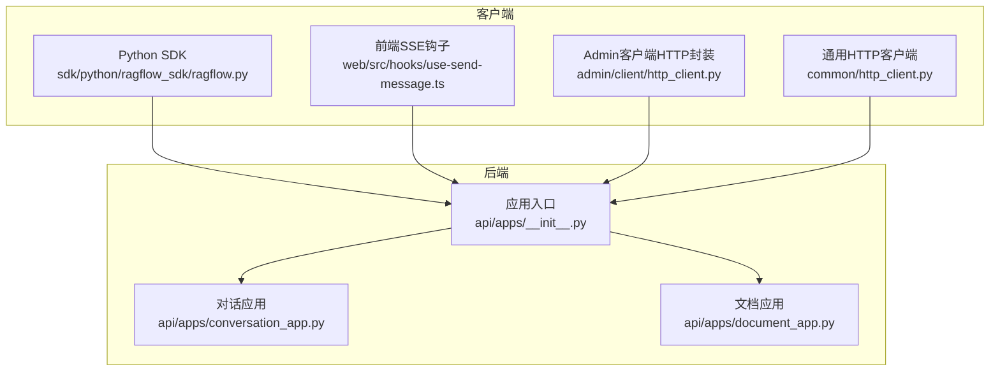
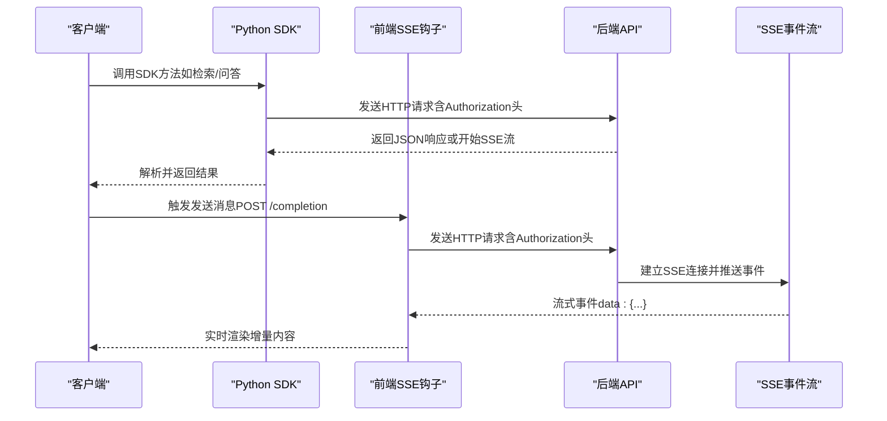
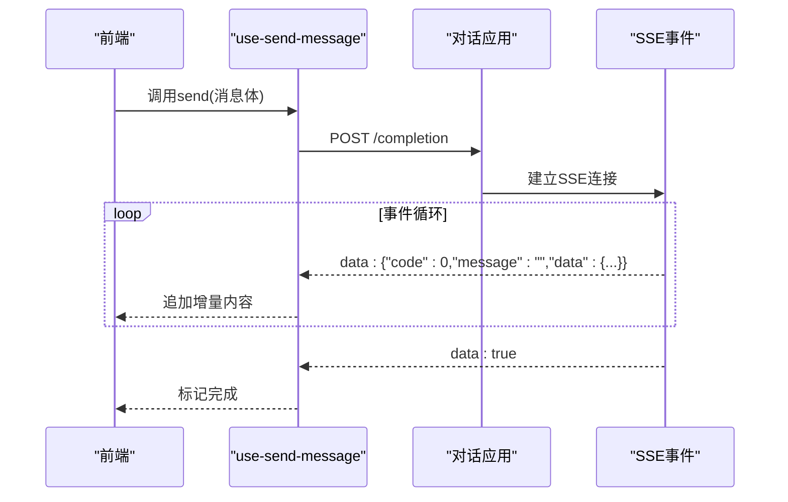
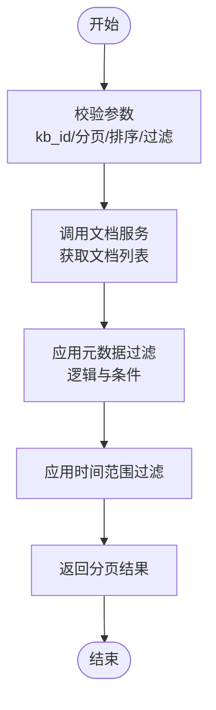
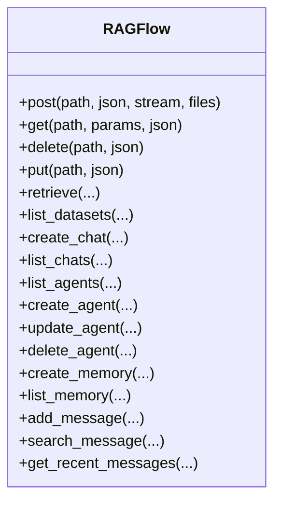
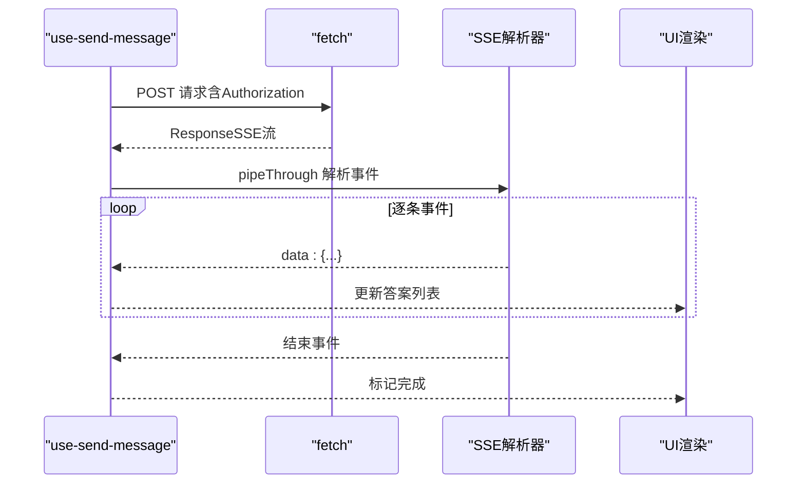
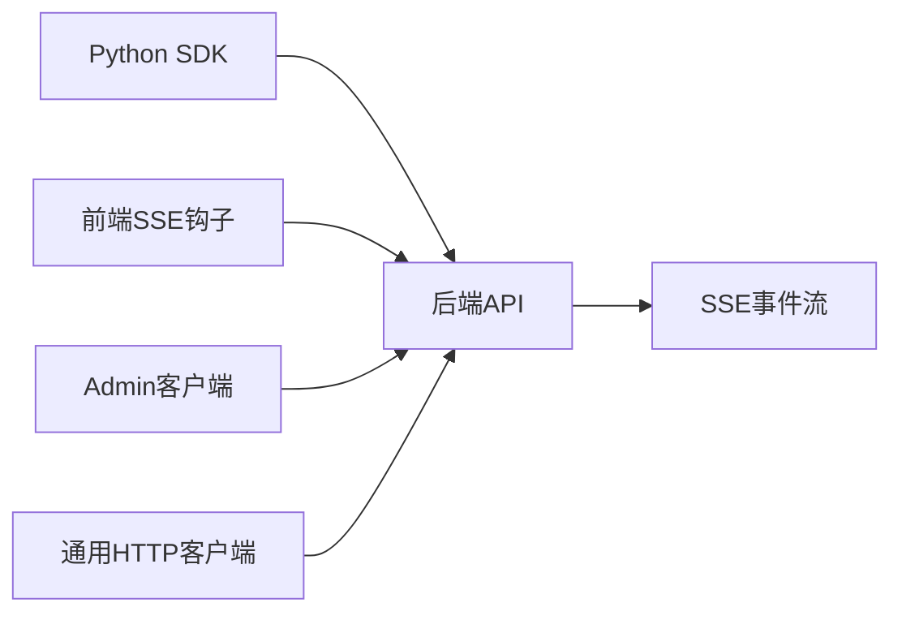

# GraphQL 查询接口

<cite>
**本文引用的文件**
- [api/apps/__init__.py](file://api/apps/__init__.py)
- [api/apps/conversation_app.py](file://api/apps/conversation_app.py)
- [api/apps/document_app.py](file://api/apps/document_app.py)
- [sdk/python/ragflow_sdk/ragflow.py](file://sdk/python/ragflow_sdk/ragflow.py)
- [common/http_client.py](file://common/http_client.py)
- [admin/client/http_client.py](file://admin/client/http_client.py)
- [web/src/hooks/use-send-message.ts](file://web/src/hooks/use-send-message.ts)
- [web/src/interfaces/database/mcp-server.ts](file://web/src/interfaces/database/mcp-server.ts)
- [docs/references/http_api_reference.md](file://docs/references/http_api_reference.md)
</cite>

## 目录
1. [简介](#简介)
2. [项目结构](#项目结构)
3. [核心组件](#核心组件)
4. [架构总览](#架构总览)
5. [详细组件分析](#详细组件分析)
6. [依赖关系分析](#依赖关系分析)
7. [性能考虑](#性能考虑)
8. [故障排查指南](#故障排查指南)
9. [结论](#结论)
10. [附录](#附录)

## 简介
本指南面向希望在RAGFlow系统中使用GraphQL查询接口的开发者与使用者，系统性阐述GraphQL基础概念、查询语法、参数传递、嵌套查询与复杂数据结构获取方法，并结合本仓库中的实际API实现，给出可用的查询类型、变更与订阅能力说明、查询优化技巧、与传统REST API的差异与优势、客户端集成示例以及调试与验证最佳实践。

需要特别说明的是：经对代码库全面检索，本项目并未发现基于GraphQL的后端服务或Schema定义。项目采用的是基于HTTP REST风格的API（如/v1/...），并提供了Python SDK与前端SSE流式响应支持。因此，本指南将以“如何在本项目中进行高效查询与集成”为主题，围绕现有REST API与SDK进行说明，并以GraphQL术语帮助理解查询模式与优化策略。

## 项目结构
- 后端应用入口与蓝图注册集中在应用层，统一通过蓝图管理各模块路由。
- 对话与聊天相关接口位于对话应用模块，文档与知识库相关接口位于文档应用模块。
- 客户端侧通过SDK封装HTTP请求，前端通过SSE接收流式响应。

**图表来源**
- [api/apps/__init__.py:274-320](file://api/apps/__init__.py#L274-L320)
- [api/apps/conversation_app.py:1-479](file://api/apps/conversation_app.py#L1-L479)
- [api/apps/document_app.py:1-800](file://api/apps/document_app.py#L1-L800)
- [sdk/python/ragflow_sdk/ragflow.py:1-376](file://sdk/python/ragflow_sdk/ragflow.py#L1-L376)
- [web/src/hooks/use-send-message.ts:94-194](file://web/src/hooks/use-send-message.ts#L94-L194)
- [admin/client/http_client.py:1-109](file://admin/client/http_client.py#L1-L109)
- [common/http_client.py:193-226](file://common/http_client.py#L193-L226)

**章节来源**
- [api/apps/__init__.py:274-320](file://api/apps/__init__.py#L274-L320)
- [api/apps/conversation_app.py:1-479](file://api/apps/conversation_app.py#L1-L479)
- [api/apps/document_app.py:1-800](file://api/apps/document_app.py#L1-L800)

## 核心组件
- 应用入口与蓝图注册：负责加载各模块蓝图、统一错误处理、认证中间件等。
- 对话应用：提供会话设置、获取、删除、消息增删改查、问答检索、思维导图生成、相关问题生成等接口。
- 文档应用：提供上传、网页抓取、创建、列表、过滤、元数据更新、状态变更、运行任务、重命名、下载等接口。
- Python SDK：封装常用API调用，便于在Python环境中快速集成。
- 前端SSE钩子：封装SSE事件流解析与读取，用于实时接收后端流式响应。
- Admin客户端HTTP封装与通用HTTP客户端：提供可配置的HTTP请求封装，支持超时、重试、代理等。

**章节来源**
- [api/apps/conversation_app.py:37-251](file://api/apps/conversation_app.py#L37-L251)
- [api/apps/document_app.py:52-790](file://api/apps/document_app.py#L52-L790)
- [sdk/python/ragflow_sdk/ragflow.py:27-376](file://sdk/python/ragflow_sdk/ragflow.py#L27-L376)
- [web/src/hooks/use-send-message.ts:94-194](file://web/src/hooks/use-send-message.ts#L94-L194)
- [admin/client/http_client.py:26-109](file://admin/client/http_client.py#L26-L109)
- [common/http_client.py:193-226](file://common/http_client.py#L193-L226)

## 架构总览
下图展示了从客户端到后端API的典型调用链路，以及SDK与前端SSE的参与方式。

**图表来源**
- [sdk/python/ragflow_sdk/ragflow.py:36-50](file://sdk/python/ragflow_sdk/ragflow.py#L36-L50)
- [web/src/hooks/use-send-message.ts:114-178](file://web/src/hooks/use-send-message.ts#L114-L178)
- [api/apps/conversation_app.py:168-251](file://api/apps/conversation_app.py#L168-L251)

## 详细组件分析

### 组件A：对话与聊天查询流程
- 功能要点
  - 设置/获取会话、列出会话、删除会话
  - 流式问答（completion）与非流式问答
  - 消息增删改查、点赞反馈
  - 静音/取消静音、语音转文本、文本转语音
  - 基于知识库的问答检索、思维导图生成、相关问题生成
- 关键路径
  - 流式问答：POST /completion，启用SSE事件流
  - 非流式问答：POST /completion，关闭流式模式
  - 检索：POST /retrieval（由SDK封装）
- 参数与返回
  - Authorization: Bearer <API_KEY>
  - 请求体字段：如messages、kb_ids、llm_id、stream等
  - SSE事件：data: {"code":0,"message":"","data":{...}}，结束事件：data: true

**图表来源**
- [web/src/hooks/use-send-message.ts:114-178](file://web/src/hooks/use-send-message.ts#L114-L178)
- [api/apps/conversation_app.py:168-251](file://api/apps/conversation_app.py#L168-L251)

**章节来源**
- [api/apps/conversation_app.py:37-251](file://api/apps/conversation_app.py#L37-L251)
- [web/src/hooks/use-send-message.ts:94-194](file://web/src/hooks/use-send-message.ts#L94-L194)

### 组件B：文档与知识库查询流程
- 功能要点
  - 文件上传、网页抓取、创建虚拟文档
  - 列表查询、过滤条件、元数据更新
  - 状态变更、运行任务（重新处理）、重命名
  - 下载附件、图片回取
- 关键路径
  - 列表：POST /document/list（支持分页、排序、关键词、时间范围、类型、后缀、元数据条件）
  - 元数据更新：POST /document/metadata/update
  - 运行任务：POST /document/run
- 参数与返回
  - Authorization: Bearer <API_KEY>
  - 请求体字段：如kb_id、page/page_size、orderby、desc、keywords、run_status、types、suffix、metadata_condition等

**图表来源**
- [api/apps/document_app.py:223-354](file://api/apps/document_app.py#L223-L354)

**章节来源**
- [api/apps/document_app.py:52-790](file://api/apps/document_app.py#L52-L790)

### 组件C：Python SDK封装与客户端集成
- 功能要点
  - 封装常用API：创建/删除数据集、创建/删除聊天、检索、代理管理、记忆体管理、消息检索等
  - 统一Authorization头：Bearer <API_KEY>
  - 支持流式与非流式请求
- 使用建议
  - 在Python环境中优先使用SDK，减少重复的HTTP封装
  - 对于检索类请求，合理设置分页与相似度阈值，避免一次性返回过多数据

**图表来源**
- [sdk/python/ragflow_sdk/ragflow.py:27-376](file://sdk/python/ragflow_sdk/ragflow.py#L27-L376)

**章节来源**
- [sdk/python/ragflow_sdk/ragflow.py:27-376](file://sdk/python/ragflow_sdk/ragflow.py#L27-L376)

### 组件D：前端SSE钩子与订阅体验
- 功能要点
  - 建立AbortController控制请求生命周期
  - 使用TextDecoderStream与EventSourceParserStream解析SSE事件
  - 错误处理与中断机制
- 适用场景
  - 实时问答、流式输出、长任务进度提示

**图表来源**
- [web/src/hooks/use-send-message.ts:114-178](file://web/src/hooks/use-send-message.ts#L114-L178)

**章节来源**
- [web/src/hooks/use-send-message.ts:94-194](file://web/src/hooks/use-send-message.ts#L94-L194)

## 依赖关系分析
- 组件耦合
  - SDK与后端API强耦合于Authorization头与URL前缀（/api/v1）
  - 前端SSE钩子与后端SSE接口存在契约约定（事件格式与结束标记）
- 外部依赖
  - httpx（异步HTTP客户端）、requests（同步HTTP客户端）
  - SSE解析器（浏览器内置ReadableStream与自定义解析器）

**图表来源**
- [sdk/python/ragflow_sdk/ragflow.py:36-50](file://sdk/python/ragflow_sdk/ragflow.py#L36-L50)
- [web/src/hooks/use-send-message.ts:114-178](file://web/src/hooks/use-send-message.ts#L114-L178)
- [admin/client/http_client.py:74-109](file://admin/client/http_client.py#L74-L109)
- [common/http_client.py:193-226](file://common/http_client.py#L193-L226)

**章节来源**
- [common/http_client.py:193-226](file://common/http_client.py#L193-L226)
- [admin/client/http_client.py:26-109](file://admin/client/http_client.py#L26-L109)

## 性能考虑
- 字段裁剪与按需返回
  - 在列表与过滤接口中，尽量使用分页与排序参数，避免一次性拉取大量数据
  - 对象字段仅请求必要字段，减少网络与序列化开销
- 批量查询
  - 合理合并多次请求，减少往返次数（如SDK已封装的检索与列表）
- 缓存策略
  - 对静态元数据与配置类接口增加本地缓存
  - 对高频但低变化的列表结果进行短期缓存
- 流式传输
  - 使用SSE进行长耗时任务的增量反馈，提升用户体验
- 超时与重试
  - 通过通用HTTP客户端配置超时、最大重试与退避因子，提高稳定性

[本节为通用指导，不直接分析具体文件]

## 故障排查指南
- 认证失败
  - 确认Authorization头是否正确设置为Bearer <API_KEY>
  - 检查API密钥是否有效且未过期
- 请求超时
  - 调整通用HTTP客户端的超时与重试参数
  - 对大文件上传与长任务使用流式或分批处理
- SSE中断
  - 使用AbortController主动中断请求
  - 捕获DOMException并区分用户中断与异常中断
- 数据不一致
  - 对关键写操作（如元数据更新、状态变更）进行幂等设计与重试
  - 在前端对重复事件进行去重处理

**章节来源**
- [web/src/hooks/use-send-message.ts:162-166](file://web/src/hooks/use-send-message.ts#L162-L166)
- [common/http_client.py:193-226](file://common/http_client.py#L193-L226)

## 结论
本项目当前采用REST风格API与SSE流式响应，未提供GraphQL Schema或查询执行引擎。建议在现有SDK与前端SSE钩子基础上，结合字段裁剪、批量请求与缓存策略，实现高效的查询与交互体验。对于未来引入GraphQL的需求，可参考本指南中的查询模式与优化思路，逐步迁移至GraphQL Schema与解析器实现。

[本节为总结性内容，不直接分析具体文件]

## 附录

### GraphQL与REST对比与优势
- GraphQL优势
  - 字段裁剪：客户端精确指定所需字段，减少冗余数据
  - 批量查询：单次请求聚合多个资源，降低网络往返
  - 强类型Schema：提供自描述与自动补全能力
- 本项目现状
  - 当前以REST为主，配合SSE实现流式输出
  - 可借鉴GraphQL的字段选择思想，在REST中通过参数控制返回字段与层级

[本节为概念性内容，不直接分析具体文件]

### 客户端集成示例（Python）
- 初始化SDK并设置API密钥
- 调用检索接口，传入数据集ID、问题、分页与相似度参数
- 获取返回的块级结果，进行后续处理

**章节来源**
- [sdk/python/ragflow_sdk/ragflow.py:27-376](file://sdk/python/ragflow_sdk/ragflow.py#L27-L376)

### 客户端集成示例（前端）
- 使用SSE钩子发起POST请求
- 通过事件流解析器逐条解析data事件
- 渲染增量内容，结束时标记完成

**章节来源**
- [web/src/hooks/use-send-message.ts:114-178](file://web/src/hooks/use-send-message.ts#L114-L178)

### 查询语法与参数传递（基于现有API）
- 基本字段选择
  - 在列表与过滤接口中，通过参数控制返回字段集合
- 参数传递
  - Authorization: Bearer <API_KEY>
  - 分页参数：page/page_size
  - 排序参数：orderby/desc
  - 过滤参数：keywords、run_status、types、suffix、metadata_condition
- 嵌套查询
  - 通过多层对象字段（如metadata_condition）表达复杂过滤条件

**章节来源**
- [api/apps/document_app.py:223-354](file://api/apps/document_app.py#L223-L354)
- [docs/references/http_api_reference.md:2402-2435](file://docs/references/http_api_reference.md#L2402-L2435)

### 可用查询类型与变更操作
- 查询类型
  - 列表查询：/v1/document/list、/v1/chats、/v1/agents、/v1/memories
  - 检索查询：/v1/retrieval（由SDK封装）
  - 会话查询：/v1/conversations（对应对话应用）
- 变更操作
  - 创建/删除数据集与聊天
  - 更新元数据、状态变更、运行任务
  - 添加/搜索消息、点赞反馈
- 订阅功能
  - SSE事件流：/v1/conversations/completion（流式问答）

**章节来源**
- [api/apps/conversation_app.py:37-251](file://api/apps/conversation_app.py#L37-L251)
- [api/apps/document_app.py:52-790](file://api/apps/document_app.py#L52-L790)
- [sdk/python/ragflow_sdk/ragflow.py:191-236](file://sdk/python/ragflow_sdk/ragflow.py#L191-L236)

### 调试工具与查询验证最佳实践
- 调试工具
  - 使用通用HTTP客户端配置日志与重试
  - 前端SSE钩子中打印事件与错误信息
- 最佳实践
  - 明确Authorization头与URL前缀
  - 对SSE事件进行去重与容错处理
  - 对大响应进行分页与字段裁剪

**章节来源**
- [common/http_client.py:193-226](file://common/http_client.py#L193-L226)
- [web/src/hooks/use-send-message.ts:144-160](file://web/src/hooks/use-send-message.ts#L144-L160)