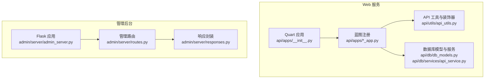
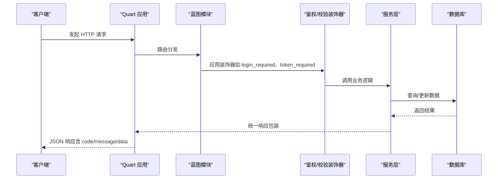
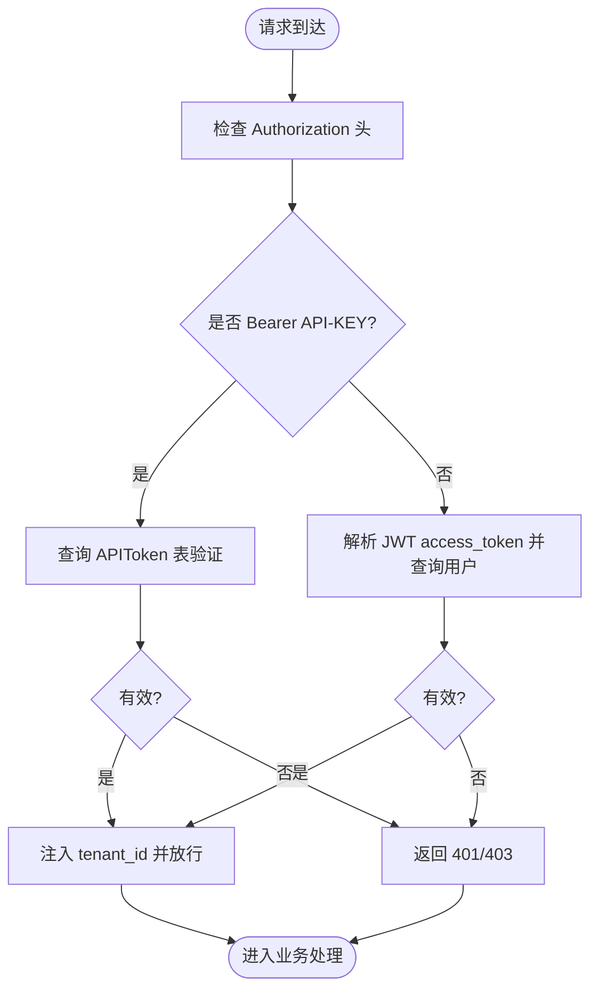
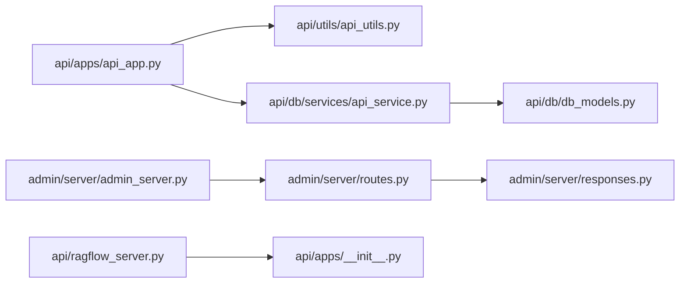

# HTTP REST API

<cite>
**本文引用的文件**
- [api/ragflow_server.py](file://api/ragflow_server.py)
- [api/apps/__init__.py](file://api/apps/__init__.py)
- [api/apps/api_app.py](file://api/apps/api_app.py)
- [api/utils/api_utils.py](file://api/utils/api_utils.py)
- [api/db/services/api_service.py](file://api/db/services/api_service.py)
- [api/db/db_models.py](file://api/db/db_models.py)
- [admin/server/admin_server.py](file://admin/server/admin_server.py)
- [admin/server/routes.py](file://admin/server/routes.py)
- [admin/server/responses.py](file://admin/server/responses.py)
- [docs/references/http_api_reference.md](file://docs/references/http_api_reference.md)
- [example/http/dataset_example.sh](file://example/http/dataset_example.sh)
- [example/sdk/dataset_example.py](file://example/sdk/dataset_example.py)
</cite>

## 目录
1. [简介](#简介)
2. [项目结构](#项目结构)
3. [核心组件](#核心组件)
4. [架构总览](#架构总览)
5. [详细组件分析](#详细组件分析)
6. [依赖分析](#依赖分析)
7. [性能考虑](#性能考虑)
8. [故障排查指南](#故障排查指南)
9. [结论](#结论)
10. [附录](#附录)

## 简介
本文件为 RAGFlow 的 HTTP REST API 参考文档，覆盖以下内容：
- 所有公开的 REST API 端点：URL 路径、HTTP 方法、请求头、请求参数、响应格式与错误码
- 每个端点的功能、使用场景与参数约束
- 认证机制（用户访问令牌与 API 密钥）与获取方式
- 限流策略、版本控制与向后兼容性
- 常见错误排查与解决方案
- 多语言集成示例（Shell/SDK）

## 项目结构
RAGFlow 后端基于 Quart（异步 WSGI 框架）构建 Web 服务，并通过蓝图注册各业务模块的路由。管理后台采用 Flask，独立运行在固定端口。

**图表来源**
- [api/apps/__init__.py:59-84](file://api/apps/__init__.py#L59-L84)
- [api/apps/api_app.py:25-118](file://api/apps/api_app.py#L25-L118)
- [api/utils/api_utils.py:238-301](file://api/utils/api_utils.py#L238-L301)
- [api/db/db_models.py:614-680](file://api/db/db_models.py#L614-L680)
- [admin/server/admin_server.py:53-84](file://admin/server/admin_server.py#L53-L84)
- [admin/server/routes.py:33-557](file://admin/server/routes.py#L33-L557)

**章节来源**
- [api/ragflow_server.py:148-156](file://api/ragflow_server.py#L148-L156)
- [api/apps/__init__.py:59-84](file://api/apps/__init__.py#L59-L84)

## 核心组件
- Quart 应用与蓝图注册：统一处理 CORS、OpenAPI 支持、超时配置、错误处理与会话配置；按目录自动扫描并注册各模块蓝图。
- API 装饰器与工具：提供统一的请求解析、参数校验、鉴权（用户令牌与 API 密钥）、响应格式化与错误码映射。
- 数据模型与服务：定义用户、租户、对话、API 令牌等核心数据模型及统计服务。
- 管理后台：提供管理员登录、用户管理、角色权限、系统变量与配置、API 密钥生成等管理接口。

**章节来源**
- [api/apps/__init__.py:59-84](file://api/apps/__init__.py#L59-L84)
- [api/utils/api_utils.py:238-301](file://api/utils/api_utils.py#L238-L301)
- [api/db/db_models.py:614-680](file://api/db/db_models.py#L614-L680)
- [admin/server/routes.py:33-557](file://admin/server/routes.py#L33-L557)

## 架构总览

**图表来源**
- [api/apps/__init__.py:144-179](file://api/apps/__init__.py#L144-L179)
- [api/utils/api_utils.py:238-301](file://api/utils/api_utils.py#L238-L301)
- [api/db/services/api_service.py:25-42](file://api/db/services/api_service.py#L25-L42)

## 详细组件分析

### 版本与基础约定
- API 版本前缀：/api/v{N} 或 /{version}/{module}，由蓝图注册逻辑根据路径自动推断。
- 统一响应体字段：code、message、data；部分端点支持 total 字段用于分页。
- 错误码：使用 RetCode 枚举，涵盖成功、未授权、参数错误、权限错误、操作错误、异常错误、未找到等。
- 超时配置：可通过环境变量 QUART_RESPONSE_TIMEOUT、QUART_BODY_TIMEOUT 调整响应与请求体超时时间。

**章节来源**
- [api/apps/__init__.py:36-84](file://api/apps/__init__.py#L36-L84)
- [api/utils/api_utils.py:304-324](file://api/utils/api_utils.py#L304-L324)

### 认证与授权
- 用户访问令牌（Access Token）：通过 Authorization 头传递 JWT 包装的 access_token，用于用户态鉴权。
- API 密钥（API-KEY）：通过 Authorization: Bearer <token> 方式传递，用于 SDK 或第三方调用的租户级鉴权。
- 管理员认证：Flask 登录流程，支持登录、登出、鉴权检查与管理员权限校验。

**图表来源**
- [api/utils/api_utils.py:238-301](file://api/utils/api_utils.py#L238-L301)
- [api/apps/__init__.py:95-141](file://api/apps/__init__.py#L95-L141)

**章节来源**
- [api/utils/api_utils.py:238-301](file://api/utils/api_utils.py#L238-L301)
- [api/apps/__init__.py:95-141](file://api/apps/__init__.py#L95-L141)
- [admin/server/routes.py:41-71](file://admin/server/routes.py#L41-L71)

### 管理后台 API（/api/v1/admin）
- 基础路径：/api/v1/admin
- 鉴权：需要管理员登录态，支持登录、登出、鉴权检查。
- 主要端点：
  - GET /ping：健康检查
  - POST /login：管理员登录
  - GET /logout：管理员登出
  - GET /auth：校验管理员登录状态
  - GET /users：列出用户
  - POST /users：创建用户
  - DELETE /users/<username>：删除用户
  - PUT /users/<username>/password：修改用户密码
  - PUT /users/<username>/activate：切换用户激活状态
  - PUT /users/<username>/admin：授予管理员
  - DELETE /users/<username>/admin：撤销管理员
  - GET /users/<username>：获取用户详情
  - GET /users/<username>/datasets：获取用户数据集列表
  - GET /users/<username>/agents：获取用户智能体列表
  - GET /services：获取服务列表
  - GET /service_types/<service_type>：按类型获取服务
  - GET /services/<service_id>：获取服务详情
  - DELETE /services/<service_id>：关闭服务
  - PUT /services/<service_id>：重启服务
  - POST /roles：创建角色
  - PUT /roles/<role_name>：更新角色描述
  - DELETE /roles/<role_name>：删除角色
  - GET /roles：列出角色
  - GET /roles/<role_name>/permission：获取角色权限
  - POST /roles/<role_name>/permission：授予角色权限
  - DELETE /roles/<role_name>/permission：撤销角色权限
  - PUT /users/<user_name>/role：更新用户角色
  - GET /users/<user_name>/permission：获取用户权限
  - PUT /variables：设置系统变量
  - GET /variables：获取系统变量（支持列举或按名称查询）
  - GET /configs：获取系统配置
  - GET /environments：获取环境变量
  - POST /users/<username>/keys：为用户生成 API 密钥
  - GET /users/<username>/keys：获取用户 API 密钥列表
  - DELETE /users/<username>/keys/<key>：删除用户 API 密钥
  - GET /version：获取当前版本

- 请求与响应
  - 成功响应：{"code": 0, "message": "...", "data": ...}
  - 失败响应：{"code": -1, "message": "...", "data": null}

- 错误码
  - 通用：DATA_ERROR、ARGUMENT_ERROR、PERMISSION_ERROR、OPERATING_ERROR、EXCEPTION_ERROR、NOT_FOUND、UNAUTHORIZED、AUTHENTICATION_ERROR
  - 管理端特定：AdminException 抛出时映射到对应 code 与 message

**章节来源**
- [admin/server/routes.py:33-557](file://admin/server/routes.py#L33-L557)
- [admin/server/responses.py:19-32](file://admin/server/responses.py#L19-L32)

### 用户 API（/api/v{N}/api）
- 基础路径：/api/v{N}/api
- 主要端点：
  - POST /new_token：为当前租户生成新的 API 密钥（可选绑定对话或画布）
  - GET /token_list：查询指定对话/画布下的 API 密钥列表
  - POST /rm：批量删除 API 密钥
  - GET /stats：按日统计对话指标（pv、uv、速度、token、轮次、点赞）

- 请求与响应
  - /new_token：请求体包含 canvas_id 或 dialog_id；成功返回新生成的 token 与元信息
  - /token_list：查询参数 dialog_id 或 canvas_id；返回数组
  - /rm：请求体 {"tokens": [...], "tenant_id": "..."}
  - /stats：查询参数 from_date、to_date、canvas_id（可选）；返回 {"pv":[],"uv":[],"speed":[],"tokens":[],"round":[],"thumb_up":[]}

- 参数约束
  - 必须先登录并获取当前租户
  - /stats 默认统计最近 7 天，to_date 若为 10 位则补全至 23:59:59

**章节来源**
- [api/apps/api_app.py:25-118](file://api/apps/api_app.py#L25-L118)
- [api/db/services/api_service.py:84-107](file://api/db/services/api_service.py#L84-L107)

### 公共鉴权装饰器
- token_required：从 Authorization 中提取 Bearer token，查询 APIToken 并注入 tenant_id
- apikey_required：同上，但签名更严格
- login_required：基于用户访问令牌进行用户态鉴权

**章节来源**
- [api/utils/api_utils.py:238-301](file://api/utils/api_utils.py#L238-L301)
- [api/apps/__init__.py:144-179](file://api/apps/__init__.py#L144-L179)

### 数据模型与统计服务
- APIToken：存储 API 密钥、租户与来源信息
- API4Conversation：对话统计与指标聚合
- 统计服务提供按天聚合的 pv、uv、tokens、duration、round、thumb_up 等指标

**章节来源**
- [api/db/db_models.py:614-680](file://api/db/db_models.py#L614-L680)
- [api/db/services/api_service.py:25-42](file://api/db/services/api_service.py#L25-L42)
- [api/db/services/api_service.py:84-107](file://api/db/services/api_service.py#L84-L107)

## 依赖分析

**图表来源**
- [api/apps/api_app.py:25-118](file://api/apps/api_app.py#L25-L118)
- [api/utils/api_utils.py:238-301](file://api/utils/api_utils.py#L238-L301)
- [api/db/services/api_service.py:25-42](file://api/db/services/api_service.py#L25-L42)
- [api/db/db_models.py:614-680](file://api/db/db_models.py#L614-L680)
- [admin/server/routes.py:33-557](file://admin/server/routes.py#L33-L557)
- [admin/server/responses.py:19-32](file://admin/server/responses.py#L19-L32)
- [admin/server/admin_server.py:53-84](file://admin/server/admin_server.py#L53-L84)
- [api/ragflow_server.py:148-156](file://api/ragflow_server.py#L148-L156)
- [api/apps/__init__.py:59-84](file://api/apps/__init__.py#L59-L84)

**章节来源**
- [api/apps/api_app.py:25-118](file://api/apps/api_app.py#L25-L118)
- [admin/server/routes.py:33-557](file://admin/server/routes.py#L33-L557)

## 性能考虑
- 响应超时：默认 600 秒，可通过环境变量调整以适配大模型推理延迟。
- 连接池与重试：数据库连接具备重试与自愈能力，降低网络抖动影响。
- 异步框架：Quart 提供异步支持，适合高并发与长尾响应场景。

**章节来源**
- [api/apps/__init__.py:69-72](file://api/apps/__init__.py#L69-L72)
- [api/db/db_models.py:242-321](file://api/db/db_models.py#L242-L321)

## 故障排查指南
- 401 未授权
  - 检查 Authorization 头格式与内容；确认用户 access_token 有效或 API 密钥存在且未过期。
- 403 禁止访问
  - 确认用户状态正常、租户有效、角色权限满足要求。
- 404 未找到
  - 检查资源 ID 是否正确，路径拼写是否规范。
- 422 参数错误
  - 校验必填参数与取值范围；参考各端点的参数约束。
- 数据库异常
  - 查看重试日志与连接池状态；必要时增大超时或重试次数。
- 管理端错误
  - 使用 /api/v1/admin/auth 校验管理员登录状态；查看 AdminException 映射的 code/message。

**章节来源**
- [api/utils/api_utils.py:132-147](file://api/utils/api_utils.py#L132-L147)
- [api/apps/__init__.py:285-314](file://api/apps/__init__.py#L285-L314)
- [admin/server/routes.py:65-71](file://admin/server/routes.py#L65-L71)

## 结论
本文档提供了 RAGFlow HTTP REST API 的完整参考，涵盖端点清单、认证机制、版本控制、错误码与集成示例。建议在生产环境中结合超时与重试策略，并通过管理后台进行权限与密钥治理。

## 附录

### API 端点一览（按模块）
- 管理后台（/api/v1/admin）
  - 健康检查、登录、登出、鉴权
  - 用户管理、角色权限、系统变量与配置、API 密钥管理
  - 服务管理与版本查询
- 用户 API（/api/v{N}/api）
  - API 密钥生成、查询与删除
  - 对话统计

**章节来源**
- [admin/server/routes.py:33-557](file://admin/server/routes.py#L33-L557)
- [api/apps/api_app.py:25-118](file://api/apps/api_app.py#L25-L118)

### 认证与密钥获取
- 获取用户访问令牌：通过前端登录流程获得 access_token，放入 Authorization 头中。
- 获取 API 密钥：通过管理后台 /api/v1/admin/users/<username>/keys 接口生成；或在用户 API 模块下生成临时密钥。
- 使用方式：Authorization: Bearer <token>

**章节来源**
- [admin/server/routes.py:487-516](file://admin/server/routes.py#L487-L516)
- [api/apps/api_app.py:25-54](file://api/apps/api_app.py#L25-L54)
- [api/utils/api_utils.py:238-301](file://api/utils/api_utils.py#L238-L301)

### 版本控制与向后兼容
- 版本前缀：/api/v{N} 或 /{version}/{module}
- 响应格式保持一致（code/message/data），便于客户端兼容升级

**章节来源**
- [api/apps/__init__.py:266-271](file://api/apps/__init__.py#L266-L271)

### 常见错误码
- 成功：0
- 未授权：UNAUTHORIZED
- 参数错误：ARGUMENT_ERROR
- 权限错误：PERMISSION_ERROR
- 操作错误：OPERATING_ERROR
- 异常错误：EXCEPTION_ERROR
- 未找到：NOT_FOUND
- 认证错误：AUTHENTICATION_ERROR

**章节来源**
- [api/utils/api_utils.py:120-147](file://api/utils/api_utils.py#L120-L147)

### 集成示例
- Shell 示例：使用 curl 调用 API（参考仓库中的 dataset_example.sh）
- Python SDK 示例：参考仓库中的 dataset_example.py

**章节来源**
- [example/http/dataset_example.sh](file://example/http/dataset_example.sh)
- [example/sdk/dataset_example.py](file://example/sdk/dataset_example.py)