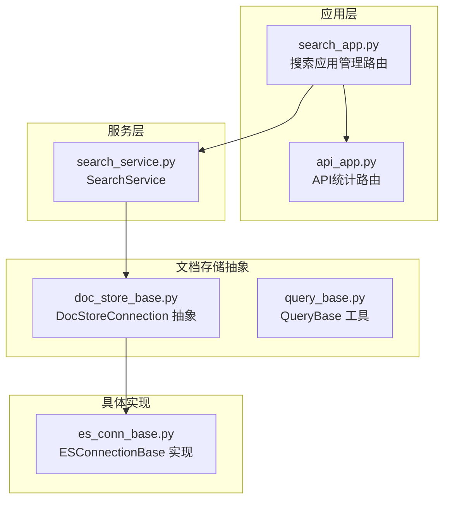
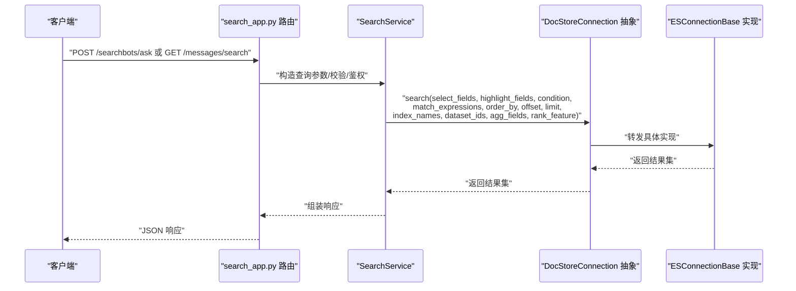
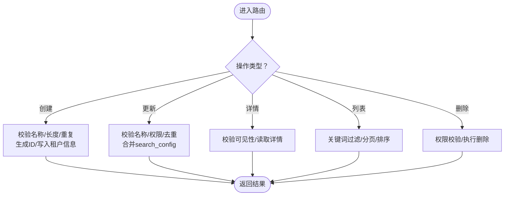
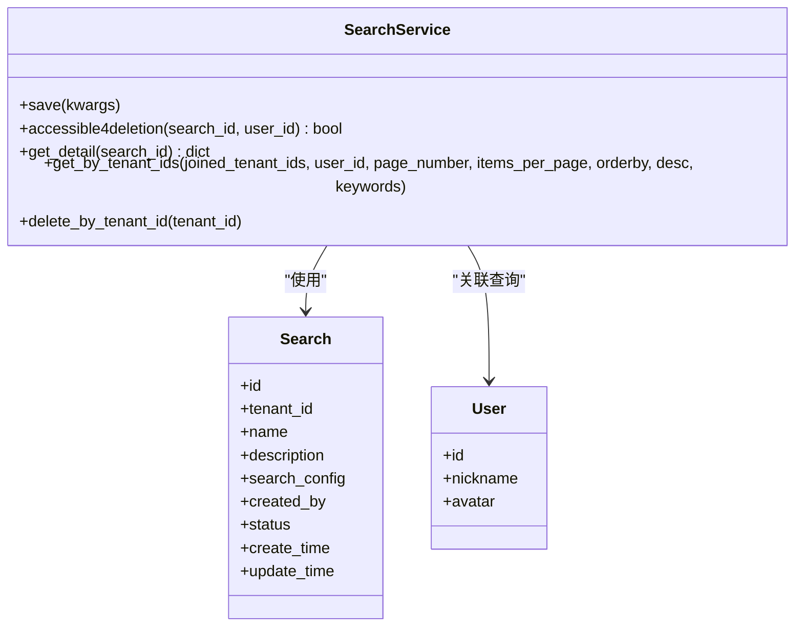
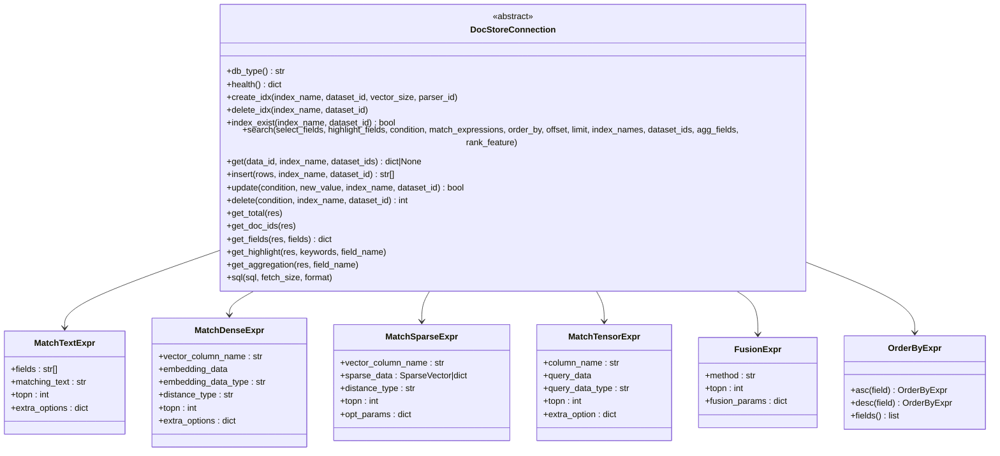
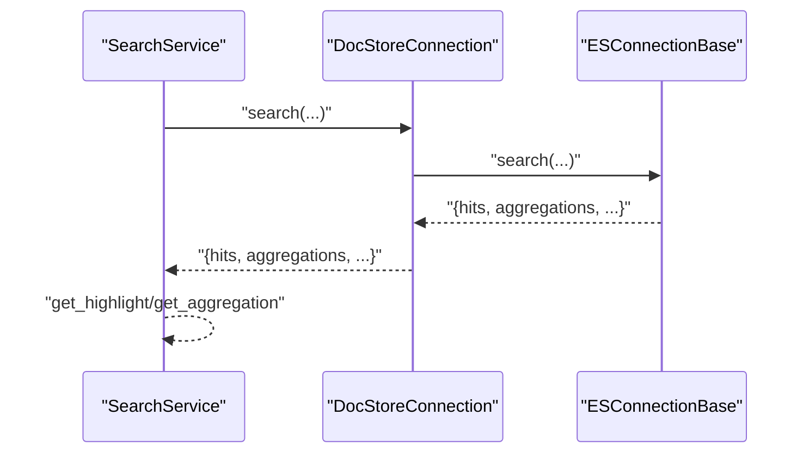
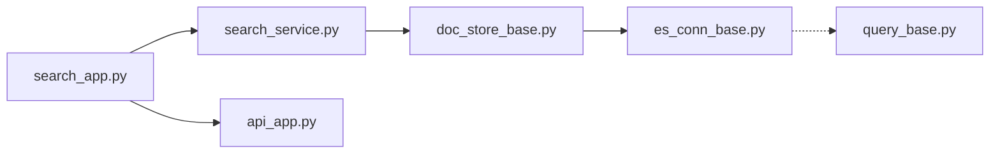

# 搜索检索API

<cite>
**本文引用的文件**
- [search_app.py](file://api/apps/search_app.py)
- [search_service.py](file://api/db/services/search_service.py)
- [doc_store_base.py](file://common/doc_store/doc_store_base.py)
- [es_conn_base.py](file://common/doc_store/es_conn_base.py)
- [query_base.py](file://common/query_base.py)
- [api_app.py](file://api/apps/api_app.py)
</cite>

## 目录
1. [简介](#简介)
2. [项目结构](#项目结构)
3. [核心组件](#核心组件)
4. [架构总览](#架构总览)
5. [详细组件分析](#详细组件分析)
6. [依赖分析](#依赖分析)
7. [性能考虑](#性能考虑)
8. [故障排查指南](#故障排查指南)
9. [结论](#结论)
10. [附录](#附录)

## 简介
本文件面向使用 RAGFlow 的开发者与集成方，系统性梳理“搜索检索”相关能力与接口，覆盖全文搜索、向量检索、稀疏检索、张量检索与混合融合检索的调用方式；详细说明查询参数（相似度阈值、返回条数、过滤条件、排序字段、高亮字段、聚合统计、分页参数等）；介绍高级搜索能力（语义搜索、关键词匹配、时间范围筛选等）；并给出搜索统计、热门查询、搜索建议等扩展能力的接口说明与实践建议。同时提供性能优化与缓存策略的配置要点及多场景检索示例。

## 项目结构
围绕“搜索检索”的关键代码分布在以下模块：
- 应用层路由：负责接收请求、参数校验、鉴权与调用服务层
- 服务层：封装业务逻辑，组织查询表达式与数据模型
- 文档存储抽象：定义统一的检索表达式、排序、高亮、聚合等接口契约
- 具体存储实现：以 Elasticsearch 为例，实现检索、高亮、聚合、SQL 执行等能力
- 查询工具：提供中英文语言识别、特殊字符转义、空词清洗等通用能力

**图表来源**
- [search_app.py:1-188](file://api/apps/search_app.py#L1-L188)
- [search_service.py:1-122](file://api/db/services/search_service.py#L1-L122)
- [doc_store_base.py:1-271](file://common/doc_store/doc_store_base.py#L1-L271)
- [es_conn_base.py:1-309](file://common/doc_store/es_conn_base.py#L1-L309)
- [query_base.py:1-73](file://common/query_base.py#L1-L73)
- [api_app.py:1-118](file://api/apps/api_app.py#L1-L118)

**章节来源**
- [search_app.py:1-188](file://api/apps/search_app.py#L1-L188)
- [search_service.py:1-122](file://api/db/services/search_service.py#L1-L122)
- [doc_store_base.py:1-271](file://common/doc_store/doc_store_base.py#L1-L271)
- [es_conn_base.py:1-309](file://common/doc_store/es_conn_base.py#L1-L309)
- [query_base.py:1-73](file://common/query_base.py#L1-L73)
- [api_app.py:1-118](file://api/apps/api_app.py#L1-L118)

## 核心组件
- 搜索应用管理路由：提供搜索应用的创建、更新、详情、列表、删除等管理接口，支持分页、排序、关键词过滤
- 搜索服务层：封装搜索应用的持久化、权限校验、列表查询、详情查询等
- 文档存储抽象：定义统一的检索表达式（文本、稠密向量、稀疏向量、张量、融合）、排序、高亮、聚合、SQL 等接口
- Elasticsearch 实现：基于 ES 的检索、高亮、聚合、SQL 执行、集群状态查询等
- 查询工具：提供中英文识别、特殊字符转义、空词清洗等基础能力

**章节来源**
- [search_app.py:30-188](file://api/apps/search_app.py#L30-L188)
- [search_service.py:26-122](file://api/db/services/search_service.py#L26-L122)
- [doc_store_base.py:20-271](file://common/doc_store/doc_store_base.py#L20-L271)
- [es_conn_base.py:36-309](file://common/doc_store/es_conn_base.py#L36-L309)
- [query_base.py:20-73](file://common/query_base.py#L20-L73)

## 架构总览
下图展示从应用路由到服务层再到文档存储抽象与具体实现的调用链路，以及检索表达式的类型与组合方式。

**图表来源**
- [search_app.py:30-188](file://api/apps/search_app.py#L30-L188)
- [search_service.py:26-122](file://api/db/services/search_service.py#L26-L122)
- [doc_store_base.py:191-208](file://common/doc_store/doc_store_base.py#L191-L208)
- [es_conn_base.py:187-200](file://common/doc_store/es_conn_base.py#L187-L200)

## 详细组件分析

### 组件一：搜索应用管理路由（search_app.py）
- 功能职责
  - 创建搜索应用：校验名称长度与格式，生成唯一 ID，写入租户上下文
  - 更新搜索应用：支持增量合并配置，权限校验与去重检查
  - 获取详情：按搜索应用 ID 返回详情，含创建者昵称与头像
  - 列表查询：支持关键词过滤、分页、排序字段与方向
  - 删除搜索应用：权限校验后删除
- 关键参数
  - 创建/更新：name、description、search_config（JSON 对象）
  - 列表：keywords、page/page_size、orderby、desc、owner_ids
  - 删除：search_id
- 鉴权与权限
  - 登录态校验
  - 访问控制：仅允许创建者或拥有相应租户权限的用户操作

**图表来源**
- [search_app.py:30-188](file://api/apps/search_app.py#L30-L188)

**章节来源**
- [search_app.py:30-188](file://api/apps/search_app.py#L30-L188)

### 组件二：搜索服务层（search_service.py）
- 功能职责
  - 保存搜索应用：设置创建/更新时间戳与日期
  - 权限校验：仅允许创建者删除
  - 详情查询：关联用户表返回创建者昵称与头像
  - 列表查询：支持关键词模糊匹配、排序、分页与总数统计
  - 批量删除：按租户 ID 删除
- 数据模型
  - 模型：Search
  - 关联：User（tenant_id）

**图表来源**
- [search_service.py:26-122](file://api/db/services/search_service.py#L26-L122)

**章节来源**
- [search_service.py:26-122](file://api/db/services/search_service.py#L26-L122)

### 组件三：文档存储抽象（doc_store_base.py）
- 功能职责
  - 定义统一检索接口：select_fields、highlight_fields、condition、match_expressions、order_by、offset、limit、index_names、dataset_ids、agg_fields、rank_feature
  - 定义检索表达式类型：文本匹配、稠密向量、稀疏向量、张量、融合
  - 定义排序表达式：支持多字段升/降序
  - 定义高亮、聚合、SQL 等辅助方法
- 关键类型
  - MatchTextExpr：字段列表、匹配文本、topn、额外选项
  - MatchDenseExpr：向量列名、embedding 数据、embedding 类型、距离类型、topn、额外选项
  - MatchSparseExpr：向量列名、稀疏向量、距离类型、topn、可选参数
  - MatchTensorExpr：列名、查询数据、数据类型、topn、额外选项
  - FusionExpr：融合方法、topn、融合参数
  - OrderByExpr：多字段排序
- 默认参数
  - DEFAULT_MATCH_VECTOR_TOPN = 10
  - DEFAULT_MATCH_SPARSE_TOPN = 10

**图表来源**
- [doc_store_base.py:143-271](file://common/doc_store/doc_store_base.py#L143-L271)

**章节来源**
- [doc_store_base.py:20-271](file://common/doc_store/doc_store_base.py#L20-L271)

### 组件四：Elasticsearch 实现（es_conn_base.py）
- 功能职责
  - 连接与健康检查：ping、cluster.health、cluster.stats
  - 索引管理：创建、删除、存在性检查
  - 检索：search 接口（由上层传入表达式与参数）
  - 单条获取：get
  - 插入/更新/删除：批量插入、条件更新、条件删除
  - 结果处理：总数、文档 ID、字段提取、高亮、聚合
  - SQL：将 SQL 转换为 ES DSL 并执行
- 高亮策略
  - 支持对指定字段进行高亮，自动拼接片段并保留英文段落结构
- 聚合统计
  - 提供聚合桶统计，便于热门查询、分类统计等场景

**图表来源**
- [es_conn_base.py:187-200](file://common/doc_store/es_conn_base.py#L187-L200)
- [doc_store_base.py:191-208](file://common/doc_store/doc_store_base.py#L191-L208)

**章节来源**
- [es_conn_base.py:36-309](file://common/doc_store/es_conn_base.py#L36-L309)

### 组件五：查询工具（query_base.py）
- 功能职责
  - 中文判断：用于区分中英文语境，指导后续处理策略
  - 特殊字符转义：避免在全文检索中误触发语法
  - 空词清洗：去除无意义前缀/后缀，提升检索质量
  - 英文/中文空格处理：在中英混排场景下增加空格以提升匹配效果

**章节来源**
- [query_base.py:20-73](file://common/query_base.py#L20-L73)

## 依赖分析
- 应用层路由依赖服务层，服务层依赖数据模型与通用服务
- 服务层通过文档存储抽象与具体实现解耦
- Elasticsearch 实现遵循文档存储抽象接口，保证可替换性
- 查询工具为检索前置处理提供语言与文本层面的支持

**图表来源**
- [search_app.py:17-27](file://api/apps/search_app.py#L17-L27)
- [search_service.py:20-23](file://api/db/services/search_service.py#L20-L23)
- [doc_store_base.py:16-23](file://common/doc_store/doc_store_base.py#L16-L23)
- [es_conn_base.py:29-31](file://common/doc_store/es_conn_base.py#L29-L31)
- [api_app.py:17-23](file://api/apps/api_app.py#L17-L23)
- [query_base.py:16-17](file://common/query_base.py#L16-L17)

**章节来源**
- [search_app.py:17-27](file://api/apps/search_app.py#L17-L27)
- [search_service.py:20-23](file://api/db/services/search_service.py#L20-L23)
- [doc_store_base.py:16-23](file://common/doc_store/doc_store_base.py#L16-L23)
- [es_conn_base.py:29-31](file://common/doc_store/es_conn_base.py#L29-L31)
- [api_app.py:17-23](file://api/apps/api_app.py#L17-L23)
- [query_base.py:16-17](file://common/query_base.py#L16-L17)

## 性能考虑
- 向量检索
  - 控制 topn：默认稠密向量与稀疏向量 topn 为 10，可根据召回质量与延迟权衡调整
  - 距离类型：选择合适的距离度量（如内积、余弦、欧氏）以匹配嵌入空间
- 全文检索
  - 使用高亮字段与片段拼接，减少传输体积
  - 合理使用 extra_options/opt_params，避免过度复杂查询
- 混合检索
  - 融合方法与融合参数需结合业务验证，避免过度稀释
- 分页与排序
  - 大偏移分页会带来性能问题，建议使用游标/时间窗口分页
  - 排序字段尽量命中索引，避免实时计算字段排序
- 缓存策略
  - 对热点查询结果进行短期缓存（如热门问题、固定问答）
  - 对高亮与聚合结果进行缓存，降低重复计算成本
- 存储与索引
  - 合理设置映射与分片副本，确保查询与写入均衡
  - 定期维护索引（合并、刷新），保持查询性能稳定

[本节为通用性能建议，不直接分析具体文件，故无“章节来源”]

## 故障排查指南
- 鉴权失败
  - 确认登录态有效且具备对应租户权限
  - 检查访问控制逻辑（创建者权限）
- 参数错误
  - 名称长度与格式校验失败
  - search_config 必须为 JSON 对象
- 查询超时
  - 检查 ES 连接与健康状态
  - 适当增大超时时间或优化查询表达式
- 高亮异常
  - 确认高亮字段存在且命中
  - 英文与中文高亮策略不同，注意字段内容的语言特征
- 聚合为空
  - 检查聚合字段是否存在与可聚合
  - 确认查询条件是否过于严格导致无结果

**章节来源**
- [search_app.py:30-188](file://api/apps/search_app.py#L30-L188)
- [es_conn_base.py:68-121](file://common/doc_store/es_conn_base.py#L68-L121)
- [es_conn_base.py:238-261](file://common/doc_store/es_conn_base.py#L238-L261)

## 结论
RAGFlow 的搜索检索体系以“应用路由—服务层—文档存储抽象—具体实现”的分层设计为核心，既保证了查询表达式的统一与可扩展，又通过 ES 实现提供了成熟的全文与向量检索能力。通过合理配置检索参数、排序与高亮、实施缓存与索引优化策略，可在不同业务场景下获得稳定且高性能的检索体验。

[本节为总结性内容，不直接分析具体文件，故无“章节来源”]

## 附录

### API 参考与参数说明

- 搜索应用管理
  - 创建搜索应用
    - 方法与路径：POST /create
    - 请求体字段：name（字符串，必填）、description（字符串，可选）
    - 返回：search_id
  - 更新搜索应用
    - 方法与路径：POST /update
    - 请求体字段：search_id（字符串，必填）、name（字符串，必填）、search_config（JSON 对象，必填）、tenant_id（字符串，必填）
    - 行为：支持增量合并 search_config
  - 获取详情
    - 方法与路径：GET /detail?search_id=...
    - 返回：包含创建者昵称与头像的详情对象
  - 列表查询
    - 方法与路径：POST /list
    - 查询参数：keywords（字符串，可选）、page（整数，可选，默认0）、page_size（整数，可选，默认0）、orderby（字符串，可选，默认create_time）、desc（布尔，可选，默认true）
    - 请求体字段：owner_ids（数组，可选）
  - 删除搜索应用
    - 方法与路径：POST /rm
    - 请求体字段：search_id（字符串，必填）

- 检索查询（示例）
  - 全文搜索
    - 表达式：MatchTextExpr
    - 关键参数：fields（字段列表）、matching_text（查询文本）、topn（返回条数）
  - 向量检索
    - 表达式：MatchDenseExpr
    - 关键参数：vector_column_name（向量列名）、embedding_data（向量数据）、embedding_data_type（向量类型）、distance_type（距离类型）、topn（返回条数）
  - 稀疏检索
    - 表达式：MatchSparseExpr
    - 关键参数：vector_column_name（向量列名）、sparse_data（稀疏向量）、distance_type（距离类型）、topn（返回条数）、opt_params（可选参数）
  - 张量检索
    - 表达式：MatchTensorExpr
    - 关键参数：column_name（列名）、query_data（查询数据）、query_data_type（数据类型）、topn（返回条数）、extra_option（额外选项）
  - 混合检索
    - 表达式：FusionExpr
    - 关键参数：method（融合方法）、topn（返回条数）、fusion_params（融合参数）
  - 排序
    - 表达式：OrderByExpr
    - 关键参数：多字段升/降序
  - 高亮
    - 参数：highlight_fields（高亮字段列表）
    - 实现：ES 高亮片段拼接与英文段落保留
  - 聚合
    - 参数：agg_fields（聚合字段列表）
    - 实现：桶聚合统计
  - 分页
    - 参数：offset（偏移）、limit（条数）
  - 过滤条件
    - 参数：condition（条件字典）
  - 时间范围筛选
    - 建议：通过 condition 中的时间字段进行范围过滤
  - 相似度阈值
    - 建议：通过 match_expressions 的 topn 与距离类型控制召回质量
  - 返回数量
    - 建议：优先使用 topn 控制返回条数，避免大偏移分页

- 搜索统计与热门查询
  - API 统计
    - 方法与路径：GET /stats
    - 查询参数：from_date（开始日期，可选，默认近7天）、to_date（结束日期，可选）
    - 返回：pv、uv、速度、tokens、轮次、点赞等指标序列

**章节来源**
- [search_app.py:30-188](file://api/apps/search_app.py#L30-L188)
- [doc_store_base.py:56-127](file://common/doc_store/doc_store_base.py#L56-L127)
- [es_conn_base.py:187-200](file://common/doc_store/es_conn_base.py#L187-L200)
- [api_app.py:85-118](file://api/apps/api_app.py#L85-L118)

### 多场景检索示例（步骤说明）
- 场景一：关键词+时间范围
  - 步骤：构造 MatchTextExpr（fields、matching_text、topn），在 condition 中加入时间范围字段，设置 order_by 按时间倒序，使用 offset/limit 分页
- 场景二：语义搜索
  - 步骤：构造 MatchDenseExpr（向量列名、embedding_data、embedding_data_type、distance_type、topn），根据业务需要设置 extra_options
- 场景三：混合检索
  - 步骤：构造多个 MatchExpr（文本/向量/稀疏/张量），使用 FusionExpr（method、topn、fusion_params）进行融合
- 场景四：高亮与聚合
  - 步骤：在 search 调用中传入 highlight_fields 与 agg_fields，分别获取高亮片段与聚合桶统计
- 场景五：热门查询
  - 步骤：通过聚合统计（如按关键词字段聚合）获取热门词，结合 API 统计查看趋势

[本节为概念性示例，不直接分析具体文件，故无“章节来源”]