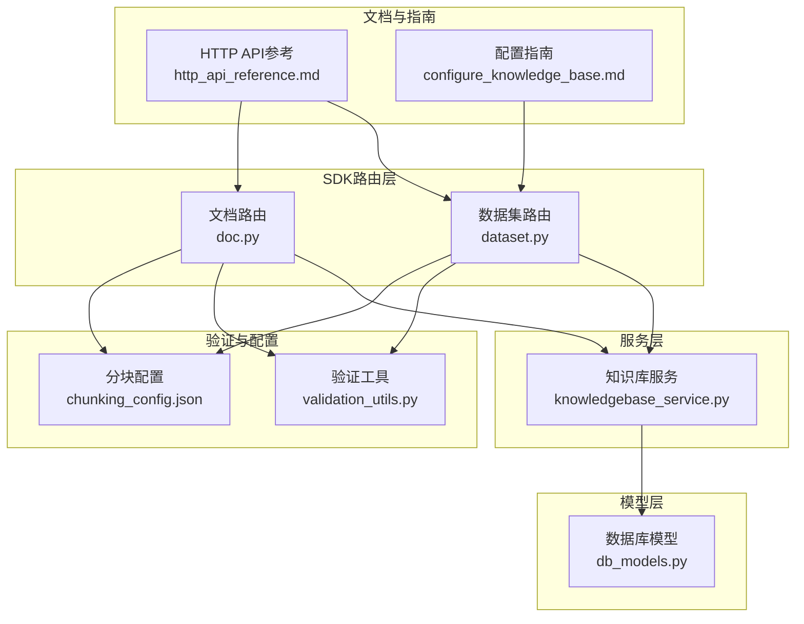
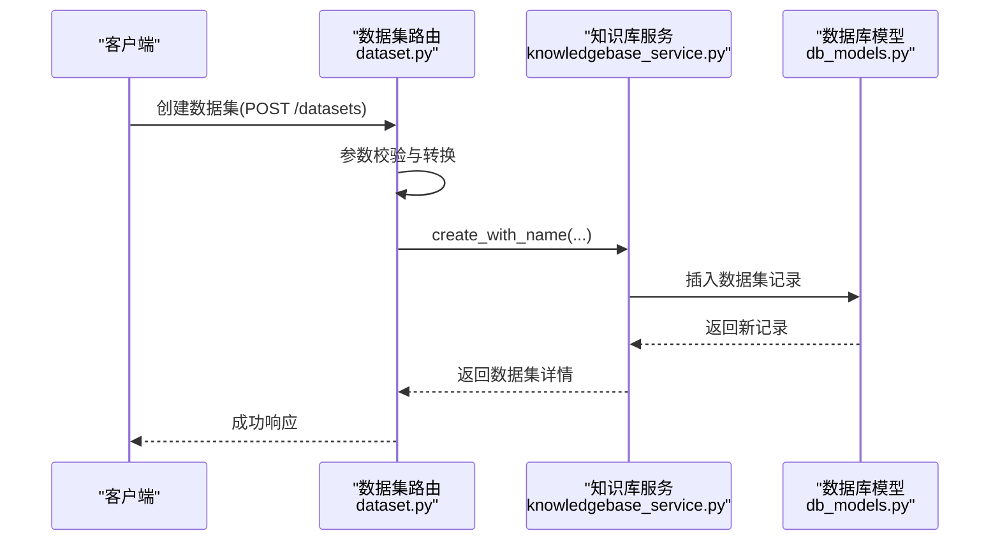
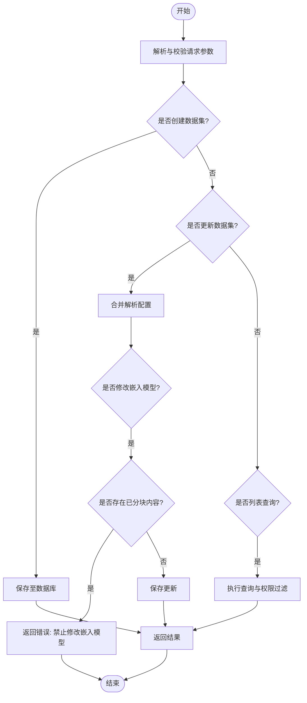
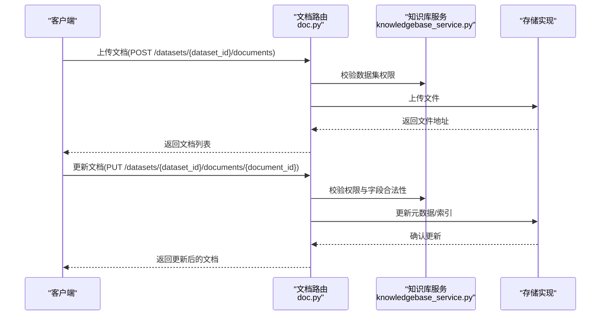
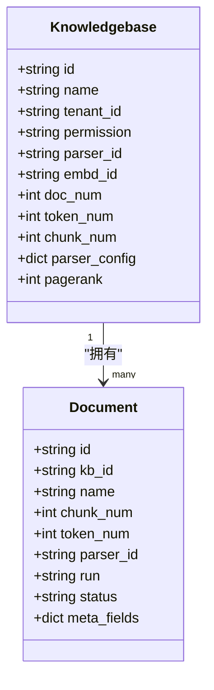
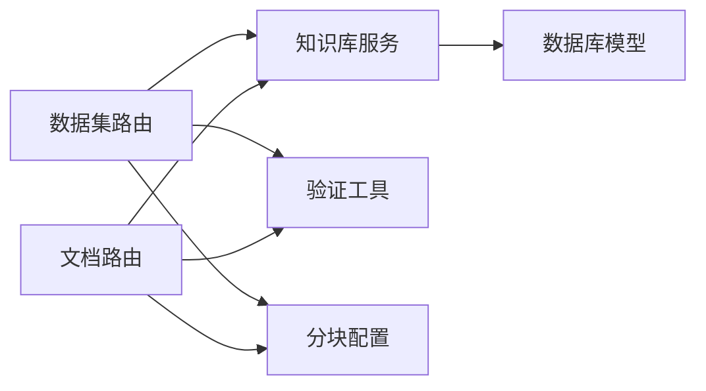

# 数据集管理API

<cite>
**本文档引用的文件**
- [dataset.py](file://api/apps/sdk/dataset.py)
- [doc.py](file://api/apps/sdk/doc.py)
- [knowledgebase_service.py](file://api/db/services/knowledgebase_service.py)
- [db_models.py](file://api/db/db_models.py)
- [validation_utils.py](file://api/utils/validation_utils.py)
- [http_api_reference.md](file://docs/reference/http_api_reference.md)
- [configure_knowledge_base.md](file://docs/guides/dataset/configure_knowledge_base.md)
- [chunking_config.json](file://conf/chunking_config.json)
- [share_knowledge_bases.md](file://docs/guides/team/share_knowledge_bases.md)
- [common.py](file://test/testcases/test_http_api/common.py)
- [test_update_dataset.py](file://test/testcases/test_sdk_api/test_dataset_mangement/test_update_dataset.py)
- [test_create_dataset.py](file://test/testcases/test_sdk_api/test_dataset_mangement/test_create_dataset.py)
- [test_update_document.py](file://test/testcases/test_sdk_api/test_file_management_within_dataset/test_update_document.py)
</cite>

## 目录
1. [简介](#简介)
2. [项目结构](#项目结构)
3. [核心组件](#核心组件)
4. [架构总览](#架构总览)
5. [详细组件分析](#详细组件分析)
6. [依赖关系分析](#依赖关系分析)
7. [性能考虑](#性能考虑)
8. [故障排除指南](#故障排除指南)
9. [结论](#结论)
10. [附录](#附录)

## 简介
本文件为数据集管理API的完整参考文档，覆盖知识库（数据集）的创建、更新、删除、查询等核心操作；详细说明数据集配置选项（分块策略、向量化设置、元数据管理）；数据集与文档的关联关系管理接口；权限控制、共享设置与版本管理；以及批量操作、导入导出、性能优化等相关接口。同时提供完整的调用示例与错误处理方案。

## 项目结构
数据集管理API主要由以下模块构成：
- SDK路由层：负责HTTP请求解析、参数校验、鉴权与响应封装
- 服务层：封装业务逻辑，协调数据库与存储系统
- 模型层：定义数据库表结构与字段类型
- 验证工具：统一的请求体与查询参数校验机制
- 文档与配置：官方文档与分块策略配置

**图表来源**
- [dataset.py:55-699](file://api/apps/sdk/dataset.py#L55-L699)
- [doc.py:72-800](file://api/apps/sdk/doc.py#L72-L800)
- [knowledgebase_service.py:32-567](file://api/db/services/knowledgebase_service.py#L32-L567)
- [db_models.py:780-820](file://api/db/db_models.py#L780-L820)
- [validation_utils.py:37-176](file://api/utils/validation_utils.py#L37-L176)
- [chunking_config.json:1-66](file://conf/chunking_config.json#L1-L66)
- [http_api_reference.md:619-1965](file://docs/reference/http_api_reference.md#L619-L1965)
- [configure_knowledge_base.md:40-57](file://docs/guides/dataset/configure_knowledge_base.md#L40-L57)

**章节来源**
- [dataset.py:55-699](file://api/apps/sdk/dataset.py#L55-L699)
- [doc.py:72-800](file://api/apps/sdk/doc.py#L72-L800)
- [knowledgebase_service.py:32-567](file://api/db/services/knowledgebase_service.py#L32-L567)
- [db_models.py:780-820](file://api/db/db_models.py#L780-L820)
- [validation_utils.py:37-176](file://api/utils/validation_utils.py#L37-L176)
- [chunking_config.json:1-66](file://conf/chunking_config.json#L1-L66)
- [http_api_reference.md:619-1965](file://docs/reference/http_api_reference.md#L619-L1965)
- [configure_knowledge_base.md:40-57](file://docs/guides/dataset/configure_knowledge_base.md#L40-L57)

## 核心组件
- 数据集路由（dataset.py）
  - 提供创建、删除、更新、列表查询、知识图谱、GraphRAG/RAPTOR任务管理等接口
  - 统一鉴权与参数校验，返回标准JSON结果
- 文档路由（doc.py）
  - 提供上传、下载、更新、列表、元数据批量更新、删除等文档管理接口
  - 支持按元数据条件筛选与批量更新
- 知识库服务（knowledgebase_service.py）
  - 封装数据集的增删改查、访问控制、解析状态检查、解析配置合并等
- 数据库模型（db_models.py）
  - 定义数据集、文档、文件、任务等核心实体及其字段
- 验证工具（validation_utils.py）
  - 统一的请求体与查询参数校验流程，支持额外字段注入与排除未设置字段
- 分块配置（chunking_config.json）
  - 提供默认与结构感知等分块策略、内容保护与性能参数

**章节来源**
- [dataset.py:55-699](file://api/apps/sdk/dataset.py#L55-L699)
- [doc.py:72-800](file://api/apps/sdk/doc.py#L72-L800)
- [knowledgebase_service.py:32-567](file://api/db/services/knowledgebase_service.py#L32-L567)
- [db_models.py:780-820](file://api/db/db_models.py#L780-L820)
- [validation_utils.py:37-176](file://api/utils/validation_utils.py#L37-L176)
- [chunking_config.json:1-66](file://conf/chunking_config.json#L1-L66)

## 架构总览
数据集管理API采用分层架构：
- 路由层：接收HTTP请求，进行鉴权与参数校验
- 服务层：执行业务逻辑，访问数据库与存储
- 模型层：持久化数据结构
- 配置层：分块策略与性能参数

**图表来源**
- [dataset.py:55-155](file://api/apps/sdk/dataset.py#L55-L155)
- [knowledgebase_service.py:376-430](file://api/db/services/knowledgebase_service.py#L376-L430)
- [db_models.py:780-820](file://api/db/db_models.py#L780-L820)

## 详细组件分析

### 数据集管理接口
- 创建数据集
  - 方法与路径：POST /api/v1/datasets
  - 请求体字段：name（必填）、avatar（可选）、description（可选）、embedding_model（可选）、permission（可选枚举：me/team）、chunk_method（可选枚举）、parser_config（可选对象）
  - 响应：返回新建数据集的完整信息
  - 关键行为：自动填充默认嵌入模型；校验名称唯一性；生成默认解析配置
- 删除数据集
  - 方法与路径：DELETE /api/v1/datasets
  - 请求体字段：ids（数组或null），null表示删除租户下所有数据集
  - 响应：返回成功计数与失败详情
  - 关键行为：逐个删除数据集下的文档、文件、索引；权限校验仅允许创建者删除
- 更新数据集
  - 方法与路径：PUT /api/v1/datasets/{dataset_id}
  - 请求体字段：name、avatar、description、embedding_model、permission、chunk_method、pagerank、parser_config
  - 响应：返回更新后的数据集信息
  - 关键行为：支持部分字段更新；当存在已分块内容时禁止修改嵌入模型；支持深度合并解析配置
- 列表查询
  - 方法与路径：GET /api/v1/datasets?page=&page_size=&orderby=&desc=&name=&id=
  - 查询参数：id、name、page、page_size、orderby（create_time/update_time）、desc、name、id
  - 响应：返回数据集列表与总数
  - 关键行为：支持多租户联合查询与权限过滤

**图表来源**
- [dataset.py:55-392](file://api/apps/sdk/dataset.py#L55-L392)
- [knowledgebase_service.py:376-430](file://api/db/services/knowledgebase_service.py#L376-L430)

**章节来源**
- [dataset.py:55-392](file://api/apps/sdk/dataset.py#L55-L392)
- [http_api_reference.md:619-816](file://docs/reference/http_api_reference.md#L619-L816)
- [knowledgebase_service.py:376-430](file://api/db/services/knowledgebase_service.py#L376-L430)

### 文档与数据集关联关系管理
- 上传文档
  - 方法与路径：POST /api/v1/datasets/{dataset_id}/documents
  - 表单字段：file（必填）、parent_path（可选）
  - 响应：返回上传的文档列表（包含文档ID、名称、分块数量、token数量、数据集ID、分块方法、处理状态）
- 更新文档
  - 方法与路径：PUT /api/v1/datasets/{dataset_id}/documents/{document_id}
  - 请求体字段：name、parser_config、chunk_method、enabled、meta_fields
  - 响应：返回更新后的文档信息
  - 关键行为：支持元数据字典更新；禁止修改分块数量、token数量、进度；当切换分块方法时重置解析状态
- 下载文档
  - 方法与路径：GET /api/v1/datasets/{dataset_id}/documents/{document_id}
  - 响应：返回文档文件流
- 列表查询
  - 方法与路径：GET /api/v1/datasets/{dataset_id}/documents
  - 查询参数：id、page、page_size、orderby、desc、create_time_from、create_time_to、suffix、run、metadata_condition
  - 响应：返回文档列表与总数
  - 关键行为：支持按元数据条件筛选；运行状态支持文本与数值格式互转
- 元数据批量更新
  - 方法与路径：POST /api/v1/datasets/{dataset_id}/metadata/update
  - 请求体字段：selector（选择器，支持document_ids与metadata_condition）、updates（更新项列表）、deletes（删除键列表）
  - 响应：返回匹配文档数与更新数量
- 删除文档
  - 方法与路径：DELETE /api/v1/datasets/{dataset_id}/documents
  - 请求体字段：ids（可选，为空则删除数据集下全部文档）
  - 响应：返回删除结果与错误信息

**图表来源**
- [doc.py:72-777](file://api/apps/sdk/doc.py#L72-L777)
- [knowledgebase_service.py:474-515](file://api/db/services/knowledgebase_service.py#L474-L515)

**章节来源**
- [doc.py:72-777](file://api/apps/sdk/doc.py#L72-L777)
- [http_api_reference.md:1896-1962](file://docs/reference/http_api_reference.md#L1896-L1962)

### 数据集配置选项
- 分块策略
  - 支持的模板：naive、book、email、laws、manual、one、paper、picture、presentation、qa、table、tag
  - 默认模板：naive
  - 参考：配置指南中列出各模板的适用格式与描述
- 向量化设置
  - 嵌入模型：可指定数据集使用的嵌入模型ID；若未指定则使用租户默认
  - 当数据集中已有分块且修改嵌入模型时会触发限制
- 解析配置
  - 支持深度合并解析配置；当切换分块方法时可自动应用默认配置
- 页面排序（pagerank）
  - 仅在特定文档引擎下可用；更新时需满足引擎要求

**图表来源**
- [db_models.py:780-820](file://api/db/db_models.py#L780-L820)

**章节来源**
- [configure_knowledge_base.md:40-57](file://docs/guides/dataset/configure_knowledge_base.md#L40-L57)
- [dataset.py:263-392](file://api/apps/sdk/dataset.py#L263-L392)
- [knowledgebase_service.py:296-331](file://api/db/services/knowledgebase_service.py#L296-L331)

### 权限控制、共享设置与版本管理
- 权限控制
  - 数据集权限：me（仅本人）、team（团队共享）
  - 访问控制：仅数据集创建者可删除；列表查询支持多租户联合与权限过滤
- 共享设置
  - 在配置页面将权限从“仅我”改为“团队”后，团队成员可见并可操作
- 版本管理
  - 通过任务ID跟踪GraphRAG与RAPTOR任务状态，支持任务追踪与重试

**章节来源**
- [dataset.py:395-488](file://api/apps/sdk/dataset.py#L395-L488)
- [knowledgebase_service.py:51-83](file://api/db/services/knowledgebase_service.py#L51-L83)
- [share_knowledge_bases.md:1-20](file://docs/guides/team/share_knowledge_bases.md#L1-L20)

### 批量操作、导入导出与性能优化
- 批量操作
  - 删除数据集：支持ids数组或全量删除
  - 元数据批量更新：支持按文档ID列表或元数据条件筛选
- 导入导出
  - 上传：支持多文件上传，受文件名长度限制
  - 下载：返回文档文件流
- 性能优化
  - 分块策略配置：提供默认、结构感知与语义分割策略
  - 内容保护：保护数学公式、图片、表格、代码块等元素
  - 性能参数：并发进程数、内存限制、超时时间、批大小等

**章节来源**
- [doc.py:72-181](file://api/apps/sdk/doc.py#L72-L181)
- [http_api_reference.md:619-816](file://docs/reference/http_api_reference.md#L619-L816)
- [chunking_config.json:1-66](file://conf/chunking_config.json#L1-L66)

## 依赖关系分析
- 路由层依赖服务层进行业务处理
- 服务层依赖模型层进行数据持久化
- 验证工具贯穿路由层与服务层，确保输入合法
- 配置文件为分块策略与性能参数提供依据

**图表来源**
- [dataset.py:55-699](file://api/apps/sdk/dataset.py#L55-L699)
- [doc.py:72-800](file://api/apps/sdk/doc.py#L72-L800)
- [knowledgebase_service.py:32-567](file://api/db/services/knowledgebase_service.py#L32-L567)
- [validation_utils.py:37-176](file://api/utils/validation_utils.py#L37-L176)
- [chunking_config.json:1-66](file://conf/chunking_config.json#L1-L66)

**章节来源**
- [dataset.py:55-699](file://api/apps/sdk/dataset.py#L55-L699)
- [doc.py:72-800](file://api/apps/sdk/doc.py#L72-L800)
- [knowledgebase_service.py:32-567](file://api/db/services/knowledgebase_service.py#L32-L567)
- [validation_utils.py:37-176](file://api/utils/validation_utils.py#L37-L176)
- [chunking_config.json:1-66](file://conf/chunking_config.json#L1-L66)

## 性能考虑
- 分块策略选择
  - 结构感知策略适合含表格、图片的文档，提升检索质量
  - 语义分割策略基于相似度聚类，适合长文档
- 并发与资源限制
  - 控制最大并发进程数与内存占用，避免资源耗尽
  - 设置合理超时时间与批大小，平衡吞吐与延迟
- 索引与排序
  - pagerank仅在特定引擎下可用，更新时需满足引擎约束

[本节为通用指导，无需具体文件分析]

## 故障排除指南
- 常见错误码与含义
  - 数据集名称重复：创建/更新时名称冲突
  - 权限不足：非数据集创建者尝试删除
  - 嵌入模型不可变：数据集存在分块内容时禁止修改嵌入模型
  - 参数校验失败：请求体非JSON、字段类型不符、枚举值非法
- 排查步骤
  - 确认鉴权头与API密钥有效
  - 检查请求体字段类型与枚举值
  - 若涉及嵌入模型变更，确认数据集是否已有分块
  - 查看服务日志定位数据库异常

**章节来源**
- [http_api_reference.md:619-816](file://docs/reference/http_api_reference.md#L619-L816)
- [dataset.py:156-260](file://api/apps/sdk/dataset.py#L156-L260)
- [doc.py:670-777](file://api/apps/sdk/doc.py#L670-L777)

## 结论
数据集管理API提供了完善的数据集生命周期管理能力，涵盖创建、更新、删除、查询、文档关联、权限控制与任务追踪等功能。通过标准化的参数校验与错误处理机制，结合灵活的分块策略与性能配置，能够满足不同场景下的RAG应用需求。

[本节为总结，无需具体文件分析]

## 附录

### API端点一览
- 数据集
  - POST /api/v1/datasets：创建数据集
  - DELETE /api/v1/datasets：删除数据集
  - PUT /api/v1/datasets/{dataset_id}：更新数据集
  - GET /api/v1/datasets：列表查询
- 文档
  - POST /api/v1/datasets/{dataset_id}/documents：上传文档
  - PUT /api/v1/datasets/{dataset_id}/documents/{document_id}：更新文档
  - GET /api/v1/datasets/{dataset_id}/documents/{document_id}：下载文档
  - GET /api/v1/datasets/{dataset_id}/documents：列表查询
  - POST /api/v1/datasets/{dataset_id}/metadata/update：元数据批量更新
  - DELETE /api/v1/datasets/{dataset_id}/documents：删除文档

**章节来源**
- [http_api_reference.md:619-1965](file://docs/reference/http_api_reference.md#L619-L1965)

### 测试与示例
- 单元测试覆盖
  - 数据集创建：验证分块方法与权限默认值
  - 数据集更新：验证分块方法与权限有效性
  - 文档更新：验证分块方法与元数据更新
- HTTP测试示例
  - 批量创建与删除数据集
  - 文件上传与下载

**章节来源**
- [test_create_dataset.py:273-338](file://test/testcases/test_sdk_api/test_dataset_mangement/test_create_dataset.py#L273-L338)
- [test_update_dataset.py:297-328](file://test/testcases/test_sdk_api/test_dataset_mangement/test_update_dataset.py#L297-L328)
- [test_update_document.py:66-104](file://test/testcases/test_sdk_api/test_file_management_within_dataset/test_update_document.py#L66-L104)
- [common.py:60-106](file://test/testcases/test_http_api/common.py#L60-L106)