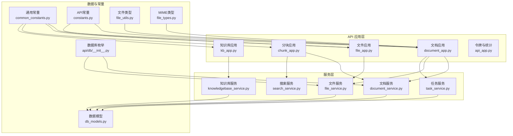
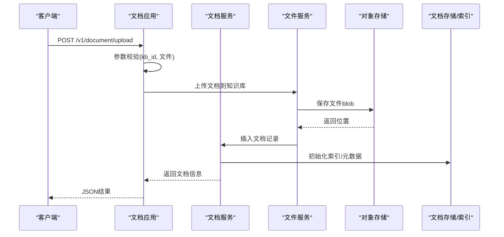
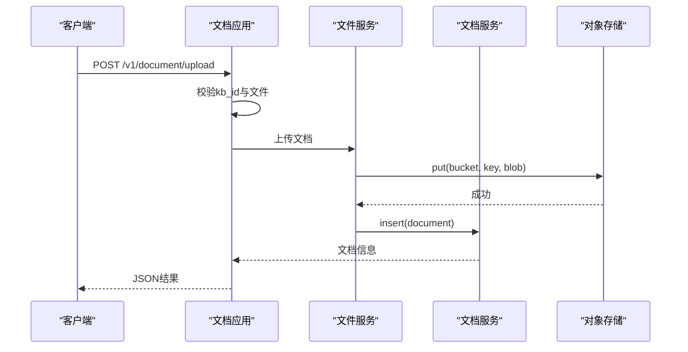
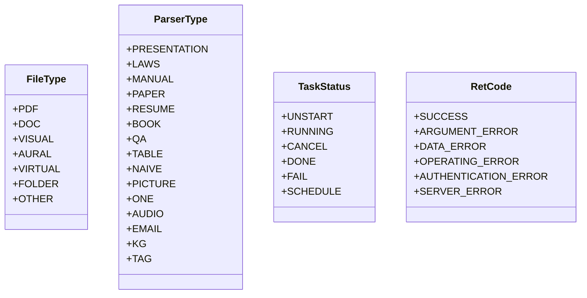

# 文档管理API

<cite>
**本文档引用的文件**
- [document_app.py](file://api/apps/document_app.py)
- [file_app.py](file://api/apps/file_app.py)
- [chunk_app.py](file://api/apps/chunk_app.py)
- [kb_app.py](file://api/apps/kb_app.py)
- [document_service.py](file://api/db/services/document_service.py)
- [file_service.py](file://api/db/services/file_service.py)
- [db_models.py](file://api/db/db_models.py)
- [constants.py](file://api/constants.py)
- [common_constants.py](file://common/constants.py)
- [file_utils.py](file://api/utils/file_utils.py)
- [api_app.py](file://api/apps/api_app.py)
- [__init__.py](file://api/db/__init__.py)
- [file_types.py](file://common/data_source/file_types.py)
</cite>

## 目录
1. [简介](#简介)
2. [项目结构](#项目结构)
3. [核心组件](#核心组件)
4. [架构总览](#架构总览)
5. [详细组件分析](#详细组件分析)
6. [依赖分析](#依赖分析)
7. [性能考虑](#性能考虑)
8. [故障排查指南](#故障排查指南)
9. [结论](#结论)
10. [附录](#附录)

## 简介
本文件为“文档管理API”的权威参考文档，覆盖文档上传、下载、删除、元数据管理、状态跟踪与进度查询、批量操作、文件夹管理、搜索过滤、文档预览、分块信息查询与引用统计等能力。文档同时说明支持的文件格式、大小限制与解析选项，并提供请求示例与响应格式说明，帮助开发者快速集成与排障。

## 项目结构
文档管理API由多个应用模块协同实现：
- 文档应用：负责文档生命周期管理（上传、列表、重命名、删除、状态变更、元数据更新、运行解析、抓取网页转PDF等）
- 文件应用：负责通用文件系统操作（上传、列表、创建目录、移动、重命名、删除、获取文件内容）
- 分块应用：负责文档分块检索、编辑、删除、创建以及检索测试
- 知识库应用：负责知识库维度的标签、图谱、元数据、管道日志与大模型任务追踪
- 数据服务层：封装数据库访问与业务逻辑（文档、文件、知识库、任务、搜索等）
- 常量与工具：统一常量定义、文件类型识别、内容类型映射、长度限制等

图表来源
- [document_app.py:52-98](file://api/apps/document_app.py#L52-L98)
- [file_app.py:37-127](file://api/apps/file_app.py#L37-L127)
- [chunk_app.py:47-95](file://api/apps/chunk_app.py#L47-L95)
- [kb_app.py:54-74](file://api/apps/kb_app.py#L54-L74)
- [document_service.py:46-169](file://api/db/services/document_service.py#L46-L169)
- [file_service.py:43-92](file://api/db/services/file_service.py#L43-L92)
- [db_models.py:134-200](file://api/db/db_models.py#L134-L200)
- [common_constants.py:42-138](file://common/constants.py#L42-L138)
- [constants.py:16-29](file://api/constants.py#L16-L29)
- [file_utils.py:40-54](file://api/utils/file_utils.py#L40-L54)
- [__init__.py:38-47](file://api/db/__init__.py#L38-L47)
- [file_types.py:14-40](file://common/data_source/file_types.py#L14-L40)

章节来源
- [document_app.py:52-98](file://api/apps/document_app.py#L52-L98)
- [file_app.py:37-127](file://api/apps/file_app.py#L37-L127)
- [chunk_app.py:47-95](file://api/apps/chunk_app.py#L47-L95)
- [kb_app.py:54-74](file://api/apps/kb_app.py#L54-L74)

## 核心组件
- 文档应用（/v1/document）：提供文档上传、网页抓取转PDF、虚拟文档创建、文档列表与过滤、元数据汇总与更新、状态变更、重命名、删除、运行解析、解析器切换、缩略图获取、文档内容下载、图片回取等接口。
- 文件应用（/v1/file）：提供文件上传、目录创建、目录列表、父目录与所有父级目录查询、重命名、移动、删除、获取文件内容等接口。
- 分块应用（/v1/chunk）：提供分块列表、分块详情、分块更新、分块删除、分块创建、检索测试、知识图谱提取等接口。
- 知识库应用（/v1/kb）：提供知识库创建/更新/删除/详情、标签管理、知识图谱、元数据查询、管道日志与大模型任务追踪等接口。
- 令牌与统计（/v1/api）：提供API令牌生成、列表、删除与对话统计等接口。

章节来源
- [document_app.py:52-98](file://api/apps/document_app.py#L52-L98)
- [file_app.py:37-127](file://api/apps/file_app.py#L37-L127)
- [chunk_app.py:47-95](file://api/apps/chunk_app.py#L47-L95)
- [kb_app.py:54-74](file://api/apps/kb_app.py#L54-L74)
- [api_app.py:26-118](file://api/apps/api_app.py#L26-L118)

## 架构总览
文档管理API采用分层架构：
- 表现层：各应用模块（document_app、file_app、chunk_app、kb_app、api_app）定义HTTP路由与参数校验
- 服务层：document_service、file_service等封装业务逻辑与数据库交互
- 数据层：db_models定义ORM模型与字段序列化
- 常量与工具：统一错误码、任务状态、文件类型、长度限制、MIME类型映射、文件类型识别等

图表来源
- [document_app.py:52-98](file://api/apps/document_app.py#L52-L98)
- [file_service.py:43-92](file://api/db/services/file_service.py#L43-L92)
- [document_service.py:128-169](file://api/db/services/document_service.py#L128-L169)

## 详细组件分析

### 文档上传与解析
- 接口：POST /v1/document/upload
- 功能：将本地或远程文件上传至指定知识库；自动识别文件类型并初始化文档记录；触发解析流程（异步）。
- 请求参数：
  - 表单字段：kb_id（知识库ID）、file（文件流，可多文件）
  - 校验：文件名长度限制、授权校验（仅知识库所属团队成员）
- 响应：返回上传成功的文件信息数组
- 错误码：参数错误、服务器错误、数据错误、认证错误

图表来源
- [document_app.py:52-98](file://api/apps/document_app.py#L52-L98)
- [file_service.py:43-92](file://api/db/services/file_service.py#L43-L92)
- [constants.py](file://api/constants.py#L26)

章节来源
- [document_app.py:52-98](file://api/apps/document_app.py#L52-L98)
- [file_utils.py:40-54](file://api/utils/file_utils.py#L40-L54)
- [constants.py](file://api/constants.py#L26)

### 网页抓取与PDF转换
- 接口：POST /v1/document/web_crawl
- 功能：将URL抓取为PDF并作为文档入库，自动设置解析器类型与缩略图。
- 请求参数：kb_id、name、url（需为有效URL）
- 响应：布尔成功标志
- 错误：URL格式无效、下载失败、授权失败

章节来源
- [document_app.py:100-163](file://api/apps/document_app.py#L100-L163)

### 虚拟文档创建
- 接口：POST /v1/document/create
- 功能：在知识库内创建一个虚拟文档（不绑定实际文件），用于后续解析或占位。
- 请求参数：kb_id、name（需唯一且不超过文件名长度限制）
- 响应：新创建的文档JSON

章节来源
- [document_app.py:166-221](file://api/apps/document_app.py#L166-L221)

### 文档列表与过滤
- 接口：POST /v1/document/list
- 功能：按关键词、运行状态、类型、后缀、时间范围、元数据条件等过滤文档；支持返回空元数据文档。
- 请求参数（查询字符串）：kb_id、keywords、page/page_size、orderby、desc、create_time_from、create_time_to
- 请求体（JSON）：return_empty_metadata、run_status[]、types[]、suffix[]、metadata_condition、metadata
- 响应：total与docs数组（含缩略图URL修正、源类型前缀处理、解析器元数据Schema转换）

章节来源
- [document_app.py:223-354](file://api/apps/document_app.py#L223-L354)
- [document_service.py:128-169](file://api/db/services/document_service.py#L128-L169)

### 元数据管理
- 元数据汇总：POST /v1/document/metadata/summary
  - 请求：kb_id、doc_ids[]
  - 响应：summary聚合
- 批量更新元数据：POST /v1/document/metadata/update
  - 请求：doc_ids[]、updates[]（每项含key/value）、deletes[]（每项含key）
  - 响应：updated计数
- 更新文档元数据设置：POST /v1/document/update_metadata_setting
  - 请求：doc_id、metadata（JSON Schema）
  - 响应：更新后的文档

章节来源
- [document_app.py:407-471](file://api/apps/document_app.py#L407-L471)
- [document_service.py:128-169](file://api/db/services/document_service.py#L128-L169)

### 文档状态与运行控制
- 切换可用状态：POST /v1/document/change_status
  - 请求：doc_ids[]、status（0/1）
  - 响应：每个文档的状态或错误
- 运行解析：POST /v1/document/run
  - 请求：doc_ids[]、run（0/1/2/3/4/5）、delete（可选）、apply_kb（可选）
  - 响应：布尔成功
- 重命名：POST /v1/document/rename
  - 请求：doc_id、name（扩展名不可变）
  - 响应：布尔成功

章节来源
- [document_app.py:492-694](file://api/apps/document_app.py#L492-L694)

### 文档删除与内容下载
- 删除文档：POST /v1/document/rm
  - 请求：doc_id（字符串或数组）
  - 响应：布尔成功
- 下载文档：GET /v1/document/get/{doc_id}
  - 响应：二进制内容，Content-Type根据扩展名推断
- 下载附件：GET /v1/document/download/{attachment_id}?ext=...
  - 响应：二进制内容

章节来源
- [document_app.py:562-735](file://api/apps/document_app.py#L562-L735)

### 解析器切换与图片回取
- 切换解析器：POST /v1/document/change_parser
  - 请求：doc_id、parser_id、parser_config（可选）、pipeline_id（可选）
  - 响应：布尔成功
- 获取图片：GET /v1/document/image/back/{image_id}
  - 响应：二进制图片

章节来源
- [document_app.py:737-800](file://api/apps/document_app.py#L737-L800)

### 缩略图与预览
- 获取缩略图：GET /v1/document/thumbnails?doc_ids=...
  - 响应：docId->thumbnail映射（相对URL自动补全为完整URL）
- 预览：通过下载接口获取原始内容，或使用前端展示组件

章节来源
- [document_app.py:473-490](file://api/apps/document_app.py#L473-L490)

### 文件夹管理（文件应用）
- 上传文件：POST /v1/file/upload
  - 支持多文件上传、路径分隔符、重复文件名去重、最大文件数量限制
- 创建目录：POST /v1/file/create
  - 请求：parent_id、name、type（目录或虚拟）
- 列出目录：GET /v1/file/list?parent_id=...
- 获取根目录：GET /v1/file/root_folder
- 获取父目录：GET /v1/file/parent_folder?file_id=...
- 获取所有父级目录：GET /v1/file/all_parent_folder?file_id=...
- 重命名：POST /v1/file/rename
- 移动：POST /v1/file/mv
- 删除：POST /v1/file/rm
- 获取文件：GET /v1/file/get/{file_id}

章节来源
- [file_app.py:37-466](file://api/apps/file_app.py#L37-L466)
- [file_service.py:43-92](file://api/db/services/file_service.py#L43-L92)

### 分块信息查询与编辑
- 分块列表：POST /v1/chunk/list
  - 请求：doc_id、page、size、keywords、available_int（可选）
  - 响应：total、chunks、doc
- 分块详情：GET /v1/chunk/get?chunk_id=...
  - 响应：chunk字段（去除向量敏感字段）
- 更新分块：POST /v1/chunk/set
  - 请求：doc_id、chunk_id、content_with_weight、重要词/问题词/标签/可用性等
  - 响应：布尔成功
- 删除分块：POST /v1/chunk/rm
  - 请求：doc_id、chunk_ids[]
  - 响应：布尔成功
- 创建分块：POST /v1/chunk/create
  - 请求：doc_id、content_with_weight、重要词/问题词/标签等
  - 响应：chunk_id
- 检索测试：POST /v1/chunk/retrieval_test
  - 请求：kb_id[]、question、doc_ids[]、cross_languages[]、rerank_id、keyword、use_kg等
  - 响应：chunks与标签
- 知识图谱：GET /v1/chunk/knowledge_graph?doc_id=...

章节来源
- [chunk_app.py:47-497](file://api/apps/chunk_app.py#L47-L497)

### 知识库维度功能
- 知识库创建/更新/删除/详情：POST/GET /v1/kb/{create|update|rm|detail}
- 标签管理：GET /v1/kb/{kb_id}/tags、/v1/kb/tags、POST /v1/kb/{kb_id}/rm_tags、POST /v1/kb/{kb_id}/rename_tag
- 知识图谱：GET /v1/kb/{kb_id}/knowledge_graph、DELETE /v1/kb/{kb_id}/knowledge_graph
- 元数据查询：GET /v1/kb/get_meta?kb_ids=...
- 基础信息：GET /v1/kb/basic_info?kb_id=...
- 管道日志：POST /v1/kb/list_pipeline_logs、POST /v1/kb/list_pipeline_dataset_logs、POST /v1/kb/delete_pipeline_logs、GET /v1/kb/pipeline_log_detail?log_id=...
- 大模型任务：POST /v1/kb/run_graphrag、GET /v1/kb/trace_graphrag、POST /v1/kb/run_raptor、GET /v1/kb/trace_raptor、POST /v1/kb/run_mindmap、GET /v1/kb/trace_mindmap

章节来源
- [kb_app.py:54-800](file://api/apps/kb_app.py#L54-L800)

### API令牌与统计
- 新建令牌：POST /v1/api/new_token
- 令牌列表：GET /v1/api/token_list
- 删除令牌：POST /v1/api/rm
- 统计：GET /v1/api/stats

章节来源
- [api_app.py:26-118](file://api/apps/api_app.py#L26-L118)

## 依赖分析
- 文件类型与解析器
  - 文件类型：pdf/doc/visual/audio/virtual/folder/other
  - 解析器类型：presentation、laws、manual、paper、resume、book、qa、table、naive、picture、one、audio、email、knowledge_graph、tag
  - MIME类型：图像、文本、文档、CSV等
- 常量与限制
  - 文件名长度限制：255字节
  - 数据集名称长度限制：128字符
  - 内存名称/大小限制：见API常量
  - 任务状态：UNSTART/RUNNING/CANCEL/DONE/FAIL/SCHEDULE
- 错误码
  - 成功、参数错误、数据错误、操作错误、权限错误、认证错误、服务器错误等

图表来源
- [__init__.py:38-47](file://api/db/__init__.py#L38-L47)
- [common_constants.py:93-138](file://common/constants.py#L93-L138)
- [common_constants.py:42-91](file://common/constants.py#L42-L91)
- [constants.py](file://api/constants.py#L26)

章节来源
- [__init__.py:38-47](file://api/db/__init__.py#L38-L47)
- [common_constants.py:93-138](file://common/constants.py#L93-L138)
- [common_constants.py:42-91](file://common/constants.py#L42-L91)
- [constants.py](file://api/constants.py#L26)

## 性能考虑
- 异步执行：大量I/O操作（文件上传、存储写入、索引更新）通过线程池并发执行，避免阻塞
- 分页与过滤：列表接口支持分页与多维过滤，建议合理设置page/size与筛选条件以减少数据传输
- 缩略图与图片：缩略图生成与图片回取涉及二进制处理，注意内存占用与网络带宽
- 检索优化：分块检索支持向量化与重排序，建议结合相似度阈值与权重参数调优
- 存储与索引：大文档解析与索引构建耗时较长，建议在低峰期运行或分批处理

## 故障排查指南
- 常见错误码
  - 参数错误：缺少必要参数、参数格式不符
  - 认证错误：未登录或无权限
  - 数据错误：文档不存在、过滤条件非法
  - 服务器错误：内部异常、索引缺失、存储失败
- 常见问题定位
  - 文件名过长：检查文件名长度限制
  - 扩展名变更：重命名时扩展名不可变
  - 索引缺失：运行状态为完成但索引表缺失时需重建
  - 存储异常：确认对象存储桶存在与权限正确
- 日志与追踪
  - 管道日志：通过知识库应用的日志接口查看解析与任务执行情况
  - 任务追踪：GraphRAG/RAPTOR/Mindmap任务可通过对应接口查询进度

章节来源
- [document_app.py:492-580](file://api/apps/document_app.py#L492-L580)
- [kb_app.py:489-531](file://api/apps/kb_app.py#L489-L531)

## 结论
文档管理API提供了从文件上传、解析、索引、检索到元数据管理与可视化的一体化能力。通过清晰的接口设计与完善的错误码体系，开发者可以高效地集成文档处理工作流。建议在生产环境中结合分页、过滤与异步任务策略，确保系统的稳定性与性能。

## 附录

### 支持的文件格式与大小限制
- 文件类型识别规则（示例）
  - PDF：.pdf
  - 文档：.doc/.docx/.ppt/.pptx/.md/.json/.csv/.txt 等
  - 视频/音频：.mp4/.avi/.mp3/.wav 等
  - 图像：.jpg/.png/.webp 等
- MIME类型（示例）
  - 图像：image/jpeg、image/png、image/webp
  - 文本：text/plain、text/markdown、application/json、application/xml
  - 文档：application/pdf、application/msword、application/vnd.openxmlformats-officedocument.*
- 大小限制
  - 文件名长度限制：255字节
  - 数据集名称长度限制：128字符
  - 内存名称/大小限制：见API常量

章节来源
- [file_utils.py:40-54](file://api/utils/file_utils.py#L40-L54)
- [file_types.py:14-40](file://common/data_source/file_types.py#L14-L40)
- [constants.py](file://api/constants.py#L26)

### 请求与响应示例（路径引用）
- 上传文档
  - 请求：POST /v1/document/upload（表单：kb_id、file）
  - 响应：JSON数组（文档信息）
  - 参考：[document_app.py:52-98](file://api/apps/document_app.py#L52-L98)
- 列出文档
  - 请求：POST /v1/document/list?kb_id=...&page=1&page_size=20
  - 请求体：{"run_status":[],"types":[],"suffix":[],"metadata_condition":{}}
  - 响应：{"total":0,"docs":[]}
  - 参考：[document_app.py:223-354](file://api/apps/document_app.py#L223-L354)
- 元数据更新
  - 请求：POST /v1/document/metadata/update
  - 请求体：{"doc_ids":["id"],"updates":[{"key":"k","value":"v"}],"deletes":[{"key":"k"}]}
  - 响应：{"updated":1}
  - 参考：[document_app.py:430-451](file://api/apps/document_app.py#L430-L451)
- 分块列表
  - 请求：POST /v1/chunk/list
  - 请求体：{"doc_id":"id","page":1,"size":30,"keywords":""}
  - 响应：{"total":0,"chunks":[],"doc":{}}
  - 参考：[chunk_app.py:47-95](file://api/apps/chunk_app.py#L47-L95)
- 知识库详情
  - 请求：GET /v1/kb/detail?kb_id=...
  - 响应：知识库详情（含大小、连接器、解析器配置等）
  - 参考：[kb_app.py:202-231](file://api/apps/kb_app.py#L202-L231)