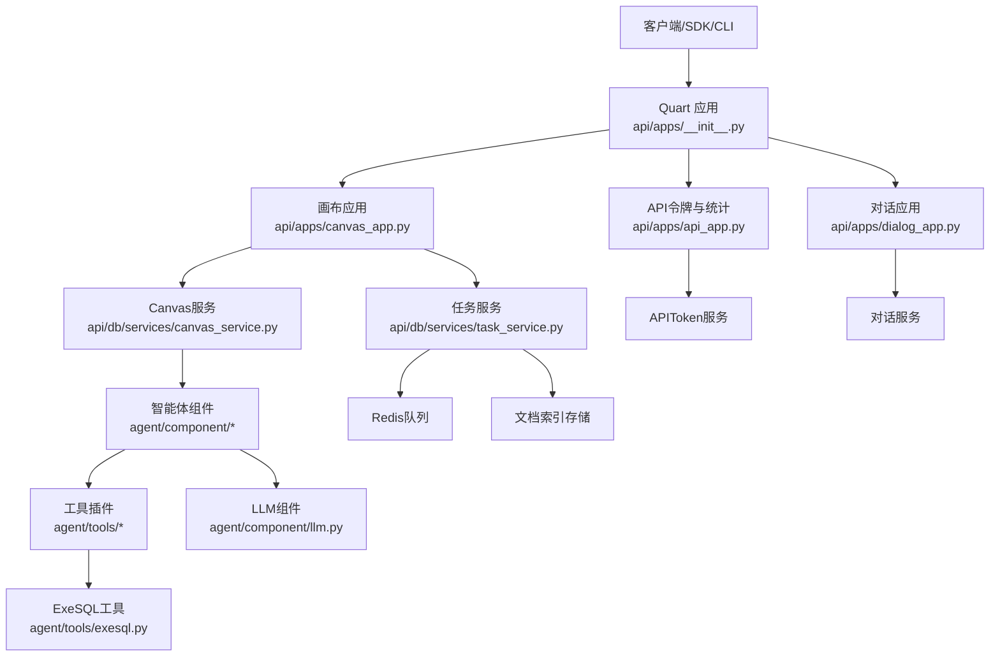
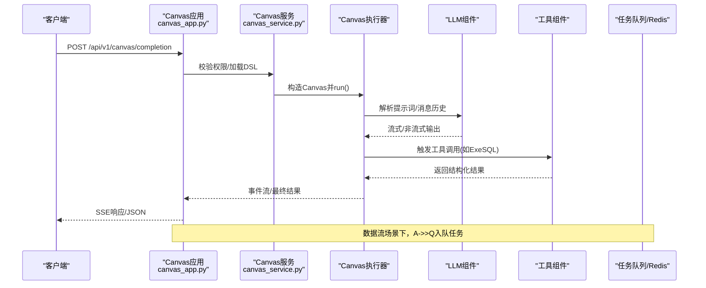
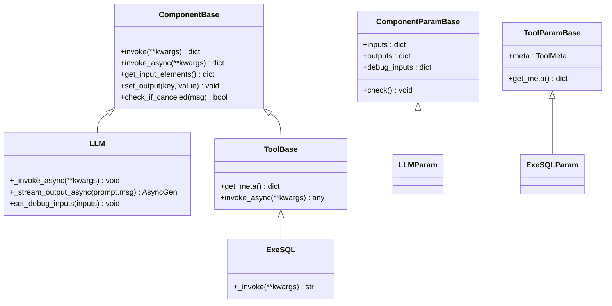
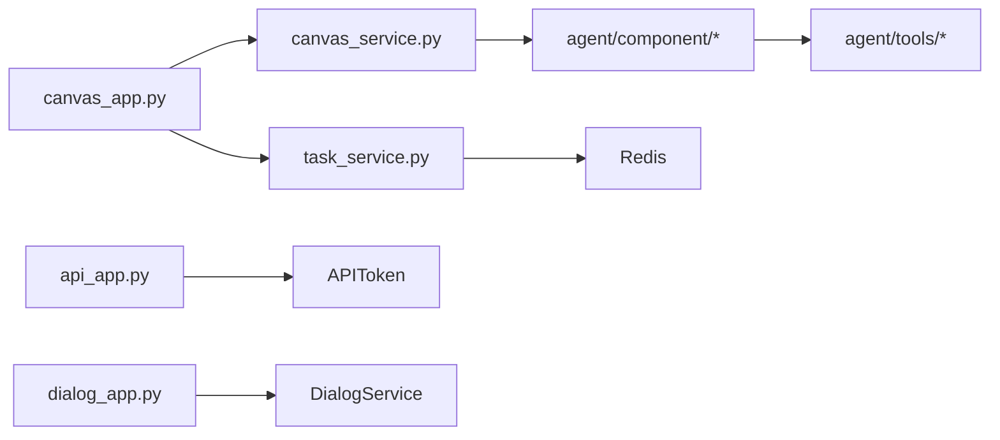

# 智能体工作流API

<cite>
**本文引用的文件**
- [api/apps/canvas_app.py](file://api/apps/canvas_app.py)
- [api/db/services/canvas_service.py](file://api/db/services/canvas_service.py)
- [agent/component/base.py](file://agent/component/base.py)
- [agent/component/llm.py](file://agent/component/llm.py)
- [agent/tools/base.py](file://agent/tools/base.py)
- [agent/tools/exesql.py](file://agent/tools/exesql.py)
- [api/apps/dialog_app.py](file://api/apps/dialog_app.py)
- [api/apps/api_app.py](file://api/apps/api_app.py)
- [api/constants.py](file://api/constants.py)
- [api/ragflow_server.py](file://api/ragflow_server.py)
- [agent/templates/advanced_ingestion_pipeline.json](file://agent/templates/advanced_ingestion_pipeline.json)
- [api/apps/__init__.py](file://api/apps/__init__.py)
- [api/db/services/task_service.py](file://api/db/services/task_service.py)
</cite>

## 目录
1. [简介](#简介)
2. [项目结构](#项目结构)
3. [核心组件](#核心组件)
4. [架构总览](#架构总览)
5. [详细组件分析](#详细组件分析)
6. [依赖关系分析](#依赖关系分析)
7. [性能考量](#性能考量)
8. [故障排查指南](#故障排查指南)
9. [结论](#结论)
10. [附录：完整开发与部署示例](#附录完整开发与部署示例)

## 简介
本文件为“智能体工作流API”的权威参考文档，覆盖以下主题：
- 智能体创建、编辑、执行与监控的HTTP接口
- 工作流编排（Canvas）DSL结构、组件配置与变量传递机制
- 模板管理、共享与复用接口
- 状态查询、日志获取与调试能力
- 批量执行、并发控制与资源管理
- 与外部工具（数据库、搜索引擎等）的集成与调用
- Webhook与SSE事件推送机制
- 完整的开发与部署示例路径

## 项目结构
后端采用 Quart 应用，通过蓝图注册各业务模块；Canvas 负责工作流编排与执行；组件层提供 LLM、工具、数据处理等能力；服务层封装数据库访问与任务队列。

图示来源
- [api/apps/__init__.py:270-271](file://api/apps/__init__.py#L270-L271)
- [api/apps/canvas_app.py:1-564](file://api/apps/canvas_app.py#L1-L564)
- [api/apps/dialog_app.py:1-249](file://api/apps/dialog_app.py#L1-L249)
- [api/apps/api_app.py:1-118](file://api/apps/api_app.py#L1-L118)
- [api/db/services/canvas_service.py:1-366](file://api/db/services/canvas_service.py#L1-L366)
- [agent/component/base.py:365-585](file://agent/component/base.py#L365-L585)
- [agent/component/llm.py:1-352](file://agent/component/llm.py#L1-L352)
- [agent/tools/base.py:1-216](file://agent/tools/base.py#L1-L216)
- [agent/tools/exesql.py:1-282](file://agent/tools/exesql.py#L1-L282)
- [api/db/services/task_service.py:1-589](file://api/db/services/task_service.py#L1-L589)

章节来源
- [api/apps/__init__.py:270-271](file://api/apps/__init__.py#L270-L271)
- [api/ragflow_server.py:1-157](file://api/ragflow_server.py#L1-L157)

## 核心组件
- Canvas 编排引擎：负责加载 DSL、解析组件图、执行节点、收集输出与引用、支持取消与重跑。
- 组件基类与参数校验：统一输入/输出、异常处理、超时与并发限制、调试模式。
- LLM 组件：系统提示词拼装、消息历史截断、流式输出、结构化输出、引用注入。
- 工具基类与具体工具：统一函数式元信息、参数校验、异步/线程池执行、结果格式化。
- 任务与队列：基于 Redis 的任务队列、进度更新、重试与取消、数据流任务。
- 对话与API：对话配置、参数校验、列表与删除；API令牌与用量统计。

章节来源
- [agent/component/base.py:365-585](file://agent/component/base.py#L365-L585)
- [agent/component/llm.py:1-352](file://agent/component/llm.py#L1-L352)
- [agent/tools/base.py:1-216](file://agent/tools/base.py#L1-L216)
- [agent/tools/exesql.py:1-282](file://agent/tools/exesql.py#L1-L282)
- [api/db/services/canvas_service.py:193-366](file://api/db/services/canvas_service.py#L193-L366)
- [api/db/services/task_service.py:555-589](file://api/db/services/task_service.py#L555-L589)

## 架构总览
下图展示从HTTP请求到组件执行、工具调用与任务队列的整体流程。

图示来源
- [api/apps/canvas_app.py:130-184](file://api/apps/canvas_app.py#L130-L184)
- [api/db/services/canvas_service.py:193-366](file://api/db/services/canvas_service.py#L193-L366)
- [agent/component/llm.py:264-342](file://agent/component/llm.py#L264-L342)
- [agent/tools/exesql.py:82-278](file://agent/tools/exesql.py#L82-L278)
- [api/db/services/task_service.py:555-589](file://api/db/services/task_service.py#L555-L589)

## 详细组件分析

### 1) Canvas 工作流编排与执行
- 接口
  - GET /api/v1/canvas/templates：获取模板列表
  - POST /api/v1/canvas/set：保存或更新画布（支持版本记录）
  - GET /api/v1/canvas/get/{canvas_id}：获取指定画布
  - GET /api/v1/canvas/getsse/{canvas_id}：基于API Key的SSE读取
  - POST /api/v1/canvas/completion：执行工作流（SSE流式返回）
  - POST /api/v1/canvas/rerun：按组件粒度重跑
  - PUT /api/v1/canvas/cancel/{task_id}：取消任务
  - POST /api/v1/canvas/reset：重置画布状态
  - GET /api/v1/canvas/input_form：获取组件输入表单
  - POST /api/v1/canvas/debug：调试组件（LLM可设置调试输入）
  - POST /api/v1/canvas/test_db_connect：测试数据库连接
  - GET /api/v1/canvas/getlistversion/{canvas_id}：获取版本列表
  - GET /api/v1/canvas/getversion/{version_id}：获取指定版本
  - GET /api/v1/canvas/list：分页列出画布
  - POST /api/v1/canvas/setting：修改标题/描述/权限等
  - GET /api/v1/canvas/trace：获取运行日志（Redis键）
  - GET /api/v1/canvas/{canvas_id}/sessions：会话列表
  - GET /api/v1/canvas/prompts：内置提示词模板
  - GET /api/v1/canvas/download：下载文件blob
- 关键特性
  - 变量传递：组件输入表达式支持 {组件@变量} 与 sys.env 等引用
  - 并发与超时：组件级信号量与超时装饰器
  - 取消机制：通过Redis键标记取消
  - 版本管理：自动保存版本快照，保留最近一次
  - 数据流：支持将画布作为数据处理流水线入队任务

章节来源
- [api/apps/canvas_app.py:51-564](file://api/apps/canvas_app.py#L51-L564)
- [api/db/services/canvas_service.py:193-366](file://api/db/services/canvas_service.py#L193-L366)
- [agent/component/base.py:365-585](file://agent/component/base.py#L365-L585)

### 2) 组件与工具体系
- 组件基类
  - 输入/输出字典管理、调试输入、异常默认值、上游/下游关系
  - invoke_async 自动选择协程或线程池执行，统一计时与错误记录
  - 变量引用解析：支持 {cpn@var}、sys.var、env.var
- LLM 组件
  - 系统提示词与用户消息拼装、消息长度适配
  - 结构化输出（JSON Schema）与重试
  - 流式输出(delta)与<think>标记处理
- 工具基类
  - 函数式元信息（名称、描述、参数schema）自动生成
  - 异步/线程池执行，回调记录耗时
- 具体工具示例：ExeSQL
  - 支持多数据库类型（MySQL/Postgres/SQLServer/DB2/Trino）
  - 参数化SQL，结果转DataFrame并格式化

图示来源
- [agent/component/base.py:365-585](file://agent/component/base.py#L365-L585)
- [agent/component/llm.py:82-352](file://agent/component/llm.py#L82-L352)
- [agent/tools/base.py:126-216](file://agent/tools/base.py#L126-L216)
- [agent/tools/exesql.py:79-282](file://agent/tools/exesql.py#L79-L282)

章节来源
- [agent/component/base.py:365-585](file://agent/component/base.py#L365-L585)
- [agent/component/llm.py:1-352](file://agent/component/llm.py#L1-L352)
- [agent/tools/base.py:1-216](file://agent/tools/base.py#L1-L216)
- [agent/tools/exesql.py:1-282](file://agent/tools/exesql.py#L1-L282)

### 3) 对话与聊天接口
- 接口
  - POST /api/v1/dialog/set：创建/更新对话（含参数校验与知识库参数默认化）
  - GET /api/v1/dialog/get：获取对话详情
  - GET /api/v1/dialog/list：列出对话
  - GET /api/v1/dialog/next：分页查询（支持owner_ids过滤）
  - POST /api/v1/dialog/rm：删除对话（仅所有者可删）

章节来源
- [api/apps/dialog_app.py:1-249](file://api/apps/dialog_app.py#L1-L249)

### 4) API 令牌与用量统计
- 接口
  - POST /api/v1/new_token：为画布/对话生成API令牌
  - GET /api/v1/token_list：查询令牌列表
  - POST /api/v1/rm：批量删除令牌
  - GET /api/v1/stats：按日期范围统计用量（PV/UV/速度/令牌数/轮次/点赞）

章节来源
- [api/apps/api_app.py:1-118](file://api/apps/api_app.py#L1-L118)

### 5) 模板管理与共享
- 模板来源：agent/templates 下的JSON模板，包含组件图、参数与连接关系
- 接口
  - GET /api/v1/canvas/templates：返回模板列表
  - 画布保存时可选择模板并进行二次编辑
- 复用方式：通过模板ID在画布中直接使用组件与参数

章节来源
- [agent/templates/advanced_ingestion_pipeline.json:1-728](file://agent/templates/advanced_ingestion_pipeline.json#L1-L728)
- [api/apps/canvas_app.py:51-54](file://api/apps/canvas_app.py#L51-L54)

### 6) 日志、追踪与调试
- 日志获取
  - GET /api/v1/canvas/trace?canvas_id=&message_id=：从Redis读取运行日志
- 调试
  - POST /api/v1/canvas/debug：对指定组件设置调试输入并执行
  - POST /api/v1/canvas/input_form：动态生成组件输入表单
- 运行状态
  - GET /api/v1/canvas/sessions：查询会话列表（分页、筛选）

章节来源
- [api/apps/canvas_app.py:499-540](file://api/apps/canvas_app.py#L499-L540)
- [agent/component/base.py:407-447](file://agent/component/base.py#L407-L447)

### 7) 并发控制与资源管理
- 并发限制
  - 组件级信号量：限制同时处理的聊天数量
- 超时控制
  - 组件执行超时装饰器
- 取消机制
  - PUT /api/v1/canvas/cancel/{task_id}：写入取消键
  - 组件内定期检查取消状态
- 任务队列
  - 基于Redis的消息队列，支持优先级与失败回滚
  - 任务进度与重试策略

章节来源
- [agent/component/base.py:367-449](file://agent/component/base.py#L367-L449)
- [api/db/services/task_service.py:555-589](file://api/db/services/task_service.py#L555-L589)

### 8) 与外部工具集成与Webhook
- 工具集成
  - 工具通过函数式元信息暴露给LLM调用
  - ExeSQL支持多数据库直连与结果格式化
- Webhook/回调
  - 当前未发现显式的Webhook回调接口；SSE用于事件推送
  - 工具调用支持回调记录耗时

章节来源
- [agent/tools/base.py:50-75](file://agent/tools/base.py#L50-L75)
- [agent/tools/exesql.py:82-278](file://agent/tools/exesql.py#L82-L278)
- [api/apps/canvas_app.py:164-184](file://api/apps/canvas_app.py#L164-L184)

## 依赖关系分析
- 组件耦合
  - Canvas 依赖组件基类与LLM/工具实现
  - 服务层封装数据库与任务队列，避免上层直接依赖
- 外部依赖
  - Redis：任务队列与日志键
  - 存储实现：文件上传/下载
  - LLM服务：通过租户上下文选择模型与类型
- 认证与鉴权
  - 支持Access Token与APIToken两种鉴权方式
  - 登录保护装饰器统一拦截未认证请求

图示来源
- [api/apps/canvas_app.py:1-564](file://api/apps/canvas_app.py#L1-L564)
- [api/db/services/canvas_service.py:1-366](file://api/db/services/canvas_service.py#L1-L366)
- [api/db/services/task_service.py:1-589](file://api/db/services/task_service.py#L1-L589)
- [api/apps/api_app.py:1-118](file://api/apps/api_app.py#L1-L118)
- [api/apps/dialog_app.py:1-249](file://api/apps/dialog_app.py#L1-L249)

章节来源
- [api/apps/__init__.py:95-141](file://api/apps/__init__.py#L95-L141)
- [api/apps/api_app.py:1-118](file://api/apps/api_app.py#L1-L118)

## 性能考量
- 组件并发与超时：通过信号量与超时装饰器控制资源占用与响应时间
- 流式输出：SSE与增量delta减少首屏等待
- 任务队列：分页/分段任务与重用上次任务块，降低重复计算
- 进度与重试：合理的进度更新与重试上限，避免无效负载

## 故障排查指南
- 401未授权
  - 检查 Authorization 头是否携带有效Token（Access Token或APIToken）
- 画布不可见/无权限
  - 确认当前用户对画布的所有权或团队共享权限
- 执行被取消
  - 检查是否调用取消接口或Redis取消键是否存在
- 数据库连接失败
  - 使用 /api/v1/canvas/test_db_connect 进行连通性测试
- 任务未入队
  - 查看Redis状态与队列名配置，确认失败回滚与清理逻辑

章节来源
- [api/apps/__init__.py:298-314](file://api/apps/__init__.py#L298-L314)
- [api/apps/canvas_app.py:320-420](file://api/apps/canvas_app.py#L320-L420)
- [api/db/services/task_service.py:577-588](file://api/db/services/task_service.py#L577-L588)

## 结论
本API体系以Canvas为核心，结合组件化与工具化能力，提供了从工作流编排、变量传递、并发控制到任务队列与日志追踪的完整闭环。通过模板与版本管理，支持快速复用与迭代；通过SSE与API令牌，兼顾实时交互与安全管控。建议在生产环境中配合Redis高可用、完善的监控与告警体系，确保稳定性与可观测性。

## 附录：完整开发与部署示例
- 启动服务
  - 通过主入口启动HTTP服务，初始化数据库与运行时配置
  - 参考路径：[api/ragflow_server.py:102-151](file://api/ragflow_server.py#L102-L151)
- 创建一个画布并执行
  - 使用 /api/v1/canvas/set 保存画布
  - 使用 /api/v1/canvas/completion 发起执行，接收SSE事件
  - 参考路径：[api/apps/canvas_app.py:71-184](file://api/apps/canvas_app.py#L71-L184)
- 使用模板
  - 获取模板列表：/api/v1/canvas/templates
  - 在画布中引用模板组件与参数
  - 参考路径：[agent/templates/advanced_ingestion_pipeline.json:1-728](file://agent/templates/advanced_ingestion_pipeline.json#L1-L728)
- 集成外部工具
  - 定义工具参数与元信息，实现 _invoke/_invoke_async
  - 示例：ExeSQL工具
  - 参考路径：[agent/tools/exesql.py:79-282](file://agent/tools/exesql.py#L79-L282)
- 令牌与用量
  - 生成令牌：/api/v1/new_token
  - 查询用量：/api/v1/stats
  - 参考路径：[api/apps/api_app.py:26-118](file://api/apps/api_app.py#L26-L118)
- 对话配置
  - 创建/更新对话：/api/v1/dialog/set
  - 参考路径：[api/apps/dialog_app.py:31-144](file://api/apps/dialog_app.py#L31-L144)