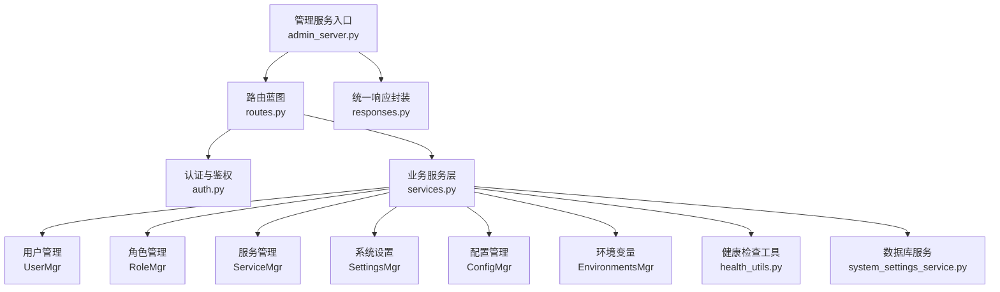
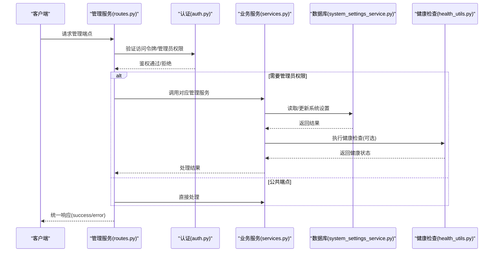
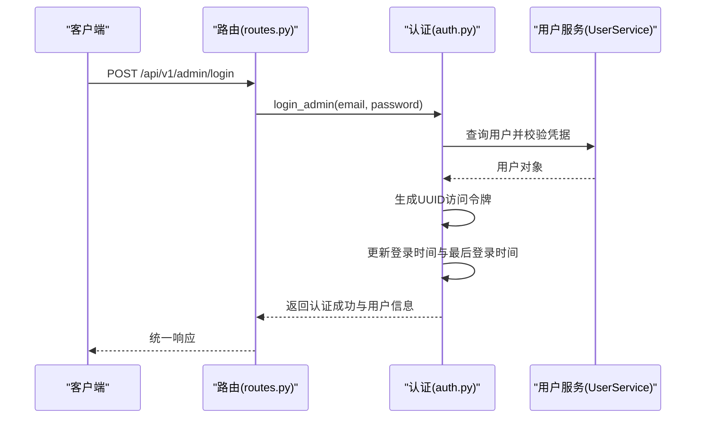
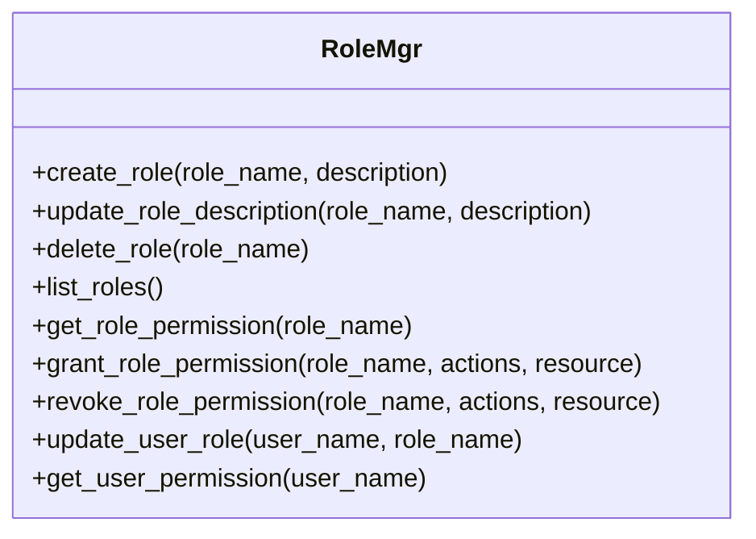
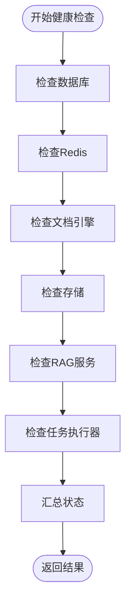
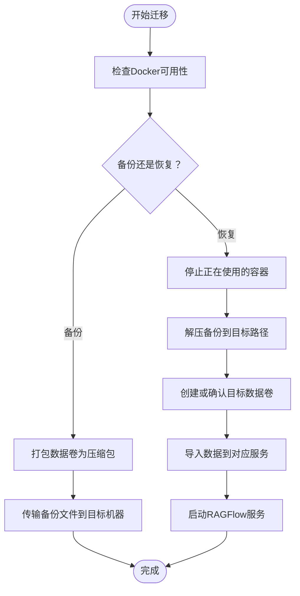
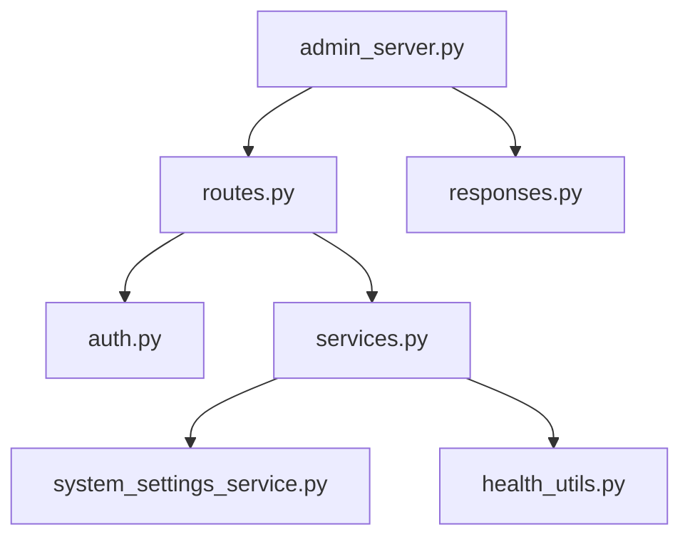

# 系统管理API

<cite>
**本文档引用的文件**
- [routes.py](file://admin/server/routes.py)
- [admin_server.py](file://admin/server/admin_server.py)
- [services.py](file://admin/server/services.py)
- [auth.py](file://admin/server/auth.py)
- [roles.py](file://admin/server/roles.py)
- [responses.py](file://admin/server/responses.py)
- [health_utils.py](file://api/utils/health_utils.py)
- [system_settings_service.py](file://api/db/services/system_settings_service.py)
- [settings.py](file://common/settings.py)
- [migration.sh](file://docker/migration.sh)
- [migrate_from_docker_compose.md](file://docs/guides/migration/migrate_from_docker_compose.md)
</cite>

## 目录
1. [简介](#简介)
2. [项目结构](#项目结构)
3. [核心组件](#核心组件)
4. [架构总览](#架构总览)
5. [详细组件分析](#详细组件分析)
6. [依赖关系分析](#依赖关系分析)
7. [性能考虑](#性能考虑)
8. [故障排查指南](#故障排查指南)
9. [结论](#结论)
10. [附录](#附录)

## 简介
本文件为系统管理API的权威参考文档，覆盖系统配置、监控指标、健康检查、用户与权限管理、服务治理、变量与配置、环境信息、版本信息、API密钥管理、系统性能监控、资源使用统计、告警配置、备份恢复、数据迁移、版本升级、第三方集成、插件管理与扩展配置等运维与管理能力。文档以代码为依据，提供端点定义、请求参数、响应格式、错误处理与最佳实践，帮助系统管理员与开发者高效完成日常运维任务。

## 项目结构
系统管理API位于独立的管理服务中，采用Flask蓝图组织路由，配合认证中间件与统一响应封装，实现用户管理、角色权限、系统配置、服务治理、环境变量查询、版本信息展示等功能。



**图表来源**
- [admin_server.py:42-85](file://admin/server/admin_server.py#L42-L85)
- [routes.py:33-557](file://admin/server/routes.py#L33-L557)
- [services.py:39-410](file://admin/server/services.py#L39-L410)
- [auth.py:38-189](file://admin/server/auth.py#L38-L189)
- [health_utils.py:187-223](file://api/utils/health_utils.py#L187-L223)
- [system_settings_service.py:23-45](file://api/db/services/system_settings_service.py#L23-L45)
- [responses.py:19-33](file://admin/server/responses.py#L19-L33)

**章节来源**
- [admin_server.py:42-85](file://admin/server/admin_server.py#L42-L85)
- [routes.py:33-557](file://admin/server/routes.py#L33-L557)

## 核心组件
- 路由蓝图：集中定义管理API端点，包括登录、登出、用户管理、角色权限、服务治理、系统配置、环境变量、版本信息等。
- 认证与鉴权：基于Flask-Login与自定义令牌校验，支持管理员登录、访问令牌验证、管理员权限校验。
- 业务服务层：封装用户、角色、服务、系统设置、配置、环境变量等管理操作，调用数据库服务与健康检查工具。
- 健康检查工具：提供数据库、缓存、文档引擎、存储、RAG服务、任务执行器等健康状态检测。
- 统一响应封装：标准化成功与错误响应格式，便于前端与CLI工具消费。

**章节来源**
- [routes.py:36-557](file://admin/server/routes.py#L36-L557)
- [auth.py:38-189](file://admin/server/auth.py#L38-L189)
- [services.py:39-410](file://admin/server/services.py#L39-L410)
- [health_utils.py:187-223](file://api/utils/health_utils.py#L187-L223)
- [responses.py:19-33](file://admin/server/responses.py#L19-L33)

## 架构总览
管理服务通过Flask蓝图暴露REST接口，请求经认证中间件后交由业务服务层处理，最终返回统一格式的JSON响应。健康检查工具贯穿服务治理与监控环节，系统设置与配置管理提供动态调整能力。



**图表来源**
- [routes.py:36-557](file://admin/server/routes.py#L36-L557)
- [auth.py:38-189](file://admin/server/auth.py#L38-L189)
- [services.py:39-410](file://admin/server/services.py#L39-L410)
- [health_utils.py:187-223](file://api/utils/health_utils.py#L187-L223)
- [system_settings_service.py:23-45](file://api/db/services/system_settings_service.py#L23-L45)

## 详细组件分析

### 认证与会话管理
- 登录：POST /api/v1/admin/login，校验邮箱与密码，颁发访问令牌并记录登录时间。
- 登出：GET /api/v1/admin/logout，失效当前会话令牌并退出登录。
- 认证：GET /api/v1/admin/auth，验证请求头中的访问令牌有效性。
- 管理员校验：装饰器检查当前用户是否为管理员且处于激活状态。



**图表来源**
- [routes.py:41-51](file://admin/server/routes.py#L41-L51)
- [auth.py:108-134](file://admin/server/auth.py#L108-L134)

**章节来源**
- [routes.py:41-72](file://admin/server/routes.py#L41-L72)
- [auth.py:38-189](file://admin/server/auth.py#L38-L189)

### 用户管理
- 列表用户：GET /api/v1/admin/users
- 创建用户：POST /api/v1/admin/users（需管理员）
- 删除用户：DELETE /api/v1/admin/users/{username}
- 修改密码：PUT /api/v1/admin/users/{username}/password
- 激活状态：PUT /api/v1/admin/users/{username}/activate
- 授予管理员：PUT /api/v1/admin/users/{username}/admin
- 撤销管理员：DELETE /api/v1/admin/users/{username}/admin
- 获取用户详情：GET /api/v1/admin/users/{username}
- 用户数据集：GET /api/v1/admin/users/{username}/datasets
- 用户代理：GET /api/v1/admin/users/{username}/agents

```mermaid
flowchart TD
Start(["进入用户管理端点"]) --> CheckMethod{"方法类型？"}
CheckMethod --> |GET /users| ListUsers["列出所有用户"]
CheckMethod --> |POST /users| CreateUser["创建用户"]
CheckMethod --> |DELETE /users/{username}| DeleteUser["删除用户"]
CheckMethod --> |PUT /users/{username}/password| ChangePwd["修改密码"]
CheckMethod --> |PUT /users/{username}/activate| ToggleActive["切换激活状态"]
CheckMethod --> |PUT /users/{username}/admin| GrantAdmin["授予管理员"]
CheckMethod --> |DELETE /users/{username}/admin| RevokeAdmin["撤销管理员"]
CheckMethod --> |GET /users/{username}| GetUserDetail["获取用户详情"]
CheckMethod --> |GET /users/{username}/datasets| GetUserDatasets["获取用户数据集"]
CheckMethod --> |GET /users/{username}/agents| GetUserAgents["获取用户代理"]
ListUsers --> End(["返回统一响应"])
CreateUser --> End
DeleteUser --> End
ChangePwd --> End
ToggleActive --> End
GrantAdmin --> End
RevokeAdmin --> End
GetUserDetail --> End
GetUserDatasets --> End
GetUserAgents --> End
```

**图表来源**
- [routes.py:74-237](file://admin/server/routes.py#L74-L237)
- [services.py:39-224](file://admin/server/services.py#L39-L224)

**章节来源**
- [routes.py:74-237](file://admin/server/routes.py#L74-L237)
- [services.py:39-224](file://admin/server/services.py#L39-L224)

### 角色与权限管理
- 创建角色：POST /api/v1/admin/roles（当前未实现）
- 更新角色描述：PUT /api/v1/admin/roles/{role_name}（当前未实现）
- 删除角色：DELETE /api/v1/admin/roles/{role_name}（当前未实现）
- 列出角色：GET /api/v1/admin/roles（当前未实现）
- 获取角色权限：GET /api/v1/admin/roles/{role_name}/permission（当前未实现）
- 授予权限：POST /api/v1/admin/roles/{role_name}/permission（当前未实现）
- 撤销权限：DELETE /api/v1/admin/roles/{role_name}/permission（当前未实现）
- 更新用户角色：PUT /api/v1/admin/users/{user_name}/role（当前未实现）
- 获取用户权限：GET /api/v1/admin/users/{user_name}/permission（当前未实现）



**图表来源**
- [roles.py:23-77](file://admin/server/roles.py#L23-L77)

**章节来源**
- [roles.py:23-77](file://admin/server/roles.py#L23-L77)

### 服务治理
- 列出服务：GET /api/v1/admin/services
- 服务详情：GET /api/v1/admin/services/{service_id}
- 关闭服务：DELETE /api/v1/admin/services/{service_id}（当前未实现）
- 重启服务：PUT /api/v1/admin/services/{service_id}（当前未实现）

服务详情通过健康检查工具获取各子系统的运行状态，并结合配置信息返回服务状态。

**章节来源**
- [routes.py:239-292](file://admin/server/routes.py#L239-L292)
- [services.py:269-329](file://admin/server/services.py#L269-L329)
- [health_utils.py:187-223](file://api/utils/health_utils.py#L187-L223)

### 系统配置与变量
- 设置变量：PUT /api/v1/admin/variables（按名称更新值）
- 获取变量：GET /api/v1/admin/variables（不带参数列出；带参数按名称查询）
- 获取配置：GET /api/v1/admin/configs
- 获取环境变量：GET /api/v1/admin/environments
- 版本信息：GET /api/v1/admin/version

系统设置通过数据库服务持久化，支持按名称前缀匹配查询与更新。

**章节来源**
- [routes.py:416-485](file://admin/server/routes.py#L416-L485)
- [services.py:331-410](file://admin/server/services.py#L331-L410)
- [system_settings_service.py:23-45](file://api/db/services/system_settings_service.py#L23-L45)
- [settings.py:169-396](file://common/settings.py#L169-L396)

### API密钥管理
- 生成用户API密钥：POST /api/v1/admin/users/{username}/keys
- 获取用户API密钥：GET /api/v1/admin/users/{username}/keys
- 删除用户API密钥：DELETE /api/v1/admin/users/{username}/keys/{key}

密钥生成包含租户ID、令牌、Beta密钥、创建/更新时间戳等字段，便于审计与追踪。

**章节来源**
- [routes.py:487-546](file://admin/server/routes.py#L487-L546)
- [services.py:150-191](file://admin/server/services.py#L150-L191)

### 健康检查与监控
- 健康检查聚合：run_health_checks() 返回数据库、缓存、文档引擎、存储的整体状态
- 数据库健康：check_db()
- 缓存健康：check_redis()
- 文档引擎健康：check_doc_engine()
- 存储健康：check_storage()
- RAG服务健康：check_ragflow_server_alive()
- 任务执行器健康：check_task_executor_alive()



**图表来源**
- [health_utils.py:187-223](file://api/utils/health_utils.py#L187-L223)

**章节来源**
- [health_utils.py:33-223](file://api/utils/health_utils.py#L33-L223)

### 备份恢复与数据迁移
- 备份脚本：docker/migration.sh 提供备份与恢复流程，支持MySQL、MinIO、Redis、Elasticsearch数据卷
- 迁移指南：docs/guides/migration/migrate_from_docker_compose.md 提供从Docker Compose到新环境的数据迁移步骤



**图表来源**
- [migration.sh:17-222](file://docker/migration.sh#L17-L222)

**章节来源**
- [migration.sh:1-222](file://docker/migration.sh#L1-L222)
- [migrate_from_docker_compose.md:52-90](file://docs/guides/migration/migrate_from_docker_compose.md#L52-L90)

### 第三方集成、插件管理与扩展配置
- 插件管理：plugin/plugin_manager.py 提供插件加载与管理能力（全局实例 GlobalPluginManager）
- 扩展配置：common/settings.py 初始化存储实现、文档引擎、认证配置、邮件SMTP等，支持通过环境变量与配置文件进行扩展

**章节来源**
- [settings.py:169-396](file://common/settings.py#L169-L396)

## 依赖关系分析
- 路由依赖认证中间件与业务服务层，确保管理员权限与会话有效。
- 业务服务层依赖数据库服务与健康检查工具，实现配置持久化与系统状态监控。
- 管理服务入口负责初始化日志、配置、认证与默认管理员，绑定蓝图并启动HTTP服务。



**图表来源**
- [routes.py:25-31](file://admin/server/routes.py#L25-L31)
- [services.py:24-36](file://admin/server/services.py#L24-L36)
- [admin_server.py:30-68](file://admin/server/admin_server.py#L30-L68)

**章节来源**
- [routes.py:25-31](file://admin/server/routes.py#L25-L31)
- [services.py:24-36](file://admin/server/services.py#L24-L36)
- [admin_server.py:30-68](file://admin/server/admin_server.py#L30-L68)

## 性能考虑
- 健康检查采用轻量探测，避免对生产环境造成额外压力。
- 服务列表与详情在获取失败时返回超时状态，便于快速定位问题节点。
- 系统设置更新采用批量写入与时间戳记录，保证一致性与可追溯性。
- 建议在高并发场景下限制管理端点的访问频率，并启用HTTPS与访问控制策略。

## 故障排查指南
- 认证失败：检查访问令牌格式与长度，确认用户存在且为管理员且处于激活状态。
- 管理端点403：确认当前用户具备管理员权限且未被禁用。
- 健康检查异常：查看数据库、缓存、文档引擎、存储的错误元数据，定位具体组件。
- 密钥管理失败：确认用户存在且拥有对应租户ID，密钥删除条件匹配。
- 备份恢复失败：检查Docker可用性、备份文件完整性与目标卷状态，遵循迁移指南逐步执行。

**章节来源**
- [auth.py:92-105](file://admin/server/auth.py#L92-L105)
- [health_utils.py:187-223](file://api/utils/health_utils.py#L187-L223)
- [routes.py:487-546](file://admin/server/routes.py#L487-L546)
- [migration.sh:45-52](file://docker/migration.sh#L45-L52)

## 结论
系统管理API提供了完整的运维与管理能力，涵盖用户与权限、服务治理、系统配置、健康监控、密钥管理、备份恢复与迁移等关键领域。通过统一的认证与响应机制，结合健康检查与配置管理，能够有效支撑生产环境的稳定运行与持续演进。

## 附录
- 统一响应格式
  - 成功响应：包含code、message、data字段
  - 错误响应：包含code、message、data字段
- 常见HTTP状态码
  - 200：请求成功
  - 400：参数错误或业务异常
  - 401：未认证
  - 403：权限不足
  - 404：资源不存在
  - 500：服务器内部错误

**章节来源**
- [responses.py:19-33](file://admin/server/responses.py#L19-L33)