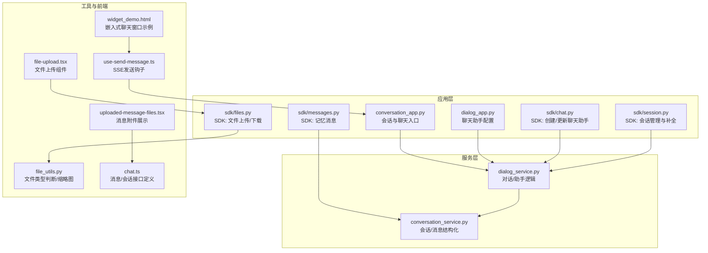
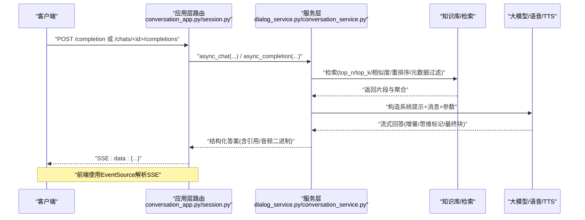
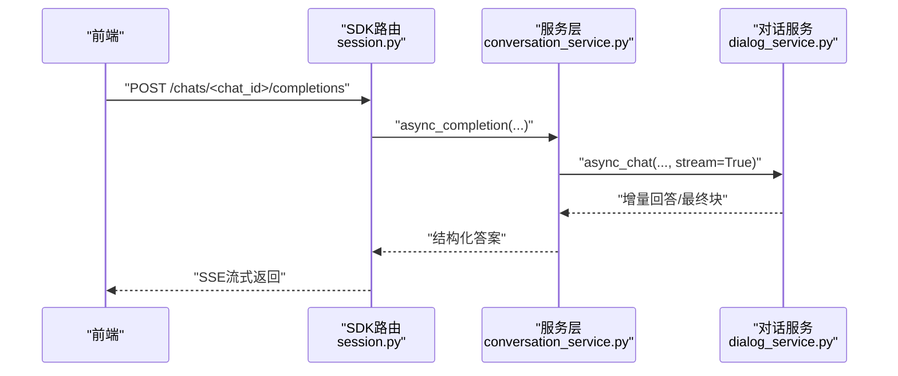
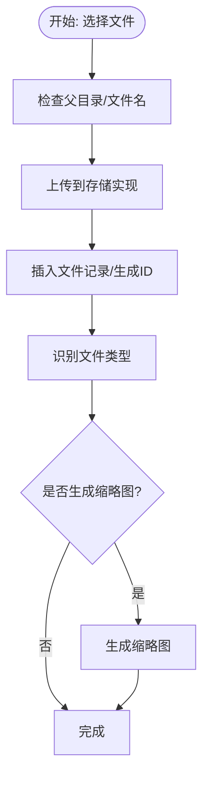
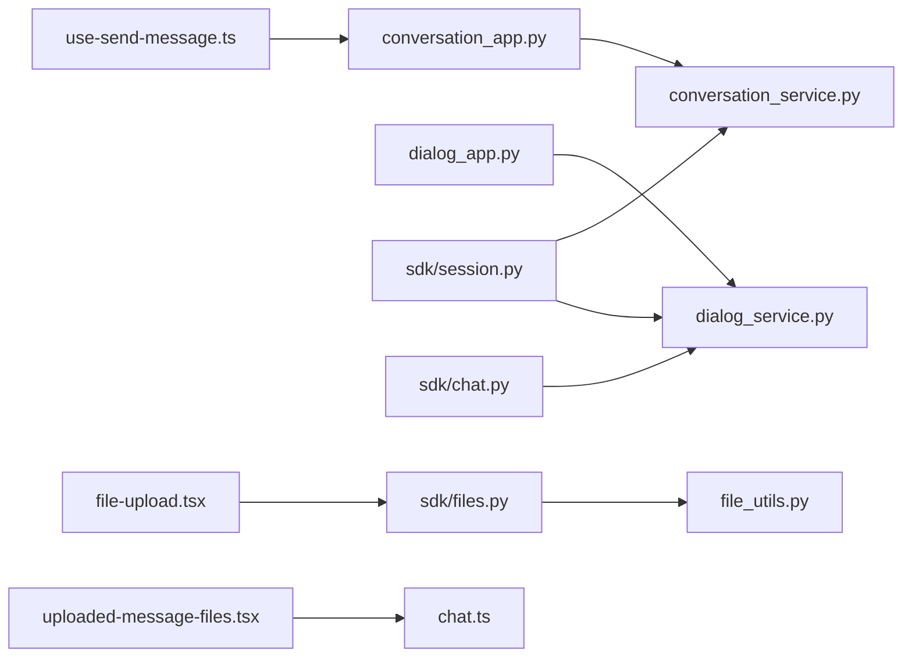

# 聊天接口API

<cite>
**本文引用的文件**
- [conversation_app.py](file://api/apps/conversation_app.py)
- [dialog_app.py](file://api/apps/dialog_app.py)
- [chat.py](file://api/apps/sdk/chat.py)
- [session.py](file://api/apps/sdk/session.py)
- [messages.py](file://api/apps/sdk/messages.py)
- [files.py](file://api/apps/sdk/files.py)
- [dialog_service.py](file://api/db/services/dialog_service.py)
- [conversation_service.py](file://api/db/services/conversation_service.py)
- [file_utils.py](file://api/utils/file_utils.py)
- [use-send-message.ts](file://web/src/hooks/use-send-message.ts)
- [file-upload.tsx](file://web/src/components/file-upload.tsx)
- [uploaded-message-files.tsx](file://web/src/components/next-message-item/uploaded-message-files.tsx)
- [chat.ts](file://web/src/interfaces/database/chat.ts)
- [widget_demo.html](file://chat_demo/widget_demo.html)
</cite>

## 目录
1. [简介](#简介)
2. [项目结构](#项目结构)
3. [核心组件](#核心组件)
4. [架构总览](#架构总览)
5. [详细组件分析](#详细组件分析)
6. [依赖分析](#依赖分析)
7. [性能考虑](#性能考虑)
8. [故障排查指南](#故障排查指南)
9. [结论](#结论)
10. [附录](#附录)

## 简介
本文件为聊天接口API的权威参考文档，覆盖会话创建、消息发送、历史查询、上下文维护与多轮对话、聊天助手配置与个性化、消息类型与附件上传、实时流式响应与SSE等能力。文档以代码为依据，结合前端交互示例，帮助开发者快速集成RAG驱动的智能聊天体验。

## 项目结构
围绕聊天能力的关键模块分布如下：
- 应用层路由与SDK封装：api/apps 下的 conversation_app.py、dialog_app.py、sdk/chat.py、sdk/session.py、sdk/messages.py、sdk/files.py
- 业务服务层：api/db/services 下的 dialog_service.py、conversation_service.py
- 工具与通用能力：api/utils/file_utils.py
- 前端交互示例：web/src 下的 hooks、components、interfaces 等
- 示例页面：chat_demo/widget_demo.html

图表来源
- [conversation_app.py:168-251](file://api/apps/conversation_app.py#L168-L251)
- [dialog_app.py:31-144](file://api/apps/dialog_app.py#L31-L144)
- [chat.py:27-143](file://api/apps/sdk/chat.py#L27-L143)
- [session.py:54-177](file://api/apps/sdk/session.py#L54-L177)
- [messages.py:27-48](file://api/apps/sdk/messages.py#L27-L48)
- [files.py:35-148](file://api/apps/sdk/files.py#L35-L148)
- [dialog_service.py:275-582](file://api/db/services/dialog_service.py#L275-L582)
- [conversation_service.py:68-196](file://api/db/services/conversation_service.py#L68-L196)
- [file_utils.py:40-54](file://api/utils/file_utils.py#L40-L54)
- [use-send-message.ts:94-194](file://web/src/hooks/use-send-message.ts#L94-L194)
- [file-upload.tsx:72-96](file://web/src/components/file-upload.tsx#L72-L96)
- [uploaded-message-files.tsx:32-43](file://web/src/components/next-message-item/uploaded-message-files.tsx#L32-L43)
- [chat.ts:191-210](file://web/src/interfaces/database/chat.ts#L191-L210)
- [widget_demo.html:117-139](file://chat_demo/widget_demo.html#L117-L139)

章节来源
- [conversation_app.py:168-251](file://api/apps/conversation_app.py#L168-L251)
- [dialog_app.py:31-144](file://api/apps/dialog_app.py#L31-L144)
- [chat.py:27-143](file://api/apps/sdk/chat.py#L27-L143)
- [session.py:54-177](file://api/apps/sdk/session.py#L54-L177)
- [messages.py:27-48](file://api/apps/sdk/messages.py#L27-L48)
- [files.py:35-148](file://api/apps/sdk/files.py#L35-L148)
- [dialog_service.py:275-582](file://api/db/services/dialog_service.py#L275-L582)
- [conversation_service.py:68-196](file://api/db/services/conversation_service.py#L68-L196)
- [file_utils.py:40-54](file://api/utils/file_utils.py#L40-L54)
- [use-send-message.ts:94-194](file://web/src/hooks/use-send-message.ts#L94-L194)
- [file-upload.tsx:72-96](file://web/src/components/file-upload.tsx#L72-L96)
- [uploaded-message-files.tsx:32-43](file://web/src/components/next-message-item/uploaded-message-files.tsx#L32-L43)
- [chat.ts:191-210](file://web/src/interfaces/database/chat.ts#L191-L210)
- [widget_demo.html:117-139](file://chat_demo/widget_demo.html#L117-L139)

## 核心组件
- 对话/聊天助手（Dialog/Chat）
  - 配置与参数：名称、描述、图标、检索参数(top_n/top_k、相似度阈值、重排序模型、元数据过滤）、提示词模板、变量参数、是否显示引用、TTS开关、多轮优化等
  - 支持知识库检索、外部搜索（如Tavily）、图谱增强、目录增强、跨语言、关键词增强、深度研究等
- 会话（Conversation）
  - 会话列表、创建、更新、删除
  - 消息流结构化（含最终块标记）、引用聚合、消息ID与时间戳
- 实时流式响应（SSE/流式）
  - 文本增量输出、思维标记（<think>/<end_think>）、最终块、引用格式化
- 附件与多媒体
  - 文件上传、缩略图生成、类型识别、下载、语音转写与TTS
- 记忆与消息管理
  - 记忆消息的增删改查、检索与内容获取

章节来源
- [dialog_service.py:275-582](file://api/db/services/dialog_service.py#L275-L582)
- [conversation_service.py:68-196](file://api/db/services/conversation_service.py#L68-L196)
- [conversation_app.py:168-251](file://api/apps/conversation_app.py#L168-L251)
- [session.py:54-177](file://api/apps/sdk/session.py#L54-L177)
- [files.py:35-148](file://api/apps/sdk/files.py#L35-L148)
- [file_utils.py:40-54](file://api/utils/file_utils.py#L40-L54)
- [messages.py:27-48](file://api/apps/sdk/messages.py#L27-L48)

## 架构总览
聊天请求从应用层路由进入，经由服务层完成对话与检索、生成与流式输出，并在需要时持久化到会话中。前端通过SSE接收流式结果，同时可进行文件上传与消息记忆操作。

图表来源
- [conversation_app.py:168-251](file://api/apps/conversation_app.py#L168-L251)
- [session.py:129-177](file://api/apps/sdk/session.py#L129-L177)
- [dialog_service.py:275-582](file://api/db/services/dialog_service.py#L275-L582)
- [conversation_service.py:112-196](file://api/db/services/conversation_service.py#L112-L196)

## 详细组件分析

### 1) 会话创建与消息发送
- 会话创建
  - SDK：POST /api/v1/chats/<chat_id>/sessions（需API Key），返回会话ID与初始消息
  - 应用层：POST /api/v1/chats/<chat_id>/sessions（需登录），返回会话详情
- 消息发送
  - SDK：POST /api/v1/chats/<chat_id>/completions（支持流式/非流式）
  - 应用层：POST /api/v1/conversation/completion（SSE流式）
- 流式响应
  - SSE：text/event-stream，逐块推送增量回答；最终块携带“final”标记
  - OpenAI兼容：/chats_openai/<chat_id>/chat/completions，支持引用与token统计

图表来源
- [session.py:129-177](file://api/apps/sdk/session.py#L129-L177)
- [conversation_service.py:112-196](file://api/db/services/conversation_service.py#L112-L196)
- [dialog_service.py:275-582](file://api/db/services/dialog_service.py#L275-L582)

章节来源
- [session.py:54-177](file://api/apps/sdk/session.py#L54-L177)
- [conversation_app.py:168-251](file://api/apps/conversation_app.py#L168-L251)
- [conversation_service.py:112-196](file://api/db/services/conversation_service.py#L112-L196)

### 2) 历史查询与会话管理
- 列表查询
  - GET /api/v1/chats/<chat_id>/sessions（分页、排序、按用户过滤）
  - GET /api/v1/agents/<agent_id>/sessions（代理会话）
- 删除会话
  - DELETE /api/v1/chats/<chat_id>/sessions（批量/去重校验）
- 更新会话
  - PUT /api/v1/chats/<chat_id>/sessions（仅允许更新非消息字段）

章节来源
- [session.py:577-742](file://api/apps/sdk/session.py#L577-L742)

### 3) 聊天助手配置与个性化
- 创建/更新聊天助手
  - POST/PUT /api/v1/sdk/chats（需API Key）
  - 参数映射：prompt_config（系统提示、开场白、变量、是否显示引用、空响应提示、TTS开关、多轮优化）、检索参数、重排模型、LLM设置
- 对话配置
  - POST/PUT /api/v1/dialog（需登录）
  - 参数校验：变量必须在系统提示中使用；不同知识库需使用相同嵌入模型；可选参数校验

章节来源
- [chat.py:27-143](file://api/apps/sdk/chat.py#L27-L143)
- [dialog_app.py:31-144](file://api/apps/dialog_app.py#L31-L144)

### 4) 多轮对话与上下文维护
- 上下文截断与拼接
  - 仅保留用户/助手消息，跳过system；必要时对最近问题进行精炼
- 思维标记
  - 输出中包含<think>与</think>标记，前端可区分推理内容与最终回答
- 引用与引用格式化
  - 自动插入引用ID或修复错误格式；最终块返回引用聚合

章节来源
- [dialog_service.py:349-582](file://api/db/services/dialog_service.py#L349-L582)
- [conversation_service.py:68-110](file://api/db/services/conversation_service.py#L68-L110)

### 5) 消息类型支持与附件上传
- 支持的消息类型
  - 文本、图片、文件（通过消息中的files/doc_ids传递）
- 附件上传
  - POST /api/v1/file/upload（multipart/form-data）
  - 支持根目录/指定父目录、重复名处理、存储实现抽象
- 文件类型识别与缩略图
  - 基于扩展名识别（PDF、文档、音频、图像、其他）
  - 缩略图生成（PDF第一页、图片缩略、PPT首页）

图表来源
- [files.py:35-148](file://api/apps/sdk/files.py#L35-L148)
- [file_utils.py:40-54](file://api/utils/file_utils.py#L40-L54)

章节来源
- [files.py:35-148](file://api/apps/sdk/files.py#L35-L148)
- [file_utils.py:40-54](file://api/utils/file_utils.py#L40-L54)

### 6) 实时聊天、流式响应与SSE
- SSE流式
  - 后端以text/event-stream推送增量数据，前端使用EventSource解析
  - 支持停止输出（AbortController）
- OpenAI兼容
  - /chats_openai/<chat_id>/chat/completions，支持引用与token统计

章节来源
- [conversation_app.py:234-249](file://api/apps/conversation_app.py#L234-L249)
- [session.py:180-436](file://api/apps/sdk/session.py#L180-L436)
- [use-send-message.ts:94-194](file://web/src/hooks/use-send-message.ts#L94-L194)

### 7) 记忆与消息管理（SDK）
- 添加消息
  - POST /api/v1/messages（队列异步写入）
- 删除/更新消息
  - DELETE /api/v1/messages/<memory_id>:<message_id>
  - PUT /api/v1/messages/<memory_id>:<message_id>（更新状态）
- 搜索与查询
  - GET /api/v1/messages/search（按相似度与权重检索）
  - GET /api/v1/messages（按memory_id列表取最近消息）

章节来源
- [messages.py:27-159](file://api/apps/sdk/messages.py#L27-L159)

### 8) 嵌入式聊天体验示例
- 嵌入式小部件
  - 通过iframe加载聊天窗口，支持共享ID、鉴权、可见头像、语言、模式等参数
- 前端集成
  - 使用SSE钩子发送消息，解析增量回答，支持停止输出与错误提示

章节来源
- [widget_demo.html:117-139](file://chat_demo/widget_demo.html#L117-L139)
- [use-send-message.ts:94-194](file://web/src/hooks/use-send-message.ts#L94-L194)
- [file-upload.tsx:72-96](file://web/src/components/file-upload.tsx#L72-L96)
- [uploaded-message-files.tsx:32-43](file://web/src/components/next-message-item/uploaded-message-files.tsx#L32-L43)
- [chat.ts:191-210](file://web/src/interfaces/database/chat.ts#L191-L210)

## 依赖分析
- 组件耦合
  - 应用层路由依赖服务层；服务层依赖对话/检索/LLM/存储等基础设施
  - 前端通过SSE与后端解耦，支持异步增量渲染
- 关键依赖链
  - conversation_app.py/session.py → conversation_service.py → dialog_service.py
  - files.py → file_utils.py（类型识别/缩略图）
  - 前端hooks与components依赖接口定义

图表来源
- [conversation_app.py:168-251](file://api/apps/conversation_app.py#L168-L251)
- [dialog_app.py:31-144](file://api/apps/dialog_app.py#L31-L144)
- [chat.py:27-143](file://api/apps/sdk/chat.py#L27-L143)
- [session.py:54-177](file://api/apps/sdk/session.py#L54-L177)
- [messages.py:27-48](file://api/apps/sdk/messages.py#L27-L48)
- [files.py:35-148](file://api/apps/sdk/files.py#L35-L148)
- [file_utils.py:40-54](file://api/utils/file_utils.py#L40-L54)
- [use-send-message.ts:94-194](file://web/src/hooks/use-send-message.ts#L94-L194)
- [file-upload.tsx:72-96](file://web/src/components/file-upload.tsx#L72-L96)
- [uploaded-message-files.tsx:32-43](file://web/src/components/next-message-item/uploaded-message-files.tsx#L32-L43)
- [chat.ts:191-210](file://web/src/interfaces/database/chat.ts#L191-L210)

章节来源
- [conversation_app.py:168-251](file://api/apps/conversation_app.py#L168-L251)
- [dialog_app.py:31-144](file://api/apps/dialog_app.py#L31-L144)
- [chat.py:27-143](file://api/apps/sdk/chat.py#L27-L143)
- [session.py:54-177](file://api/apps/sdk/session.py#L54-L177)
- [messages.py:27-48](file://api/apps/sdk/messages.py#L27-L48)
- [files.py:35-148](file://api/apps/sdk/files.py#L35-L148)
- [file_utils.py:40-54](file://api/utils/file_utils.py#L40-L54)
- [use-send-message.ts:94-194](file://web/src/hooks/use-send-message.ts#L94-L194)
- [file-upload.tsx:72-96](file://web/src/components/file-upload.tsx#L72-L96)
- [uploaded-message-files.tsx:32-43](file://web/src/components/next-message-item/uploaded-message-files.tsx#L32-L43)
- [chat.ts:191-210](file://web/src/interfaces/database/chat.ts#L191-L210)

## 性能考虑
- 流式输出
  - 使用SSE减少等待时间，前端增量渲染提升交互体验
- 检索优化
  - top_n/top_k、相似度阈值、向量/关键词权重、重排模型合理配置可降低无关片段
- 引用与Token
  - 引用插入与格式化在最终块完成，避免中间冗余传输
- 存储与缩略图
  - PDF/PPT等缩略图生成采用降分辨率策略，控制大小

## 故障排查指南
- SSE连接异常
  - 检查后端SSE头部设置（Cache-control/Connection/X-Accel-Buffering/Content-Type）
  - 前端确保使用EventSource解析，注意最后一条[DONE]消息
- 会话不存在或权限不足
  - 确认会话ID与所属聊天助手归属；检查API Key或登录态
- 文件上传失败
  - 检查父目录存在性、文件名重复、存储实现可用性
- 引用缺失或格式异常
  - 确认知识库已建立且有解析内容；查看最终块引用是否正确格式化

章节来源
- [conversation_app.py:234-249](file://api/apps/conversation_app.py#L234-L249)
- [session.py:180-436](file://api/apps/sdk/session.py#L180-L436)
- [files.py:35-148](file://api/apps/sdk/files.py#L35-L148)
- [dialog_service.py:483-512](file://api/db/services/dialog_service.py#L483-L512)

## 结论
本API提供了从聊天助手配置、会话管理、消息流式输出到附件上传与记忆管理的完整能力。通过SSE与OpenAI兼容接口，开发者可快速构建实时、可扩展的智能聊天体验，并结合前端组件实现丰富的交互细节。

## 附录
- 常用端点速览
  - 会话与补全：/api/v1/chats/<chat_id>/sessions, /api/v1/chats/<chat_id>/completions
  - 应用层补全：/api/v1/conversation/completion
  - 文件上传：/api/v1/file/upload
  - 记忆消息：/api/v1/messages, /api/v1/messages/search
- 前端集成要点
  - 使用SSE钩子解析增量数据，支持停止输出
  - 附件上传组件与消息展示组件配合使用
  - 嵌入式小部件通过iframe参数控制外观与行为