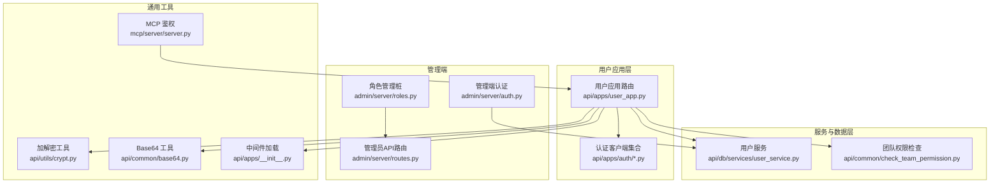
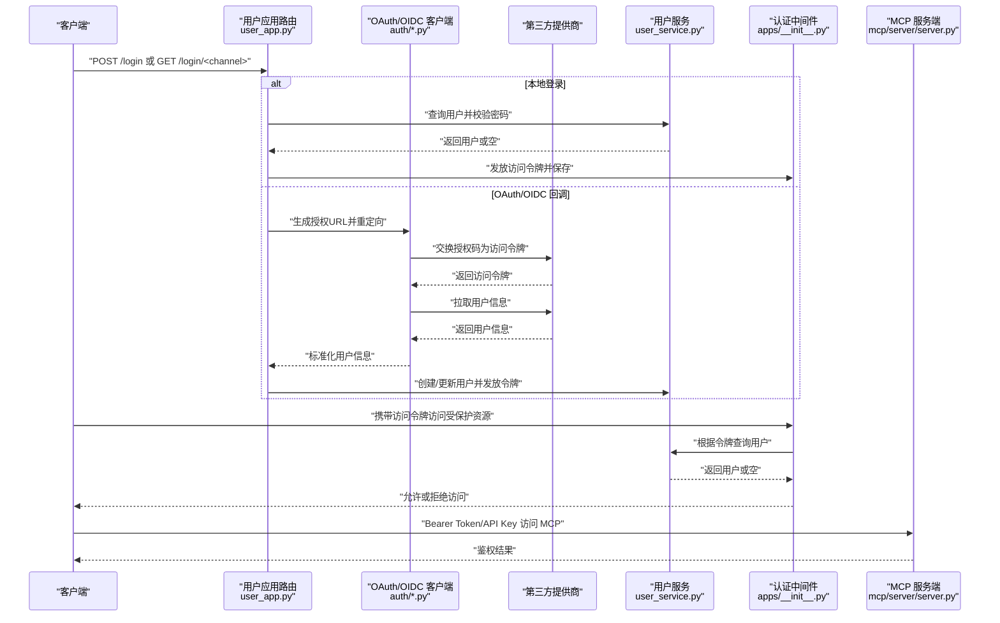
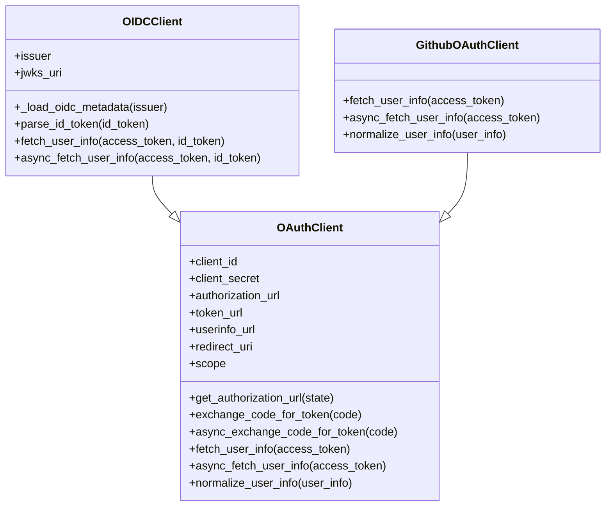
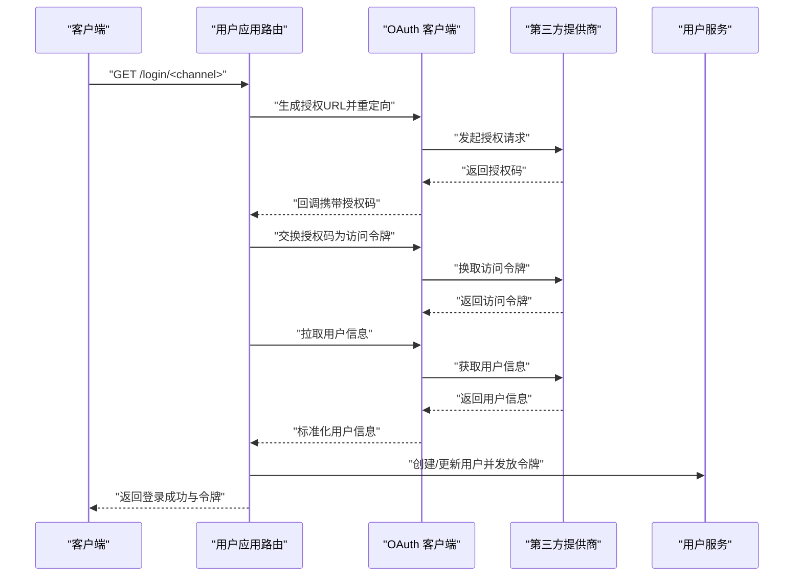
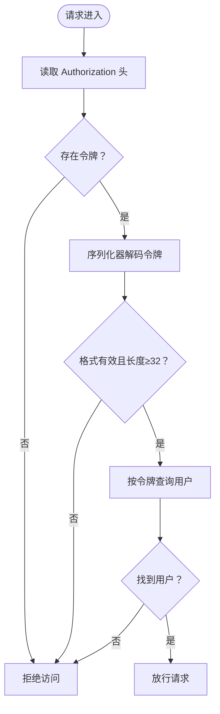
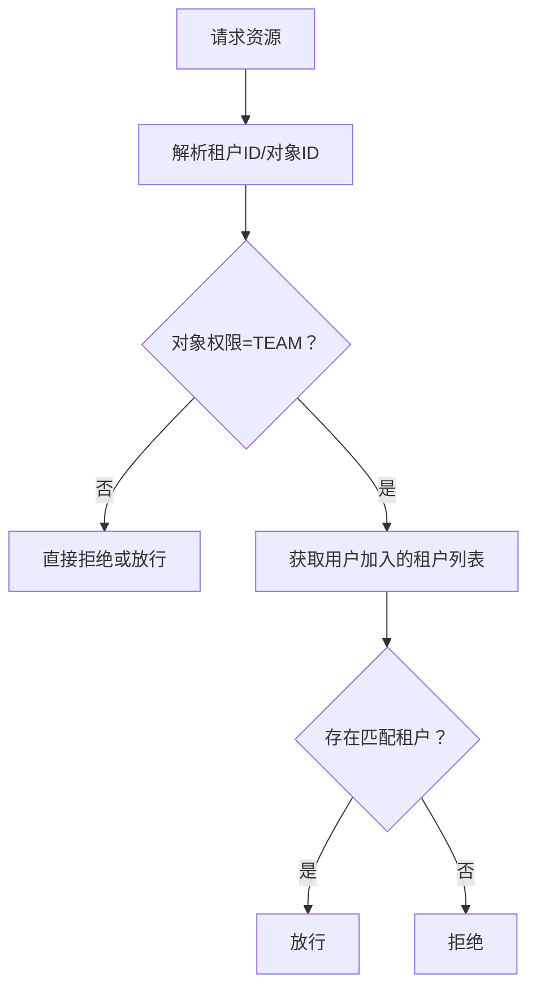
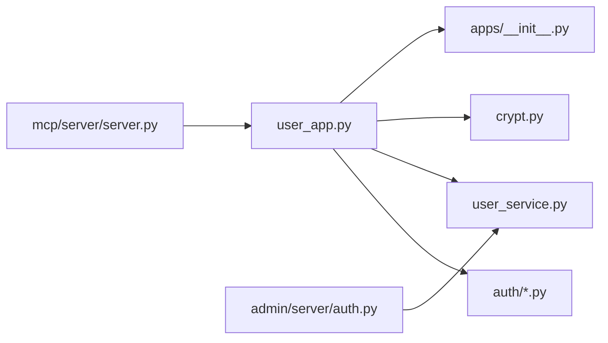

# 认证与授权API

<cite>
**本文引用的文件**
- [api/apps/auth/oauth.py](file://api/apps/auth/oauth.py)
- [api/apps/auth/oidc.py](file://api/apps/auth/oidc.py)
- [api/apps/auth/github.py](file://api/apps/auth/github.py)
- [api/apps/user_app.py](file://api/apps/user_app.py)
- [api/db/services/user_service.py](file://api/db/services/user_service.py)
- [api/utils/crypt.py](file://api/utils/crypt.py)
- [api/common/base64.py](file://api/common/base64.py)
- [api/common/check_team_permission.py](file://api/common/check_team_permission.py)
- [admin/server/auth.py](file://admin/server/auth.py)
- [admin/server/roles.py](file://admin/server/roles.py)
- [admin/server/routes.py](file://admin/server/routes.py)
- [api/apps/__init__.py](file://api/apps/__init__.py)
- [mcp/server/server.py](file://mcp/server/server.py)
</cite>

## 目录
1. [简介](#简介)
2. [项目结构](#项目结构)
3. [核心组件](#核心组件)
4. [架构总览](#架构总览)
5. [详细组件分析](#详细组件分析)
6. [依赖分析](#依赖分析)
7. [性能考虑](#性能考虑)
8. [故障排查指南](#故障排查指南)
9. [结论](#结论)
10. [附录](#附录)

## 简介
本文件为 RAGFlow 的认证与授权 API 参考文档，覆盖以下主题：
- 用户登录、注册、密码重置、API 密钥管理
- OAuth、OIDC 等第三方认证流程的端点与交互
- JWT 令牌的生成、验证与刷新机制
- 权限检查、角色管理与访问控制
- 完整请求/响应示例（成功登录、权限不足、账户锁定等）
- 认证中间件工作原理与安全最佳实践

## 项目结构
认证与授权相关代码主要分布在如下模块：
- 用户应用路由与登录流程：api/apps/user_app.py
- 第三方认证客户端：api/apps/auth/*.py
- 用户服务与权限校验：api/db/services/user_service.py、api/common/check_team_permission.py
- 管理端认证与角色：admin/server/auth.py、admin/server/roles.py、admin/server/routes.py
- 加解密工具：api/utils/crypt.py、api/common/base64.py
- 中间件与全局认证加载：api/apps/__init__.py
- MCP 服务端鉴权：mcp/server/server.py

图表来源
- [api/apps/user_app.py:65-200](file://api/apps/user_app.py#L65-L200)
- [api/apps/auth/oauth.py:32-152](file://api/apps/auth/oauth.py#L32-L152)
- [api/db/services/user_service.py:33-162](file://api/db/services/user_service.py#L33-L162)
- [api/common/check_team_permission.py:25-60](file://api/common/check_team_permission.py#L25-L60)
- [admin/server/auth.py:38-189](file://admin/server/auth.py#L38-L189)
- [admin/server/roles.py:23-77](file://admin/server/roles.py#L23-L77)
- [admin/server/routes.py:519-541](file://admin/server/routes.py#L519-L541)
- [api/utils/crypt.py:25-42](file://api/utils/crypt.py#L25-L42)
- [api/common/base64.py:19-21](file://api/common/base64.py#L19-L21)
- [api/apps/__init__.py:95-114](file://api/apps/__init__.py#L95-L114)
- [mcp/server/server.py:509-539](file://mcp/server/server.py#L509-L539)

章节来源
- [api/apps/user_app.py:65-200](file://api/apps/user_app.py#L65-L200)
- [api/apps/auth/oauth.py:32-152](file://api/apps/auth/oauth.py#L32-L152)
- [api/db/services/user_service.py:33-162](file://api/db/services/user_service.py#L33-L162)
- [api/common/check_team_permission.py:25-60](file://api/common/check_team_permission.py#L25-L60)
- [admin/server/auth.py:38-189](file://admin/server/auth.py#L38-L189)
- [admin/server/roles.py:23-77](file://admin/server/roles.py#L23-L77)
- [admin/server/routes.py:519-541](file://admin/server/routes.py#L519-L541)
- [api/utils/crypt.py:25-42](file://api/utils/crypt.py#L25-L42)
- [api/common/base64.py:19-21](file://api/common/base64.py#L19-L21)
- [api/apps/__init__.py:95-114](file://api/apps/__init__.py#L95-L114)
- [mcp/server/server.py:509-539](file://mcp/server/server.py#L509-L539)

## 核心组件
- OAuth/OIDC 客户端
  - OAuthClient：封装授权码交换、用户信息获取、用户信息标准化
  - OIDCClient：在 OAuth 基础上支持 OIDC 元数据发现、ID Token 解析与签名验证
  - GithubOAuthClient：针对 GitHub 的用户信息与邮箱合并逻辑
- 用户应用路由与认证
  - 登录、OAuth 回调、登录通道查询等端点
  - 使用加密工具对前端传入密码进行解密
- 用户服务与权限
  - 用户查询、认证、密码哈希、租户关系与角色
  - 团队权限检查（基于租户与知识库/文件权限）
- 管理端认证与角色
  - 管理端登录、管理员鉴权装饰器、角色管理接口（当前为占位实现）
- 中间件与全局认证加载
  - 基于序列化器的访问令牌解析与用户加载
- MCP 服务端鉴权
  - Bearer Token 与 API Key 的鉴权处理

章节来源
- [api/apps/auth/oauth.py:32-152](file://api/apps/auth/oauth.py#L32-L152)
- [api/apps/auth/oidc.py:22-108](file://api/apps/auth/oidc.py#L22-L108)
- [api/apps/auth/github.py:21-89](file://api/apps/auth/github.py#L21-L89)
- [api/apps/user_app.py:65-200](file://api/apps/user_app.py#L65-L200)
- [api/db/services/user_service.py:33-162](file://api/db/services/user_service.py#L33-L162)
- [api/common/check_team_permission.py:25-60](file://api/common/check_team_permission.py#L25-L60)
- [admin/server/auth.py:38-189](file://admin/server/auth.py#L38-L189)
- [admin/server/roles.py:23-77](file://admin/server/roles.py#L23-L77)
- [api/apps/__init__.py:95-114](file://api/apps/__init__.py#L95-L114)
- [mcp/server/server.py:509-539](file://mcp/server/server.py#L509-L539)

## 架构总览
下图展示从客户端到后端认证链路的整体交互，包括本地登录、OAuth/OIDC 回调、JWT 令牌发放与使用、以及管理端与 MCP 的鉴权。

图表来源
- [api/apps/user_app.py:65-200](file://api/apps/user_app.py#L65-L200)
- [api/apps/auth/oauth.py:48-152](file://api/apps/auth/oauth.py#L48-L152)
- [api/apps/auth/oidc.py:46-108](file://api/apps/auth/oidc.py#L46-L108)
- [api/db/services/user_service.py:44-102](file://api/db/services/user_service.py#L44-L102)
- [api/apps/__init__.py:95-114](file://api/apps/__init__.py#L95-L114)
- [mcp/server/server.py:509-539](file://mcp/server/server.py#L509-L539)

## 详细组件分析

### 组件A：OAuth/OIDC 客户端
- OAuthClient
  - 职责：生成授权 URL、交换授权码为访问令牌、拉取用户信息、标准化用户字段
  - 关键方法路径：[get_authorization_url:48-62](file://api/apps/auth/oauth.py#L48-L62)、[exchange_code_for_token:65-87](file://api/apps/auth/oauth.py#L65-L87)、[fetch_user_info:114-125](file://api/apps/auth/oauth.py#L114-L125)
  - 异步版本：[async_exchange_code_for_token:89-111](file://api/apps/auth/oauth.py#L89-L111)、[async_fetch_user_info:127-141](file://api/apps/auth/oauth.py#L127-L141)
  - 用户信息标准化：[normalize_user_info:144-151](file://api/apps/auth/oauth.py#L144-L151)
- OIDCClient
  - 职责：通过 /.well-known/openid-configuration 发现元数据；解析并验证 ID Token；结合访问令牌获取用户信息
  - 关键方法路径：[parse_id_token:60-85](file://api/apps/auth/oidc.py#L60-L85)、[fetch_user_info:88-96](file://api/apps/auth/oidc.py#L88-L96)
- GithubOAuthClient
  - 职责：针对 GitHub 的用户信息与邮箱合并逻辑
  - 关键方法路径：[fetch_user_info:35-53](file://api/apps/auth/github.py#L35-L53)、[normalize_user_info:83-88](file://api/apps/auth/github.py#L83-L88)

图表来源
- [api/apps/auth/oauth.py:32-152](file://api/apps/auth/oauth.py#L32-L152)
- [api/apps/auth/oidc.py:22-108](file://api/apps/auth/oidc.py#L22-L108)
- [api/apps/auth/github.py:21-89](file://api/apps/auth/github.py#L21-L89)

章节来源
- [api/apps/auth/oauth.py:32-152](file://api/apps/auth/oauth.py#L32-L152)
- [api/apps/auth/oidc.py:22-108](file://api/apps/auth/oidc.py#L22-L108)
- [api/apps/auth/github.py:21-89](file://api/apps/auth/github.py#L21-L89)

### 组件B：用户登录与第三方登录流程
- 登录端点
  - POST /login：本地用户名密码登录，校验账户状态与密码，发放访问令牌
  - GET /login/channels：列出可用的第三方登录渠道
  - GET /login/<channel>：跳转至第三方授权页面
  - GET /oauth/callback/<channel>：接收回调，交换授权码为访问令牌，拉取用户信息，完成登录
- 关键流程路径
  - 登录入口与参数校验：[login:66-141](file://api/apps/user_app.py#L66-L141)
  - 获取登录通道：[get_login_channels:144-162](file://api/apps/user_app.py#L144-L162)
  - 发起 OAuth 授权：[oauth_login:165-175](file://api/apps/user_app.py#L165-L175)
  - 处理回调并完成登录：[oauth_callback:178-200](file://api/apps/user_app.py#L178-L200)

图表来源
- [api/apps/user_app.py:165-200](file://api/apps/user_app.py#L165-L200)
- [api/apps/auth/oauth.py:65-125](file://api/apps/auth/oauth.py#L65-L125)
- [api/db/services/user_service.py:85-102](file://api/db/services/user_service.py#L85-L102)

章节来源
- [api/apps/user_app.py:65-200](file://api/apps/user_app.py#L65-L200)
- [api/apps/auth/oauth.py:65-125](file://api/apps/auth/oauth.py#L65-L125)
- [api/db/services/user_service.py:85-102](file://api/db/services/user_service.py#L85-L102)

### 组件C：JWT 令牌生成、验证与刷新
- 令牌生成
  - 登录成功后生成 UUID 作为访问令牌并保存，随后在响应头中携带
  - 路径参考：[login 成功分支:126-135](file://api/apps/user_app.py#L126-L135)
- 令牌验证
  - 中间件从 Authorization 头部读取令牌，使用序列化器解码并查询用户
  - 路径参考：[全局认证加载:95-114](file://api/apps/__init__.py#L95-L114)、[管理端认证加载:38-71](file://admin/server/auth.py#L38-L71)
- 刷新机制
  - 当前代码未实现专用的“刷新令牌”端点；建议采用短期访问令牌 + 重新登录换取新令牌的方式，或引入 refresh_token 存储与校验

图表来源
- [api/apps/__init__.py:95-114](file://api/apps/__init__.py#L95-L114)
- [admin/server/auth.py:38-71](file://admin/server/auth.py#L38-L71)

章节来源
- [api/apps/user_app.py:126-135](file://api/apps/user_app.py#L126-L135)
- [api/apps/__init__.py:95-114](file://api/apps/__init__.py#L95-L114)
- [admin/server/auth.py:38-71](file://admin/server/auth.py#L38-L71)

### 组件D：权限检查、角色管理与访问控制
- 团队权限检查
  - 基于租户与知识库/文件权限判断是否可访问
  - 路径参考：[check_kb_team_permission:25-37](file://api/common/check_team_permission.py#L25-L37)、[check_file_team_permission:40-59](file://api/common/check_team_permission.py#L40-L59)
- 角色管理
  - 管理端角色管理接口当前为占位实现，抛出异常提示未实现
  - 路径参考：[RoleMgr:23-77](file://admin/server/roles.py#L23-L77)
- 管理端访问控制
  - 管理员登录与权限校验装饰器
  - 路径参考：[login_admin:108-133](file://admin/server/auth.py#L108-L133)、[check_admin_auth:92-105](file://admin/server/auth.py#L92-L105)

图表来源
- [api/common/check_team_permission.py:25-59](file://api/common/check_team_permission.py#L25-L59)

章节来源
- [api/common/check_team_permission.py:25-59](file://api/common/check_team_permission.py#L25-L59)
- [admin/server/roles.py:23-77](file://admin/server/roles.py#L23-L77)
- [admin/server/auth.py:92-133](file://admin/server/auth.py#L92-L133)

### 组件E：API 密钥管理
- 管理端 API 密钥
  - 生成、查询、删除 API 密钥的路由
  - 路径参考：[生成密钥:519-528](file://admin/server/routes.py#L519-L528)、[查询密钥:529-541](file://admin/server/routes.py#L529-L541)
- 密钥使用
  - MCP 服务端支持在 Authorization 头或自定义头部 api_key 中携带密钥进行鉴权
  - 路径参考：[MCP 鉴权:509-539](file://mcp/server/server.py#L509-L539)

章节来源
- [admin/server/routes.py:519-541](file://admin/server/routes.py#L519-L541)
- [mcp/server/server.py:509-539](file://mcp/server/server.py#L509-L539)

## 依赖分析
- 组件耦合
  - 用户应用路由依赖认证客户端、用户服务、加密工具与中间件
  - 管理端认证依赖用户服务与配置项
  - MCP 服务端鉴权独立于主应用，但共享密钥概念
- 外部依赖
  - 第三方 OAuth/OIDC 提供商的授权端点、令牌端点、用户信息端点
  - PyJWT 用于 OIDC ID Token 验证
- 潜在循环依赖
  - 当前模块间以工具函数与服务类为主，未见明显循环导入

图表来源
- [api/apps/user_app.py:65-200](file://api/apps/user_app.py#L65-L200)
- [api/apps/auth/oauth.py:32-152](file://api/apps/auth/oauth.py#L32-L152)
- [api/db/services/user_service.py:33-162](file://api/db/services/user_service.py#L33-L162)
- [api/utils/crypt.py:25-42](file://api/utils/crypt.py#L25-L42)
- [api/apps/__init__.py:95-114](file://api/apps/__init__.py#L95-L114)
- [mcp/server/server.py:509-539](file://mcp/server/server.py#L509-L539)

章节来源
- [api/apps/user_app.py:65-200](file://api/apps/user_app.py#L65-L200)
- [api/apps/auth/oauth.py:32-152](file://api/apps/auth/oauth.py#L32-L152)
- [api/db/services/user_service.py:33-162](file://api/db/services/user_service.py#L33-L162)
- [api/utils/crypt.py:25-42](file://api/utils/crypt.py#L25-L42)
- [api/apps/__init__.py:95-114](file://api/apps/__init__.py#L95-L114)
- [mcp/server/server.py:509-539](file://mcp/server/server.py#L509-L539)

## 性能考虑
- HTTP 请求超时
  - OAuth/OIDC 客户端在与第三方交互时设置固定超时，避免阻塞
  - 路径参考：[http_request_timeout:45-46](file://api/apps/auth/oauth.py#L45-L46)
- 数据库查询优化
  - 用户查询对 access_token 进行长度与格式校验，避免无效查询
  - 路径参考：[UserService.query:44-66](file://api/db/services/user_service.py#L44-L66)
- 缓存与会话
  - 建议对第三方用户信息与 OIDC JWKS 进行缓存，降低重复网络请求开销

## 故障排查指南
- 登录失败
  - 账户不存在或密码错误：检查邮箱与密码输入，确认数据库中用户状态有效
  - 默认管理员账户不可用于普通服务登录：参考登录逻辑中的限制
  - 路径参考：[login:100-141](file://api/apps/user_app.py#L100-L141)
- 权限不足
  - 管理端非管理员或账户未激活：检查管理员权限与账户状态
  - 路径参考：[check_admin_auth:92-105](file://admin/server/auth.py#L92-L105)
- 第三方登录异常
  - 授权码缺失或 state 不匹配：检查回调 URL 与会话状态
  - 路径参考：[oauth_callback:178-200](file://api/apps/user_app.py#L178-L200)
- OIDC ID Token 验证失败
  - 检查 JWKS URI 与签名算法，确保 audience 与 issuer 配置正确
  - 路径参考：[parse_id_token:60-85](file://api/apps/auth/oidc.py#L60-L85)
- API 密钥问题
  - 生成/查询/删除失败：检查管理端路由与用户是否存在
  - 路径参考：[admin routes:519-541](file://admin/server/routes.py#L519-L541)

章节来源
- [api/apps/user_app.py:100-141](file://api/apps/user_app.py#L100-L141)
- [admin/server/auth.py:92-105](file://admin/server/auth.py#L92-L105)
- [api/apps/user_app.py:178-200](file://api/apps/user_app.py#L178-L200)
- [api/apps/auth/oidc.py:60-85](file://api/apps/auth/oidc.py#L60-L85)
- [admin/server/routes.py:519-541](file://admin/server/routes.py#L519-L541)

## 结论
本文件梳理了 RAGFlow 的认证与授权体系，涵盖本地登录、OAuth/OIDC 第三方登录、JWT 令牌发放与验证、团队权限检查、管理端访问控制与 API 密钥管理。建议后续完善刷新令牌机制、引入更细粒度的角色与权限模型，并对第三方交互与 JWKS 进行缓存优化。

## 附录

### API 端点清单与示例
- 用户登录
  - 方法与路径：POST /login
  - 请求体字段：email、password（需经后端解密）
  - 成功响应：返回用户信息与访问令牌
  - 失败示例：账户禁用、密码不匹配
  - 路径参考：[login:66-141](file://api/apps/user_app.py#L66-L141)
- 获取登录通道
  - 方法与路径：GET /login/channels
  - 返回：支持的第三方登录渠道列表
  - 路径参考：[get_login_channels:144-162](file://api/apps/user_app.py#L144-L162)
- 第三方登录
  - 方法与路径：GET /login/<channel>、GET /oauth/callback/<channel>
  - 流程：重定向至授权页 → 回调交换授权码 → 拉取用户信息 → 登录完成
  - 路径参考：[oauth_login:165-175](file://api/apps/user_app.py#L165-L175)、[oauth_callback:178-200](file://api/apps/user_app.py#L178-L200)
- 管理端登录
  - 方法与路径：POST /admin/login（如存在）
  - 要求：管理员账户、有效状态
  - 路径参考：[login_admin:108-133](file://admin/server/auth.py#L108-L133)
- API 密钥管理（管理端）
  - 生成：POST /admin/users/{username}/keys
  - 查询：GET /admin/users/{username}/keys
  - 删除：DELETE /admin/users/{username}/keys/{key}
  - 路径参考：[admin routes:519-541](file://admin/server/routes.py#L519-L541)

章节来源
- [api/apps/user_app.py:66-200](file://api/apps/user_app.py#L66-L200)
- [admin/server/auth.py:108-133](file://admin/server/auth.py#L108-L133)
- [admin/server/routes.py:519-541](file://admin/server/routes.py#L519-L541)