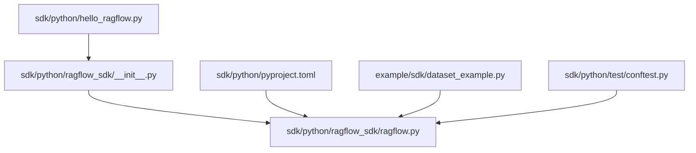
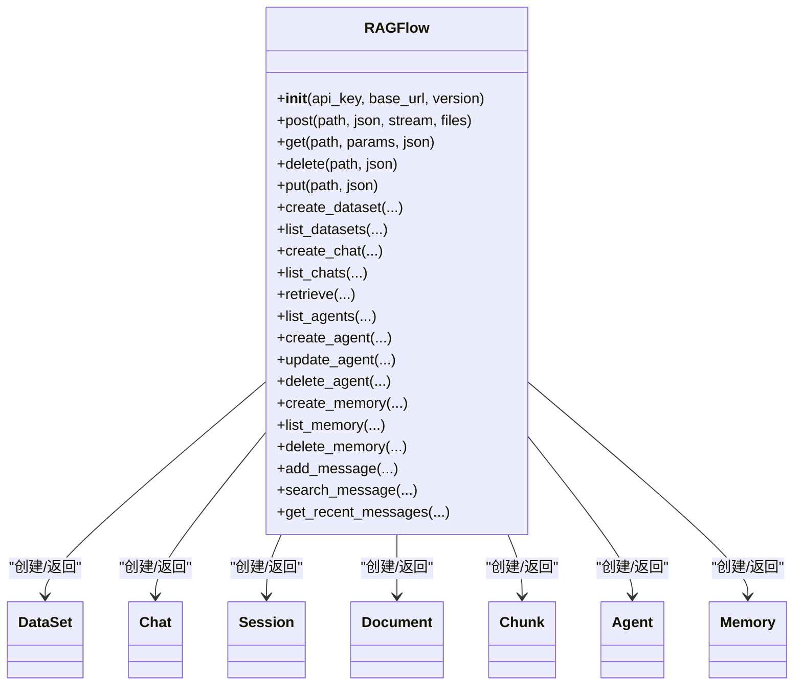
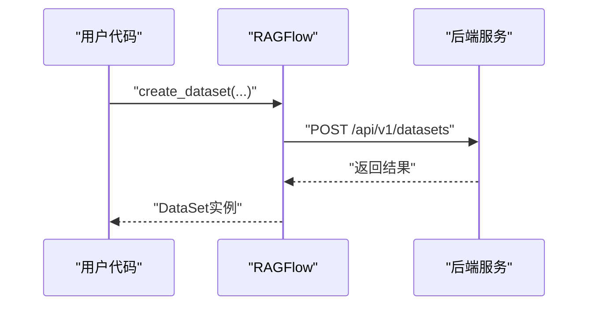
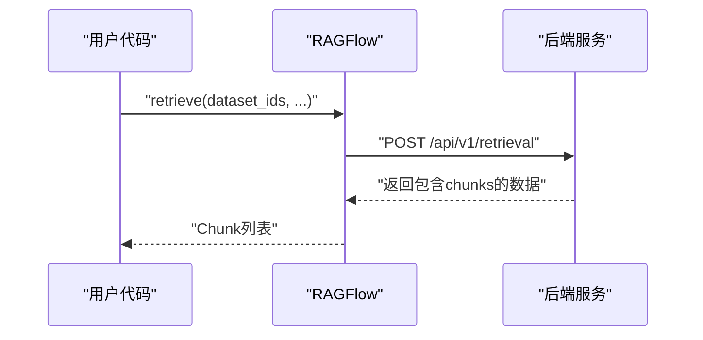
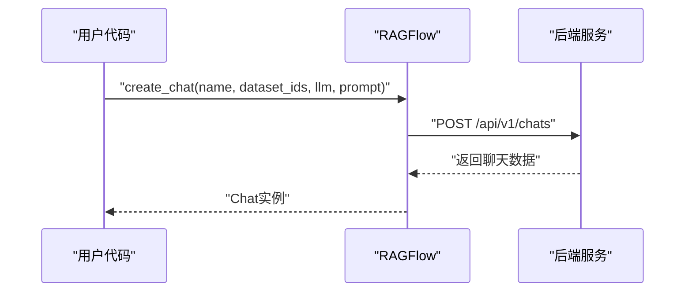
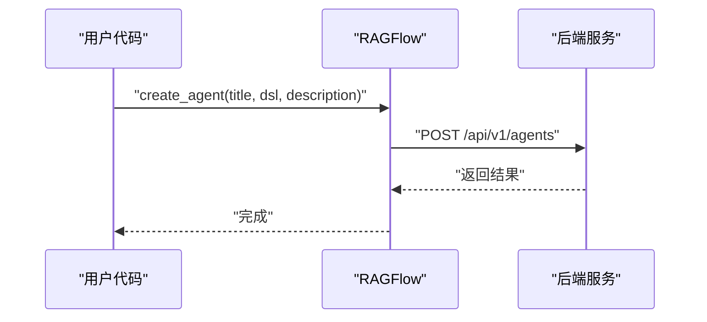
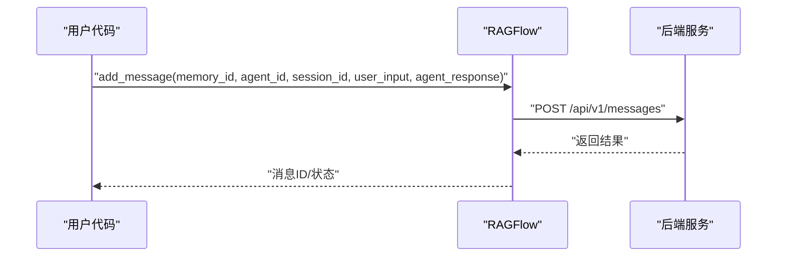
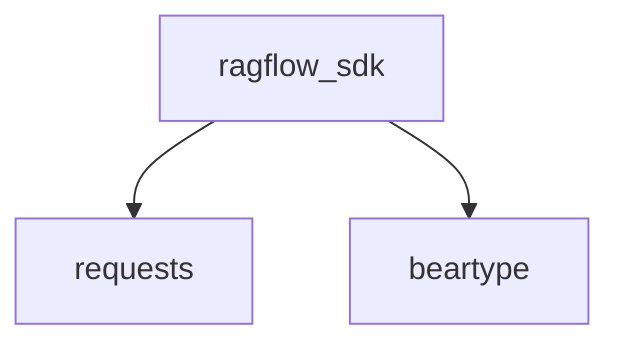

# Python SDK 使用指南

<cite>
**本文引用的文件**
- [sdk/python/ragflow_sdk/__init__.py](file://sdk/python/ragflow_sdk/__init__.py)
- [sdk/python/ragflow_sdk/ragflow.py](file://sdk/python/ragflow_sdk/ragflow.py)
- [sdk/python/pyproject.toml](file://sdk/python/pyproject.toml)
- [example/sdk/dataset_example.py](file://example/sdk/dataset_example.py)
- [sdk/python/hello_ragflow.py](file://sdk/python/hello_ragflow.py)
- [sdk/python/test/conftest.py](file://sdk/python/test/conftest.py)
</cite>

## 目录
1. [简介](#简介)
2. [项目结构](#项目结构)
3. [核心组件](#核心组件)
4. [架构总览](#架构总览)
5. [详细组件分析](#详细组件分析)
6. [依赖分析](#依赖分析)
7. [性能考虑](#性能考虑)
8. [故障排查指南](#故障排查指南)
9. [结论](#结论)
10. [附录](#附录)

## 简介
本指南面向希望在Python环境中使用RAGFlow提供的Python SDK进行数据集管理、聊天与检索、智能体与记忆体等操作的开发者。文档涵盖SDK安装（pip安装与源码安装）、初始化与认证配置、完整API说明、常见使用场景与最佳实践、错误处理机制、版本兼容性与升级建议、性能优化与内存管理技巧，以及测试与调试方法。

## 项目结构
RAGFlow Python SDK位于仓库的sdk/python目录下，核心入口为包级导出，主客户端类定义于ragflow.py中，版本信息与依赖声明位于pyproject.toml。示例与测试分别位于example/sdk与sdk/python/test目录。

**图表来源**
- [sdk/python/ragflow_sdk/__init__.py:1-43](file://sdk/python/ragflow_sdk/__init__.py#L1-L43)
- [sdk/python/ragflow_sdk/ragflow.py:1-376](file://sdk/python/ragflow_sdk/ragflow.py#L1-L376)
- [sdk/python/pyproject.toml:1-32](file://sdk/python/pyproject.toml#L1-L32)
- [example/sdk/dataset_example.py:1-54](file://example/sdk/dataset_example.py#L1-L54)
- [sdk/python/hello_ragflow.py:1-20](file://sdk/python/hello_ragflow.py#L1-L20)
- [sdk/python/test/conftest.py:1-153](file://sdk/python/test/conftest.py#L1-L153)

**章节来源**
- [sdk/python/ragflow_sdk/__init__.py:1-43](file://sdk/python/ragflow_sdk/__init__.py#L1-L43)
- [sdk/python/ragflow_sdk/ragflow.py:1-376](file://sdk/python/ragflow_sdk/ragflow.py#L1-L376)
- [sdk/python/pyproject.toml:1-32](file://sdk/python/pyproject.toml#L1-L32)
- [example/sdk/dataset_example.py:1-54](file://example/sdk/dataset_example.py#L1-L54)
- [sdk/python/hello_ragflow.py:1-20](file://sdk/python/hello_ragflow.py#L1-L20)
- [sdk/python/test/conftest.py:1-153](file://sdk/python/test/conftest.py#L1-L153)

## 核心组件
- 包导出与版本
  - 包通过__all__统一导出RAGFlow主类与各功能模块类，便于直接从包名导入使用。
  - 版本号通过importlib.metadata从包元数据读取，确保与发布版本一致。
- 主客户端RAGFlow
  - 提供HTTP请求封装（post/get/delete/put），并以“/api/{version}”作为基础路径拼接。
  - 提供数据集、聊天、检索、智能体、记忆体等高级API方法。
- 功能模块
  - DataSet、Chat、Session、Document、Chunk、Agent、Memory：由RAGFlow实例创建或返回，承载具体资源对象与操作方法。

**章节来源**
- [sdk/python/ragflow_sdk/__init__.py:20-43](file://sdk/python/ragflow_sdk/__init__.py#L20-L43)
- [sdk/python/ragflow_sdk/ragflow.py:27-51](file://sdk/python/ragflow_sdk/ragflow.py#L27-L51)

## 架构总览
SDK采用“包导出 + 主客户端 + 资源模块”的分层设计。调用流程通常为：创建RAGFlow实例 -> 调用高层API（如创建数据集/聊天）-> 返回资源对象（如DataSet/Chat）-> 对资源对象执行进一步操作。

**图表来源**
- [sdk/python/ragflow_sdk/ragflow.py:27-376](file://sdk/python/ragflow_sdk/ragflow.py#L27-L376)
- [sdk/python/ragflow_sdk/__init__.py:22-42](file://sdk/python/ragflow_sdk/__init__.py#L22-L42)

## 详细组件分析

### 安装与环境要求
- Python版本
  - 需要Python版本范围：>=3.12,<3.15。
- 依赖库
  - requests>=2.30.0,<3.0.0；beartype>=0.20.0,<1.0.0。
- pip安装
  - 使用pip安装已发布的包，版本号以包元数据为准。
- 源码安装
  - 从仓库根目录进入sdk/python，使用pip install -e .进行可编辑安装，便于本地开发与调试。
- 示例验证
  - 可运行hello_ragflow.py打印SDK版本，确认安装成功。

**章节来源**
- [sdk/python/pyproject.toml:7-9](file://sdk/python/pyproject.toml#L7-L9)
- [sdk/python/pyproject.toml:1-3](file://sdk/python/pyproject.toml#L1-L3)
- [sdk/python/hello_ragflow.py:17-19](file://sdk/python/hello_ragflow.py#L17-L19)

### 初始化与认证配置
- 基本初始化
  - 传入API密钥与后端服务地址，SDK会自动拼接“/api/{version}”作为基础URL，并在请求头中添加Authorization: Bearer {token}。
- 认证头
  - 所有HTTP请求均携带Authorization头，确保与后端鉴权机制一致。
- 连接设置
  - 支持GET/POST/PUT/DELETE四种HTTP方法封装，便于调用后端REST接口。

**章节来源**
- [sdk/python/ragflow_sdk/ragflow.py:27-51](file://sdk/python/ragflow_sdk/ragflow.py#L27-L51)

### 数据集管理
- 创建数据集
  - 支持指定名称、头像、描述、嵌入模型、权限、分片策略与解析器配置。
- 列表与查询
  - 支持分页、排序与过滤（id/name）列出数据集。
- 删除数据集
  - 支持批量删除。
- 典型流程
  - 创建 -> 更新 -> 查询 -> 删除，参考示例脚本。

**图表来源**
- [sdk/python/ragflow_sdk/ragflow.py:52-78](file://sdk/python/ragflow_sdk/ragflow.py#L52-L78)

**章节来源**
- [sdk/python/ragflow_sdk/ragflow.py:52-110](file://sdk/python/ragflow_sdk/ragflow.py#L52-L110)
- [example/sdk/dataset_example.py:27-47](file://example/sdk/dataset_example.py#L27-L47)

### 文档与分片检索
- 检索接口
  - 支持按数据集ID、文档ID、问题、相似度阈值、向量权重、关键词检索、重排模型、跨语言、元数据条件、知识图谱增强等参数进行检索。
- 返回结构
  - 返回Chunk列表，便于后续处理与展示。

**图表来源**
- [sdk/python/ragflow_sdk/ragflow.py:191-236](file://sdk/python/ragflow_sdk/ragflow.py#L191-L236)

**章节来源**
- [sdk/python/ragflow_sdk/ragflow.py:191-236](file://sdk/python/ragflow_sdk/ragflow.py#L191-L236)

### 聊天与会话
- 创建聊天
  - 支持指定名称、头像、数据集ID列表、LLM配置与提示词模板。
- 列表与查询
  - 支持分页与过滤列出聊天。
- 默认配置
  - 若未提供LLM与Prompt，SDK会填充默认值，便于快速上手。

**图表来源**
- [sdk/python/ragflow_sdk/ragflow.py:111-164](file://sdk/python/ragflow_sdk/ragflow.py#L111-L164)

**章节来源**
- [sdk/python/ragflow_sdk/ragflow.py:111-189](file://sdk/python/ragflow_sdk/ragflow.py#L111-L189)

### 智能体管理
- 列举智能体
  - 支持分页与过滤。
- 创建智能体
  - 传入标题、DSL与可选描述。
- 更新与删除
  - 支持按ID更新与删除。

**图表来源**
- [sdk/python/ragflow_sdk/ragflow.py:237-293](file://sdk/python/ragflow_sdk/ragflow.py#L237-L293)

**章节来源**
- [sdk/python/ragflow_sdk/ragflow.py:237-293](file://sdk/python/ragflow_sdk/ragflow.py#L237-L293)

### 记忆体与消息
- 创建记忆体
  - 指定名称、类型、嵌入模型ID与LLM ID。
- 列举与删除
  - 支持分页、过滤与删除。
- 消息管理
  - 添加消息、搜索消息、获取最近消息，支持相似度阈值与关键词权重等参数。

**图表来源**
- [sdk/python/ragflow_sdk/ragflow.py:294-376](file://sdk/python/ragflow_sdk/ragflow.py#L294-L376)

**章节来源**
- [sdk/python/ragflow_sdk/ragflow.py:294-376](file://sdk/python/ragflow_sdk/ragflow.py#L294-L376)

### 错误处理与异常类型
- 统一错误处理
  - SDK在每次HTTP响应后解析JSON，若返回码非0则抛出异常，异常消息来自后端返回的message字段。
- 建议实践
  - 在调用高层API时使用try/except捕获异常，结合日志记录定位问题。
  - 对于检索与消息相关接口，注意检查输入参数是否符合后端约束。

**章节来源**
- [sdk/python/ragflow_sdk/ragflow.py:75-77](file://sdk/python/ragflow_sdk/ragflow.py#L75-L77)
- [sdk/python/ragflow_sdk/ragflow.py:82-83](file://sdk/python/ragflow_sdk/ragflow.py#L82-L83)
- [sdk/python/ragflow_sdk/ragflow.py:104-109](file://sdk/python/ragflow_sdk/ragflow.py#L104-L109)
- [sdk/python/ragflow_sdk/ragflow.py:165-169](file://sdk/python/ragflow_sdk/ragflow.py#L165-L169)
- [sdk/python/ragflow_sdk/ragflow.py:184-189](file://sdk/python/ragflow_sdk/ragflow.py#L184-L189)
- [sdk/python/ragflow_sdk/ragflow.py:229-235](file://sdk/python/ragflow_sdk/ragflow.py#L229-L235)
- [sdk/python/ragflow_sdk/ragflow.py:266-267](file://sdk/python/ragflow_sdk/ragflow.py#L266-L267)
- [sdk/python/ragflow_sdk/ragflow.py:284-285](file://sdk/python/ragflow_sdk/ragflow.py#L284-L285)
- [sdk/python/ragflow_sdk/ragflow.py:299-299](file://sdk/python/ragflow_sdk/ragflow.py#L299-L299)
- [sdk/python/ragflow_sdk/ragflow.py:315-316](file://sdk/python/ragflow_sdk/ragflow.py#L315-L316)
- [sdk/python/ragflow_sdk/ragflow.py:330-331](file://sdk/python/ragflow_sdk/ragflow.py#L330-L331)
- [sdk/python/ragflow_sdk/ragflow.py:345-345](file://sdk/python/ragflow_sdk/ragflow.py#L345-L345)
- [sdk/python/ragflow_sdk/ragflow.py:361-361](file://sdk/python/ragflow_sdk/ragflow.py#L361-L361)
- [sdk/python/ragflow_sdk/ragflow.py:374-375](file://sdk/python/ragflow_sdk/ragflow.py#L374-L375)

### 版本兼容性与升级指南
- Python版本
  - SDK要求Python版本在3.12至3.14之间，请确保运行环境满足此范围。
- 依赖版本
  - requests与beartype版本范围已在pyproject.toml中固定，升级前请先检查兼容性。
- 升级步骤
  - pip升级：pip install --upgrade ragflow-sdk
  - 源码升级：切换到新分支/标签后重新安装。
- 发布说明
  - 参考仓库release_notes与docs/release_notes.md获取变更摘要与迁移指引。

**章节来源**
- [sdk/python/pyproject.toml:7-9](file://sdk/python/pyproject.toml#L7-L9)
- [sdk/python/pyproject.toml:1-3](file://sdk/python/pyproject.toml#L1-L3)

### 性能优化与内存管理
- 请求与流式传输
  - SDK提供stream参数用于POST请求，适合大文件上传或流式响应场景，避免一次性加载全部内容。
- 分页与批量
  - 列表类接口支持分页与批量操作，减少单次请求负载。
- 参数优化
  - 合理设置top_k、top_n、相似度阈值等参数，平衡召回质量与性能。
- 内存管理
  - 处理大量Chunk或消息时，及时释放不需要的对象引用，避免内存累积。
  - 使用with上下文或显式析构函数清理资源。

**章节来源**
- [sdk/python/ragflow_sdk/ragflow.py:36-38](file://sdk/python/ragflow_sdk/ragflow.py#L36-L38)
- [sdk/python/ragflow_sdk/ragflow.py:91-109](file://sdk/python/ragflow_sdk/ragflow.py#L91-L109)
- [sdk/python/ragflow_sdk/ragflow.py:171-189](file://sdk/python/ragflow_sdk/ragflow.py#L171-L189)
- [sdk/python/ragflow_sdk/ragflow.py:237-255](file://sdk/python/ragflow_sdk/ragflow.py#L237-L255)
- [sdk/python/ragflow_sdk/ragflow.py:302-325](file://sdk/python/ragflow_sdk/ragflow.py#L302-L325)

### 测试与调试
- 测试框架
  - 使用pytest作为测试框架，标记了p1/p2/p3优先级。
- 自动化准备
  - conftest.py提供注册、登录、生成API Key、设置租户信息与模型等自动化前置步骤，便于集成测试。
- 调试技巧
  - 在本地运行时设置环境变量HOST_ADDRESS与ZHIPU_AI_API_KEY，确保测试可访问后端服务。
  - 对于HTTP请求失败，检查Authorization头与基础URL拼接是否正确。

**章节来源**
- [sdk/python/pyproject.toml:26-31](file://sdk/python/pyproject.toml#L26-L31)
- [sdk/python/test/conftest.py:22-25](file://sdk/python/test/conftest.py#L22-L25)
- [sdk/python/test/conftest.py:63-86](file://sdk/python/test/conftest.py#L63-L86)
- [sdk/python/test/conftest.py:131-153](file://sdk/python/test/conftest.py#L131-L153)

## 依赖分析
SDK对requests与beartype存在直接依赖，前者用于HTTP通信，后者用于类型校验增强。版本范围在pyproject.toml中明确限定。

**图表来源**
- [sdk/python/pyproject.toml:8-9](file://sdk/python/pyproject.toml#L8-L9)

**章节来源**
- [sdk/python/pyproject.toml:8-9](file://sdk/python/pyproject.toml#L8-L9)

## 性能考虑
- 网络层
  - 合理设置超时与重试策略，避免阻塞主线程。
- 序列化
  - 将复杂对象转换为JSON时，尽量精简payload，减少不必要的字段。
- 并发
  - 在业务层控制并发数量，避免对后端造成过大压力。
- 缓存
  - 对于重复查询（如列表/检索），可在应用层引入缓存策略降低请求频率。

[本节为通用指导，无需特定文件来源]

## 故障排查指南
- 常见错误
  - 401/403：检查API Key与Authorization头是否正确。
  - 404：确认基础URL与版本号拼接是否正确。
  - 5xx：联系后端管理员或查看服务日志。
- 日志与诊断
  - 在调用处打印响应状态码与消息，便于定位问题。
  - 使用conftest中的自动化流程快速复现问题。

**章节来源**
- [sdk/python/ragflow_sdk/ragflow.py:36-50](file://sdk/python/ragflow_sdk/ragflow.py#L36-L50)
- [sdk/python/test/conftest.py:42-60](file://sdk/python/test/conftest.py#L42-L60)

## 结论
RAGFlow Python SDK提供了简洁易用的高层API，覆盖数据集、聊天、检索、智能体与记忆体等核心能力。通过严格的版本与依赖约束、完善的错误处理与测试工具链，开发者可以快速构建基于RAG的文档理解与问答应用。建议在生产环境中结合性能优化与监控策略，持续迭代以获得更佳体验。

[本节为总结性内容，无需特定文件来源]

## 附录
- 快速开始
  - 安装：pip install ragflow-sdk
  - 初始化：RAGFlow(api_key, base_url)
  - 示例：参考dataset_example.py进行数据集CRUD操作
- 参考示例
  - 数据集示例：[dataset_example.py:1-54](file://example/sdk/dataset_example.py#L1-L54)
  - 版本打印：[hello_ragflow.py:17-19](file://sdk/python/hello_ragflow.py#L17-L19)
- 测试入口
  - pytest配置与标记：[pyproject.toml:26-31](file://sdk/python/pyproject.toml#L26-L31)
  - 自动化前置：[conftest.py:63-86](file://sdk/python/test/conftest.py#L63-L86)

**章节来源**
- [example/sdk/dataset_example.py:27-47](file://example/sdk/dataset_example.py#L27-L47)
- [sdk/python/hello_ragflow.py:17-19](file://sdk/python/hello_ragflow.py#L17-L19)
- [sdk/python/pyproject.toml:26-31](file://sdk/python/pyproject.toml#L26-L31)
- [sdk/python/test/conftest.py:63-86](file://sdk/python/test/conftest.py#L63-L86)