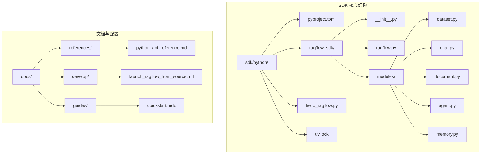
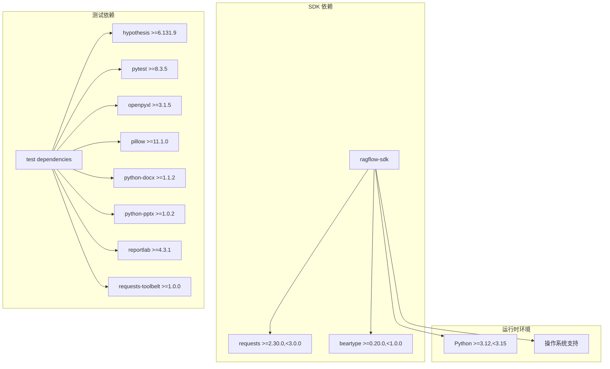
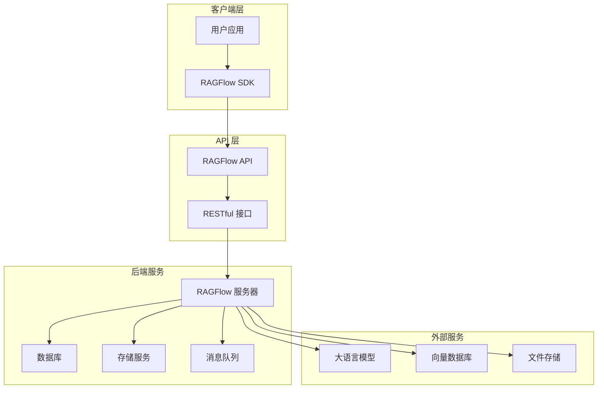
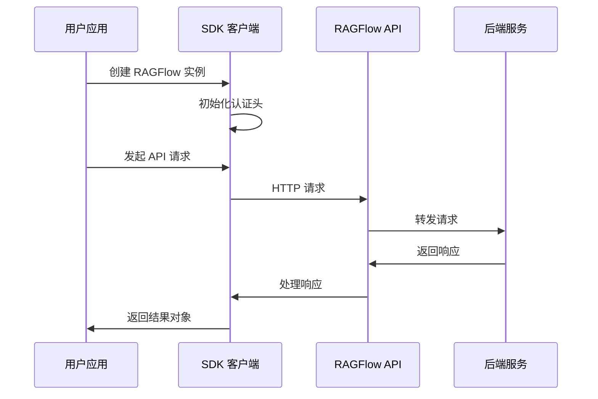
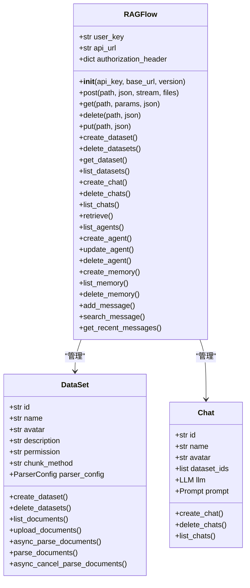
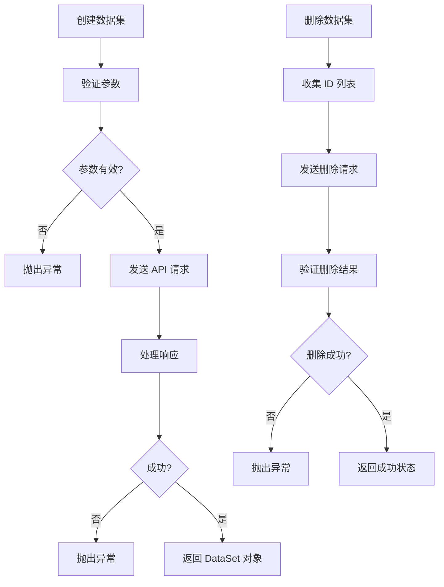
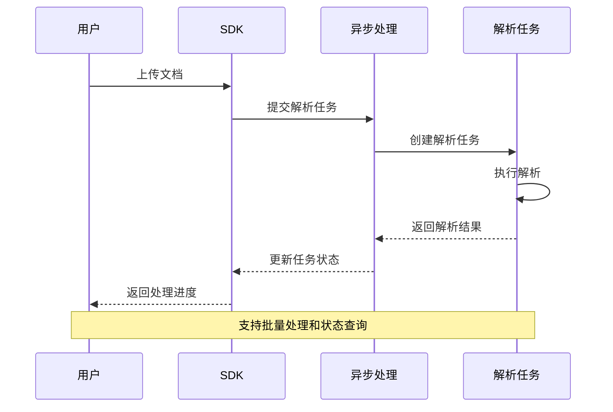
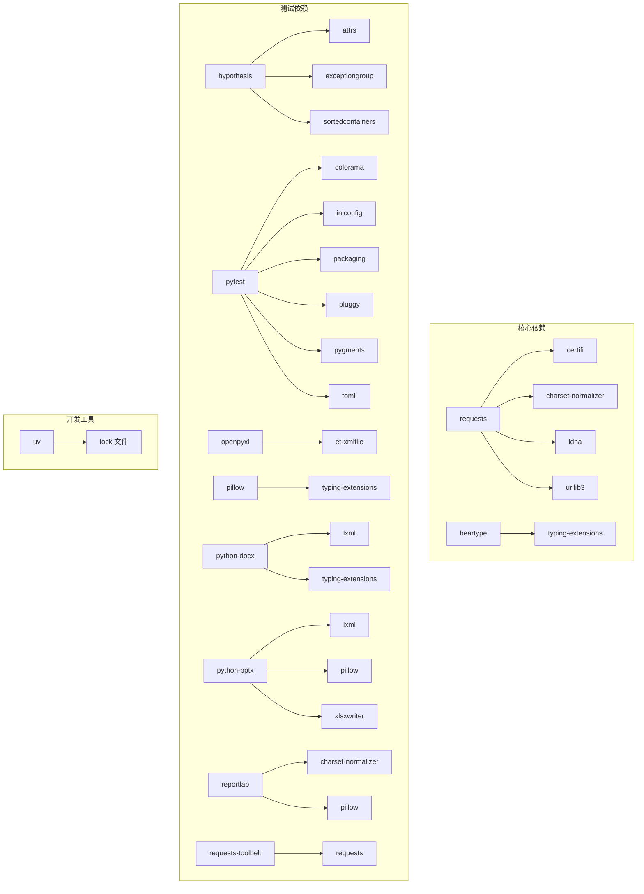

# SDK 安装与配置

<cite>
**本文档引用的文件**
- [pyproject.toml](file://sdk/python/pyproject.toml)
- [ragflow.py](file://sdk/python/ragflow_sdk/ragflow.py)
- [__init__.py](file://sdk/python/ragflow_sdk/__init__.py)
- [hello_ragflow.py](file://sdk/python/hello_ragflow.py)
- [uv.lock](file://sdk/python/uv.lock)
- [python_api_reference.md](file://docs/references/python_api_reference.md)
- [launch_ragflow_from_source.md](file://docs/develop/launch_ragflow_from_source.md)
- [quickstart.mdx](file://docs/quickstart.mdx)
</cite>

## 目录
1. [简介](#简介)
2. [项目结构](#项目结构)
3. [核心组件](#核心组件)
4. [架构概览](#架构概览)
5. [详细组件分析](#详细组件分析)
6. [依赖关系分析](#依赖关系分析)
7. [性能考虑](#性能考虑)
8. [故障排除指南](#故障排除指南)
9. [结论](#结论)

## 简介

RAGFlow Python SDK 是一个功能完整的客户端库，用于与 RAGFlow 智能检索增强生成引擎进行交互。该 SDK 提供了简单易用的 API 接口，支持数据集管理、文档处理、聊天对话、智能体操作等多种功能。

本 SDK 基于 Python 3.12-3.14 版本开发，使用 requests 库进行 HTTP 通信，并通过 beartype 库提供运行时类型检查。SDK 支持从 PyPI 直接安装，也支持从源码构建安装。

## 项目结构

RAGFlow Python SDK 的项目结构清晰，主要包含以下关键组件：



**图表来源**
- [pyproject.toml:1-32](file://sdk/python/pyproject.toml#L1-L32)
- [__init__.py:1-43](file://sdk/python/ragflow_sdk/__init__.py#L1-L43)

**章节来源**
- [pyproject.toml:1-32](file://sdk/python/pyproject.toml#L1-L32)
- [__init__.py:1-43](file://sdk/python/ragflow_sdk/__init__.py#L1-L43)

## 核心组件

### 主要依赖关系

SDK 的核心依赖关系如下所示：



**图表来源**
- [pyproject.toml:8-31](file://sdk/python/pyproject.toml#L8-L31)
- [uv.lock:409-421](file://sdk/python/uv.lock#L409-L421)

### 版本信息

SDK 当前版本为 0.23.1，支持 Python 3.12 到 3.14 版本范围。

**章节来源**
- [pyproject.toml:2-8](file://sdk/python/pyproject.toml#L2-L8)
- [uv.lock:355-361](file://sdk/python/uv.lock#L355-L361)

## 架构概览

### 整体架构设计



**图表来源**
- [ragflow.py:27-50](file://sdk/python/ragflow_sdk/ragflow.py#L27-L50)

### 数据流架构

SDK 通过统一的 RAGFlow 类来管理所有 API 调用，支持多种数据操作模式：



**图表来源**
- [ragflow.py:28-50](file://sdk/python/ragflow_sdk/ragflow.py#L28-L50)

**章节来源**
- [ragflow.py:27-376](file://sdk/python/ragflow_sdk/ragflow.py#L27-L376)

## 详细组件分析

### RAGFlow 核心类

RAGFlow 类是 SDK 的核心组件，提供了所有主要的 API 功能：



**图表来源**
- [ragflow.py:27-376](file://sdk/python/ragflow_sdk/ragflow.py#L27-L376)

### 数据集管理功能

数据集管理是 SDK 的核心功能之一，支持完整的数据集生命周期管理：



**图表来源**
- [ragflow.py:52-84](file://sdk/python/ragflow_sdk/ragflow.py#L52-L84)

### 文档处理流程

SDK 提供了完整的文档处理能力，支持异步和同步处理模式：



**图表来源**
- [ragflow.py:664-751](file://sdk/python/ragflow_sdk/ragflow.py#L664-L751)

**章节来源**
- [ragflow.py:52-376](file://sdk/python/ragflow_sdk/ragflow.py#L52-L376)

## 依赖关系分析

### 依赖树结构



**图表来源**
- [uv.lock:409-485](file://sdk/python/uv.lock#L409-L485)

### 版本兼容性矩阵

| 组件 | 最低版本 | 最高版本 | 兼容性 |
|------|----------|----------|--------|
| Python | 3.12 | 3.14 | ✅ 完全兼容 |
| requests | 2.30.0 | 2.99.9 | ✅ 向后兼容 |
| beartype | 0.20.0 | 0.99.9 | ✅ 类型安全 |
| pytest | 8.3.5 | 8.99.9 | ✅ 测试支持 |
| hypothesis | 6.131.9 | 6.999.9 | ✅ 高级测试 |

**章节来源**
- [pyproject.toml:8-31](file://sdk/python/pyproject.toml#L8-L31)
- [uv.lock:409-485](file://sdk/python/uv.lock#L409-L485)

## 性能考虑

### 内存优化策略

SDK 在设计时考虑了内存使用效率：

1. **延迟加载**: 模块采用延迟导入机制，减少启动时间
2. **流式处理**: 支持大文件的流式上传和下载
3. **连接复用**: 使用持久连接池减少网络开销
4. **类型检查**: 运行时类型检查在开发阶段进行，不影响生产性能

### 并发处理

SDK 支持并发操作，但需要注意以下限制：

- **线程安全**: requests 库本身是线程安全的
- **连接池**: 默认使用连接池管理 HTTP 连接
- **超时设置**: 建议根据网络环境调整超时参数

## 故障排除指南

### 常见安装问题

#### 1. Python 版本不兼容

**问题**: 安装时报错提示 Python 版本不匹配

**解决方案**:
```bash
# 检查 Python 版本
python --version

# 使用兼容的 Python 版本
pyenv install 3.12.0
pyenv global 3.12.0
```

#### 2. 依赖安装失败

**问题**: pip 安装依赖时出现编译错误

**解决方案**:
```bash
# 清理 pip 缓存
pip cache purge

# 升级 pip 和 setuptools
pip install --upgrade pip setuptools wheel

# 使用预编译的 wheel 包
pip install --only-binary=all ragflow-sdk
```

#### 3. 网络连接问题

**问题**: 访问 API 时出现连接超时

**解决方案**:
```python
from ragflow_sdk import RAGFlow
import requests

# 设置超时和重试
rag = RAGFlow(
    api_key="your_api_key",
    base_url="http://your_server:9380",
    timeout=30,
    retries=3
)
```

### 配置验证

#### 1. 基础连接测试

```python
# 基础版本检查
import ragflow_sdk
print(f"SDK 版本: {ragflow_sdk.__version__}")

# API 连接测试
from ragflow_sdk import RAGFlow

try:
    rag = RAGFlow(
        api_key="your_api_key",
        base_url="http://localhost:9380"
    )
    print("连接成功!")
except Exception as e:
    print(f"连接失败: {e}")
```

#### 2. 环境变量配置

```bash
# 设置环境变量
export RAGFLOW_API_KEY="your_api_key"
export RAGFLOW_BASE_URL="http://localhost:9380"

# 在 Python 中读取
import os
from ragflow_sdk import RAGFlow

rag = RAGFlow(
    api_key=os.getenv("RAGFLOW_API_KEY"),
    base_url=os.getenv("RAGFLOW_BASE_URL")
)
```

**章节来源**
- [hello_ragflow.py:17-19](file://sdk/python/hello_ragflow.py#L17-L19)
- [python_api_reference.md:10-19](file://docs/references/python_api_reference.md#L10-L19)

## 结论

RAGFlow Python SDK 提供了一个功能完整、易于使用的客户端库，支持与 RAGFlow 引擎的所有核心功能进行交互。SDK 的设计充分考虑了易用性和性能，在保持简洁 API 的同时提供了强大的功能。

### 主要优势

1. **简单易用**: 直观的 API 设计，学习成本低
2. **功能完整**: 支持数据集管理、文档处理、聊天对话等所有核心功能
3. **类型安全**: 基于 beartype 的运行时类型检查
4. **兼容性强**: 支持 Python 3.12-3.14 版本范围
5. **文档完善**: 详细的 API 参考和使用示例

### 最佳实践建议

1. **版本管理**: 始终使用兼容的 Python 版本
2. **依赖管理**: 使用虚拟环境隔离依赖
3. **错误处理**: 实现适当的异常处理机制
4. **性能优化**: 合理设置超时和重试参数
5. **安全配置**: 保护 API 密钥和敏感信息

通过遵循本文档提供的安装和配置指南，开发者可以快速集成 RAGFlow SDK 到自己的应用程序中，充分利用 RAGFlow 的强大功能。