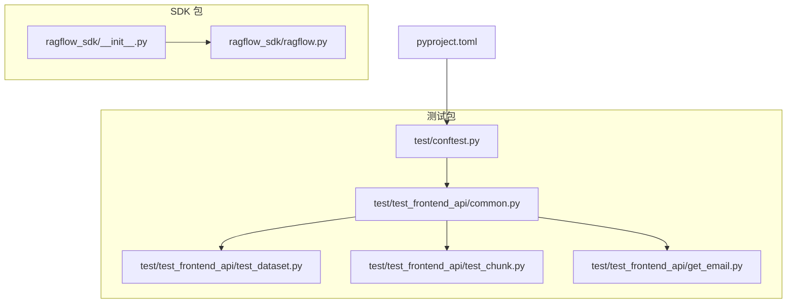
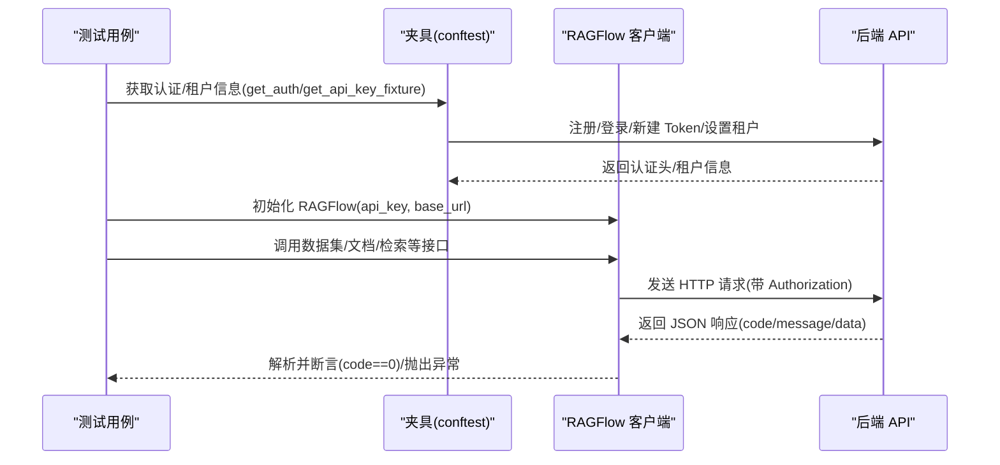
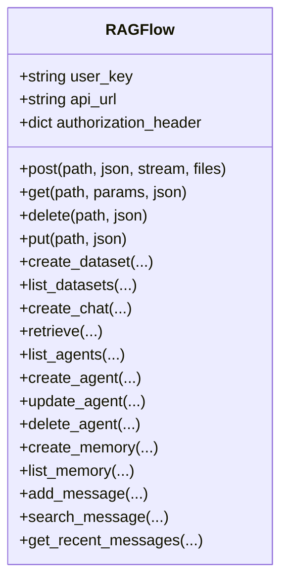
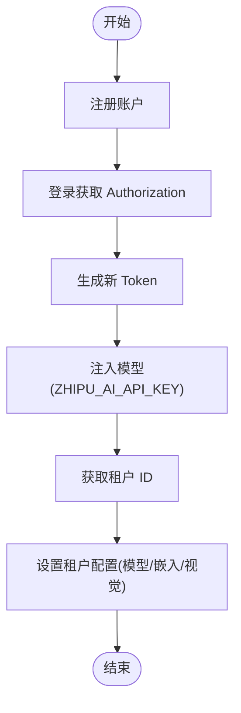
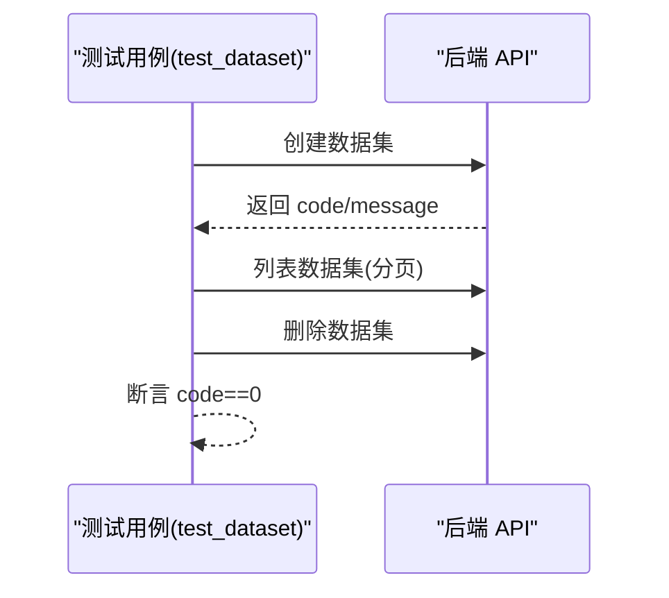
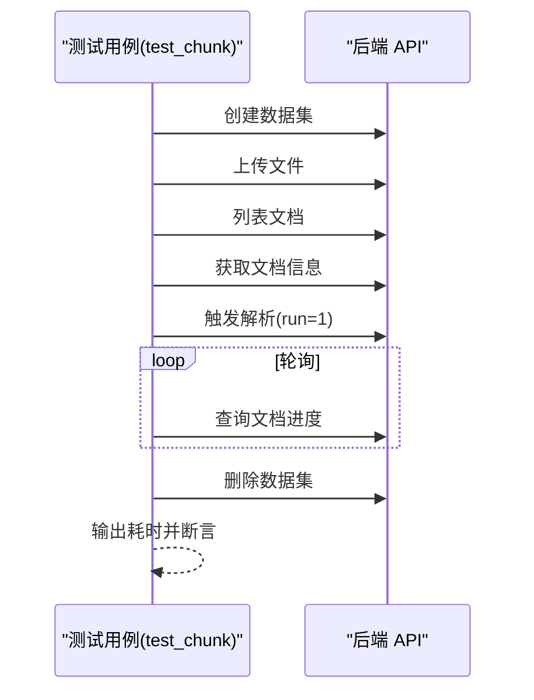
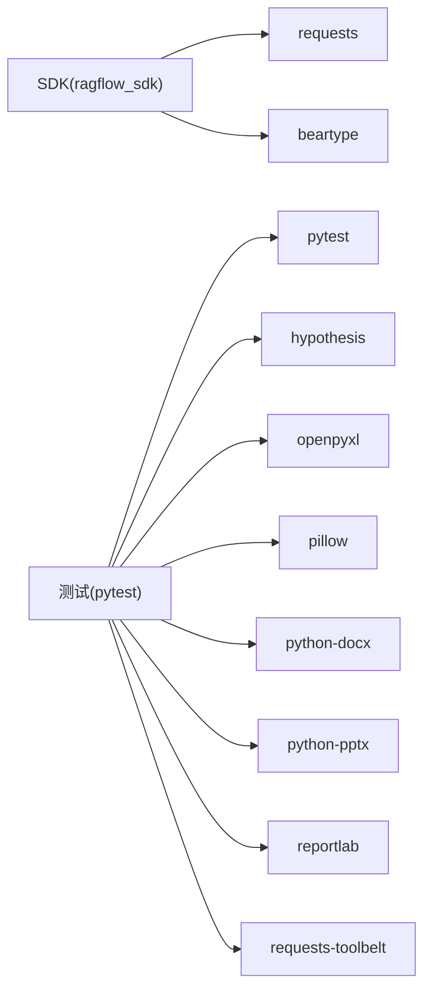

# SDK 测试与调试

<cite>
**本文引用的文件**
- [sdk/python/pyproject.toml](file://sdk/python/pyproject.toml)
- [sdk/python/test/conftest.py](file://sdk/python/test/conftest.py)
- [sdk/python/test/test_frontend_api/common.py](file://sdk/python/test/test_frontend_api/common.py)
- [sdk/python/test/test_frontend_api/get_email.py](file://sdk/python/test/test_frontend_api/get_email.py)
- [sdk/python/test/test_frontend_api/test_chunk.py](file://sdk/python/test/test_frontend_api/test_chunk.py)
- [sdk/python/test/test_frontend_api/test_dataset.py](file://sdk/python/test/test_frontend_api/test_dataset.py)
- [sdk/python/ragflow_sdk/__init__.py](file://sdk/python/ragflow_sdk/__init__.py)
- [sdk/python/ragflow_sdk/ragflow.py](file://sdk/python/ragflow_sdk/ragflow.py)
- [sdk/python/hello_ragflow.py](file://sdk/python/hello_ragflow.py)
</cite>

## 目录
1. [引言](#引言)
2. [项目结构](#项目结构)
3. [核心组件](#核心组件)
4. [架构总览](#架构总览)
5. [详细组件分析](#详细组件分析)
6. [依赖分析](#依赖分析)
7. [性能考虑](#性能考虑)
8. [故障排查指南](#故障排查指南)
9. [结论](#结论)
10. [附录](#附录)

## 引言
本文件面向 Python SDK 的测试与调试，覆盖单元测试、集成测试、测试环境搭建、测试数据准备、常见场景与模拟请求编写、调试与日志分析、性能与压力测试、测试覆盖率与质量评估、测试自动化与持续集成配置以及问题排查与故障诊断等主题。内容以仓库中 SDK 与测试相关代码为依据，结合实际可执行流程进行说明。

## 项目结构
SDK 与测试相关的关键位置如下：
- SDK 包：sdk/python/ragflow_sdk
- 测试包：sdk/python/test
- 测试用例示例：sdk/python/test/test_frontend_api/*.py
- 测试配置与夹具：sdk/python/test/conftest.py
- 依赖与标记定义：sdk/python/pyproject.toml
- 示例入口：sdk/python/hello_ragflow.py

**图表来源**
- [sdk/python/ragflow_sdk/__init__.py:17-42](file://sdk/python/ragflow_sdk/__init__.py#L17-L42)
- [sdk/python/ragflow_sdk/ragflow.py:27-51](file://sdk/python/ragflow_sdk/ragflow.py#L27-L51)
- [sdk/python/test/conftest.py:63-91](file://sdk/python/test/conftest.py#L63-L91)
- [sdk/python/test/test_frontend_api/common.py:26-96](file://sdk/python/test/test_frontend_api/common.py#L26-L96)
- [sdk/python/test/test_frontend_api/test_dataset.py:23-46](file://sdk/python/test/test_frontend_api/test_dataset.py#L23-L46)
- [sdk/python/test/test_frontend_api/test_chunk.py:22-72](file://sdk/python/test/test_frontend_api/test_chunk.py#L22-L72)
- [sdk/python/test/test_frontend_api/get_email.py:17-19](file://sdk/python/test/test_frontend_api/get_email.py#L17-L19)
- [sdk/python/pyproject.toml:26-31](file://sdk/python/pyproject.toml#L26-L31)

**章节来源**
- [sdk/python/ragflow_sdk/__init__.py:17-42](file://sdk/python/ragflow_sdk/__init__.py#L17-L42)
- [sdk/python/test/conftest.py:22-25](file://sdk/python/test/conftest.py#L22-L25)
- [sdk/python/pyproject.toml:26-31](file://sdk/python/pyproject.toml#L26-L31)

## 核心组件
- SDK 入口与导出：通过包级导出统一暴露 RAGFlow 与各模块类，便于外部直接导入使用。
- RAGFlow 客户端：封装 HTTP 请求（GET/POST/PUT/DELETE），负责与后端 API 交互，并对响应进行解析与异常抛出。
- 测试夹具与通用接口：在 conftest 中提供会话级认证、租户设置、模型注入等；在 common.py 中封装常用数据集/文档操作接口。

关键要点
- SDK 使用 Bearer Token 认证，所有请求均携带 Authorization 头。
- RAGFlow 对后端返回的 code 字段进行断言，非零时抛出异常，便于测试中断言错误码。
- 测试通过环境变量 HOST_ADDRESS 指定后端地址，ZHIPU_AI_API_KEY 用于注入第三方模型密钥。

**章节来源**
- [sdk/python/ragflow_sdk/__init__.py:17-42](file://sdk/python/ragflow_sdk/__init__.py#L17-L42)
- [sdk/python/ragflow_sdk/ragflow.py:27-51](file://sdk/python/ragflow_sdk/ragflow.py#L27-L51)
- [sdk/python/test/conftest.py:22-25](file://sdk/python/test/conftest.py#L22-L25)
- [sdk/python/test/conftest.py:63-91](file://sdk/python/test/conftest.py#L63-L91)
- [sdk/python/test/test_frontend_api/common.py:26-96](file://sdk/python/test/test_frontend_api/common.py#L26-L96)

## 架构总览
SDK 与测试的整体交互关系如下：

**图表来源**
- [sdk/python/test/conftest.py:63-91](file://sdk/python/test/conftest.py#L63-L91)
- [sdk/python/ragflow_sdk/ragflow.py:27-51](file://sdk/python/ragflow_sdk/ragflow.py#L27-L51)
- [sdk/python/test/test_frontend_api/common.py:26-96](file://sdk/python/test/test_frontend_api/common.py#L26-L96)

## 详细组件分析

### 组件一：RAGFlow 客户端
职责与行为
- 提供统一的 HTTP 方法封装（post/get/delete/put）。
- 将用户提供的 API Key 组装为 Bearer Token 并附加到请求头。
- 对后端返回的 JSON 进行解析，当 code 非 0 时抛出异常，便于上层断言与测试捕获。

设计模式与复杂度
- 简单的适配器/封装模式，无复杂继承或组合关系。
- 单次请求时间复杂度近似 O(1)，主要受网络与后端处理影响。

异常与错误处理
- 对后端响应进行严格校验，非零 code 直接抛出异常，利于测试中断言错误场景。

性能与健壮性
- 支持文件上传（stream/files 参数），适合大文件场景。
- 通过参数化查询支持分页与过滤，避免一次性拉取过多数据。

**图表来源**
- [sdk/python/ragflow_sdk/ragflow.py:27-376](file://sdk/python/ragflow_sdk/ragflow.py#L27-L376)

**章节来源**
- [sdk/python/ragflow_sdk/ragflow.py:27-51](file://sdk/python/ragflow_sdk/ragflow.py#L27-L51)
- [sdk/python/ragflow_sdk/ragflow.py:52-109](file://sdk/python/ragflow_sdk/ragflow.py#L52-L109)
- [sdk/python/ragflow_sdk/ragflow.py:111-189](file://sdk/python/ragflow_sdk/ragflow.py#L111-L189)
- [sdk/python/ragflow_sdk/ragflow.py:191-235](file://sdk/python/ragflow_sdk/ragflow.py#L191-L235)
- [sdk/python/ragflow_sdk/ragflow.py:237-293](file://sdk/python/ragflow_sdk/ragflow.py#L237-L293)
- [sdk/python/ragflow_sdk/ragflow.py:294-376](file://sdk/python/ragflow_sdk/ragflow.py#L294-L376)

### 组件二：测试夹具与通用接口
- 夹具作用域：会话级（scope="session"），减少重复注册/登录成本。
- 自动化设置：在夹具中自动完成注册、登录、新增 Token、注入模型与设置租户。
- 通用接口：封装数据集创建/列表/删除/更新、文档上传/列表/信息获取/解析等常用操作。

**图表来源**
- [sdk/python/test/conftest.py:42-60](file://sdk/python/test/conftest.py#L42-L60)
- [sdk/python/test/conftest.py:106-119](file://sdk/python/test/conftest.py#L106-L119)
- [sdk/python/test/conftest.py:121-128](file://sdk/python/test/conftest.py#L121-L128)
- [sdk/python/test/conftest.py:131-152](file://sdk/python/test/conftest.py#L131-L152)

**章节来源**
- [sdk/python/test/conftest.py:63-91](file://sdk/python/test/conftest.py#L63-L91)
- [sdk/python/test/conftest.py:106-119](file://sdk/python/test/conftest.py#L106-L119)
- [sdk/python/test/conftest.py:121-152](file://sdk/python/test/conftest.py#L121-L152)
- [sdk/python/test/test_frontend_api/common.py:26-96](file://sdk/python/test/test_frontend_api/common.py#L26-L96)

### 组件三：测试用例示例
- 数据集测试：验证创建、列表、删除、批量创建、重名处理、非法名称、更新参数成功/失败等场景。
- 文档解析测试：上传文本文件，轮询解析进度直至完成，统计耗时并清理数据集。

**图表来源**
- [sdk/python/test/test_frontend_api/test_dataset.py:23-46](file://sdk/python/test/test_frontend_api/test_dataset.py#L23-L46)
- [sdk/python/test/test_frontend_api/test_dataset.py:49-73](file://sdk/python/test/test_frontend_api/test_dataset.py#L49-L73)

**章节来源**
- [sdk/python/test/test_frontend_api/test_dataset.py:23-46](file://sdk/python/test/test_frontend_api/test_dataset.py#L23-L46)
- [sdk/python/test/test_frontend_api/test_dataset.py:49-73](file://sdk/python/test/test_frontend_api/test_dataset.py#L49-L73)
- [sdk/python/test/test_frontend_api/test_dataset.py:100-116](file://sdk/python/test/test_frontend_api/test_dataset.py#L100-L116)
- [sdk/python/test/test_frontend_api/test_dataset.py:119-150](file://sdk/python/test/test_frontend_api/test_dataset.py#L119-L150)
- [sdk/python/test/test_frontend_api/test_dataset.py:154-183](file://sdk/python/test/test_frontend_api/test_dataset.py#L154-L183)

**图表来源**
- [sdk/python/test/test_frontend_api/test_chunk.py:22-72](file://sdk/python/test/test_frontend_api/test_chunk.py#L22-L72)
- [sdk/python/test/test_frontend_api/common.py:57-91](file://sdk/python/test/test_frontend_api/common.py#L57-L91)

**章节来源**
- [sdk/python/test/test_frontend_api/test_chunk.py:22-72](file://sdk/python/test/test_frontend_api/test_chunk.py#L22-L72)
- [sdk/python/test/test_frontend_api/common.py:57-91](file://sdk/python/test/test_frontend_api/common.py#L57-L91)

## 依赖分析
- SDK 依赖 requests 与 beartype，前者用于 HTTP 通信，后者用于类型检查增强。
- 测试依赖 pytest、hypothesis、openpyxl、pillow、python-docx、python-pptx、reportlab、requests-toolbelt 等，覆盖多种文件格式与测试策略。
- 测试标记 p1/p2/p3 用于优先级分类，便于选择性执行。

**图表来源**
- [sdk/python/pyproject.toml:9-23](file://sdk/python/pyproject.toml#L9-L23)
- [sdk/python/ragflow_sdk/ragflow.py:18-18](file://sdk/python/ragflow_sdk/ragflow.py#L18-L18)

**章节来源**
- [sdk/python/pyproject.toml:9-23](file://sdk/python/pyproject.toml#L9-L23)
- [sdk/python/pyproject.toml:26-31](file://sdk/python/pyproject.toml#L26-L31)

## 性能考虑
- 文件上传与解析：建议使用流式上传与分页查询，避免一次性传输过大数据。
- 批量操作：测试中演示了批量创建/删除数据集，有助于评估后端吞吐能力。
- 轮询策略：解析进度采用定时轮询，建议根据任务规模调整等待间隔与超时阈值。
- 并发测试：可结合 pytest-xdist 或自定义并发框架进行压力测试，关注连接池与重试策略。

[本节为通用指导，无需具体文件引用]

## 故障排查指南
常见问题与定位步骤
- 认证失败：确认环境变量 HOST_ADDRESS 与 ZHIPU_AI_API_KEY 已正确设置；检查夹具中的注册/登录流程是否抛出异常。
- 租户配置：若 set_tenant_info 抛错，检查模型注入与租户 ID 获取是否成功。
- 接口断言：RAGFlow 在 code 非 0 时抛出异常，测试中应捕获并输出 message 以便定位。
- 网络与超时：如解析长时间不完成，检查后端服务状态与任务队列；适当增加轮询间隔与最大等待时间。
- 日志与输出：测试用例中使用 print 输出关键信息（如邮箱、耗时），便于快速定位问题。

**章节来源**
- [sdk/python/test/conftest.py:22-25](file://sdk/python/test/conftest.py#L22-L25)
- [sdk/python/test/conftest.py:131-152](file://sdk/python/test/conftest.py#L131-L152)
- [sdk/python/ragflow_sdk/ragflow.py:75-77](file://sdk/python/ragflow_sdk/ragflow.py#L75-L77)
- [sdk/python/test/test_frontend_api/test_chunk.py:56-66](file://sdk/python/test/test_frontend_api/test_chunk.py#L56-L66)

## 结论
本文件基于仓库中的 SDK 与测试代码，给出了从环境搭建、夹具与通用接口、典型测试用例到性能与故障排查的完整实践路径。建议在 CI 中固定后端地址与密钥，结合测试标记与覆盖率工具，形成稳定可靠的自动化测试体系。

[本节为总结性内容，无需具体文件引用]

## 附录

### A. 测试环境搭建与准备
- 安装依赖：使用项目内依赖组（测试相关）进行安装。
- 设置环境变量：
  - HOST_ADDRESS：后端服务地址，默认本地回环端口。
  - ZHIPU_AI_API_KEY：用于注入第三方模型密钥。
- 启动后端：确保后端服务可用，端口与协议符合预期。

**章节来源**
- [sdk/python/pyproject.toml:12-23](file://sdk/python/pyproject.toml#L12-L23)
- [sdk/python/test/conftest.py:22-25](file://sdk/python/test/conftest.py#L22-L25)

### B. 常见测试场景与模拟请求编写
- 数据集管理：创建/列表/删除/更新，覆盖正常与异常输入。
- 文档处理：上传不同格式文件，触发解析并轮询进度。
- 会话与检索：创建聊天/代理，调用检索接口并断言结果。

**章节来源**
- [sdk/python/test/test_frontend_api/test_dataset.py:23-46](file://sdk/python/test/test_frontend_api/test_dataset.py#L23-L46)
- [sdk/python/test/test_frontend_api/test_chunk.py:22-72](file://sdk/python/test/test_frontend_api/test_chunk.py#L22-L72)
- [sdk/python/test/test_frontend_api/common.py:26-96](file://sdk/python/test/test_frontend_api/common.py#L26-L96)

### C. 调试工具与日志分析
- 使用 print 输出关键上下文（如邮箱、耗时）。
- 捕获并打印后端返回的 message 字段，辅助定位错误原因。
- 在 CI 中开启更详细的日志输出，便于远程排障。

**章节来源**
- [sdk/python/test/test_frontend_api/get_email.py:17-19](file://sdk/python/test/test_frontend_api/get_email.py#L17-L19)
- [sdk/python/test/test_frontend_api/test_chunk.py:66-66](file://sdk/python/test/test_frontend_api/test_chunk.py#L66-L66)

### D. 性能与压力测试实施
- 压力测试：构造大量数据集/文档，观察后端吞吐与延迟。
- 并发测试：使用多线程/多进程并发调用，评估客户端与后端的稳定性。
- 资源监控：结合系统监控指标（CPU/内存/网络）评估瓶颈。

[本节为通用指导，无需具体文件引用]

### E. 测试覆盖率与质量评估
- 覆盖率工具：可在 CI 中集成覆盖率收集与报告生成。
- 质量门禁：设定最小覆盖率阈值，阻断低质量变更。

[本节为通用指导，无需具体文件引用]

### F. 测试自动化与持续集成
- 测试标记：利用 p1/p2/p3 标记区分优先级，按需选择性执行。
- CI 配置：在流水线中设置环境变量、启动后端、运行测试与覆盖率上报。

**章节来源**
- [sdk/python/pyproject.toml:26-31](file://sdk/python/pyproject.toml#L26-L31)

### G. 示例入口与版本确认
- 可通过示例脚本打印 SDK 版本，验证安装与导入是否正常。

**章节来源**
- [sdk/python/hello_ragflow.py:17-19](file://sdk/python/hello_ragflow.py#L17-L19)