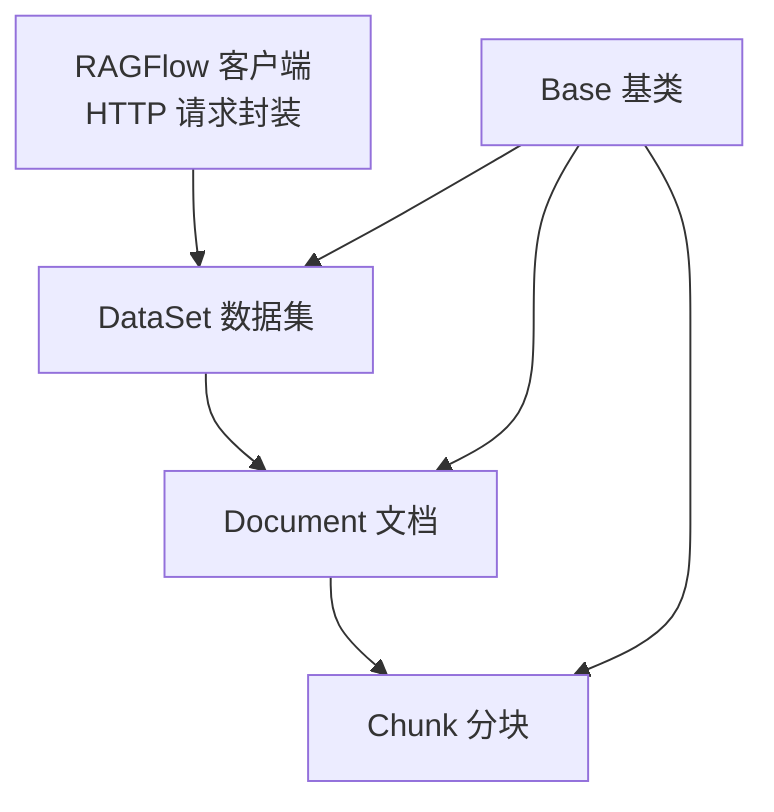
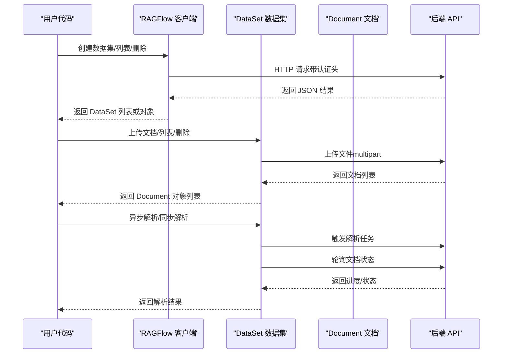
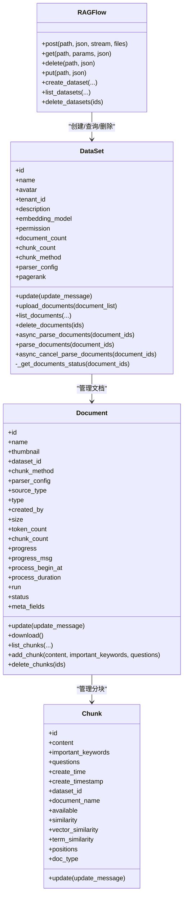
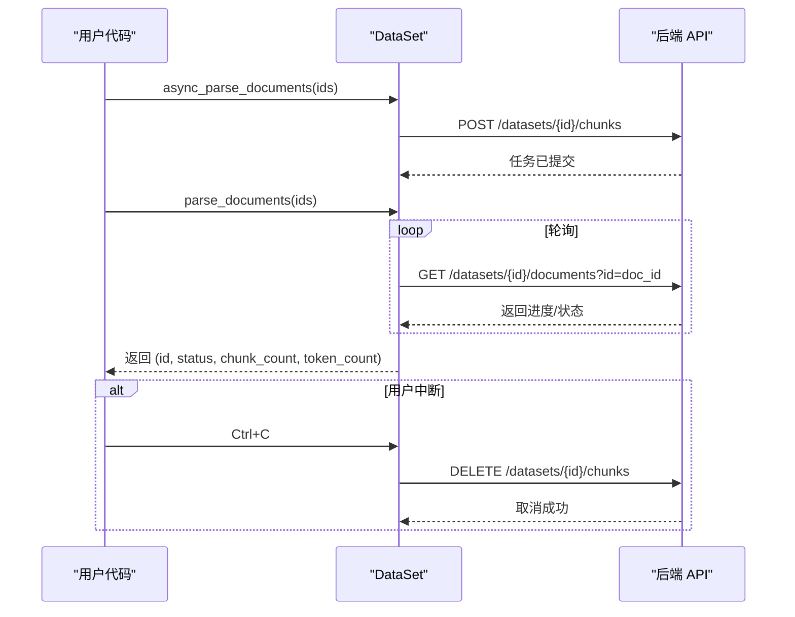
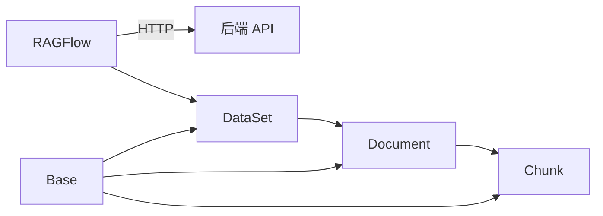

# 数据集模块

<cite>
**本文引用的文件**
- [dataset.py](file://sdk/python/ragflow_sdk/modules/dataset.py)
- [base.py](file://sdk/python/ragflow_sdk/modules/base.py)
- [document.py](file://sdk/python/ragflow_sdk/modules/document.py)
- [chunk.py](file://sdk/python/ragflow_sdk/modules/chunk.py)
- [ragflow.py](file://sdk/python/ragflow_sdk/ragflow.py)
- [dataset_example.py](file://example/sdk/dataset_example.py)
- [python_api_reference.md](file://docs/references/python_api_reference.md)
- [share_knowledge_bases.md](file://docs/guides/team/share_knowledge_bases.md)
- [test_dataset.py](file://sdk/python/test/test_frontend_api/test_dataset.py)
- [test_create_dataset.py](file://test/testcases/test_sdk_api/test_dataset_mangement/test_create_dataset.py)
- [test_list_datasets.py](file://test/testcases/test_sdk_api/test_dataset_mangement/test_list_datasets.py)
- [test_update_dataset.py](file://test/testcases/test_sdk_api/test_dataset_mangement/test_update_dataset.py)
- [common.py](file://test/testcases/test_http_api/common.py)
</cite>

## 目录
1. [简介](#简介)
2. [项目结构](#项目结构)
3. [核心组件](#核心组件)
4. [架构总览](#架构总览)
5. [详细组件分析](#详细组件分析)
6. [依赖分析](#依赖分析)
7. [性能考虑](#性能考虑)
8. [故障排除指南](#故障排除指南)
9. [结论](#结论)
10. [附录](#附录)

## 简介
本文件系统性地介绍 Python SDK 的数据集模块，覆盖数据集的创建、查询、更新与删除（CRUD）操作，以及文档上传、分块解析、状态轮询与取消等完整工作流。文档还包含数据集与文档的属性定义、权限与共享策略、生命周期与版本控制机制说明、性能优化建议与最佳实践，以及常见错误与排障方法。

## 项目结构
数据集模块位于 Python SDK 的模块目录中，采用“按职责分层”的组织方式：
- 基类与通用 HTTP 封装：Base
- 数据集实体：DataSet
- 文档实体：Document
- 分块实体：Chunk
- 客户端入口：RAGFlow（负责 API 调用与资源编排）

图表来源
- [ragflow.py:27-110](file://sdk/python/ragflow_sdk/ragflow.py#L27-L110)
- [dataset.py:21-52](file://sdk/python/ragflow_sdk/modules/dataset.py#L21-L52)
- [document.py:23-51](file://sdk/python/ragflow_sdk/modules/document.py#L23-L51)
- [chunk.py:26-48](file://sdk/python/ragflow_sdk/modules/chunk.py#L26-L48)
- [base.py:18-59](file://sdk/python/ragflow_sdk/modules/base.py#L18-L59)

章节来源
- [ragflow.py:27-110](file://sdk/python/ragflow_sdk/ragflow.py#L27-L110)
- [dataset.py:21-52](file://sdk/python/ragflow_sdk/modules/dataset.py#L21-L52)
- [document.py:23-51](file://sdk/python/ragflow_sdk/modules/document.py#L23-L51)
- [chunk.py:26-48](file://sdk/python/ragflow_sdk/modules/chunk.py#L26-L48)
- [base.py:18-59](file://sdk/python/ragflow_sdk/modules/base.py#L18-L59)

## 核心组件
- RAGFlow：SDK 入口，负责认证头注入、HTTP 方法封装（GET/POST/PUT/DELETE），并提供数据集与聊天、检索等资源的创建、查询与删除接口。
- DataSet：数据集实体，支持创建、列表、更新、删除；支持文档上传、列表、删除；支持异步/同步解析文档并轮询状态。
- Document：文档实体，支持更新元数据、下载、列出分块、新增分块、删除分块。
- Chunk：分块实体，支持更新分块内容与标签等。
- Base：通用基类，统一 JSON 序列化、反序列化与 HTTP 方法代理。

章节来源
- [ragflow.py:27-110](file://sdk/python/ragflow_sdk/ragflow.py#L27-L110)
- [dataset.py:21-52](file://sdk/python/ragflow_sdk/modules/dataset.py#L21-L52)
- [document.py:23-51](file://sdk/python/ragflow_sdk/modules/document.py#L23-L51)
- [chunk.py:26-48](file://sdk/python/ragflow_sdk/modules/chunk.py#L26-L48)
- [base.py:18-59](file://sdk/python/ragflow_sdk/modules/base.py#L18-L59)

## 架构总览
下图展示从客户端到后端 API 的调用链路，以及数据集与文档、分块之间的层次关系。

图表来源
- [ragflow.py:36-50](file://sdk/python/ragflow_sdk/ragflow.py#L36-L50)
- [dataset.py:53-103](file://sdk/python/ragflow_sdk/modules/dataset.py#L53-L103)
- [document.py:53-102](file://sdk/python/ragflow_sdk/modules/document.py#L53-L102)

## 详细组件分析

### DataSet 类
- 属性与字段
  - id、name、avatar、tenant_id、description、embedding_model、permission、document_count、chunk_count、chunk_method、parser_config、pagerank
- 关键方法
  - update：更新数据集配置
  - upload_documents：批量上传文档（multipart）
  - list_documents：分页查询文档
  - delete_documents：删除文档
  - async_parse_documents：触发异步解析
  - parse_documents：同步等待解析完成并返回统计
  - async_cancel_parse_documents：取消解析任务
- 内部状态轮询：_get_documents_status，基于 run 状态或 progress 进度判断完成

图表来源
- [ragflow.py:27-110](file://sdk/python/ragflow_sdk/ragflow.py#L27-L110)
- [dataset.py:21-52](file://sdk/python/ragflow_sdk/modules/dataset.py#L21-L52)
- [document.py:23-51](file://sdk/python/ragflow_sdk/modules/document.py#L23-L51)
- [chunk.py:26-48](file://sdk/python/ragflow_sdk/modules/chunk.py#L26-L48)

章节来源
- [dataset.py:21-52](file://sdk/python/ragflow_sdk/modules/dataset.py#L21-L52)
- [dataset.py:44-154](file://sdk/python/ragflow_sdk/modules/dataset.py#L44-L154)
- [document.py:23-51](file://sdk/python/ragflow_sdk/modules/document.py#L23-L51)
- [document.py:53-102](file://sdk/python/ragflow_sdk/modules/document.py#L53-L102)
- [chunk.py:26-63](file://sdk/python/ragflow_sdk/modules/chunk.py#L26-L63)

### 同步/异步解析流程
- 异步解析：调用 async_parse_documents 后立即返回；通过 parse_documents 内部轮询各文档状态，直到全部完成或失败。
- 取消解析：在键盘中断时自动调用 async_cancel_parse_documents 取消剩余任务。

图表来源
- [dataset.py:132-154](file://sdk/python/ragflow_sdk/modules/dataset.py#L132-L154)
- [dataset.py:105-130](file://sdk/python/ragflow_sdk/modules/dataset.py#L105-L130)

章节来源
- [dataset.py:105-154](file://sdk/python/ragflow_sdk/modules/dataset.py#L105-L154)

### 文档管理与分块
- Document.update：支持更新 display_name、meta_fields、chunk_method、parser_config 等；对 meta_fields 类型进行校验。
- Document.download：支持二进制下载。
- Document.list_chunks/add_chunk/delete_chunks：分块的增删查。
- Chunk.update：分块更新（含错误类型）。

章节来源
- [document.py:53-102](file://sdk/python/ragflow_sdk/modules/document.py#L53-L102)
- [chunk.py:55-63](file://sdk/python/ragflow_sdk/modules/chunk.py#L55-L63)

### 权限与共享
- 数据集权限（permission）支持 "me"（仅本人）与 "team"（团队共享）。默认值为 "me"。
- 团队共享可通过界面配置启用，使团队成员可见并可管理共享数据集。

章节来源
- [python_api_reference.md:139-145](file://docs/references/python_api_reference.md#L139-L145)
- [share_knowledge_bases.md:14-18](file://docs/guides/team/share_knowledge_bases.md#L14-L18)

### 生命周期与版本控制
- 名称唯一性：重复名称会自动追加序号；大小写不敏感。
- 删除策略：测试用例显示存在软删除场景（评估服务中的软删除实现），但 SDK 提供的删除接口为硬删除（按 ID 批量删除）。
- 版本控制：未在 SDK 中发现显式的版本字段或版本 API；如需版本能力，建议结合业务侧元数据或外部版本管理工具。

章节来源
- [test_dataset.py:76-97](file://sdk/python/test/test_frontend_api/test_dataset.py#L76-L97)
- [test_create_dataset.py:92-100](file://test/testcases/test_sdk_api/test_dataset_mangement/test_create_dataset.py#L92-L100)
- [ragflow.py:79-84](file://sdk/python/ragflow_sdk/ragflow.py#L79-L84)

### 批量操作与示例
- 批量创建/删除：通过 list_datasets 与 delete_datasets 实现。
- 批量上传文档：upload_documents 接受文件列表（display_name 与二进制 blob）。
- 示例脚本：dataset_example.py 演示了创建、更新、查询与删除数据集的完整流程。

章节来源
- [ragflow.py:79-110](file://sdk/python/ragflow_sdk/ragflow.py#L79-L110)
- [dataset.py:53-103](file://sdk/python/ragflow_sdk/modules/dataset.py#L53-L103)
- [dataset_example.py:27-51](file://example/sdk/dataset_example.py#L27-L51)

## 依赖分析
- 组件内聚与耦合
  - DataSet 依赖 Document；Document 依赖 Chunk；三者通过路径拼接与嵌套对象访问形成清晰的层次。
  - Base 提供统一的 HTTP 代理与 JSON 序列化，降低重复代码。
- 外部依赖
  - RAGFlow 依赖 requests 发送 HTTP 请求，并注入认证头。
  - 文档下载使用二进制流式响应，避免大文件内存峰值。

图表来源
- [ragflow.py:36-50](file://sdk/python/ragflow_sdk/ragflow.py#L36-L50)
- [base.py:41-55](file://sdk/python/ragflow_sdk/modules/base.py#L41-L55)

章节来源
- [ragflow.py:36-50](file://sdk/python/ragflow_sdk/ragflow.py#L36-L50)
- [base.py:41-55](file://sdk/python/ragflow_sdk/modules/base.py#L41-L55)

## 性能考虑
- 分页与排序
  - list_datasets 支持 page/page_size/orderby/desc 等参数，建议在大数据集场景下合理设置 page_size 与排序字段以减少网络与解析开销。
- 解析并发与轮询
  - parse_documents 会轮询每个文档的状态，建议在任务较多时配合异步解析与合理的轮询间隔，避免阻塞主线程。
- 文件上传
  - upload_documents 使用 multipart 上传，建议对大文件进行分片或压缩以降低传输时间。
- 缓存与重试
  - 在应用层可对查询结果进行缓存；对临时网络异常可增加重试逻辑（注意幂等性）。

章节来源
- [python_api_reference.md:237-301](file://docs/references/python_api_reference.md#L237-L301)
- [dataset.py:105-130](file://sdk/python/ragflow_sdk/modules/dataset.py#L105-L130)
- [common.py:69-96](file://test/testcases/test_http_api/common.py#L69-L96)

## 故障排除指南
- 常见错误与定位
  - 参数校验失败：如名称为空、超长、非法字符；权限值不在允许集合；分页参数越界等。
  - 权限不足：当请求被拒绝时，检查 permission 设置与认证头是否正确。
  - 解析中断：键盘中断会触发取消解析，确认是否需要重新发起解析任务。
- 单元测试参考
  - 名称与权限校验、分页参数校验、解析状态轮询与取消等均有对应的测试用例，可作为行为参考与回归验证依据。

章节来源
- [test_create_dataset.py:68-100](file://test/testcases/test_sdk_api/test_dataset_mangement/test_create_dataset.py#L68-L100)
- [test_create_dataset.py:273-291](file://test/testcases/test_sdk_api/test_dataset_mangement/test_create_dataset.py#L273-L291)
- [test_list_datasets.py:108-144](file://test/testcases/test_sdk_api/test_dataset_mangement/test_list_datasets.py#L108-L144)
- [test_update_dataset.py:66-94](file://test/testcases/test_sdk_api/test_dataset_mangement/test_update_dataset.py#L66-L94)
- [dataset.py:143-144](file://sdk/python/ragflow_sdk/modules/dataset.py#L143-L144)

## 结论
数据集模块提供了从数据集到文档再到分块的完整管理能力，支持异步解析与状态轮询、权限共享与批量操作。结合合理的分页、并发与缓存策略，可在大规模数据场景下获得稳定与高效的体验。若需更细粒度的版本控制，建议在业务层扩展元数据或引入外部版本管理方案。

## 附录

### API 速查（节选）
- 数据集
  - 创建：create_dataset(name, avatar, description, embedding_model, permission, chunk_method, parser_config)
  - 列表：list_datasets(page, page_size, orderby, desc, id, name)
  - 删除：delete_datasets(ids)
  - 更新：DataSet.update(update_message)
- 文档
  - 上传：DataSet.upload_documents(list[dict])
  - 列表：DataSet.list_documents(...)
  - 删除：DataSet.delete_documents(ids)
  - 更新：Document.update(update_message)
  - 下载：Document.download()
  - 分块：Document.list_chunks/add_chunk/delete_chunks
- 解析
  - 异步解析：DataSet.async_parse_documents(ids)
  - 同步解析：DataSet.parse_documents(ids)
  - 取消解析：DataSet.async_cancel_parse_documents(ids)

章节来源
- [python_api_reference.md:105-794](file://docs/references/python_api_reference.md#L105-L794)