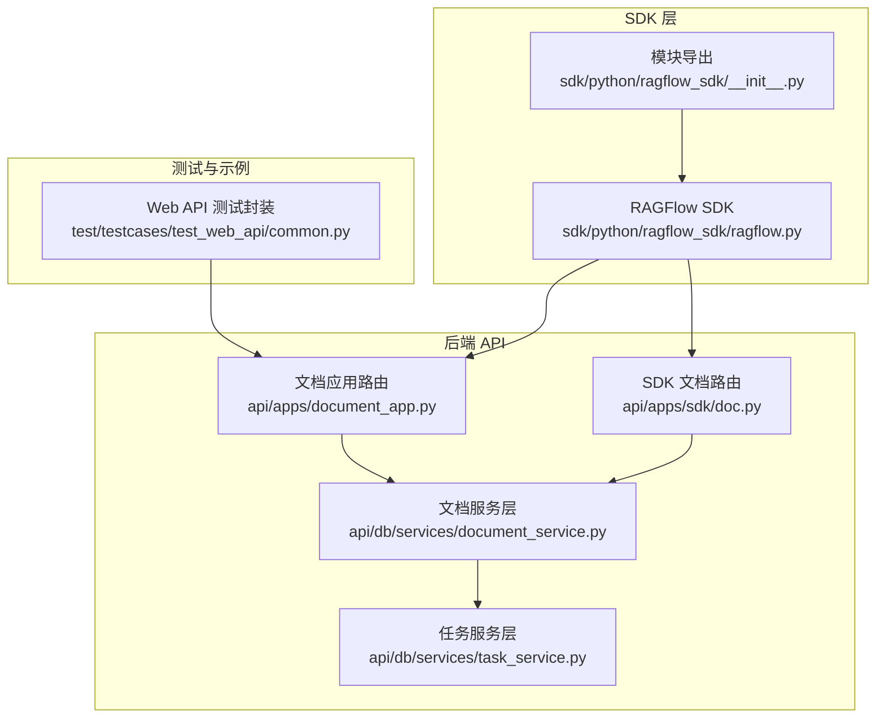
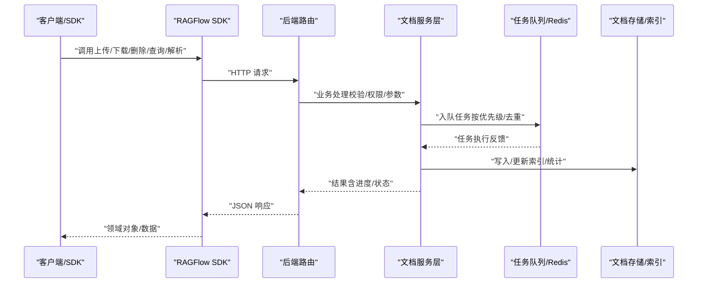
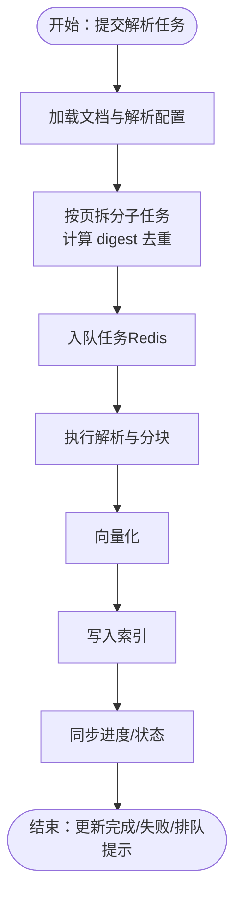
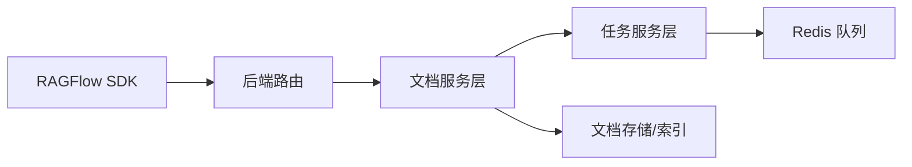

# 文档模块

<cite>
**本文引用的文件**
- [sdk/python/ragflow_sdk/__init__.py](file://sdk/python/ragflow_sdk/__init__.py)
- [sdk/python/ragflow_sdk/ragflow.py](file://sdk/python/ragflow_sdk/ragflow.py)
- [sdk/python/pyproject.toml](file://sdk/python/pyproject.toml)
- [api/apps/document_app.py](file://api/apps/document_app.py)
- [api/apps/sdk/doc.py](file://api/apps/sdk/doc.py)
- [api/db/services/document_service.py](file://api/db/services/document_service.py)
- [api/db/services/task_service.py](file://api/db/services/task_service.py)
- [test/testcases/test_web_api/common.py](file://test/testcases/test_web_api/common.py)
</cite>

## 目录
1. [简介](#简介)
2. [项目结构](#项目结构)
3. [核心组件](#核心组件)
4. [架构总览](#架构总览)
5. [详细组件分析](#详细组件分析)
6. [依赖关系分析](#依赖关系分析)
7. [性能考量](#性能考量)
8. [故障排查指南](#故障排查指南)
9. [结论](#结论)
10. [附录](#附录)

## 简介
本文件面向 Python SDK 的“文档模块”，系统性梳理文档上传、下载、删除与查询的 API 方法，详解文档解析与分块处理流程，记录元数据管理与标签系统，解释状态监控与进度跟踪机制，并给出批量处理与并发上传的最佳实践、支持的文档格式与解析配置、存储策略与清理机制，以及搜索与检索的使用示例。

## 项目结构
围绕文档模块的关键文件与职责如下：
- SDK 入口与对外 API：sdk/python/ragflow_sdk/ragflow.py 提供高层封装（如检索接口），底层通过 requests 调用后端 API。
- 后端文档路由与业务逻辑：api/apps/document_app.py 与 api/apps/sdk/doc.py 定义了文档上传、下载、删除、查询、解析、状态变更等 HTTP 接口与服务层实现。
- 文档服务层：api/db/services/document_service.py 实现文档增删改查、元数据聚合、批量更新、进度同步、任务队列等核心逻辑。
- 任务与队列：api/db/services/task_service.py 负责任务拆分、去重、优先级与队列管理。
- 测试与示例：test/testcases/test_web_api/common.py 展示了文档相关接口的调用约定。

图表来源
- [sdk/python/ragflow_sdk/ragflow.py:27-376](file://sdk/python/ragflow_sdk/ragflow.py#L27-L376)
- [sdk/python/ragflow_sdk/__init__.py:22-42](file://sdk/python/ragflow_sdk/__init__.py#L22-L42)
- [api/apps/document_app.py:52-953](file://api/apps/document_app.py#L52-L953)
- [api/apps/sdk/doc.py:72-800](file://api/apps/sdk/doc.py#L72-L800)
- [api/db/services/document_service.py:46-1342](file://api/db/services/document_service.py#L46-L1342)
- [api/db/services/task_service.py:420-452](file://api/db/services/task_service.py#L420-L452)
- [test/testcases/test_web_api/common.py:341-393](file://test/testcases/test_web_api/common.py#L341-L393)

章节来源
- [sdk/python/ragflow_sdk/ragflow.py:27-376](file://sdk/python/ragflow_sdk/ragflow.py#L27-L376)
- [sdk/python/ragflow_sdk/__init__.py:22-42](file://sdk/python/ragflow_sdk/__init__.py#L22-L42)
- [api/apps/document_app.py:52-953](file://api/apps/document_app.py#L52-L953)
- [api/apps/sdk/doc.py:72-800](file://api/apps/sdk/doc.py#L72-L800)
- [api/db/services/document_service.py:46-1342](file://api/db/services/document_service.py#L46-L1342)
- [api/db/services/task_service.py:420-452](file://api/db/services/task_service.py#L420-L452)
- [test/testcases/test_web_api/common.py:341-393](file://test/testcases/test_web_api/common.py#L341-L393)

## 核心组件
- SDK 封装：RAGFlow 类提供统一的 HTTP 客户端方法（post/get/delete/put）与高级接口（如检索），并负责将后端返回的数据映射为领域对象。
- 文档路由与服务：后端提供两类文档接口：
  - Web 应用接口（api/apps/document_app.py）：面向 Web/管理端，支持上传、下载、删除、运行解析、状态变更、元数据汇总与批量更新等。
  - SDK 文档接口（api/apps/sdk/doc.py）：面向 SDK 的文档操作，包括上传、下载、列表、更新、删除、解析等。
- 服务层：DocumentService 负责文档 CRUD、元数据聚合与批量更新、进度同步、任务入队与重跑逻辑等；TaskService 负责任务拆分、去重与队列管理。

章节来源
- [sdk/python/ragflow_sdk/ragflow.py:27-376](file://sdk/python/ragflow_sdk/ragflow.py#L27-L376)
- [api/apps/document_app.py:52-953](file://api/apps/document_app.py#L52-L953)
- [api/apps/sdk/doc.py:72-800](file://api/apps/sdk/doc.py#L72-L800)
- [api/db/services/document_service.py:46-1342](file://api/db/services/document_service.py#L46-L1342)

## 架构总览
文档模块的端到端流程从 SDK 发起请求，经由后端路由进入服务层，再调度任务队列执行解析与向量索引构建，最终更新文档状态与进度。

图表来源
- [sdk/python/ragflow_sdk/ragflow.py:36-50](file://sdk/python/ragflow_sdk/ragflow.py#L36-L50)
- [api/apps/document_app.py:583-641](file://api/apps/document_app.py#L583-L641)
- [api/db/services/document_service.py:1124-1144](file://api/db/services/document_service.py#L1124-L1144)
- [api/db/services/task_service.py:420-452](file://api/db/services/task_service.py#L420-L452)

## 详细组件分析

### 文档上传（上传到数据集）
- SDK 路径：RAGFlow.create_dataset 返回 DataSet 对象，但具体上传文档在后端路由中完成。
- 后端接口：
  - Web 应用：POST /v1/document/run（批量运行解析）、POST /v1/document/create（创建空文档）、POST /v1/document/rm（删除文档）等。
  - SDK 文档：POST /api/v1/datasets/{dataset_id}/documents（上传文件到指定数据集）。
- 关键行为：
  - 校验文件名长度、文件存在性、表单字段。
  - 将文件上传至存储实现，生成文档记录并返回文档列表（含 chunk_count/token_count/chunk_method/run 等字段）。
  - 支持 parent_path 参数用于嵌套路径。
- 并发与批量：
  - 单次请求可上传多个文件（最大数量限制）。
  - 解析任务会按配置拆分为多个子任务并入队执行。

章节来源
- [api/apps/sdk/doc.py:72-182](file://api/apps/sdk/doc.py#L72-L182)
- [api/apps/document_app.py:52-98](file://api/apps/document_app.py#L52-L98)
- [test/testcases/test_web_api/common.py:341-343](file://test/testcases/test_web_api/common.py#L341-L343)

### 文档下载
- 后端接口：GET /api/v1/datasets/{dataset_id}/documents/{document_id} 或 /v1/document/get/{doc_id}。
- 行为：根据文档 ID 获取存储地址与二进制流，以附件形式返回文件。
- 注意：若文件为空，返回错误码。

章节来源
- [api/apps/sdk/doc.py:360-418](file://api/apps/sdk/doc.py#L360-L418)
- [api/apps/document_app.py:696-720](file://api/apps/document_app.py#L696-L720)

### 文档删除
- 后端接口：DELETE /api/v1/datasets/{dataset_id}/documents 或 POST /v1/document/rm。
- 行为：
  - 支持按 ID 删除或清空数据集内所有文档。
  - 删除时会取消任务、清理索引、删除文件与缩略图、清理知识图谱引用等。
  - 去重与重复 ID 处理，返回成功计数与错误信息。

章节来源
- [api/apps/sdk/doc.py:670-778](file://api/apps/sdk/doc.py#L670-L778)
- [api/apps/document_app.py:562-581](file://api/apps/document_app.py#L562-L581)
- [api/db/services/document_service.py:340-394](file://api/db/services/document_service.py#L340-L394)

### 文档查询与筛选
- 列表接口：GET /api/v1/datasets/{dataset_id}/documents。
- 支持过滤：
  - id/name、分页、排序、关键词、后缀、时间范围、运行状态（UNSTART/RUNNING/CANCEL/DONE/FAIL）。
  - metadata_condition（JSON 条件，支持 and/or 逻辑）。
- 输出字段映射：chunk_num→chunk_count、kb_id→dataset_id、token_num→token_count、parser_id→chunk_method；运行状态文本映射。
- 元数据摘要与批量更新：
  - GET /api/v1/datasets/{dataset_id}/metadata/summary：返回元数据类型与值频次统计。
  - POST /api/v1/datasets/{dataset_id}/metadata/update：按选择器（文档 ID 列表或 metadata_condition）批量更新/删除元数据。

章节来源
- [api/apps/sdk/doc.py:420-604](file://api/apps/sdk/doc.py#L420-L604)
- [api/db/services/document_service.py:785-836](file://api/db/services/document_service.py#L785-L836)
- [api/db/services/document_service.py:840-948](file://api/db/services/document_service.py#L840-L948)

### 文档解析与分块处理
- 触发方式：POST /api/v1/datasets/{dataset_id}/chunks（SDK 文档）或 POST /v1/document/run（Web 应用）。
- 解析流程：
  - 服务层根据文档的 parser_id 与 parser_config 决定解析器类型与参数。
  - 任务拆分：按页区间拆分子任务，计算任务摘要（digest）避免重复入队。
  - 入队：将任务写入数据库并投递到 Redis 队列，开始异步执行。
  - 进度同步：服务层聚合子任务进度，更新文档 progress/run/progress_msg/process_duration。
  - 向量化与索引：解析完成后进行向量化并批量写入文档存储索引。
- 特殊任务：GraphRAG/RAPTOR/MindMap 可单独创建任务，且支持冻结进度以等待前置任务完成。

图表来源
- [api/apps/sdk/doc.py:780-800](file://api/apps/sdk/doc.py#L780-L800)
- [api/apps/document_app.py:583-641](file://api/apps/document_app.py#L583-L641)
- [api/db/services/document_service.py:1124-1144](file://api/db/services/document_service.py#L1124-L1144)
- [api/db/services/document_service.py:952-1041](file://api/db/services/document_service.py#L952-L1041)
- [api/db/services/task_service.py:420-452](file://api/db/services/task_service.py#L420-L452)

章节来源
- [api/apps/sdk/doc.py:780-800](file://api/apps/sdk/doc.py#L780-L800)
- [api/apps/document_app.py:583-641](file://api/apps/document_app.py#L583-L641)
- [api/db/services/document_service.py:952-1041](file://api/db/services/document_service.py#L952-L1041)
- [api/db/services/task_service.py:420-452](file://api/db/services/task_service.py#L420-L452)

### 元数据管理与标签系统
- 元数据结构：文档 meta_fields 为字典，支持字符串、数字、布尔、时间与列表值。
- 聚合与过滤：
  - get_flatted_meta_by_kbs：展开列表值，便于条件过滤。
  - metadata_condition：支持 AND/OR 逻辑与嵌套条件，返回匹配的文档 ID 集合。
- 批量更新：
  - 支持按文档 ID 列表或 metadata_condition 选择目标集合。
  - 更新/删除支持精确匹配与去重，返回更新条目数与匹配总数。
- 元数据摘要：统计每个键的值分布与类型（string/number/time/list）。

章节来源
- [api/db/services/document_service.py:747-782](file://api/db/services/document_service.py#L747-L782)
- [api/db/services/document_service.py:840-948](file://api/db/services/document_service.py#L840-L948)
- [api/db/services/document_service.py:785-836](file://api/db/services/document_service.py#L785-L836)

### 文档状态监控与进度跟踪
- 文档状态枚举：UNSTART/RUNNING/CANCEL/DONE/FAIL。
- 进度来源：
  - 子任务 progress 聚合，失败标记为 -1，完成标记为 1。
  - progress_msg 汇总各子任务消息，包含排队提示。
- 实时同步：服务层定时扫描未完成文档，更新 process_duration、run、progress、progress_msg。
- 特殊任务：GraphRAG/RAPTOR/MindMap 在解析完成前可能冻结进度，待前置任务完成后继续推进。

章节来源
- [api/apps/sdk/doc.py:343-357](file://api/apps/sdk/doc.py#L343-L357)
- [api/db/services/document_service.py:952-1041](file://api/db/services/document_service.py#L952-L1041)

### 批量文档处理与并发上传最佳实践
- 并发上传：
  - 单次请求可上传多文件，注意文件名长度限制与后端最大文件数量限制。
  - 建议对大文件分批上传，避免单次请求过大。
- 并发解析：
  - 服务层自动拆分子任务并入队，按优先级与队列长度动态调整。
  - 使用 metadata_condition 或文档 ID 列表进行批量选择，减少重复工作。
- 重跑与清理：
  - 当修改 chunk_method/parser_config 时，可重置进度与索引，重新解析。
  - 删除文档会清理索引、任务、图片与缩略图，确保资源回收。

章节来源
- [api/apps/sdk/doc.py:284-318](file://api/apps/sdk/doc.py#L284-L318)
- [api/apps/document_app.py:583-641](file://api/apps/document_app.py#L583-L641)
- [api/db/services/document_service.py:340-394](file://api/db/services/document_service.py#L340-L394)

### 文档格式支持与解析配置
- 支持的解析器类型（chunk_method）：naive、manual、qa、table、paper、book、laws、presentation、picture、one、knowledge_graph、email、tag。
- 不同类型文档的限制：
  - 视觉类（picture）与部分演示文稿（ppt/pptx/pages）有特定解析器与限制。
- 解析配置：
  - parser_config 可通过更新接口设置，服务层会合并配置并按需回填默认值。
  - 解析参数（如分词符、表格上下文大小、图像上下文大小等）可在服务层统一设定。

章节来源
- [api/apps/sdk/doc.py:284-306](file://api/apps/sdk/doc.py#L284-L306)
- [api/db/services/document_service.py:666-687](file://api/db/services/document_service.py#L666-L687)

### 文档存储策略与清理机制
- 存储实现：通过 STORAGE_IMPL 统一抽象，支持对象存储读写。
- 索引与统计：
  - 文档解析完成后写入文档存储索引，按 tenant_id/kb_id 建立索引。
  - 统计字段：token_num、chunk_num、process_duration 等随解析过程增量更新。
- 清理策略：
  - 删除文档时清理任务、索引、图片、缩略图与知识图谱关联。
  - 重跑解析时可清空统计并重建索引，保证一致性。

章节来源
- [api/apps/sdk/doc.py:317-318](file://api/apps/sdk/doc.py#L317-L318)
- [api/db/services/document_service.py:340-394](file://api/db/services/document_service.py#L340-L394)
- [api/db/services/document_service.py:1331-1336](file://api/db/services/document_service.py#L1331-L1336)

### 检索与搜索使用示例
- SDK 检索：RAGFlow.retrieve 支持关键词与向量混合检索、重排模型、跨语言、元数据过滤、知识图谱增强等。
- 后端检索：/api/v1/retrieval 接口返回匹配的分块列表，SDK 将其映射为 Chunk 对象。
- 元数据过滤：通过 metadata_condition 在查询阶段即过滤候选文档，提升检索效率。

章节来源
- [sdk/python/ragflow_sdk/ragflow.py:191-235](file://sdk/python/ragflow_sdk/ragflow.py#L191-L235)
- [api/apps/sdk/doc.py:555-574](file://api/apps/sdk/doc.py#L555-L574)

## 依赖关系分析
- SDK 依赖 requests 发送 HTTP 请求，内部封装常用 API。
- 后端路由依赖服务层完成业务逻辑，服务层进一步依赖任务服务与存储实现。
- 任务服务负责任务拆分、去重与队列管理，确保解析过程可控与可重入。

图表来源
- [sdk/python/ragflow_sdk/ragflow.py:36-50](file://sdk/python/ragflow_sdk/ragflow.py#L36-L50)
- [api/apps/document_app.py:583-641](file://api/apps/document_app.py#L583-L641)
- [api/db/services/document_service.py:1124-1144](file://api/db/services/document_service.py#L1124-L1144)
- [api/db/services/task_service.py:420-452](file://api/db/services/task_service.py#L420-L452)

章节来源
- [sdk/python/ragflow_sdk/ragflow.py:36-50](file://sdk/python/ragflow_sdk/ragflow.py#L36-L50)
- [api/apps/document_app.py:583-641](file://api/apps/document_app.py#L583-L641)
- [api/db/services/document_service.py:1124-1144](file://api/db/services/document_service.py#L1124-L1144)
- [api/db/services/task_service.py:420-452](file://api/db/services/task_service.py#L420-L452)

## 性能考量
- 任务拆分：按页区间拆分任务，避免单任务耗时过长，提高吞吐。
- 去重与缓存：基于 digest 去重，避免重复解析；队列长度提示排队情况。
- 批量写入：索引插入采用批量写入，降低 IO 开销。
- 并发控制：解析线程池与任务优先级结合，平衡资源占用与响应速度。

## 故障排查指南
- 常见错误码与处理：
  - ARGUMENT_ERROR：参数缺失或不合法（如文件名超长、扩展名变更、重复名称）。
  - AUTHENTICATION_ERROR：无权限访问数据集或文档。
  - DATA_ERROR：数据异常（如文件为空、格式不支持）。
  - SERVER_ERROR：服务器内部错误（如存储/索引异常、任务入队失败）。
- 排查步骤：
  - 检查文件名长度与扩展名是否变化。
  - 确认数据集与文档归属关系。
  - 查看 progress_msg 中的任务排队提示与错误信息。
  - 核对 metadata_condition 语法与逻辑。

章节来源
- [api/apps/sdk/doc.py:137-144](file://api/apps/sdk/doc.py#L137-L144)
- [api/apps/sdk/doc.py:260-270](file://api/apps/sdk/doc.py#L260-L270)
- [api/apps/document_app.py:495-559](file://api/apps/document_app.py#L495-L559)

## 结论
文档模块通过 SDK 与后端路由协同，提供了完整的上传、下载、删除、查询、解析与检索能力。服务层实现了元数据管理、批量更新、进度同步与任务队列控制，配合存储与索引实现高效的内容理解与检索。建议在生产环境中结合批量与并发策略、合理的解析配置与元数据治理，以获得稳定与高性能的文档处理体验。

## 附录
- SDK 依赖与版本：requests、beartype。
- 最大上传文件数量：后端定义的最大文件数量限制。
- 元数据键值类型：字符串、数字、布尔、时间与列表，支持去重与展开。

章节来源
- [sdk/python/pyproject.toml:1-32](file://sdk/python/pyproject.toml#L1-L32)
- [api/apps/sdk/doc.py:49-49](file://api/apps/sdk/doc.py#L49-L49)