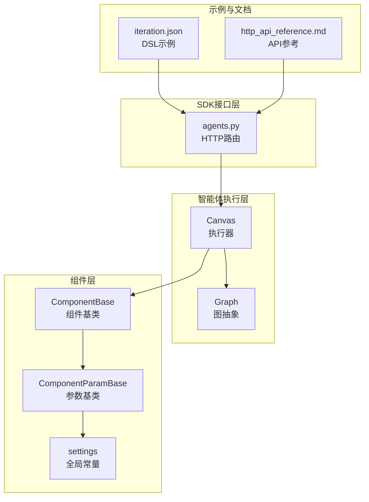
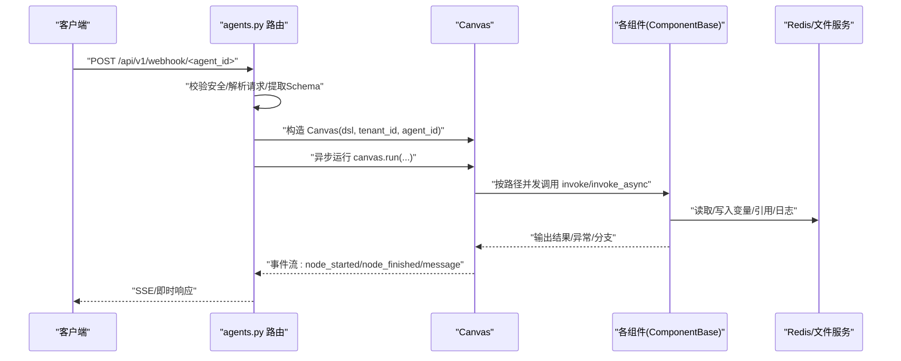
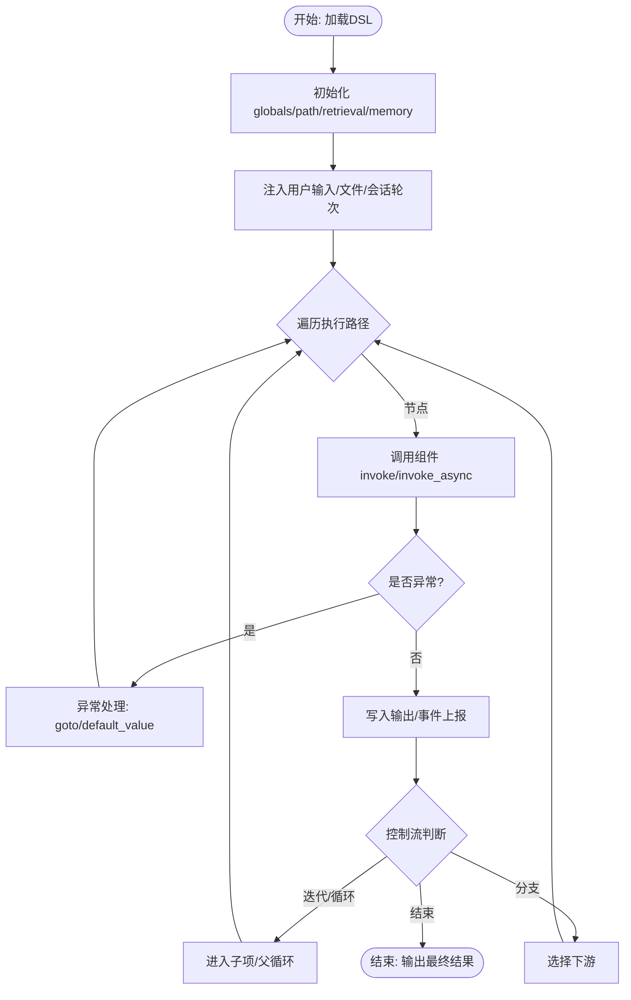
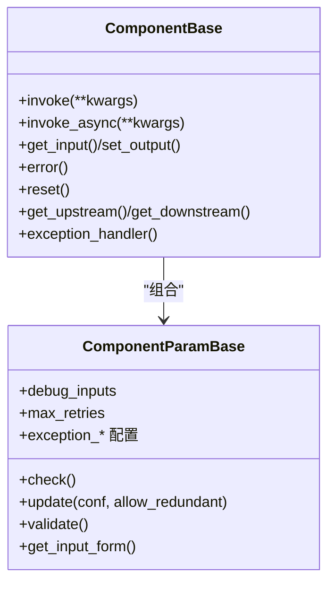
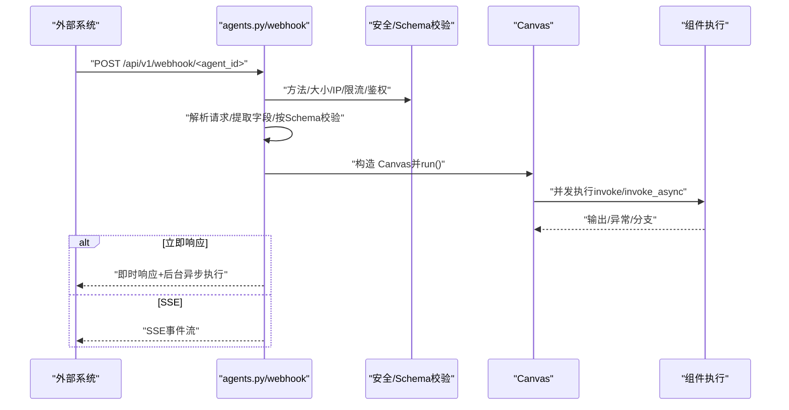
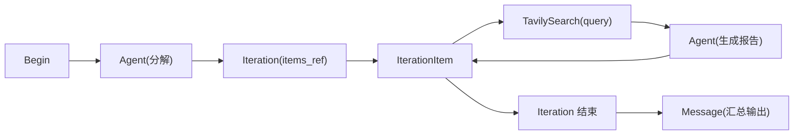
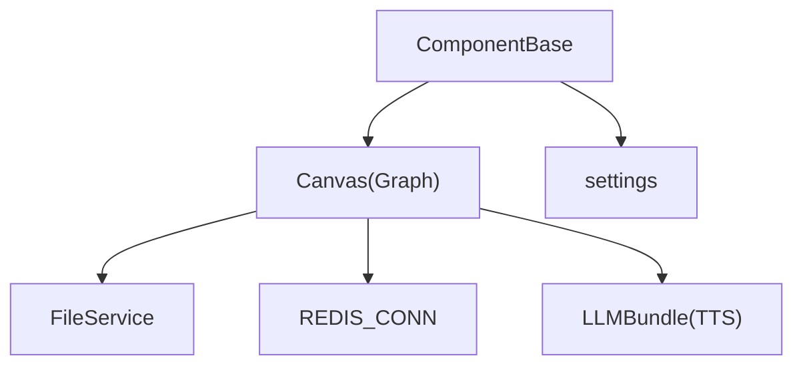

# 智能体模块

<cite>
**本文引用的文件**
- [agent/canvas.py](file://agent/canvas.py)
- [agent/component/base.py](file://agent/component/base.py)
- [agent/settings.py](file://agent/settings.py)
- [api/apps/sdk/agents.py](file://api/apps/sdk/agents.py)
- [agent/test/dsl_examples/iteration.json](file://agent/test/dsl_examples/iteration.json)
- [docs/references/http_api_reference.md](file://docs/references/http_api_reference.md)
- [test/testcases/test_http_api/test_session_management/test_agent_sessions.py](file://test/testcases/test_http_api/test_session_management/test_agent_sessions.py)
</cite>

## 目录
1. [简介](#简介)
2. [项目结构](#项目结构)
3. [核心组件](#核心组件)
4. [架构总览](#架构总览)
5. [详细组件分析](#详细组件分析)
6. [依赖分析](#依赖分析)
7. [性能考虑](#性能考虑)
8. [故障排查指南](#故障排查指南)
9. [结论](#结论)
10. [附录](#附录)

## 简介
本文件面向 Python SDK 的智能体模块，系统性阐述智能体的创建、配置与执行 API，覆盖从 DSL（画布）定义、组件调用与参数传递、变量引用与作用域、状态管理与执行监控，到复杂工作流设计模式、性能优化与资源管理、调试与日志分析，以及如何将智能体集成到现有应用中。文档以代码级事实为基础，配合图示帮助读者快速理解并高效使用。

## 项目结构
智能体模块由“画布执行引擎”“组件基类与参数校验”“SDK 接口路由”三部分组成，配合测试样例 DSL 展示典型工作流。

**图表来源**
- [agent/canvas.py:279-821](file://agent/canvas.py#L279-L821)
- [agent/component/base.py:365-585](file://agent/component/base.py#L365-L585)
- [agent/settings.py:17-19](file://agent/settings.py#L17-L19)
- [api/apps/sdk/agents.py:1-927](file://api/apps/sdk/agents.py#L1-L927)
- [agent/test/dsl_examples/iteration.json:1-92](file://agent/test/dsl_examples/iteration.json#L1-L92)
- [docs/references/http_api_reference.md:4665-4820](file://docs/references/http_api_reference.md#L4665-L4820)

**章节来源**
- [agent/canvas.py:1-821](file://agent/canvas.py#L1-L821)
- [agent/component/base.py:1-585](file://agent/component/base.py#L1-L585)
- [agent/settings.py:1-19](file://agent/settings.py#L1-L19)
- [api/apps/sdk/agents.py:1-927](file://api/apps/sdk/agents.py#L1-L927)
- [agent/test/dsl_examples/iteration.json:1-92](file://agent/test/dsl_examples/iteration.json#L1-L92)
- [docs/references/http_api_reference.md:4665-4820](file://docs/references/http_api_reference.md#L4665-L4820)

## 核心组件
- 执行器与图模型
  - Graph：负责加载 DSL、构建组件实例、维护执行路径与全局变量、变量解析与赋值、取消与日志追踪等。
  - Canvas：在 Graph 基础上扩展对话历史、检索结果、记忆、TTS 音频生成、用户输入注入、事件流式输出等。
- 组件基类与参数
  - ComponentBase：统一的组件生命周期（invoke/invoke_async）、输入输出读写、异常处理、上下游关系、超时控制、并发限制等。
  - ComponentParamBase：参数更新、递归校验、内置类型校验工具集、调试输入、异常分支默认值等。
- 全局设置
  - settings：浮点比较容差、参数最大嵌套深度等。

**章节来源**
- [agent/canvas.py:40-161](file://agent/canvas.py#L40-L161)
- [agent/canvas.py:279-821](file://agent/canvas.py#L279-L821)
- [agent/component/base.py:40-200](file://agent/component/base.py#L40-L200)
- [agent/component/base.py:365-585](file://agent/component/base.py#L365-L585)
- [agent/settings.py:17-19](file://agent/settings.py#L17-L19)

## 架构总览
智能体通过“DSL 画布”描述组件拓扑与数据流，SDK 路由接收请求后加载画布并交由 Canvas 异步执行，期间按组件依赖顺序并发调度，支持事件流输出、错误分支跳转、用户交互收集、TTS 音频拼接、引用与历史记录等。

**图表来源**
- [api/apps/sdk/agents.py:144-821](file://api/apps/sdk/agents.py#L144-L821)
- [agent/canvas.py:367-656](file://agent/canvas.py#L367-L656)
- [agent/component/base.py:407-447](file://agent/component/base.py#L407-L447)

**章节来源**
- [api/apps/sdk/agents.py:144-821](file://api/apps/sdk/agents.py#L144-L821)
- [agent/canvas.py:367-656](file://agent/canvas.py#L367-L656)
- [agent/component/base.py:407-447](file://agent/component/base.py#L407-L447)

## 详细组件分析

### 1) 画布与执行器（Canvas/Graph）
- 加载与校验
  - 解析 DSL，实例化组件参数对象并执行 check()。
  - 初始化执行路径 path、全局变量 globals、检索结果 retrieval、记忆 memory。
- 变量系统
  - 支持 sys.*（系统变量）、env.*（环境变量）、组件输出引用（如 begin@var1）。
  - 提供 get_variable_value/set_variable_value/get_variable_param_value 等解析与写入能力。
- 执行流程
  - 异步 run：事件驱动，逐节点触发 invoke 或 invoke_async；支持并发线程池与协程调度。
  - 分支与循环：categorize/switch/split、iteration/loop/loopitem、exitloop 等控制流。
  - 用户交互：遇到 userfillup 组件时暂停并返回用户输入提示，等待补全后继续。
  - TTS 音频：对 Message 组件内容进行分片流式输出并合成音频二进制。
- 取消与日志
  - 通过 Redis 标记任务取消；工具调用回调写入 trace 日志。
- 状态与历史
  - history/sys.history 记录对话轮次；retrieval/doc_aggs 记录检索引用。

**图表来源**
- [agent/canvas.py:293-656](file://agent/canvas.py#L293-L656)

**章节来源**
- [agent/canvas.py:81-161](file://agent/canvas.py#L81-L161)
- [agent/canvas.py:293-656](file://agent/canvas.py#L293-L656)

### 2) 组件基类与参数（ComponentBase/ComponentParamBase）
- 生命周期与并发
  - invoke/invoke_async：统一封装计时、异常捕获、输出写入；支持超时装饰器与线程池执行。
  - 并发限制：通过信号量限制同时处理的聊天数量。
- 输入输出与变量引用
  - get_input 自动解析 sys/env/组件引用表达式；支持调试输入 debug_inputs。
  - set_output 写入输出并记录类型；error() 获取错误标记。
- 参数系统
  - update 支持递归更新，带冗余参数检测与深度限制；
  - check_* 内置多种类型校验（字符串、正整数、布尔、范围等）；
  - validate 读取 JSON 校验规则并执行断言。
- 异常与分支
  - exception_method/exception_goto/exception_default_value 支持异常分支跳转或默认值。

**图表来源**
- [agent/component/base.py:40-200](file://agent/component/base.py#L40-L200)
- [agent/component/base.py:365-585](file://agent/component/base.py#L365-L585)

**章节来源**
- [agent/component/base.py:40-200](file://agent/component/base.py#L40-L200)
- [agent/component/base.py:365-585](file://agent/component/base.py#L365-L585)
- [agent/settings.py:17-19](file://agent/settings.py#L17-L19)

### 3) SDK 接口与 Webhook 触发
- 智能体管理
  - 列表/创建/更新/删除：提供标题、描述、DSL 字段；创建/更新时保存版本。
- Webhook 触发
  - 校验请求方法、内容类型、大小、IP 白名单、速率限制、认证（Token/Bearer/Basic/JWT）。
  - 解析请求为 query/headers/body，并按 DSL 中的 schema 进行严格抽取与类型转换。
  - 支持 Immediately（立即返回）与 SSE（流式事件）两种执行模式；后台任务持久化画布状态。
- 事件流
  - node_started/node_finished/message/message_end/workflow_started/workflow_finished 等事件结构。

**图表来源**
- [api/apps/sdk/agents.py:144-821](file://api/apps/sdk/agents.py#L144-L821)
- [agent/canvas.py:367-656](file://agent/canvas.py#L367-L656)

**章节来源**
- [api/apps/sdk/agents.py:42-143](file://api/apps/sdk/agents.py#L42-L143)
- [api/apps/sdk/agents.py:144-821](file://api/apps/sdk/agents.py#L144-L821)

### 4) 工作流示例：迭代搜索与生成
该示例展示“分解主题—迭代搜索—生成报告”的完整链路，体现组件间变量引用、迭代控制与消息输出。

**图表来源**
- [agent/test/dsl_examples/iteration.json:1-92](file://agent/test/dsl_examples/iteration.json#L1-L92)

**章节来源**
- [agent/test/dsl_examples/iteration.json:1-92](file://agent/test/dsl_examples/iteration.json#L1-L92)

### 5) API 参考与集成要点
- 智能体管理 API
  - 列表/创建/更新/删除：见 HTTP API 参考中的 agents 小节。
- Webhook 触发
  - 请求头/体/查询参数按 DSL 中的 schema 抽取；支持多种鉴权与限流策略。
- 集成建议
  - 在应用侧通过 SDK 发起 HTTP 请求，携带必要的 headers（如 Authorization），并在需要时开启 SSE 流式消费事件。
  - 使用版本管理与回滚策略，确保更新 DSL 后可追溯。

**章节来源**
- [docs/references/http_api_reference.md:4665-4820](file://docs/references/http_api_reference.md#L4665-L4820)
- [api/apps/sdk/agents.py:144-821](file://api/apps/sdk/agents.py#L144-L821)

## 依赖分析
- 组件耦合
  - ComponentBase 依赖 Canvas 的变量解析与执行上下文；Graph/Canvas 负责组件实例化与路径推进。
- 外部依赖
  - 文件服务用于图片/文档解析；Redis 用于取消标记与日志追踪；LLMBundle 用于 TTS 与模型调用。
- 循环依赖规避
  - 在 ComponentBase.__init__ 中延迟导入 Canvas，避免循环依赖。

**图表来源**
- [agent/component/base.py:384-391](file://agent/component/base.py#L384-L391)
- [agent/canvas.py:28-39](file://agent/canvas.py#L28-L39)

**章节来源**
- [agent/component/base.py:384-391](file://agent/component/base.py#L384-L391)
- [agent/canvas.py:28-39](file://agent/canvas.py#L28-L39)

## 性能考虑
- 并发与限流
  - 组件并发通过信号量限制；线程池并发执行阻塞操作；合理设置最大并发聊天数。
- 超时与取消
  - 组件执行超时装饰器；任务取消通过 Redis 标记，及时中断后续步骤。
- I/O 优化
  - 文件解析与图片编码在独立线程池执行；TTS 分片输出减少单次传输压力。
- 资源管理
  - 控制变量与历史长度，避免内存膨胀；对检索引用进行格式化与哈希索引。

**章节来源**
- [agent/component/base.py:367-447](file://agent/component/base.py#L367-L447)
- [agent/canvas.py:367-711](file://agent/canvas.py#L367-L711)

## 故障排查指南
- 常见问题定位
  - 事件流：关注 node_started/node_finished/message/message_end/workflow_finished 的时间戳与错误字段。
  - 取消：若出现“任务已取消”，检查取消键是否存在且被触发。
  - 异常分支：查看 exception_goto/exception_default_value 是否生效。
- 日志与追踪
  - 工具调用 trace 写入 Redis；Webhook 执行轨迹可查询 webhook-trace-* 键。
- 单元测试参考
  - 会话管理与智能体生命周期的断言可作为集成测试范式。

**章节来源**
- [agent/canvas.py:465-586](file://agent/canvas.py#L465-L586)
- [api/apps/sdk/agents.py:650-821](file://api/apps/sdk/agents.py#L650-L821)
- [test/testcases/test_http_api/test_session_management/test_agent_sessions.py:75-89](file://test/testcases/test_http_api/test_session_management/test_agent_sessions.py#L75-L89)

## 结论
智能体模块以“画布 DSL + 组件化执行引擎 + SDK 路由”为核心，提供了高扩展、可观测、可并发的工作流执行框架。通过严格的参数校验、完善的变量系统、灵活的异常分支与事件流，开发者可以快速构建从简单问答到复杂迭代搜索与生成的多阶段智能体，并通过 Webhook 与 SSE 实现与现有应用的无缝集成。

## 附录
- 最佳实践
  - 明确变量作用域与引用路径，避免跨组件强耦合。
  - 使用异常分支与默认值兜底，提升鲁棒性。
  - 对长文本分片输出与 TTS 合成，优化用户体验。
  - 为关键节点添加事件监听与日志追踪，便于排障。
- 集成清单
  - 准备智能体 DSL；注册/更新画布；配置 Webhook 安全策略；发起请求并消费事件流；定期清理历史与引用缓存。