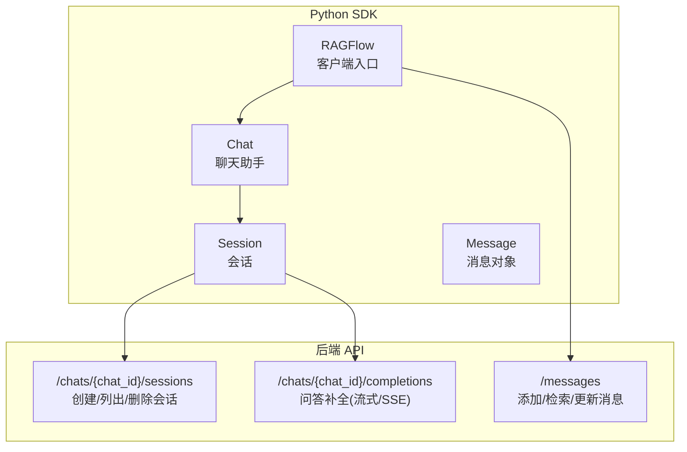
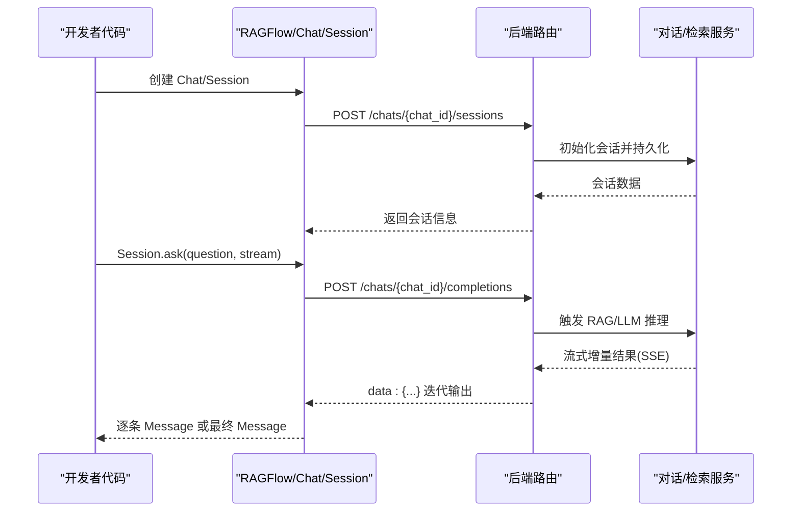
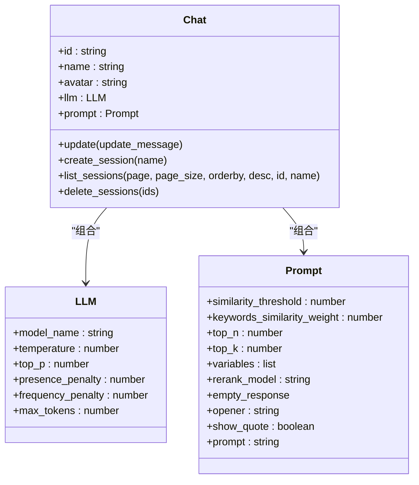
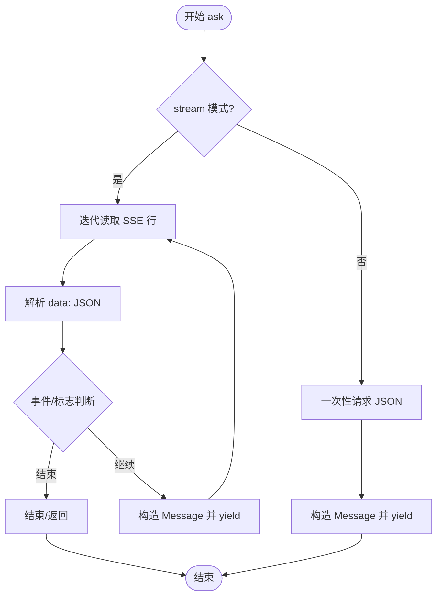
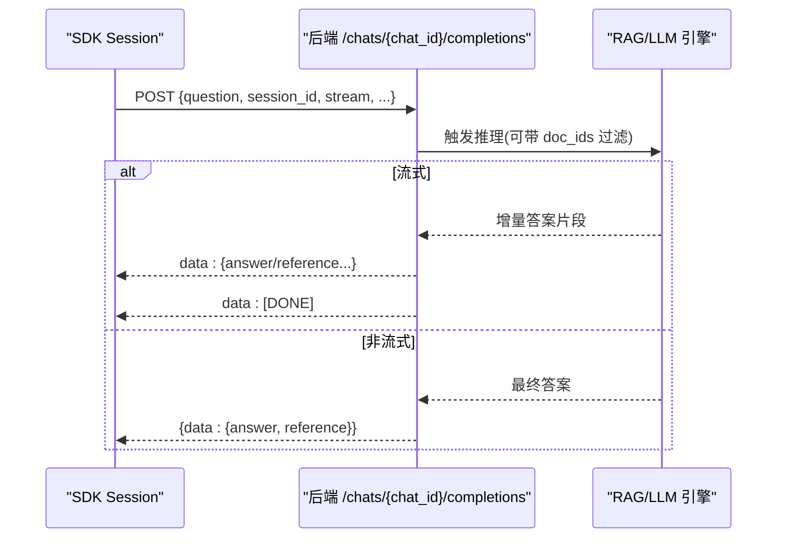
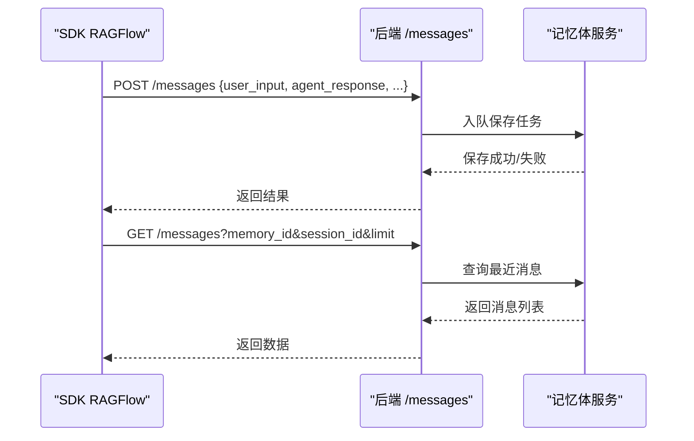
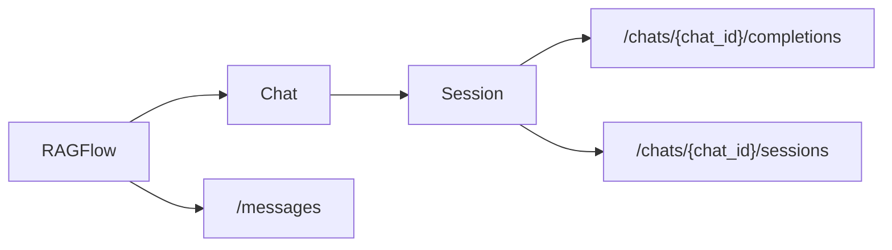

# 聊天模块

<cite>
**本文引用的文件**
- [sdk/python/ragflow_sdk/__init__.py](file://sdk/python/ragflow_sdk/__init__.py)
- [sdk/python/ragflow_sdk/ragflow.py](file://sdk/python/ragflow_sdk/ragflow.py)
- [sdk/python/ragflow_sdk/modules/chat.py](file://sdk/python/ragflow_sdk/modules/chat.py)
- [sdk/python/ragflow_sdk/modules/session.py](file://sdk/python/ragflow_sdk/modules/session.py)
- [api/apps/sdk/session.py](file://api/apps/sdk/session.py)
- [api/apps/sdk/messages.py](file://api/apps/sdk/messages.py)
</cite>

## 目录
1. [简介](#简介)
2. [项目结构](#项目结构)
3. [核心组件](#核心组件)
4. [架构总览](#架构总览)
5. [详细组件分析](#详细组件分析)
6. [依赖分析](#依赖分析)
7. [性能考虑](#性能考虑)
8. [故障排查指南](#故障排查指南)
9. [结论](#结论)
10. [附录](#附录)

## 简介
本文件面向使用 Python SDK 的开发者，系统性介绍聊天模块的设计与用法，覆盖以下主题：
- 聊天助手（Chat）的创建与配置
- 会话（Session）的生命周期管理与列表查询
- 对话交互：单轮与多轮、流式与非流式响应
- 上下文保持与历史记录管理
- 会话状态管理与超时处理机制
- 消息发送、接收与流式解析
- 多轮对话与上下文理解最佳实践
- 性能优化与并发处理建议
- 错误处理与重连机制
- 聊天界面集成与用户体验优化

## 项目结构
聊天模块位于 Python SDK 的 modules 子包中，对外通过 RAGFlow 主入口暴露能力；后端路由由 API 层提供，负责会话创建、补全生成、消息检索与存储等。

图表来源
- [sdk/python/ragflow_sdk/ragflow.py:111-189](file://sdk/python/ragflow_sdk/ragflow.py#L111-L189)
- [sdk/python/ragflow_sdk/modules/chat.py:74-89](file://sdk/python/ragflow_sdk/modules/chat.py#L74-L89)
- [sdk/python/ragflow_sdk/modules/session.py:36-111](file://sdk/python/ragflow_sdk/modules/session.py#L36-L111)
- [api/apps/sdk/session.py:54-80](file://api/apps/sdk/session.py#L54-L80)
- [api/apps/sdk/session.py:129-177](file://api/apps/sdk/session.py#L129-L177)
- [api/apps/sdk/messages.py:27-48](file://api/apps/sdk/messages.py#L27-L48)

章节来源
- [sdk/python/ragflow_sdk/__init__.py:22-31](file://sdk/python/ragflow_sdk/__init__.py#L22-L31)
- [sdk/python/ragflow_sdk/ragflow.py:111-189](file://sdk/python/ragflow_sdk/ragflow.py#L111-L189)

## 核心组件
- RAGFlow 客户端：封装基础请求方法与资源创建（如 Chat、DataSet、Agent、Memory 等），统一鉴权头与 API 基址。
- Chat：代表一个聊天助手实例，包含 LLM 参数与 Prompt 配置，支持更新与会话管理。
- Session：代表一次或多轮对话会话，支持 ask 发起问题、流式/非流式接收回答、消息结构化封装。
- Message：对返回消息的封装，包含内容、角色、引用片段等字段。

章节来源
- [sdk/python/ragflow_sdk/ragflow.py:27-51](file://sdk/python/ragflow_sdk/ragflow.py#L27-L51)
- [sdk/python/ragflow_sdk/modules/chat.py:22-60](file://sdk/python/ragflow_sdk/modules/chat.py#L22-L60)
- [sdk/python/ragflow_sdk/modules/session.py:21-33](file://sdk/python/ragflow_sdk/modules/session.py#L21-L33)

## 架构总览
SDK 侧通过 RAGFlow 统一发起 HTTP 请求，Chat/Session 封装业务语义；后端 API 提供会话生命周期管理与补全服务，支持 SSE 流式输出。

图表来源
- [sdk/python/ragflow_sdk/modules/chat.py:74-89](file://sdk/python/ragflow_sdk/modules/chat.py#L74-L89)
- [sdk/python/ragflow_sdk/modules/session.py:36-80](file://sdk/python/ragflow_sdk/modules/session.py#L36-L80)
- [api/apps/sdk/session.py:129-177](file://api/apps/sdk/session.py#L129-L177)

## 详细组件分析

### Chat 组件
- 责任边界：持有聊天助手的元信息与配置（名称、头像、LLM 参数、Prompt），负责会话创建与列表查询。
- 关键点：
  - LLM 参数：温度、TopP、惩罚项、最大 token 等，用于控制生成行为。
  - Prompt 配置：相似度阈值、关键词权重、变量占位、开场白、是否显示引用等。
  - 更新接口：校验 llm/prompt 不可为空，调用后端 PUT 更新。

图表来源
- [sdk/python/ragflow_sdk/modules/chat.py:22-60](file://sdk/python/ragflow_sdk/modules/chat.py#L22-L60)

章节来源
- [sdk/python/ragflow_sdk/modules/chat.py:31-60](file://sdk/python/ragflow_sdk/modules/chat.py#L31-L60)
- [sdk/python/ragflow_sdk/modules/chat.py:62-89](file://sdk/python/ragflow_sdk/modules/chat.py#L62-L89)

### Session 组件
- 责任边界：承载一次或多轮对话，负责向后端发起问答请求，解析流式响应，构造 Message 对象。
- 关键点：
  - ask 支持两种模式：流式（SSE）与非流式；流式按行解析 data: 行，直到 [DONE] 结束。
  - 内部区分 chat 与 agent 两类会话，分别调用不同补全路径。
  - 结果结构化：根据后端返回 data 字段组装 Message，支持引用块（chunks）透传。

图表来源
- [sdk/python/ragflow_sdk/modules/session.py:36-80](file://sdk/python/ragflow_sdk/modules/session.py#L36-L80)
- [sdk/python/ragflow_sdk/modules/session.py:99-111](file://sdk/python/ragflow_sdk/modules/session.py#L99-L111)

章节来源
- [sdk/python/ragflow_sdk/modules/session.py:21-33](file://sdk/python/ragflow_sdk/modules/session.py#L21-L33)
- [sdk/python/ragflow_sdk/modules/session.py:36-111](file://sdk/python/ragflow_sdk/modules/session.py#L36-L111)

### 后端会话与补全 API
- 会话管理：
  - 创建会话：校验所属关系，写入初始消息与会话信息。
  - 列表/删除：分页查询与批量删除，去重与错误聚合。
- 补全接口：
  - 聊天补全：支持流式（text/event-stream）与非流式；支持基于元数据条件过滤文档集合。
  - OpenAI 兼容接口：模拟 OpenAI 风格的消息格式，支持引用与推理内容分离。

图表来源
- [api/apps/sdk/session.py:129-177](file://api/apps/sdk/session.py#L129-L177)
- [api/apps/sdk/session.py:179-436](file://api/apps/sdk/session.py#L179-L436)

章节来源
- [api/apps/sdk/session.py:54-80](file://api/apps/sdk/session.py#L54-L80)
- [api/apps/sdk/session.py:577-628](file://api/apps/sdk/session.py#L577-L628)
- [api/apps/sdk/session.py:694-742](file://api/apps/sdk/session.py#L694-L742)
- [api/apps/sdk/session.py:129-177](file://api/apps/sdk/session.py#L129-L177)
- [api/apps/sdk/session.py:179-436](file://api/apps/sdk/session.py#L179-L436)

### 消息与历史记录管理
- 添加消息：支持将用户输入与模型回复写入记忆体队列，异步落库。
- 检索与最近消息：支持按相似度阈值、关键词权重、TopN 查询，以及按会话限制数量拉取最近消息。
- 删除/更新：支持按消息 ID 标记遗忘或更新状态。

图表来源
- [api/apps/sdk/messages.py:27-48](file://api/apps/sdk/messages.py#L27-L48)
- [api/apps/sdk/messages.py:123-144](file://api/apps/sdk/messages.py#L123-L144)

章节来源
- [api/apps/sdk/messages.py:27-48](file://api/apps/sdk/messages.py#L27-L48)
- [api/apps/sdk/messages.py:90-121](file://api/apps/sdk/messages.py#L90-L121)
- [api/apps/sdk/messages.py:123-144](file://api/apps/sdk/messages.py#L123-L144)

## 依赖分析
- SDK 与后端的耦合点主要在会话与补全两个维度：SDK 通过统一的 RAGFlow 客户端发起请求，Chat/Session 封装业务参数，后端路由负责权限校验、会话持久化与推理触发。
- 会话类型区分：chat 与 agent 两类会话在 SDK 中通过内部标识区分，在后端路由层对应不同的补全与会话存储逻辑。

图表来源
- [sdk/python/ragflow_sdk/ragflow.py:111-189](file://sdk/python/ragflow_sdk/ragflow.py#L111-L189)
- [sdk/python/ragflow_sdk/modules/chat.py:74-89](file://sdk/python/ragflow_sdk/modules/chat.py#L74-L89)
- [sdk/python/ragflow_sdk/modules/session.py:36-111](file://sdk/python/ragflow_sdk/modules/session.py#L36-L111)
- [api/apps/sdk/session.py:129-177](file://api/apps/sdk/session.py#L129-L177)
- [api/apps/sdk/messages.py:27-48](file://api/apps/sdk/messages.py#L27-L48)

章节来源
- [sdk/python/ragflow_sdk/ragflow.py:27-51](file://sdk/python/ragflow_sdk/ragflow.py#L27-L51)
- [sdk/python/ragflow_sdk/modules/chat.py:22-60](file://sdk/python/ragflow_sdk/modules/chat.py#L22-L60)
- [sdk/python/ragflow_sdk/modules/session.py:21-33](file://sdk/python/ragflow_sdk/modules/session.py#L21-L33)

## 性能考虑
- 流式传输：优先使用流式（SSE）以降低首字节延迟，提升交互体验；非流式适合短文本或调试场景。
- 文档过滤：通过元数据条件（metadata_condition）缩小检索范围，减少无关上下文，提高响应速度与准确性。
- Token 控制：合理设置 max_tokens 与 temperature/top_p，避免过长生成导致延迟增加。
- 并发策略：同一会话内串行提问；跨会话可并发，但需注意后端限流与资源占用。
- 缓存与复用：对稳定 Prompt 与 LLM 参数进行缓存，减少重复构建成本。

## 故障排查指南
- 权限与归属：若提示“不拥有该助手/会话”，请检查 chat_id/agent_id 与当前租户/用户身份是否匹配。
- 会话状态异常：确认会话存在且未被删除；必要时重新创建会话。
- 流式解析错误：确保正确处理 SSE 数据行，忽略空行与非 JSON 行；遇到 [DONE] 即结束。
- 非流式响应：若一次性请求无 JSON，请检查后端返回是否为期望格式。
- 消息写入失败：添加消息接口返回错误时，检查必填字段与内存 ID 是否有效。

章节来源
- [api/apps/sdk/session.py:56-80](file://api/apps/sdk/session.py#L56-L80)
- [api/apps/sdk/session.py:107-126](file://api/apps/sdk/session.py#L107-L126)
- [api/apps/sdk/session.py:164-177](file://api/apps/sdk/session.py#L164-L177)
- [api/apps/sdk/messages.py:30-48](file://api/apps/sdk/messages.py#L30-L48)

## 结论
聊天模块通过清晰的 SDK 分层与后端 API 协作，提供了从会话创建到多轮问答、从流式响应到历史记录管理的完整能力。遵循本文的最佳实践与排错指引，可在保证性能与稳定性的同时，快速集成高质量的聊天体验。

## 附录

### 快速上手与集成要点
- 创建 Chat：指定名称、头像、知识库 ID 列表，以及 LLM/Prompt 配置。
- 创建 Session：为每次对话创建独立会话，保持上下文。
- 发起问答：选择流式或非流式；流式逐条消费 Message，非流式等待最终答案。
- 历史管理：通过消息接口添加/检索/更新/遗忘消息，支撑回溯与分析。
- 超时与重试：在 SDK 层设置合理的请求超时与指数退避重试；后端 SSE 会在连接中断时结束流，需在前端重建会话并重放必要上下文。

章节来源
- [sdk/python/ragflow_sdk/ragflow.py:111-189](file://sdk/python/ragflow_sdk/ragflow.py#L111-L189)
- [sdk/python/ragflow_sdk/modules/chat.py:74-89](file://sdk/python/ragflow_sdk/modules/chat.py#L74-L89)
- [sdk/python/ragflow_sdk/modules/session.py:36-80](file://sdk/python/ragflow_sdk/modules/session.py#L36-L80)
- [api/apps/sdk/messages.py:27-48](file://api/apps/sdk/messages.py#L27-L48)