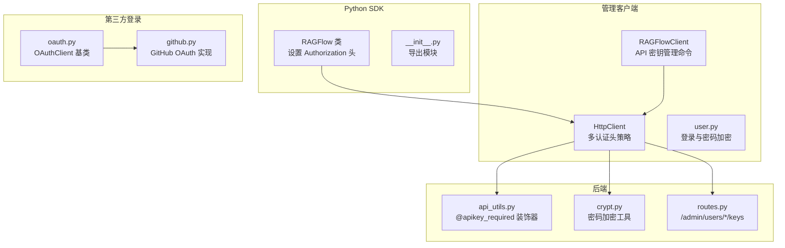
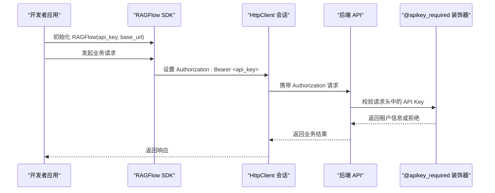
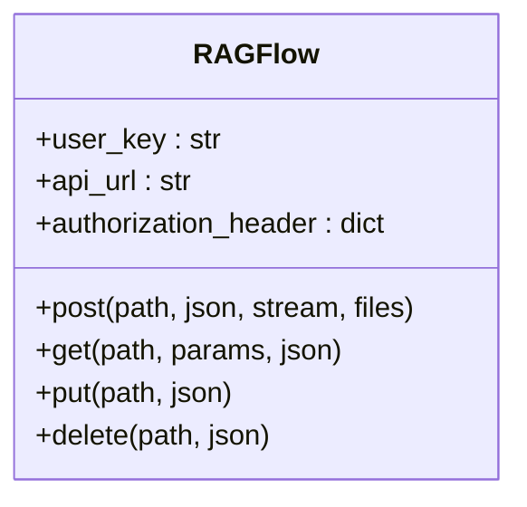
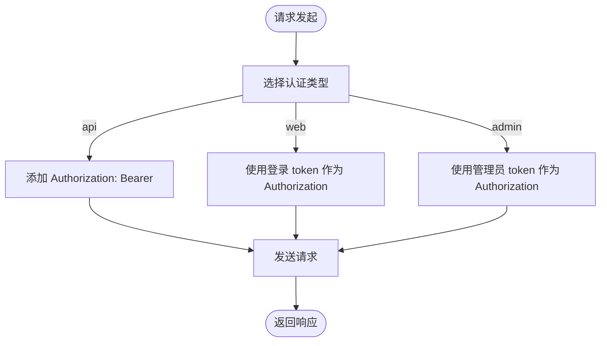
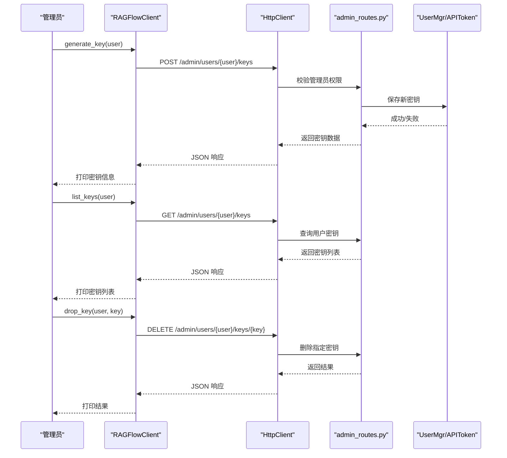
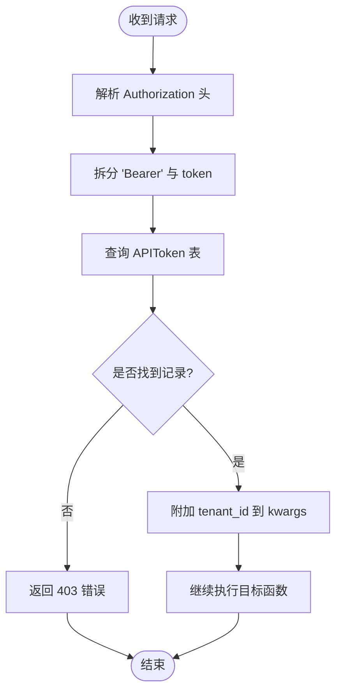
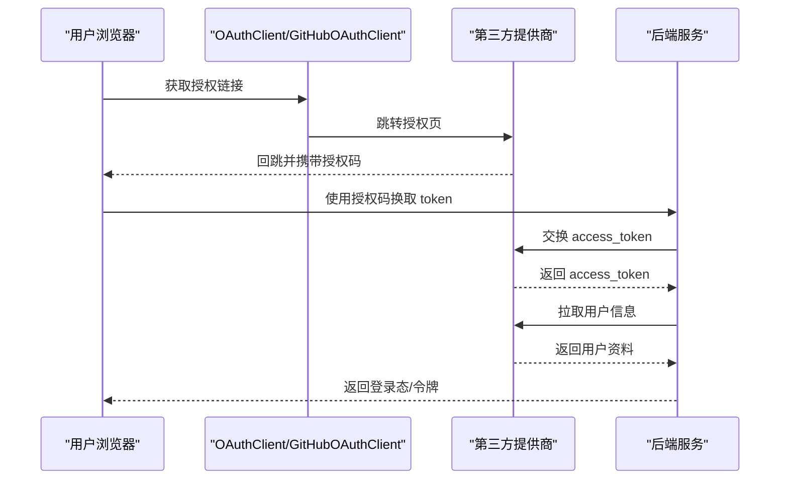
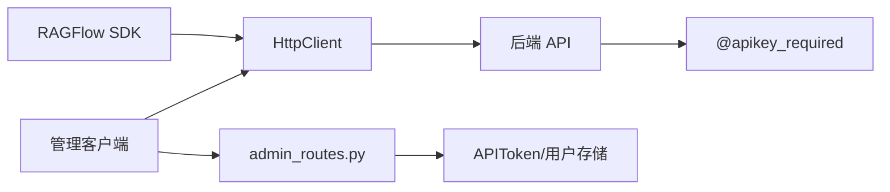

# 认证与授权

<cite>
**本文引用的文件**
- [sdk/python/ragflow_sdk/ragflow.py](file://sdk/python/ragflow_sdk/ragflow.py)
- [sdk/python/ragflow_sdk/__init__.py](file://sdk/python/ragflow_sdk/__init__.py)
- [admin/client/http_client.py](file://admin/client/http_client.py)
- [admin/client/ragflow_client.py](file://admin/client/ragflow_client.py)
- [admin/client/user.py](file://admin/client/user.py)
- [api/apps/auth/oauth.py](file://api/apps/auth/oauth.py)
- [api/apps/auth/github.py](file://api/apps/auth/github.py)
- [api/utils/api_utils.py](file://api/utils/api_utils.py)
- [api/utils/crypt.py](file://api/utils/crypt.py)
- [admin/server/routes.py](file://admin/server/routes.py)
- [docs/guides/admin/ragflow_cli.md](file://docs/guides/admin/ragflow_cli.md)
- [test/testcases/test_admin_api/test_user_api_key_management/test_get_user_api_key.py](file://test/testcases/test_admin_api/test_user_api_key_management/test_get_user_api_key.py)
</cite>

## 目录
1. [简介](#简介)
2. [项目结构](#项目结构)
3. [核心组件](#核心组件)
4. [架构总览](#架构总览)
5. [详细组件分析](#详细组件分析)
6. [依赖分析](#依赖分析)
7. [性能考虑](#性能考虑)
8. [故障排查指南](#故障排查指南)
9. [结论](#结论)
10. [附录](#附录)

## 简介
本文件面向使用 Python SDK 的开发者，系统性说明 RAGFlow 的认证与授权机制，覆盖以下主题：
- API 密钥的获取与配置（含在管理界面中的操作）
- 不同认证方式：Bearer Token 认证与 API Key 认证的实现差异与适用场景
- 常见认证失败原因与处理方法（过期密钥、权限不足等）
- 安全最佳实践（密钥存储、传输加密、访问控制）
- 认证状态检查与自动重试机制的使用建议

## 项目结构
围绕认证与授权的关键代码分布在以下模块：
- Python SDK：封装统一的请求与认证头设置，便于以 Bearer Token 方式调用后端 API
- 管理客户端：提供登录、API 密钥生成与管理等命令行能力
- 后端认证工具：提供 API Key 校验装饰器与通用错误响应构建
- OAuth 客户端：支持第三方 OAuth 登录流程（如 GitHub）

图表来源
- [sdk/python/ragflow_sdk/ragflow.py:27-50](file://sdk/python/ragflow_sdk/ragflow.py#L27-L50)
- [sdk/python/ragflow_sdk/__init__.py:22-42](file://sdk/python/ragflow_sdk/__init__.py#L22-L42)
- [admin/client/http_client.py:26-71](file://admin/client/http_client.py#L26-L71)
- [admin/client/ragflow_client.py:470-518](file://admin/client/ragflow_client.py#L470-L518)
- [admin/client/user.py:49-65](file://admin/client/user.py#L49-L65)
- [api/utils/api_utils.py:238-251](file://api/utils/api_utils.py#L238-L251)
- [api/utils/crypt.py:25-41](file://api/utils/crypt.py#L25-L41)
- [admin/server/routes.py:519-541](file://admin/server/routes.py#L519-L541)
- [api/apps/auth/oauth.py:32-152](file://api/apps/auth/oauth.py#L32-L152)
- [api/apps/auth/github.py:21-89](file://api/apps/auth/github.py#L21-L89)

章节来源
- [sdk/python/ragflow_sdk/ragflow.py:27-50](file://sdk/python/ragflow_sdk/ragflow.py#L27-L50)
- [admin/client/http_client.py:26-71](file://admin/client/http_client.py#L26-L71)
- [admin/client/ragflow_client.py:470-518](file://admin/client/ragflow_client.py#L470-L518)
- [api/utils/api_utils.py:238-251](file://api/utils/api_utils.py#L238-L251)
- [api/utils/crypt.py:25-41](file://api/utils/crypt.py#L25-L41)
- [admin/server/routes.py:519-541](file://admin/server/routes.py#L519-L541)
- [api/apps/auth/oauth.py:32-152](file://api/apps/auth/oauth.py#L32-L152)
- [api/apps/auth/github.py:21-89](file://api/apps/auth/github.py#L21-L89)

## 核心组件
- Python SDK 的 RAGFlow 类通过构造 Authorization 头实现 Bearer Token 认证，默认将用户提供的密钥附加到每个请求头中，用于后端 API 的鉴权校验。
- 管理客户端 HttpClient 提供三种认证头策略：
  - api：当存在 api_key 时，使用 Authorization: Bearer <api_key>
  - web：当存在登录后的 token 时，直接使用该 token 作为 Authorization
  - admin：与 web 类似，用于管理员会话
- 后端通过装饰器对 API Key 进行强制校验，若无效则返回禁止访问的错误响应。

章节来源
- [sdk/python/ragflow_sdk/ragflow.py:27-50](file://sdk/python/ragflow_sdk/ragflow.py#L27-L50)
- [admin/client/http_client.py:59-71](file://admin/client/http_client.py#L59-L71)
- [api/utils/api_utils.py:238-251](file://api/utils/api_utils.py#L238-L251)

## 架构总览
下图展示从 SDK 到后端的认证链路，以及管理客户端对 API 密钥的生命周期管理。

图表来源
- [sdk/python/ragflow_sdk/ragflow.py:27-50](file://sdk/python/ragflow_sdk/ragflow.py#L27-L50)
- [admin/client/http_client.py:59-71](file://admin/client/http_client.py#L59-L71)
- [api/utils/api_utils.py:238-251](file://api/utils/api_utils.py#L238-L251)

## 详细组件分析

### 组件一：Python SDK 的 Bearer Token 认证
- RAGFlow 类在初始化时保存用户提供的 API Key，并将其拼接为 "Bearer <api_key>" 写入请求头。
- 所有 HTTP 方法（get/post/put/delete）均复用该头，确保统一的认证上下文。
- 该模式适合 SDK 直接持有长期有效的 API Key 场景。

图表来源
- [sdk/python/ragflow_sdk/ragflow.py:27-50](file://sdk/python/ragflow_sdk/ragflow.py#L27-L50)

章节来源
- [sdk/python/ragflow_sdk/ragflow.py:27-50](file://sdk/python/ragflow_sdk/ragflow.py#L27-L50)

### 组件二：管理客户端的多认证头策略
- HttpClient 支持三种认证路径：
  - api：当传入 api_key 时，自动添加 "Authorization: Bearer <api_key>"
  - web：当存在登录 token 时，直接使用该 token
  - admin：管理员会话使用的 token
- 该设计允许在同一客户端中切换不同认证方式，满足管理与用户态的不同需求。

图表来源
- [admin/client/http_client.py:59-71](file://admin/client/http_client.py#L59-L71)

章节来源
- [admin/client/http_client.py:26-71](file://admin/client/http_client.py#L26-L71)

### 组件三：API 密钥的生成、查询与删除（管理端）
- 管理客户端提供生成、列出与删除 API 密钥的命令，底层通过 HttpClient 调用后端路由。
- 后端路由对管理员身份进行校验，并执行密钥的增删查操作。
- 测试用例验证了返回数据结构与字段完整性。

图表来源
- [admin/client/ragflow_client.py:470-518](file://admin/client/ragflow_client.py#L470-L518)
- [admin/server/routes.py:519-541](file://admin/server/routes.py#L519-L541)
- [test/testcases/test_admin_api/test_user_api_key_management/test_get_user_api_key.py:35-82](file://test/testcases/test_admin_api/test_user_api_key_management/test_get_user_api_key.py#L35-L82)

章节来源
- [admin/client/ragflow_client.py:470-518](file://admin/client/ragflow_client.py#L470-L518)
- [admin/server/routes.py:519-541](file://admin/server/routes.py#L519-L541)
- [test/testcases/test_admin_api/test_user_api_key_management/test_get_user_api_key.py:35-82](file://test/testcases/test_admin_api/test_user_api_key_management/test_get_user_api_key.py#L35-L82)

### 组件四：后端 API Key 校验装饰器
- 装饰器从请求头解析 API Key 并查询有效记录，若不存在则返回禁止访问的错误响应。
- 该机制确保所有受保护接口默认启用 API Key 校验。

图表来源
- [api/utils/api_utils.py:238-251](file://api/utils/api_utils.py#L238-L251)

章节来源
- [api/utils/api_utils.py:238-251](file://api/utils/api_utils.py#L238-L251)

### 组件五：第三方 OAuth 登录（可选）
- OAuthClient 提供标准的授权码交换与用户信息拉取流程，支持同步与异步两种方式。
- GitHubOAuthClient 在其基础上补充了邮箱主次关系处理与用户名规范化。

图表来源
- [api/apps/auth/oauth.py:48-126](file://api/apps/auth/oauth.py#L48-L126)
- [api/apps/auth/github.py:35-80](file://api/apps/auth/github.py#L35-L80)

章节来源
- [api/apps/auth/oauth.py:32-152](file://api/apps/auth/oauth.py#L32-L152)
- [api/apps/auth/github.py:21-89](file://api/apps/auth/github.py#L21-L89)

## 依赖分析
- SDK 与管理客户端均依赖 HTTP 层进行请求发送；SDK 默认以 Bearer Token 方式认证，管理客户端根据认证类型动态设置头。
- 后端通过装饰器集中处理 API Key 校验，避免在各路由重复实现。
- 密钥生命周期由管理端命令驱动，测试用例保障返回结构正确性。

图表来源
- [sdk/python/ragflow_sdk/ragflow.py:27-50](file://sdk/python/ragflow_sdk/ragflow.py#L27-L50)
- [admin/client/http_client.py:59-71](file://admin/client/http_client.py#L59-L71)
- [api/utils/api_utils.py:238-251](file://api/utils/api_utils.py#L238-L251)
- [admin/server/routes.py:519-541](file://admin/server/routes.py#L519-L541)

章节来源
- [sdk/python/ragflow_sdk/ragflow.py:27-50](file://sdk/python/ragflow_sdk/ragflow.py#L27-L50)
- [admin/client/http_client.py:26-71](file://admin/client/http_client.py#L26-L71)
- [api/utils/api_utils.py:238-251](file://api/utils/api_utils.py#L238-L251)
- [admin/server/routes.py:519-541](file://admin/server/routes.py#L519-L541)

## 性能考虑
- SDK 与管理客户端均使用 requests 会话发送请求，未显式配置连接池参数，通常足以满足一般调用频度。
- 若需高并发或长连接优化，可在 HttpClient 中引入连接池适配器（当前注释掉的部分展示了可扩展点）。

[本节为通用建议，不涉及具体文件分析]

## 故障排查指南
- API Key 无效
  - 现象：后端返回禁止访问错误
  - 排查：确认 SDK 初始化时传入的 api_key 是否正确；确认管理端已为用户生成并保存有效密钥
  - 参考：后端装饰器对无效 Key 的处理
- 权限不足
  - 现象：管理端命令返回权限相关错误
  - 排查：确认当前会话具备管理员权限；检查用户角色与资源授权
  - 参考：管理端路由对管理员身份的校验
- 密钥泄露或被滥用
  - 处置：立即删除对应密钥并生成新的密钥
  - 参考：管理端删除密钥命令与后端路由
- 登录态失效
  - 现象：web/admin 认证头失效
  - 处理：重新登录获取新的 Authorization token
  - 参考：管理客户端登录流程与用户加密工具

章节来源
- [api/utils/api_utils.py:238-251](file://api/utils/api_utils.py#L238-L251)
- [admin/server/routes.py:519-541](file://admin/server/routes.py#L519-L541)
- [admin/client/ragflow_client.py:470-518](file://admin/client/ragflow_client.py#L470-L518)
- [admin/client/user.py:49-65](file://admin/client/user.py#L49-L65)

## 结论
- RAGFlow 的 Python SDK 默认采用 Bearer Token 认证，适合直接持有 API Key 的场景。
- 管理客户端提供灵活的多认证头策略，满足管理员与用户态的差异化需求。
- 后端通过装饰器统一校验 API Key，配合管理端的密钥生命周期管理，形成完整的认证闭环。
- 建议在生产环境遵循安全最佳实践，严格管控密钥与登录态，定期轮换并审计权限。

[本节为总结性内容，不涉及具体文件分析]

## 附录

### A. API 密钥获取与配置（管理界面）
- 使用管理 CLI 生成、列出与删除 API 密钥，命令示例与输出格式详见文档。
- 生成密钥后，将返回的 token 配置到 SDK 初始化参数中即可完成认证。

章节来源
- [docs/guides/admin/ragflow_cli.md:96-109](file://docs/guides/admin/ragflow_cli.md#L96-L109)
- [admin/client/ragflow_client.py:470-518](file://admin/client/ragflow_client.py#L470-L518)

### B. 认证状态检查与自动重试建议
- 认证状态检查：可通过 SDK 或管理客户端的 ping/health 接口判断服务可用性与认证头有效性。
- 自动重试：在 SDK 层可基于响应状态码（如 401/403）触发重试逻辑，结合密钥轮换与登录态刷新策略使用。

[本节为通用建议，不涉及具体文件分析]