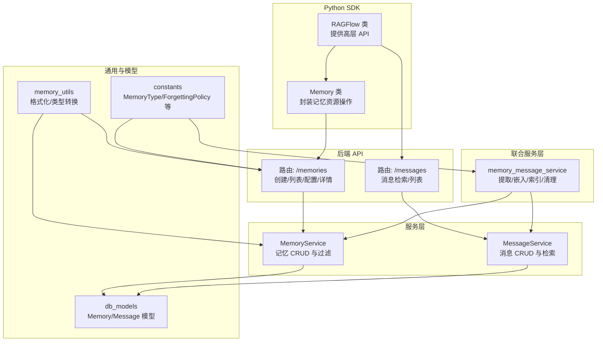
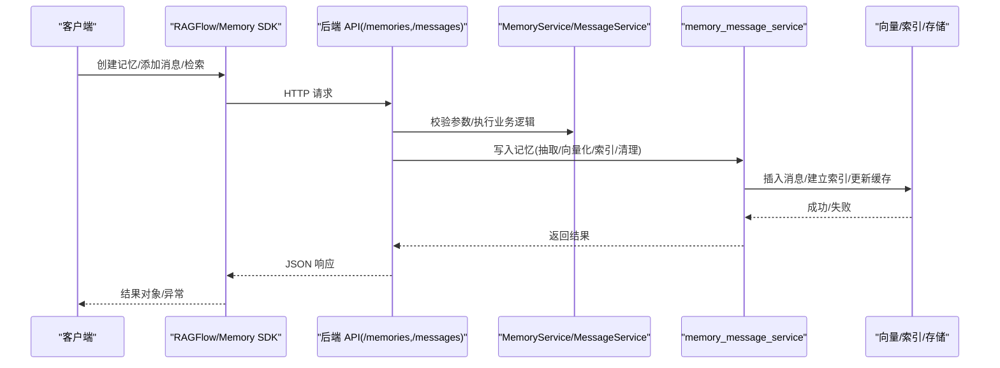
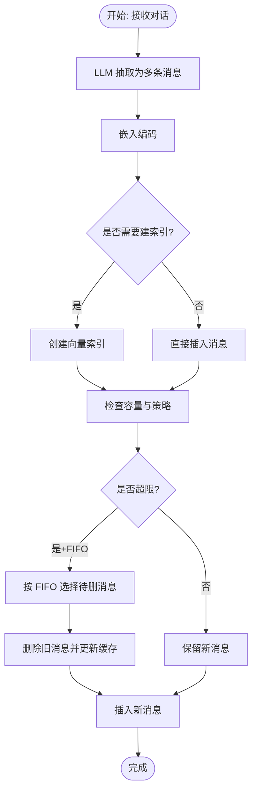
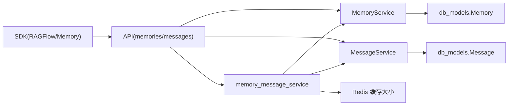

# 记忆模块

<cite>
**本文引用的文件**
- [memories.py](file://api/apps/sdk/memories.py)
- [memory_service.py](file://api/db/services/memory_service.py)
- [memory_message_service.py](file://api/db/joint_services/memory_message_service.py)
- [memory_utils.py](file://api/utils/memory_utils.py)
- [memory.py](file://sdk/python/ragflow_sdk/modules/memory.py)
- [ragflow.py](file://sdk/python/ragflow_sdk/ragflow.py)
- [constants.py](file://common/constants.py)
- [db_models.py](file://api/db/db_models.py)
</cite>

## 目录
1. [简介](#简介)
2. [项目结构](#项目结构)
3. [核心组件](#核心组件)
4. [架构总览](#架构总览)
5. [详细组件分析](#详细组件分析)
6. [依赖关系分析](#依赖关系分析)
7. [性能与缓存策略](#性能与缓存策略)
8. [故障排查指南](#故障排查指南)
9. [结论](#结论)
10. [附录：API 参考与最佳实践](#附录api-参考与最佳实践)

## 简介
本文件系统性梳理并文档化 Python SDK 的“记忆模块”，覆盖以下关键主题：
- 记忆的创建、查询、更新、删除 API
- 记忆持久化与检索的完整流程
- 记忆分类与标签（类型）管理
- 生命周期管理与自动清理机制
- 个性化记忆与上下文记忆使用示例
- 性能优化与缓存策略
- 同步与备份实现思路
- 安全与隐私保护最佳实践

## 项目结构
围绕记忆模块的关键代码分布在后端 API 路由层、服务层、联合服务层、工具层以及 Python SDK 层。

图表来源
- [memories.py:36-292](file://api/apps/sdk/memories.py#L36-L292)
- [memory_service.py:28-171](file://api/db/services/memory_service.py#L28-L171)
- [memory_message_service.py:38-439](file://api/db/joint_services/memory_message_service.py#L38-L439)
- [memory_utils.py:19-55](file://api/utils/memory_utils.py#L19-L55)
- [memory.py:20-96](file://sdk/python/ragflow_sdk/modules/memory.py#L20-L96)
- [ragflow.py:294-376](file://sdk/python/ragflow_sdk/ragflow.py#L294-L376)
- [constants.py:170-184](file://common/constants.py#L170-L184)
- [db_models.py:134-200](file://api/db/db_models.py#L134-L200)

章节来源
- [memories.py:36-292](file://api/apps/sdk/memories.py#L36-L292)
- [memory_service.py:28-171](file://api/db/services/memory_service.py#L28-L171)
- [memory_message_service.py:38-439](file://api/db/joint_services/memory_message_service.py#L38-L439)
- [memory_utils.py:19-55](file://api/utils/memory_utils.py#L19-L55)
- [memory.py:20-96](file://sdk/python/ragflow_sdk/modules/memory.py#L20-L96)
- [ragflow.py:294-376](file://sdk/python/ragflow_sdk/ragflow.py#L294-L376)
- [constants.py:170-184](file://common/constants.py#L170-L184)
- [db_models.py:134-200](file://api/db/db_models.py#L134-L200)

## 核心组件
- SDK 层
  - RAGFlow：提供 create_memory、list_memory、delete_memory、add_message、search_message、get_recent_messages 等高层 API。
  - Memory：对单个记忆实例进行更新、获取配置、列出消息、删除消息、更新状态、读取内容等。
- 后端 API 层
  - /memories：创建、更新、删除、列表、配置查询、详情查询（含消息分页列表）。
  - /messages：消息检索、最近消息列表、消息内容读取、消息删除与状态更新。
- 服务层
  - MemoryService：记忆的创建、更新、删除、按条件过滤查询。
  - MessageService：消息的插入、检索、搜索、删除、索引创建与大小统计。
- 联合服务层
  - memory_message_service：消息写入记忆的完整链路（LLM 抽取、向量化、索引、容量控制/FIFO 清理、Redis 缓存记忆大小）。
- 工具与常量
  - memory_utils：返回数据格式化、记忆类型人类可读转换、类型值计算。
  - constants：MemoryType（RAW/SEMANTIC/EPISODIC/PROCEDURAL）、ForgettingPolicy（FIFO）等枚举。

章节来源
- [ragflow.py:294-376](file://sdk/python/ragflow_sdk/ragflow.py#L294-L376)
- [memory.py:20-96](file://sdk/python/ragflow_sdk/modules/memory.py#L20-L96)
- [memories.py:36-292](file://api/apps/sdk/memories.py#L36-L292)
- [memory_service.py:28-171](file://api/db/services/memory_service.py#L28-L171)
- [memory_message_service.py:38-439](file://api/db/joint_services/memory_message_service.py#L38-L439)
- [memory_utils.py:19-55](file://api/utils/memory_utils.py#L19-L55)
- [constants.py:170-184](file://common/constants.py#L170-L184)

## 架构总览
记忆模块的调用链从 SDK 到后端 API，再到服务层与联合服务层，最终落库或落向量存储/索引。

图表来源
- [ragflow.py:294-376](file://sdk/python/ragflow_sdk/ragflow.py#L294-L376)
- [memories.py:36-292](file://api/apps/sdk/memories.py#L36-L292)
- [memory_service.py:28-171](file://api/db/services/memory_service.py#L28-L171)
- [memory_message_service.py:38-439](file://api/db/joint_services/memory_message_service.py#L38-L439)

## 详细组件分析

### SDK 层：RAGFlow 与 Memory
- RAGFlow
  - create_memory：创建记忆，传入名称、类型集合、嵌入模型 ID、LLM ID。
  - list_memory：支持按租户、类型、存储类型、关键词分页查询。
  - delete_memory：删除指定记忆。
  - add_message：批量记忆写入任务（异步），提交原始对话，后台抽取并嵌入。
  - search_message：基于相似度与关键词融合检索。
  - get_recent_messages：按条件分页获取最近消息。
- Memory
  - update/update_message_status：更新记忆元信息或消息状态。
  - get_config/list_memory_messages：获取记忆配置与消息列表。
  - forget_message/get_message_content：删除消息或读取消息内容。

章节来源
- [ragflow.py:294-376](file://sdk/python/ragflow_sdk/ragflow.py#L294-L376)
- [memory.py:20-96](file://sdk/python/ragflow_sdk/modules/memory.py#L20-L96)

### 后端 API 层：记忆与消息接口
- /memories
  - POST：创建记忆（校验名称长度、类型集合有效性、默认系统提示生成）。
  - PUT：更新记忆（名称、权限、LLM/嵌入模型、类型、容量、遗忘策略、温度；类型变更时可自动重装系统提示）。
  - DELETE：删除记忆（同时清理其消息索引）。
  - GET：列表查询（支持多租户、类型、存储类型、关键词、分页）。
  - GET /memories/<id>/config：获取记忆配置（含所有字段）。
  - GET /memories/<id>：获取记忆详情（消息分页列表，关联代理名与任务进度）。
- /messages
  - GET /messages/search：检索（相似度阈值、关键词权重、TopN）。
  - GET /messages：最近消息列表（支持 agent_id/session_id/limit）。
  - GET /messages/<mid>/content：读取消息内容。
  - PUT /messages/<mid>：更新消息状态。
  - DELETE /messages/<mid>：删除消息。

章节来源
- [memories.py:36-292](file://api/apps/sdk/memories.py#L36-L292)

### 服务层：MemoryService 与 MessageService
- MemoryService
  - create_memory：去重名称、组装系统提示、写入数据库。
  - update_memory：名称去重、类型位运算合并、统一更新时间戳。
  - get_by_filter：按租户/类型/存储类型/关键词过滤并分页。
  - 其他：按 ID/租户查询、删除。
- MessageService
  - insert_message/search_message/list_message/delete_message 等。
  - create_index/calculate_message_size/pick_messages_to_delete_by_fifo 等。

章节来源
- [memory_service.py:28-171](file://api/db/services/memory_service.py#L28-L171)

### 联合服务层：记忆写入与检索链路
- save_to_memory/save_extracted_to_memory_only：抽取对话为多条消息，生成嵌入，建立索引，写入存储。
- embed_and_save：向量化后根据容量限制与遗忘策略（FIFO）决定是否清理旧消息并插入新消息。
- query_message：构造稀疏/稠密融合检索表达式，返回 TopN。
- 缓存：Redis 维护每个记忆的当前大小，避免频繁扫描存储。

图表来源
- [memory_message_service.py:38-214](file://api/db/joint_services/memory_message_service.py#L38-L214)

章节来源
- [memory_message_service.py:38-439](file://api/db/joint_services/memory_message_service.py#L38-L439)

### 工具与常量：类型与格式化
- memory_utils
  - format_ret_data_from_memory：统一返回字段。
  - get_memory_type_human/calculate_memory_type：类型位运算与人类可读互转。
- constants
  - MemoryType：RAW/SEMANTIC/EPISODIC/PROCEDURAL（位掩码组合）。
  - ForgettingPolicy：FIFO。
  - RetCode：统一错误码。

章节来源
- [memory_utils.py:19-55](file://api/utils/memory_utils.py#L19-L55)
- [constants.py:170-184](file://common/constants.py#L170-L184)

## 依赖关系分析
- SDK 依赖后端 API，后端 API 依赖服务层与联合服务层，联合服务层依赖向量/索引与 Redis 缓存。
- MemoryService 与 MessageService 依赖数据库模型（Peewee）。
- 记忆类型与遗忘策略来自常量定义，贯穿前端展示与后端逻辑。

图表来源
- [ragflow.py:294-376](file://sdk/python/ragflow_sdk/ragflow.py#L294-L376)
- [memories.py:36-292](file://api/apps/sdk/memories.py#L36-L292)
- [memory_service.py:28-171](file://api/db/services/memory_service.py#L28-L171)
- [memory_message_service.py:38-439](file://api/db/joint_services/memory_message_service.py#L38-L439)
- [db_models.py:134-200](file://api/db/db_models.py#L134-L200)

章节来源
- [ragflow.py:294-376](file://sdk/python/ragflow_sdk/ragflow.py#L294-L376)
- [memories.py:36-292](file://api/apps/sdk/memories.py#L36-L292)
- [memory_service.py:28-171](file://api/db/services/memory_service.py#L28-L171)
- [memory_message_service.py:38-439](file://api/db/joint_services/memory_message_service.py#L38-L439)
- [db_models.py:134-200](file://api/db/db_models.py#L134-L200)

## 性能与缓存策略
- 写入路径性能
  - LLM 抽取与嵌入编码为 IO 密集步骤，建议在 SDK 层批量提交 add_message，后端通过队列异步处理，降低请求延迟。
  - 向量索引仅在首次写入时创建，避免重复开销。
- 容量与清理
  - 写入前计算新增消息体积与当前内存大小，超过上限时按 FIFO 策略删除旧消息，确保容量稳定。
- 缓存
  - 使用 Redis 缓存每个记忆的当前大小，减少对存储层的扫描压力；写入成功后增量更新缓存。
- 检索
  - 稀疏文本匹配与稠密向量检索融合，权重可调；TopN 控制召回规模，兼顾准确率与性能。
- 并发与批处理
  - 批量插入消息时，尽量复用嵌入模型与检索器实例，减少初始化成本。

章节来源
- [memory_message_service.py:172-214](file://api/db/joint_services/memory_message_service.py#L172-L214)
- [memory_message_service.py:270-296](file://api/db/joint_services/memory_message_service.py#L270-L296)

## 故障排查指南
- 常见错误与定位
  - 参数校验失败：名称为空或超长、类型非法、温度越界、容量不在允许范围、权限不合法。
  - 记忆不存在：查询/更新/删除时返回未找到。
  - 更新受限：当记忆非空时禁止修改嵌入模型与类型字段。
  - 写入失败：向量化/索引创建/插入存储失败，需检查 LLM/嵌入模型可用性与存储配置。
  - 队列不可达：异步任务无法入队，检查 Redis 连接。
- 建议排查步骤
  - 确认 SDK 版本与后端 API 版本兼容。
  - 查看后端日志中 API Timing（如开启）以定位耗时环节。
  - 检查 Redis 中 memory_<id> 键是否存在与数值正确。
  - 对于检索异常，调整相似度阈值与关键词权重，缩小 TopN。

章节来源
- [memories.py:40-113](file://api/apps/sdk/memories.py#L40-L113)
- [memories.py:118-197](file://api/apps/sdk/memories.py#L118-L197)
- [memory_message_service.py:172-214](file://api/db/joint_services/memory_message_service.py#L172-L214)
- [memory_message_service.py:332-402](file://api/db/joint_services/memory_message_service.py#L332-L402)

## 结论
记忆模块通过 SDK 提供简洁易用的高层 API，后端以服务层与联合服务层实现完整的抽取、嵌入、索引、容量控制与检索能力，并辅以 Redis 缓存与 FIFO 自动清理，满足高并发场景下的性能与稳定性需求。类型与策略的枚举化设计使得扩展与维护更加清晰可控。

## 附录：API 参考与最佳实践

### API 方法总览
- SDK
  - RAGFlow.create_memory(name, memory_type, embd_id, llm_id)
  - RAGFlow.list_memory(page, page_size, tenant_id, memory_type, storage_type, keywords)
  - RAGFlow.delete_memory(memory_id)
  - RAGFlow.add_message(memory_id, agent_id, session_id, user_input, agent_response, user_id="")
  - RAGFlow.search_message(query, memory_id, agent_id, session_id, similarity_threshold, keywords_similarity_weight, top_n)
  - RAGFlow.get_recent_messages(memory_id, agent_id, session_id, limit)
  - Memory.update(update_dict)
  - Memory.get_config()
  - Memory.list_memory_messages(agent_id, keywords, page, page_size)
  - Memory.forget_message(message_id)
  - Memory.update_message_status(message_id, status)
  - Memory.get_message_content(message_id)

章节来源
- [ragflow.py:294-376](file://sdk/python/ragflow_sdk/ragflow.py#L294-L376)
- [memory.py:20-96](file://sdk/python/ragflow_sdk/modules/memory.py#L20-L96)

### 记忆分类与标签管理
- 分类
  - 支持多种记忆类型组合（RAW/SEMANTIC/EPISODIC/PROCEDURAL），以位掩码表示，便于灵活组合与过滤。
- 标签
  - 当前实现未提供专用“标签”字段；可通过记忆描述、系统提示、用户提示等辅助实现语义分组与检索。

章节来源
- [constants.py:170-175](file://common/constants.py#L170-L175)
- [memory_utils.py:44-54](file://api/utils/memory_utils.py#L44-L54)

### 生命周期与自动清理
- 生命周期
  - 创建：生成系统提示、分配嵌入与 LLM、设定容量与策略。
  - 写入：抽取、嵌入、索引、插入、缓存大小更新。
  - 清理：容量超限时按 FIFO 删除旧消息。
  - 查询：支持按类型、存储类型、关键词过滤与分页。
- 自动清理
  - FIFO 策略：优先删除最早的消息，直至满足容量约束。

章节来源
- [memory_message_service.py:194-203](file://api/db/joint_services/memory_message_service.py#L194-L203)
- [constants.py:182-184](file://common/constants.py#L182-L184)

### 个性化与上下文记忆示例
- 个性化
  - 通过设置 temperature、system_prompt、user_prompt 实现不同风格与行为。
- 上下文
  - 通过会话维度（session_id）与 agent_id 进行消息筛选与检索，构建上下文感知的回复。

章节来源
- [memories.py:150-160](file://api/apps/sdk/memories.py#L150-L160)
- [memories.py:262-291](file://api/apps/sdk/memories.py#L262-L291)

### 持久化与检索流程
- 持久化
  - 原始对话写入后，经 LLM 抽取为多条结构化消息，生成向量并写入索引。
- 检索
  - 将问题向量化并与文本关键词检索融合，按权重排序返回 TopN。

章节来源
- [memory_message_service.py:38-214](file://api/db/joint_services/memory_message_service.py#L38-L214)
- [memory_message_service.py:217-248](file://api/db/joint_services/memory_message_service.py#L217-L248)

### 同步与备份
- 同步
  - 异步任务通过 Redis 队列分发，任务表记录进度与状态，便于重试与追踪。
- 备份
  - 建议结合数据库备份策略与向量存储快照，定期导出记忆配置与消息摘要。

章节来源
- [memory_message_service.py:332-402](file://api/db/joint_services/memory_message_service.py#L332-L402)

### 安全与隐私
- 最小暴露
  - 仅在必要时传递敏感上下文，避免在 RAW 类型中泄露隐私信息。
- 权限控制
  - 使用 permissions 字段限制访问范围（me/tenant/organization）。
- 数据脱敏
  - 在抽取阶段对敏感字段进行脱敏或过滤。
- 存储安全
  - 向量与索引存储需启用访问控制与加密传输。

章节来源
- [memories.py:130-134](file://api/apps/sdk/memories.py#L130-L134)