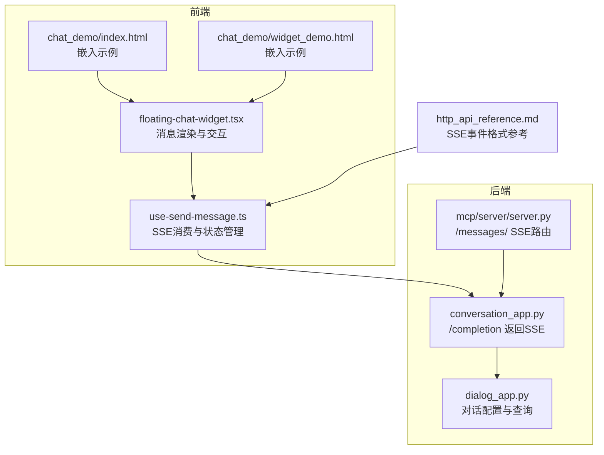
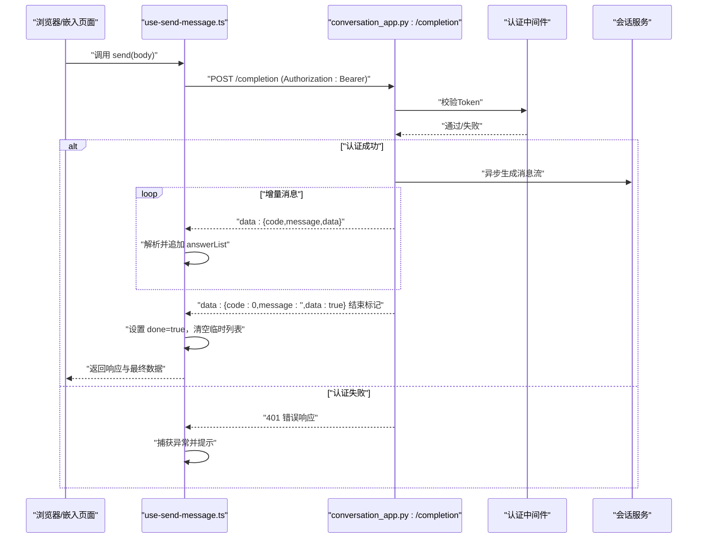
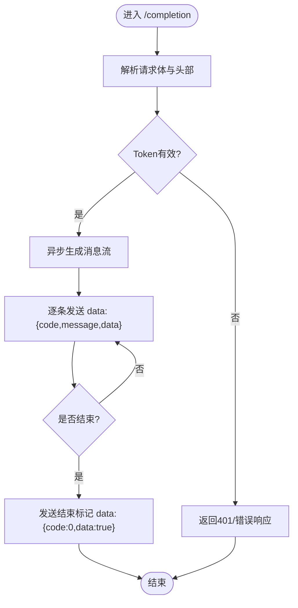
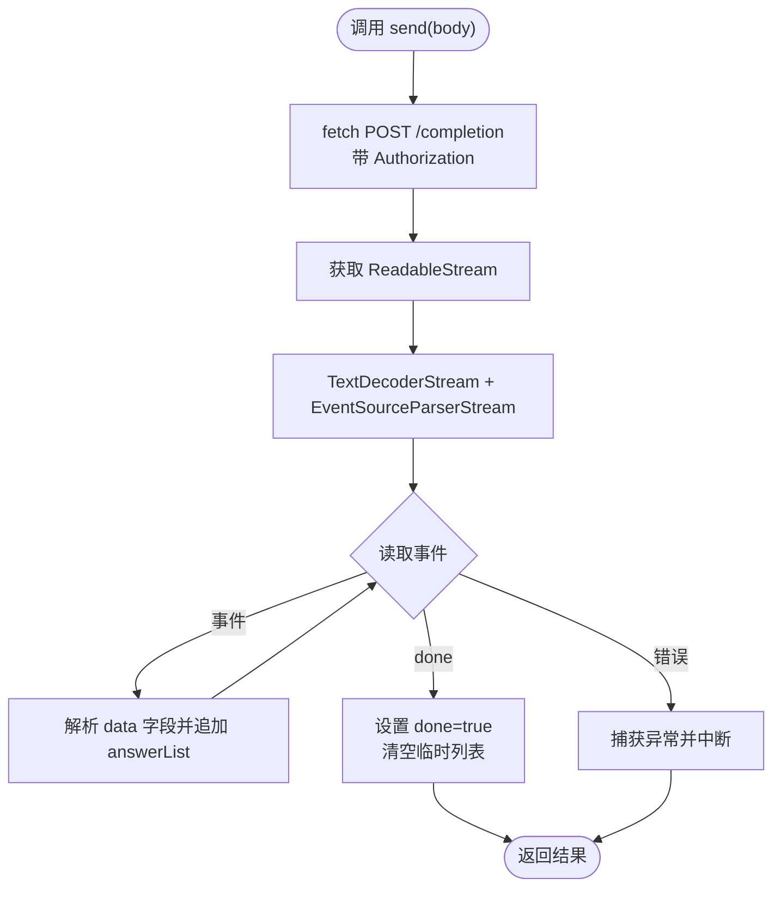
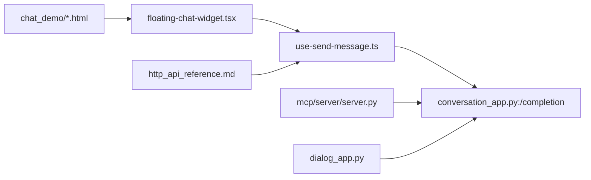

# WebSocket 实时通信

<cite>
**本文引用的文件**
- [conversation_app.py](file://api/apps/conversation_app.py)
- [use-send-message.ts](file://web/src/hooks/use-send-message.ts)
- [floating-chat-widget.tsx](file://web/src/components/floating-chat-widget.tsx)
- [index.html](file://chat_demo/index.html)
- [widget_demo.html](file://chat_demo/widget_demo.html)
- [http_api_reference.md](file://docs/references/http_api_reference.md)
- [dialog_app.py](file://api/apps/dialog_app.py)
- [server.py](file://mcp/server/server.py)
- [tts_model.py](file://rag/llm/tts_model.py)
</cite>

## 目录
1. [简介](#简介)
2. [项目结构](#项目结构)
3. [核心组件](#核心组件)
4. [架构总览](#架构总览)
5. [详细组件分析](#详细组件分析)
6. [依赖关系分析](#依赖关系分析)
7. [性能考虑](#性能考虑)
8. [故障排查指南](#故障排查指南)
9. [结论](#结论)
10. [附录](#附录)

## 简介
本文件面向WebSocket实时通信接口的使用与集成，聚焦以下目标：
- 连接建立：连接URL、握手协议与认证方式
- 消息格式：消息类型、数据结构与事件通知机制
- 客户端示例：如何建立持久连接、发送与接收消息
- 会话管理：断线重连、心跳检测与错误恢复
- 实时场景：聊天、消息推送与状态更新
- 性能优化与最佳实践：稳定性与可靠性保障

需要特别说明的是：在当前代码库中，实时通信主要通过服务端事件（Server-Sent Events，SSE）实现，而非标准WebSocket。本文将围绕SSE进行完整说明，并对可能的WebSocket扩展点给出指导。

## 项目结构
与实时通信相关的关键位置如下：
- 后端路由与SSE实现：api/apps/conversation_app.py 提供 /completion 接口，返回 text/event-stream 响应
- 前端SSE消费与状态管理：web/src/hooks/use-send-message.ts 使用 fetch + ReadableStream + EventSource 解析器消费SSE流
- 嵌入式聊天组件：web/src/components/floating-chat-widget.tsx 负责消息显示与交互
- 聊天嵌入示例：chat_demo/index.html 与 chat_demo/widget_demo.html 展示iframe嵌入与消息传递
- 文档参考：docs/references/http_api_reference.md 中包含SSE事件格式示例
- 对话配置：api/apps/dialog_app.py 提供对话创建/查询等能力
- MCP服务器（含SSE路由）：mcp/server/server.py 注册 /messages/ SSE传输
- 其他语音能力（非实时通信）：rag/llm/tts_model.py 包含基于WebSocket的TTS实现，可作为扩展参考

图表来源
- [conversation_app.py:110-250](file://api/apps/conversation_app.py#L110-L250)
- [use-send-message.ts:94-194](file://web/src/hooks/use-send-message.ts#L94-L194)
- [floating-chat-widget.tsx:106-156](file://web/src/components/floating-chat-widget.tsx#L106-L156)
- [index.html:1-19](file://chat_demo/index.html#L1-L19)
- [widget_demo.html:117-154](file://chat_demo/widget_demo.html#L117-L154)
- [http_api_reference.md:4215-4254](file://docs/references/http_api_reference.md#L4215-L4254)
- [dialog_app.py:31-145](file://api/apps/dialog_app.py#L31-L145)
- [server.py:509-539](file://mcp/server/server.py#L509-L539)

章节来源
- [conversation_app.py:110-250](file://api/apps/conversation_app.py#L110-L250)
- [use-send-message.ts:94-194](file://web/src/hooks/use-send-message.ts#L94-L194)
- [floating-chat-widget.tsx:106-156](file://web/src/components/floating-chat-widget.tsx#L106-L156)
- [index.html:1-19](file://chat_demo/index.html#L1-L19)
- [widget_demo.html:117-154](file://chat_demo/widget_demo.html#L117-L154)
- [http_api_reference.md:4215-4254](file://docs/references/http_api_reference.md#L4215-L4254)
- [dialog_app.py:31-145](file://api/apps/dialog_app.py#L31-L145)
- [server.py:509-539](file://mcp/server/server.py#L509-L539)

## 核心组件
- SSE服务端（后端）
  - /completion 接口以 text/event-stream 形式返回增量消息，支持流式输出与结束标记
  - 认证：从请求头读取 Bearer Token 并校验有效性
- SSE客户端（前端）
  - 使用 fetch 发起POST请求，结合 ReadableStream + TextDecoderStream + EventSourceParserStream 解析SSE
  - 维护 answerList 状态，处理错误码与完成信号
- 嵌入式聊天组件
  - floating-chat-widget.tsx 负责消息渲染、窗口控制与国际化
  - 支持 streaming 与非 streaming 模式切换
- 嵌入示例
  - chat_demo/index.html 与 chat_demo/widget_demo.html 展示 iframe 嵌入与主窗口消息传递

章节来源
- [conversation_app.py:168-250](file://api/apps/conversation_app.py#L168-L250)
- [use-send-message.ts:94-194](file://web/src/hooks/use-send-message.ts#L94-L194)
- [floating-chat-widget.tsx:106-156](file://web/src/components/floating-chat-widget.tsx#L106-L156)
- [index.html:1-19](file://chat_demo/index.html#L1-L19)
- [widget_demo.html:117-154](file://chat_demo/widget_demo.html#L117-L154)

## 架构总览
下图展示了从前端到后端的SSE实时通信流程，包括认证、消息流与错误处理。

图表来源
- [conversation_app.py:168-250](file://api/apps/conversation_app.py#L168-L250)
- [use-send-message.ts:94-194](file://web/src/hooks/use-send-message.ts#L94-L194)

## 详细组件分析

### 后端SSE接口（/completion）
- 功能要点
  - 接收消息数组与模型参数，异步生成回答
  - 以 text/event-stream 返回增量内容，每条消息以 data: 开头，行分隔
  - 结束时发送一条 code=0 且 data=true 的标记
  - 支持禁用流式模式，直接返回完整答案
- 认证机制
  - 从 Authorization 头解析 Bearer Token
  - 若无效或缺失，返回错误响应
- 错误处理
  - 异常时返回 code=500 的错误消息
  - 最终仍发送结束标记，保证客户端状态一致

图表来源
- [conversation_app.py:168-250](file://api/apps/conversation_app.py#L168-L250)

章节来源
- [conversation_app.py:168-250](file://api/apps/conversation_app.py#L168-L250)

### 前端SSE消费（use-send-message.ts）
- 关键行为
  - 使用 fetch 发起POST请求，携带 Authorization 与 JSON 请求体
  - 通过 ReadableStream + TextDecoderStream + EventSourceParserStream 解析SSE
  - 维护 answerList，按事件追加；遇到 code=500 显示错误提示
  - 完成后设置 done=true，并延迟清空临时列表
  - 支持 AbortController 主动中断流
- 断点续传与状态
  - answerList 用于累积增量消息
  - done 标识流结束，便于UI层控制加载态

图表来源
- [use-send-message.ts:94-194](file://web/src/hooks/use-send-message.ts#L94-L194)

章节来源
- [use-send-message.ts:94-194](file://web/src/hooks/use-send-message.ts#L94-L194)

### 嵌入式聊天组件（floating-chat-widget.tsx）
- 渲染逻辑
  - 根据 enableStreaming 决定是否实时显示增量消息
  - 非 streaming 模式仅显示完整消息
- 窗口控制
  - 通过 postMessage 与父窗口通信，支持创建/切换聊天窗口
- 国际化与就绪通知
  - 加载完成后向父窗口发送 WIDGET_READY 消息

章节来源
- [floating-chat-widget.tsx:106-156](file://web/src/components/floating-chat-widget.tsx#L106-L156)

### 嵌入示例（chat_demo）
- iframe 嵌入
  - 通过 iframe src 传入 shared_id、auth、locale 等参数
- 父窗口消息处理
  - 监听来自子窗口的消息，支持 CREATE_CHAT_WINDOW、TOGGLE_CHAT、SCROLL_PASSTHROUGH 等类型

章节来源
- [index.html:1-19](file://chat_demo/index.html#L1-L19)
- [widget_demo.html:117-154](file://chat_demo/widget_demo.html#L117-L154)

### 对话配置（dialog_app.py）
- 对话创建/更新/查询
  - 提供 /set、/get、/list、/next、/rm 等接口
  - 与知识库、LLM参数、检索策略等关联
- 与聊天SSE的关系
  - 对话配置决定后续 /completion 的上下文与参数

章节来源
- [dialog_app.py:31-145](file://api/apps/dialog_app.py#L31-L145)

### MCP服务器SSE路由（mcp/server/server.py）
- 路由注册
  - 当启用SSE时，注册 /messages/ SSE传输
  - 在中间件中统一校验 Authorization 或 api_key
- 扩展性
  - 可在此基础上扩展自定义SSE通道，实现更丰富的事件通知

章节来源
- [server.py:509-539](file://mcp/server/server.py#L509-L539)

### WebSocket扩展参考（非实时通信）
- 文件中的WebSocket仅用于TTS语音合成，不参与实时聊天
- 该实现展示了WebSocket握手、鉴权与消息回调，可作为扩展WebSocket的参考

章节来源
- [tts_model.py:220-290](file://rag/llm/tts_model.py#L220-L290)

## 依赖关系分析
- 前端依赖
  - use-send-message.ts 依赖 fetch 与 Web Streams API
  - floating-chat-widget.tsx 依赖 i18n 与 postMessage
- 后端依赖
  - conversation_app.py 依赖 Quart、Async Generator、对话与LLM服务
  - server.py 依赖中间件与SSE传输层
- 文档与示例
  - http_api_reference.md 提供SSE事件格式参考
  - chat_demo 提供嵌入式演示

图表来源
- [conversation_app.py:110-250](file://api/apps/conversation_app.py#L110-L250)
- [use-send-message.ts:94-194](file://web/src/hooks/use-send-message.ts#L94-L194)
- [floating-chat-widget.tsx:106-156](file://web/src/components/floating-chat-widget.tsx#L106-L156)
- [index.html:1-19](file://chat_demo/index.html#L1-L19)
- [widget_demo.html:117-154](file://chat_demo/widget_demo.html#L117-L154)
- [http_api_reference.md:4215-4254](file://docs/references/http_api_reference.md#L4215-L4254)
- [dialog_app.py:31-145](file://api/apps/dialog_app.py#L31-L145)
- [server.py:509-539](file://mcp/server/server.py#L509-L539)

章节来源
- [conversation_app.py:110-250](file://api/apps/conversation_app.py#L110-L250)
- [use-send-message.ts:94-194](file://web/src/hooks/use-send-message.ts#L94-L194)
- [floating-chat-widget.tsx:106-156](file://web/src/components/floating-chat-widget.tsx#L106-L156)
- [index.html:1-19](file://chat_demo/index.html#L1-L19)
- [widget_demo.html:117-154](file://chat_demo/widget_demo.html#L117-L154)
- [http_api_reference.md:4215-4254](file://docs/references/http_api_reference.md#L4215-L4254)
- [dialog_app.py:31-145](file://api/apps/dialog_app.py#L31-L145)
- [server.py:509-539](file://mcp/server/server.py#L509-L539)

## 性能考虑
- 流式传输
  - 使用 text/event-stream 降低首字节延迟，提升感知速度
  - 建议前端按事件增量渲染，避免一次性拼接大字符串
- 缓冲与背压
  - 合理设置后端生成速率，避免前端解析压力过大
  - 前端可采用节流/防抖策略，减少频繁重渲染
- 连接与超时
  - SSE默认长连接，需关注代理/网关的超时配置
  - 前端应具备自动重试与断线恢复能力
- 资源释放
  - 使用 AbortController 主动取消长时间无响应的请求
  - 流结束后及时清理定时器与临时状态

## 故障排查指南
- 常见问题
  - 401 未授权：检查 Authorization 头是否为 Bearer Token，且有效
  - 流中断：确认网络稳定与代理配置，必要时增加重试
  - 增量消息错乱：确保前端按事件顺序追加 answerList
- 定位方法
  - 查看后端日志与异常栈，定位生成阶段的异常
  - 前端捕获 DOMException 并区分 AbortError 与其它错误
- 恢复策略
  - 自动重连：在收到结束标记前若连接断开，重新发起请求
  - 心跳：如需心跳，可在应用层定期发送轻量探测请求（SSE本身不强制要求）

章节来源
- [conversation_app.py:220-250](file://api/apps/conversation_app.py#L220-L250)
- [use-send-message.ts:160-178](file://web/src/hooks/use-send-message.ts#L160-L178)

## 结论
- 本项目实时通信以SSE为核心，具备低延迟、易维护的优势
- 前后端职责清晰：后端负责流式生成，前端负责增量渲染与状态管理
- 如需扩展至WebSocket，可参考现有TTS实现中的握手与回调模式，并在后端注册对应路由与中间件

## 附录

### 连接与认证
- 连接URL
  - /completion：POST，返回 text/event-stream
- 握手协议
  - 使用 HTTP/1.1，SSE为服务端持续推送
- 认证方式
  - Authorization: Bearer <token>
  - 后端校验失败将返回错误响应

章节来源
- [conversation_app.py:168-250](file://api/apps/conversation_app.py#L168-L250)

### 消息格式规范
- 事件类型
  - message：增量消息
  - 结束标记：data: {code:0,message:'',data:true}
- 数据结构
  - code：0 表示成功，500 表示错误
  - message：错误信息
  - data：消息片段或最终布尔标记
- 示例参考
  - 见 docs/references/http_api_reference.md 中的 SSE 示例

章节来源
- [http_api_reference.md:4215-4254](file://docs/references/http_api_reference.md#L4215-L4254)

### 客户端连接示例（步骤说明）
- 建立持久连接
  - 使用 fetch POST /completion，设置 Content-Type: application/json 与 Authorization
- 发送消息
  - 将消息数组与模型参数序列化为JSON发送
- 接收消息
  - 通过 ReadableStream + EventSource 解析器逐条读取 data 字段
  - 增量渲染 answerList，监听结束标记后停止

章节来源
- [use-send-message.ts:94-194](file://web/src/hooks/use-send-message.ts#L94-L194)
- [conversation_app.py:168-250](file://api/apps/conversation_app.py#L168-L250)

### 会话管理与状态同步
- 断线重连
  - 在前端监听连接断开，根据业务策略延时重试
- 心跳检测
  - 应用层可发送轻量探测请求维持连接活跃
- 错误恢复
  - 捕获异常并提示用户，必要时回滚本地状态

章节来源
- [use-send-message.ts:160-178](file://web/src/hooks/use-send-message.ts#L160-L178)

### 实时聊天、消息推送与状态更新
- 实时聊天
  - /completion 返回增量回答，支持多轮对话
- 消息推送
  - 可通过扩展SSE通道推送系统通知或任务状态
- 状态更新
  - 前端根据 answerList 与 done 状态更新UI

章节来源
- [conversation_app.py:168-250](file://api/apps/conversation_app.py#L168-L250)
- [floating-chat-widget.tsx:145-156](file://web/src/components/floating-chat-widget.tsx#L145-L156)

### 性能优化与最佳实践
- 优化建议
  - 控制消息粒度，避免过小片段导致解析开销
  - 合理设置后端生成并发与缓冲
  - 前端增量渲染与虚拟滚动结合
- 最佳实践
  - 统一错误处理与用户提示
  - 明确结束标记语义，避免前端误判
  - 嵌入式场景注意跨域与postMessage安全

章节来源
- [use-send-message.ts:94-194](file://web/src/hooks/use-send-message.ts#L94-L194)
- [conversation_app.py:220-250](file://api/apps/conversation_app.py#L220-L250)