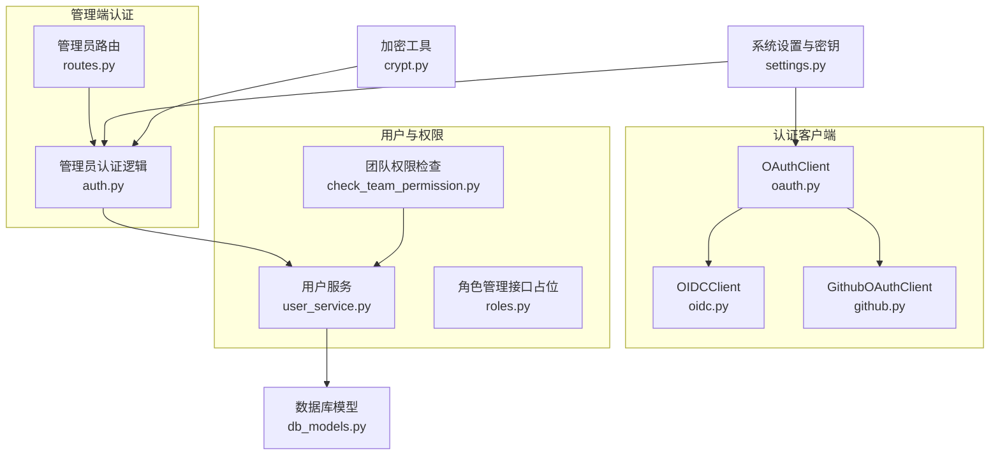
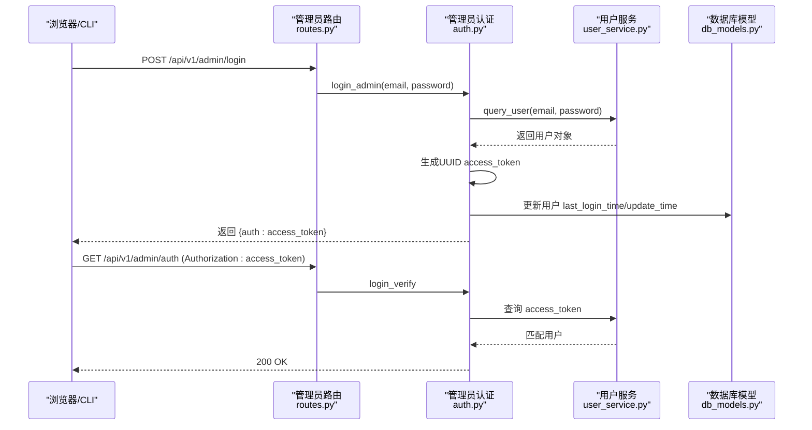
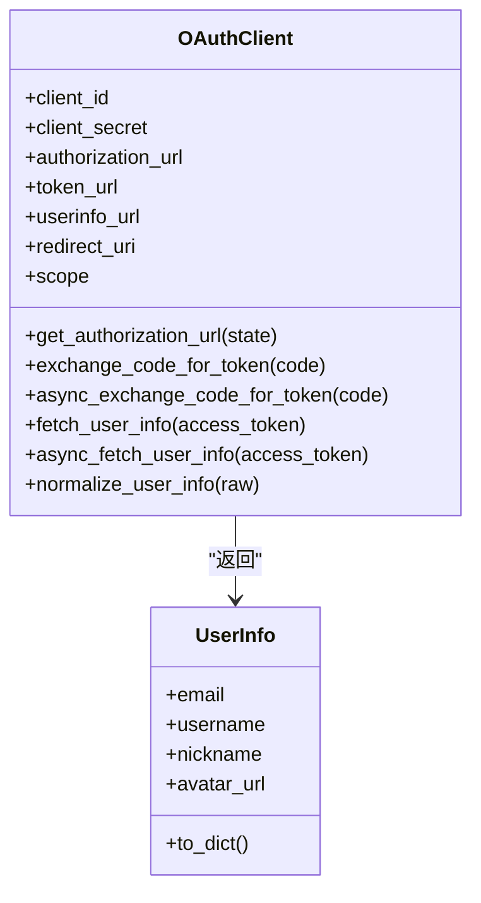
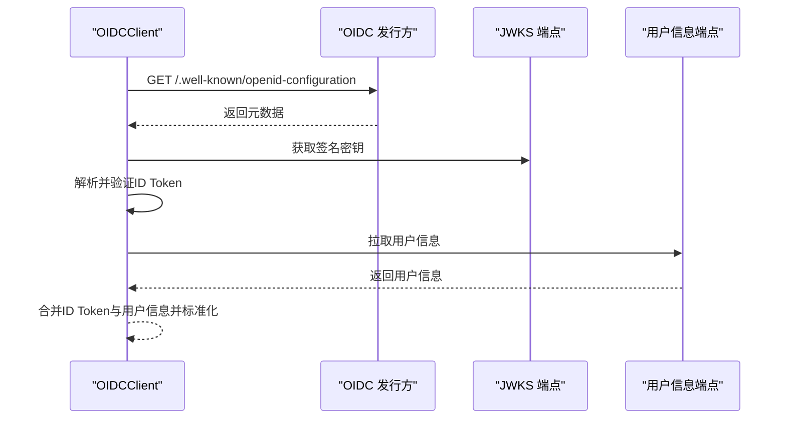
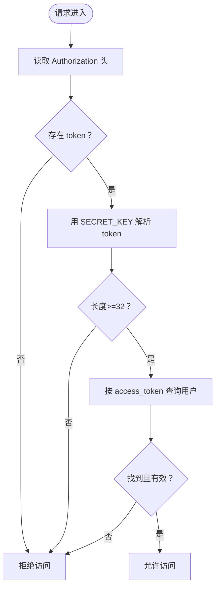
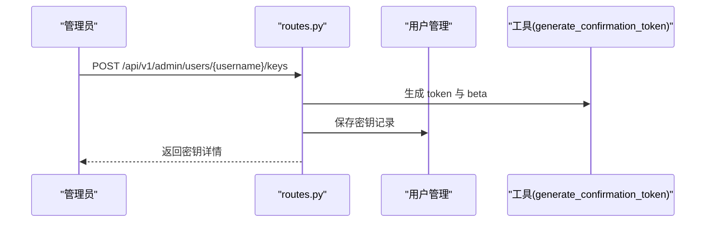
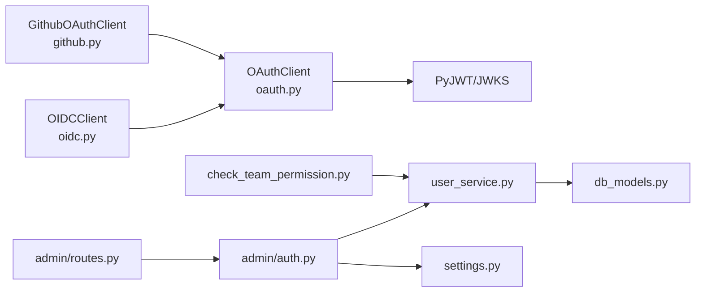

# 认证与授权

<cite>
**本文引用的文件**
- [oauth.py](file://api/apps/auth/oauth.py)
- [oidc.py](file://api/apps/auth/oidc.py)
- [github.py](file://api/apps/auth/github.py)
- [README.md（认证模块）](file://api/apps/auth/README.md)
- [auth.py（管理员认证）](file://admin/server/auth.py)
- [routes.py（管理员路由）](file://admin/server/routes.py)
- [crypt.py（密码加解密）](file://api/utils/crypt.py)
- [settings.py（系统设置）](file://common/settings.py)
- [user_service.py（用户服务）](file://api/db/services/user_service.py)
- [check_team_permission.py（团队权限检查）](file://api/common/check_team_permission.py)
- [roles.py（角色管理占位）](file://admin/server/roles.py)
- [db_models.py（数据库模型）](file://api/db/db_models.py)
</cite>

## 目录
1. [简介](#简介)
2. [项目结构](#项目结构)
3. [核心组件](#核心组件)
4. [架构总览](#架构总览)
5. [详细组件分析](#详细组件分析)
6. [依赖关系分析](#依赖关系分析)
7. [性能考量](#性能考量)
8. [故障排查指南](#故障排查指南)
9. [结论](#结论)
10. [附录：配置与示例](#附录配置与示例)

## 简介
本文件系统性梳理 RAGFlow 的认证与授权机制，覆盖以下主题：
- API 密钥的生成、存储与使用
- OAuth 2.0 与 OIDC 协议集成（含授权流程与令牌管理）
- 权限控制（角色、资源访问控制、团队共享）
- 会话管理与令牌刷新策略
- 安全加固与常见攻击防护
- 常见问题排查与最佳实践

## 项目结构
围绕认证与授权的关键代码分布在如下模块：
- 认证客户端：OAuth/OIDC/GitHub 第三方登录
- 管理端认证：基于 Flask-Login 的管理员登录与鉴权
- 用户与权限：用户服务、团队权限检查、角色管理接口占位
- 配置与密钥：系统密钥、客户端认证开关、第三方 OAuth 配置
- 加密工具：RSA 前端加密、后端解密

图表来源
- [oauth.py:32-152](file://api/apps/auth/oauth.py#L32-L152)
- [oidc.py:22-108](file://api/apps/auth/oidc.py#L22-L108)
- [github.py:21-89](file://api/apps/auth/github.py#L21-L89)
- [auth.py:38-189](file://admin/server/auth.py#L38-L189)
- [routes.py:41-557](file://admin/server/routes.py#L41-L557)
- [user_service.py:33-323](file://api/db/services/user_service.py#L33-L323)
- [check_team_permission.py:25-60](file://api/common/check_team_permission.py#L25-L60)
- [roles.py:23-77](file://admin/server/roles.py#L23-L77)
- [settings.py:136-243](file://common/settings.py#L136-L243)
- [crypt.py:25-41](file://api/utils/crypt.py#L25-L41)
- [db_models.py:134-200](file://api/db/db_models.py#L134-L200)

章节来源
- [oauth.py:32-152](file://api/apps/auth/oauth.py#L32-L152)
- [oidc.py:22-108](file://api/apps/auth/oidc.py#L22-L108)
- [github.py:21-89](file://api/apps/auth/github.py#L21-L89)
- [auth.py:38-189](file://admin/server/auth.py#L38-L189)
- [routes.py:41-557](file://admin/server/routes.py#L41-L557)
- [user_service.py:33-323](file://api/db/services/user_service.py#L33-L323)
- [check_team_permission.py:25-60](file://api/common/check_team_permission.py#L25-L60)
- [roles.py:23-77](file://admin/server/roles.py#L23-L77)
- [settings.py:136-243](file://common/settings.py#L136-L243)
- [crypt.py:25-41](file://api/utils/crypt.py#L25-L41)
- [db_models.py:134-200](file://api/db/db_models.py#L134-L200)

## 核心组件
- OAuth/OIDC/GitHub 客户端：统一抽象 OAuthClient，扩展 OIDCClient 支持 JWKS 验签，GitHub 客户端适配其用户信息与邮箱获取。
- 管理员认证：Flask-Login 负责会话与请求级加载用户；管理员登录签发 UUID 形式的 access_token 并持久化。
- 用户与权限：用户服务对 access_token 进行长度与格式校验；团队权限检查支持“仅团队成员可访问”等策略。
- 配置与密钥：系统密钥用于序列化/反序列化 access_token；客户端认证开关与第三方 OAuth 配置集中于 settings。

章节来源
- [oauth.py:32-152](file://api/apps/auth/oauth.py#L32-L152)
- [oidc.py:22-108](file://api/apps/auth/oidc.py#L22-L108)
- [github.py:21-89](file://api/apps/auth/github.py#L21-L89)
- [auth.py:38-189](file://admin/server/auth.py#L38-L189)
- [user_service.py:44-66](file://api/db/services/user_service.py#L44-L66)
- [check_team_permission.py:25-60](file://api/common/check_team_permission.py#L25-L60)
- [settings.py:136-243](file://common/settings.py#L136-L243)

## 架构总览
下图展示从浏览器到后端的典型认证路径：管理员登录签发 access_token，后续请求通过 Authorization 头携带该 token，后端用 SECRET_KEY 解析并查询用户。

图表来源
- [routes.py:41-72](file://admin/server/routes.py#L41-L72)
- [auth.py:108-134](file://admin/server/auth.py#L108-L134)
- [user_service.py:85-102](file://api/db/services/user_service.py#L85-L102)
- [db_models.py:134-200](file://api/db/db_models.py#L134-L200)

## 详细组件分析

### OAuth 2.0 客户端（OAuthClient）
- 功能要点
  - 生成授权 URL（支持 scope 与 state）
  - 交换授权码为访问令牌
  - 拉取用户信息（同步/异步）
  - 统一用户信息结构（email/username/nickname/avatar_url）

图表来源
- [oauth.py:32-152](file://api/apps/auth/oauth.py#L32-L152)

章节来源
- [oauth.py:32-152](file://api/apps/auth/oauth.py#L32-L152)
- [README.md（认证模块）:12-77](file://api/apps/auth/README.md#L12-L77)

### OIDC 客户端（OIDCClient）
- 功能要点
  - 通过 issuer 自动发现 OIDC 元数据（授权、令牌、用户信息端点与 JWKS）
  - 使用 PyJWKClient 与签名算法验证 ID Token
  - 合并 ID Token 与用户信息端点结果进行标准化

图表来源
- [oidc.py:22-108](file://api/apps/auth/oidc.py#L22-L108)

章节来源
- [oidc.py:22-108](file://api/apps/auth/oidc.py#L22-L108)

### GitHub OAuth 客户端（GithubOAuthClient）
- 功能要点
  - 固定 GitHub 授权/令牌/用户信息端点与默认 scope
  - 同步/异步拉取用户基础信息与主邮箱

章节来源
- [github.py:21-89](file://api/apps/auth/github.py#L21-L89)

### 管理员认证与会话（Flask-Login）
- 登录流程
  - 校验用户名/密码与超级管理员身份
  - 生成 UUID 形式 access_token 并更新登录时间
  - 将用户对象注入当前会话
- 请求加载
  - 从 Authorization 头解析 access_token
  - 校验长度与格式（UUID 规范），查询有效用户
  - 注入 g.user 或 current_user 供后续路由使用
- 退出登录
  - 将 access_token 标记为无效前缀并保存，同时登出

图表来源
- [auth.py:38-71](file://admin/server/auth.py#L38-L71)
- [auth.py:108-134](file://admin/server/auth.py#L108-L134)

章节来源
- [auth.py:38-189](file://admin/server/auth.py#L38-L189)
- [routes.py:41-72](file://admin/server/routes.py#L41-L72)

### API 密钥管理（管理员端）
- 管理员可为任意用户生成 API 密钥，返回结构包含 token、beta、tenant_id、创建时间等字段
- 支持列出与删除用户 API 密钥
- 密钥生成采用随机令牌与独立 beta 字段，便于区分用途

图表来源
- [routes.py:487-517](file://admin/server/routes.py#L487-L517)

章节来源
- [routes.py:487-546](file://admin/server/routes.py#L487-L546)

### 用户服务与令牌校验
- 对 access_token 进行三道校验：空值/过短/已失效（以特定前缀标记）
- 登录成功后写入 last_login_time、update_time 等字段

章节来源
- [user_service.py:44-66](file://api/db/services/user_service.py#L44-L66)
- [user_service.py:112-127](file://api/db/services/user_service.py#L112-L127)

### 团队权限检查
- 支持知识库与文件的“仅团队成员可访问”策略
- 当资源权限为团队时，需判断用户是否加入过相同租户

章节来源
- [check_team_permission.py:25-60](file://api/common/check_team_permission.py#L25-L60)

### 角色管理接口占位
- 当前角色 CRUD 与授权接口为占位实现，抛出异常提示未实现

章节来源
- [roles.py:23-77](file://admin/server/roles.py#L23-L77)

### 配置与密钥
- SECRET_KEY：用于序列化/反序列化 access_token，要求长度≥32
- CLIENT_AUTHENTICATION：客户端认证开关
- HTTP_APP_KEY：HTTP 应用密钥
- GITHUB_OAUTH/FEISHU_OAUTH/OAUTH_CONFIG：第三方 OAuth 配置入口

章节来源
- [settings.py:136-243](file://common/settings.py#L136-L243)

### 加密工具
- 提供前端加密与后端解密能力，用于保护敏感传输（如密码）

章节来源
- [crypt.py:25-41](file://api/utils/crypt.py#L25-L41)

## 依赖关系分析
- 认证客户端依赖通用 HTTP 客户端与 JWT 解析库
- 管理端认证依赖用户服务与系统设置中的 SECRET_KEY
- 用户服务依赖数据库模型与常量枚举
- 团队权限检查依赖用户、文件、知识库服务

图表来源
- [oauth.py:17-18](file://api/apps/auth/oauth.py#L17-L18)
- [oidc.py:17-19](file://api/apps/auth/oidc.py#L17-L19)
- [github.py:17-18](file://api/apps/auth/github.py#L17-L18)
- [auth.py:23-35](file://admin/server/auth.py#L23-L35)
- [routes.py:25-28](file://admin/server/routes.py#L25-L28)
- [user_service.py:23-30](file://api/db/services/user_service.py#L23-L30)
- [check_team_permission.py:18-22](file://api/common/check_team_permission.py#L18-L22)
- [settings.py:136-243](file://common/settings.py#L136-L243)

章节来源
- [oauth.py:17-18](file://api/apps/auth/oauth.py#L17-L18)
- [oidc.py:17-19](file://api/apps/auth/oidc.py#L17-L19)
- [github.py:17-18](file://api/apps/auth/github.py#L17-L18)
- [auth.py:23-35](file://admin/server/auth.py#L23-L35)
- [routes.py:25-28](file://admin/server/routes.py#L25-L28)
- [user_service.py:23-30](file://api/db/services/user_service.py#L23-L30)
- [check_team_permission.py:18-22](file://api/common/check_team_permission.py#L18-L22)
- [settings.py:136-243](file://common/settings.py#L136-L243)

## 性能考量
- 异步 HTTP 请求：OAuth 客户端提供异步变体，适合高并发场景
- 数据库查询：用户查询对 access_token 做三重过滤，避免无效查询放大
- 令牌长度校验：在请求入口快速失败，减少后续链路开销

章节来源
- [oauth.py:89-111](file://api/apps/auth/oauth.py#L89-L111)
- [user_service.py:44-66](file://api/db/services/user_service.py#L44-L66)

## 故障排查指南
- 管理员登录失败
  - 检查用户名/密码是否匹配，确认用户为超级管理员且状态有效
  - 查看日志中关于 access_token 生成与更新的时间戳字段
- 请求被拒绝
  - 确认 Authorization 头是否正确传递
  - 校验 access_token 长度与格式（UUID 规范）
  - 若已登出，access_token 可能已被标记为无效前缀
- OIDC 验证失败
  - 检查 issuer 是否可达，JWKS 端点是否可获取
  - 确认 audience 与 client_id 一致
- 团队资源不可见
  - 确认资源权限为团队模式
  - 检查当前用户是否属于同一租户

章节来源
- [auth.py:108-134](file://admin/server/auth.py#L108-L134)
- [auth.py:38-71](file://admin/server/auth.py#L38-L71)
- [oidc.py:60-86](file://api/apps/auth/oidc.py#L60-L86)
- [check_team_permission.py:25-60](file://api/common/check_team_permission.py#L25-L60)

## 结论
RAGFlow 在认证与授权方面提供了清晰的分层设计：第三方 OAuth/OIDC 客户端负责外部身份打通，管理员认证基于 Flask-Login 与 UUID 令牌，用户服务与团队权限检查保障资源访问控制。建议在生产环境启用强口令、定期轮换 SECRET_KEY、限制 access_token 生命周期，并结合审计日志完善安全监控。

## 附录：配置与示例

### OAuth 2.0 与 OIDC 配置示例
- OAuth 2.0
  - 配置项：client_id、client_secret、authorization_url、token_url、userinfo_url、redirect_uri、scope（可选）
  - 获取授权 URL、交换授权码、拉取用户信息
- OIDC
  - 配置项：issuer、client_id、client_secret、redirect_uri
  - 自动发现元数据并验证 ID Token
- GitHub
  - 固定端点与默认 scope，自动合并邮箱为主邮箱

章节来源
- [README.md（认证模块）:12-77](file://api/apps/auth/README.md#L12-L77)
- [oauth.py:32-152](file://api/apps/auth/oauth.py#L32-L152)
- [oidc.py:22-108](file://api/apps/auth/oidc.py#L22-L108)
- [github.py:21-89](file://api/apps/auth/github.py#L21-L89)

### 管理员认证与 API 密钥
- 管理员登录
  - POST /api/v1/admin/login，返回 {auth: access_token}
  - 后续请求在 Authorization 头中携带 access_token
- API 密钥
  - 管理员为用户生成密钥：POST /api/v1/admin/users/{username}/keys
  - 列出与删除：GET/DELETE /api/v1/admin/users/{username}/keys

章节来源
- [routes.py:41-72](file://admin/server/routes.py#L41-L72)
- [routes.py:487-546](file://admin/server/routes.py#L487-L546)
- [auth.py:108-134](file://admin/server/auth.py#L108-L134)

### 会话管理与令牌刷新
- 当前实现采用基于 UUID 的 access_token，登出时将其标记为无效前缀
- 建议在网关或中间件层引入 refresh_token 与短期 access_token 策略，配合黑名单与 TTL 控制

章节来源
- [routes.py:53-62](file://admin/server/routes.py#L53-L62)
- [user_service.py:44-66](file://api/db/services/user_service.py#L44-L66)

### 安全加固与最佳实践
- 强制 SECRET_KEY 长度≥32，避免自动生成警告
- 严格校验 access_token 长度与格式，拒绝空值与短 token
- 对第三方 OIDC ID Token 进行签名验证与 aud/iss 校验
- 限制 API 密钥生命周期，定期轮换
- 开启 HTTPS 与安全头，防止中间人攻击与 XSS

章节来源
- [settings.py:136-151](file://common/settings.py#L136-L151)
- [auth.py:38-71](file://admin/server/auth.py#L38-L71)
- [oidc.py:60-86](file://api/apps/auth/oidc.py#L60-L86)