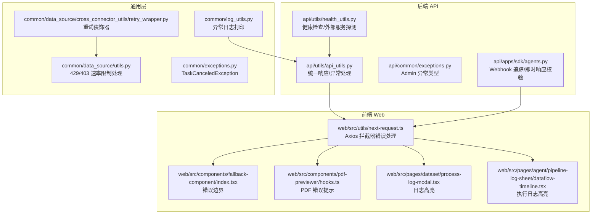
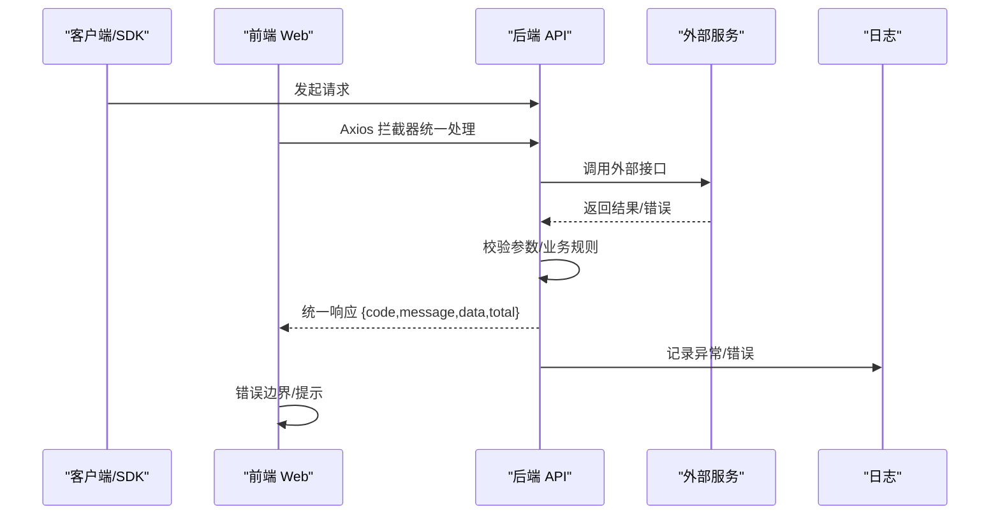
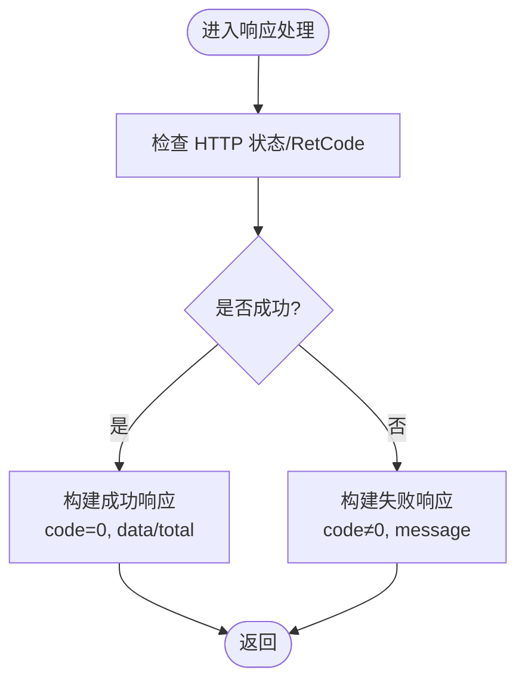
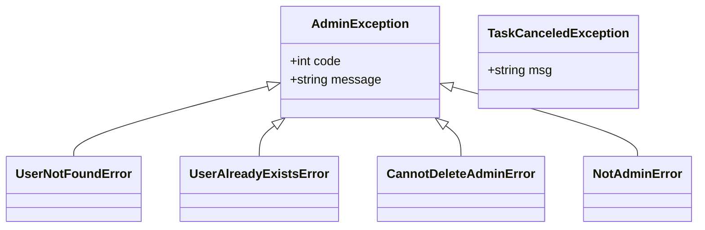
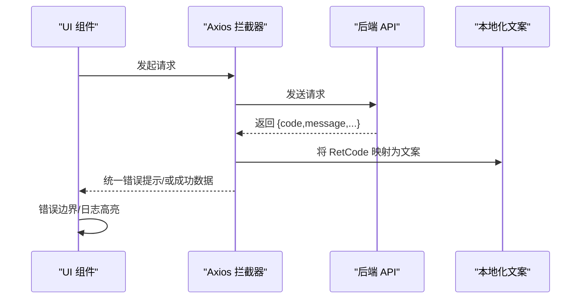
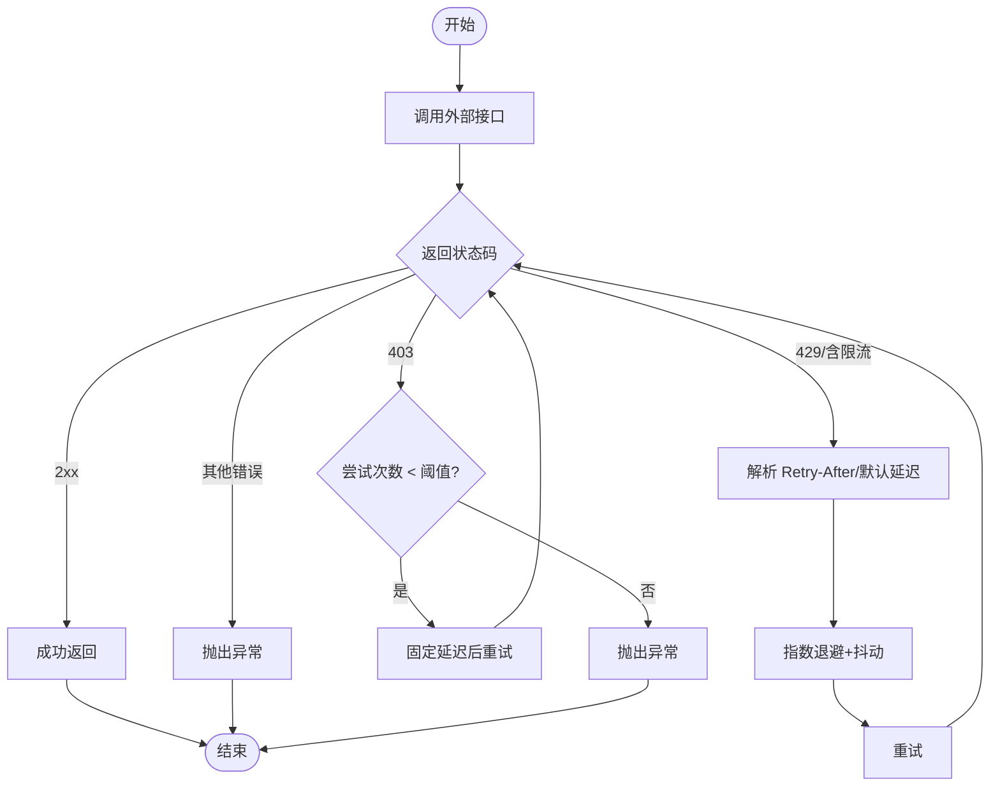
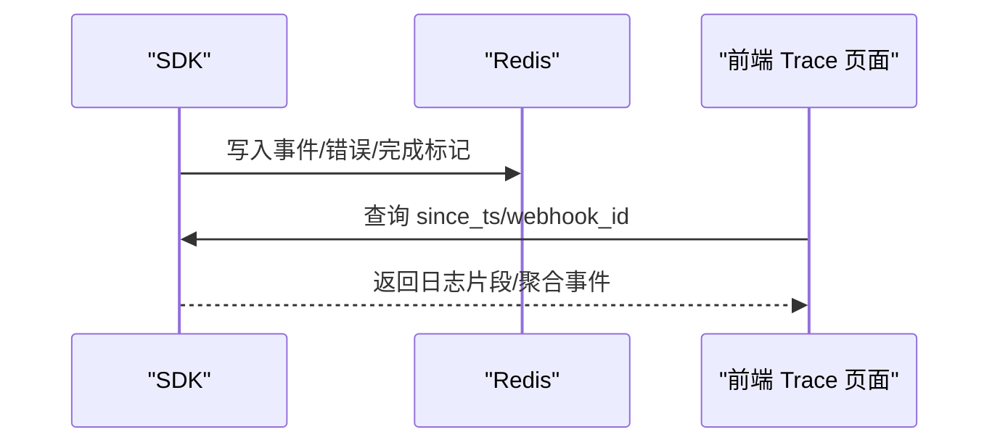
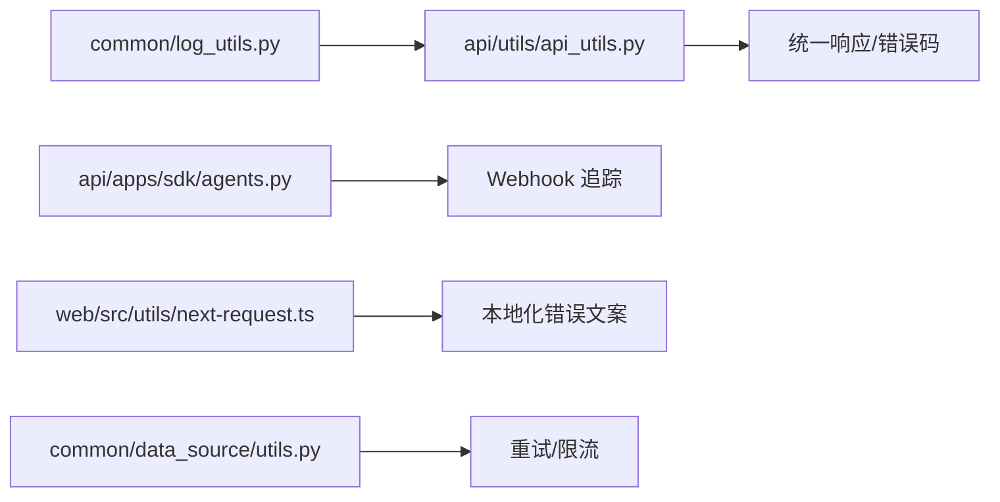

# 错误码与异常处理

<cite>
**本文引用的文件**
- [api/common/exceptions.py](file://api/common/exceptions.py)
- [admin/server/exceptions.py](file://admin/server/exceptions.py)
- [common/exceptions.py](file://common/exceptions.py)
- [api/utils/api_utils.py](file://api/utils/api_utils.py)
- [api/apps/sdk/agents.py](file://api/apps/sdk/agents.py)
- [common/log_utils.py](file://common/log_utils.py)
- [common/data_source/cross_connector_utils/retry_wrapper.py](file://common/data_source/cross_connector_utils/retry_wrapper.py)
- [common/data_source/utils.py](file://common/data_source/utils.py)
- [web/src/utils/next-request.ts](file://web/src/utils/next-request.ts)
- [web/src/components/fallback-component/index.tsx](file://web/src/components/fallback-component/index.tsx)
- [web/src/components/pdf-previewer/hooks.ts](file://web/src/components/pdf-previewer/hooks.ts)
- [web/src/pages/dataset/process-log-modal.tsx](file://web/src/pages/dataset/process-log-modal.tsx)
- [web/src/pages/agent/pipeline-log-sheet/dataflow-timeline.tsx](file://web/src/pages/agent/pipeline-log-sheet/dataflow-timeline.tsx)
- [web/src/interfaces/request/agent.ts](file://web/src/interfaces/request/agent.ts)
- [web/src/locales/en.ts](file://web/src/locales/en.ts)
- [api/utils/health_utils.py](file://api/utils/health_utils.py)
</cite>

## 目录
1. [简介](#简介)
2. [项目结构](#项目结构)
3. [核心组件](#核心组件)
4. [架构总览](#架构总览)
5. [详细组件分析](#详细组件分析)
6. [依赖分析](#依赖分析)
7. [性能考量](#性能考量)
8. [故障排查指南](#故障排查指南)
9. [结论](#结论)
10. [附录](#附录)

## 简介
本文件系统性梳理 RAGFlow 在后端 API、SDK、前端 Web 以及通用数据源层的错误处理与异常管理实践，覆盖错误码与业务逻辑错误的定义、统一响应结构、错误信息解析、常见错误场景与解决方案、重试与降级策略、监控与告警建议、客户端异常处理示例路径、错误日志格式与分析方法，以及调试工具与容错设计指导。

## 项目结构
围绕错误处理的关键位置如下：
- 后端 API 层：统一响应结构、错误码映射、异常捕获与返回、健康检查与外部服务探测
- SDK 层：Webhook 执行与追踪、即时响应校验与回退
- 前端 Web 层：Axios 拦截器错误处理、错误边界组件、PDF 预览错误提示、日志面板高亮
- 通用层：异常日志打印、指数退避重试包装器、速率限制与 429/403 处理

图表来源
- [api/utils/api_utils.py:304-349](file://api/utils/api_utils.py#L304-L349)
- [api/common/exceptions.py:18-44](file://api/common/exceptions.py#L18-L44)
- [api/apps/sdk/agents.py:649-848](file://api/apps/sdk/agents.py#L649-L848)
- [api/utils/health_utils.py:75-124](file://api/utils/health_utils.py#L75-L124)
- [common/log_utils.py:75-86](file://common/log_utils.py#L75-L86)
- [common/data_source/cross_connector_utils/retry_wrapper.py:16-49](file://common/data_source/cross_connector_utils/retry_wrapper.py#L16-L49)
- [common/data_source/utils.py:113-149](file://common/data_source/utils.py#L113-L149)
- [web/src/utils/next-request.ts:52-100](file://web/src/utils/next-request.ts#L52-L100)
- [web/src/components/fallback-component/index.tsx:1-65](file://web/src/components/fallback-component/index.tsx#L1-L65)
- [web/src/components/pdf-previewer/hooks.ts:1-18](file://web/src/components/pdf-previewer/hooks.ts#L1-L18)
- [web/src/pages/dataset/process-log-modal.tsx:65-82](file://web/src/pages/dataset/process-log-modal.tsx#L65-L82)
- [web/src/pages/agent/pipeline-log-sheet/dataflow-timeline.tsx:76-104](file://web/src/pages/agent/pipeline-log-sheet/dataflow-timeline.tsx#L76-L104)

章节来源
- [api/utils/api_utils.py:304-349](file://api/utils/api_utils.py#L304-L349)
- [api/common/exceptions.py:18-44](file://api/common/exceptions.py#L18-L44)
- [api/apps/sdk/agents.py:649-848](file://api/apps/sdk/agents.py#L649-L848)
- [api/utils/health_utils.py:75-124](file://api/utils/health_utils.py#L75-L124)
- [common/log_utils.py:75-86](file://common/log_utils.py#L75-L86)
- [common/data_source/cross_connector_utils/retry_wrapper.py:16-49](file://common/data_source/cross_connector_utils/retry_wrapper.py#L16-L49)
- [common/data_source/utils.py:113-149](file://common/data_source/utils.py#L113-L149)
- [web/src/utils/next-request.ts:52-100](file://web/src/utils/next-request.ts#L52-L100)
- [web/src/components/fallback-component/index.tsx:1-65](file://web/src/components/fallback-component/index.tsx#L1-L65)
- [web/src/components/pdf-previewer/hooks.ts:1-18](file://web/src/components/pdf-previewer/hooks.ts#L1-L18)
- [web/src/pages/dataset/process-log-modal.tsx:65-82](file://web/src/pages/dataset/process-log-modal.tsx#L65-L82)
- [web/src/pages/agent/pipeline-log-sheet/dataflow-timeline.tsx:76-104](file://web/src/pages/agent/pipeline-log-sheet/dataflow-timeline.tsx#L76-L104)

## 核心组件
- 统一响应与错误码
  - 后端统一响应结构包含 code、message、data、total 等字段；错误时仅返回 code 与 message，成功时返回 data（可选 total）。
  - 错误码由 RetCode 定义，后端通过 get_result/get_error_* 系列函数生成标准响应。
- 异常类型
  - Admin 异常类型用于管理员相关操作的错误封装，便于区分业务域。
  - 通用异常类型如任务取消异常等，用于特定流程中断场景。
- 前端错误处理
  - Axios 拦截器对网络异常与 HTTP 状态进行统一提示，并将 RetCode 映射为用户可读文案。
  - 错误边界组件在前端渲染异常时提供“刷新/重试”入口。
  - PDF 预览与日志页面对错误进行高亮与提示，辅助定位问题。

章节来源
- [api/utils/api_utils.py:304-349](file://api/utils/api_utils.py#L304-L349)
- [api/common/exceptions.py:18-44](file://api/common/exceptions.py#L18-L44)
- [common/exceptions.py:16-19](file://common/exceptions.py#L16-L19)
- [web/src/utils/next-request.ts:52-100](file://web/src/utils/next-request.ts#L52-L100)
- [web/src/components/fallback-component/index.tsx:1-65](file://web/src/components/fallback-component/index.tsx#L1-L65)

## 架构总览
后端请求从 Web/SDK 到 API 层，统一经由响应构造与异常处理模块输出；前端通过 Axios 拦截器统一消费错误；外部服务调用采用指数退避重试与速率限制处理；日志与健康检查贯穿全链路。

图表来源
- [api/utils/api_utils.py:304-349](file://api/utils/api_utils.py#L304-L349)
- [web/src/utils/next-request.ts:52-100](file://web/src/utils/next-request.ts#L52-L100)
- [common/log_utils.py:75-86](file://common/log_utils.py#L75-L86)

## 详细组件分析

### 统一响应与错误码
- 响应结构
  - 成功：code=0，data 可选，total 可选
  - 失败：code 非 0，message 必填
- 常见错误码映射（HTTP 与业务）
  - 200/201/202/204：成功/异步队列
  - 400/401/403/404/406/410/413/422/500/502/503/504：网络/鉴权/资源/上传/服务器/网关/超时等
  - 业务错误码：由 RetCode 定义，后端通过 get_result/get_error_* 返回
- 错误信息解析
  - 前端根据 response.status 或 RetCode 映射到本地化文案，结合 message 提示用户

图表来源
- [api/utils/api_utils.py:304-349](file://api/utils/api_utils.py#L304-L349)
- [web/src/locales/en.ts:1286-1310](file://web/src/locales/en.ts#L1286-L1310)

章节来源
- [api/utils/api_utils.py:304-349](file://api/utils/api_utils.py#L304-L349)
- [web/src/locales/en.ts:1286-1310](file://web/src/locales/en.ts#L1286-L1310)

### 异常类型与业务错误
- Admin 异常
  - 用户不存在/已存在/非管理员/禁止删除管理员等，便于前端/调用方快速识别业务语义
- 通用异常
  - 任务取消异常等，用于流程中断场景
- SDK/Webhook
  - 即时响应模式下对状态码范围与内容类型进行校验，非法配置直接返回错误
  - 异步模式下捕获异常并记录事件，保证可观测性

图表来源
- [api/common/exceptions.py:18-44](file://api/common/exceptions.py#L18-L44)
- [admin/server/exceptions.py:1-17](file://admin/server/exceptions.py#L1-L17)
- [common/exceptions.py:16-19](file://common/exceptions.py#L16-L19)

章节来源
- [api/common/exceptions.py:18-44](file://api/common/exceptions.py#L18-L44)
- [admin/server/exceptions.py:1-17](file://admin/server/exceptions.py#L1-L17)
- [common/exceptions.py:16-19](file://common/exceptions.py#L16-L19)
- [api/apps/sdk/agents.py:668-748](file://api/apps/sdk/agents.py#L668-L748)

### 前端错误处理与用户体验
- Axios 拦截器
  - 对网络异常与 HTTP 状态进行统一提示，将 RetCode 映射为本地化文案
- 错误边界
  - 渲染异常时提供“刷新/重试”按钮，提升可用性
- PDF 预览与日志
  - 当后端返回非 0 code 时，前端显示 message
  - 日志面板高亮 ERROR 行，便于快速定位

图表来源
- [web/src/utils/next-request.ts:52-100](file://web/src/utils/next-request.ts#L52-L100)
- [web/src/components/fallback-component/index.tsx:1-65](file://web/src/components/fallback-component/index.tsx#L1-L65)
- [web/src/components/pdf-previewer/hooks.ts:1-18](file://web/src/components/pdf-previewer/hooks.ts#L1-L18)
- [web/src/pages/dataset/process-log-modal.tsx:65-82](file://web/src/pages/dataset/process-log-modal.tsx#L65-L82)
- [web/src/pages/agent/pipeline-log-sheet/dataflow-timeline.tsx:76-104](file://web/src/pages/agent/pipeline-log-sheet/dataflow-timeline.tsx#L76-L104)

章节来源
- [web/src/utils/next-request.ts:52-100](file://web/src/utils/next-request.ts#L52-L100)
- [web/src/components/fallback-component/index.tsx:1-65](file://web/src/components/fallback-component/index.tsx#L1-L65)
- [web/src/components/pdf-previewer/hooks.ts:1-18](file://web/src/components/pdf-previewer/hooks.ts#L1-L18)
- [web/src/pages/dataset/process-log-modal.tsx:65-82](file://web/src/pages/dataset/process-log-modal.tsx#L65-L82)
- [web/src/pages/agent/pipeline-log-sheet/dataflow-timeline.tsx:76-104](file://web/src/pages/agent/pipeline-log-sheet/dataflow-timeline.tsx#L76-L104)

### 重试机制与降级策略
- 指数退避重试
  - 通用重试装饰器支持自定义最大重试次数、初始延迟、最大延迟、退避因子与抖动
- 速率限制与 429/403 处理
  - 自动解析 Retry-After 并进行上下限钳制
  - 403 场景按固定延迟重试，超过阈值抛出异常
- 降级建议
  - 对于外部不可用的服务，前端可提示“稍后重试”，后端可返回缓存/兜底数据或异步队列

图表来源
- [common/data_source/cross_connector_utils/retry_wrapper.py:16-49](file://common/data_source/cross_connector_utils/retry_wrapper.py#L16-L49)
- [common/data_source/utils.py:113-149](file://common/data_source/utils.py#L113-L149)

章节来源
- [common/data_source/cross_connector_utils/retry_wrapper.py:16-49](file://common/data_source/cross_connector_utils/retry_wrapper.py#L16-L49)
- [common/data_source/utils.py:113-149](file://common/data_source/utils.py#L113-L149)

### 监控与可观测性
- Webhook 追踪
  - SDK 支持在异步执行过程中记录事件、错误与完成状态，便于调试与审计
- 健康检查
  - 后端提供多组件健康探测接口，异常时返回 timeout 与错误信息
- 日志
  - 通用日志工具支持异常打印与文本提取，便于定位问题

图表来源
- [api/apps/sdk/agents.py:649-848](file://api/apps/sdk/agents.py#L649-L848)
- [web/src/interfaces/request/agent.ts:6-9](file://web/src/interfaces/request/agent.ts#L6-L9)
- [api/utils/health_utils.py:75-124](file://api/utils/health_utils.py#L75-L124)
- [common/log_utils.py:75-86](file://common/log_utils.py#L75-L86)

章节来源
- [api/apps/sdk/agents.py:649-848](file://api/apps/sdk/agents.py#L649-L848)
- [web/src/interfaces/request/agent.ts:6-9](file://web/src/interfaces/request/agent.ts#L6-L9)
- [api/utils/health_utils.py:75-124](file://api/utils/health_utils.py#L75-L124)
- [common/log_utils.py:75-86](file://common/log_utils.py#L75-L86)

## 依赖分析
- 后端 API 依赖统一响应与异常处理模块，确保错误码与消息一致
- SDK 依赖 Redis 存储 Webhook 追踪，前端通过查询接口消费
- 前端依赖 Axios 拦截器与本地化文案，实现统一错误提示
- 数据源层依赖重试与速率限制处理，保障对外部服务的稳定性

图表来源
- [api/utils/api_utils.py:304-349](file://api/utils/api_utils.py#L304-L349)
- [api/apps/sdk/agents.py:649-848](file://api/apps/sdk/agents.py#L649-L848)
- [web/src/utils/next-request.ts:52-100](file://web/src/utils/next-request.ts#L52-L100)
- [common/data_source/utils.py:113-149](file://common/data_source/utils.py#L113-L149)
- [common/log_utils.py:75-86](file://common/log_utils.py#L75-L86)

章节来源
- [api/utils/api_utils.py:304-349](file://api/utils/api_utils.py#L304-L349)
- [api/apps/sdk/agents.py:649-848](file://api/apps/sdk/agents.py#L649-L848)
- [web/src/utils/next-request.ts:52-100](file://web/src/utils/next-request.ts#L52-L100)
- [common/data_source/utils.py:113-149](file://common/data_source/utils.py#L113-L149)
- [common/log_utils.py:75-86](file://common/log_utils.py#L75-L86)

## 性能考量
- 合理设置重试上限与退避参数，避免雪崩效应
- 对热点接口启用缓存与异步队列，降低瞬时峰值压力
- 前端对错误提示进行节流，避免频繁弹窗影响体验
- 健康检查频率与超时时间需平衡探测及时性与系统负载

## 故障排查指南
- 常见错误场景与解决
  - 413/504：上传过大或网关超时，建议分片上传/调整超时/优化网络
  - 401：未授权，检查鉴权头与令牌有效期
  - 403：权限不足，确认角色与资源授权
  - 404：资源不存在，核对 ID/路径
  - 500/502/503/504：服务器异常/网关/过载/超时，查看后端日志与健康检查
- 客户端处理示例（参考路径）
  - Axios 拦截器错误处理：[web/src/utils/next-request.ts:52-100](file://web/src/utils/next-request.ts#L52-L100)
  - 错误边界组件：[web/src/components/fallback-component/index.tsx:1-65](file://web/src/components/fallback-component/index.tsx#L1-L65)
  - PDF 预览错误提示：[web/src/components/pdf-previewer/hooks.ts:1-18](file://web/src/components/pdf-previewer/hooks.ts#L1-L18)
  - 日志高亮与 ERROR 标识：[web/src/pages/dataset/process-log-modal.tsx:65-82](file://web/src/pages/dataset/process-log-modal.tsx#L65-L82)、[web/src/pages/agent/pipeline-log-sheet/dataflow-timeline.tsx:76-104](file://web/src/pages/agent/pipeline-log-sheet/dataflow-timeline.tsx#L76-L104)
- 重试与降级
  - 使用指数退避重试装饰器：[common/data_source/cross_connector_utils/retry_wrapper.py:16-49](file://common/data_source/cross_connector_utils/retry_wrapper.py#L16-L49)
  - 速率限制处理：[common/data_source/utils.py:113-149](file://common/data_source/utils.py#L113-L149)
- 监控与日志
  - Webhook 追踪查询接口：[web/src/interfaces/request/agent.ts:6-9](file://web/src/interfaces/request/agent.ts#L6-L9)
  - 健康检查接口：[api/utils/health_utils.py:75-124](file://api/utils/health_utils.py#L75-L124)
  - 异常日志打印：[common/log_utils.py:75-86](file://common/log_utils.py#L75-L86)

章节来源
- [web/src/utils/next-request.ts:52-100](file://web/src/utils/next-request.ts#L52-L100)
- [web/src/components/fallback-component/index.tsx:1-65](file://web/src/components/fallback-component/index.tsx#L1-L65)
- [web/src/components/pdf-previewer/hooks.ts:1-18](file://web/src/components/pdf-previewer/hooks.ts#L1-L18)
- [web/src/pages/dataset/process-log-modal.tsx:65-82](file://web/src/pages/dataset/process-log-modal.tsx#L65-L82)
- [web/src/pages/agent/pipeline-log-sheet/dataflow-timeline.tsx:76-104](file://web/src/pages/agent/pipeline-log-sheet/dataflow-timeline.tsx#L76-L104)
- [common/data_source/cross_connector_utils/retry_wrapper.py:16-49](file://common/data_source/cross_connector_utils/retry_wrapper.py#L16-L49)
- [common/data_source/utils.py:113-149](file://common/data_source/utils.py#L113-L149)
- [web/src/interfaces/request/agent.ts:6-9](file://web/src/interfaces/request/agent.ts#L6-L9)
- [api/utils/health_utils.py:75-124](file://api/utils/health_utils.py#L75-L124)
- [common/log_utils.py:75-86](file://common/log_utils.py#L75-L86)

## 结论
通过统一的响应结构、明确的错误码与异常类型、完善的前端错误处理与可观测性手段，RAGFlow 在多层实现了稳健的错误处理与异常管理。配合指数退避重试与健康检查，系统具备良好的容错与可维护性。建议在生产中持续完善日志规范与告警策略，以进一步提升故障定位效率。

## 附录
- 错误码与 HTTP 状态对照（摘自本地化文案）
  - 200：服务器成功返回请求数据
  - 201：创建或修改数据成功
  - 202：请求已在后台排队（异步任务）
  - 204：数据删除成功
  - 400：请求有误，服务器未创建或修改数据
  - 401：请重新登录
  - 403：用户已授权但访问被禁止
  - 404：请求的记录不存在，服务器未执行该操作
  - 406：请求的格式不可用
  - 410：请求的资源已被永久删除且不会再提供
  - 413：一次性上传的文件总大小过大
  - 422：创建对象时发生验证错误
  - 500：服务器错误，请检查服务器
  - 502：网关错误
  - 503：服务不可用，服务器暂时过载或维护
  - 504：网关超时
- 建议的客户端错误处理步骤
  - 捕获网络异常与 HTTP 状态
  - 解析后端统一响应中的 code/message
  - 根据 RetCode 显示本地化提示
  - 对 401/403/404 等进行定向引导
  - 对 413/504 等进行重试或降级提示

章节来源
- [web/src/locales/en.ts:1286-1310](file://web/src/locales/en.ts#L1286-L1310)