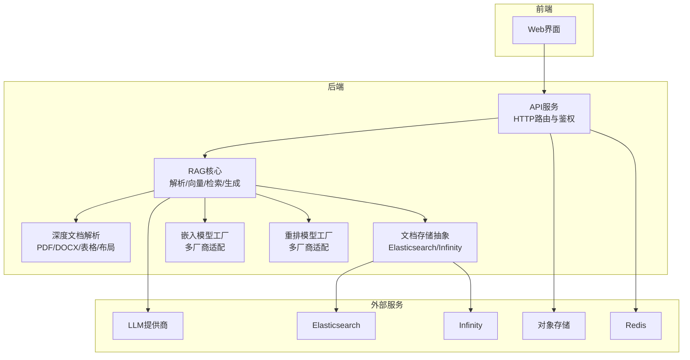
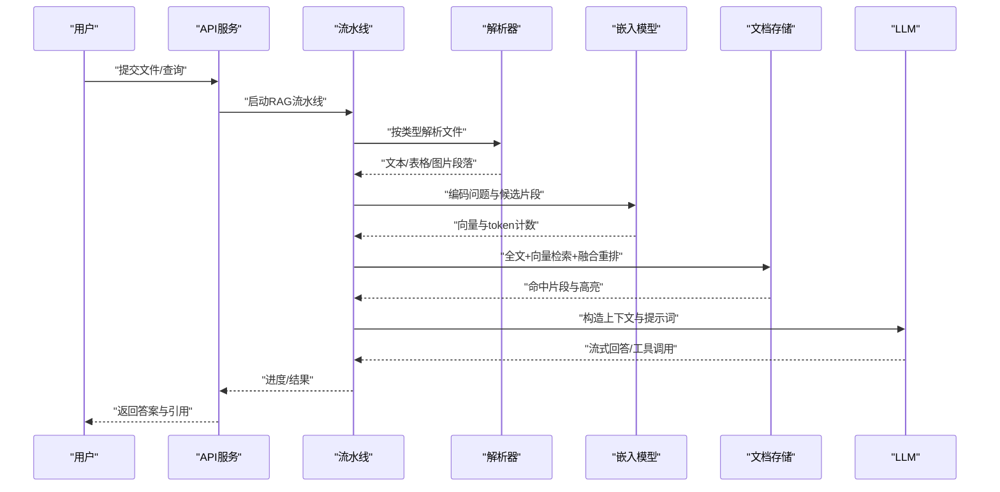
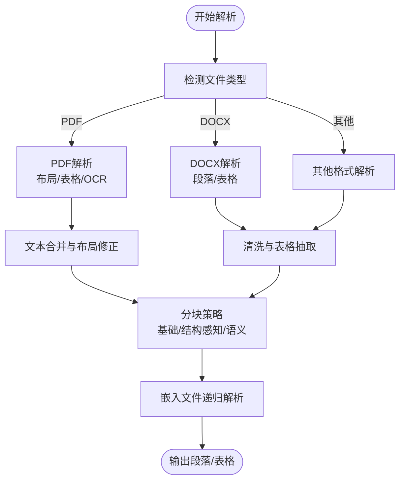
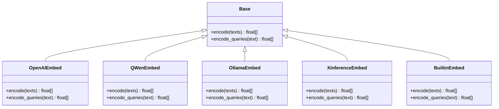
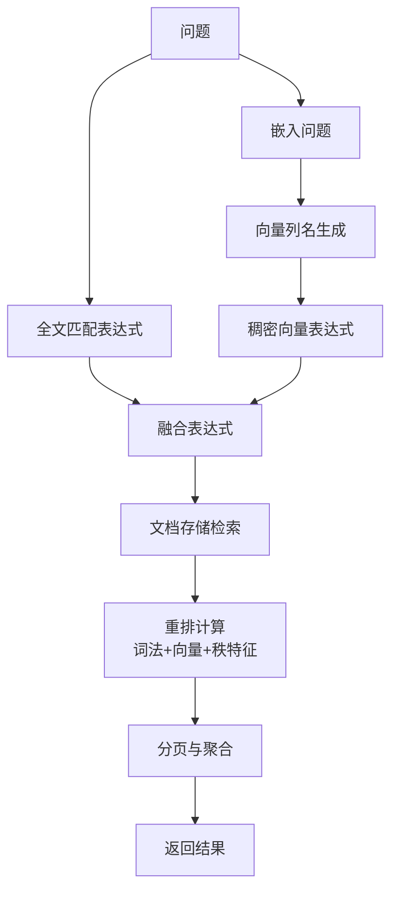
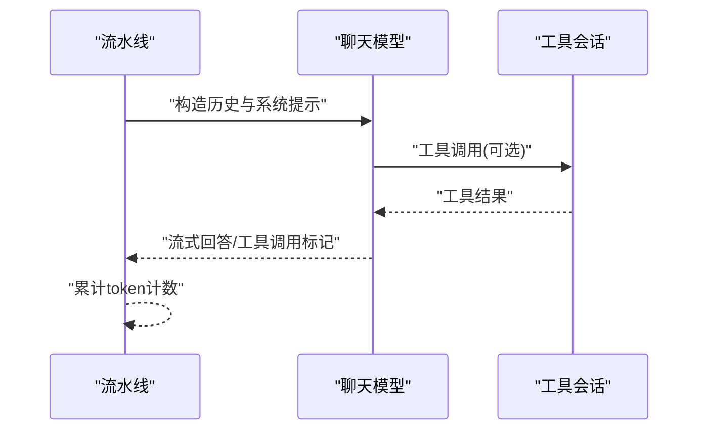
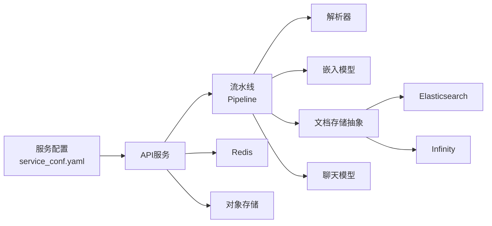

# RAG引擎

<cite>
**本文引用的文件**
- [README.md](file://README.md)
- [service_conf.yaml](file://conf/service_conf.yaml)
- [ragflow_server.py](file://api/ragflow_server.py)
- [pipeline.py](file://rag/flow/pipeline.py)
- [embedding_model.py](file://rag/llm/embedding_model.py)
- [search.py](file://rag/nlp/search.py)
- [naive.py](file://rag/app/naive.py)
- [chunking_config.json](file://conf/chunking_config.json)
- [chat_model.py](file://rag/llm/chat_model.py)
- [rerank_model.py](file://rag/llm/rerank_model.py)
- [pdf_parser.py](file://deepdoc/parser/pdf_parser.py)
- [docx_parser.py](file://deepdoc/parser/docx_parser.py)
- [doc_store_base.py](file://common/doc_store/doc_store_base.py)
- [api_app.py](file://api/apps/api_app.py)
</cite>

## 目录
1. [引言](#引言)
2. [项目结构](#项目结构)
3. [核心组件](#核心组件)
4. [架构总览](#架构总览)
5. [详细组件分析](#详细组件分析)
6. [依赖关系分析](#依赖关系分析)
7. [性能考虑](#性能考虑)
8. [故障排查指南](#故障排查指南)
9. [结论](#结论)
10. [附录](#附录)

## 引言
本技术文档面向RAG引擎的使用者与开发者，系统性阐述RAG引擎的整体架构与实现细节，覆盖文档处理、向量化、检索、生成四大核心阶段，并深入解析以下主题：
- 文档解析器的多样化支持：PDF、Word、Excel、PPT、HTML、JSON、Markdown、TXT等多格式处理机制
- 向量化与嵌入：多厂商嵌入模型适配、批处理与截断策略、TEI集成
- 检索算法：全文匹配、稠密向量检索、融合重排、秩特征与分页策略
- 生成模型集成：多LLM提供商适配、流式输出、工具调用、错误分类与重试
- 性能优化：缓存策略、并发与线程池、资源调度、配置示例与调试技巧

## 项目结构
RAG引擎采用模块化分层设计，前后端分离，核心能力集中在后端服务中，通过API对外提供能力。关键目录与职责概览如下：
- api：HTTP服务入口与路由，负责鉴权、会话管理与业务接口
- rag：RAG核心流程与算法，包括文档解析、向量化、检索、生成与重排
- deepdoc：深度文档解析子系统，提供PDF/Word/Excel/PPT等格式解析
- common：通用基础设施，如文档存储抽象、连接池、工具类
- conf：运行时配置，包括服务配置、分块策略、映射表等
- docker：容器化部署模板与环境变量
- docs：用户与开发者文档

图示来源
- [ragflow_server.py:1-157](file://api/ragflow_server.py#L1-L157)
- [service_conf.yaml:1-159](file://conf/service_conf.yaml#L1-L159)
- [doc_store_base.py:143-271](file://common/doc_store/doc_store_base.py#L143-L271)

章节来源
- [README.md:137-141](file://README.md#L137-L141)
- [service_conf.yaml:1-159](file://conf/service_conf.yaml#L1-L159)
- [ragflow_server.py:1-157](file://api/ragflow_server.py#L1-L157)

## 核心组件
- 文档解析与分块：支持PDF、DOCX、HTML、JSON、Markdown、TXT等，结合布局识别、表格/图片处理与智能分块策略
- 向量化与嵌入：统一嵌入模型工厂，支持OpenAI、Qwen、Zhipu、Ollama、Xinference、Gemini、Bedrock、Mistral、NVIDIA等
- 检索与重排：全文+稠密向量融合检索，支持秩特征与自定义重排模型
- 生成与工具调用：统一聊天模型工厂，支持流式输出、工具调用、错误分类与指数退避重试
- 存储抽象：统一的DocStore接口，兼容Elasticsearch与Infinity

章节来源
- [naive.py:59-235](file://rag/app/naive.py#L59-L235)
- [embedding_model.py:53-88](file://rag/llm/embedding_model.py#L53-L88)
- [search.py:37-174](file://rag/nlp/search.py#L37-L174)
- [chat_model.py:65-87](file://rag/llm/chat_model.py#L65-L87)
- [doc_store_base.py:143-271](file://common/doc_store/doc_store_base.py#L143-L271)

## 架构总览
RAG引擎以“解析-向量-检索-生成”为主线，贯穿任务编排、进度上报与错误处理。整体流程：
- 解析阶段：根据文件类型选择解析器，抽取文本、表格、图片，生成结构化段落
- 向量阶段：对问题与候选片段分别编码，构建向量列名与查询向量
- 检索阶段：组合全文与向量检索，进行融合重排，支持分页与聚合统计
- 生成阶段：将上下文与提示词交给LLM，支持流式输出与工具调用

图示来源
- [pipeline.py:117-176](file://rag/flow/pipeline.py#L117-L176)
- [naive.py:743-800](file://rag/app/naive.py#L743-L800)
- [embedding_model.py:53-88](file://rag/llm/embedding_model.py#L53-L88)
- [search.py:597-770](file://rag/nlp/search.py#L597-L770)
- [chat_model.py:184-496](file://rag/llm/chat_model.py#L184-L496)

## 详细组件分析

### 文档解析与分块
- 多格式解析器：PDF（布局识别、表格结构识别、OCR）、DOCX（段落、表格抽取与清洗）、HTML/JSON/Markdown/TXT等
- 智能分块策略：支持基础分块、结构感知分块、语义分块，结合内容保护与性能参数
- 嵌入文件递归解析：支持从压缩包或嵌入文件中提取并分块

图示来源
- [naive.py:59-235](file://rag/app/naive.py#L59-L235)
- [naive.py:743-800](file://rag/app/naive.py#L743-L800)
- [chunking_config.json:1-66](file://conf/chunking_config.json#L1-L66)
- [pdf_parser.py:56-110](file://deepdoc/parser/pdf_parser.py#L56-L110)
- [docx_parser.py:27-168](file://deepdoc/parser/docx_parser.py#L27-L168)

章节来源
- [naive.py:59-235](file://rag/app/naive.py#L59-L235)
- [naive.py:743-800](file://rag/app/naive.py#L743-L800)
- [chunking_config.json:1-66](file://conf/chunking_config.json#L1-L66)
- [pdf_parser.py:56-110](file://deepdoc/parser/pdf_parser.py#L56-L110)
- [docx_parser.py:27-168](file://deepdoc/parser/docx_parser.py#L27-L168)

### 向量化与嵌入
- 嵌入模型工厂：统一Base抽象，按提供商实现encode/encode_queries
- 支持厂商：OpenAI、Qwen、Zhipu、Ollama、Xinference、Gemini、Bedrock、Mistral、NVIDIA、Jina、CoHere、TogetherAI、SILICONFLOW等
- 批处理与截断：针对不同模型设置batch size与最大token长度，自动截断与token计数
- TEI集成：支持HuggingFace Text-Embeddings-Inference，自动截断与共享模型实例

图示来源
- [embedding_model.py:37-88](file://rag/llm/embedding_model.py#L37-L88)
- [embedding_model.py:91-123](file://rag/llm/embedding_model.py#L91-L123)
- [embedding_model.py:178-225](file://rag/llm/embedding_model.py#L178-L225)
- [embedding_model.py:264-300](file://rag/llm/embedding_model.py#L264-L300)
- [embedding_model.py:302-333](file://rag/llm/embedding_model.py#L302-L333)
- [embedding_model.py:53-88](file://rag/llm/embedding_model.py#L53-L88)

章节来源
- [embedding_model.py:37-88](file://rag/llm/embedding_model.py#L37-L88)
- [embedding_model.py:91-123](file://rag/llm/embedding_model.py#L91-L123)
- [embedding_model.py:178-225](file://rag/llm/embedding_model.py#L178-L225)
- [embedding_model.py:264-300](file://rag/llm/embedding_model.py#L264-L300)
- [embedding_model.py:302-333](file://rag/llm/embedding_model.py#L302-L333)
- [embedding_model.py:53-88](file://rag/llm/embedding_model.py#L53-L88)

### 检索与重排
- 检索器：全文匹配、稠密向量匹配、稀疏向量匹配、张量匹配与融合表达式
- 融合策略：权重融合（如0.05/0.95），在ES场景下先做向量检索再融合
- 重排策略：内置混合相似度（词法+向量），支持秩特征（PageRank等）与自定义重排模型
- 分页与聚合：按RERANK_LIMIT与页面大小分页，统计文档聚合信息

图示来源
- [search.py:53-62](file://rag/nlp/search.py#L53-L62)
- [search.py:115-136](file://rag/nlp/search.py#L115-L136)
- [search.py:334-437](file://rag/nlp/search.py#L334-L437)
- [search.py:597-770](file://rag/nlp/search.py#L597-L770)
- [doc_store_base.py:56-127](file://common/doc_store/doc_store_base.py#L56-L127)

章节来源
- [search.py:53-62](file://rag/nlp/search.py#L53-L62)
- [search.py:115-136](file://rag/nlp/search.py#L115-L136)
- [search.py:334-437](file://rag/nlp/search.py#L334-L437)
- [search.py:597-770](file://rag/nlp/search.py#L597-L770)
- [doc_store_base.py:56-127](file://common/doc_store/doc_store_base.py#L56-L127)

### 生成模型与工具调用
- 统一聊天模型基类：封装OpenAI客户端、超时与重试、参数清理、流式输出
- 错误分类与重试：速率限制、认证、无效请求、服务器、超时、连接、内容过滤、配额、最大轮次等
- 工具调用：支持函数调用与流式工具调用，历史拼接与JSON修复
- 多提供商适配：OpenAI、Qwen、Zhipu、Ollama、Xinference、Gemini、Bedrock、Mistral、NVIDIA、Jina、CoHere、TogetherAI、SILICONFLOW等

图示来源
- [chat_model.py:184-496](file://rag/llm/chat_model.py#L184-L496)
- [chat_model.py:289-452](file://rag/llm/chat_model.py#L289-L452)

章节来源
- [chat_model.py:65-87](file://rag/llm/chat_model.py#L65-L87)
- [chat_model.py:184-496](file://rag/llm/chat_model.py#L184-L496)
- [chat_model.py:289-452](file://rag/llm/chat_model.py#L289-L452)

### 重排模型
- 支持厂商：Jina、Xinference、LocalAI、NVIDIA、OpenAI-API-Compatible、CoHere、TogetherAI、SILICONFLOW、BaiduYiyan、VoyageAI、QWen、HuggingFace、GPUStack、NovitaAI、GiteeAI、Ai302R、JiekouAI
- 统一相似度接口：similarity(query, texts)返回相关性分数与token计数
- 归一化与截断：对输入文本进行截断，部分模型返回分数需归一化

章节来源
- [rerank_model.py:57-76](file://rag/llm/rerank_model.py#L57-L76)
- [rerank_model.py:78-108](file://rag/llm/rerank_model.py#L78-L108)
- [rerank_model.py:150-188](file://rag/llm/rerank_model.py#L150-L188)
- [rerank_model.py:200-247](file://rag/llm/rerank_model.py#L200-L247)
- [rerank_model.py:378-420](file://rag/llm/rerank_model.py#L378-L420)
- [rerank_model.py:421-455](file://rag/llm/rerank_model.py#L421-L455)

## 依赖关系分析
- 服务配置：通过service_conf.yaml集中管理数据库、对象存储、消息队列、LLM默认配置
- 文档存储抽象：DocStoreConnection定义统一接口，具体实现对接Elasticsearch或Infinity
- 流水线编排：Pipeline负责组件执行顺序、进度回调与取消控制
- API网关：API服务负责鉴权、令牌管理与统计

图示来源
- [service_conf.yaml:1-159](file://conf/service_conf.yaml#L1-L159)
- [doc_store_base.py:143-271](file://common/doc_store/doc_store_base.py#L143-L271)
- [pipeline.py:28-115](file://rag/flow/pipeline.py#L28-L115)
- [api_app.py:26-118](file://api/apps/api_app.py#L26-L118)

章节来源
- [service_conf.yaml:1-159](file://conf/service_conf.yaml#L1-L159)
- [doc_store_base.py:143-271](file://common/doc_store/doc_store_base.py#L143-L271)
- [pipeline.py:28-115](file://rag/flow/pipeline.py#L28-L115)
- [api_app.py:26-118](file://api/apps/api_app.py#L26-L118)

## 性能考虑
- 并发与限流：PDF解析支持并行设备限制，线程池执行耗时操作
- 批处理与截断：嵌入与重排均采用批处理与最大token截断，避免超长输入
- 向量维度与列名：按查询向量维度动态生成向量列名，避免固定列名冲突
- 融合重排：ES场景使用权重融合，Infinity场景由其归一化得分后再融合
- 分页与RERANK_LIMIT：按页面大小与RERANK_LIMIT控制召回规模，降低重排成本
- Token计数：统一token计数与长度通知，避免上下文截断导致的回答不完整

章节来源
- [pdf_parser.py:70-74](file://deepdoc/parser/pdf_parser.py#L70-L74)
- [embedding_model.py:73-85](file://rag/llm/embedding_model.py#L73-L85)
- [search.py:618-620](file://rag/nlp/search.py#L618-L620)
- [search.py:644-668](file://rag/nlp/search.py#L644-L668)

## 故障排查指南
- 嵌入模型错误分类：速率限制、认证失败、无效请求、服务器错误、超时、连接错误、内容过滤、配额不足、最大重试次数
- 重试策略：指数退避与随机抖动，超过最大轮次后返回错误
- 任务取消：流水线回调检查取消状态，及时中断并上报
- API统计与令牌：提供令牌管理与对话统计接口，便于监控与审计

章节来源
- [chat_model.py:91-110](file://rag/llm/chat_model.py#L91-L110)
- [chat_model.py:219-237](file://rag/llm/chat_model.py#L219-L237)
- [pipeline.py:43-104](file://rag/flow/pipeline.py#L43-L104)
- [api_app.py:26-118](file://api/apps/api_app.py#L26-L118)

## 结论
RAG引擎通过模块化设计与统一抽象，实现了从多格式文档到高质量问答的完整链路。其优势在于：
- 多样化的解析器与灵活的分块策略
- 完整的嵌入与重排生态，支持主流LLM与重排模型
- 可扩展的存储抽象与稳健的错误处理
建议在生产环境中结合业务场景选择合适的解析器、嵌入与重排模型，并通过配置文件与环境变量进行精细化调优。

## 附录
- 配置示例：服务配置、分块策略、默认LLM工厂与API密钥
- 调试技巧：启用调试模式、查看进度日志、监控token用量与错误分类

章节来源
- [service_conf.yaml:50-106](file://conf/service_conf.yaml#L50-L106)
- [chunking_config.json:1-66](file://conf/chunking_config.json#L1-L66)
- [ragflow_server.py:97-100](file://api/ragflow_server.py#L97-L100)