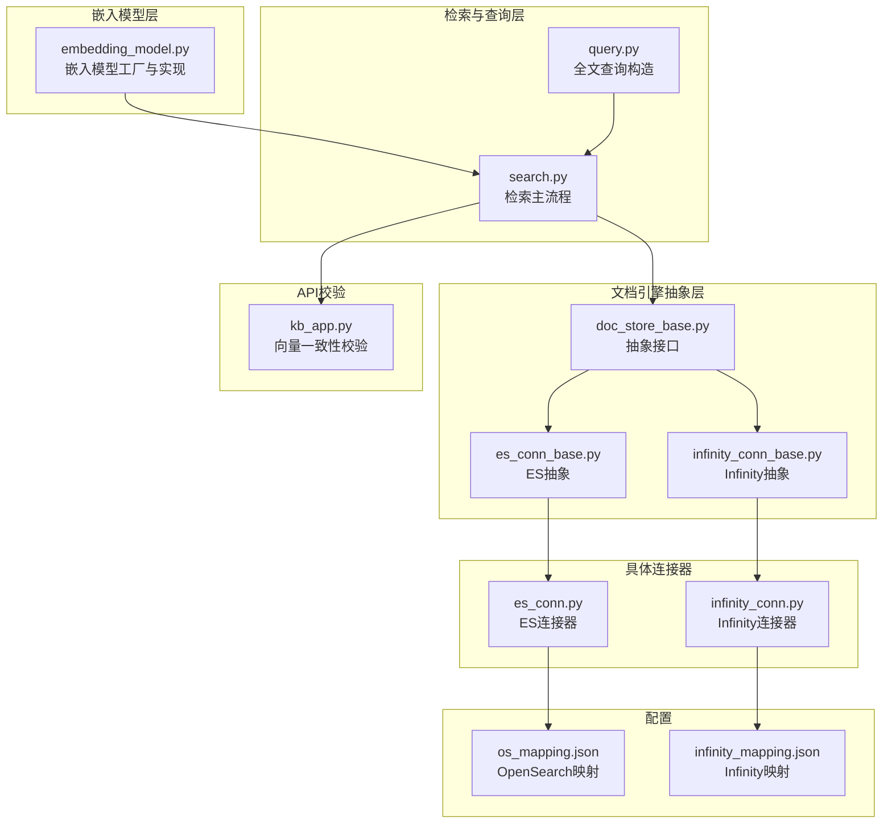
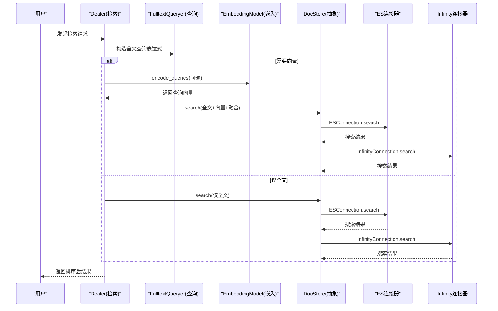
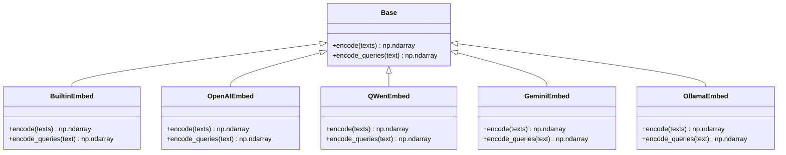
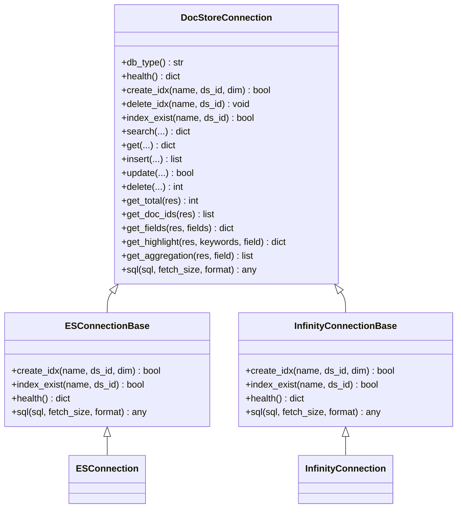
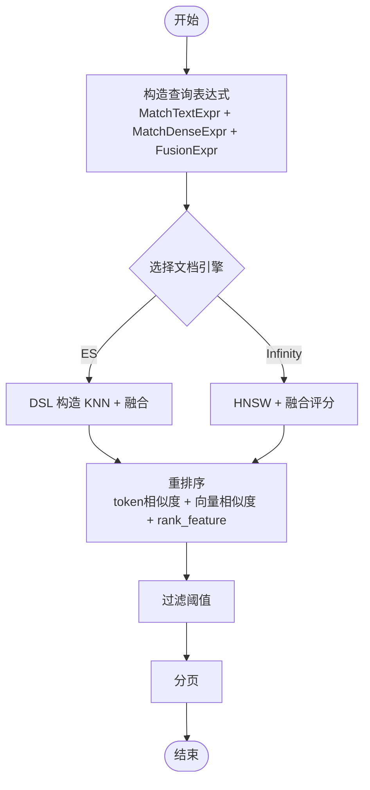
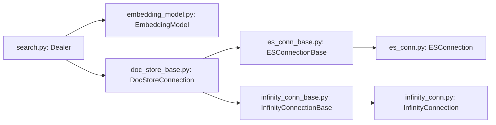

# 向量化与嵌入

<cite>
**本文引用的文件**
- [embedding_model.py](file://rag/llm/embedding_model.py)
- [doc_store_base.py](file://common/doc_store/doc_store_base.py)
- [search.py](file://rag/nlp/search.py)
- [query.py](file://rag/nlp/query.py)
- [es_conn_base.py](file://common/doc_store/es_conn_base.py)
- [es_conn.py](file://rag/utils/es_conn.py)
- [infinity_conn_base.py](file://common/doc_store/infinity_conn_base.py)
- [infinity_conn.py](file://rag/utils/infinity_conn.py)
- [os_mapping.json](file://conf/os_mapping.json)
- [infinity_mapping.json](file://conf/infinity_mapping.json)
- [kb_app.py](file://api/apps/kb_app.py)
- [faq.mdx](file://docs/faq.mdx)
</cite>

## 目录
1. [简介](#简介)
2. [项目结构](#项目结构)
3. [核心组件](#核心组件)
4. [架构总览](#架构总览)
5. [详细组件分析](#详细组件分析)
6. [依赖关系分析](#依赖关系分析)
7. [性能考量](#性能考量)
8. [故障排查指南](#故障排查指南)
9. [结论](#结论)
10. [附录](#附录)

## 简介
本技术文档聚焦于向量化与嵌入模块，系统阐述嵌入模型的工作原理与实现机制（词嵌入、句嵌入、文档嵌入），覆盖向量数据库的集成方案（Infinity、Elasticsearch、OpenSearch），以及嵌入模型选择策略、向量索引构建与管理、相似度计算与查询优化、配置示例与性能调优建议。文档面向开发者与运维人员，兼顾可操作性与可扩展性。

## 项目结构
向量化与嵌入相关代码主要分布在以下模块：
- 嵌入模型工厂与实现：rag/llm/embedding_model.py
- 查询与检索流程：rag/nlp/search.py、rag/nlp/query.py
- 文档引擎抽象与实现：common/doc_store/doc_store_base.py、common/doc_store/es_conn_base.py、common/doc_store/infinity_conn_base.py
- 具体连接器：rag/utils/es_conn.py、rag/utils/infinity_conn.py
- 映射配置：conf/os_mapping.json、conf/infinity_mapping.json
- API 一致性校验：api/apps/kb_app.py
- 设计理念说明：docs/faq.mdx

图表来源
- [embedding_model.py:1-120](file://rag/llm/embedding_model.py#L1-120)
- [search.py:37-174](file://rag/nlp/search.py#L37-174)
- [query.py:27-174](file://rag/nlp/query.py#L27-174)
- [doc_store_base.py:143-271](file://common/doc_store/doc_store_base.py#L143-271)
- [es_conn_base.py:36-309](file://common/doc_store/es_conn_base.py#L36-309)
- [infinity_conn_base.py:35-341](file://common/doc_store/infinity_conn_base.py#L35-341)
- [es_conn.py:34-196](file://rag/utils/es_conn.py#L34-196)
- [infinity_conn.py:29-271](file://rag/utils/infinity_conn.py#L29-271)
- [os_mapping.json:1-268](file://conf/os_mapping.json#L1-268)
- [infinity_mapping.json:1-41](file://conf/infinity_mapping.json#L1-41)
- [kb_app.py:956-1003](file://api/apps/kb_app.py#L956-1003)

章节来源
- [embedding_model.py:1-120](file://rag/llm/embedding_model.py#L1-120)
- [doc_store_base.py:143-271](file://common/doc_store/doc_store_base.py#L143-271)

## 核心组件
- 嵌入模型工厂与实现：支持多厂商与本地模型，统一 encode/encode_queries 接口，批量处理与令牌统计，兼容不同服务端格式。
- 检索主流程：封装向量查询、全文查询、融合评分与重排序，支持分页、聚合与高亮。
- 文档引擎抽象：统一索引创建、CRUD、搜索、聚合与高亮接口，屏蔽 ES/Infinity 差异。
- 具体连接器：ES 连接器基于 DSL 构造 KNN 与融合查询；Infinity 连接器基于 HNSW 向量索引与融合评分。
- 映射配置：OpenSearch 使用动态模板与 knn_vector 字段；Infinity 使用列式 schema 与 HNSW 索引。
- API 校验：在切换嵌入模型时进行向量空间一致性校验，确保相似度稳定。

章节来源
- [embedding_model.py:53-86](file://rag/llm/embedding_model.py#L53-86)
- [search.py:597-770](file://rag/nlp/search.py#L597-770)
- [doc_store_base.py:143-271](file://common/doc_store/doc_store_base.py#L143-271)
- [es_conn.py:39-196](file://rag/utils/es_conn.py#L39-196)
- [infinity_conn.py:92-271](file://rag/utils/infinity_conn.py#L92-271)
- [os_mapping.json:160-268](file://conf/os_mapping.json#L160-268)
- [infinity_mapping.json:1-41](file://conf/infinity_mapping.json#L1-41)
- [kb_app.py:956-1003](file://api/apps/kb_app.py#L956-1003)

## 架构总览
整体流程：用户发起检索请求 → 构造查询表达式（全文+向量）→ 通过文档引擎执行融合检索 → 返回结果并进行重排序或直接使用融合得分。

图表来源
- [search.py:75-174](file://rag/nlp/search.py#L75-174)
- [query.py:41-174](file://rag/nlp/query.py#L41-174)
- [embedding_model.py:100-123](file://rag/llm/embedding_model.py#L100-123)
- [es_conn.py:39-196](file://rag/utils/es_conn.py#L39-196)
- [infinity_conn.py:92-271](file://rag/utils/infinity_conn.py#L92-271)

## 详细组件分析

### 嵌入模型工作原理与实现机制
- 统一接口：Base 抽象类定义 encode/encode_queries；各厂商实现继承并适配其 SDK/HTTP 客户端。
- 批处理与令牌统计：对批量请求进行分片，统计 token 数量，便于成本控制与限流。
- 本地与在线模型：支持本地 Ollama、HuggingFace TEI、OpenAI、Azure、Qwen、Zhipu、Gemini、NVIDIA、Bedrock 等。
- 多模态支持：部分模型支持图片输入并聚合 token 向量。
- 选择策略要点：
  - 性能：本地模型延迟低但资源占用高；云端模型吞吐高但网络受限。
  - 语种：多语言模型适合多语种场景；专用模型在特定任务上更优。
  - 维度与相似度：不同模型输出维度不同，需保证检索端向量维度一致；相似度计算通常采用余弦。

图表来源
- [embedding_model.py:37-300](file://rag/llm/embedding_model.py#L37-300)

章节来源
- [embedding_model.py:53-86](file://rag/llm/embedding_model.py#L53-86)
- [embedding_model.py:91-123](file://rag/llm/embedding_model.py#L91-123)
- [embedding_model.py:178-225](file://rag/llm/embedding_model.py#L178-225)
- [embedding_model.py:547-578](file://rag/llm/embedding_model.py#L547-578)
- [embedding_model.py:264-300](file://rag/llm/embedding_model.py#L264-300)

### 向量数据库集成与适配
- 抽象层：DocStoreConnection 定义 create_idx/delete_idx/index_exist/search/get/insert/update/delete 等接口。
- ES 适配：ESConnectionBase 加载 mapping.json，创建索引；ESConnection 实现 DSL 查询，KNN num_candidates 控制候选集大小，融合权重从 FusionExpr 中解析。
- Infinity 适配：InfinityConnectionBase 创建表与 HNSW 向量索引，支持全文索引；InfinityConnection 实现融合评分与排序，支持 rank_feature。
- OpenSearch 适配：os_mapping.json 定义动态模板与 knn_vector 字段，支持多种维度与空间类型。

图表来源
- [doc_store_base.py:143-271](file://common/doc_store/doc_store_base.py#L143-271)
- [es_conn_base.py:36-309](file://common/doc_store/es_conn_base.py#L36-309)
- [infinity_conn_base.py:35-341](file://common/doc_store/infinity_conn_base.py#L35-341)
- [es_conn.py:34-196](file://rag/utils/es_conn.py#L34-196)
- [infinity_conn.py:29-271](file://rag/utils/infinity_conn.py#L29-271)

章节来源
- [doc_store_base.py:143-271](file://common/doc_store/doc_store_base.py#L143-271)
- [es_conn_base.py:126-162](file://common/doc_store/es_conn_base.py#L126-162)
- [infinity_conn_base.py:231-286](file://common/doc_store/infinity_conn_base.py#L231-286)
- [es_conn.py:39-196](file://rag/utils/es_conn.py#L39-196)
- [infinity_conn.py:92-271](file://rag/utils/infinity_conn.py#L92-271)

### 向量索引构建与管理
- ES：通过 mapping.json 动态模板自动识别 *_vec 字段并创建 knn_vector 列；索引创建时加载 settings 与 mappings。
- Infinity：根据向量维度动态添加 q_{dim}_vec 列，创建 HNSW 索引（M、ef_construction、metric、encode 参数可调）；同时为带 analyzer 的 varchar 字段创建全文索引。
- OpenSearch：os_mapping.json 定义多组 knn_vector 匹配规则，覆盖常见维度（512/768/1024/.../10240）。

章节来源
- [es_conn_base.py:126-137](file://common/doc_store/es_conn_base.py#L126-137)
- [infinity_conn_base.py:231-286](file://common/doc_store/infinity_conn_base.py#L231-286)
- [infinity_conn_base.py:71-103](file://common/doc_store/infinity_conn_base.py#L71-103)
- [os_mapping.json:160-268](file://conf/os_mapping.json#L160-268)
- [infinity_mapping.json:1-41](file://conf/infinity_mapping.json#L1-41)

### 向量相似度计算与查询优化
- 查询表达式：MatchDenseExpr 描述向量查询，包含向量列名、向量数据、距离类型、topn 与额外选项（如 similarity 阈值）。
- 融合策略：FusionExpr 支持 weighted_sum，默认 normalize=atan；ES 侧权重从 FusionExpr 的 weights 中解析，分别调整全文与向量权重。
- 重排序：Dealer.rerank/rerank_by_model 将 token 相似度与向量相似度加权融合，并结合 rank_feature（pagerank 与 tag_feas）提升排序质量。
- 优化技巧：
  - KNN 候选数限制：ES 中 num_candidates=min(topn*2, 1024)，降低候选集以提升查询速度。
  - 降最小匹配阈值：当无命中时尝试降低 minimum_should_match 并重新查询。
  - 向量维度一致性：API 层对旧向量与新模型向量进行余弦相似度评估，要求平均相似度大于阈值才允许切换。

图表来源
- [search.py:121-174](file://rag/nlp/search.py#L121-174)
- [search.py:613-770](file://rag/nlp/search.py#L613-770)
- [es_conn.py:111-120](file://rag/utils/es_conn.py#L111-120)
- [kb_app.py:956-1003](file://api/apps/kb_app.py#L956-1003)

章节来源
- [doc_store_base.py:70-127](file://common/doc_store/doc_store_base.py#L70-127)
- [search.py:121-174](file://rag/nlp/search.py#L121-174)
- [search.py:613-770](file://rag/nlp/search.py#L613-770)
- [es_conn.py:111-120](file://rag/utils/es_conn.py#L111-120)
- [kb_app.py:956-1003](file://api/apps/kb_app.py#L956-1003)

### 嵌入模型选择策略与配置示例
- 模型选择依据：
  - 任务目标：通用检索 vs. 多语言 vs. 图像文本对齐。
  - 性能与成本：本地部署延迟低但资源高；云端吞吐高但网络与费用需考虑。
  - 维度与兼容性：确保检索端向量维度一致；不同模型输出维度不同。
- 配置要点：
  - ES/OpenSearch：确保 mapping 中存在对应 *_vec 字段与 knn_vector 设置。
  - Infinity：根据文档向量维度动态创建 q_{dim}_vec 列与 HNSW 索引。
  - 融合权重：通过 FusionExpr 的 weights 调整全文与向量权重比例。
- 一致性校验：切换模型时对样本向量进行余弦相似度评估，要求平均相似度高于阈值。

章节来源
- [faq.mdx:63-70](file://docs/faq.mdx#L63-70)
- [os_mapping.json:160-268](file://conf/os_mapping.json#L160-268)
- [infinity_conn_base.py:251-271](file://common/doc_store/infinity_conn_base.py#L251-271)
- [kb_app.py:956-1003](file://api/apps/kb_app.py#L956-1003)

## 依赖关系分析
- 模块耦合：
  - Dealer 依赖 EmbeddingModel 与 DocStoreConnection，形成“查询构造—向量编码—引擎执行”的清晰链路。
  - ES 与 Infinity 连接器均依赖 DocStore 抽象，便于替换与扩展。
- 外部依赖：
  - ES：elasticsearch-dsl、elasticsearch 客户端。
  - Infinity：infinity 客户端与 HNSW 索引。
  - OpenSearch：opensearch-py 客户端。
- 循环依赖：未发现循环导入；抽象层隔离具体实现。

图表来源
- [search.py:37-174](file://rag/nlp/search.py#L37-174)
- [embedding_model.py:53-86](file://rag/llm/embedding_model.py#L53-86)
- [doc_store_base.py:143-271](file://common/doc_store/doc_store_base.py#L143-271)
- [es_conn_base.py:36-309](file://common/doc_store/es_conn_base.py#L36-309)
- [infinity_conn_base.py:35-341](file://common/doc_store/infinity_conn_base.py#L35-341)
- [es_conn.py:34-196](file://rag/utils/es_conn.py#L34-196)
- [infinity_conn.py:29-271](file://rag/utils/infinity_conn.py#L29-271)

章节来源
- [search.py:37-174](file://rag/nlp/search.py#L37-174)
- [doc_store_base.py:143-271](file://common/doc_store/doc_store_base.py#L143-271)

## 性能考量
- 向量索引参数：
  - Infinity HNSW：M、ef_construction、metric、encode 可调；M 增大召回提升但内存与构建时间上升；ef_construction 影响图质量。
  - ES KNN：num_candidates 控制候选集上限，建议设置为 min(topn*2, 1024)。
- 查询路径优化：
  - 降最小匹配阈值：首次无结果时降低 minimum_should_match 并重试。
  - 仅在需要时注入查询向量列，避免不必要的字段回传。
- 重排序优化：
  - 使用向量化计算余弦相似度与加权融合，避免 Python 循环；rank_feature 通过 JSON 解析与向量化归一化提升效率。
- 资源监控：
  - 在任务执行前后记录内存使用与耗时，便于定位瓶颈。

章节来源
- [infinity_conn_base.py:258-271](file://common/doc_store/infinity_conn_base.py#L258-271)
- [es_conn.py:111-120](file://rag/utils/es_conn.py#L111-120)
- [search.py:138-150](file://rag/nlp/search.py#L138-150)
- [search.py:334-476](file://rag/nlp/search.py#L334-476)

## 故障排查指南
- 健康检查：
  - ES：cluster.health、cluster.stats、indices、nodes 等信息可用于判断集群状态。
  - Infinity：show_current_node 返回 server_status，OK=alive/started。
- 常见问题：
  - 索引不存在：确认 mapping 文件存在且 create_idx 成功；ES 使用 Index.exists；Infinity 使用 get_table。
  - 向量维度不匹配：插入前推断 q_{dim}_vec，若缺失则报错；确保嵌入模型输出维度与索引一致。
  - 融合权重解析：ES 侧从 FusionExpr.weights 中解析权重；若为空则使用默认权重。
  - 模型切换失败：API 层对样本向量进行一致性校验，平均相似度低于阈值会拒绝切换。
- 日志与调试：
  - 各连接器记录 query/body/result 与异常堆栈；ES 支持超时重连与刷新连接池。

章节来源
- [es_conn_base.py:68-121](file://common/doc_store/es_conn_base.py#L68-121)
- [infinity_conn_base.py:213-225](file://common/doc_store/infinity_conn_base.py#L213-225)
- [es_conn_base.py:149-162](file://common/doc_store/es_conn_base.py#L149-162)
- [infinity_conn_base.py:296-306](file://common/doc_store/infinity_conn_base.py#L296-306)
- [infinity_conn.py:301-332](file://rag/utils/infinity_conn.py#L301-332)
- [es_conn.py:174-195](file://rag/utils/es_conn.py#L174-195)
- [kb_app.py:956-1003](file://api/apps/kb_app.py#L956-1003)

## 结论
本模块通过统一的嵌入模型工厂、抽象化的文档引擎与完善的索引/查询优化策略，实现了对多向量数据库的无缝适配。在实际部署中，建议优先根据任务目标与资源约束选择合适的嵌入模型与向量数据库，并结合融合权重与重排序策略持续优化检索效果。

## 附录
- 配置文件位置与用途：
  - conf/os_mapping.json：OpenSearch 动态模板与 knn_vector 映射。
  - conf/infinity_mapping.json：Infinity 表 schema 与全文索引映射。
- 关键实现参考路径：
  - 嵌入模型工厂与实现：[embedding_model.py:53-86](file://rag/llm/embedding_model.py#L53-86)
  - 检索主流程：[search.py:597-770](file://rag/nlp/search.py#L597-770)
  - 查询表达式与融合：[doc_store_base.py:70-127](file://common/doc_store/doc_store_base.py#L70-127)
  - ES 连接器：[es_conn.py:39-196](file://rag/utils/es_conn.py#L39-196)
  - Infinity 连接器：[infinity_conn.py:92-271](file://rag/utils/infinity_conn.py#L92-271)
  - API 一致性校验：[kb_app.py:956-1003](file://api/apps/kb_app.py#L956-1003)