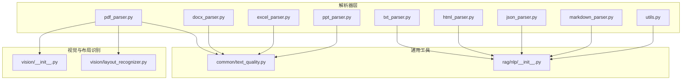
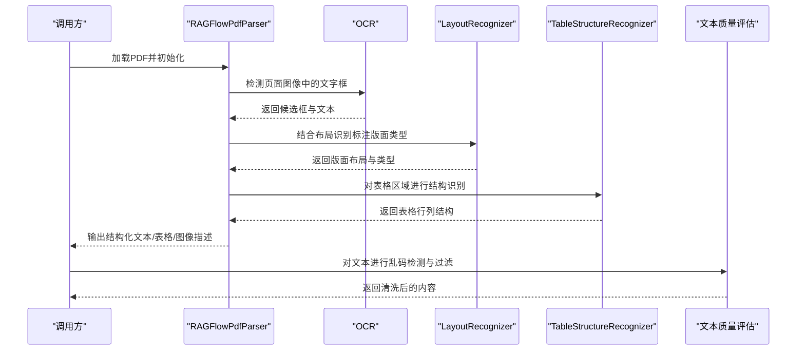
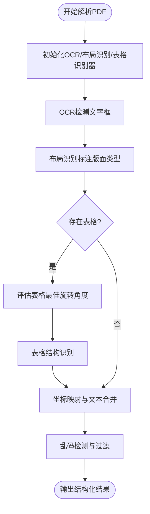
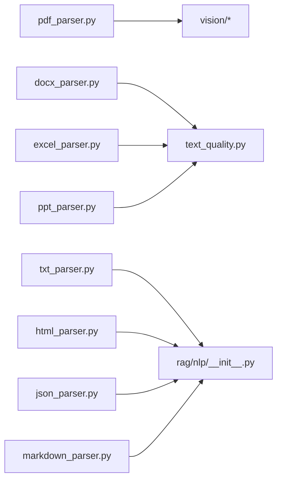

# 文档处理

<cite>
**本文引用的文件**
- [deepdoc/parser/__init__.py](file://deepdoc/parser/__init__.py)
- [deepdoc/parser/pdf_parser.py](file://deepdoc/parser/pdf_parser.py)
- [deepdoc/parser/docx_parser.py](file://deepdoc/parser/docx_parser.py)
- [deepdoc/parser/excel_parser.py](file://deepdoc/parser/excel_parser.py)
- [deepdoc/parser/ppt_parser.py](file://deepdoc/parser/ppt_parser.py)
- [deepdoc/parser/txt_parser.py](file://deepdoc/parser/txt_parser.py)
- [deepdoc/parser/utils.py](file://deepdoc/parser/utils.py)
- [deepdoc/parser/html_parser.py](file://deepdoc/parser/html_parser.py)
- [deepdoc/parser/json_parser.py](file://deepdoc/parser/json_parser.py)
- [deepdoc/parser/markdown_parser.py](file://deepdoc/parser/markdown_parser.py)
- [deepdoc/vision/__init__.py](file://deepdoc/vision/__init__.py)
- [deepdoc/vision/layout_recognizer.py](file://deepdoc/vision/layout_recognizer.py)
- [common/text_quality.py](file://common/text_quality.py)
- [rag/nlp/__init__.py](file://rag/nlp/__init__.py)
</cite>

## 目录
1. [简介](#简介)
2. [项目结构](#项目结构)
3. [核心组件](#核心组件)
4. [架构总览](#架构总览)
5. [详细组件分析](#详细组件分析)
6. [依赖关系分析](#依赖关系分析)
7. [性能考量](#性能考量)
8. [故障排除指南](#故障排除指南)
9. [结论](#结论)
10. [附录](#附录)

## 简介
本文件面向“文档处理模块”的技术文档，系统性阐述多格式文档的统一解析与结构化处理能力，覆盖 PDF、Word、Excel、PPT、TXT、HTML、JSON、Markdown 等格式的解析机制，以及文本提取、表格识别、图像处理、元数据清洗、格式转换、质量评估与预处理策略、配置与性能优化建议，并提供使用示例与故障排除指引。

## 项目结构
文档处理模块位于 deepdoc/parser 下，按格式拆分为独立解析器；视觉与布局识别能力位于 deepdoc/vision；通用文本质量评估与编码检测位于 common 与 rag/nlp。

图示来源
- [deepdoc/parser/pdf_parser.py:56-110](file://deepdoc/parser/pdf_parser.py#L56-L110)
- [deepdoc/vision/__init__.py:28-31](file://deepdoc/vision/__init__.py#L28-L31)
- [deepdoc/vision/layout_recognizer.py:33-55](file://deepdoc/vision/layout_recognizer.py#L33-L55)
- [common/text_quality.py:113-225](file://common/text_quality.py#L113-L225)
- [rag/nlp/__init__.py:54-73](file://rag/nlp/__init__.py#L54-L73)

章节来源
- [deepdoc/parser/__init__.py:17-39](file://deepdoc/parser/__init__.py#L17-L39)

## 核心组件
- 统一入口与导出：通过解析器包导出各格式解析器类名，便于上层统一调用。
- 视觉识别与布局：基于 OCR 与布局识别模型，完成 PDF 页面元素的结构化标注与表格结构识别。
- 文本质量评估：提供乱码检测、过滤与质量评分，保障内容质量。
- 编码与分词：自动检测编码，提供分词与令牌计数，支撑分块策略。

章节来源
- [deepdoc/parser/__init__.py:17-39](file://deepdoc/parser/__init__.py#L17-L39)
- [deepdoc/vision/__init__.py:28-31](file://deepdoc/vision/__init__.py#L28-L31)
- [common/text_quality.py:113-225](file://common/text_quality.py#L113-L225)
- [rag/nlp/__init__.py:54-73](file://rag/nlp/__init__.py#L54-L73)

## 架构总览
整体采用“格式解析器 + 视觉识别 + 质量评估 + 编码/分词”的分层架构。PDF 解析器在 OCR 与布局识别基础上，结合表格结构识别与旋转校正，输出结构化文本与表格；其他格式解析器侧重各自特性的抽取与清洗；最终统一进入分块与令牌化阶段。

图示来源
- [deepdoc/parser/pdf_parser.py:56-110](file://deepdoc/parser/pdf_parser.py#L56-L110)
- [deepdoc/vision/layout_recognizer.py:63-158](file://deepdoc/vision/layout_recognizer.py#L63-L158)
- [common/text_quality.py:113-225](file://common/text_quality.py#L113-L225)

## 详细组件分析

### PDF 解析器（RAGFlowPdfParser）
- 初始化与设备选择：根据环境变量选择布局识别器类型（ONNX 或 Ascend），加载方向分类模型，支持多设备并发限流。
- OCR 与版面布局：先进行 OCR 文字框检测与识别，再通过布局识别器标注版面类型（文本、标题、表格、图、公式等），并进行垃圾页/页眉页脚/参考文献过滤。
- 表格结构识别与旋转校正：对表格区域进行多角度评估与旋转校正，再进行结构识别，并在必要时对旋转后的表格重新 OCR 匹配坐标。
- 文本合并与列数估计：按页面与列进行文本合并，估计列数并进行水平/垂直合并，提升可读性。
- 输出：返回结构化文本块、表格（含行列结构）、图像描述等。

图示来源
- [deepdoc/parser/pdf_parser.py:56-110](file://deepdoc/parser/pdf_parser.py#L56-L110)
- [deepdoc/parser/pdf_parser.py:292-395](file://deepdoc/parser/pdf_parser.py#L292-L395)
- [deepdoc/parser/pdf_parser.py:396-438](file://deepdoc/parser/pdf_parser.py#L396-L438)
- [deepdoc/parser/pdf_parser.py:586-649](file://deepdoc/parser/pdf_parser.py#L586-L649)
- [deepdoc/parser/pdf_parser.py:651-752](file://deepdoc/parser/pdf_parser.py#L651-L752)
- [deepdoc/parser/pdf_parser.py:754-800](file://deepdoc/parser/pdf_parser.py#L754-L800)

章节来源
- [deepdoc/parser/pdf_parser.py:56-110](file://deepdoc/parser/pdf_parser.py#L56-L110)
- [deepdoc/parser/pdf_parser.py:292-395](file://deepdoc/parser/pdf_parser.py#L292-L395)
- [deepdoc/parser/pdf_parser.py:396-438](file://deepdoc/parser/pdf_parser.py#L396-L438)
- [deepdoc/parser/pdf_parser.py:586-649](file://deepdoc/parser/pdf_parser.py#L586-L649)
- [deepdoc/parser/pdf_parser.py:651-752](file://deepdoc/parser/pdf_parser.py#L651-L752)
- [deepdoc/parser/pdf_parser.py:754-800](file://deepdoc/parser/pdf_parser.py#L754-L800)

### Word 解析器（RAGFlowDocxParser）
- 段落与样式：逐段读取，记录样式名称，过滤乱码段落与表格行。
- 表格抽取：将表格转为 DataFrame，基于内容类型识别（日期、数值、文本等）与表头推断，生成结构化行。
- 输出：返回清洗后的段落文本与表格内容列表。

章节来源
- [deepdoc/parser/docx_parser.py:27-167](file://deepdoc/parser/docx_parser.py#L27-L167)
- [common/text_quality.py:113-225](file://common/text_quality.py#L113-L225)

### Excel 解析器（RAGFlowExcelParser）
- 文件类型自适应：优先 openpyxl 加载，失败则回退 pandas 与 calamine；支持 CSV 自动转换为工作簿。
- 图片提取：从工作表中提取嵌入图片，限制大小与缩放，标注所在单元格范围。
- HTML/Markdown 导出：支持将表格转为 HTML 表格片段或 Markdown 表格。
- 行数统计：针对 xls/xlsx/csv/txt 提供行数估算与统计。
- 输出：结构化行列表、HTML 表格片段、Markdown 表格、图片描述与位置信息。

章节来源
- [deepdoc/parser/excel_parser.py:30-67](file://deepdoc/parser/excel_parser.py#L30-L67)
- [deepdoc/parser/excel_parser.py:136-190](file://deepdoc/parser/excel_parser.py#L136-L190)
- [deepdoc/parser/excel_parser.py:192-256](file://deepdoc/parser/excel_parser.py#L192-L256)
- [deepdoc/parser/excel_parser.py:273-375](file://deepdoc/parser/excel_parser.py#L273-L375)
- [deepdoc/parser/excel_parser.py:394-431](file://deepdoc/parser/excel_parser.py#L394-L431)

### PPT 解析器（RAGFlowPptParser）
- 形状与文本：遍历幻灯片形状，提取文本；支持有序/无序列表与分级缩进；表格形状转为行列表。
- 输出：按页返回文本块。

章节来源
- [deepdoc/parser/ppt_parser.py:22-96](file://deepdoc/parser/ppt_parser.py#L22-L96)

### TXT 解析器（RAGFlowTxtParser）
- 编码检测：通过编码检测函数确定文本编码。
- 分块策略：基于自定义分隔符集合进行切分，按令牌数阈值进行二次分块。

章节来源
- [deepdoc/parser/txt_parser.py:23-64](file://deepdoc/parser/txt_parser.py#L23-L64)
- [deepdoc/parser/utils.py:20-32](file://deepdoc/parser/utils.py#L20-L32)
- [rag/nlp/__init__.py:54-73](file://rag/nlp/__init__.py#L54-L73)

### HTML 解析器（RAGFlowHtmlParser）
- 清洗与提取：移除样式、脚本、内联样式与注释，递归提取正文文本块与表格。
- 合并与分块：按标题层级与块 ID 合并相邻文本，再按令牌数阈值进行分块；表格单独输出。

章节来源
- [deepdoc/parser/html_parser.py:39-76](file://deepdoc/parser/html_parser.py#L39-L76)
- [deepdoc/parser/html_parser.py:106-147](file://deepdoc/parser/html_parser.py#L106-L147)
- [deepdoc/parser/html_parser.py:149-212](file://deepdoc/parser/html_parser.py#L149-L212)

### JSON 解析器（RAGFlowJsonParser）
- 格式识别：判断是否为 JSONL，分别处理。
- 结构化分块：将嵌套结构按最大块大小拆分，保持键值结构完整，必要时将列表转为字典以适配拆分。

章节来源
- [deepdoc/parser/json_parser.py:27-41](file://deepdoc/parser/json_parser.py#L27-L41)
- [deepdoc/parser/json_parser.py:66-115](file://deepdoc/parser/json_parser.py#L66-L115)
- [deepdoc/parser/json_parser.py:130-152](file://deepdoc/parser/json_parser.py#L130-L152)

### Markdown 解析器（RAGFlowMarkdownParser 与 MarkdownElementExtractor）
- 表格分离与渲染：提取标准/无边框 Markdown 表格与 HTML 表格，支持分离或渲染为 HTML。
- 元素级提取：按标题、代码块、列表、引用、段落等元素进行拆分，支持带元信息的提取。

章节来源
- [deepdoc/parser/markdown_parser.py:23-122](file://deepdoc/parser/markdown_parser.py#L23-L122)
- [deepdoc/parser/markdown_parser.py:125-321](file://deepdoc/parser/markdown_parser.py#L125-L321)

### 视觉与布局识别
- 布局识别器：支持 ONNX 与 Ascend 两种实现，提供预处理、推理与后处理流程，输出版面类型与边界框。
- 表格结构识别：对表格区域进行行列结构识别，辅助 PDF 表格解析。

章节来源
- [deepdoc/vision/layout_recognizer.py:33-158](file://deepdoc/vision/layout_recognizer.py#L33-L158)
- [deepdoc/vision/layout_recognizer.py:164-238](file://deepdoc/vision/layout_recognizer.py#L164-L238)
- [deepdoc/vision/layout_recognizer.py:241-457](file://deepdoc/vision/layout_recognizer.py#L241-L457)

### 文本质量评估与预处理
- 乱码检测：综合替换字符、CID 占位符、控制字符比例、重复字符、异常 Unicode、混合乱码模式与伪英文特征进行判定。
- 过滤与评分：提供过滤函数与质量评分，支持句子级乱码比例检测。

章节来源
- [common/text_quality.py:113-225](file://common/text_quality.py#L113-L225)
- [common/text_quality.py:269-309](file://common/text_quality.py#L269-L309)
- [common/text_quality.py:312-348](file://common/text_quality.py#L312-L348)

## 依赖关系分析
- 解析器依赖：PDF 解析器依赖视觉识别与布局识别模块；Word/Excel/PPT/TXT/HTML/JSON/Markdown 解析器依赖通用编码检测与分词工具。
- 质量评估：各文本型解析器在输出前可接入乱码检测与过滤。
- 并发与设备：PDF 解析器支持多设备并发限流，布局识别器支持 TensorRT DLA 服务或本地推理。

图示来源
- [deepdoc/parser/pdf_parser.py:42-44](file://deepdoc/parser/pdf_parser.py#L42-L44)
- [deepdoc/parser/docx_parser.py:24-24](file://deepdoc/parser/docx_parser.py#L24-L24)
- [deepdoc/parser/excel_parser.py:24-24](file://deepdoc/parser/excel_parser.py#L24-L24)
- [deepdoc/parser/ppt_parser.py:17-19](file://deepdoc/parser/ppt_parser.py#L17-L19)
- [deepdoc/parser/txt_parser.py:19-20](file://deepdoc/parser/txt_parser.py#L19-L20)
- [deepdoc/parser/html_parser.py:18-22](file://deepdoc/parser/html_parser.py#L18-L22)
- [deepdoc/parser/json_parser.py:24-24](file://deepdoc/parser/json_parser.py#L24-L24)
- [deepdoc/parser/markdown_parser.py:20-20](file://deepdoc/parser/markdown_parser.py#L20-L20)

章节来源
- [deepdoc/parser/pdf_parser.py:42-44](file://deepdoc/parser/pdf_parser.py#L42-L44)
- [deepdoc/parser/docx_parser.py:24-24](file://deepdoc/parser/docx_parser.py#L24-L24)
- [deepdoc/parser/excel_parser.py:24-24](file://deepdoc/parser/excel_parser.py#L24-L24)
- [deepdoc/parser/ppt_parser.py:17-19](file://deepdoc/parser/ppt_parser.py#L17-L19)
- [deepdoc/parser/txt_parser.py:19-20](file://deepdoc/parser/txt_parser.py#L19-L20)
- [deepdoc/parser/html_parser.py:18-22](file://deepdoc/parser/html_parser.py#L18-L22)
- [deepdoc/parser/json_parser.py:24-24](file://deepdoc/parser/json_parser.py#L24-L24)
- [deepdoc/parser/markdown_parser.py:20-20](file://deepdoc/parser/markdown_parser.py#L20-L20)

## 性能考量
- 并发与限流：PDF 解析器支持多设备并发限流，避免 GPU/CPU 资源争抢。
- 模型加载与设备：布局识别器优先使用本地模型，失败时从 Hugging Face 下载；支持 Ascend 设备与 TensorRT DLA 服务。
- 内存与 I/O：Excel 解析器区分小文件快速模式与大文件流式模式，降低内存占用；TXT/HTML/JSON/Markdown 解析器采用流式或分块策略。
- 图像处理：Excel 图片提取限制大小与缩放，避免内存峰值过高。
- 分块策略：基于令牌数阈值进行分块，结合上下文拼接，平衡吞吐与语义完整性。

章节来源
- [deepdoc/parser/pdf_parser.py:72-73](file://deepdoc/parser/pdf_parser.py#L72-L73)
- [deepdoc/vision/layout_recognizer.py:49-54](file://deepdoc/vision/layout_recognizer.py#L49-L54)
- [deepdoc/vision/layout_recognizer.py:58-61](file://deepdoc/vision/layout_recognizer.py#L58-L61)
- [deepdoc/parser/excel_parser.py:276-299](file://deepdoc/parser/excel_parser.py#L276-L299)
- [deepdoc/parser/excel_parser.py:136-190](file://deepdoc/parser/excel_parser.py#L136-L190)
- [deepdoc/parser/txt_parser.py:28-64](file://deepdoc/parser/txt_parser.py#L28-L64)
- [deepdoc/parser/html_parser.py:180-212](file://deepdoc/parser/html_parser.py#L180-L212)
- [deepdoc/parser/json_parser.py:66-115](file://deepdoc/parser/json_parser.py#L66-L115)

## 故障排除指南
- 编码问题：若 TXT/HTML/JSON 读取异常，检查编码检测逻辑与 fallback 策略。
- PDF 布局识别失败：确认模型下载与路径；检查环境变量选择（ONNX/Ascend）；必要时启用 TensorRT DLA 服务。
- 表格识别不准确：检查表格旋转校正与坐标映射；确保图像质量与缩放设置合理。
- Excel 图片过大：调整图片尺寸与阈值，避免内存溢出。
- 乱码内容：启用乱码检测与过滤，必要时放宽技术术语场景阈值。

章节来源
- [rag/nlp/__init__.py:54-73](file://rag/nlp/__init__.py#L54-L73)
- [deepdoc/vision/layout_recognizer.py:255-267](file://deepdoc/vision/layout_recognizer.py#L255-L267)
- [deepdoc/parser/pdf_parser.py:340-360](file://deepdoc/parser/pdf_parser.py#L340-L360)
- [deepdoc/parser/excel_parser.py:150-162](file://deepdoc/parser/excel_parser.py#L150-L162)
- [common/text_quality.py:113-225](file://common/text_quality.py#L113-L225)

## 结论
该文档处理模块通过统一的解析器接口与强大的视觉识别能力，实现了对多格式文档的结构化处理。PDF 解析器在 OCR、布局识别与表格结构识别方面具备较强鲁棒性；其他格式解析器专注于各自特性抽取与清洗；配合文本质量评估与编码/分词工具，形成从原始文档到高质量结构化内容的完整链路。

## 附录
- 使用示例（路径参考）
  - PDF 解析：[pdf_parser.py:56-110](file://deepdoc/parser/pdf_parser.py#L56-L110)
  - Word 解析：[docx_parser.py:117-167](file://deepdoc/parser/docx_parser.py#L117-L167)
  - Excel 解析：[excel_parser.py:273-375](file://deepdoc/parser/excel_parser.py#L273-L375)
  - PPT 解析：[ppt_parser.py:77-96](file://deepdoc/parser/ppt_parser.py#L77-L96)
  - TXT 解析：[txt_parser.py:24-64](file://deepdoc/parser/txt_parser.py#L24-L64)
  - HTML 解析：[html_parser.py:40-76](file://deepdoc/parser/html_parser.py#L40-L76)
  - JSON 解析：[json_parser.py:33-41](file://deepdoc/parser/json_parser.py#L33-L41)
  - Markdown 解析：[markdown_parser.py:27-122](file://deepdoc/parser/markdown_parser.py#L27-L122)