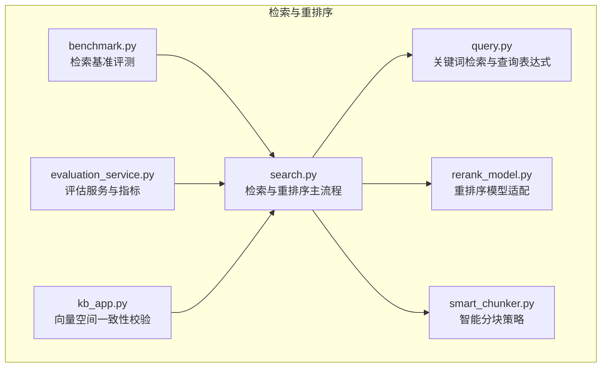
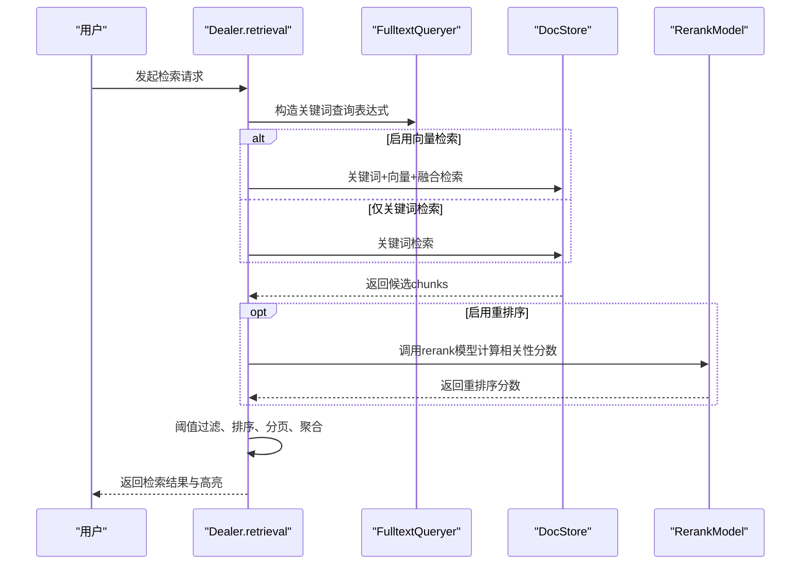
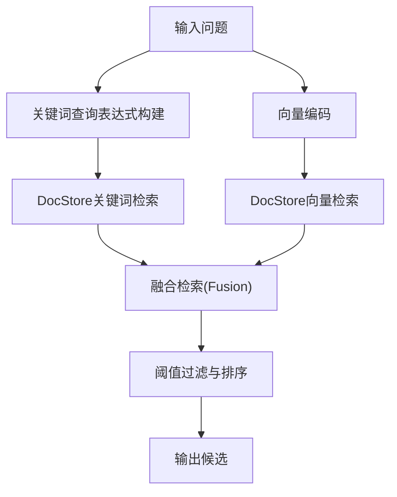
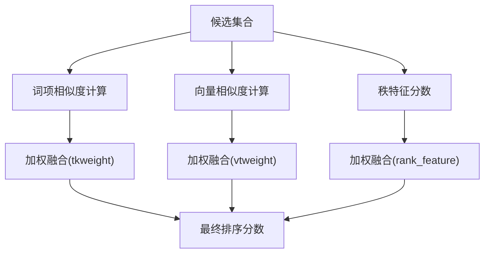
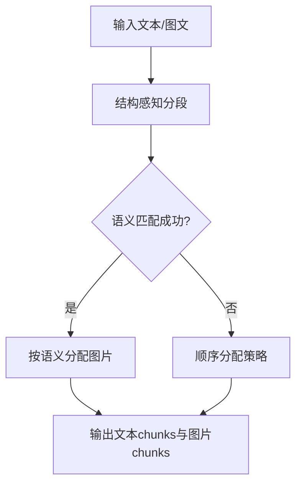
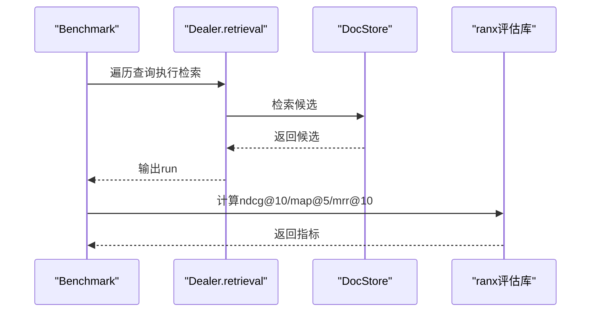
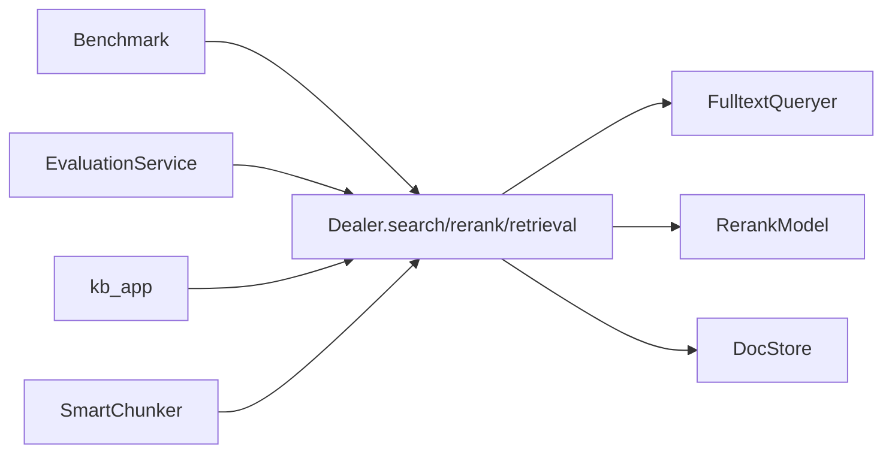

# 检索与重排序

<cite>
**本文引用的文件**
- [search.py](file://rag/nlp/search.py)
- [query.py](file://rag/nlp/query.py)
- [rerank_model.py](file://rag/llm/rerank_model.py)
- [smart_chunker.py](file://rag/utils/smart_chunker.py)
- [benchmark.py](file://rag/benchmark.py)
- [evaluation_service.py](file://api/db/services/evaluation_service.py)
- [kb_app.py](file://api/apps/kb_app.py)
</cite>

## 目录
1. [简介](#简介)
2. [项目结构](#项目结构)
3. [核心组件](#核心组件)
4. [架构总览](#架构总览)
5. [详细组件分析](#详细组件分析)
6. [依赖关系分析](#依赖关系分析)
7. [性能考量](#性能考量)
8. [故障排查指南](#故障排查指南)
9. [结论](#结论)
10. [附录](#附录)

## 简介
本技术文档聚焦“检索与重排序”模块，系统阐述多阶段检索策略（关键词检索、向量检索、混合检索）、重排序模型工作机制（交叉注意力、对比学习、学习排序）、智能分块策略（语义分段、长度控制、上下文保持），以及检索效果评估与优化实践（指标计算、参数调优、性能优化）。文档以代码为依据，辅以图示帮助读者理解端到端流程。

## 项目结构
检索与重排序相关的核心代码主要分布在以下模块：
- 检索与重排序主流程：rag/nlp/search.py
- 查询构造与关键词检索：rag/nlp/query.py
- 重排序模型适配层：rag/llm/rerank_model.py
- 智能分块策略：rag/utils/smart_chunker.py
- 检索基准评测：rag/benchmark.py
- 评估服务与指标：api/db/services/evaluation_service.py
- 向量一致性验证：api/apps/kb_app.py

**图表来源**
- [search.py:597-770](file://rag/nlp/search.py#L597-L770)
- [query.py:27-174](file://rag/nlp/query.py#L27-L174)
- [rerank_model.py:29-539](file://rag/llm/rerank_model.py#L29-L539)
- [smart_chunker.py:36-491](file://rag/utils/smart_chunker.py#L36-L491)
- [benchmark.py:39-310](file://rag/benchmark.py#L39-L310)
- [evaluation_service.py:44-654](file://api/db/services/evaluation_service.py#L44-L654)
- [kb_app.py:956-1003](file://api/apps/kb_app.py#L956-L1003)

**章节来源**
- [search.py:1-1013](file://rag/nlp/search.py#L1-L1013)
- [query.py:1-237](file://rag/nlp/query.py#L1-L237)
- [rerank_model.py:1-539](file://rag/llm/rerank_model.py#L1-L539)
- [smart_chunker.py:1-491](file://rag/utils/smart_chunker.py#L1-L491)
- [benchmark.py:1-310](file://rag/benchmark.py#L1-L310)
- [evaluation_service.py:1-654](file://api/db/services/evaluation_service.py#L1-L654)
- [kb_app.py:956-1003](file://api/apps/kb_app.py#L956-L1003)

## 核心组件
- 检索器（Dealer）：负责关键词检索、向量检索、融合检索、重排序、分页聚合与高亮输出。
- 查询构造器（FulltextQueryer）：生成关键词查询表达式、词项相似度与混合相似度。
- 重排序模型适配器：封装多种外部重排序服务（Jina、OpenAI兼容、NVIDIA、Qwen等）。
- 智能分块器（SmartChunker）：基于结构感知与语义重叠的分块策略，兼顾图文对齐。
- 评估与基准：支持MS MARCO、TriviaQA、MIRACL等数据集的自动评测与指标统计。
- 向量空间一致性校验：对比旧/新模式向量，保障切换稳定性。

**章节来源**
- [search.py:37-174](file://rag/nlp/search.py#L37-L174)
- [query.py:27-174](file://rag/nlp/query.py#L27-L174)
- [rerank_model.py:57-539](file://rag/llm/rerank_model.py#L57-L539)
- [smart_chunker.py:36-491](file://rag/utils/smart_chunker.py#L36-L491)
- [benchmark.py:39-310](file://rag/benchmark.py#L39-L310)
- [evaluation_service.py:44-654](file://api/db/services/evaluation_service.py#L44-L654)
- [kb_app.py:956-1003](file://api/apps/kb_app.py#L956-L1003)

## 架构总览
检索与重排序采用“多阶段融合”的流水线设计：
- 阶段一：关键词检索（TF-IDF/BM25风格）与可选向量检索（余弦相似度）。
- 阶段二：融合检索（权重融合）或直接进入重排序。
- 阶段三：重排序（可选本地模型或外部rerank API），结合词项相似度与秩特征。
- 阶段四：阈值过滤、分页、聚合与高亮输出。

**图表来源**
- [search.py:597-770](file://rag/nlp/search.py#L597-L770)
- [query.py:41-174](file://rag/nlp/query.py#L41-L174)
- [rerank_model.py:57-246](file://rag/llm/rerank_model.py#L57-L246)

**章节来源**
- [search.py:597-770](file://rag/nlp/search.py#L597-L770)
- [query.py:27-174](file://rag/nlp/query.py#L27-L174)
- [rerank_model.py:29-539](file://rag/llm/rerank_model.py#L29-L539)

## 详细组件分析

### 多阶段检索策略
- 关键词检索：通过 FulltextQueryer 构造带权重的查询表达式，支持同义词扩展、短语匹配与细粒度分词。
- 向量检索：对查询与文档向量进行余弦相似度计算，支持相似度阈值与top-k控制。
- 混合检索：将关键词与向量得分按权重融合，提升召回质量与鲁棒性。

**图表来源**
- [search.py:75-174](file://rag/nlp/search.py#L75-L174)
- [query.py:41-174](file://rag/nlp/query.py#L41-L174)

**章节来源**
- [search.py:75-174](file://rag/nlp/search.py#L75-L174)
- [query.py:27-174](file://rag/nlp/query.py#L27-L174)

### 重排序模型工作机制
- 词项相似度：基于词权重与集合重叠计算，加权考虑标题、问题、重要词与正文。
- 向量相似度：对查询与候选向量归一化后做点积，得到余弦相似度。
- 秩特征分数：结合PageRank与标签特征，形成可解释的排序信号。
- 模型重排：调用外部rerank API（如Jina、OpenAI兼容、NVIDIA、Qwen等），支持批量与异常保护。

**图表来源**
- [search.py:334-565](file://rag/nlp/search.py#L334-L565)
- [rerank_model.py:57-246](file://rag/llm/rerank_model.py#L57-L246)

**章节来源**
- [search.py:334-565](file://rag/nlp/search.py#L334-L565)
- [rerank_model.py:57-246](file://rag/llm/rerank_model.py#L57-L246)

### 智能分块策略
- 结构感知分段：优先按Markdown层级与段落分隔符切分，保证语义完整性。
- 语义重叠分配：将图片与文本段落进行语义匹配，优先分配给包含其内容的chunk。
- 顺序回退策略：当语义匹配效果不佳时，按累积字符长度进行顺序分配。
- 长度控制与上下文保持：通过chunk_size与chunk_overlap控制token规模，避免截断关键信息。

**图表来源**
- [smart_chunker.py:63-224](file://rag/utils/smart_chunker.py#L63-L224)
- [smart_chunker.py:275-337](file://rag/utils/smart_chunker.py#L275-L337)

**章节来源**
- [smart_chunker.py:36-491](file://rag/utils/smart_chunker.py#L36-L491)

### 检索效果评估与优化
- 基准评测：支持MS MARCO、TriviaQA、MIRACL数据集，自动计算ndcg@10、map@5、mrr@10等指标，并导出明细。
- 评估服务：提供检索指标（precision、recall、f1、hit_rate、mrr）与平均执行时间统计，给出配置建议。
- 参数调优：通过相似度阈值、向量相似度权重、top-k等参数影响召回与排序质量。

**图表来源**
- [benchmark.py:50-241](file://rag/benchmark.py#L50-L241)
- [evaluation_service.py:488-531](file://api/db/services/evaluation_service.py#L488-L531)

**章节来源**
- [benchmark.py:39-310](file://rag/benchmark.py#L39-L310)
- [evaluation_service.py:44-654](file://api/db/services/evaluation_service.py#L44-L654)

### 向量空间一致性校验
- 对比模式：对同一文档同时使用旧/新模式编码，计算余弦相似度，要求平均相似度大于阈值（默认0.9）。
- 切换保护：若低于阈值，拒绝切换，提示向量空间不兼容。

**章节来源**
- [kb_app.py:956-1003](file://api/apps/kb_app.py#L956-L1003)

## 依赖关系分析
- Dealer 依赖 FulltextQueryer 构造查询表达式，依赖 DocStore 执行检索，可选依赖 RerankModel 进行重排序。
- RerankModel 支持多家外部服务，内部统一对接方式，便于替换与扩展。
- SmartChunker 依赖结构分析器与分隔符策略，保证分块质量。
- 评估模块依赖检索主流程与第三方评估库，形成闭环。

**图表来源**
- [search.py:37-174](file://rag/nlp/search.py#L37-L174)
- [query.py:27-174](file://rag/nlp/query.py#L27-L174)
- [rerank_model.py:57-246](file://rag/llm/rerank_model.py#L57-L246)
- [smart_chunker.py:36-491](file://rag/utils/smart_chunker.py#L36-L491)
- [benchmark.py:39-310](file://rag/benchmark.py#L39-L310)
- [evaluation_service.py:44-654](file://api/db/services/evaluation_service.py#L44-L654)
- [kb_app.py:956-1003](file://api/apps/kb_app.py#L956-L1003)

**章节来源**
- [search.py:37-174](file://rag/nlp/search.py#L37-L174)
- [query.py:27-174](file://rag/nlp/query.py#L27-L174)
- [rerank_model.py:29-539](file://rag/llm/rerank_model.py#L29-L539)
- [smart_chunker.py:36-491](file://rag/utils/smart_chunker.py#L36-L491)
- [benchmark.py:39-310](file://rag/benchmark.py#L39-L310)
- [evaluation_service.py:44-654](file://api/db/services/evaluation_service.py#L44-L654)
- [kb_app.py:956-1003](file://api/apps/kb_app.py#L956-L1003)

## 性能考量
- 向量化与批处理：重排序阶段对候选向量与词项相似度进行向量化计算，减少循环开销。
- 异常保护：外部rerank API失败时降级为零向量，避免中断。
- 分页与限流：RERANK_LIMIT与分页参数配合，平衡吞吐与延迟。
- 日志与耗时：记录检索、重排序、过滤、格式化各阶段耗时，便于定位瓶颈。

**章节来源**
- [search.py:618-770](file://rag/nlp/search.py#L618-L770)
- [search.py:550-557](file://rag/nlp/search.py#L550-L557)

## 故障排查指南
- 关键词检索为空：降低最小匹配阈值或关闭向量检索，确认索引是否存在。
- 重排序异常：检查rerank模型可用性与网络连通性，查看降级日志。
- 向量空间不一致：参考向量一致性校验结果，确认维度与模型兼容。
- 评估指标异常：核对ground truth与检索ID集合，检查top-k与阈值设置。

**章节来源**
- [search.py:138-150](file://rag/nlp/search.py#L138-L150)
- [kb_app.py:956-1003](file://api/apps/kb_app.py#L956-L1003)
- [evaluation_service.py:488-531](file://api/db/services/evaluation_service.py#L488-L531)

## 结论
本模块通过“关键词+向量+融合+重排序”的多阶段设计，在保证召回质量的同时提升了排序精度。智能分块策略强化了语义完整性与图文对齐，评估体系提供了客观指标与优化建议。实践中建议根据业务场景动态调整相似度阈值、向量权重与top-k，并结合评估结果持续迭代。

## 附录
- 配置建议（示例）
  - 相似度阈值：根据召回与精度平衡设定，如0.2~0.4。
  - 向量相似度权重：关键词与向量的相对贡献，如0.3/0.7。
  - top-k：结合下游生成长度与上下文窗口，如128。
  - 重排序模型：优先选择与领域匹配的rerank模型，关注响应时间与成本。
- 调试技巧
  - 开启高亮字段，定位关键词命中区域。
  - 分阶段打印候选数量与阈值过滤比例，定位召回瓶颈。
  - 使用基准脚本在标准数据集上对比不同参数组合。