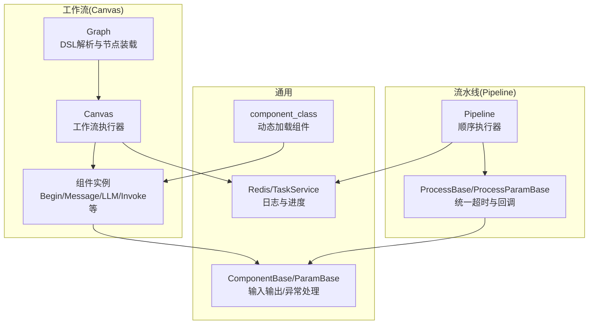
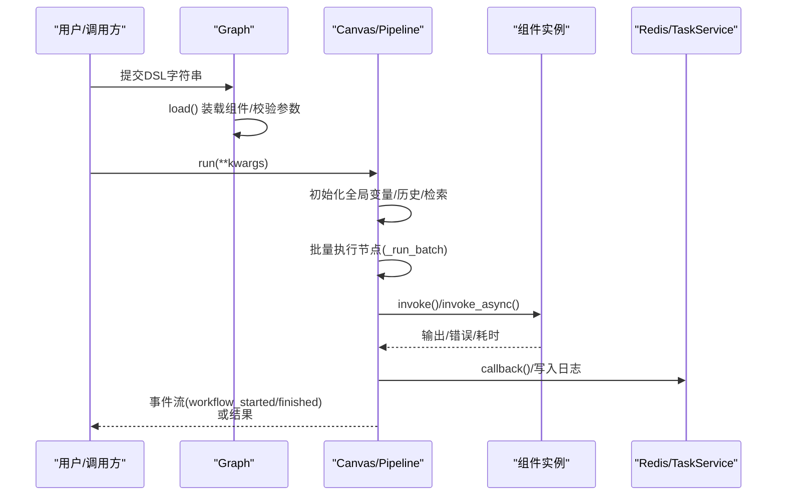
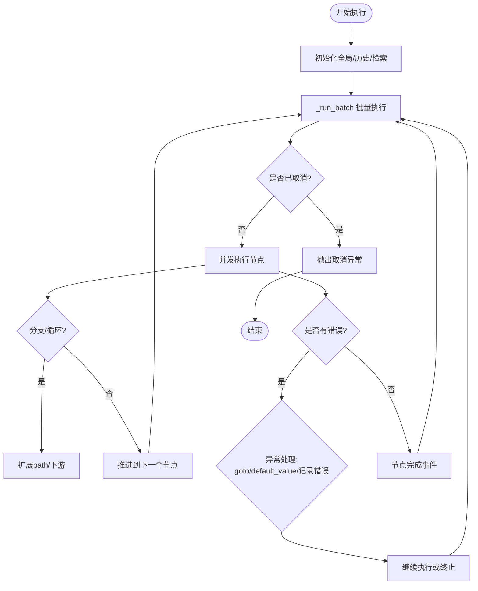
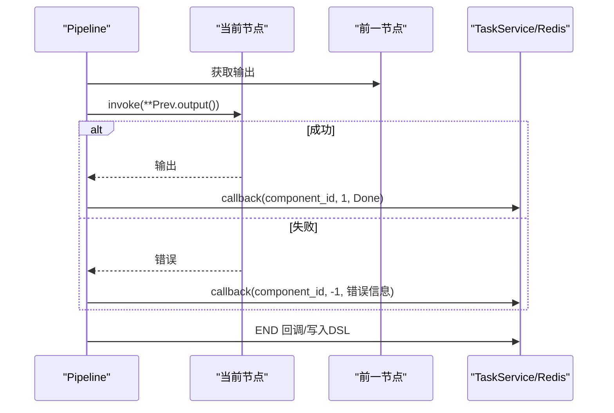
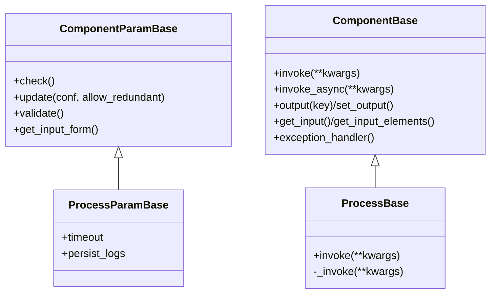
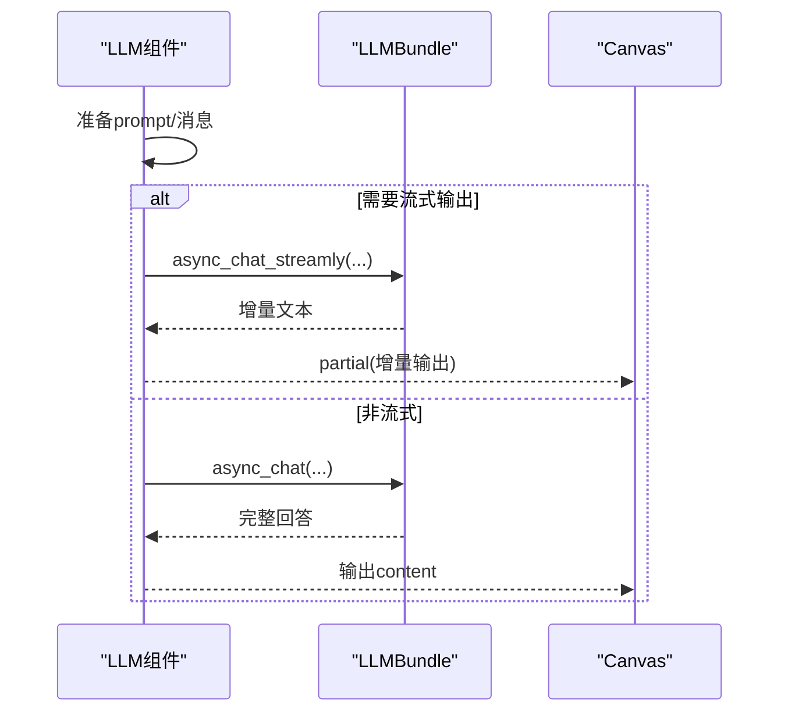
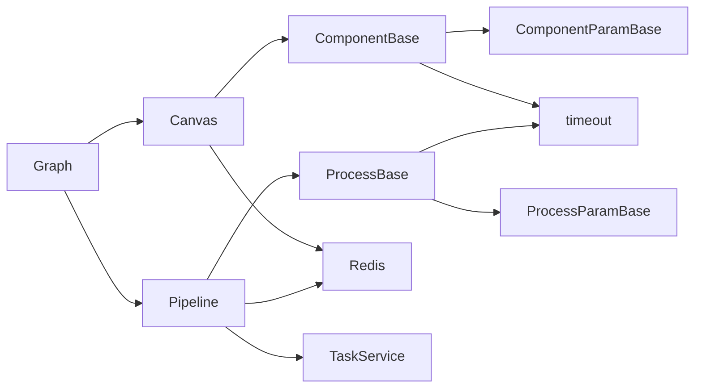

# 流水线与工作流

<cite>
**本文引用的文件**
- [agent/canvas.py](file://agent/canvas.py)
- [rag/flow/pipeline.py](file://rag/flow/pipeline.py)
- [rag/flow/base.py](file://rag/flow/base.py)
- [agent/component/base.py](file://agent/component/base.py)
- [agent/component/__init__.py](file://agent/component/__init__.py)
- [agent/component/llm.py](file://agent/component/llm.py)
- [agent/component/invoke.py](file://agent/component/invoke.py)
- [agent/settings.py](file://agent/settings.py)
- [agent/templates/advanced_ingestion_pipeline.json](file://agent/templates/advanced_ingestion_pipeline.json)
- [plugin/plugin_manager.py](file://plugin/plugin_manager.py)
- [api/db/services/task_service.py](file://api/db/services/task_service.py)
- [rag/utils/redis_conn.py](file://rag/utils/redis_conn.py)
- [common/connection_utils.py](file://common/connection_utils.py)
- [agent/test/client.py](file://agent/test/client.py)
</cite>

## 目录
1. [引言](#引言)
2. [项目结构](#项目结构)
3. [核心组件](#核心组件)
4. [架构总览](#架构总览)
5. [详细组件分析](#详细组件分析)
6. [依赖关系分析](#依赖关系分析)
7. [性能考虑](#性能考虑)
8. [故障排查指南](#故障排查指南)
9. [结论](#结论)
10. [附录](#附录)

## 引言
本文件面向“流水线与工作流”模块，系统性阐述基于 DSL 的可编排流水线与工作流的架构设计、执行机制与生命周期管理。重点覆盖以下方面：
- 组件化设计：组件基类、参数校验、输入输出抽象、异常处理与默认值策略
- 异步执行：事件驱动的批量执行、线程池并发、协程与阻塞调用的统一封装
- 错误处理：超时控制、取消信号、异常分支与默认值回退
- 工作流编排：节点连接、变量引用、状态管理、并发控制与路径推进
- 生命周期管理：初始化、执行、监控、终止与日志追踪
- 配置与定制：参数传递、回调机制、进度跟踪、调试模式
- 性能优化与调试：资源调度、内存管理、超时控制、并发限制

## 项目结构
该模块围绕“图(Graph)”抽象展开，分为两类运行时：
- Canvas（工作流）：支持多分支、条件跳转、用户交互、消息流式输出、TTS 等
- Pipeline（数据流/流水线）：顺序执行、回调进度、任务取消与日志持久化

图表来源
- [agent/canvas.py:40-127](file://agent/canvas.py#L40-L127)
- [rag/flow/pipeline.py:28-176](file://rag/flow/pipeline.py#L28-L176)
- [rag/flow/base.py:26-63](file://rag/flow/base.py#L26-L63)
- [agent/component/base.py:365-585](file://agent/component/base.py#L365-L585)
- [agent/component/__init__.py:51-59](file://agent/component/__init__.py#L51-L59)

章节来源
- [agent/canvas.py:40-127](file://agent/canvas.py#L40-L127)
- [rag/flow/pipeline.py:28-176](file://rag/flow/pipeline.py#L28-L176)
- [rag/flow/base.py:26-63](file://rag/flow/base.py#L26-L63)
- [agent/component/base.py:365-585](file://agent/component/base.py#L365-L585)
- [agent/component/__init__.py:51-59](file://agent/component/__init__.py#L51-L59)

## 核心组件
- Graph：DSL 解析、组件装载、全局变量与路径管理、变量引用解析、取消检测与日志清理
- Canvas：工作流执行器，支持批量并发、消息流式输出、TTS、分支与用户交互
- Pipeline：数据流执行器，顺序执行、回调进度、任务取消、日志持久化
- ComponentBase/ParamBase：组件抽象、输入输出、异常处理、超时装饰器、并发限制
- ProcessBase/ProcessParamBase：流水线组件统一包装，带超时与回调
- component_class：动态加载组件类，支持 agent.component、agent.tools、rag.flow

章节来源
- [agent/canvas.py:40-127](file://agent/canvas.py#L40-L127)
- [rag/flow/pipeline.py:28-176](file://rag/flow/pipeline.py#L28-L176)
- [rag/flow/base.py:26-63](file://rag/flow/base.py#L26-L63)
- [agent/component/base.py:365-585](file://agent/component/base.py#L365-L585)
- [agent/component/__init__.py:51-59](file://agent/component/__init__.py#L51-L59)

## 架构总览
下图展示从 DSL 到执行、再到回调与日志的关键流程。

图表来源
- [agent/canvas.py:367-656](file://agent/canvas.py#L367-L656)
- [rag/flow/pipeline.py:117-176](file://rag/flow/pipeline.py#L117-L176)
- [rag/flow/base.py:41-63](file://rag/flow/base.py#L41-L63)
- [rag/utils/redis_conn.py](file://rag/utils/redis_conn.py)
- [api/db/services/task_service.py](file://api/db/services/task_service.py)

## 详细组件分析

### Graph 与 Canvas：工作流编排与执行
- DSL 结构：components、path、globals、history、retrieval、variables、graph(nodes/edges)
- 变量系统：支持 sys.*、env.*、组件输出引用（如 {begin@output}），通过表达式解析与递归取值
- 路径推进：根据下游边与分支节点（categorize/switch/iteration/loop/exitloop）动态扩展 path
- 并发执行：_run_batch 使用线程池并发执行当前批次节点；支持 invoke_async 协程函数
- 消息流式输出：Message 节点支持 partial 流式内容，按块拼接并触发 message/message_end 事件
- 取消与错误：检查 has_canceled，抛出 TaskCanceledException；异常可 goto 分支或设置默认值

图表来源
- [agent/canvas.py:420-620](file://agent/canvas.py#L420-L620)

章节来源
- [agent/canvas.py:40-127](file://agent/canvas.py#L40-L127)
- [agent/canvas.py:367-656](file://agent/canvas.py#L367-L656)

### Pipeline：顺序流水线与进度回调
- 顺序执行：从 path 第一个节点开始，依次调用上一节点的输出作为当前节点输入
- 进度回调：callback(component_id, progress, message) 写入 Redis，聚合计算整体进度
- 取消检测：has_canceled 在回调中抛出 TaskCanceledException
- 日志持久化：fetch_logs 读取 Redis 中 trace 数据

图表来源
- [rag/flow/pipeline.py:117-176](file://rag/flow/pipeline.py#L117-L176)

章节来源
- [rag/flow/pipeline.py:28-176](file://rag/flow/pipeline.py#L28-L176)

### 组件基类与参数校验：统一执行与异常处理
- ComponentBase：同步/异步 invoke 封装、输入解析、输出存储、异常默认值、父节点/上下游查询、并发限制
- ComponentParamBase：参数更新、嵌套深度限制、参数验证规则、弃用参数警告
- ProcessBase/ProcessParamBase：为流水线组件提供统一超时与回调包装

图表来源
- [agent/component/base.py:40-585](file://agent/component/base.py#L40-L585)
- [rag/flow/base.py:26-63](file://rag/flow/base.py#L26-L63)

章节来源
- [agent/component/base.py:40-585](file://agent/component/base.py#L40-L585)
- [rag/flow/base.py:26-63](file://rag/flow/base.py#L26-L63)
- [agent/settings.py:17-19](file://agent/settings.py#L17-L19)

### LLM 组件：提示构造、流式输出与结构化输出
- 提示构造：系统提示与用户消息拼接，支持历史窗口裁剪、引用注入、图片多模态
- 流式输出：partial 包装，按块输出，支持 think 标记
- 结构化输出：基于 JSON Schema 的结构化生成与修复
- 异常与默认值：错误时返回默认值或错误标记

图表来源
- [agent/component/llm.py:169-342](file://agent/component/llm.py#L169-L342)

章节来源
- [agent/component/llm.py:33-352](file://agent/component/llm.py#L33-L352)

### HTTP 调用组件：请求构建与重试
- 支持 GET/POST/PUT，变量替换 URL，支持 JSON/Form Data
- 清洗 HTML、代理与超时、重试与延迟
- 输出 result 字段

章节来源
- [agent/component/invoke.py:30-145](file://agent/component/invoke.py#L30-L145)

### 动态组件加载：component_class
- 自动扫描 agent.component、agent.tools、rag.flow 下的组件类
- 支持按名称动态导入，用于 Graph.load()

章节来源
- [agent/component/__init__.py:51-59](file://agent/component/__init__.py#L51-L59)

### 示例模板：高级数据摄取流水线
- 展示了文件解析、分词、抽取摘要/关键词/问题/元数据、索引的完整链路
- 节点间通过上游/下游边连接，支持复杂数据流

章节来源
- [agent/templates/advanced_ingestion_pipeline.json:1-728](file://agent/templates/advanced_ingestion_pipeline.json#L1-L728)

## 依赖关系分析
- Canvas 与 Pipeline 共同继承自 Graph，分别实现不同的执行策略
- 组件统一基于 ComponentBase/ParamBase，ProcessBase 为其在流水线中的特化
- 超时控制通过装饰器 timeout 与 asyncio.wait_for 统一实现
- 取消与日志通过 Redis 与 TaskService 实现跨组件共享

图表来源
- [agent/canvas.py:40-127](file://agent/canvas.py#L40-L127)
- [rag/flow/pipeline.py:28-176](file://rag/flow/pipeline.py#L28-L176)
- [rag/flow/base.py:26-63](file://rag/flow/base.py#L26-L63)
- [agent/component/base.py:365-585](file://agent/component/base.py#L365-L585)
- [common/connection_utils.py](file://common/connection_utils.py)
- [rag/utils/redis_conn.py](file://rag/utils/redis_conn.py)
- [api/db/services/task_service.py](file://api/db/services/task_service.py)

章节来源
- [agent/canvas.py:40-127](file://agent/canvas.py#L40-L127)
- [rag/flow/pipeline.py:28-176](file://rag/flow/pipeline.py#L28-L176)
- [rag/flow/base.py:26-63](file://rag/flow/base.py#L26-L63)
- [agent/component/base.py:365-585](file://agent/component/base.py#L365-L585)
- [common/connection_utils.py](file://common/connection_utils.py)

## 性能考虑
- 并发执行
  - Canvas 批量节点并发：使用线程池执行 invoke_async 或同步 invoke，避免阻塞事件循环
  - 组件级并发限制：通过信号量限制聊天类组件的并发数
- 超时控制
  - 组件统一超时装饰器与 asyncio.wait_for，防止长时间阻塞
  - 环境变量 COMPONENT_EXEC_TIMEOUT 控制默认超时
- 资源调度
  - 线程池大小与组件并发限制共同决定吞吐
  - LLM 多模态与流式输出需注意内存与网络带宽
- 日志与进度
  - Redis 缓存 trace，定期过期；流水线端聚合进度，减少前端压力
- 调试与观测
  - debug_inputs 临时覆盖输入，便于快速定位
  - 事件流 workflow_started/workflow_finished/node_finished 辅助可视化

章节来源
- [agent/canvas.py:420-463](file://agent/canvas.py#L420-L463)
- [agent/component/base.py:367-447](file://agent/component/base.py#L367-L447)
- [rag/flow/base.py:41-63](file://rag/flow/base.py#L41-L63)
- [rag/flow/pipeline.py:43-104](file://rag/flow/pipeline.py#L43-L104)

## 故障排查指南
- 取消与中断
  - Canvas/Pipeline 在关键点检查 has_canceled，抛出 TaskCanceledException
  - 前端可通过取消接口停止拉取 trace
- 错误处理
  - 组件异常：优先尝试异常默认值；否则记录 _ERROR
  - 异常分支：exception_handler 返回 goto/default_value，实现容错路径
- 日志与进度
  - 通过 fetch_logs 获取 trace，查看每个组件的 trace 列表与耗时
  - 流水线端聚合进度，若出现 -1 表示被取消或错误
- 参数校验
  - 参数深度限制与冗余字段检测，避免配置错误导致执行失败
- 超时与阻塞
  - 若组件长时间无响应，检查超时设置与外部服务可用性

章节来源
- [agent/canvas.py:412-424](file://agent/canvas.py#L412-L424)
- [rag/flow/pipeline.py:47-104](file://rag/flow/pipeline.py#L47-L104)
- [agent/component/base.py:567-582](file://agent/component/base.py#L567-L582)
- [agent/component/base.py:408-447](file://agent/component/base.py#L408-L447)
- [agent/component/base.py:127-187](file://agent/component/base.py#L127-L187)

## 结论
本模块以 Graph 为核心，通过组件化与 DSL 驱动实现了灵活的工作流与流水线编排。Canvas 提供强大的并发与流式能力，适合复杂对话与交互场景；Pipeline 提供稳定的顺序执行与进度回调，适合数据处理与批处理场景。统一的超时、取消、日志与异常处理机制确保了系统的鲁棒性与可观测性。结合模板与动态组件加载，用户可以快速构建与扩展各类业务流水线与工作流。

## 附录

### 生命周期管理要点
- 初始化：Graph.load() 校验参数并实例化组件；Canvas 初始化 globals/history/retrieval
- 执行：Canvas 批量执行；Pipeline 顺序执行
- 监控：callback 写入 Redis；前端轮询 trace
- 终止：取消信号触发，抛出异常并清理日志

章节来源
- [agent/canvas.py:91-127](file://agent/canvas.py#L91-L127)
- [rag/flow/pipeline.py:117-176](file://rag/flow/pipeline.py#L117-L176)

### 配置与定制
- 参数传递：支持 sys.env. 变量与组件输出引用
- 回调机制：流水线端 callback 聚合进度与消息
- 进度跟踪：Redis 中保存 trace，TaskService 更新进度
- 调试：debug_inputs 覆盖输入；前端切换调试模式

章节来源
- [agent/canvas.py:162-265](file://agent/canvas.py#L162-L265)
- [rag/flow/pipeline.py:43-104](file://rag/flow/pipeline.py#L43-L104)
- [web 源码相关文件:36-88](file://web/src/pages/agent/hooks/use-node-loading.tsx#L36-L88)

### 最佳实践
- 合理设置超时与重试：针对外部服务与 LLM 设置合适的超时与重试间隔
- 使用流式输出：Message 节点配合 partial 实现低延迟反馈
- 分支与异常：为关键节点配置异常默认值与 goto 分支，提升健壮性
- 进度与日志：流水线端聚合进度，便于前端展示与用户感知
- 模板复用：参考 advanced_ingestion_pipeline.json 快速搭建数据处理链路

章节来源
- [agent/templates/advanced_ingestion_pipeline.json:1-728](file://agent/templates/advanced_ingestion_pipeline.json#L1-L728)
- [agent/component/llm.py:313-342](file://agent/component/llm.py#L313-L342)
- [agent/component/invoke.py:94-140](file://agent/component/invoke.py#L94-L140)

### 示例运行
- 使用测试客户端加载 DSL 并交互执行工作流

章节来源
- [agent/test/client.py:21-47](file://agent/test/client.py#L21-L47)