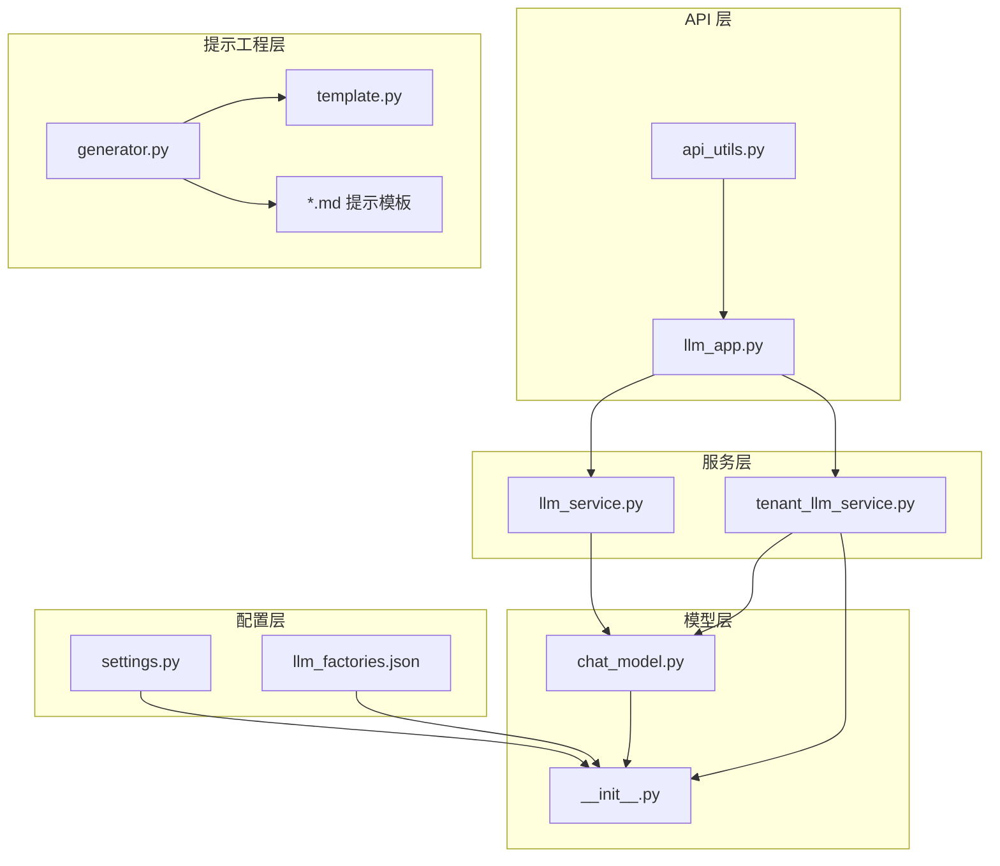
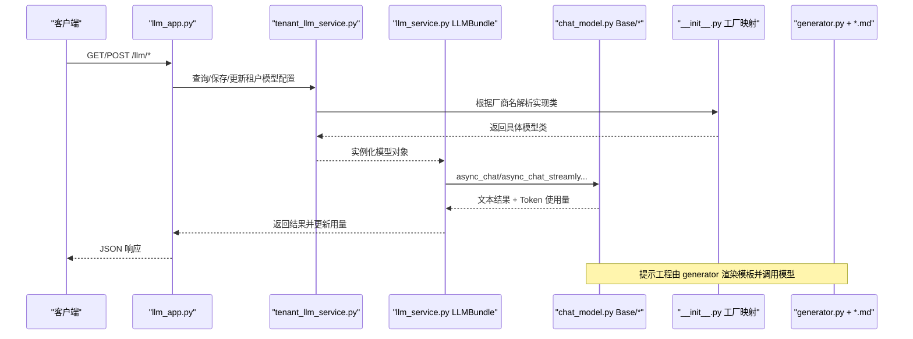
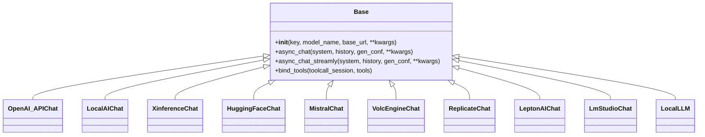
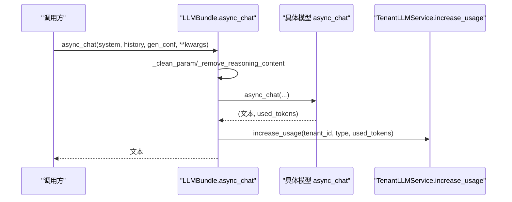
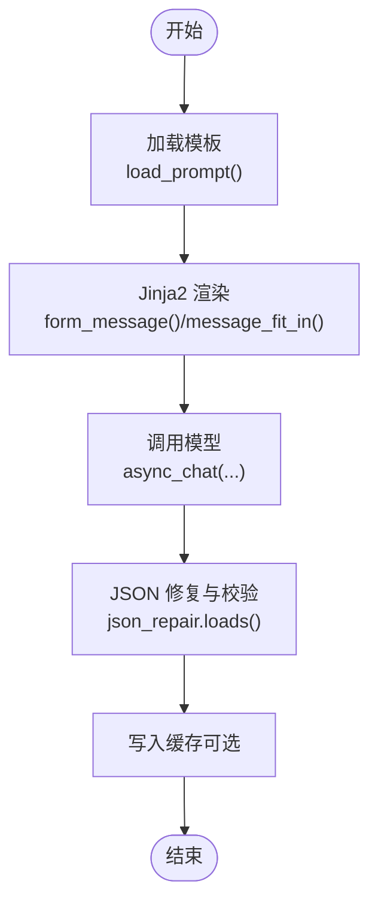
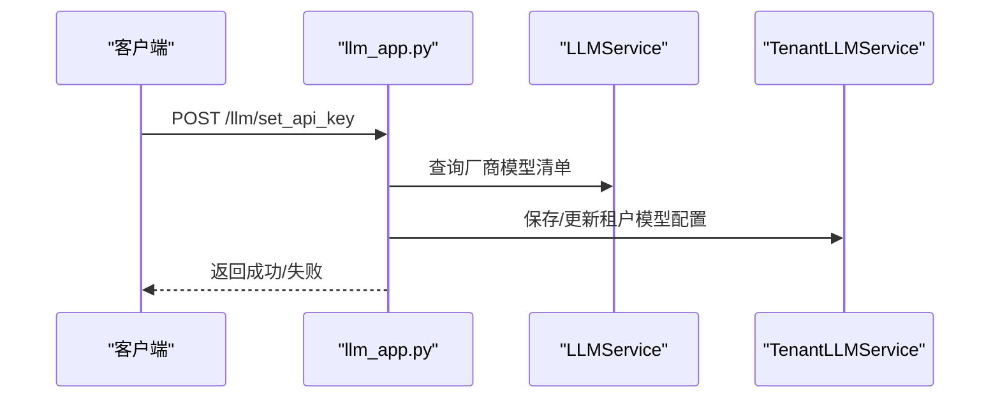
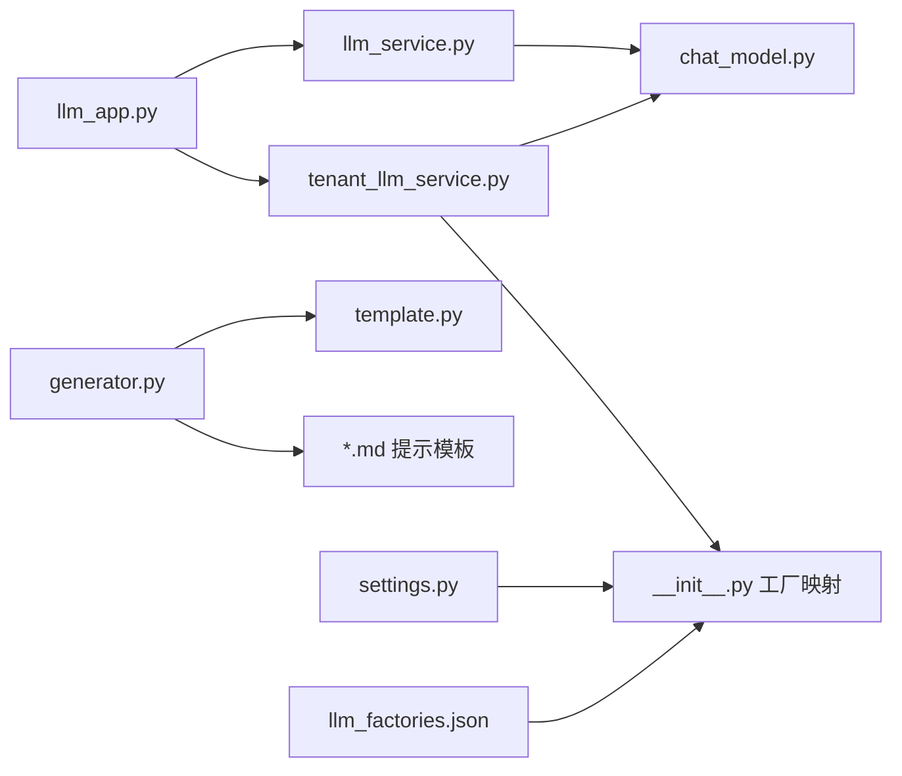
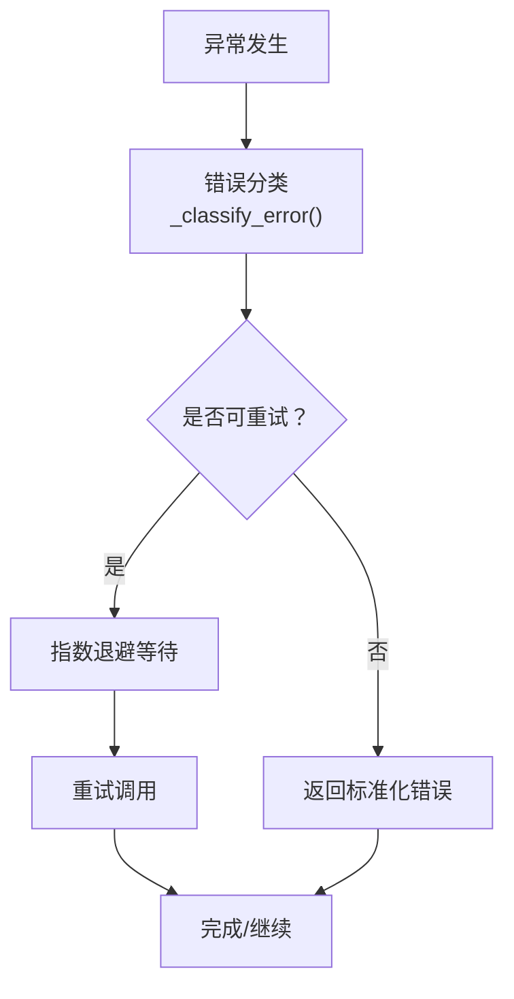

# 生成模型集成

<cite>
**本文引用的文件**
- [llm_app.py](file://api/apps/llm_app.py)
- [llm_service.py](file://api/db/services/llm_service.py)
- [tenant_llm_service.py](file://api/db/services/tenant_llm_service.py)
- [chat_model.py](file://rag/llm/chat_model.py)
- [__init__.py](file://rag/llm/__init__.py)
- [generator.py](file://rag/prompts/generator.py)
- [template.py](file://rag/prompts/template.py)
- [full_question_prompt.md](file://rag/prompts/full_question_prompt.md)
- [question_prompt.md](file://rag/prompts/question_prompt.md)
- [citation_prompt.md](file://rag/prompts/citation_prompt.md)
- [structured_output_prompt.md](file://rag/prompts/structured_output_prompt.md)
- [vision_llm_describe_prompt.md](file://rag/prompts/vision_llm_describe_prompt.md)
- [settings.py](file://common/settings.py)
- [api_utils.py](file://api/utils/api_utils.py)
- [llm_factories.json](file://conf/llm_factories.json)
</cite>

## 目录
1. [引言](#引言)
2. [项目结构](#项目结构)
3. [核心组件](#核心组件)
4. [架构总览](#架构总览)
5. [详细组件分析](#详细组件分析)
6. [依赖关系分析](#依赖关系分析)
7. [性能考虑](#性能考虑)
8. [故障排查指南](#故障排查指南)
9. [结论](#结论)
10. [附录](#附录)

## 引言
本技术文档围绕“生成模型集成”主题，系统梳理 RAGFlow 中多模态生成模型的架构与实现，覆盖文本生成、对话系统、视觉理解（图像转文本）、语音识别（ASR）、重排、嵌入、TTS、OCR 等能力的统一接入与编排。重点包括：
- 提示工程与模板系统：动态提示生成、上下文管理、输出格式控制（如结构化 JSON 输出）。
- 多 LLM 供应商适配：OpenAI、Anthropic、阿里 Dashscope、xAI、Zhipu、Ollama、Azure OpenAI、OpenRouter 等。
- 生成参数配置与优化：温度、最大长度、停止序列、采样策略、工具调用、流式输出。
- 质量评估与优化：去重、连贯性检查、事实准确性验证、缓存与重试机制。
- 集成示例与最佳实践：如何在系统中选择与使用合适的模型、如何进行参数调优与错误处理。

## 项目结构
生成模型集成相关的关键目录与文件如下：
- API 层：负责对外暴露 LLM 工厂、密钥配置、模型列表查询、启用/禁用等接口。
- 服务层：封装租户维度的模型实例化、用量统计、默认模型配置。
- 模型层：统一的 Chat/CV/Embedding/Rerank/Seq2txt/TTS/Ocr 抽象与工厂映射。
- 提示工程层：基于 Jinja2 的模板加载与渲染，支持结构化输出、引用标注、跨语言翻译、TOC 提取等任务。
- 配置层：LLM 厂商清单、默认基础地址、环境变量与常量。

**图示来源**
- [llm_app.py:1-410](file://api/apps/llm_app.py#L1-L410)
- [llm_service.py:1-516](file://api/db/services/llm_service.py#L1-L516)
- [tenant_llm_service.py:1-403](file://api/db/services/tenant_llm_service.py#L1-L403)
- [chat_model.py:1-800](file://rag/llm/chat_model.py#L1-L800)
- [__init__.py:1-186](file://rag/llm/__init__.py#L1-L186)
- [generator.py:1-800](file://rag/prompts/generator.py#L1-L800)
- [template.py:1-20](file://rag/prompts/template.py#L1-L20)
- [settings.py:169-200](file://common/settings.py#L169-L200)
- [llm_factories.json:1-800](file://conf/llm_factories.json#L1-L800)

**章节来源**
- [llm_app.py:1-410](file://api/apps/llm_app.py#L1-L410)
- [llm_service.py:1-516](file://api/db/services/llm_service.py#L1-L516)
- [tenant_llm_service.py:1-403](file://api/db/services/tenant_llm_service.py#L1-L403)
- [chat_model.py:1-800](file://rag/llm/chat_model.py#L1-L800)
- [__init__.py:1-186](file://rag/llm/__init__.py#L1-L186)
- [generator.py:1-800](file://rag/prompts/generator.py#L1-L800)
- [template.py:1-20](file://rag/prompts/template.py#L1-L20)
- [settings.py:169-200](file://common/settings.py#L169-L200)
- [llm_factories.json:1-800](file://conf/llm_factories.json#L1-L800)

## 核心组件
- LLM 工厂与适配器
  - 统一通过工厂映射注册各厂商实现，支持 OpenAI、Anthropic、阿里、xAI、Zhipu、Ollama、Azure OpenAI、OpenRouter 等。
  - 支持本地部署（LocalAI、HuggingFace、VLLM、Ollama、LM Studio、GPUStack）与兼容 OpenAI 接口的自建服务。
- LLMBundle 与租户模型实例
  - 封装模型实例化、参数清洗、流式/非流式对话、工具调用、Token 计数与用量统计、Langfuse 追踪。
- 提示工程与模板系统
  - 基于 Jinja2 的模板加载与渲染，内置关键词抽取、问题生成、跨语言翻译、引用标注、结构化输出、TOC 提取等任务模板。
- API 与配置
  - 对外提供工厂枚举、密钥设置、模型添加/删除/启用、可用模型列表查询；从配置文件加载厂商清单与默认基础地址。

**章节来源**
- [chat_model.py:1-800](file://rag/llm/chat_model.py#L1-L800)
- [__init__.py:1-186](file://rag/llm/__init__.py#L1-L186)
- [llm_service.py:85-516](file://api/db/services/llm_service.py#L85-L516)
- [tenant_llm_service.py:34-403](file://api/db/services/tenant_llm_service.py#L34-L403)
- [generator.py:1-800](file://rag/prompts/generator.py#L1-L800)
- [template.py:1-20](file://rag/prompts/template.py#L1-L20)
- [llm_app.py:1-410](file://api/apps/llm_app.py#L1-L410)
- [settings.py:169-200](file://common/settings.py#L169-L200)
- [llm_factories.json:1-800](file://conf/llm_factories.json#L1-L800)

## 架构总览
下图展示从 API 到模型层、再到提示工程与配置的整体调用链路与职责分工。

**图示来源**
- [llm_app.py:31-410](file://api/apps/llm_app.py#L31-L410)
- [tenant_llm_service.py:134-182](file://api/db/services/tenant_llm_service.py#L134-L182)
- [llm_service.py:85-516](file://api/db/services/llm_service.py#L85-L516)
- [chat_model.py:484-496](file://rag/llm/chat_model.py#L484-L496)
- [__init__.py:147-175](file://rag/llm/__init__.py#L147-L175)
- [generator.py:488-559](file://rag/prompts/generator.py#L488-L559)

## 详细组件分析

### 组件一：多 LLM 供应商适配与工厂映射
- 工厂映射
  - 通过扫描包内类，将 Base 的子类与 LiteLLMBase 的子类注册到对应工厂字典（ChatModel、CvModel、EmbeddingModel、RerankModel、Seq2txtModel、TTSModel、OcrModel）。
  - 支持单个或多个厂商名（如 VLLM、OpenAI-API-Compatible），统一以 _FACTORY_NAME 标识。
- 默认基础地址与前缀
  - 为多家厂商提供默认 base_url 与 provider 前缀，便于 LiteLLM 兼容调用。
- 本地与兼容服务
  - LocalAI、HuggingFace、VLLM、Ollama、LM Studio、GPUStack 等本地部署场景通过 OpenAI 兼容端点接入。
  - Azure OpenAI、OpenRouter、Anthropic、Dashscope 等通过各自 SDK 或 OpenAI 客户端接入。

**图示来源**
- [chat_model.py:65-87](file://rag/llm/chat_model.py#L65-L87)
- [chat_model.py:745-753](file://rag/llm/chat_model.py#L745-L753)
- [chat_model.py:604-615](file://rag/llm/chat_model.py#L604-L615)
- [chat_model.py:499-507](file://rag/llm/chat_model.py#L499-L507)
- [chat_model.py:509-517](file://rag/llm/chat_model.py#L509-L517)
- [chat_model.py:664-677](file://rag/llm/chat_model.py#L664-L677)
- [chat_model.py:764-774](file://rag/llm/chat_model.py#L764-L774)
- [chat_model.py:755-762](file://rag/llm/chat_model.py#L755-L762)
- [chat_model.py:733-743](file://rag/llm/chat_model.py#L733-L743)
- [chat_model.py:617-662](file://rag/llm/chat_model.py#L617-L662)

**章节来源**
- [__init__.py:62-124](file://rag/llm/__init__.py#L62-L124)
- [__init__.py:135-175](file://rag/llm/__init__.py#L135-L175)
- [chat_model.py:1-800](file://rag/llm/chat_model.py#L1-L800)

### 组件二：LLMBundle 与租户模型实例
- 统一入口
  - LLMBundle 根据租户 ID、模型类型与名称，从 TenantLLMService 获取配置并实例化具体模型。
- 参数清洗与生成配置
  - _clean_conf 会根据模型名称过滤不兼容参数（如部分 gpt-5 系列清理 max_tokens），确保下游调用稳定。
- 流式与非流式对话
  - 支持 async_chat、async_chat_streamly、async_chat_streamly_delta，自动处理推理内容包裹<think>...</think>与工具调用 verbose 输出。
- Token 统计与用量更新
  - 所有模型操作后，通过 TenantLLMService.increase_usage 更新租户 Token 使用量。
- Langfuse 追踪
  - 可选开启 Langfuse 追踪，记录生成过程的输入、输出与 Token 使用。

**图示来源**
- [llm_service.py:395-429](file://api/db/services/llm_service.py#L395-L429)
- [llm_service.py:431-515](file://api/db/services/llm_service.py#L431-L515)
- [llm_service.py:182-219](file://api/db/services/llm_service.py#L182-L219)

**章节来源**
- [llm_service.py:85-516](file://api/db/services/llm_service.py#L85-L516)
- [tenant_llm_service.py:378-403](file://api/db/services/tenant_llm_service.py#L378-L403)

### 组件三：提示工程与模板系统
- 模板加载
  - template.py 提供 load_prompt，按名称从 prompts/ 目录加载 .md 文件内容。
- 动态提示生成
  - generator.py 提供多种任务的提示模板渲染函数，如关键词抽取、问题生成、跨语言翻译、内容标注、结构化输出、TOC 提取等。
- 上下文管理
  - message_fit_in 与 kb_prompt、memory_prompt 等函数负责上下文长度裁剪与知识块拼接，避免超出模型上下文窗口。
- 输出格式控制
  - structured_output_prompt 指导模型输出 JSON，并通过 gen_json 与 json_repair 保证输出可解析性。
- 引用标注
  - citation_prompt.md 定义引用规范，指导模型在事实性陈述处添加引用标记，提升事实准确性。

**图示来源**
- [generator.py:488-559](file://rag/prompts/generator.py#L488-L559)
- [generator.py:175-176](file://rag/prompts/generator.py#L175-L176)
- [generator.py:62-96](file://rag/prompts/generator.py#L62-L96)
- [template.py:8-19](file://rag/prompts/template.py#L8-L19)

**章节来源**
- [generator.py:1-800](file://rag/prompts/generator.py#L1-L800)
- [template.py:1-20](file://rag/prompts/template.py#L1-L20)
- [full_question_prompt.md:1-63](file://rag/prompts/full_question_prompt.md#L1-L63)
- [question_prompt.md:1-20](file://rag/prompts/question_prompt.md#L1-L20)
- [citation_prompt.md:1-110](file://rag/prompts/citation_prompt.md#L1-L110)
- [structured_output_prompt.md:1-16](file://rag/prompts/structured_output_prompt.md#L1-L16)
- [vision_llm_describe_prompt.md:1-24](file://rag/prompts/vision_llm_describe_prompt.md#L1-L24)

### 组件四：API 与配置
- 工厂枚举与可用模型列表
  - /factories 返回允许的 LLM 工厂及其支持的模型类型；/list 返回当前租户可用模型集合。
- 密钥设置与可用性测试
  - /set_api_key 对嵌入、对话、重排等进行连通性测试，失败时返回错误信息。
- 模型添加/删除/启用
  - /add_llm、/delete_llm、/enable_llm 支持按厂商特殊组装认证参数（如 VolcEngine、Tencent、Bedrock、Azure-OpenAI 等）。
- 配置加载
  - settings.init_settings 从 conf/llm_factories.json 加载厂商清单与默认基础地址；支持环境变量覆盖。

**图示来源**
- [llm_app.py:31-126](file://api/apps/llm_app.py#L31-L126)
- [llm_app.py:128-297](file://api/apps/llm_app.py#L128-L297)
- [llm_service.py:32-83](file://api/db/services/llm_service.py#L32-L83)
- [tenant_llm_service.py:34-133](file://api/db/services/tenant_llm_service.py#L34-L133)

**章节来源**
- [llm_app.py:1-410](file://api/apps/llm_app.py#L1-L410)
- [llm_service.py:1-83](file://api/db/services/llm_service.py#L1-L83)
- [tenant_llm_service.py:1-133](file://api/db/services/tenant_llm_service.py#L1-L133)
- [settings.py:169-200](file://common/settings.py#L169-L200)
- [llm_factories.json:1-800](file://conf/llm_factories.json#L1-L800)

## 依赖关系分析
- 模块耦合
  - API 层仅依赖服务层；服务层依赖模型层与配置层；模型层依赖工厂映射与外部 SDK；提示工程独立但被业务流程调用。
- 外部依赖
  - OpenAI、litellm、第三方厂商 SDK（如 Mistral、Replicate、LeptonAI 等）。
- 循环依赖
  - 未发现直接循环导入；工厂映射在运行时扫描注册，避免静态循环。

**图示来源**
- [llm_app.py:1-410](file://api/apps/llm_app.py#L1-L410)
- [llm_service.py:1-516](file://api/db/services/llm_service.py#L1-L516)
- [tenant_llm_service.py:1-403](file://api/db/services/tenant_llm_service.py#L1-L403)
- [chat_model.py:1-800](file://rag/llm/chat_model.py#L1-L800)
- [__init__.py:1-186](file://rag/llm/__init__.py#L1-L186)
- [generator.py:1-800](file://rag/prompts/generator.py#L1-L800)
- [template.py:1-20](file://rag/prompts/template.py#L1-L20)
- [settings.py:169-200](file://common/settings.py#L169-L200)
- [llm_factories.json:1-800](file://conf/llm_factories.json#L1-L800)

**章节来源**
- [llm_app.py:1-410](file://api/apps/llm_app.py#L1-L410)
- [llm_service.py:1-516](file://api/db/services/llm_service.py#L1-L516)
- [tenant_llm_service.py:1-403](file://api/db/services/tenant_llm_service.py#L1-L403)
- [chat_model.py:1-800](file://rag/llm/chat_model.py#L1-L800)
- [__init__.py:1-186](file://rag/llm/__init__.py#L1-L186)
- [generator.py:1-800](file://rag/prompts/generator.py#L1-L800)
- [template.py:1-20](file://rag/prompts/template.py#L1-L20)
- [settings.py:169-200](file://common/settings.py#L169-L200)
- [llm_factories.json:1-800](file://conf/llm_factories.json#L1-L800)

## 性能考虑
- Token 控制与上下文裁剪
  - 在编码、相似度计算、对话前对输入进行分词长度检查与裁剪，避免超长请求导致失败或性能下降。
- 流式输出
  - 提供 async_chat_streamly 与 async_chat_streamly_delta，降低首字节延迟，改善用户体验。
- 重试与退避
  - 统一的异常分类与指数退避重试逻辑，针对限流、服务器错误等可重试错误自动重试。
- 缓存与并发
  - 结构化输出场景使用 LLM 缓存减少重复调用；TOC 提取等任务使用并发限制器控制并发。
- 本地部署优化
  - LocalAI、VLLM、Ollama 等本地服务通过 OpenAI 兼容端点接入，减少适配成本；可根据硬件资源调整批大小与并发。

**章节来源**
- [llm_service.py:95-176](file://api/db/services/llm_service.py#L95-L176)
- [llm_service.py:431-515](file://api/db/services/llm_service.py#L431-L515)
- [chat_model.py:212-253](file://rag/llm/chat_model.py#L212-L253)
- [generator.py:488-559](file://rag/prompts/generator.py#L488-L559)

## 故障排查指南
- 常见错误分类
  - 速率限制、鉴权失败、无效请求、服务器错误、连接错误、内容过滤、配额超限、最大重试次数等。
- 错误处理流程
  - 同步/异步路径均通过 _exceptions/_exceptions_async 分类错误码，必要时触发指数退避重试；最终返回标准化错误消息。
- API 层诊断
  - /set_api_key 会尝试访问嵌入、对话、重排等接口，若任一失败则返回具体错误信息，便于定位厂商或模型问题。
- 日志与追踪
  - Langfuse 追踪可选开启，便于端到端观测生成过程；模型层记录 Token 使用量与错误详情。

**图示来源**
- [chat_model.py:91-110](file://rag/llm/chat_model.py#L91-L110)
- [chat_model.py:222-253](file://rag/llm/chat_model.py#L222-L253)
- [llm_app.py:64-105](file://api/apps/llm_app.py#L64-L105)

**章节来源**
- [chat_model.py:1-800](file://rag/llm/chat_model.py#L1-L800)
- [llm_app.py:1-410](file://api/apps/llm_app.py#L1-L410)

## 结论
本集成方案通过统一的工厂映射与 LLMBundle 封装，实现了多厂商、多模态生成模型的一致接入与编排。配合完善的提示工程、参数清洗、流式输出、重试与缓存机制，既满足了生产级稳定性要求，也为后续扩展新的模型与厂商提供了清晰的扩展点。建议在实际部署中结合业务场景对温度、最大长度、停止序列等参数进行灰度调优，并利用 Langfuse 与缓存策略持续优化生成质量与性能。

## 附录
- 集成示例（步骤）
  - 在后台配置厂商与密钥：调用 /llm/set_api_key，系统会自动测试嵌入/对话/重排可用性。
  - 添加模型：调用 /llm/add_llm，按厂商组装认证参数（如 VolcEngine、Azure-OpenAI 等）。
  - 使用模型：通过 LLMBundle.async_chat 或 async_chat_streamly 发起对话；需要工具调用时绑定工具并启用 verbose。
  - 结构化输出：使用 structured_output_prompt 与 gen_json，确保输出可解析。
- 最佳实践
  - 参数清洗：优先使用 _clean_conf 过滤不兼容参数；对 gpt-5 系列特别处理。
  - 上下文控制：使用 message_fit_in 与 kb_prompt 控制上下文长度，避免超限。
  - 错误处理：统一捕获与分类错误，对可重试错误采用指数退避。
  - 质量保障：使用 citation_prompt 规范引用；对 JSON 输出使用 json_repair 修复；必要时启用缓存。