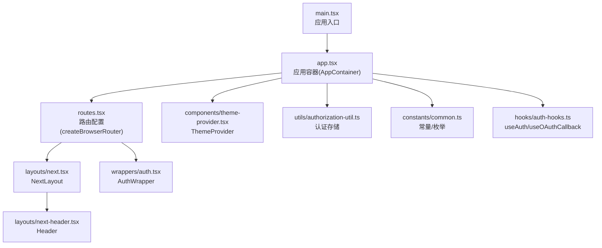
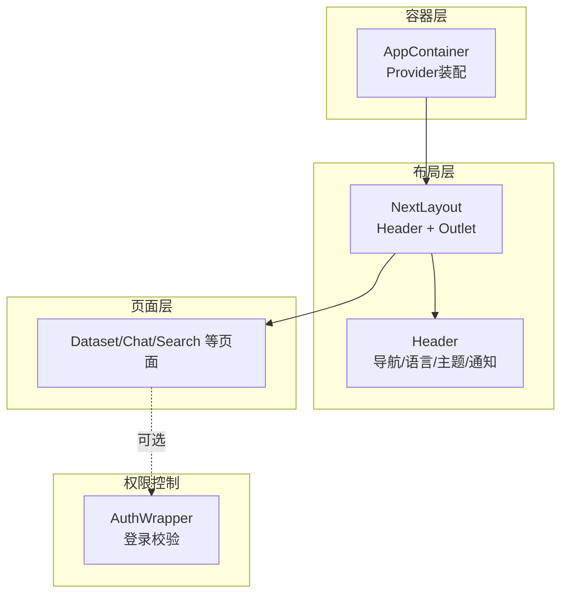
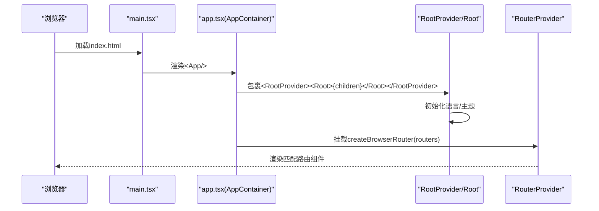
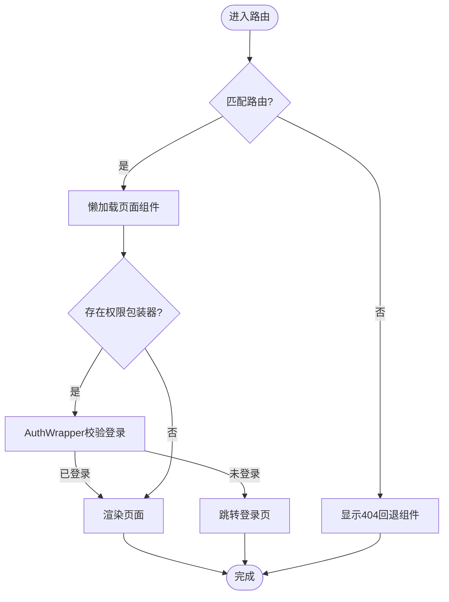
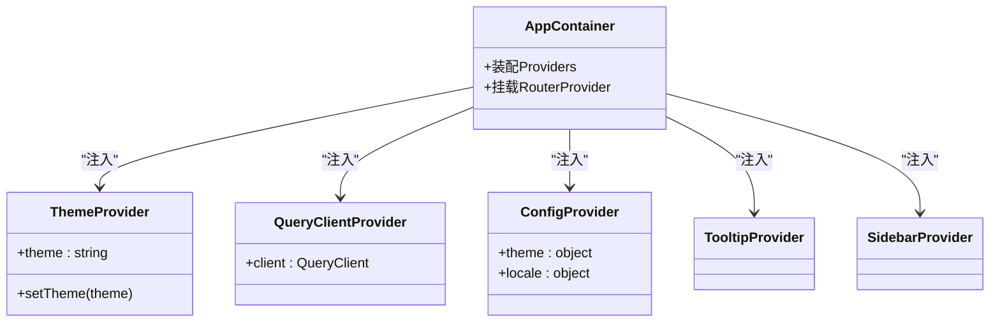
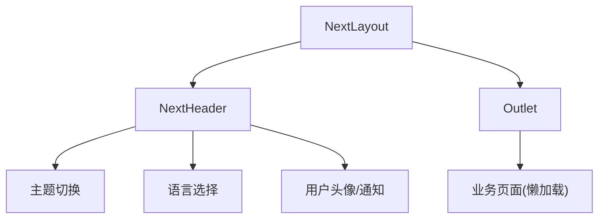
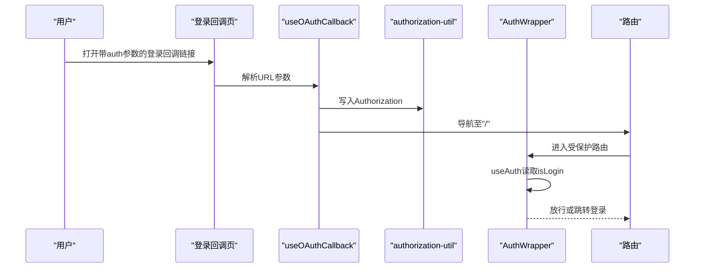
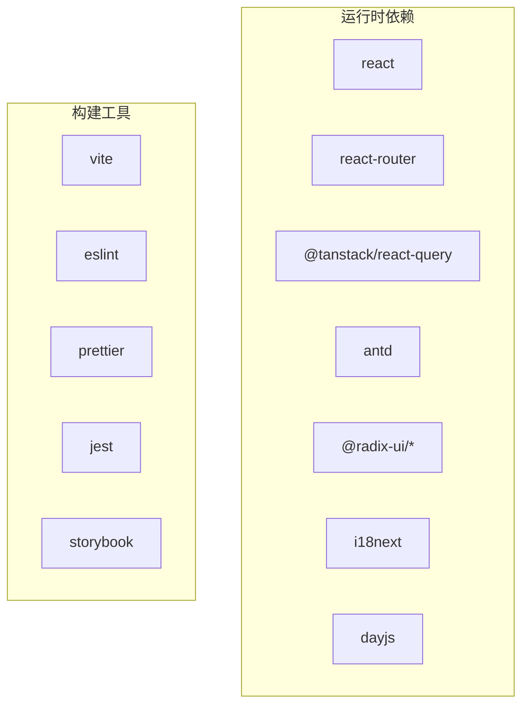

# React架构设计

<cite>
**本文引用的文件**
- [main.tsx](file://web/src/main.tsx)
- [app.tsx](file://web/src/app.tsx)
- [routes.tsx](file://web/src/routes.tsx)
- [next.tsx](file://web/src/layouts/next.tsx)
- [next-header.tsx](file://web/src/layouts/next-header.tsx)
- [auth.tsx](file://web/src/wrappers/auth.tsx)
- [theme-provider.tsx](file://web/src/components/theme-provider.tsx)
- [authorization-util.ts](file://web/src/utils/authorization-util.ts)
- [common.ts](file://web/src/constants/common.ts)
- [auth-hooks.ts](file://web/src/hooks/auth-hooks.ts)
- [package.json](file://web/package.json)
- [vite.config.ts](file://web/vite.config.ts)
</cite>

## 目录
1. [引言](#引言)
2. [项目结构](#项目结构)
3. [核心组件](#核心组件)
4. [架构总览](#架构总览)
5. [详细组件分析](#详细组件分析)
6. [依赖分析](#依赖分析)
7. [性能考虑](#性能考虑)
8. [故障排查指南](#故障排查指南)
9. [结论](#结论)
10. [附录](#附录)

## 引言
本技术文档面向RAGFlow前端React应用，系统性阐述其架构设计与实现要点，覆盖根组件与应用容器、路由系统与权限控制、Provider体系、组件分层、性能优化策略以及开发最佳实践。读者可据此快速理解并高效扩展前端功能。

## 项目结构
前端采用Vite构建，基于React 18与React Router v7，使用Ant Design作为UI基础库，并通过TailwindCSS与Less进行样式管理。应用入口位于web/src，核心文件包括：
- 入口与应用容器：main.tsx、app.tsx
- 路由定义：routes.tsx
- 布局与头部：layouts/next.tsx、layouts/next-header.tsx
- 权限包装器：wrappers/auth.tsx
- 主题Provider：components/theme-provider.tsx
- 认证工具：utils/authorization-util.ts
- 常量与枚举：constants/common.ts
- 认证Hook：hooks/auth-hooks.ts
- 构建配置：package.json、vite.config.ts

图表来源
- [main.tsx:1-14](file://web/src/main.tsx#L1-L14)
- [app.tsx:1-162](file://web/src/app.tsx#L1-L162)
- [routes.tsx:1-451](file://web/src/routes.tsx#L1-L451)
- [next.tsx:1-12](file://web/src/layouts/next.tsx#L1-L12)
- [next-header.tsx:1-203](file://web/src/layouts/next-header.tsx#L1-L203)
- [auth.tsx:1-15](file://web/src/wrappers/auth.tsx#L1-L15)
- [theme-provider.tsx:1-84](file://web/src/components/theme-provider.tsx#L1-L84)
- [authorization-util.ts:1-66](file://web/src/utils/authorization-util.ts#L1-L66)
- [common.ts:1-193](file://web/src/constants/common.ts#L1-L193)
- [auth-hooks.ts:1-55](file://web/src/hooks/auth-hooks.ts#L1-L55)

章节来源
- [main.tsx:1-14](file://web/src/main.tsx#L1-L14)
- [app.tsx:1-162](file://web/src/app.tsx#L1-L162)
- [routes.tsx:1-451](file://web/src/routes.tsx#L1-L451)

## 核心组件
- 应用入口(main.tsx)：挂载StrictMode与开发者调试工具，渲染App根组件。
- 应用容器(app.tsx)：统一注入主题、国际化、查询客户端、侧边栏Provider与全局提示组件；导出AppContainer作为最终根组件。
- 路由系统(routes.tsx)：集中定义路由表、懒加载页面、错误回退组件、嵌套路由与权限包装器。
- 布局(next.tsx)：提供NextLayout，承载Header与Outlet。
- 权限包装器(wrappers/auth.tsx)：基于useAuth判断登录状态，决定是否放行或跳转登录。
- 主题Provider(components/theme-provider.tsx)：提供主题切换与持久化能力。
- 认证工具(utils/authorization-util.ts)：封装本地存储键值、语言设置与重定向逻辑。
- 常量(common.ts)：主题枚举、语言映射、文件类型等常量定义。
- 认证Hook(auth-hooks.ts)：处理OAuth回调参数、读取授权信息与登录状态。

章节来源
- [main.tsx:1-14](file://web/src/main.tsx#L1-L14)
- [app.tsx:1-162](file://web/src/app.tsx#L1-L162)
- [routes.tsx:1-451](file://web/src/routes.tsx#L1-L451)
- [next.tsx:1-12](file://web/src/layouts/next.tsx#L1-L12)
- [auth.tsx:1-15](file://web/src/wrappers/auth.tsx#L1-L15)
- [theme-provider.tsx:1-84](file://web/src/components/theme-provider.tsx#L1-L84)
- [authorization-util.ts:1-66](file://web/src/utils/authorization-util.ts#L1-L66)
- [common.ts:1-193](file://web/src/constants/common.ts#L1-L193)
- [auth-hooks.ts:1-55](file://web/src/hooks/auth-hooks.ts#L1-L55)

## 架构总览
React应用采用“容器-布局-页面”三层结构：
- 容器层：AppContainer负责Provider装配与路由挂载。
- 布局层：NextLayout承载Header与Outlet，支撑页面级路由。
- 页面层：按需懒加载的业务页面，支持权限包装器与错误回退。

图表来源
- [app.tsx:144-161](file://web/src/app.tsx#L144-L161)
- [next.tsx:1-12](file://web/src/layouts/next.tsx#L1-L12)
- [next-header.tsx:1-203](file://web/src/layouts/next-header.tsx#L1-L203)
- [auth.tsx:1-15](file://web/src/wrappers/auth.tsx#L1-L15)

## 详细组件分析

### 初始化流程与生命周期（main.tsx → AppContainer）
- 入口渲染：在StrictMode下挂载Inspector与App根组件。
- 容器装配：AppContainer内依次注入TooltipProvider、QueryClientProvider、ThemeProvider、RootProvider，再挂载RouterProvider。
- 国际化与主题：Root中根据当前主题与语言设置Ant Design主题算法与语言包；RootProvider在首次挂载时从本地存储恢复语言。
- 生命周期：RootProvider在mount阶段执行一次语言初始化；后续通过i18n事件监听更新语言并持久化。

图表来源
- [main.tsx:1-14](file://web/src/main.tsx#L1-L14)
- [app.tsx:121-161](file://web/src/app.tsx#L121-L161)

章节来源
- [main.tsx:1-14](file://web/src/main.tsx#L1-L14)
- [app.tsx:80-161](file://web/src/app.tsx#L80-L161)

### 路由系统与导航机制（routes.tsx）
- 路由表：集中定义路径、懒加载组件、错误回退组件与嵌套关系。
- 动态路由：支持带参数路径（如/:id），用于详情页与分享页。
- 权限控制：通过wrappers字段挂载AuthWrapper，未登录自动跳转登录页。
- 基础路径：basename来自环境变量VITE_BASE_URL，默认“/”。

图表来源
- [routes.tsx:68-443](file://web/src/routes.tsx#L68-L443)
- [auth.tsx:1-15](file://web/src/wrappers/auth.tsx#L1-L15)

章节来源
- [routes.tsx:1-451](file://web/src/routes.tsx#L1-L451)
- [auth.tsx:1-15](file://web/src/wrappers/auth.tsx#L1-L15)

### Provider体系与配置
- QueryClientProvider：全局查询客户端，支持缓存、重试与开发工具。
- ThemeProvider：主题上下文，支持本地存储与类名同步。
- ConfigProvider（Ant Design）：统一注入主题算法与语言包，适配多语言。
- TooltipProvider：Radix UI工具提示上下文。
- SidebarProvider：侧边栏布局上下文。

图表来源
- [app.tsx:121-142](file://web/src/app.tsx#L121-L142)
- [theme-provider.tsx:22-50](file://web/src/components/theme-provider.tsx#L22-L50)

章节来源
- [app.tsx:80-142](file://web/src/app.tsx#L80-L142)
- [theme-provider.tsx:1-84](file://web/src/components/theme-provider.tsx#L1-L84)

### 组件层次结构
- 布局组件：NextLayout负责整体结构与Header；NextHeader提供导航、语言选择、主题切换、用户头像等。
- 业务组件：各页面模块（数据集、聊天、搜索、代理等）按需懒加载。
- UI组件：基于Ant Design与Radix UI的通用组件，通过ThemeProvider与ConfigProvider统一风格。

图表来源
- [next.tsx:1-12](file://web/src/layouts/next.tsx#L1-L12)
- [next-header.tsx:1-203](file://web/src/layouts/next-header.tsx#L1-L203)

章节来源
- [next.tsx:1-12](file://web/src/layouts/next.tsx#L1-L12)
- [next-header.tsx:1-203](file://web/src/layouts/next-header.tsx#L1-L203)

### 权限控制与动态路由加载
- OAuth回调：useOAuthCallback解析URL参数，成功后写入本地存储并重定向首页。
- 登录状态：useAuth基于本地存储与回调参数计算isLogin。
- 跳转逻辑：AuthWrapper根据isLogin决定放行或跳转登录页。

图表来源
- [auth-hooks.ts:1-55](file://web/src/hooks/auth-hooks.ts#L1-L55)
- [authorization-util.ts:1-66](file://web/src/utils/authorization-util.ts#L1-L66)
- [auth.tsx:1-15](file://web/src/wrappers/auth.tsx#L1-L15)

章节来源
- [auth-hooks.ts:1-55](file://web/src/hooks/auth-hooks.ts#L1-L55)
- [authorization-util.ts:1-66](file://web/src/utils/authorization-util.ts#L1-L66)
- [auth.tsx:1-15](file://web/src/wrappers/auth.tsx#L1-L15)

## 依赖分析
- React生态：React 18、React Router v7、React Query（TanStack）、i18n、Day.js。
- UI生态：Ant Design、Radix UI、Sonner、Toaster。
- 构建与工具：Vite、ESLint、Prettier、Jest、Storybook。

图表来源
- [package.json:25-132](file://web/package.json#L25-L132)
- [package.json:134-190](file://web/package.json#L134-L190)

章节来源
- [package.json:1-195](file://web/package.json#L1-L195)

## 性能考虑
- 代码分割与懒加载：路由级lazy按需加载页面，减少首屏体积。
- 分包策略：Rollup手动分块，将第三方库拆分为独立chunk（如utils、d3、antv等），提升缓存命中率。
- 构建优化：Terser压缩、去除console与debugger、禁用注释、CSS代码拆分。
- 依赖预优化：optimizeDeps预打包常用库，加速开发启动。
- 图片与静态资源：静态拷贝Monaco Editor与配置注入HTML标题。

章节来源
- [routes.tsx:1-451](file://web/src/routes.tsx#L1-L451)
- [vite.config.ts:103-161](file://web/vite.config.ts#L103-L161)

## 故障排查指南
- 登录跳转异常：确认authorization-util中的redirectToLogin目标路径与实际登录路由一致。
- 语言不生效：检查RootProvider在mount阶段的语言初始化逻辑与i18n事件监听。
- 主题切换无效：确认ThemeProvider上下文包裹范围与useTheme调用位置。
- 路由404：检查routes.tsx中的回退组件与路径匹配规则。
- 构建产物缺失：核对vite.config.ts中静态拷贝与分包输出配置。

章节来源
- [authorization-util.ts:62-66](file://web/src/utils/authorization-util.ts#L62-L66)
- [app.tsx:121-142](file://web/src/app.tsx#L121-L142)
- [theme-provider.tsx:52-59](file://web/src/components/theme-provider.tsx#L52-L59)
- [routes.tsx:3-115](file://web/src/routes.tsx#L3-L115)
- [vite.config.ts:16-36](file://web/vite.config.ts#L16-L36)

## 结论
该React应用以清晰的容器-布局-页面分层、完善的Provider体系与路由权限控制为核心，结合Vite的现代构建链路与按需懒加载策略，在保证开发体验的同时兼顾了生产性能。建议在后续迭代中持续完善错误边界、国际化与主题一致性，并保持分包策略与依赖版本的稳定性。

## 附录
- 开发最佳实践
  - 组件设计：遵循单一职责，优先使用受控组件与Form Hook。
  - 命名规范：文件与组件采用帕斯卡命名，样式类使用BEM或Tailwind原子类。
  - 错误边界：为关键页面添加错误回退组件，避免整页崩溃。
  - 主题与国际化：通过ThemeProvider与ConfigProvider集中管理，确保全局一致性。
  - 性能：继续利用lazy与分包策略，避免一次性引入大体量依赖。