# UI组件系统

<cite>
**本文引用的文件**
- [web/package.json](file://web/package.json)
- [web/src/app.tsx](file://web/src/app.tsx)
- [web/src/components/theme-provider.tsx](file://web/src/components/theme-provider.tsx)
- [web/src/components/json-edit/index.tsx](file://web/src/components/json-edit/index.tsx)
- [web/src/components/jsonjoy-builder/index.tsx](file://web/src/components/jsonjoy-builder/index.tsx)
- [web/src/components/xyflow/index.tsx](file://web/src/components/xyflow/index.tsx)
- [web/src/components/line-chart/index.tsx](file://web/src/components/line-chart/index.tsx)
- [web/src/components/document-preview/csv-preview.tsx](file://web/src/components/document-preview/csv-preview.tsx)
- [web/src/components/document-preview/doc-preview.tsx](file://web/src/components/document-preview/doc-preview.tsx)
- [web/src/components/document-preview/image-preview.tsx](file://web/src/components/document-preview/image-preview.tsx)
- [web/src/components/pdf-previewer/index.tsx](file://web/src/components/pdf-previewer/index.tsx)
- [web/src/components/pdf-drawer/index.tsx](file://web/src/components/pdf-drawer/index.tsx)
- [web/src/components/prompt-editor/index.tsx](file://web/src/components/prompt-editor/index.tsx)
- [web/src/components/message-item/index.tsx](file://web/src/components/message-item/index.tsx)
- [web/src/components/message-input/index.tsx](file://web/src/components/message-input/index.tsx)
- [web/src/components/next-message-item/index.tsx](file://web/src/components/next-message-item/index.tsx)
- [web/src/components/next-markdown-content/index.tsx](file://web/src/components/next-markdown-content/index.tsx)
- [web/src/components/markdown-content/index.tsx](file://web/src/components/markdown-content/index.tsx)
- [web/src/components/bulk-operate-bar.tsx](file://web/src/components/bulk-operate-bar.tsx)
- [web/src/components/form-container.tsx](file://web/src/components/form-container.tsx)
- [web/src/components/ragflow-form.tsx](file://web/src/components/ragflow-form.tsx)
- [web/src/components/dynamic-form.tsx](file://web/src/components/dynamic-form.tsx)
- [web/src/components/svg-icon.tsx](file://web/src/components/svg-icon.tsx)
- [web/src/components/icon-font.tsx](file://web/src/components/icon-font.tsx)
- [web/src/components/file-upload.tsx](file://web/src/components/file-upload.tsx)
- [web/src/components/file-uploader.tsx](file://web/src/components/file-uploader.tsx)
- [web/src/components/embed-container.tsx](file://web/src/components/embed-container.tsx)
- [web/src/components/embed-dialog/index.tsx](file://web/src/components/embed-dialog/index.tsx)
- [web/src/components/llm-select/index.tsx](file://web/src/components/llm-select/index.tsx)
- [web/src/components/llm-setting-items/index.tsx](file://web/src/components/llm-setting-items/index.tsx)
- [web/src/components/similarity-slider/index.tsx](file://web/src/components/similarity-slider/index.tsx)
- [web/src/components/metadata-filter/index.tsx](file://web/src/components/metadata-filter/index.tsx)
- [web/src/components/list-filter-bar/index.tsx](file://web/src/components/list-filter-bar/index.tsx)
- [web/src/components/chunk-method-dialog/index.tsx](file://web/src/components/chunk-method-dialog/index.tsx)
- [web/src/components/chunk-method-dialog/dynamic-page-range.tsx](file://web/src/components/chunk-method-dialog/dynamic-page-range.tsx)
- [web/src/components/parse-configuration/index.tsx](file://web/src/components/parse-configuration/index.tsx)
- [web/src/components/empty/index.tsx](file://web/src/components/empty/index.tsx)
- [web/src/components/fallback-component/index.tsx](file://web/src/components/fallback-component/index.tsx)
- [web/src/components/highlight-markdown/index.tsx](file://web/src/components/highlight-markdown/index.tsx)
- [web/src/components/indented-tree/index.tsx](file://web/src/components/indented-tree/index.tsx)
- [web/src/components/back-button/index.tsx](file://web/src/components/back-button/index.tsx)
- [web/src/components/canvas/index.tsx](file://web/src/components/canvas/index.tsx)
- [web/src/components/card-singleline-container/index.tsx](file://web/src/components/card-singleline-container/index.tsx)
- [web/src/components/edit-tag/index.tsx](file://web/src/components/edit-tag/index.tsx)
- [web/src/components/rename-dialog/index.tsx](file://web/src/components/rename-dialog/index.tsx)
- [web/src/components/file-icon/index.tsx](file://web/src/components/file-icon/index.tsx)
- [web/src/components/file-upload-dialog/index.tsx](file://web/src/components/file-upload-dialog/index.tsx)
- [web/src/components/confirm-delete-dialog/index.tsx](file://web/src/components/confirm-delete-dialog/index.tsx)
- [web/src/components/page-header/index.tsx](file://web/src/components/page-header/index.tsx)
- [web/src/components/home-card/index.tsx](file://web/src/components/home-card/index.tsx)
- [web/src/components/knowledge-base-item/index.tsx](file://web/src/components/knowledge-base-item/index.tsx)
- [web/src/components/spotlight/index.tsx](file://web/src/components/spotlight/index.tsx)
- [web/src/components/modal-manager.tsx](file://web/src/components/modal-manager.tsx)
- [web/src/components/collapse.tsx](file://web/src/components/collapse.tsx)
- [web/src/components/svg-icon.tsx](file://web/src/components/svg-icon.tsx)
- [web/src/components/icon-font.tsx](file://web/src/components/icon-font.tsx)
- [web/src/components/auto-keywords-form-field.tsx](file://web/src/components/auto-keywords-form-field.tsx)
- [web/src/components/avatar-upload.tsx](file://web/src/components/avatar-upload.tsx)
- [web/src/components/bool-segmented.tsx](file://web/src/components/bool-segmented.tsx)
- [web/src/components/children-delimiter-form.tsx](file://web/src/components/children-delimiter-form.tsx)
- [web/src/components/cross-language-form-field.tsx](file://web/src/components/cross-language-form-field.tsx)
- [web/src/components/dataset-configuration-container.tsx](file://web/src/components/dataset-configuration-container.tsx)
- [web/src/components/delimiter-form-field.tsx](file://web/src/components/delimiter-form-field.tsx)
- [web/src/components/entity-types-form-field.tsx](file://web/src/components/entity-types-form-field.tsx)
- [web/src/components/excel-to-html-form-field.tsx](file://web/src/components/excel-to-html-form-field.tsx)
- [web/src/components/feedback-dialog.tsx](file://web/src/components/feedback-dialog.tsx)
- [web/src/components/file-status-badge.tsx](file://web/src/components/file-status-badge.tsx)
- [web/src/components/large-model-form-field.tsx](file://web/src/components/large-model-form-field.tsx)
- [web/src/components/layout-recognize-form-field.tsx](file://web/src/components/layout-recognize-form-field.tsx)
- [web/src/components/logical-operator.tsx](file://web/src/components/logical-operator.tsx)
- [web/src/components/max-token-number-from-field.tsx](file://web/src/components/max-token-number-from-field.tsx)
- [web/src/components/memories-form-field.tsx](file://web/src/components/memories-form-field.tsx)
- [web/src/components/message-history-window-size-item.tsx](file://web/src/components/message-history-window-size-item.tsx)
- [web/src/components/mineru-options-form-field.tsx](file://web/src/components/mineru-options-form-field.tsx)
- [web/src/components/more-button.tsx](file://web/src/components/more-button.tsx)
- [web/src/components/new-document-link.tsx](file://web/src/components/new-document-link.tsx)
- [web/src/components/paddleocr-options-form-field.tsx](file://web/src/components/paddleocr-options-form-field.tsx)
- [web/src/components/page-rank-form-field.tsx](file://web/src/components/page-rank-form-field.tsx)
- [web/src/components/prompt-dialog.tsx](file://web/src/components/prompt-dialog.tsx)
- [web/src/components/ragflow-avatar.tsx](file://web/src/components/ragflow-avatar.tsx)
- [web/src/components/rerank.tsx](file://web/src/components/rerank.tsx)
- [web/src/components/shared-badge.tsx](file://web/src/components/shared-badge.tsx)
- [web/src/components/slider-input-form-field.tsx](file://web/src/components/slider-input-form-field.tsx)
- [web/src/components/switch-fom-field.tsx](file://web/src/components/switch-fom-field.tsx)
- [web/src/components/table-skeleton.tsx](file://web/src/components/table-skeleton.tsx)
- [web/src/components/tavily-form-field.tsx](file://web/src/components/tavily-form-field.tsx)
- [web/src/components/theme-toggle.tsx](file://web/src/components/theme-toggle.tsx)
- [web/src/components/floating-chat-widget.tsx](file://web/src/components/floating-chat-widget.tsx)
- [web/src/components/floating-chat-widget-markdown.tsx](file://web/src/components/floating-chat-widget-markdown.tsx)
- [web/src/components/copy-to-clipboard.tsx](file://web/src/components/copy-to-clipboard.tsx)
- [web/src/components/skeleton-card.tsx](file://web/src/components/skeleton-card.tsx)
- [web/src/components/api-service/chat-api-key-modal/index.tsx](file://web/src/components/api-service/chat-api-key-modal/index.tsx)
- [web/src/components/api-service/chat-overview-modal/api-content.tsx](file://web/src/components/api-service/chat-overview-modal/api-content.tsx)
- [web/src/components/api-service/chat-overview-modal/backend-service-api.tsx](file://web/src/components/api-service/chat-overview-modal/backend-service-api.tsx)
- [web/src/components/api-service/chat-overview-modal/stats-chart.tsx](file://web/src/components/api-service/chat-overview-modal/stats-chart.tsx)
- [web/src/constants/common.ts](file://web/src/constants/common.ts)
- [web/src/utils/authorization-util.ts](file://web/src/utils/authorization-util.ts)
- [web/src/locales/config.ts](file://web/src/locales/config.ts)
- [web/src/global.less](file://web/src/global.less)
- [web/src/inter.less](file://web/src/inter.less)
- [web/src/theme/dark.less](file://web/src/theme/dark.less)
- [web/src/theme/light.less](file://web/src/theme/light.less)
- [web/.storybook/main.ts](file://web/.storybook/main.ts)
- [web/.storybook/preview.ts](file://web/.storybook/preview.ts)
- [web/jest.config.ts](file://web/jest.config.ts)
- [web/jest-setup.ts](file://web/jest-setup.ts)
- [web/vite.config.ts](file://web/vite.config.ts)
</cite>

## 目录
1. [简介](#简介)
2. [项目结构](#项目结构)
3. [核心组件](#核心组件)
4. [架构总览](#架构总览)
5. [详细组件分析](#详细组件分析)
6. [依赖关系分析](#依赖关系分析)
7. [性能考虑](#性能考虑)
8. [故障排查指南](#故障排查指南)
9. [结论](#结论)
10. [附录](#附录)

## 简介
本指南面向RAGFlow前端UI组件系统的开发者与维护者，围绕基于Ant Design与Radix UI的组件库设计与定制化展开，涵盖主题系统、样式变量、组件封装与复用模式（高阶组件、render props、hooks）、复杂组件（JSON编辑器、流程图、表格）实现要点、属性与事件设计、状态管理策略、样式治理与主题定制、以及组件测试与文档编写最佳实践。目标是帮助团队在保证视觉一致性与可维护性的前提下，高效构建高质量的前端界面。

## 项目结构
前端采用Vite + React + TypeScript技术栈，UI层以Ant Design v5为核心，配合Radix UI生态与TailwindCSS进行增强；组件按功能域分层组织，主题与国际化在应用入口集中配置，Storybook用于组件可视化与文档化，Jest用于单元测试。

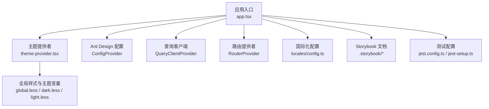

图表来源
- [web/src/app.tsx:84-119](file://web/src/app.tsx#L84-L119)
- [web/src/components/theme-provider.tsx:22-49](file://web/src/components/theme-provider.tsx#L22-L49)
- [web/src/global.less](file://web/src/global.less)
- [web/src/theme/dark.less](file://web/src/theme/dark.less)
- [web/src/theme/light.less](file://web/src/theme/light.less)
- [web/.storybook/main.ts](file://web/.storybook/main.ts)
- [web/.storybook/preview.ts](file://web/.storybook/preview.ts)
- [web/jest.config.ts](file://web/jest.config.ts)
- [web/jest-setup.ts](file://web/jest-setup.ts)

章节来源
- [web/src/app.tsx:1-162](file://web/src/app.tsx#L1-L162)
- [web/package.json:25-132](file://web/package.json#L25-L132)

## 核心组件
- 主题系统：通过自定义ThemeProvider与next-themes实现明暗主题切换，持久化到localStorage，并同步至根元素类名，便于样式变量生效。
- 国际化与语言包：在应用入口统一注入Ant Design语言包映射与i18n语言变更监听，确保组件文案随语言切换。
- 查询客户端：集成@tanstack/react-query作为数据获取与缓存层，提升复杂页面的交互性能。
- UI基础：大量使用Ant Design与Radix UI组件，结合TailwindCSS进行样式增强与布局控制。

章节来源
- [web/src/app.tsx:84-119](file://web/src/app.tsx#L84-L119)
- [web/src/components/theme-provider.tsx:22-49](file://web/src/components/theme-provider.tsx#L22-L49)
- [web/src/locales/config.ts](file://web/src/locales/config.ts)

## 架构总览
整体架构围绕“应用容器”展开：应用入口负责国际化、主题、查询客户端与路由装配；主题提供者负责状态管理与DOM类名同步；各业务页面与组件通过Ant Design/Radix UI提供的原子能力组合而成。

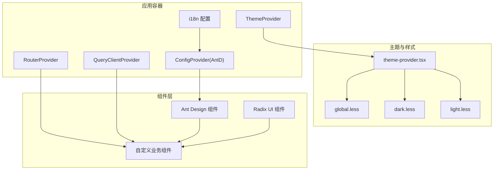

图表来源
- [web/src/app.tsx:121-142](file://web/src/app.tsx#L121-L142)
- [web/src/components/theme-provider.tsx:22-49](file://web/src/components/theme-provider.tsx#L22-L49)
- [web/src/global.less](file://web/src/global.less)
- [web/src/theme/dark.less](file://web/src/theme/dark.less)
- [web/src/theme/light.less](file://web/src/theme/light.less)

## 详细组件分析

### 主题系统与样式变量
- 自定义主题提供者：支持默认主题、存储键名、主题切换与副作用同步至DOM类名，便于Less变量生效。
- Ant Design主题：通过ConfigProvider注入算法与字体，实现明暗主题自动切换。
- 全局样式：global.less集中引入字体与通用样式；dark.less/light.less分别定义主题变量，由ThemeProvider驱动切换。

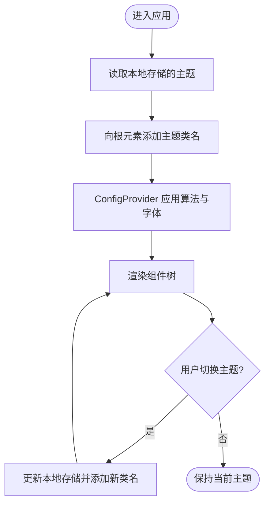

图表来源
- [web/src/components/theme-provider.tsx:22-49](file://web/src/components/theme-provider.tsx#L22-L49)
- [web/src/app.tsx:96-118](file://web/src/app.tsx#L96-L118)
- [web/src/theme/dark.less](file://web/src/theme/dark.less)
- [web/src/theme/light.less](file://web/src/theme/light.less)

章节来源
- [web/src/components/theme-provider.tsx:22-49](file://web/src/components/theme-provider.tsx#L22-L49)
- [web/src/app.tsx:96-118](file://web/src/app.tsx#L96-L118)
- [web/src/global.less](file://web/src/global.less)
- [web/src/theme/dark.less](file://web/src/theme/dark.less)
- [web/src/theme/light.less](file://web/src/theme/light.less)

### JSON编辑器与JSON构建器
- JSON编辑器：基于jsoneditor库，提供可视化与文本双模式编辑，支持校验与格式化。
- JSON构建器：基于JSON Schema生成表单控件，动态渲染字段、联动与校验，适合复杂配置场景。

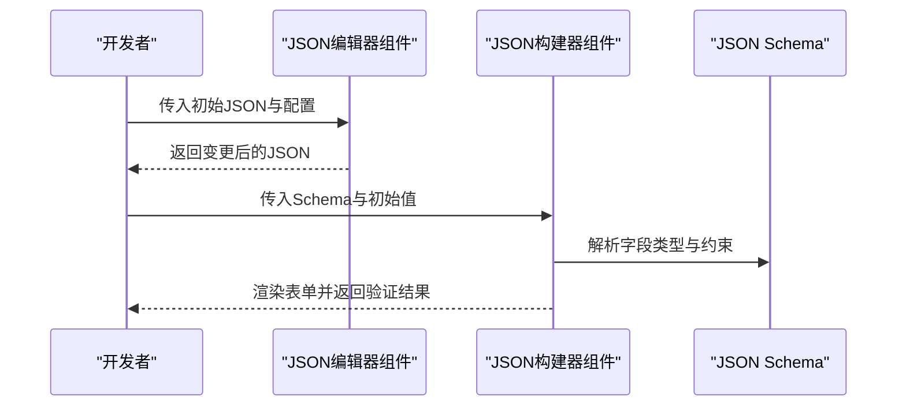

图表来源
- [web/src/components/json-edit/index.tsx](file://web/src/components/json-edit/index.tsx)
- [web/src/components/jsonjoy-builder/index.tsx](file://web/src/components/jsonjoy-builder/index.tsx)

章节来源
- [web/src/components/json-edit/index.tsx](file://web/src/components/json-edit/index.tsx)
- [web/src/components/jsonjoy-builder/index.tsx](file://web/src/components/jsonjoy-builder/index.tsx)

### 流程图组件（XYFlow）
- 基于@xyflow/react实现拖拽、连线、节点编辑与布局；支持自定义节点类型与样式，适配工作流与Agent编排场景。

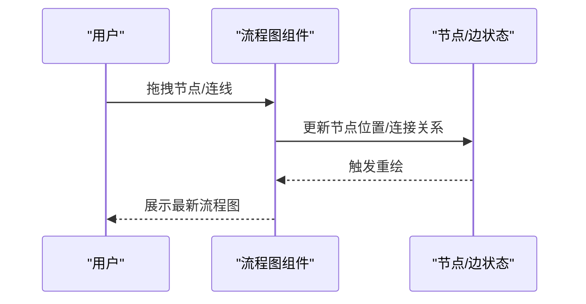

图表来源
- [web/src/components/xyflow/index.tsx](file://web/src/components/xyflow/index.tsx)

章节来源
- [web/src/components/xyflow/index.tsx](file://web/src/components/xyflow/index.tsx)

### 图表组件（折线图）
- 基于@antv/g2或Recharts实现数据可视化，支持响应式与交互式缩放、提示框与主题适配。

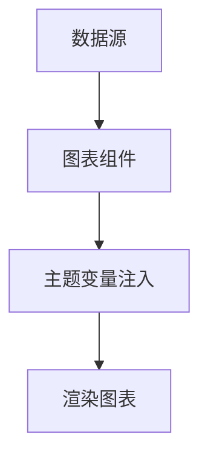

图表来源
- [web/src/components/line-chart/index.tsx](file://web/src/components/line-chart/index.tsx)

章节来源
- [web/src/components/line-chart/index.tsx](file://web/src/components/line-chart/index.tsx)

### 文档预览与PDF相关组件
- CSV/DOC/图片预览：针对不同文件类型提供专用预览组件，内置加载态与错误提示。
- PDF预览器与抽屉：支持PDF文档的内嵌预览与侧边抽屉展示，优化大文档浏览体验。

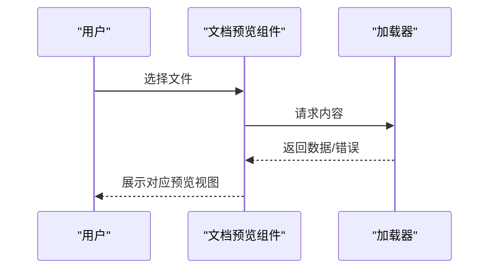

图表来源
- [web/src/components/document-preview/csv-preview.tsx](file://web/src/components/document-preview/csv-preview.tsx)
- [web/src/components/document-preview/doc-preview.tsx](file://web/src/components/document-preview/doc-preview.tsx)
- [web/src/components/document-preview/image-preview.tsx](file://web/src/components/document-preview/image-preview.tsx)
- [web/src/components/pdf-previewer/index.tsx](file://web/src/components/pdf-previewer/index.tsx)
- [web/src/components/pdf-drawer/index.tsx](file://web/src/components/pdf-drawer/index.tsx)

章节来源
- [web/src/components/document-preview/csv-preview.tsx](file://web/src/components/document-preview/csv-preview.tsx)
- [web/src/components/document-preview/doc-preview.tsx](file://web/src/components/document-preview/doc-preview.tsx)
- [web/src/components/document-preview/image-preview.tsx](file://web/src/components/document-preview/image-preview.tsx)
- [web/src/components/pdf-previewer/index.tsx](file://web/src/components/pdf-previewer/index.tsx)
- [web/src/components/pdf-drawer/index.tsx](file://web/src/components/pdf-drawer/index.tsx)

### 聊天与消息组件
- 消息项与输入：支持Markdown渲染、富文本编辑、表情与附件插入，具备历史滚动与实时更新能力。
- 提示词编辑器：集成Monaco Editor，支持语法高亮与智能提示，满足复杂提示词编写需求。

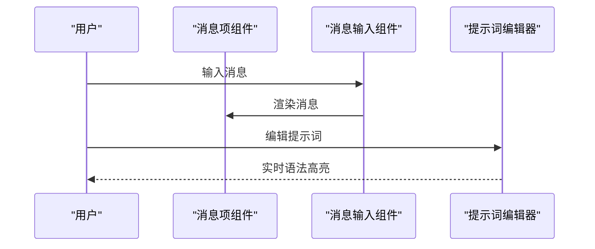

图表来源
- [web/src/components/message-item/index.tsx](file://web/src/components/message-item/index.tsx)
- [web/src/components/message-input/index.tsx](file://web/src/components/message-input/index.tsx)
- [web/src/components/next-message-item/index.tsx](file://web/src/components/next-message-item/index.tsx)
- [web/src/components/next-markdown-content/index.tsx](file://web/src/components/next-markdown-content/index.tsx)
- [web/src/components/markdown-content/index.tsx](file://web/src/components/markdown-content/index.tsx)
- [web/src/components/prompt-editor/index.tsx](file://web/src/components/prompt-editor/index.tsx)

章节来源
- [web/src/components/message-item/index.tsx](file://web/src/components/message-item/index.tsx)
- [web/src/components/message-input/index.tsx](file://web/src/components/message-input/index.tsx)
- [web/src/components/next-message-item/index.tsx](file://web/src/components/next-message-item/index.tsx)
- [web/src/components/next-markdown-content/index.tsx](file://web/src/components/next-markdown-content/index.tsx)
- [web/src/components/markdown-content/index.tsx](file://web/src/components/markdown-content/index.tsx)
- [web/src/components/prompt-editor/index.tsx](file://web/src/components/prompt-editor/index.tsx)

### 表单与配置组件
- 批量操作栏：提供批量删除、导出等操作入口，结合卡片容器与按钮组实现。
- 动态表单：根据Schema动态生成字段，支持联动、校验与条件渲染。
- 各类表单项：关键词、分隔符、跨语言、Excel转HTML、布局识别、OCR选项、最大Token数、记忆体、页面排名、相似度滑条等，覆盖数据集与模型配置场景。

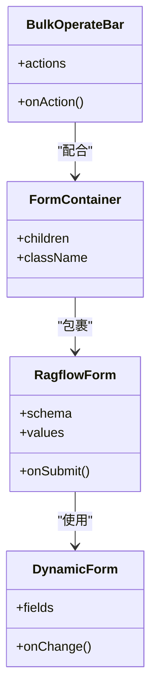

图表来源
- [web/src/components/form-container.tsx](file://web/src/components/form-container.tsx)
- [web/src/components/ragflow-form.tsx](file://web/src/components/ragflow-form.tsx)
- [web/src/components/dynamic-form.tsx](file://web/src/components/dynamic-form.tsx)
- [web/src/components/bulk-operate-bar.tsx](file://web/src/components/bulk-operate-bar.tsx)

章节来源
- [web/src/components/form-container.tsx](file://web/src/components/form-container.tsx)
- [web/src/components/ragflow-form.tsx](file://web/src/components/ragflow-form.tsx)
- [web/src/components/dynamic-form.tsx](file://web/src/components/dynamic-form.tsx)
- [web/src/components/bulk-operate-bar.tsx](file://web/src/components/bulk-operate-bar.tsx)
- [web/src/components/auto-keywords-form-field.tsx](file://web/src/components/auto-keywords-form-field.tsx)
- [web/src/components/delimiter-form-field.tsx](file://web/src/components/delimiter-form-field.tsx)
- [web/src/components/cross-language-form-field.tsx](file://web/src/components/cross-language-form-field.tsx)
- [web/src/components/excel-to-html-form-field.tsx](file://web/src/components/excel-to-html-form-field.tsx)
- [web/src/components/layout-recognize-form-field.tsx](file://web/src/components/layout-recognize-form-field.tsx)
- [web/src/components/paddleocr-options-form-field.tsx](file://web/src/components/paddleocr-options-form-field.tsx)
- [web/src/components/page-rank-form-field.tsx](file://web/src/components/page-rank-form-field.tsx)
- [web/src/components/max-token-number-from-field.tsx](file://web/src/components/max-token-number-from-field.tsx)
- [web/src/components/memories-form-field.tsx](file://web/src/components/memories-form-field.tsx)
- [web/src/components/similarity-slider/index.tsx](file://web/src/components/similarity-slider/index.tsx)

### 业务组件与复合组件
- 嵌入容器与对话框：用于嵌入第三方能力或弹窗展示，结合复制到剪贴板与对话框管理器实现。
- LLM选择与设置项：提供模型选择、参数设置与校验，适配多模型场景。
- 过滤与筛选：元数据过滤、列表筛选栏，支持多维条件组合。
- 分块策略与解析配置：动态页范围、解析配置等，满足知识库构建流程。
- 文件上传与图标：文件上传器、文件状态徽章、文件图标、上传对话框、重命名与删除确认等。

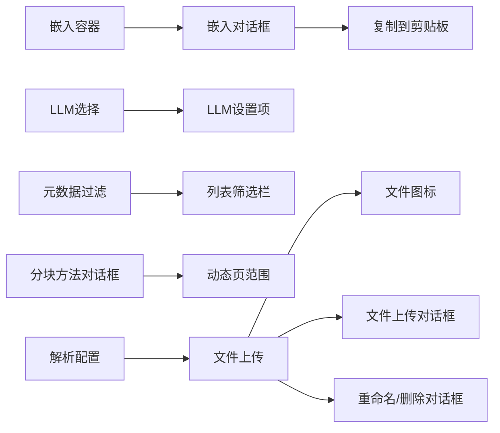

图表来源
- [web/src/components/embed-container.tsx](file://web/src/components/embed-container.tsx)
- [web/src/components/embed-dialog/index.tsx](file://web/src/components/embed-dialog/index.tsx)
- [web/src/components/llm-select/index.tsx](file://web/src/components/llm-select/index.tsx)
- [web/src/components/llm-setting-items/index.tsx](file://web/src/components/llm-setting-items/index.tsx)
- [web/src/components/metadata-filter/index.tsx](file://web/src/components/metadata-filter/index.tsx)
- [web/src/components/list-filter-bar/index.tsx](file://web/src/components/list-filter-bar/index.tsx)
- [web/src/components/chunk-method-dialog/index.tsx](file://web/src/components/chunk-method-dialog/index.tsx)
- [web/src/components/chunk-method-dialog/dynamic-page-range.tsx](file://web/src/components/chunk-method-dialog/dynamic-page-range.tsx)
- [web/src/components/parse-configuration/index.tsx](file://web/src/components/parse-configuration/index.tsx)
- [web/src/components/file-upload.tsx](file://web/src/components/file-upload.tsx)
- [web/src/components/file-icon/index.tsx](file://web/src/components/file-icon/index.tsx)
- [web/src/components/file-upload-dialog/index.tsx](file://web/src/components/file-upload-dialog/index.tsx)
- [web/src/components/rename-dialog/index.tsx](file://web/src/components/rename-dialog/index.tsx)
- [web/src/components/confirm-delete-dialog/index.tsx](file://web/src/components/confirm-delete-dialog/index.tsx)

章节来源
- [web/src/components/embed-container.tsx](file://web/src/components/embed-container.tsx)
- [web/src/components/embed-dialog/index.tsx](file://web/src/components/embed-dialog/index.tsx)
- [web/src/components/llm-select/index.tsx](file://web/src/components/llm-select/index.tsx)
- [web/src/components/llm-setting-items/index.tsx](file://web/src/components/llm-setting-items/index.tsx)
- [web/src/components/metadata-filter/index.tsx](file://web/src/components/metadata-filter/index.tsx)
- [web/src/components/list-filter-bar/index.tsx](file://web/src/components/list-filter-bar/index.tsx)
- [web/src/components/chunk-method-dialog/index.tsx](file://web/src/components/chunk-method-dialog/index.tsx)
- [web/src/components/chunk-method-dialog/dynamic-page-range.tsx](file://web/src/components/chunk-method-dialog/dynamic-page-range.tsx)
- [web/src/components/parse-configuration/index.tsx](file://web/src/components/parse-configuration/index.tsx)
- [web/src/components/file-upload.tsx](file://web/src/components/file-upload.tsx)
- [web/src/components/file-icon/index.tsx](file://web/src/components/file-icon/index.tsx)
- [web/src/components/file-upload-dialog/index.tsx](file://web/src/components/file-upload-dialog/index.tsx)
- [web/src/components/rename-dialog/index.tsx](file://web/src/components/rename-dialog/index.tsx)
- [web/src/components/confirm-delete-dialog/index.tsx](file://web/src/components/confirm-delete-dialog/index.tsx)

### 基础组件与工具组件
- SVG图标与字体图标：统一图标体系，支持尺寸、颜色与交互状态。
- 头像上传、头像组件、徽章、骨架屏、聊天悬浮窗、复制到剪贴板、折叠面板、更多按钮等，覆盖通用UI需求。

章节来源
- [web/src/components/svg-icon.tsx](file://web/src/components/svg-icon.tsx)
- [web/src/components/icon-font.tsx](file://web/src/components/icon-font.tsx)
- [web/src/components/avatar-upload.tsx](file://web/src/components/avatar-upload.tsx)
- [web/src/components/ragflow-avatar.tsx](file://web/src/components/ragflow-avatar.tsx)
- [web/src/components/shared-badge.tsx](file://web/src/components/shared-badge.tsx)
- [web/src/components/skeleton-card.tsx](file://web/src/components/skeleton-card.tsx)
- [web/src/components/floating-chat-widget.tsx](file://web/src/components/floating-chat-widget.tsx)
- [web/src/components/floating-chat-widget-markdown.tsx](file://web/src/components/floating-chat-widget-markdown.tsx)
- [web/src/components/copy-to-clipboard.tsx](file://web/src/components/copy-to-clipboard.tsx)
- [web/src/components/collapse.tsx](file://web/src/components/collapse.tsx)
- [web/src/components/more-button.tsx](file://web/src/components/more-button.tsx)

### 页面级组件
- 页面头部、首页卡片、知识库项、聚光灯、空状态、回退组件等，支撑页面布局与状态反馈。

章节来源
- [web/src/components/page-header/index.tsx](file://web/src/components/page-header/index.tsx)
- [web/src/components/home-card/index.tsx](file://web/src/components/home-card/index.tsx)
- [web/src/components/knowledge-base-item/index.tsx](file://web/src/components/knowledge-base-item/index.tsx)
- [web/src/components/spotlight/index.tsx](file://web/src/components/spotlight/index.tsx)
- [web/src/components/empty/index.tsx](file://web/src/components/empty/index.tsx)
- [web/src/components/fallback-component/index.tsx](file://web/src/components/fallback-component/index.tsx)

### API服务与统计图表
- API密钥模态、后端服务API概览、统计图表：结合Ant Design卡片与图表组件，提供API使用情况与趋势展示。

章节来源
- [web/src/components/api-service/chat-api-key-modal/index.tsx](file://web/src/components/api-service/chat-api-key-modal/index.tsx)
- [web/src/components/api-service/chat-overview-modal/backend-service-api.tsx](file://web/src/components/api-service/chat-overview-modal/backend-service-api.tsx)
- [web/src/components/api-service/chat-overview-modal/stats-chart.tsx](file://web/src/components/api-service/chat-overview-modal/stats-chart.tsx)

## 依赖关系分析
- 组件依赖Ant Design与Radix UI原子组件，通过ConfigProvider与ThemeProvider统一风格与主题。
- 样式依赖Less与TailwindCSS，全局样式与主题变量协同工作。
- 国际化与查询客户端贯穿应用，保障多语言与数据一致性。
- Storybook与Jest分别承担组件文档与测试职责。

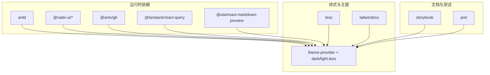

图表来源
- [web/package.json:25-132](file://web/package.json#L25-L132)
- [web/src/app.tsx:96-118](file://web/src/app.tsx#L96-L118)
- [web/src/components/theme-provider.tsx:22-49](file://web/src/components/theme-provider.tsx#L22-L49)

章节来源
- [web/package.json:25-132](file://web/package.json#L25-L132)
- [web/src/app.tsx:96-118](file://web/src/app.tsx#L96-L118)

## 性能考虑
- 使用@tanstack/react-query进行数据缓存与并发请求管理，避免重复请求与闪烁。
- Ant Design ConfigProvider仅在主题切换时触发重算，减少不必要的重渲染。
- 图表与流程图组件建议启用懒加载与虚拟化，降低首屏与交互延迟。
- 图标与媒体资源按需加载，避免阻塞主线程。

## 故障排查指南
- 主题不生效：检查localStorage中主题键值是否正确，确认根元素类名是否更新，以及dark.less/light.less变量是否被正确引入。
- 国际化异常：确认i18n初始化与语言变更监听逻辑，检查AntD语言包映射是否匹配当前语言。
- 表单校验失败：核对DynamicForm的Schema与字段类型，确保联动与必填规则正确。
- 图表渲染异常：检查数据格式与图表配置，确认主题变量未覆盖关键样式。

章节来源
- [web/src/components/theme-provider.tsx:32-37](file://web/src/components/theme-provider.tsx#L32-L37)
- [web/src/app.tsx:90-94](file://web/src/app.tsx#L90-L94)
- [web/src/components/dynamic-form.tsx](file://web/src/components/dynamic-form.tsx)

## 结论
本UI组件系统以Ant Design为核心，结合Radix UI与TailwindCSS，形成统一且可扩展的组件生态。通过主题提供者与ConfigProvider实现主题与语言的一致性，借助@tanstack/react-query提升性能，配合Storybook与Jest完善文档与测试。复杂组件如JSON编辑器、流程图与图表通过模块化封装与清晰的数据流设计，既保证了可维护性，也提升了开发效率。

## 附录
- 开发与构建：Vite + TypeScript + Less + TailwindCSS，Storybook用于组件文档，Jest用于单元测试。
- 最佳实践：优先使用受控组件与受控表单，合理拆分基础/业务/复合组件，利用hooks抽象状态与副作用，通过Storybook沉淀组件用例与交互规范。