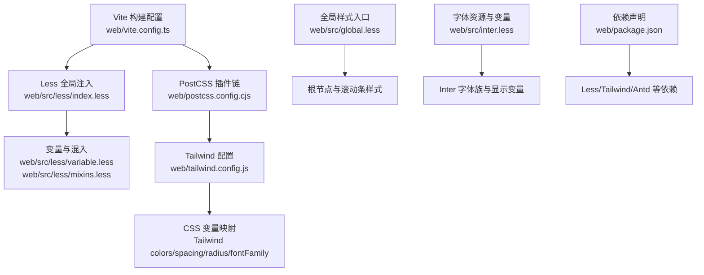
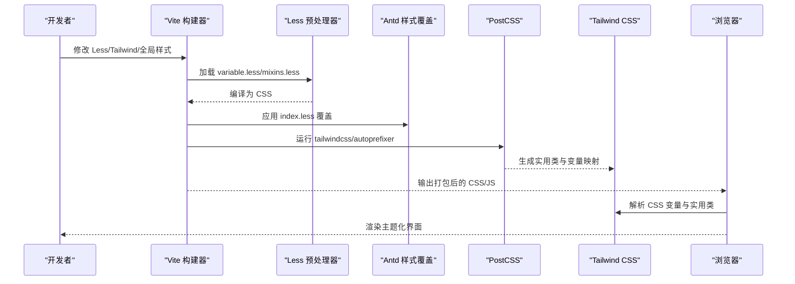
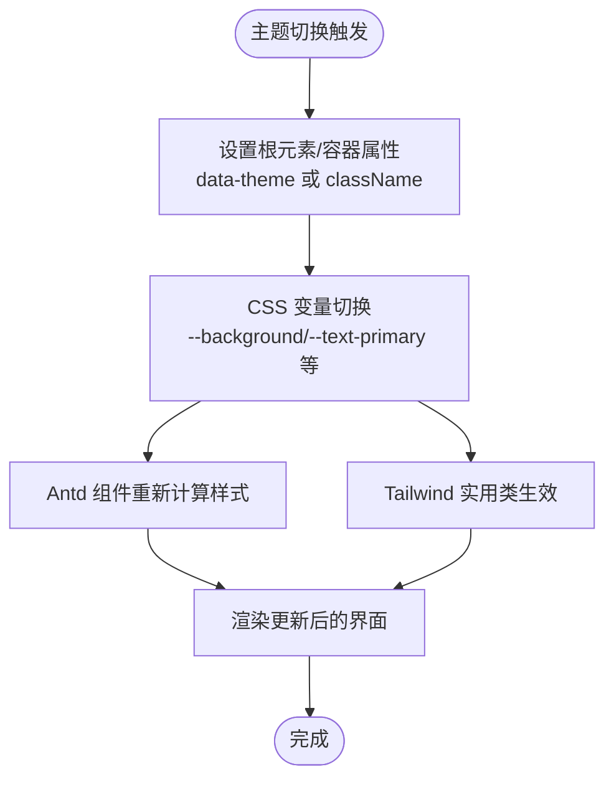
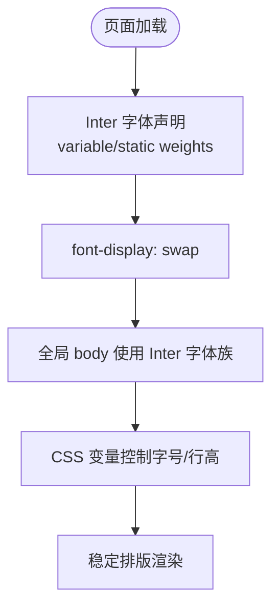
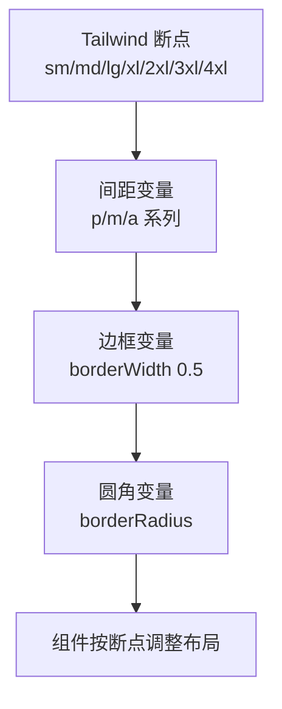
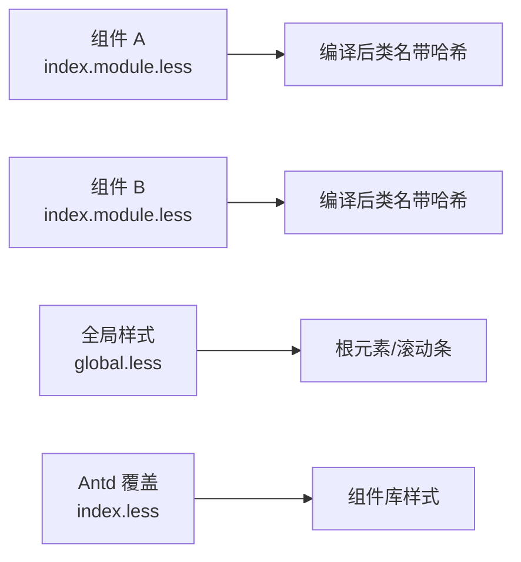
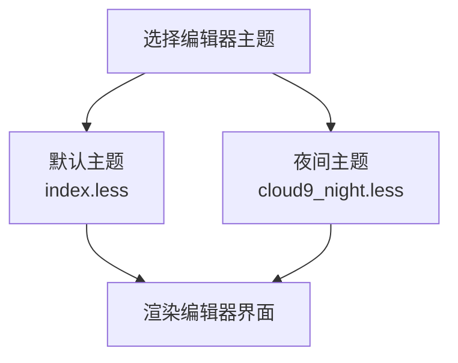
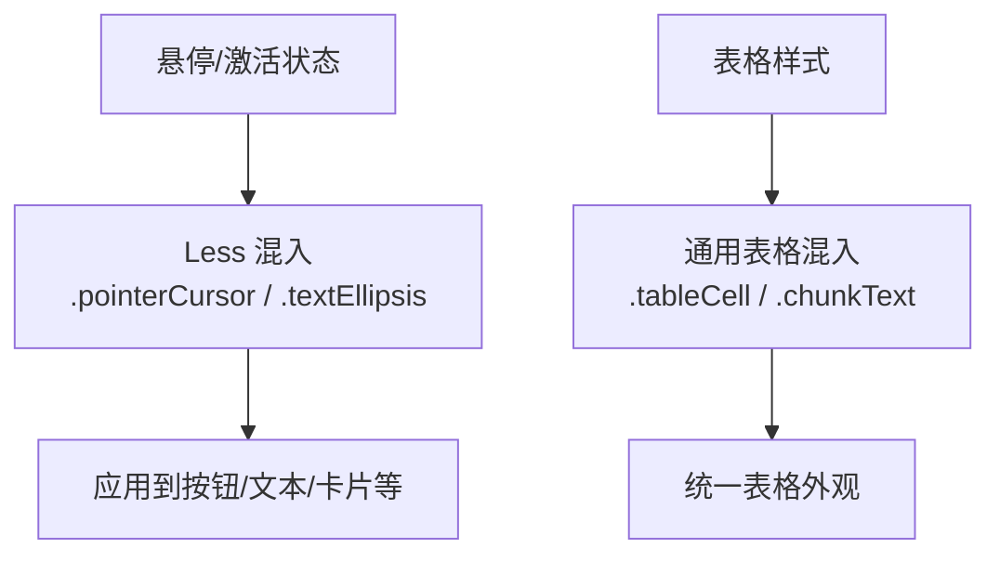
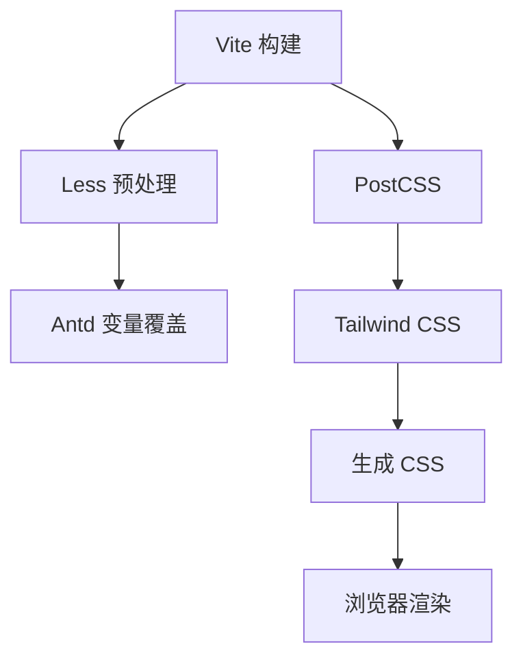

# 主题系统与样式管理

<cite>
**本文引用的文件**
- [web/src/global.less](file://web/src/global.less)
- [web/src/inter.less](file://web/src/inter.less)
- [web/package.json](file://web/package.json)
- [web/vite.config.ts](file://web/vite.config.ts)
- [web/tailwind.config.js](file://web/tailwind.config.js)
- [web/postcss.config.cjs](file://web/postcss.config.cjs)
- [web/src/less/variable.less](file://web/src/less/variable.less)
- [web/src/less/mixins.less](file://web/src/less/mixins.less)
- [web/src/less/index.less](file://web/src/less/index.less)
- [web/src/app.tsx](file://web/src/app.tsx)
- [web/src/main.tsx](file://web/src/main.tsx)
- [web/src/routes.tsx](file://web/src/routes.tsx)
- [web/src/layouts/components/header/index.module.less](file://web/src/layouts/components/header/index.module.less)
- [web/src/components/api-service/chat-overview-modal/index.module.less](file://web/src/components/api-service/chat-overview-modal/index.module.less)
- [web/src/components/document-preview/index.module.less](file://web/src/components/document-preview/index.module.less)
- [web/src/components/message-item/index.module.less](file://web/src/components/message-item/index.module.less)
- [web/src/components/markdown-content/index.module.less](file://web/src/components/markdown-content/index.module.less)
- [web/src/components/floating-chat-widget-markdown.module.less](file://web/src/components/floating-chat-widget-markdown.module.less)
- [web/src/components/json-edit/css/index.less](file://web/src/components/json-edit/css/index.less)
- [web/src/components/json-edit/css/cloud9_night.less](file://web/src/components/json-edit/css/cloud9_night.less)
- [web/src/components/llm-select/index.less](file://web/src/components/llm-select/index.less)
- [web/src/components/llm-setting-items/index.module.less](file://web/src/components/llm-setting-items/index.module.less)
- [web/src/components/message-input/index.less](file://web/src/components/message-input/index.less)
- [web/src/components/pdf-previewer/index.module.less](file://web/src/components/pdf-previewer/index.module.less)
- [web/src/components/next-message-item/index.module.less](file://web/src/components/next-message-item/index.module.less)
- [web/src/components/next-markdown-content/index.module.less](file://web/src/components/next-markdown-content/index.module.less)
- [web/src/components/originui/calendar/index.less](file://web/src/components/originui/calendar/index.less)
- [web/src/components/card-singleline-container/index.less](file://web/src/components/card-singleline-container/index.less)
- [web/src/components/file-icon/index.module.less](file://web/src/components/file-icon/index.module.less)
- [web/src/components/highlight-markdown/index.module.less](file://web/src/components/highlight-markdown/index.module.less)
- [web/src/components/json-edit/css/index.less](file://web/src/components/json-edit/css/index.less)
- [web/src/components/json-edit/css/cloud9_night.less](file://web/src/components/json-edit/css/cloud9_night.less)
- [web/src/components/llm-select/index.less](file://web/src/components/llm-select/index.less)
- [web/src/components/llm-setting-items/index.module.less](file://web/src/components/llm-setting-items/index.module.less)
- [web/src/components/message-input/index.less](file://web/src/components/message-input/index.less)
- [web/src/components/pdf-previewer/index.module.less](file://web/src/components/pdf-previewer/index.module.less)
- [web/src/components/next-message-item/index.module.less](file://web/src/components/next-message-item/index.module.less)
- [web/src/components/next-markdown-content/index.module.less](file://web/src/components/next-markdown-content/index.module.less)
- [web/src/components/originui/calendar/index.less](file://web/src/components/originui/calendar/index.less)
- [web/src/components/card-singleline-container/index.less](file://web/src/components/card-singleline-container/index.less)
- [web/src/components/file-icon/index.module.less](file://web/src/components/file-icon/index.module.less)
- [web/src/components/highlight-markdown/index.module.less](file://web/src/components/highlight-markdown/index.module.less)
</cite>

## 目录
1. [简介](#简介)
2. [项目结构](#项目结构)
3. [核心组件](#核心组件)
4. [架构总览](#架构总览)
5. [详细组件分析](#详细组件分析)
6. [依赖关系分析](#依赖关系分析)
7. [性能考量](#性能考量)
8. [故障排查指南](#故障排查指南)
9. [结论](#结论)
10. [附录](#附录)

## 简介
本指南聚焦于 RAGFlow 前端的主题系统与样式管理实现，涵盖 CSS 变量、Less 预处理器、Tailwind CSS、样式模块化、主题切换、颜色体系、字体规范、间距系统、命名规范、组件样式隔离、响应式设计、调试工具、性能优化与跨浏览器兼容性等关键主题。文档以代码为依据，结合可视化图示，帮助开发者在不直接阅读源码的情况下快速理解并高效使用与扩展样式系统。

## 项目结构
前端采用 Vite + React 技术栈，样式体系由 Less 变量与混入、Ant Design 变量覆盖、Tailwind CSS 扩展变量、全局样式与模块化样式共同构成。构建时通过 Vite 的 Less 预处理配置注入全局变量与混入，并通过 PostCSS 启用 Tailwind 与自动前缀。

图表来源
- [web/vite.config.ts:43-60](file://web/vite.config.ts#L43-L60)
- [web/src/less/index.less:1-3](file://web/src/less/index.less#L1-L3)
- [web/src/less/variable.less:1-18](file://web/src/less/variable.less#L1-L18)
- [web/src/less/mixins.less:1-98](file://web/src/less/mixins.less#L1-L98)
- [web/postcss.config.cjs:1-8](file://web/postcss.config.cjs#L1-L8)
- [web/tailwind.config.js:12-221](file://web/tailwind.config.js#L12-L221)
- [web/src/global.less:1-48](file://web/src/global.less#L1-L48)
- [web/src/inter.less:1-274](file://web/src/inter.less#L1-L274)
- [web/package.json:25-132](file://web/package.json#L25-L132)

章节来源
- [web/vite.config.ts:1-174](file://web/vite.config.ts#L1-L174)
- [web/src/less/index.less:1-3](file://web/src/less/index.less#L1-L3)
- [web/src/less/variable.less:1-18](file://web/src/less/variable.less#L1-L18)
- [web/src/less/mixins.less:1-98](file://web/src/less/mixins.less#L1-L98)
- [web/postcss.config.cjs:1-8](file://web/postcss.config.cjs#L1-L8)
- [web/tailwind.config.js:1-229](file://web/tailwind.config.js#L1-L229)
- [web/src/global.less:1-48](file://web/src/global.less#L1-L48)
- [web/src/inter.less:1-274](file://web/src/inter.less#L1-L274)
- [web/package.json:1-195](file://web/package.json#L1-L195)

## 核心组件
- Less 变量与混入：集中定义尺寸、颜色、字体、阴影、圆角等通用样式参数，供全局与模块化样式复用。
- Ant Design 变量覆盖：通过 Vite 的 Less modifyVars 注入 index.less，实现对 Antd 组件库样式的统一定制。
- Tailwind CSS：基于 CSS 变量扩展颜色、边框、圆角、字体族、动画等，提供实用类与响应式断点。
- 全局样式：统一根元素、页面容器、滚动条等基础样式，确保一致的视觉基线。
- 字体系统：通过 Inter 字体族与显示变量，支持可变字体与静态字重，提升排版表现与加载性能。
- 模块化样式：组件级 CSS Modules 隔离作用域，避免样式污染；部分场景使用普通 Less 文件进行局部覆盖。

章节来源
- [web/src/less/variable.less:1-18](file://web/src/less/variable.less#L1-L18)
- [web/src/less/mixins.less:1-98](file://web/src/less/mixins.less#L1-L98)
- [web/vite.config.ts:48-58](file://web/vite.config.ts#L48-L58)
- [web/tailwind.config.js:12-221](file://web/tailwind.config.js#L12-L221)
- [web/src/global.less:1-48](file://web/src/global.less#L1-L48)
- [web/src/inter.less:1-274](file://web/src/inter.less#L1-L274)

## 架构总览
样式系统在构建期与运行期协同工作：构建期通过 Vite 注入 Less 变量与 Antd 覆盖，PostCSS 应用 Tailwind 与 autoprefixer；运行期通过 CSS 变量与 Tailwind 实现主题切换与动态样式。

图表来源
- [web/vite.config.ts:43-60](file://web/vite.config.ts#L43-L60)
- [web/src/less/index.less:1-3](file://web/src/less/index.less#L1-L3)
- [web/postcss.config.cjs:1-8](file://web/postcss.config.cjs#L1-L8)
- [web/tailwind.config.js:12-221](file://web/tailwind.config.js#L12-L221)

## 详细组件分析

### 1) 主题切换与颜色体系
- CSS 变量驱动：Tailwind 配置中大量使用 CSS 变量映射，如文本、背景、边框、强调色等，形成统一的颜色语义层。
- Antd 覆盖：通过 modifyVars 注入 index.less，实现对 Antd 组件的外观定制（如主色、圆角、阴影等）。
- 动态切换：建议在应用入口或布局容器上设置数据属性或类名，配合 CSS 变量切换实现明暗主题与品牌主题的无缝切换。

图表来源
- [web/tailwind.config.js:33-188](file://web/tailwind.config.js#L33-L188)
- [web/vite.config.ts:55-58](file://web/vite.config.ts#L55-L58)

章节来源
- [web/tailwind.config.js:33-188](file://web/tailwind.config.js#L33-L188)
- [web/vite.config.ts:55-58](file://web/vite.config.ts#L55-L58)

### 2) 字体规范与排版
- 字体族：通过 Inter 字体族与显示变量，支持可变字体与多字重，提升可读性与性能。
- 字体加载：使用 woff2 格式与 font-display swap，减少阻塞与闪烁。
- 排版变量：通过 CSS 变量控制字号、行高、字重等，保证一致性。

图表来源
- [web/src/inter.less:1-274](file://web/src/inter.less#L1-L274)
- [web/src/global.less:8-12](file://web/src/global.less#L8-L12)
- [web/tailwind.config.js:198-200](file://web/tailwind.config.js#L198-L200)

章节来源
- [web/src/inter.less:1-274](file://web/src/inter.less#L1-L274)
- [web/src/global.less:8-12](file://web/src/global.less#L8-L12)
- [web/tailwind.config.js:198-200](file://web/tailwind.config.js#L198-L200)

### 3) 间距系统与响应式设计
- 间距：通过 Tailwind 断点与自定义 spacing，实现移动端到超大屏的一致间距体验。
- 响应式：Tailwind 屏幕断点覆盖 sm 到 4xl，满足多设备适配需求。
- 圆角与边框：统一使用 CSS 变量控制圆角与细边框，保持视觉一致性。

图表来源
- [web/tailwind.config.js:20-28](file://web/tailwind.config.js#L20-L28)
- [web/tailwind.config.js:30-32](file://web/tailwind.config.js#L30-L32)
- [web/tailwind.config.js:193-197](file://web/tailwind.config.js#L193-L197)

章节来源
- [web/tailwind.config.js:20-28](file://web/tailwind.config.js#L20-L28)
- [web/tailwind.config.js:30-32](file://web/tailwind.config.js#L30-L32)
- [web/tailwind.config.js:193-197](file://web/tailwind.config.js#L193-L197)

### 4) 样式模块化与组件隔离
- CSS Modules：组件级样式文件以 .module.less 结尾，编译后类名带哈希，避免全局污染。
- 普通 Less：用于局部覆盖或与 Antd 协作的场景，注意作用域与优先级。
- 全局样式：仅放置基础重置、根元素与滚动条等全局必需样式。

图表来源
- [web/src/layouts/components/header/index.module.less](file://web/src/layouts/components/header/index.module.less)
- [web/src/components/api-service/chat-overview-modal/index.module.less](file://web/src/components/api-service/chat-overview-modal/index.module.less)
- [web/src/components/document-preview/index.module.less](file://web/src/components/document-preview/index.module.less)
- [web/src/components/message-item/index.module.less](file://web/src/components/message-item/index.module.less)
- [web/src/components/markdown-content/index.module.less](file://web/src/components/markdown-content/index.module.less)
- [web/src/global.less:1-48](file://web/src/global.less#L1-L48)
- [web/src/less/index.less:1-3](file://web/src/less/index.less#L1-L3)

章节来源
- [web/src/layouts/components/header/index.module.less](file://web/src/layouts/components/header/index.module.less)
- [web/src/components/api-service/chat-overview-modal/index.module.less](file://web/src/components/api-service/chat-overview-modal/index.module.less)
- [web/src/components/document-preview/index.module.less](file://web/src/components/document-preview/index.module.less)
- [web/src/components/message-item/index.module.less](file://web/src/components/message-item/index.module.less)
- [web/src/components/markdown-content/index.module.less](file://web/src/components/markdown-content/index.module.less)
- [web/src/global.less:1-48](file://web/src/global.less#L1-L48)
- [web/src/less/index.less:1-3](file://web/src/less/index.less#L1-L3)

### 5) JSON 编辑器主题与代码高亮
- 多主题支持：提供默认与夜间两种编辑器主题，便于不同环境下的可读性与舒适度。
- 组件化样式：通过独立的 less 文件组织样式，便于维护与替换。

图表来源
- [web/src/components/json-edit/css/index.less](file://web/src/components/json-edit/css/index.less)
- [web/src/components/json-edit/css/cloud9_night.less](file://web/src/components/json-edit/css/cloud9_night.less)

章节来源
- [web/src/components/json-edit/css/index.less](file://web/src/components/json-edit/css/index.less)
- [web/src/components/json-edit/css/cloud9_night.less](file://web/src/components/json-edit/css/cloud9_night.less)

### 6) 交互与状态样式
- 悬停与激活：通过 Less 混入与 CSS 变量统一管理悬停、激活与禁用状态。
- 表格与列表：提供表格单元格样式与多行省略等通用混入，提升一致性与可维护性。

图表来源
- [web/src/less/mixins.less:45-98](file://web/src/less/mixins.less#L45-L98)

章节来源
- [web/src/less/mixins.less:45-98](file://web/src/less/mixins.less#L45-L98)

## 依赖关系分析
- 构建链路：Vite -> Less -> Antd 覆盖 -> PostCSS(Tailwind/Autoprefixer) -> 浏览器渲染。
- 样式依赖：全局样式依赖字体与变量；组件样式依赖模块化作用域与 Tailwind 实用类；Antd 组件依赖变量覆盖。

图表来源
- [web/vite.config.ts:43-60](file://web/vite.config.ts#L43-L60)
- [web/postcss.config.cjs:1-8](file://web/postcss.config.cjs#L1-L8)
- [web/tailwind.config.js:12-221](file://web/tailwind.config.js#L12-L221)

章节来源
- [web/vite.config.ts:43-60](file://web/vite.config.ts#L43-L60)
- [web/postcss.config.cjs:1-8](file://web/postcss.config.cjs#L1-L8)
- [web/tailwind.config.js:12-221](file://web/tailwind.config.js#L12-L221)

## 性能考量
- 构建优化：启用 Terser 压缩、移除 console 与 debugger、Tree Shaking、分包策略，降低包体积与首屏时间。
- 字体优化：使用 woff2 与 font-display swap，减少 FOIT/FOUT。
- 样式体积：通过 CSS 变量与混入减少重复样式；合理拆分模块化样式，避免单文件过大。
- 渲染优化：Tailwind 实用类按需引入，避免无用类导致的体积膨胀。

章节来源
- [web/vite.config.ts:142-159](file://web/vite.config.ts#L142-L159)
- [web/src/inter.less:1-274](file://web/src/inter.less#L1-L274)
- [web/package.json:134-190](file://web/package.json#L134-L190)

## 故障排查指南
- 样式未生效
  - 检查 Vite 的 Less additionalData 与 modifyVars 是否正确注入变量与覆盖文件。
  - 确认 CSS Modules 类名是否正确拼接（哈希后缀）。
- 字体加载异常
  - 核对字体路径与格式，确认 woff2 可访问且缓存策略合理。
- 主题切换无效
  - 确保根元素或容器属性变更后，CSS 变量已同步更新。
  - 检查 Antd 覆盖是否被后续样式覆盖。
- 滚动条样式不一致
  - 检查全局滚动条样式是否被组件内样式覆盖。

章节来源
- [web/vite.config.ts:48-58](file://web/vite.config.ts#L48-L58)
- [web/src/global.less:27-47](file://web/src/global.less#L27-L47)
- [web/src/inter.less:6-18](file://web/src/inter.less#L6-L18)

## 结论
RAGFlow 的样式系统以 CSS 变量为核心，结合 Less 变量与混入、Antd 变量覆盖、Tailwind 实用类与响应式断点，形成了可维护、可扩展、可主题化的前端样式架构。通过模块化样式与构建期优化，既保证了开发效率，也兼顾了运行时性能与跨浏览器兼容性。

## 附录

### A. 样式命名规范
- 组件样式：使用 CSS Modules，文件以 .module.less 结尾，类名采用驼峰或短横线风格，避免全局冲突。
- 全局样式：仅限基础重置与通用规则，避免在全局样式中写业务样式。
- Tailwind 实用类：优先使用语义化类名，配合 CSS 变量实现主题化。

章节来源
- [web/src/layouts/components/header/index.module.less](file://web/src/layouts/components/header/index.module.less)
- [web/src/global.less:1-48](file://web/src/global.less#L1-L48)
- [web/tailwind.config.js:12-221](file://web/tailwind.config.js#L12-L221)

### B. 主题切换最佳实践
- 在应用入口或路由层设置主题属性，避免在每个组件内重复设置。
- 将常用颜色、阴影、圆角等抽象为 CSS 变量，集中管理。
- 对 Antd 组件使用 modifyVars 进行批量覆盖，确保整体风格一致。

章节来源
- [web/vite.config.ts:55-58](file://web/vite.config.ts#L55-L58)
- [web/tailwind.config.js:33-188](file://web/tailwind.config.js#L33-L188)

### C. 调试工具与技巧
- 开发期：利用 Vite 的热更新与 React Dev Inspector 快速定位样式问题。
- 构建期：开启 Source Map，便于定位生产环境样式来源。
- 浏览器：使用开发者工具检查 CSS 变量、Tailwind 实用类与模块化类名的实际应用。

章节来源
- [web/vite.config.ts:64-66](file://web/vite.config.ts#L64-L66)
- [web/vite.config.ts:158-159](file://web/vite.config.ts#L158-L159)
- [web/package.json:134-190](file://web/package.json#L134-L190)