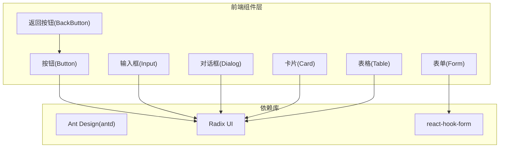
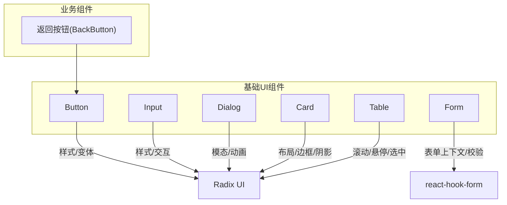
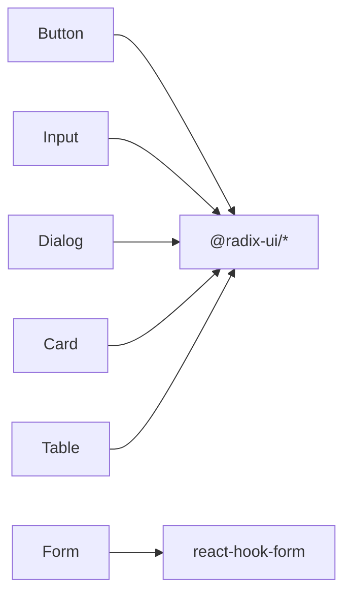

# 基础UI组件

<cite>
**本文引用的文件**
- [web/package.json](file://web/package.json)
- [web/src/components/ui/button.tsx](file://web/src/components/ui/button.tsx)
- [web/src/components/ui/input.tsx](file://web/src/components/ui/input.tsx)
- [web/src/components/ui/form.tsx](file://web/src/components/ui/form.tsx)
- [web/src/components/ui/dialog.tsx](file://web/src/components/ui/dialog.tsx)
- [web/src/components/ui/card.tsx](file://web/src/components/ui/card.tsx)
- [web/src/components/ui/table.tsx](file://web/src/components/ui/table.tsx)
- [web/src/components/back-button/index.tsx](file://web/src/components/back-button/index.tsx)
</cite>

## 目录
1. [简介](#简介)
2. [项目结构](#项目结构)
3. [核心组件](#核心组件)
4. [架构总览](#架构总览)
5. [详细组件分析](#详细组件分析)
6. [依赖分析](#依赖分析)
7. [性能考量](#性能考量)
8. [故障排查指南](#故障排查指南)
9. [结论](#结论)
10. [附录](#附录)

## 简介
本文件面向前端开发者与产品设计人员，系统化梳理并说明本项目中基于 Ant Design 与 Radix UI 的基础 UI 组件二次封装实现。重点覆盖按钮、输入框、表单、对话框、卡片、表格等核心组件的设计理念、属性接口、事件处理、样式定制、可访问性与跨浏览器兼容性、测试策略与文档规范。目标是帮助团队在保持一致交互与视觉体验的同时，提升开发效率与可维护性。

## 项目结构
前端采用 Vite + React + TypeScript 技术栈，组件位于 web/src/components/ui 下，围绕 Ant Design 与 Radix UI 提供统一风格与行为的二次封装；同时在 web/src/components 下提供业务组件（如返回按钮），这些组件通常以基础 UI 组件为组合单元进行构建。

图表来源
- [web/src/components/ui/button.tsx:1-142](file://web/src/components/ui/button.tsx#L1-L142)
- [web/src/components/ui/input.tsx:1-237](file://web/src/components/ui/input.tsx#L1-L237)
- [web/src/components/ui/form.tsx:1-192](file://web/src/components/ui/form.tsx#L1-L192)
- [web/src/components/ui/dialog.tsx:1-138](file://web/src/components/ui/dialog.tsx#L1-L138)
- [web/src/components/ui/card.tsx:1-91](file://web/src/components/ui/card.tsx#L1-L91)
- [web/src/components/ui/table.tsx:1-133](file://web/src/components/ui/table.tsx#L1-L133)
- [web/src/components/back-button/index.tsx:1-45](file://web/src/components/back-button/index.tsx#L1-L45)
- [web/package.json:25-133](file://web/package.json#L25-L133)

章节来源
- [web/package.json:1-195](file://web/package.json#L1-L195)

## 核心组件
本节概览六大基础组件的能力边界与典型用法，后续章节将逐项深入。

- 按钮(Button)
  - 支持多种变体与尺寸，内置加载态与块级展示能力
  - 可通过 asChild 透传到任意元素，适配链接、图标按钮等场景
- 输入框(Input)
  - 支持前缀/后缀、密码显隐、数字输入、失焦更新等增强能力
  - 内置搜索输入与“失焦即提交”输入封装
- 表单(Form)
  - 基于 react-hook-form 的上下文封装，提供字段校验、错误提示、无障碍属性绑定
- 对话框(Dialog)
  - 基于 Radix Dialog 的语义化封装，含遮罩、动画、关闭按钮与可访问性标签
- 卡片(Card)
  - 结构化容器，支持头部、标题、描述、内容与底部区域
- 表格(Table)
  - 容器 + 表头/体/脚/行/单元格/表头单元格/表注释的组合封装，内置滚动条与悬停态

章节来源
- [web/src/components/ui/button.tsx:77-126](file://web/src/components/ui/button.tsx#L77-L126)
- [web/src/components/ui/input.tsx:8-237](file://web/src/components/ui/input.tsx#L8-L237)
- [web/src/components/ui/form.tsx:1-192](file://web/src/components/ui/form.tsx#L1-L192)
- [web/src/components/ui/dialog.tsx:1-138](file://web/src/components/ui/dialog.tsx#L1-L138)
- [web/src/components/ui/card.tsx:1-91](file://web/src/components/ui/card.tsx#L1-L91)
- [web/src/components/ui/table.tsx:1-133](file://web/src/components/ui/table.tsx#L1-L133)

## 架构总览
基础 UI 组件以“风格统一 + 能力增强”的方式对底层库进行再抽象，形成稳定的组件契约与使用范式。业务组件通过组合基础 UI 组件实现功能落地，既保证一致性，又便于扩展。

图表来源
- [web/src/components/back-button/index.tsx:1-45](file://web/src/components/back-button/index.tsx#L1-L45)
- [web/src/components/ui/button.tsx:1-142](file://web/src/components/ui/button.tsx#L1-L142)
- [web/src/components/ui/input.tsx:1-237](file://web/src/components/ui/input.tsx#L1-L237)
- [web/src/components/ui/form.tsx:1-192](file://web/src/components/ui/form.tsx#L1-L192)
- [web/src/components/ui/dialog.tsx:1-138](file://web/src/components/ui/dialog.tsx#L1-L138)
- [web/src/components/ui/card.tsx:1-91](file://web/src/components/ui/card.tsx#L1-L91)
- [web/src/components/ui/table.tsx:1-133](file://web/src/components/ui/table.tsx#L1-L133)

## 详细组件分析

### 按钮(Button)
- 设计理念
  - 使用变体与尺寸的组合实现多场景复用，内置加载态与禁用态，支持块级展示与 asChild 透传
  - 通过 class-variance-authority 实现变体/尺寸的原子化样式组合
- 关键属性
  - 基础属性：className、children、disabled、onClick 等原生 button 属性
  - 变体：default、destructive、outline、secondary、ghost、link、icon、dashed、transparent、danger、highlighted、delete
  - 尺寸：default、sm、lg、icon、auto
  - 扩展：asChild、loading、block
- 事件与状态
  - loading 时显示旋转指示器，同时禁用点击
  - block 时宽度自适应父容器
- 样式定制
  - 通过 className 注入额外类名，或在主题层统一调整变量
- 可访问性
  - 自动继承原生 button 的可访问性语义
- 典型用法
  - 主操作：default 或 highlighted
  - 危险操作：destructive 或 danger
  - 辅助操作：secondary、ghost、link
  - 图标按钮：icon
  - 加载中：loading=true
  - 块级按钮：block=true

章节来源
- [web/src/components/ui/button.tsx:77-126](file://web/src/components/ui/button.tsx#L77-L126)
- [web/src/components/ui/button.tsx:128-142](file://web/src/components/ui/button.tsx#L128-L142)

### 输入框(Input)
- 设计理念
  - 在原生 input 基础上增强前缀/后缀、密码显隐、数字输入、失焦更新等常用能力
  - 通过 ref 计算前缀/后缀宽度，动态调整内边距，保证视觉对齐
- 关键属性
  - 基础属性：value、onChange、type、className 等
  - 增强属性：prefix、suffix、rootClassName
- 特殊封装
  - SearchInput：内置搜索图标与占位符国际化
  - BlurInput：失焦时才触发变更回调
  - NumberInput：自动将字符串转为数字
- 事件与状态
  - 数字类型：onChange 返回 number 类型值
  - 密码类型：点击切换明文/密文
- 样式定制
  - 通过 rootClassName 控制外层容器样式，内部 input 采用统一的边框、背景与聚焦态
- 可访问性
  - 保持原生 input 的可访问性语义
- 典型用法
  - 搜索：SearchInput
  - 数字：NumberInput
  - 复杂输入：带前缀/后缀的 Input

章节来源
- [web/src/components/ui/input.tsx:8-237](file://web/src/components/ui/input.tsx#L8-L237)

### 表单(Form)
- 设计理念
  - 基于 react-hook-form 的 Provider 与 Controller 封装，提供字段上下文、错误信息、无障碍属性绑定
  - 通过 useFormField 获取字段 ID、描述与错误信息 ID，自动注入 aria-* 属性
- 关键组件
  - Form：表单上下文提供者
  - FormField：字段控制器包装
  - FormItem：字段容器，生成唯一 ID
  - FormLabel：标签，支持必填星号与 Tooltip
  - FormControl：字段控制插槽
  - FormDescription：辅助说明文本
  - FormMessage：错误消息文本
  - useFormField：字段上下文钩子
- 事件与状态
  - 错误消息会根据 formState 动态渲染
  - aria-invalid 与 aria-describedby 自动设置
- 样式定制
  - 通过 className 注入样式，保持与标签/控件/说明/错误的层级关系
- 可访问性
  - 自动绑定 htmlFor、aria-describedby、aria-invalid
- 典型用法
  - 在表单容器中使用 Form，字段使用 FormField 包裹，配合 FormLabel、FormControl、FormMessage

章节来源
- [web/src/components/ui/form.tsx:1-192](file://web/src/components/ui/form.tsx#L1-L192)

### 对话框(Dialog)
- 设计理念
  - 基于 Radix Dialog 的语义化封装，提供遮罩、动画、居中定位与可访问性标签
- 关键组件
  - Dialog：根节点
  - DialogTrigger：触发器
  - DialogPortal：传送门容器
  - DialogOverlay：遮罩层
  - DialogContent：内容容器，内置关闭按钮
  - DialogHeader/DialogFooter：头部与尾部布局
  - DialogTitle/DialogDescription：标题与描述
- 事件与状态
  - open/close 状态由 Radix 管理，支持键盘交互与焦点管理
- 样式定制
  - 通过 className 覆盖默认定位、尺寸与动画
- 可访问性
  - 自动管理焦点、隐藏/显示页面内容、提供关闭按钮的可读标签
- 典型用法
  - 触发打开：DialogTrigger
  - 内容区：DialogHeader/DialogFooter/DialogContent
  - 关闭：DialogClose

章节来源
- [web/src/components/ui/dialog.tsx:1-138](file://web/src/components/ui/dialog.tsx#L1-L138)

### 卡片(Card)
- 设计理念
  - 提供结构化的容器，用于分组与承载内容，强调边框、阴影与过渡效果
- 关键组件
  - Card：容器
  - CardHeader：头部区域
  - CardTitle：标题
  - CardDescription：描述
  - CardContent：内容区
  - CardFooter：底部区
- 事件与状态
  - 无交互逻辑，仅作为布局容器
- 样式定制
  - 通过 className 调整内边距、圆角与阴影
- 可访问性
  - 无特殊要求，遵循通用语义
- 典型用法
  - 列表卡片、设置卡片、信息卡片等

章节来源
- [web/src/components/ui/card.tsx:1-91](file://web/src/components/ui/card.tsx#L1-L91)

### 表格(Table)
- 设计理念
  - 提供完整的表格结构封装，内置滚动容器、悬停态与选中态，适配大数据量场景
- 关键组件
  - Table：根容器，包裹表格并提供滚动
  - TableHeader/TableBody/TableFooter：表头/体/脚
  - TableRow：行
  - TableHead/TableCell：表头单元格/普通单元格
  - TableCaption：表注释
- 事件与状态
  - 行悬停与选中态通过数据属性与类名控制
- 样式定制
  - 通过 rootClassName 与 className 调整滚动条、边框与文字颜色
- 可访问性
  - 保持原生 table 语义，建议配合表头与摘要
- 典型用法
  - 数据列表、配置表、统计表等

章节来源
- [web/src/components/ui/table.tsx:1-133](file://web/src/components/ui/table.tsx#L1-L133)

### 返回按钮(BackButton) —— 基于 Button 的业务封装
- 设计理念
  - 在基础 Button 上增加路由跳转能力，默认回退一步，支持指定路径
  - 集成 i18n 文案与样式定制
- 关键属性
  - to?: 字符串，指定回退路径
  - 继承 Button 的所有属性
- 事件与状态
  - 点击时根据 to 是否存在决定回退或跳转
- 样式定制
  - 通过 className 覆盖默认样式
- 典型用法
  - 页面返回、面包屑返回等

章节来源
- [web/src/components/back-button/index.tsx:1-45](file://web/src/components/back-button/index.tsx#L1-L45)
- [web/src/components/ui/button.tsx:77-126](file://web/src/components/ui/button.tsx#L77-L126)

## 依赖分析
- 组件依赖
  - Button、Input、Dialog、Card、Table 基于 Radix UI
  - Form 基于 react-hook-form
  - 项目整体依赖 Ant Design 与 Radix UI 生态
- 耦合度与内聚性
  - 基础组件内聚度高，业务组件通过组合使用，耦合度低
- 循环依赖
  - 当前结构未见循环依赖迹象
- 外部依赖与集成点
  - Antd 与 Radix UI 作为外部集成点，需关注版本兼容性与样式冲突

图表来源
- [web/src/components/ui/button.tsx:1-142](file://web/src/components/ui/button.tsx#L1-L142)
- [web/src/components/ui/input.tsx:1-237](file://web/src/components/ui/input.tsx#L1-L237)
- [web/src/components/ui/form.tsx:1-192](file://web/src/components/ui/form.tsx#L1-L192)
- [web/src/components/ui/dialog.tsx:1-138](file://web/src/components/ui/dialog.tsx#L1-L138)
- [web/src/components/ui/card.tsx:1-91](file://web/src/components/ui/card.tsx#L1-L91)
- [web/src/components/ui/table.tsx:1-133](file://web/src/components/ui/table.tsx#L1-L133)

章节来源
- [web/package.json:25-133](file://web/package.json#L25-L133)

## 性能考量
- 渲染优化
  - 表单字段使用 React.memo 包裹容器组件，减少不必要重渲染
  - 输入框内部使用 useMemo 缓存 input 元素，避免重复创建
- 事件处理
  - 按钮加载态禁用点击，避免重复提交
  - 输入框失焦更新通过 onBlur 降低频繁回调
- 样式与动画
  - 对话框与按钮使用轻量动画，避免过度开销
- 大数据表格
  - Table 容器提供滚动与粘性表头，减少全量重排

章节来源
- [web/src/components/ui/input.tsx:67-104](file://web/src/components/ui/input.tsx#L67-L104)
- [web/src/components/ui/form.tsx:91-91](file://web/src/components/ui/form.tsx#L91-L91)
- [web/src/components/ui/button.tsx:110-111](file://web/src/components/ui/button.tsx#L110-L111)
- [web/src/components/ui/table.tsx:9-21](file://web/src/components/ui/table.tsx#L9-L21)

## 故障排查指南
- 表单相关
  - useFormField 报错：确认字段在 FormField 内使用，且 FormProvider 已正确包裹
  - 错误未显示：检查 FormMessage 是否有错误对象，或 children 是否为空
- 对话框相关
  - 打不开/无法关闭：检查 DialogTrigger 与 DialogContent 的关联，确认 Portal 渲染
  - 焦点问题：确保 DialogContent 设置了正确的可访问性属性
- 输入框相关
  - 数字输入异常：确认使用 NumberInput 并正确处理空值转换
  - 密码显隐异常：检查 suffix 区域是否被覆盖
- 按钮相关
  - 加载态无效：确认 loading 为 true 且未手动禁用
  - 样式错乱：检查 className 与主题变量是否冲突

章节来源
- [web/src/components/ui/form.tsx:60-74](file://web/src/components/ui/form.tsx#L60-L74)
- [web/src/components/ui/dialog.tsx:35-66](file://web/src/components/ui/dialog.tsx#L35-L66)
- [web/src/components/ui/input.tsx:224-236](file://web/src/components/ui/input.tsx#L224-L236)
- [web/src/components/ui/button.tsx:110-111](file://web/src/components/ui/button.tsx#L110-L111)

## 结论
本项目的基础 UI 组件以“统一风格 + 能力增强”为核心，结合 Radix UI 与 react-hook-form，提供了高内聚、低耦合的组件体系。通过明确的属性接口、事件处理与可访问性设计，既能满足快速迭代需求，又能保障一致的用户体验。建议在后续扩展中继续遵循现有模式，完善 Storybook 示例与测试用例，持续提升可维护性与可复用性。

## 附录

### 组件使用示例与最佳实践
- 按钮
  - 主要操作使用 default 或 highlighted；危险操作使用 destructive 或 danger；辅助使用 secondary、ghost、link；图标按钮使用 icon；加载中设置 loading=true；块级使用 block=true
- 输入框
  - 搜索场景使用 SearchInput；数字输入使用 NumberInput；需要失焦更新使用 BlurInput；复杂输入使用带前缀/后缀的 Input
- 表单
  - 在 Form 容器中使用 FormField 包裹字段，配合 FormLabel、FormControl、FormMessage；必填字段使用 required；需要帮助时添加 tooltip
- 对话框
  - 使用 DialogTrigger 触发，内容区使用 DialogHeader/DialogFooter/DialogContent；关闭按钮使用 DialogClose
- 卡片
  - 信息分组使用 Card，合理划分 CardHeader/CardTitle/CardDescription/CardContent/CardFooter
- 表格
  - 大数据量使用 Table 容器，配合 TableHeader/TableBody/TableRow/TableCell；注意滚动与悬停态

### 测试策略与文档规范
- 测试策略
  - 单元测试：针对组件的 props、事件与状态变化进行断言
  - 可访问性测试：使用自动化工具检测 aria-* 属性与键盘可达性
  - 截图对比：Storybook 中的组件快照对比，确保视觉回归
- 文档规范
  - Storybook 示例：每个组件至少提供基础用法、变体与尺寸示例
  - 接口文档：在组件注释中明确属性类型、默认值与行为说明
  - 最佳实践：在 README 或组件注释中给出常见场景与注意事项