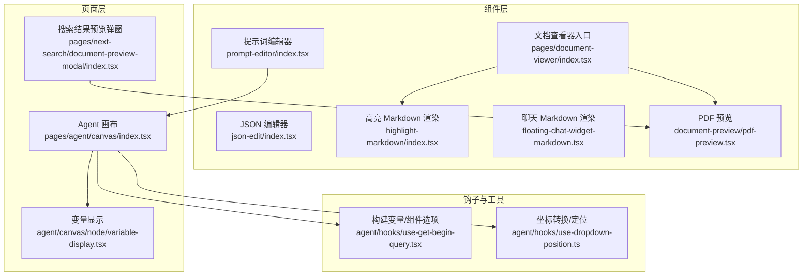
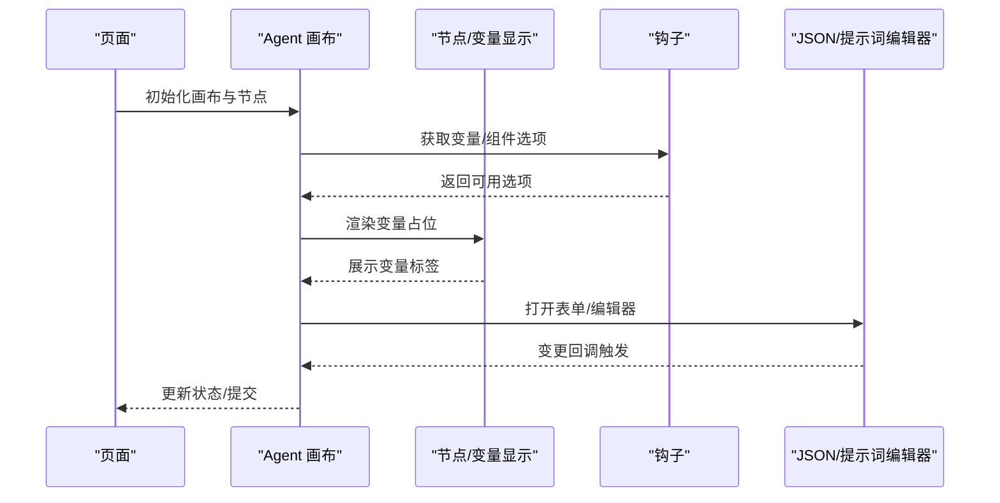
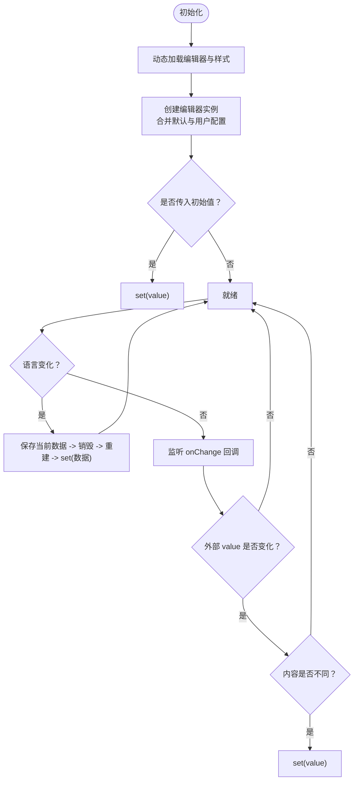
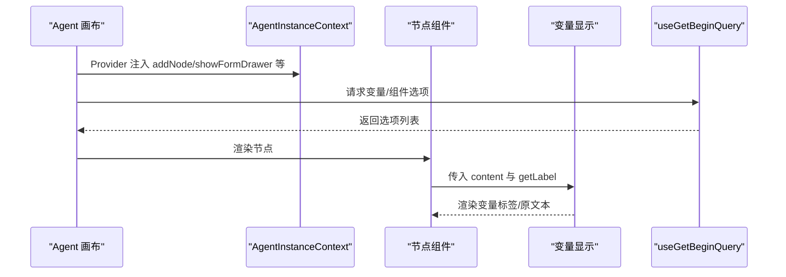
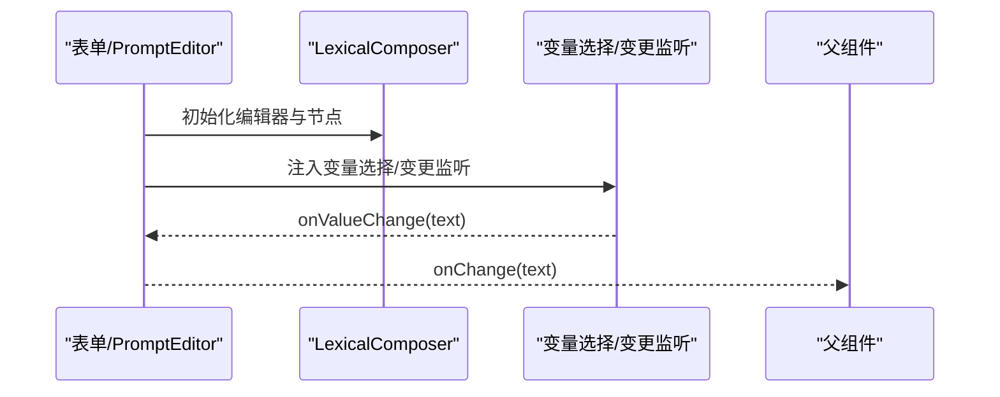
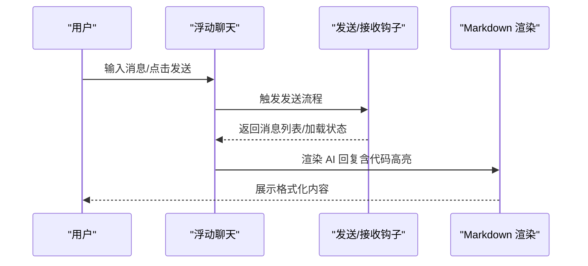
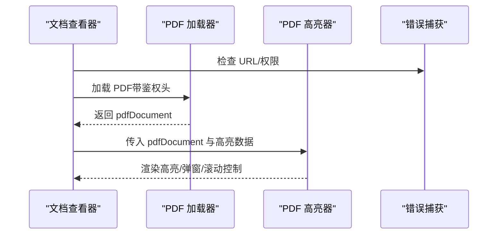
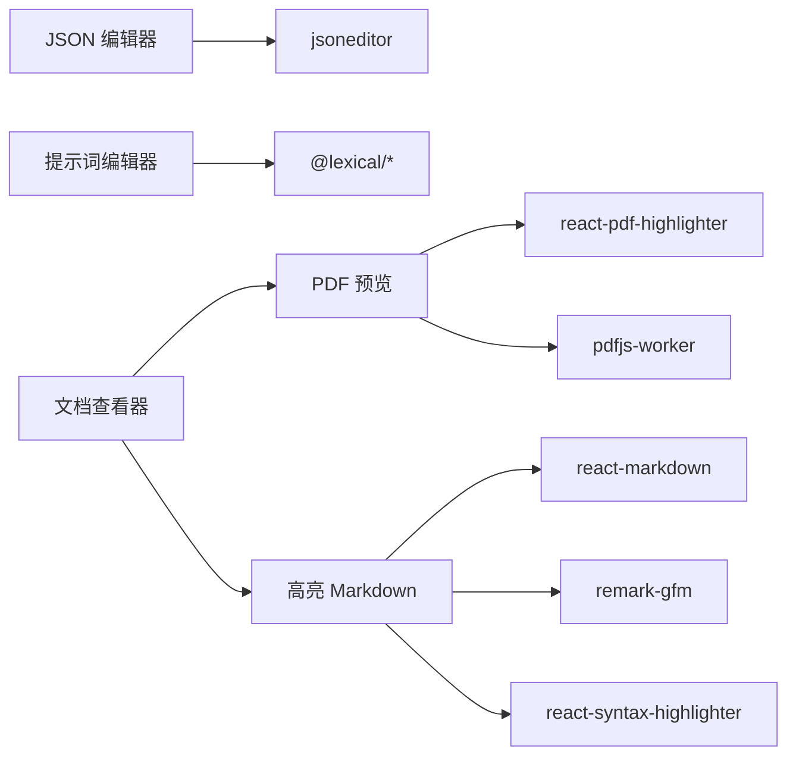

# 复杂业务组件

<cite>
**本文引用的文件**
- [web/src/components/json-edit/interface.ts](file://web/src/components/json-edit/interface.ts)
- [web/src/components/json-edit/index.tsx](file://web/src/components/json-edit/index.tsx)
- [web/src/pages/agent/canvas/index.tsx](file://web/src/pages/agent/canvas/index.tsx)
- [web/src/pages/agent/hooks/use-get-begin-query.tsx](file://web/src/pages/agent/hooks/use-get-begin-query.tsx)
- [web/src/pages/agent/hooks/use-dropdown-position.ts](file://web/src/pages/agent/hooks/use-dropdown-position.ts)
- [web/src/pages/agent/canvas/node/variable-display.tsx](file://web/src/pages/agent/canvas/node/variable-display.tsx)
- [web/src/components/prompt-editor/index.tsx](file://web/src/components/prompt-editor/index.tsx)
- [web/src/pages/agent/form/components/prompt-editor/index.tsx](file://web/src/pages/agent/form/components/prompt-editor/index.tsx)
- [web/src/components/highlight-markdown/index.tsx](file://web/src/components/highlight-markdown/index.tsx)
- [web/src/components/floating-chat-widget-markdown.tsx](file://web/src/components/floating-chat-widget-markdown.tsx)
- [web/src/components/floating-chat-widget.tsx](file://web/src/components/floating-chat-widget.tsx)
- [web/src/components/document-preview/pdf-preview.tsx](file://web/src/components/document-preview/pdf-preview.tsx)
- [web/src/components/pdf-previewer/index.tsx](file://web/src/components/pdf-previewer/index.tsx)
- [web/src/pages/next-search/document-preview-modal/index.tsx](file://web/src/pages/next-search/document-preview-modal/index.tsx)
- [web/src/pages/document-viewer/index.tsx](file://web/src/pages/document-viewer/index.tsx)
- [web/src/components/document-preview/md/index.tsx](file://web/src/components/document-preview/md/index.tsx)
</cite>

## 目录
1. [引言](#引言)
2. [项目结构](#项目结构)
3. [核心组件](#核心组件)
4. [架构总览](#架构总览)
5. [详细组件分析](#详细组件分析)
6. [依赖关系分析](#依赖关系分析)
7. [性能考量](#性能考量)
8. [故障排查指南](#故障排查指南)
9. [结论](#结论)
10. [附录](#附录)

## 引言
本技术文档聚焦于复杂业务场景下的高级前端组件：JSON 编辑器、流程图（Agent Canvas）与变量显示、提示词编辑器（Prompt Editor）、消息展示组件（浮动聊天与 Markdown 渲染）、文档预览组件（PDF/Markdown/通用文档查看）。文档从架构、状态管理、事件处理、数据绑定、配置项、扩展点、性能优化到组件协作与集成方法进行系统化阐述，帮助开发者快速理解并高效扩展这些组件。

## 项目结构
本项目前端位于 web/src，围绕“页面-组件-服务-工具”的分层组织，复杂业务组件主要分布在以下位置：
- 组件层：web/src/components 下包含可复用的通用组件（如 JSON 编辑器、提示词编辑器、Markdown 渲染、文档预览、浮动聊天等）
- 页面层：web/src/pages 下包含业务页面（如 Agent 流程画布、文档查看器、搜索结果预览等）
- 钩子与工具：web/src/pages/agent/hooks 提供画布交互、下拉定位、变量构建等能力

图表来源
- [web/src/pages/agent/canvas/index.tsx:119-330](file://web/src/pages/agent/canvas/index.tsx#L119-L330)
- [web/src/pages/agent/canvas/node/variable-display.tsx:1-68](file://web/src/pages/agent/canvas/node/variable-display.tsx#L1-L68)
- [web/src/pages/agent/hooks/use-get-begin-query.tsx:336-383](file://web/src/pages/agent/hooks/use-get-begin-query.tsx#L336-L383)
- [web/src/pages/agent/hooks/use-dropdown-position.ts:84-113](file://web/src/pages/agent/hooks/use-dropdown-position.ts#L84-L113)
- [web/src/components/json-edit/index.tsx:1-182](file://web/src/components/json-edit/index.tsx#L1-L182)
- [web/src/components/prompt-editor/index.tsx:1-161](file://web/src/components/prompt-editor/index.tsx#L1-L161)
- [web/src/components/highlight-markdown/index.tsx:39-59](file://web/src/components/highlight-markdown/index.tsx#L39-L59)
- [web/src/components/floating-chat-widget-markdown.tsx:298-329](file://web/src/components/floating-chat-widget-markdown.tsx#L298-L329)
- [web/src/components/document-preview/pdf-preview.tsx:1-146](file://web/src/components/document-preview/pdf-preview.tsx#L1-L146)
- [web/src/pages/document-viewer/index.tsx:29-65](file://web/src/pages/document-viewer/index.tsx#L29-L65)
- [web/src/pages/next-search/document-preview-modal/index.tsx:37-67](file://web/src/pages/next-search/document-preview-modal/index.tsx#L37-L67)

章节来源
- [web/src/pages/agent/canvas/index.tsx:119-330](file://web/src/pages/agent/canvas/index.tsx#L119-L330)
- [web/src/pages/document-viewer/index.tsx:29-65](file://web/src/pages/document-viewer/index.tsx#L29-L65)

## 核心组件
本节对四大类复杂组件进行要点梳理与使用指引：
- JSON 编辑器：基于第三方库按需加载，支持语言切换、受控更新、错误边界与销毁清理
- 流程图与变量显示：基于 ReactFlow 的节点体系，提供变量占位渲染、连接校验、上下文传递
- 提示词编辑器：基于 Lexical 的富文本与变量节点，支持变量插入、变更监听与主题化
- 消息展示组件：浮动聊天窗口与 Markdown 渲染，支持多模式（按钮/窗口/全量）、流式/非流式消息、音频反馈
- 文档预览组件：PDF 高亮、Markdown 渲染、通用文档查看器入口

章节来源
- [web/src/components/json-edit/index.tsx:1-182](file://web/src/components/json-edit/index.tsx#L1-L182)
- [web/src/components/json-edit/interface.ts:1-339](file://web/src/components/json-edit/interface.ts#L1-L339)
- [web/src/pages/agent/canvas/index.tsx:119-330](file://web/src/pages/agent/canvas/index.tsx#L119-L330)
- [web/src/pages/agent/canvas/node/variable-display.tsx:1-68](file://web/src/pages/agent/canvas/node/variable-display.tsx#L1-L68)
- [web/src/components/prompt-editor/index.tsx:1-161](file://web/src/components/prompt-editor/index.tsx#L1-L161)
- [web/src/components/floating-chat-widget.tsx:1-725](file://web/src/components/floating-chat-widget.tsx#L1-L725)
- [web/src/components/floating-chat-widget-markdown.tsx:298-329](file://web/src/components/floating-chat-widget-markdown.tsx#L298-L329)
- [web/src/components/document-preview/pdf-preview.tsx:1-146](file://web/src/components/document-preview/pdf-preview.tsx#L1-L146)
- [web/src/pages/document-viewer/index.tsx:29-65](file://web/src/pages/document-viewer/index.tsx#L29-L65)

## 架构总览
整体采用“页面-组件-钩子”三层协作：
- 页面负责编排与状态聚合（如 Agent 画布、文档查看器、搜索预览弹窗）
- 组件负责具体功能与交互（如 JSON 编辑器、提示词编辑器、PDF 预览、浮动聊天）
- 钩子提供跨页面共享的能力（如变量构建、坐标转换）

图表来源
- [web/src/pages/agent/canvas/index.tsx:119-330](file://web/src/pages/agent/canvas/index.tsx#L119-L330)
- [web/src/pages/agent/hooks/use-get-begin-query.tsx:336-383](file://web/src/pages/agent/hooks/use-get-begin-query.tsx#L336-L383)
- [web/src/pages/agent/canvas/node/variable-display.tsx:1-68](file://web/src/pages/agent/canvas/node/variable-display.tsx#L1-L68)
- [web/src/components/json-edit/index.tsx:1-182](file://web/src/components/json-edit/index.tsx#L1-L182)
- [web/src/components/prompt-editor/index.tsx:1-161](file://web/src/components/prompt-editor/index.tsx#L1-L161)

## 详细组件分析

### JSON 编辑器
- 功能特性
  - 按需异步加载编辑器与样式，避免首屏阻塞
  - 默认禁用历史/搜索/菜单栏等，仅保留树形/代码模式，提升简洁性
  - 支持语言切换：通过 i18n 切换时重建编辑器实例，保证本地化生效
  - 受控更新：当外部 value 变化时，仅在内容不同时才 set，避免循环更新
  - 错误边界与销毁：捕获解析异常，组件卸载时销毁实例，释放资源
- 状态管理
  - 内部维护 isLoading、editor 实例引用、当前语言引用
  - 对外通过 onChange 回调同步最新 JSON 值
- 配置选项
  - 支持 mode/modes/history/search/mainMenuBar/navigationBar/statusBar/sortObjectKeys/enableTransform/enableSort/indentation 等
  - 通过 options 合并默认配置，覆盖行为
- 使用建议
  - 将 onChange 与上层表单/存储解耦，统一在父级做校验与持久化
  - 在多语言场景下，确保 i18n 切换后能重建编辑器以应用新语言

图表来源
- [web/src/components/json-edit/index.tsx:32-164](file://web/src/components/json-edit/index.tsx#L32-L164)
- [web/src/components/json-edit/interface.ts:1-339](file://web/src/components/json-edit/interface.ts#L1-L339)

章节来源
- [web/src/components/json-edit/index.tsx:1-182](file://web/src/components/json-edit/index.tsx#L1-L182)
- [web/src/components/json-edit/interface.ts:1-339](file://web/src/components/json-edit/interface.ts#L1-L339)

### 流程图与变量显示（Agent Canvas）
- 流程图
  - 基于 ReactFlow，提供节点类型注册、边类型注册、连接校验、选中/悬停事件
  - 通过上下文传递 addNode、表单抽屉、调试抽屉、运行态状态等
  - 支持自定义边样式与标记
- 变量显示
  - 通过正则匹配 {变量名}，尝试根据 getLabel 映射为带样式的标签，否则回退为原文本
  - 用于在节点卡片或文案中直观展示变量来源
- 钩子能力
  - useGetBeginQuery：构建“起始变量/组件输出”下拉选项，过滤父子层级与排除节点
  - useDropdownPosition：屏幕坐标与画布坐标互转、占位节点定位、下拉定位计算

图表来源
- [web/src/pages/agent/canvas/index.tsx:119-330](file://web/src/pages/agent/canvas/index.tsx#L119-L330)
- [web/src/pages/agent/canvas/node/variable-display.tsx:1-68](file://web/src/pages/agent/canvas/node/variable-display.tsx#L1-L68)
- [web/src/pages/agent/hooks/use-get-begin-query.tsx:336-383](file://web/src/pages/agent/hooks/use-get-begin-query.tsx#L336-L383)

章节来源
- [web/src/pages/agent/canvas/index.tsx:119-330](file://web/src/pages/agent/canvas/index.tsx#L119-L330)
- [web/src/pages/agent/canvas/node/variable-display.tsx:1-68](file://web/src/pages/agent/canvas/node/variable-display.tsx#L1-L68)
- [web/src/pages/agent/hooks/use-get-begin-query.tsx:336-383](file://web/src/pages/agent/hooks/use-get-begin-query.tsx#L336-L383)
- [web/src/pages/agent/hooks/use-dropdown-position.ts:84-113](file://web/src/pages/agent/hooks/use-dropdown-position.ts#L84-L113)

### 提示词编辑器（Prompt Editor）
- 技术栈
  - 基于 Lexical 富文本引擎，内置标题、引用、代码、变量节点
  - 主题化渲染与错误边界
- 交互
  - 工具栏可插入“/”占位符，便于后续变量替换
  - 变更监听插件读取根节点纯文本，向上抛出
  - 支持多行/单行模式与占位符
- 与表单/画布协作
  - 表单中的 PromptEditor 会注入额外变量选项与类型约束
  - 画布节点可复用变量显示组件，保持文案一致性

图表来源
- [web/src/components/prompt-editor/index.tsx:1-161](file://web/src/components/prompt-editor/index.tsx#L1-L161)
- [web/src/pages/agent/form/components/prompt-editor/index.tsx:36-178](file://web/src/pages/agent/form/components/prompt-editor/index.tsx#L36-L178)

章节来源
- [web/src/components/prompt-editor/index.tsx:1-161](file://web/src/components/prompt-editor/index.tsx#L1-L161)
- [web/src/pages/agent/form/components/prompt-editor/index.tsx:36-178](file://web/src/pages/agent/form/components/prompt-editor/index.tsx#L36-L178)

### 消息展示组件（浮动聊天与 Markdown 渲染）
- 浮动聊天
  - 支持三种模式：master（主控）、button（仅按钮）、window（常驻窗口）、full（完整窗口）
  - 支持流式/非流式消息展示，自动滚动至底部
  - 音频反馈：打开/回复均有提示音；支持跨 iframe 消息传递（如 master 模式）
  - Markdown 渲染：AI 回复使用专用组件，支持代码高亮、LaTeX 预处理
- Markdown 渲染
  - 高亮 Markdown：支持代码块语法高亮、暗/亮主题
  - 聊天 Markdown：针对浮动聊天定制，适配引用与长代码块换行

图表来源
- [web/src/components/floating-chat-widget.tsx:1-725](file://web/src/components/floating-chat-widget.tsx#L1-L725)
- [web/src/components/floating-chat-widget-markdown.tsx:298-329](file://web/src/components/floating-chat-widget-markdown.tsx#L298-L329)
- [web/src/components/highlight-markdown/index.tsx:39-59](file://web/src/components/highlight-markdown/index.tsx#L39-L59)

章节来源
- [web/src/components/floating-chat-widget.tsx:1-725](file://web/src/components/floating-chat-widget.tsx#L1-L725)
- [web/src/components/floating-chat-widget-markdown.tsx:298-329](file://web/src/components/floating-chat-widget-markdown.tsx#L298-L329)
- [web/src/components/highlight-markdown/index.tsx:39-59](file://web/src/components/highlight-markdown/index.tsx#L39-L59)

### 文档预览组件（PDF/Markdown/通用查看器）
- PDF 预览
  - 基于 react-pdf-highlighter，支持文本/区域高亮、弹窗提示、滚动跳转
  - 自动获取第一页尺寸并回调设置容器宽高
  - 支持鉴权头注入与错误处理
- Markdown 预览
  - 通过 fetch 拉取远程 Markdown 内容，Remark GFM 插件渲染
- 通用查看器
  - 根据文件类型路由到对应组件（PDF、Markdown、图片、Excel、PPT、TXT 等）

图表来源
- [web/src/components/document-preview/pdf-preview.tsx:1-146](file://web/src/components/document-preview/pdf-preview.tsx#L1-L146)
- [web/src/pages/document-viewer/index.tsx:29-65](file://web/src/pages/document-viewer/index.tsx#L29-L65)
- [web/src/pages/next-search/document-preview-modal/index.tsx:37-67](file://web/src/pages/next-search/document-preview-modal/index.tsx#L37-L67)
- [web/src/components/pdf-previewer/index.tsx:86-135](file://web/src/components/pdf-previewer/index.tsx#L86-L135)
- [web/src/components/document-preview/md/index.tsx:1-42](file://web/src/components/document-preview/md/index.tsx#L1-L42)

章节来源
- [web/src/components/document-preview/pdf-preview.tsx:1-146](file://web/src/components/document-preview/pdf-preview.tsx#L1-L146)
- [web/src/pages/document-viewer/index.tsx:29-65](file://web/src/pages/document-viewer/index.tsx#L29-L65)
- [web/src/pages/next-search/document-preview-modal/index.tsx:37-67](file://web/src/pages/next-search/document-preview-modal/index.tsx#L37-L67)
- [web/src/components/pdf-previewer/index.tsx:86-135](file://web/src/components/pdf-previewer/index.tsx#L86-L135)
- [web/src/components/document-preview/md/index.tsx:1-42](file://web/src/components/document-preview/md/index.tsx#L1-L42)

## 依赖关系分析
- 组件内聚与耦合
  - JSON 编辑器与提示词编辑器均采用按需加载与错误边界，降低全局依赖风险
  - 流程图与变量显示通过钩子解耦，增强可测试性与复用性
  - 文档预览组件通过统一入口路由，避免重复实现
- 外部依赖
  - JSON 编辑器：jsoneditor（动态导入）
  - 提示词编辑器：lexical 生态（@lexical/*）
  - PDF 预览：react-pdf-highlighter、pdfjs-worker
  - Markdown 渲染：react-markdown、remark-gfm、react-syntax-highlighter
- 循环依赖
  - 当前结构以页面/组件/钩子分层为主，未见明显循环依赖迹象

图表来源
- [web/src/components/json-edit/index.tsx:38-41](file://web/src/components/json-edit/index.tsx#L38-L41)
- [web/src/components/prompt-editor/index.tsx:1-28](file://web/src/components/prompt-editor/index.tsx#L1-L28)
- [web/src/components/document-preview/pdf-preview.tsx:1-9](file://web/src/components/document-preview/pdf-preview.tsx#L1-L9)
- [web/src/components/highlight-markdown/index.tsx:39-51](file://web/src/components/highlight-markdown/index.tsx#L39-L51)
- [web/src/pages/document-viewer/index.tsx:29-65](file://web/src/pages/document-viewer/index.tsx#L29-L65)

章节来源
- [web/src/components/json-edit/index.tsx:38-41](file://web/src/components/json-edit/index.tsx#L38-L41)
- [web/src/components/prompt-editor/index.tsx:1-28](file://web/src/components/prompt-editor/index.tsx#L1-L28)
- [web/src/components/document-preview/pdf-preview.tsx:1-9](file://web/src/components/document-preview/pdf-preview.tsx#L1-L9)
- [web/src/components/highlight-markdown/index.tsx:39-51](file://web/src/components/highlight-markdown/index.tsx#L39-L51)
- [web/src/pages/document-viewer/index.tsx:29-65](file://web/src/pages/document-viewer/index.tsx#L29-L65)

## 性能考量
- 懒加载与按需导入
  - JSON 编辑器与提示词编辑器均采用动态 import，减少首屏体积
- 受控更新与去抖
  - JSON 编辑器在外部 value 变化时进行内容对比再 set，避免不必要的重绘
- 渲染优化
  - PDF 预览仅在高亮数组变化时触发重渲染片段
  - Markdown 渲染组件使用 memo 包裹，减少无意义重渲染
- 事件与内存
  - 组件卸载时销毁编辑器实例，防止内存泄漏
- 建议
  - 对高频变更的编辑器增加防抖策略
  - 对 PDF 高亮列表进行分页或虚拟化（如条目较多）

## 故障排查指南
- JSON 编辑器
  - 现象：初始化失败或样式缺失
  - 排查：确认动态导入路径与样式引入；检查 i18n 语言切换是否重建实例
  - 关键路径参考
    - [web/src/components/json-edit/index.tsx:38-41](file://web/src/components/json-edit/index.tsx#L38-L41)
    - [web/src/components/json-edit/index.tsx:116-147](file://web/src/components/json-edit/index.tsx#L116-L147)
- 提示词编辑器
  - 现象：变量插入无效或变更未触发
  - 排查：确认工具栏按钮绑定与插入逻辑；检查变更监听插件是否正确注入
  - 关键路径参考
    - [web/src/components/prompt-editor/index.tsx:58-70](file://web/src/components/prompt-editor/index.tsx#L58-L70)
    - [web/src/components/prompt-editor/index.tsx:142-156](file://web/src/components/prompt-editor/index.tsx#L142-L156)
- 流程图与变量显示
  - 现象：变量标签未显示或下拉选项为空
  - 排查：确认 useGetBeginQuery 过滤条件与父级/子级节点关系；检查 getLabel 映射
  - 关键路径参考
    - [web/src/pages/agent/hooks/use-get-begin-query.tsx:336-383](file://web/src/pages/agent/hooks/use-get-begin-query.tsx#L336-L383)
    - [web/src/pages/agent/canvas/node/variable-display.tsx:24-53](file://web/src/pages/agent/canvas/node/variable-display.tsx#L24-L53)
- 文档预览
  - 现象：PDF 无法加载或高亮不生效
  - 排查：确认鉴权头是否正确注入；检查 workerSrc 路径；查看错误边界提示
  - 关键路径参考
    - [web/src/components/document-preview/pdf-preview.tsx:60-77](file://web/src/components/document-preview/pdf-preview.tsx#L60-L77)
    - [web/src/components/document-preview/pdf-preview.tsx:87-137](file://web/src/components/document-preview/pdf-preview.tsx#L87-L137)
- 浮动聊天
  - 现象：消息未显示或音频无声
  - 排查：确认流式/非流式开关；检查 AudioContext 兼容性；核对跨 iframe 消息通道
  - 关键路径参考
    - [web/src/components/floating-chat-widget.tsx:146-170](file://web/src/components/floating-chat-widget.tsx#L146-L170)
    - [web/src/components/floating-chat-widget.tsx:69-122](file://web/src/components/floating-chat-widget.tsx#L69-L122)

章节来源
- [web/src/components/json-edit/index.tsx:38-41](file://web/src/components/json-edit/index.tsx#L38-L41)
- [web/src/components/json-edit/index.tsx:116-147](file://web/src/components/json-edit/index.tsx#L116-L147)
- [web/src/components/prompt-editor/index.tsx:58-70](file://web/src/components/prompt-editor/index.tsx#L58-L70)
- [web/src/components/prompt-editor/index.tsx:142-156](file://web/src/components/prompt-editor/index.tsx#L142-L156)
- [web/src/pages/agent/hooks/use-get-begin-query.tsx:336-383](file://web/src/pages/agent/hooks/use-get-begin-query.tsx#L336-L383)
- [web/src/pages/agent/canvas/node/variable-display.tsx:24-53](file://web/src/pages/agent/canvas/node/variable-display.tsx#L24-L53)
- [web/src/components/document-preview/pdf-preview.tsx:60-77](file://web/src/components/document-preview/pdf-preview.tsx#L60-L77)
- [web/src/components/document-preview/pdf-preview.tsx:87-137](file://web/src/components/document-preview/pdf-preview.tsx#L87-L137)
- [web/src/components/floating-chat-widget.tsx:146-170](file://web/src/components/floating-chat-widget.tsx#L146-L170)
- [web/src/components/floating-chat-widget.tsx:69-122](file://web/src/components/floating-chat-widget.tsx#L69-L122)

## 结论
上述组件通过“按需加载+受控更新+错误边界+上下文传递”的设计，在复杂业务场景下实现了高可维护性与可扩展性。JSON 编辑器与提示词编辑器分别覆盖结构化数据与自然语言编辑两大需求；流程图与变量显示提供可视化编排与一致性的变量呈现；消息展示组件与文档预览组件完善了交互闭环与知识呈现。建议在扩展时遵循现有模式：优先使用钩子解耦、保持组件职责单一、通过 props/options 明确配置边界，并在性能敏感处引入懒加载与去抖策略。

## 附录
- 配置项速查
  - JSON 编辑器：mode/modes/history/search/mainMenuBar/navigationBar/statusBar/sortObjectKeys/enableTransform/enableSort/indentation/language
  - 提示词编辑器：节点类型、主题、占位符、多行/单行、变量选择插件
  - PDF 预览：高亮列表、滚动回调、区域选择开关、worker 路径、鉴权头
  - 浮动聊天：模式（master/button/window/full）、流式开关、音频反馈、跨 iframe 消息
- 扩展接口建议
  - 为编辑器增加“撤销/重做”与“格式化”按钮
  - 为变量显示增加“复制/跳转”能力
  - 为 PDF 预览增加“书签/目录导航”
  - 为聊天组件增加“快捷指令/模板”面板