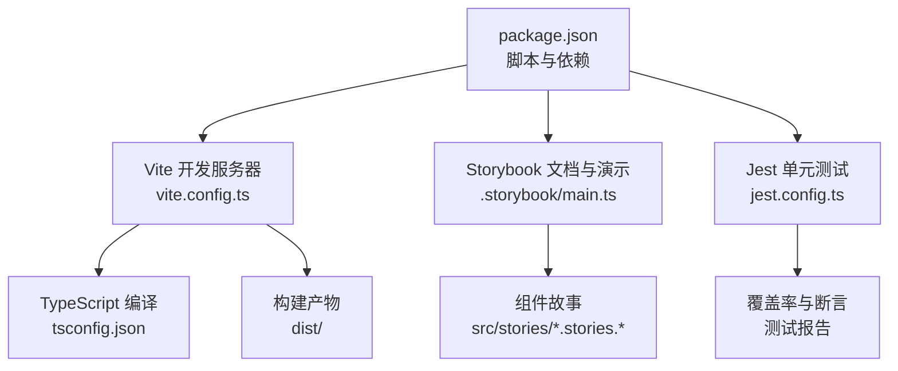
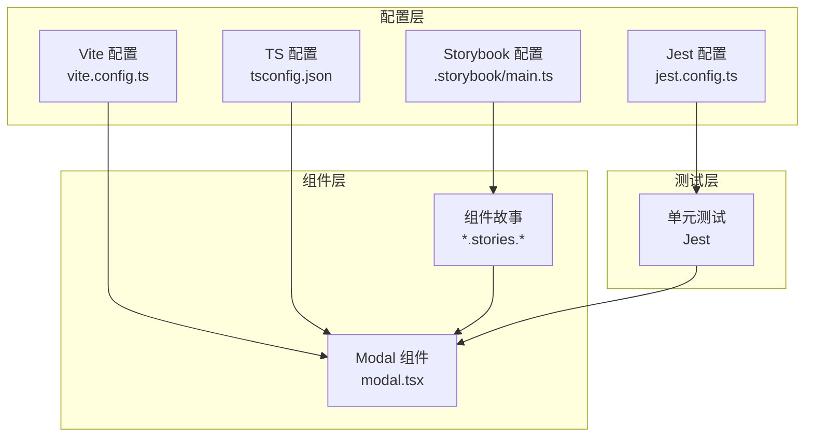
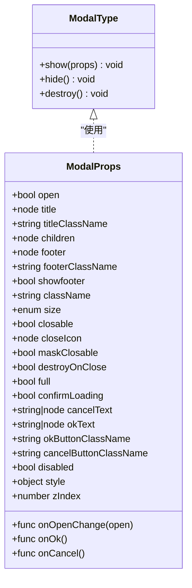
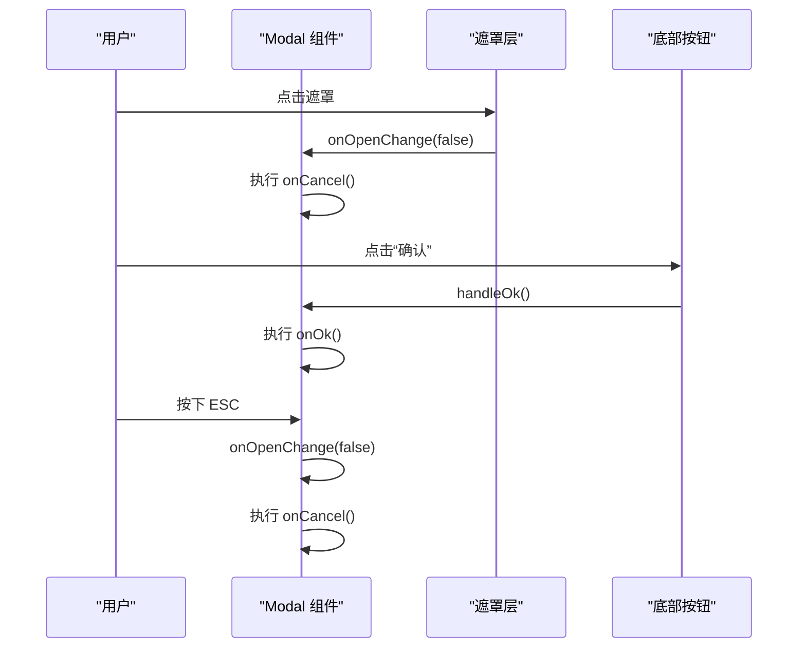
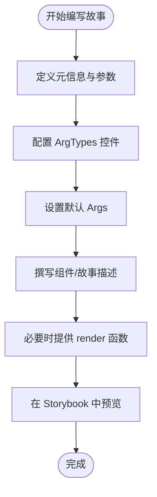
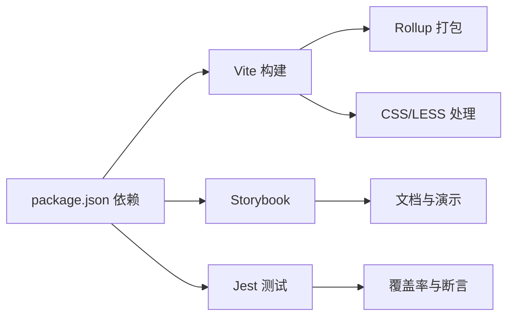

# 组件开发规范

<cite>
**本文引用的文件**
- [web/package.json](file://web/package.json)
- [web/.storybook/main.ts](file://web/.storybook/main.ts)
- [web/vite.config.ts](file://web/vite.config.ts)
- [web/tsconfig.json](file://web/tsconfig.json)
- [web/src/stories/button-loading.stories.ts](file://web/src/stories/button-loading.stories.ts)
- [web/src/stories/ragflow-form.stories.tsx](file://web/src/stories/ragflow-form.stories.tsx)
- [web/src/stories/modal.stories.tsx](file://web/src/stories/modal.stories.tsx)
- [web/src/components/ui/modal/modal.tsx](file://web/src/components/ui/modal/modal.tsx)
- [web/jest.config.ts](file://web/jest.config.ts)
</cite>

## 目录
1. [简介](#简介)
2. [项目结构](#项目结构)
3. [核心组件](#核心组件)
4. [架构总览](#架构总览)
5. [详细组件分析](#详细组件分析)
6. [依赖分析](#依赖分析)
7. [性能考虑](#性能考虑)
8. [故障排查指南](#故障排查指南)
9. [结论](#结论)
10. [附录](#附录)

## 简介
本指南面向前端组件开发者，系统化阐述组件设计原则、代码结构、属性与事件规范、生命周期与状态管理、错误边界处理、Storybook 故事编写、组件测试与文档生成、复用策略、性能优化与可访问性设计，并给出版本管理、发布流程与维护策略建议。内容基于仓库中 Web 前端工程（React + TypeScript + Vite + Storybook）的实际实现与配置进行提炼与总结。

## 项目结构
Web 前端位于 web 目录，采用 Vite 构建，Storybook 提供组件可视化与文档，Jest 负责单元测试。关键配置包括：
- 包管理与脚本：通过 package.json 定义构建、开发、测试、Storybook 启动与预提交钩子等命令。
- Storybook 配置：main.ts 指定故事扫描路径、样式加载规则、别名解析与框架集成。
- Vite 配置：vite.config.ts 设置路径别名、CSS 预处理器、代理、构建产物与分包策略、压缩与 sourcemap。
- TypeScript 配置：tsconfig.json 统一编译选项、路径映射与类型声明。
- 测试配置：jest.config.ts 指定浏览器目标、JSX 转换器、覆盖率收集范围与初始化脚本。

图表来源
- [web/package.json:1-195](file://web/package.json#L1-L195)
- [web/.storybook/main.ts:1-64](file://web/.storybook/main.ts#L1-L64)
- [web/vite.config.ts:1-174](file://web/vite.config.ts#L1-L174)
- [web/tsconfig.json:1-37](file://web/tsconfig.json#L1-L37)
- [web/jest.config.ts:1-34](file://web/jest.config.ts#L1-L34)

章节来源
- [web/package.json:1-195](file://web/package.json#L1-L195)
- [web/.storybook/main.ts:1-64](file://web/.storybook/main.ts#L1-L64)
- [web/vite.config.ts:1-174](file://web/vite.config.ts#L1-L174)
- [web/tsconfig.json:1-37](file://web/tsconfig.json#L1-L37)
- [web/jest.config.ts:1-34](file://web/jest.config.ts#L1-L34)

## 核心组件
本节聚焦于 Modal 组件，作为 UI 组件的代表，展示属性定义、事件处理、生命周期与状态管理、可访问性与错误边界的实践要点。

- 属性定义与默认值
  - 受控开关 open、回调 onOpenChange
  - 标题 title、标题类名 titleClassName
  - 子内容 children、底部区域 footer 与类名 footerClassName
  - 是否显示底部 showfooter、自定义容器类名 className
  - 尺寸 size（small/default/large）、是否可关闭 closable、关闭图标 closeIcon
  - 遮罩点击关闭 maskClosable、关闭时销毁 destroyOnClose、全屏模式 full
  - 确认按钮文案与类名 okText/okButtonClassName、取消按钮文案与类名 cancelText/cancelButtonClassName
  - 加载态 confirmLoading、禁用 disabled、内联样式 style、层级 zIndex
- 事件处理
  - ESC 键盘事件监听与关闭联动
  - 底部按钮点击：确认 onOk、取消 onCancel
  - 遮罩点击：maskClosable 控制是否允许点击遮罩关闭
- 生命周期与状态
  - 使用 useEffect 注册/卸载键盘事件
  - 使用 useMemo 缓存底部渲染逻辑，减少重渲染
  - 使用 useCallback 规范回调函数引用
- 可访问性
  - 基于 Radix UI Dialog primitives，具备无障碍语义与键盘导航
  - 支持焦点管理与 ESC 关闭
- 错误边界
  - 对 onOpenChange 的调用进行空检查，避免在非受控场景下触发异常
  - confirmLoading 与 disabled 状态控制按钮交互

章节来源
- [web/src/components/ui/modal/modal.tsx:1-244](file://web/src/components/ui/modal/modal.tsx#L1-L244)

## 架构总览
组件开发遵循“配置驱动 + 工具链协同”的架构：
- 配置层：Vite、Storybook、Jest、TypeScript 四大配置文件统一约束开发体验与构建产物。
- 组件层：以原子组件为基础，组合为业务组件；通过 Storybook 输出文档与示例。
- 测试层：Jest 驱动单元测试，结合测试工具库进行断言与覆盖率统计。
- 发布层：通过脚本与 CI/CD 实现版本管理与自动化发布（见附录）。

图表来源
- [web/vite.config.ts:1-174](file://web/vite.config.ts#L1-L174)
- [web/.storybook/main.ts:1-64](file://web/.storybook/main.ts#L1-L64)
- [web/jest.config.ts:1-34](file://web/jest.config.ts#L1-L34)
- [web/tsconfig.json:1-37](file://web/tsconfig.json#L1-L37)
- [web/src/components/ui/modal/modal.tsx:1-244](file://web/src/components/ui/modal/modal.tsx#L1-L244)

## 详细组件分析

### Modal 组件分析
- 设计原则
  - 受控优先：通过 open/onOpenChange 明确状态来源，避免内部状态与外部状态冲突。
  - 可组合性：children、footer、title 等插槽化设计，支持高度定制。
  - 可访问性：基于 Radix UI，确保键盘导航与屏幕阅读器友好。
- 数据结构与复杂度
  - 属性集合庞大但均为 O(1) 访问；底部渲染通过 useMemo 缓存，降低重渲染成本。
- 依赖关系
  - 依赖 Radix UI Dialog primitives、lucide-react 图标、i18n 国际化、工具函数 cn。
- 错误处理
  - onOpenChange 调用前进行空检查；键盘事件注册/卸载成对出现；遮罩关闭行为由 maskClosable 控制。
- 性能影响
  - 使用 useMemo 缓存底部区域；按键事件仅在组件挂载期间有效；滚动条与最大高度限制提升长内容渲染效率。

图表来源
- [web/src/components/ui/modal/modal.tsx:9-40](file://web/src/components/ui/modal/modal.tsx#L9-L40)

图表来源
- [web/src/components/ui/modal/modal.tsx:77-108](file://web/src/components/ui/modal/modal.tsx#L77-L108)
- [web/src/components/ui/modal/modal.tsx:129-144](file://web/src/components/ui/modal/modal.tsx#L129-L144)

章节来源
- [web/src/components/ui/modal/modal.tsx:1-244](file://web/src/components/ui/modal/modal.tsx#L1-L244)

### Storybook 故事编写规范
- 元信息与参数
  - title：按 Example/Category/Component 命名空间组织
  - component：指向被演示的组件
  - parameters.docs.description：组件级与故事级描述
  - layout：Canvas 布局设置
  - tags：autodocs 自动生成文档入口
- ArgTypes 与 Args
  - 通过 control 指定交互式控件类型（boolean/text/select）
  - args 用于默认参数注入，便于快速预览
- 示例与用法
  - 在参数中提供可复制的 TSX 片段，便于使用者直接粘贴
  - 使用 render 自定义交互示例，展示真实使用场景

图表来源
- [web/src/stories/button-loading.stories.ts:1-61](file://web/src/stories/button-loading.stories.ts#L1-L61)
- [web/src/stories/ragflow-form.stories.tsx:1-232](file://web/src/stories/ragflow-form.stories.tsx#L1-L232)
- [web/src/stories/modal.stories.tsx:1-739](file://web/src/stories/modal.stories.tsx#L1-L739)

章节来源
- [web/src/stories/button-loading.stories.ts:1-61](file://web/src/stories/button-loading.stories.ts#L1-L61)
- [web/src/stories/ragflow-form.stories.tsx:1-232](file://web/src/stories/ragflow-form.stories.tsx#L1-L232)
- [web/src/stories/modal.stories.tsx:1-739](file://web/src/stories/modal.stories.tsx#L1-L739)

### 组件测试与覆盖率
- 测试环境
  - Jest + 浏览器目标 + esbuild JSX 自动转换
  - 初始化脚本 jest-setup.ts 注入测试工具
- 覆盖率阈值
  - 全局行覆盖率最低 1 行，便于推动持续改进
- 断言与快照
  - 结合 @testing-library/react 进行 DOM 断言
  - 可选使用快照测试验证渲染一致性

章节来源
- [web/jest.config.ts:1-34](file://web/jest.config.ts#L1-L34)

## 依赖分析
- 构建与打包
  - Vite 提供开发服务器与生产构建，Rollup 作为打包器；手动分包策略将第三方库拆分为独立 chunk，提升缓存命中率。
- 样式与主题
  - PostCSS + TailwindCSS + Less 预处理；全局变量与混入注入，保证主题一致性。
- 类型与路径
  - TypeScript 路径别名 @/* 指向 src，提升导入可读性；严格模式与未使用检测保障代码质量。
- Storybook 与测试
  - Storybook 使用 SWC 编译器与 Webpack5；Jest 配置与 Umi 别名集成，简化测试配置。

图表来源
- [web/package.json:1-195](file://web/package.json#L1-L195)
- [web/vite.config.ts:103-140](file://web/vite.config.ts#L103-L140)
- [web/.storybook/main.ts:7-47](file://web/.storybook/main.ts#L7-L47)
- [web/jest.config.ts:4-32](file://web/jest.config.ts#L4-L32)

章节来源
- [web/package.json:1-195](file://web/package.json#L1-L195)
- [web/vite.config.ts:103-140](file://web/vite.config.ts#L103-L140)
- [web/.storybook/main.ts:7-47](file://web/.storybook/main.ts#L7-L47)
- [web/jest.config.ts:4-32](file://web/jest.config.ts#L4-L32)

## 性能考虑
- 分包与缓存
  - 通过 Rollup manualChunks 将常用库（如 lodash、dayjs、axios）拆分为 utils；AntV、d3 等单独分包；第三方依赖按名称拆分，提升浏览器缓存复用。
- 构建优化
  - 生产构建启用 Terser 压缩，移除 console 与 debugger；去除注释；开启 CSS 代码分割；保留 sourcemap 便于排错。
- 渲染优化
  - 使用 useMemo 缓存昂贵计算或重复渲染节点；合理拆分子组件，避免不必要的重渲染。
- 网络与代理
  - Vite 本地开发代理到后端服务，减少跨域与请求延迟；生产环境通过基础路径与静态资源目录优化加载。

章节来源
- [web/vite.config.ts:103-161](file://web/vite.config.ts#L103-L161)

## 故障排查指南
- Storybook 样式不生效
  - 检查 .storybook/main.ts 中 CSS/LESS 规则与 PostCSS 插件配置；确认路径别名 @ 已正确映射至 src。
- 组件无法受控
  - 确认父组件传入 open 并实现 onOpenChange；避免同时使用内部状态覆盖外部状态。
- Modal 无法关闭
  - 检查 maskClosable 与 closable 配置；确认 ESC 键盘事件未被其他元素拦截。
- 测试失败或覆盖率低
  - 检查 jest.config.ts 的 collectCoverageFrom 与 setupFilesAfterEnv；确保测试文件命名与路径匹配。

章节来源
- [web/.storybook/main.ts:53-61](file://web/.storybook/main.ts#L53-L61)
- [web/src/components/ui/modal/modal.tsx:77-108](file://web/src/components/ui/modal/modal.tsx#L77-L108)
- [web/jest.config.ts:12-31](file://web/jest.config.ts#L12-L31)

## 结论
本规范以 Modal 组件为切入点，结合 Storybook、Jest、Vite、TypeScript 等工具链，给出了组件开发的完整实践路径：从设计原则、属性与事件规范，到生命周期与状态管理、可访问性与错误边界处理；并配套了故事编写、测试与文档生成、性能优化与复用策略。建议在团队内推广该规范，形成一致的组件开发与交付标准。

## 附录
- 版本管理与发布流程（建议）
  - 使用语义化版本号；在 package.json 中维护版本字段；通过脚本执行构建、测试与打包；在 CI 中执行 Storybook 构建与静态站点部署。
- 维护策略
  - 定期更新依赖与工具链；保持 Storybook 文档与示例同步；对高风险组件（如对话框、表单）增加回归测试；建立组件变更评审流程。