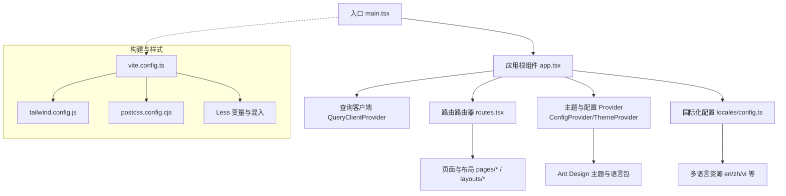
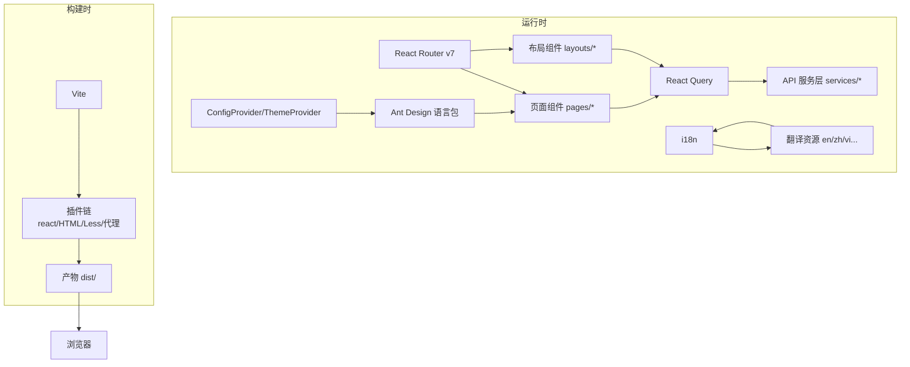
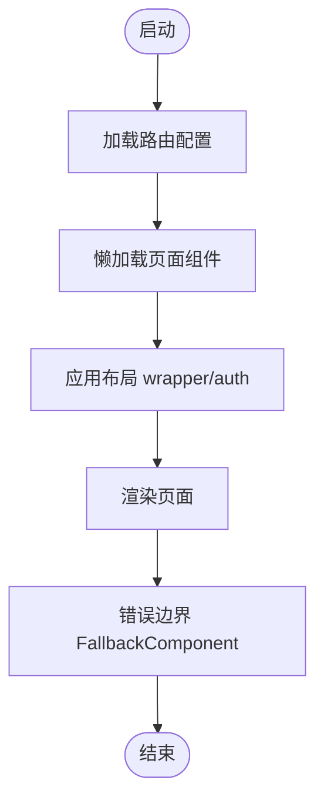
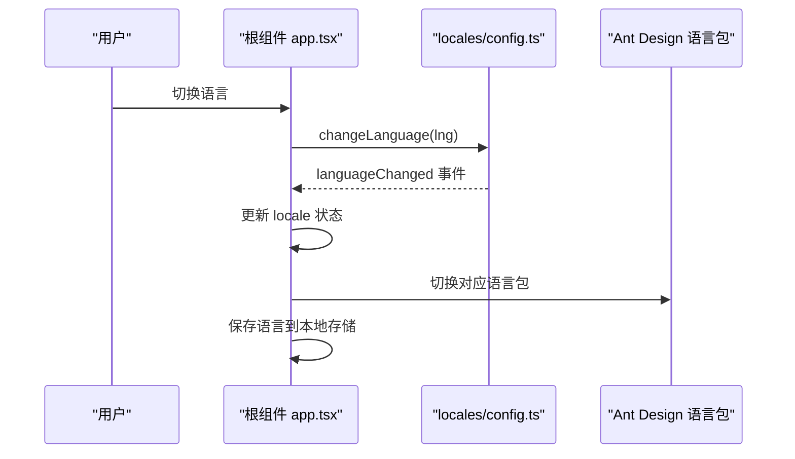
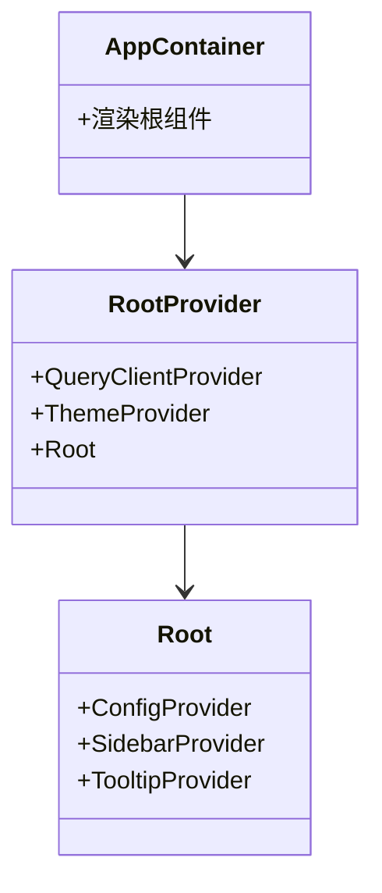
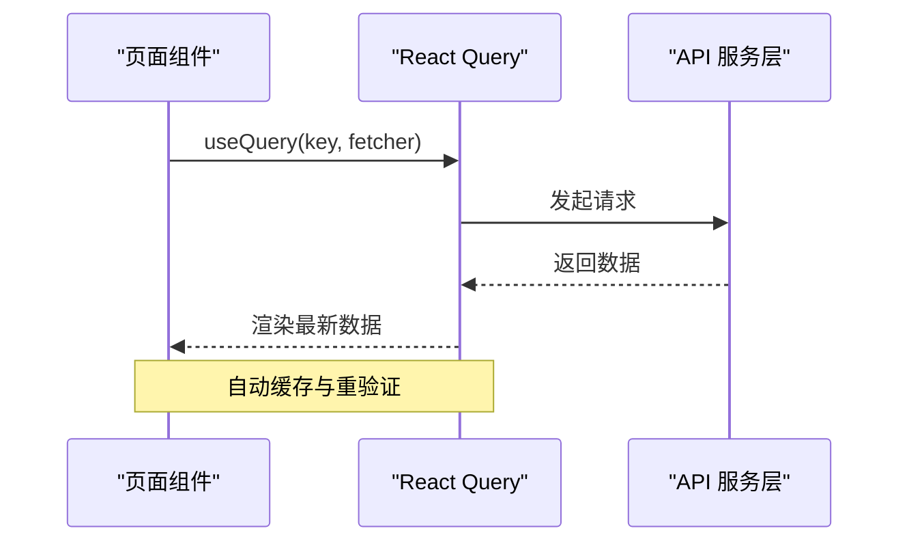
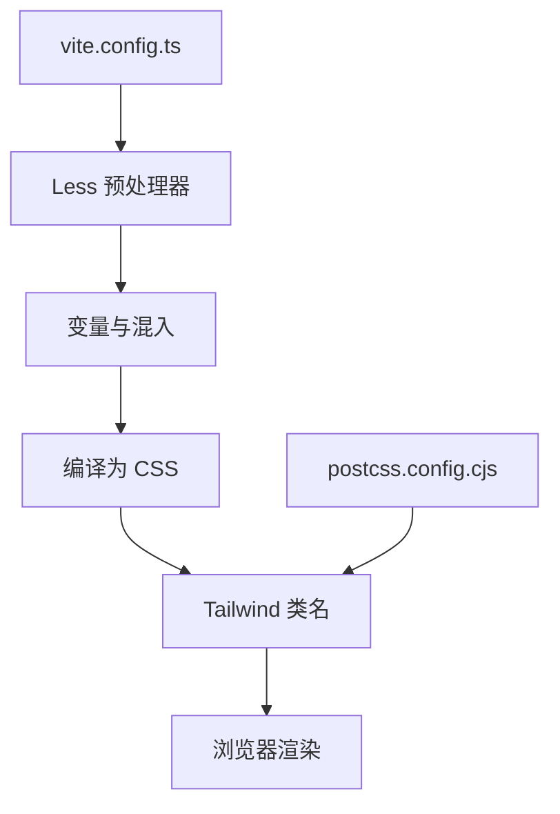
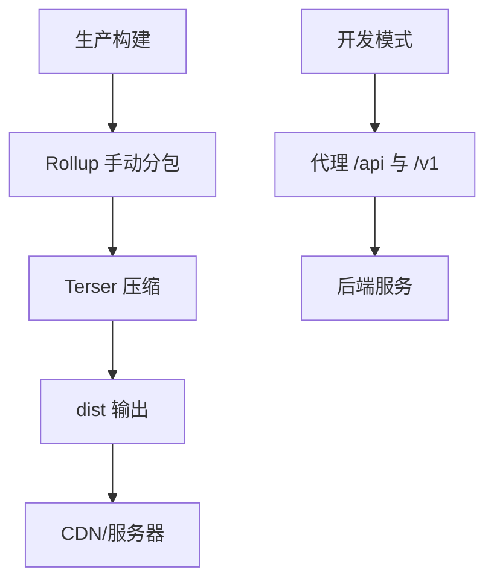
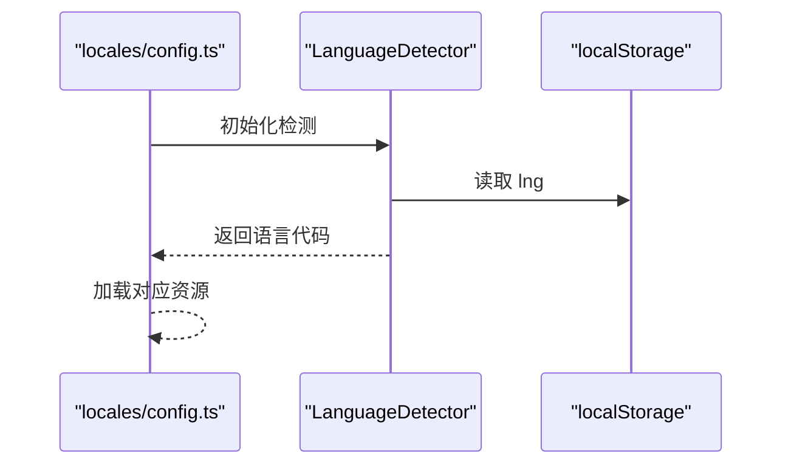
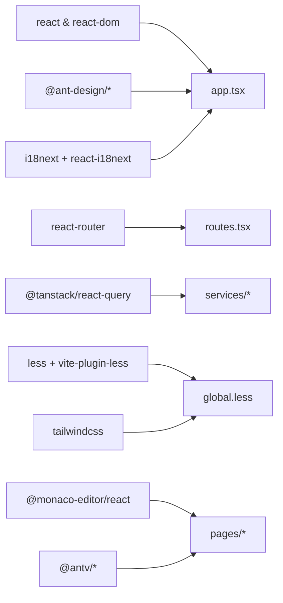

# 前端开发

<cite>
**本文引用的文件**
- [package.json](file://web/package.json)
- [vite.config.ts](file://web/vite.config.ts)
- [app.tsx](file://web/src/app.tsx)
- [main.tsx](file://web/src/main.tsx)
- [routes.tsx](file://web/src/routes.tsx)
- [conf.json](file://web/src/conf.json)
- [tailwind.config.js](file://web/tailwind.config.js)
- [postcss.config.cjs](file://web/postcss.config.cjs)
- [locales/config.ts](file://web/src/locales/config.ts)
</cite>

## 目录
1. [引言](#引言)
2. [项目结构](#项目结构)
3. [核心组件](#核心组件)
4. [架构总览](#架构总览)
5. [详细组件分析](#详细组件分析)
6. [依赖关系分析](#依赖关系分析)
7. [性能考虑](#性能考虑)
8. [故障排查指南](#故障排查指南)
9. [结论](#结论)
10. [附录](#附录)

## 引言
本技术指南面向前端应用开发，围绕 React + Vite 的现代前端架构展开，系统讲解组件化开发、状态管理、路由配置、UI 组件库（Ant Design）定制与扩展、国际化（i18n）、WebSocket 实时通信集成、组件开发最佳实践、构建与部署一致性、以及调试与测试方法。文档以仓库中的实际代码为依据，结合可视化图示帮助不同背景的读者快速上手并高效开发。

## 项目结构
前端工程位于 web 目录，采用 Vite 作为构建工具，TypeScript 编写，TailwindCSS + Less 提供样式体系，Ant Design 作为基础 UI 组件库，配合 Radix UI 系列组件完善交互体验；路由基于 React Router v7；状态管理采用 TanStack React Query；国际化使用 i18next + react-i18next；Monaco Editor、Markdown 渲染、图表库等按需引入。

**图表来源**
- [main.tsx:1-14](file://web/src/main.tsx#L1-L14)
- [app.tsx:1-162](file://web/src/app.tsx#L1-L162)
- [routes.tsx:1-451](file://web/src/routes.tsx#L1-L451)
- [vite.config.ts:1-174](file://web/vite.config.ts#L1-L174)
- [tailwind.config.js:1-229](file://web/tailwind.config.js#L1-L229)
- [postcss.config.cjs:1-8](file://web/postcss.config.cjs#L1-L8)
- [locales/config.ts:1-89](file://web/src/locales/config.ts#L1-L89)

**章节来源**
- [package.json:1-195](file://web/package.json#L1-L195)
- [vite.config.ts:1-174](file://web/vite.config.ts#L1-L174)
- [main.tsx:1-14](file://web/src/main.tsx#L1-L14)
- [app.tsx:1-162](file://web/src/app.tsx#L1-L162)
- [routes.tsx:1-451](file://web/src/routes.tsx#L1-L451)
- [tailwind.config.js:1-229](file://web/tailwind.config.js#L1-L229)
- [postcss.config.cjs:1-8](file://web/postcss.config.cjs#L1-L8)
- [locales/config.ts:1-89](file://web/src/locales/config.ts#L1-L89)

## 核心组件
- 应用根容器：在根组件中统一注入主题、语言、国际化、查询客户端、全局提示等能力，形成稳定的上下文环境。
- 路由系统：集中定义页面路由、嵌套路由、懒加载、错误边界与布局包装器。
- 国际化：集中初始化 i18n、检测语言、注册多语言资源与翻译表。
- 构建与样式：Vite 配置别名、Less 注入、HTML 注入标题、代理后端接口、分包策略与压缩配置；Tailwind 与 PostCSS 集成。

**章节来源**
- [app.tsx:84-162](file://web/src/app.tsx#L84-L162)
- [routes.tsx:6-451](file://web/src/routes.tsx#L6-L451)
- [locales/config.ts:1-89](file://web/src/locales/config.ts#L1-L89)
- [vite.config.ts:10-174](file://web/vite.config.ts#L10-L174)

## 架构总览
React + Vite 前端架构以“根容器 + 路由 + 国际化 + 主题 + 查询客户端”为核心，页面通过懒加载与嵌套布局组织，构建期通过 Vite 插件链路完成 HTML 注入、静态资源复制、Less 全局变量注入与代理转发，运行期通过 React Router v7 提供导航与参数传递，TanStack Query 提供数据获取与缓存，Ant Design 提供 UI 基础与本地化语言包。

**图表来源**
- [routes.tsx:1-451](file://web/src/routes.tsx#L1-L451)
- [app.tsx:1-162](file://web/src/app.tsx#L1-L162)
- [locales/config.ts:1-89](file://web/src/locales/config.ts#L1-L89)
- [vite.config.ts:1-174](file://web/vite.config.ts#L1-L174)

## 详细组件分析

### 路由与页面组织
- 路由枚举与路径常量集中管理，便于维护与跳转。
- 使用 React Router v7 的 createBrowserRouter，支持懒加载、嵌套路由、错误边界与布局包装器。
- 支持分享页、挂件页、管理员后台等特殊路由场景。
- 基于环境变量设置 basename，保证多基路径部署一致性。

**图表来源**
- [routes.tsx:68-451](file://web/src/routes.tsx#L68-L451)

**章节来源**
- [routes.tsx:1-451](file://web/src/routes.tsx#L1-L451)

### 国际化与本地化
- 初始化 i18next，启用浏览器语言检测与本地存储回填。
- 注册多语言资源，支持英文、简体中文、繁体中文、日语、越南语、俄语、西班牙语、葡萄牙语、德语、法语、意大利语等。
- 提供翻译表生成与扁平化工具，便于统一管理键值与校验缺失项。
- 在根组件中监听语言变更事件，同步更新 Ant Design 语言包与本地存储。

**图表来源**
- [app.tsx:91-94](file://web/src/app.tsx#L91-L94)
- [locales/config.ts:73-86](file://web/src/locales/config.ts#L73-L86)

**章节来源**
- [locales/config.ts:1-89](file://web/src/locales/config.ts#L1-L89)
- [app.tsx:50-94](file://web/src/app.tsx#L50-L94)

### 主题与 UI 组件库（Ant Design）
- 通过 ConfigProvider 注入主题算法（明/暗）与字体，适配 Radix UI 系列组件。
- 集成 Ant Design 多语言包，随 i18n 动态切换。
- 使用 ahooks 的响应式断点配置，提升移动端体验。
- 提供全局样式入口与 Tailwind/TanStack 组件生态。

**图表来源**
- [app.tsx:121-162](file://web/src/app.tsx#L121-L162)

**章节来源**
- [app.tsx:1-162](file://web/src/app.tsx#L1-L162)

### 状态管理与数据流
- 使用 TanStack React Query 管理全局数据状态、缓存与失效策略，避免重复请求与手动缓存。
- 结合 React Router v7 的路由参数与查询参数，实现页面级状态与全局状态的解耦。
- 开发环境下可选集成 Query Devtools（注释掉），生产关闭调试面板。

**图表来源**
- [app.tsx:80](file://web/src/app.tsx#L80)
- [routes.tsx:1-451](file://web/src/routes.tsx#L1-L451)

**章节来源**
- [app.tsx:80-81](file://web/src/app.tsx#L80-L81)

### 样式与主题系统
- TailwindCSS 与 PostCSS 集成，支持容器查询、滚动条美化、动画插件等。
- Less 全局变量与混入注入，统一颜色、边框、圆角、动画等设计令牌。
- Vite 配置中注入 Less 预处理与变量覆盖，确保样式一致与可定制。

**图表来源**
- [vite.config.ts:43-60](file://web/vite.config.ts#L43-L60)
- [tailwind.config.js:1-229](file://web/tailwind.config.js#L1-L229)
- [postcss.config.cjs:1-8](file://web/postcss.config.cjs#L1-L8)

**章节来源**
- [tailwind.config.js:1-229](file://web/tailwind.config.js#L1-L229)
- [postcss.config.cjs:1-8](file://web/postcss.config.cjs#L1-L8)
- [vite.config.ts:43-60](file://web/vite.config.ts#L43-L60)

### 构建与部署配置
- Vite 插件链：React、HTML 注入、静态资源复制、开发检查器。
- 代理配置：将 /api/v1/admin 与 /(api|v1) 请求转发至后端服务，支持 WebSocket。
- 分包策略：对第三方库进行手动分包，提升缓存命中率与首屏性能。
- 生产构建：Terser 压缩、去除 console 与 debugger、移除注释、SourceMap 保留。
- 基础路径：通过环境变量 VITE_BASE_URL 控制部署路径。

**图表来源**
- [vite.config.ts:67-78](file://web/vite.config.ts#L67-L78)
- [vite.config.ts:103-161](file://web/vite.config.ts#L103-L161)

**章节来源**
- [vite.config.ts:1-174](file://web/vite.config.ts#L1-L174)

### 组件开发最佳实践
- 组件化开发：页面与布局分离，使用懒加载与嵌套布局，减少初始包体积。
- 样式管理：优先使用 Tailwind 类名，必要时引入 Less 变量；避免内联样式。
- 性能优化：利用 React.lazy、React.Suspense、Query 缓存、分包策略与 Tree Shaking。
- 可访问性：使用 Radix UI 组件，保持键盘导航与屏幕阅读器友好。
- 可测试性：页面与服务层解耦，Query 层便于 Mock 与单元测试。

**章节来源**
- [routes.tsx:1-451](file://web/src/routes.tsx#L1-L451)
- [app.tsx:1-162](file://web/src/app.tsx#L1-L162)

### 国际化支持实现机制
- 语言检测：i18next-browser-languagedetector 从浏览器与本地存储读取语言。
- 资源管理：集中导入各语言翻译文件，统一注册到 i18n。
- 动态切换：根组件监听 languageChanged 事件，动态更新 Ant Design 语言包与本地存储。
- 键值管理：提供翻译表生成与扁平化工具，辅助发现缺失键或冗余键。

**图表来源**
- [locales/config.ts:73-86](file://web/src/locales/config.ts#L73-L86)

**章节来源**
- [locales/config.ts:1-89](file://web/src/locales/config.ts#L1-L89)

### WebSocket 实时通信集成
- 代理层已开启 ws: true，可将 WebSocket 连接通过代理转发至后端服务，便于开发与跨域场景。
- 建议在业务层封装 WebSocket 客户端，结合 React Query 管理连接状态与重连策略。
- 对于长连接场景，建议结合服务端心跳与客户端退避重连策略，增强稳定性。

**章节来源**
- [vite.config.ts:67-78](file://web/vite.config.ts#L67-L78)

## 依赖关系分析
- 依赖分层：React 生态（Router、Query、Form）、Ant Design 生态（ProComponents、图标）、Tailwind 与 PostCSS、Monaco Editor、Markdown 渲染、图表库、国际化、Zustand（可选状态管理）。
- 关键耦合点：根组件聚合 Provider，路由懒加载依赖页面模块，国际化与 Ant Design 语言包联动，构建期插件链影响运行时性能。

**图表来源**
- [package.json:25-133](file://web/package.json#L25-L133)
- [app.tsx:1-162](file://web/src/app.tsx#L1-L162)
- [routes.tsx:1-451](file://web/src/routes.tsx#L1-L451)
- [vite.config.ts:14-36](file://web/vite.config.ts#L14-L36)

**章节来源**
- [package.json:1-195](file://web/package.json#L1-L195)

## 性能考虑
- 懒加载与分包：路由懒加载与 Rollup 手动分包策略降低首屏体积。
- 压缩与去重：生产构建启用 Terser，移除 console 与注释，提升传输效率。
- 缓存策略：Query 缓存与浏览器缓存结合，减少重复请求。
- 样式体积：Tailwind 按需扫描内容，避免无用类名进入产物。

**章节来源**
- [vite.config.ts:103-161](file://web/vite.config.ts#L103-L161)

## 故障排查指南
- 路由不生效：检查路由配置与懒加载路径是否正确，确认 basename 设置。
- 国际化无效：确认 i18n 初始化顺序与语言检测配置，检查本地存储键值。
- 样式异常：检查 Less 注入与 Tailwind 内容扫描范围，确认 PostCSS 插件顺序。
- 构建失败：查看 Vite 插件链与 TypeScript 配置，关注 esbuild 严格性设置。
- 代理 WebSocket 不通：确认代理 ws: true 与后端服务地址，检查 CORS 与鉴权。

**章节来源**
- [routes.tsx:1-451](file://web/src/routes.tsx#L1-L451)
- [locales/config.ts:1-89](file://web/src/locales/config.ts#L1-L89)
- [vite.config.ts:14-36](file://web/vite.config.ts#L14-L36)

## 结论
该前端架构以 React + Vite 为基础，结合 Ant Design、TanStack Query、i18n、TailwindCSS 与 Less，实现了高可维护性的组件化开发与现代化工程实践。通过路由懒加载、分包策略、代理与构建优化，兼顾了开发体验与运行性能。国际化与主题系统提供了良好的可扩展性，适合在多语言、多主题场景下持续演进。

## 附录
- 入口与根组件：[main.tsx:1-14](file://web/src/main.tsx#L1-L14)、[app.tsx:1-162](file://web/src/app.tsx#L1-L162)
- 路由与页面：[routes.tsx:1-451](file://web/src/routes.tsx#L1-L451)
- 国际化：[locales/config.ts:1-89](file://web/src/locales/config.ts#L1-L89)
- 构建与样式：[vite.config.ts:1-174](file://web/vite.config.ts#L1-L174)、[tailwind.config.js:1-229](file://web/tailwind.config.js#L1-L229)、[postcss.config.cjs:1-8](file://web/postcss.config.cjs#L1-L8)
- 应用名称：[conf.json:1-4](file://web/src/conf.json#L1-L4)
- 包管理与脚本：[package.json:1-195](file://web/package.json#L1-L195)