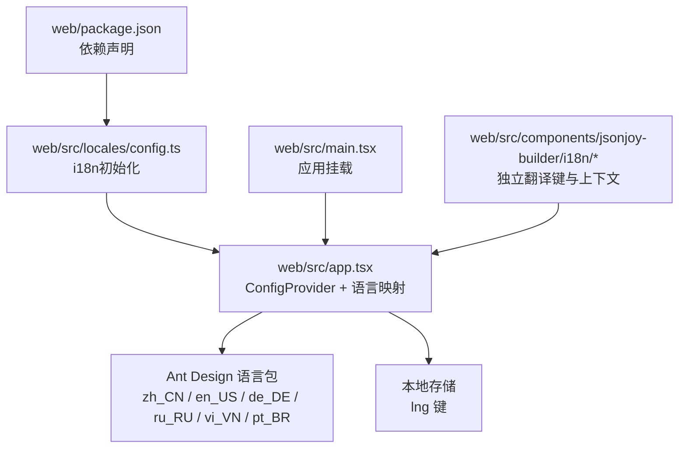
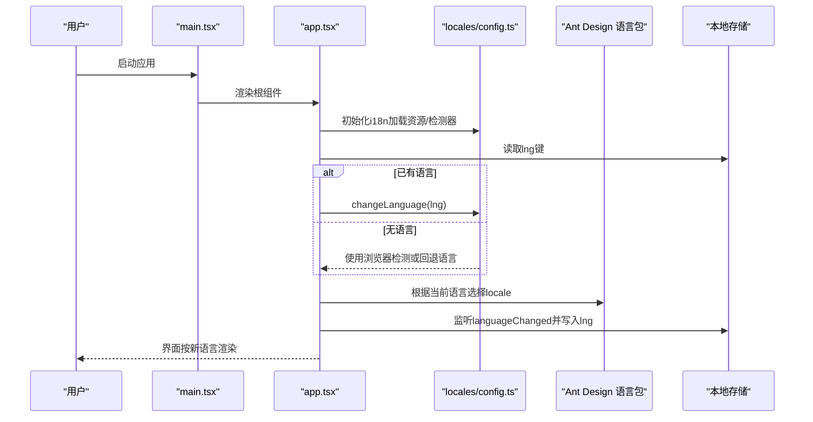
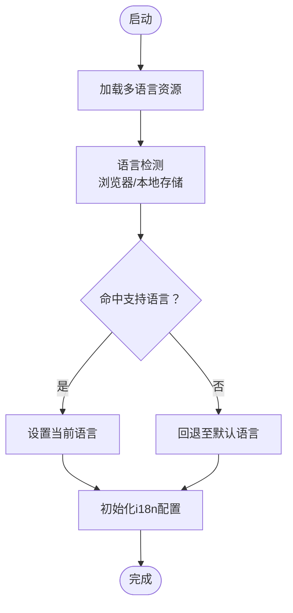
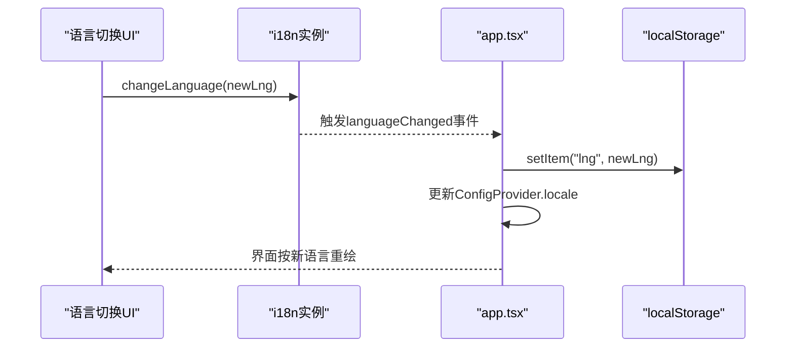
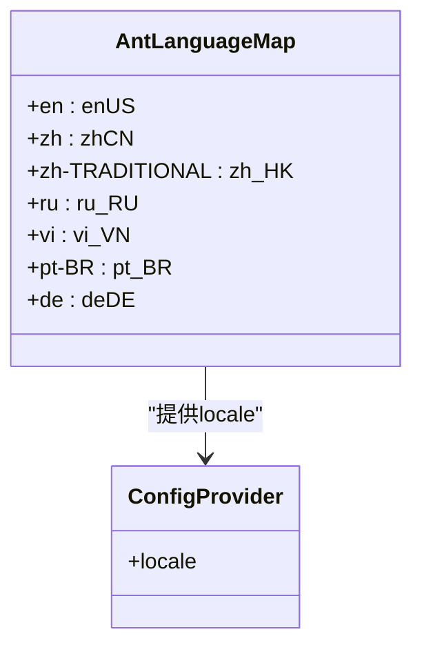
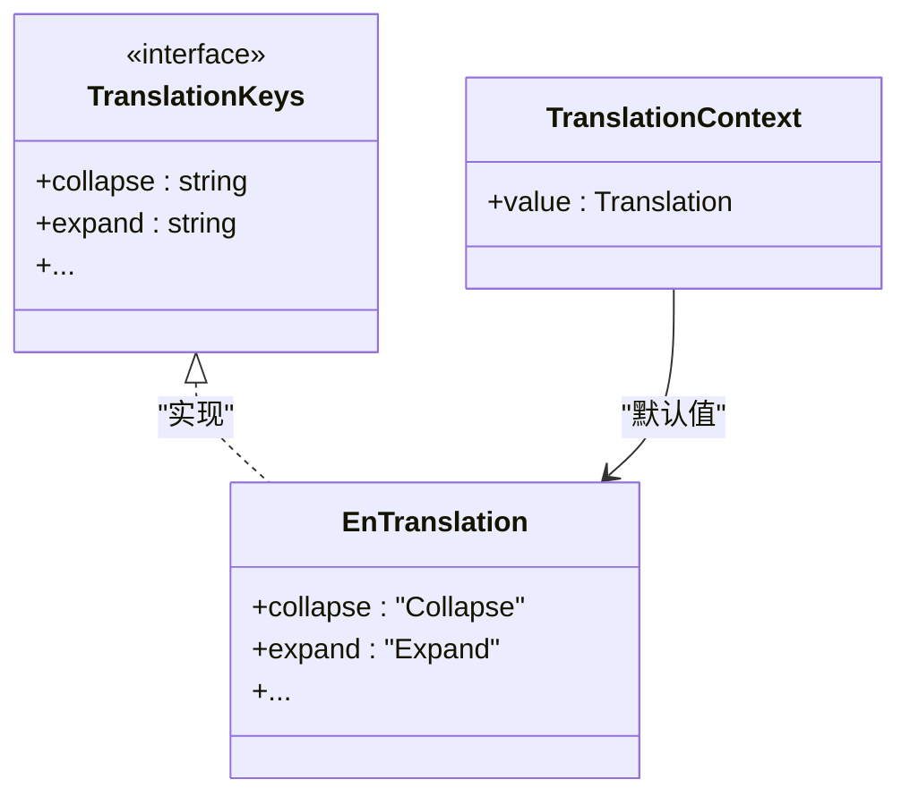
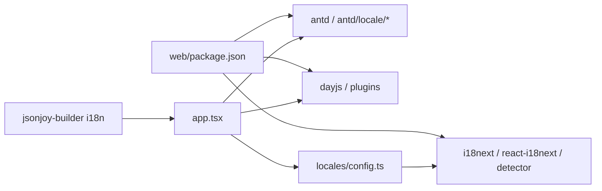

# 国际化支持

<cite>
**本文引用的文件**
- [web/package.json](file://web/package.json)
- [web/src/app.tsx](file://web/src/app.tsx)
- [web/src/main.tsx](file://web/src/main.tsx)
- [web/src/locales/config.ts](file://web/src/locales/config.ts)
- [web/src/components/jsonjoy-builder/i18n/translation-keys.ts](file://web/src/components/jsonjoy-builder/i18n/translation-keys.ts)
- [web/src/components/jsonjoy-builder/i18n/translation-context.ts](file://web/src/components/jsonjoy-builder/i18n/translation-context.ts)
- [web/src/components/jsonjoy-builder/i18n/locales/en.ts](file://web/src/components/jsonjoy-builder/i18n/locales/en.ts)
</cite>

## 目录
1. [简介](#简介)
2. [项目结构](#项目结构)
3. [核心组件](#核心组件)
4. [架构总览](#架构总览)
5. [详细组件分析](#详细组件分析)
6. [依赖关系分析](#依赖关系分析)
7. [性能考量](#性能考量)
8. [故障排查指南](#故障排查指南)
9. [结论](#结论)
10. [附录](#附录)

## 简介
本指南面向RAGFlow前端的国际化（i18n）实现，系统性阐述基于i18next与react-i18next的多语言架构，覆盖以下主题：
- i18next集成与配置
- 多语言资源组织（中文、英文、德文、俄文、越南文等）
- 动态语言切换机制（语言检测、本地存储、界面更新）
- Ant Design组件本地化适配（日期格式、数字格式、文本显示）
- 翻译资源管理策略（命名规范、文件组织、版本控制）
- 维护与更新流程（质量与一致性保障）
- 国际化测试方法（跨语言功能验证）

## 项目结构
RAGFlow前端国际化相关代码主要集中在以下位置：
- 根依赖：i18next、react-i18next、i18next-browser-languagedetector
- 初始化入口：locales/config.ts
- 应用根配置：app.tsx（Ant Design ConfigProvider、语言映射、本地存储联动）
- 主应用挂载：main.tsx
- 组件内使用：useTranslation/t等API在各页面与组件中广泛使用
- 子模块国际化：jsonjoy-builder组件内的独立翻译键体系与上下文

图表来源
- [web/package.json:25-132](file://web/package.json#L25-L132)
- [web/src/locales/config.ts:1-89](file://web/src/locales/config.ts#L1-L89)
- [web/src/app.tsx:50-119](file://web/src/app.tsx#L50-L119)
- [web/src/main.tsx:1-14](file://web/src/main.tsx#L1-L14)

章节来源
- [web/package.json:1-195](file://web/package.json#L1-L195)
- [web/src/locales/config.ts:1-89](file://web/src/locales/config.ts#L1-L89)
- [web/src/app.tsx:1-162](file://web/src/app.tsx#L1-L162)
- [web/src/main.tsx:1-14](file://web/src/main.tsx#L1-L14)

## 核心组件
- i18n初始化与资源注册
  - 在locales/config.ts中完成：
    - 引入i18next、LanguageDetector、initReactI18next
    - 导入各语言资源（中文、英文、德文、俄文、越南文等）
    - 配置检测策略（localStorage键名）、支持语言列表、回退语言、插值选项
    - 暴露i18n实例供全局使用
- 应用根级语言适配
  - 在app.tsx中：
    - 定义AntD语言包映射表
    - 使用ConfigProvider.locale绑定当前语言包
    - 监听languageChanged事件，同步更新ConfigProvider.locale并写入本地存储
    - 启动时从本地存储恢复语言设置
- 子模块独立翻译（jsonjoy-builder）
  - translation-keys.ts定义强类型翻译键
  - translation-context.ts提供React Context
  - locales/en.ts提供英文默认翻译

章节来源
- [web/src/locales/config.ts:1-89](file://web/src/locales/config.ts#L1-L89)
- [web/src/app.tsx:50-119](file://web/src/app.tsx#L50-L119)
- [web/src/components/jsonjoy-builder/i18n/translation-keys.ts:1-763](file://web/src/components/jsonjoy-builder/i18n/translation-keys.ts#L1-L763)
- [web/src/components/jsonjoy-builder/i18n/translation-context.ts:1-6](file://web/src/components/jsonjoy-builder/i18n/translation-context.ts#L1-L6)
- [web/src/components/jsonjoy-builder/i18n/locales/en.ts:1-152](file://web/src/components/jsonjoy-builder/i18n/locales/en.ts#L1-L152)

## 架构总览
下图展示国际化从初始化到运行期语言切换的全链路：

图表来源
- [web/src/main.tsx:1-14](file://web/src/main.tsx#L1-L14)
- [web/src/app.tsx:84-142](file://web/src/app.tsx#L84-L142)
- [web/src/locales/config.ts:73-86](file://web/src/locales/config.ts#L73-L86)

## 详细组件分析

### i18n初始化与资源管理
- 资源注册
  - 在locales/config.ts中集中导入并注册多语言资源，键名为语言简码（如zh、en、de、ru、vi、pt-br等），值为对应翻译对象。
  - 使用工具函数对各语言资源进行扁平化与对比表生成，便于后续校验与审计。
- 检测与回退
  - 通过i18next-browser-languagedetector自动检测浏览器语言，并允许从localStorage读取lng键进行覆盖。
  - 支持语言列表与回退语言（fallbackLng）统一配置。
- 插值与安全
  - 关闭escapeValue以允许富文本/HTML内容；结合业务场景注意XSS防护。

图表来源
- [web/src/locales/config.ts:20-86](file://web/src/locales/config.ts#L20-L86)

章节来源
- [web/src/locales/config.ts:1-89](file://web/src/locales/config.ts#L1-L89)

### 动态语言切换机制
- 切换触发
  - 通过i18n.changeLanguage(lng)触发语言切换。
- 本地持久化
  - 监听languageChanged事件，将新语言写入localStorage的lng键。
- UI同步
  - app.tsx根据当前语言选择AntD语言包并更新ConfigProvider.locale，从而驱动UI文本、日期时间等本地化。
- 首次加载
  - 应用启动时从localStorage读取lng并调用changeLanguage，保证刷新后语言状态一致。

图表来源
- [web/src/app.tsx:91-94](file://web/src/app.tsx#L91-L94)
- [web/src/app.tsx:121-128](file://web/src/app.tsx#L121-L128)
- [web/src/locales/config.ts:77-79](file://web/src/locales/config.ts#L77-L79)

章节来源
- [web/src/app.tsx:84-142](file://web/src/app.tsx#L84-L142)
- [web/src/locales/config.ts:73-86](file://web/src/locales/config.ts#L73-L86)

### Ant Design组件语言适配
- 语言包映射
  - 在app.tsx中定义AntLanguageMap，将i18n语言简码映射到antd/locale导出的语言包（zh_CN、en_US、de_DE、ru_RU、vi_VN、pt_BR等）。
- 全局注入
  - 通过ConfigProvider.locale将当前语言包注入整个应用，使日期选择器、表格、按钮文案等均按目标语言渲染。
- 日期与数字
  - 项目已引入dayjs插件扩展，可配合语言包实现日期格式化与本地化显示；具体格式化逻辑由AntD语言包与dayjs共同决定。

图表来源
- [web/src/app.tsx:50-58](file://web/src/app.tsx#L50-L58)
- [web/src/app.tsx:98-109](file://web/src/app.tsx#L98-L109)

章节来源
- [web/src/app.tsx:50-119](file://web/src/app.tsx#L50-L119)

### 子模块独立翻译（jsonjoy-builder）
- 类型安全
  - translation-keys.ts导出强类型Translation接口，确保所有翻译键在编译期受控。
- 上下文提供
  - translation-context.ts创建React Context，默认提供英文翻译，便于子模块按需消费。
- 默认语言
  - locales/en.ts提供英文默认翻译，作为其他语言的对照与回退基础。

图表来源
- [web/src/components/jsonjoy-builder/i18n/translation-keys.ts:1-763](file://web/src/components/jsonjoy-builder/i18n/translation-keys.ts#L1-L763)
- [web/src/components/jsonjoy-builder/i18n/translation-context.ts:1-6](file://web/src/components/jsonjoy-builder/i18n/translation-context.ts#L1-L6)
- [web/src/components/jsonjoy-builder/i18n/locales/en.ts:1-152](file://web/src/components/jsonjoy-builder/i18n/locales/en.ts#L1-L152)

章节来源
- [web/src/components/jsonjoy-builder/i18n/translation-keys.ts:1-763](file://web/src/components/jsonjoy-builder/i18n/translation-keys.ts#L1-L763)
- [web/src/components/jsonjoy-builder/i18n/translation-context.ts:1-6](file://web/src/components/jsonjoy-builder/i18n/translation-context.ts#L1-L6)
- [web/src/components/jsonjoy-builder/i18n/locales/en.ts:1-152](file://web/src/components/jsonjoy-builder/i18n/locales/en.ts#L1-L152)

## 依赖关系分析
- 外部依赖
  - i18next、react-i18next、i18next-browser-languagedetector用于多语言能力与语言检测
  - antd及其locale包用于UI本地化
  - dayjs及其插件用于日期本地化
- 内部耦合
  - app.tsx依赖locales/config.ts提供的i18n实例与AntD语言包
  - 子模块（如jsonjoy-builder）通过translation-keys.ts与translation-context.ts实现局部i18n

图表来源
- [web/package.json:25-132](file://web/package.json#L25-L132)
- [web/src/locales/config.ts:1-3](file://web/src/locales/config.ts#L1-L3)
- [web/src/app.tsx:7-14](file://web/src/app.tsx#L7-L14)

章节来源
- [web/package.json:1-195](file://web/package.json#L1-L195)
- [web/src/locales/config.ts:1-89](file://web/src/locales/config.ts#L1-L89)
- [web/src/app.tsx:1-162](file://web/src/app.tsx#L1-L162)

## 性能考量
- 资源加载
  - 建议采用按需加载策略（动态import）分拆大体量翻译文件，减少首屏体积。
- 缓存与持久化
  - localStorage缓存当前语言，避免每次启动重复检测与切换。
- 渲染优化
  - AntD语言包切换仅影响ConfigProvider范围内的组件，避免全量重渲染。
- 运行时开销
  - 语言检测器与插值处理开销较小，建议在生产环境保持启用以提升用户体验。

## 故障排查指南
- 语言未生效
  - 检查locales/config.ts中supportedLngs是否包含目标语言简码
  - 确认localStorage中lng键是否存在且值有效
  - 查看languageChanged事件监听是否正常执行
- 文案缺失或回退
  - 检查translation-keys.ts是否包含对应键
  - 确认对应语言的locales文件是否已提供该键值
- UI未本地化
  - 确认app.tsx中AntLanguageMap是否包含目标语言映射
  - 检查ConfigProvider.locale是否被正确传入

章节来源
- [web/src/locales/config.ts:80-86](file://web/src/locales/config.ts#L80-L86)
- [web/src/app.tsx:91-94](file://web/src/app.tsx#L91-L94)
- [web/src/components/jsonjoy-builder/i18n/translation-keys.ts:1-763](file://web/src/components/jsonjoy-builder/i18n/translation-keys.ts#L1-L763)

## 结论
RAGFlow前端的国际化方案以i18next为核心，结合react-i18next与AntD语言包，实现了从初始化、检测、持久化到UI适配的完整闭环。通过统一的资源管理与强类型键定义，既保证了开发效率，也提升了翻译质量与一致性。建议在后续迭代中完善按需加载、翻译覆盖率统计与自动化测试，持续优化国际化体验。

## 附录

### 多语言资源组织与命名规范
- 文件命名
  - 语言资源文件按语言简码命名（如zh.ts、en.ts、de.ts、ru.ts、vi.ts、pt-br.ts等）
- 目录结构
  - 顶层：web/src/locales 下存放主应用翻译资源
  - 子模块：web/src/components/jsonjoy-builder/i18n 下存放独立翻译键与上下文
- 键命名
  - 采用层级式点号命名（如schema.editor.title），便于分类与查找
  - 保持英文为唯一权威键，其他语言仅翻译值

章节来源
- [web/src/locales/config.ts:6-18](file://web/src/locales/config.ts#L6-L18)
- [web/src/components/jsonjoy-builder/i18n/translation-keys.ts:1-763](file://web/src/components/jsonjoy-builder/i18n/translation-keys.ts#L1-L763)

### 维护与更新方法
- 版本控制
  - 将translation-keys.ts纳入变更管理，任何新增/删除键需伴随评审
- 翻译一致性
  - 使用locales/config.ts中生成的对比表进行跨语言一致性检查
- 发布流程
  - 新增语言时，补充对应locales文件与AntD语言包映射
  - 更新supportedLngs与LanguageDetector配置

章节来源
- [web/src/locales/config.ts:45-72](file://web/src/locales/config.ts#L45-L72)
- [web/src/app.tsx:50-58](file://web/src/app.tsx#L50-L58)

### 国际化测试方法
- 自动化测试
  - 使用Jest与React Testing Library编写多语言断言，验证不同语言下文案与布局
- 手动回归
  - 在不同浏览器语言环境下验证语言检测与回退行为
  - 验证localStorage持久化与刷新后状态一致性
- 可访问性
  - 检查日期、数字、货币等格式在目标语言下的可读性与正确性

章节来源
- [web/src/locales/config.ts:77-86](file://web/src/locales/config.ts#L77-L86)
- [web/src/app.tsx:121-128](file://web/src/app.tsx#L121-L128)