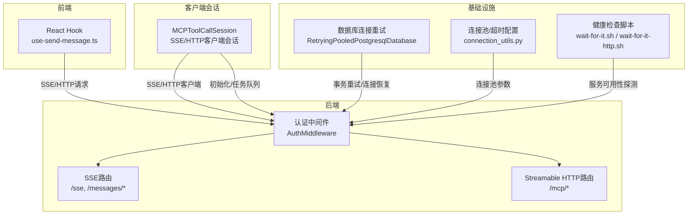
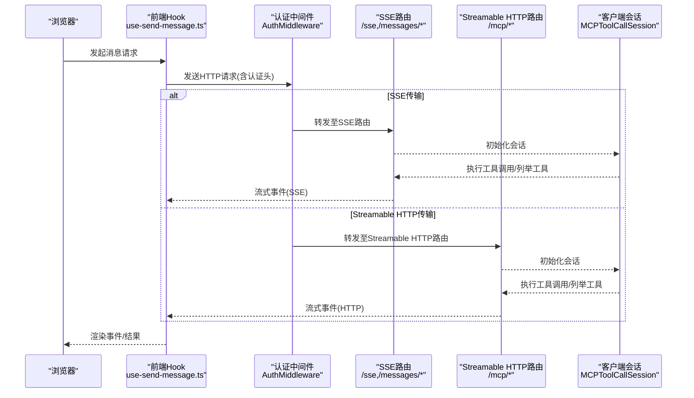
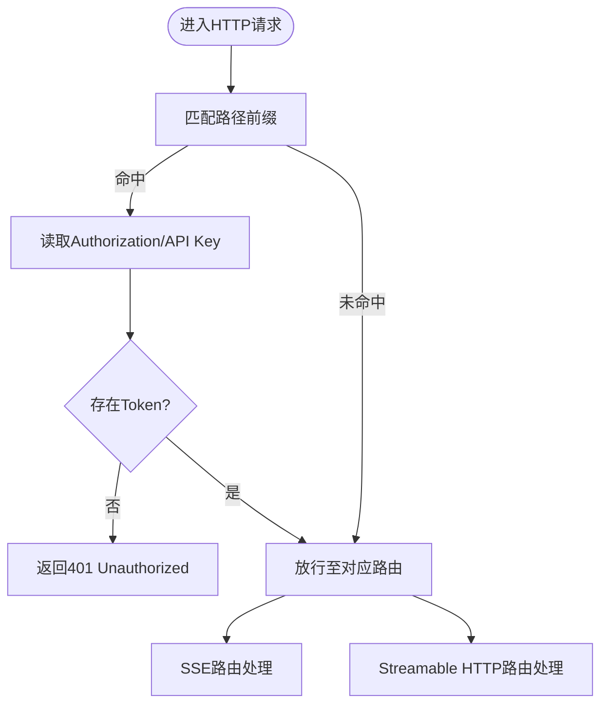
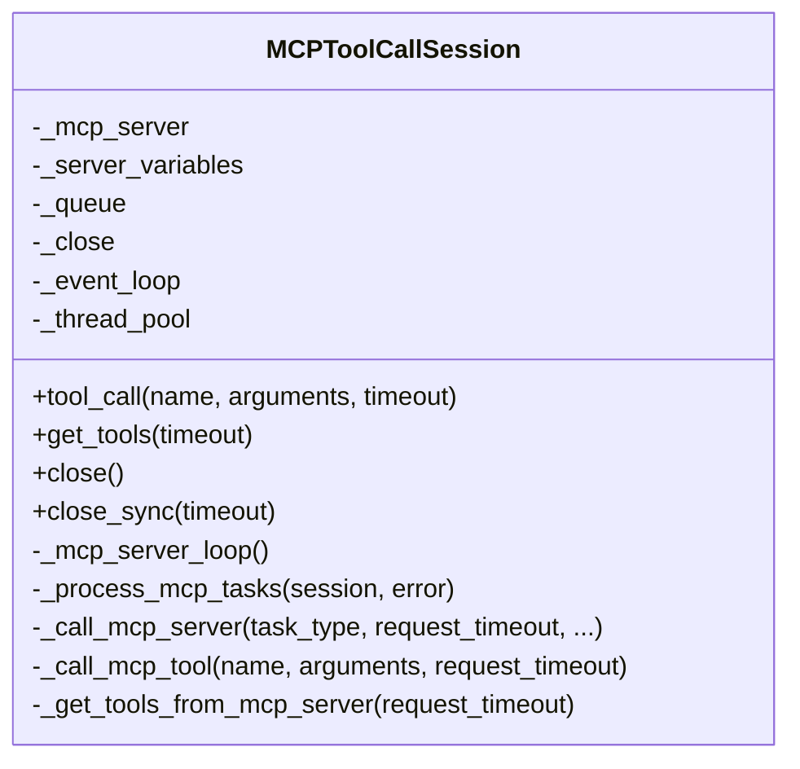
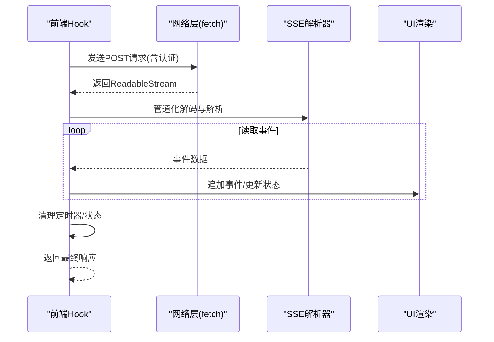
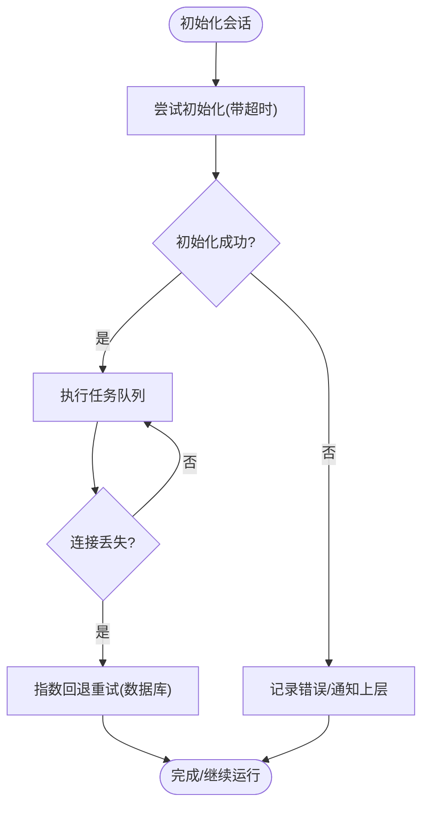
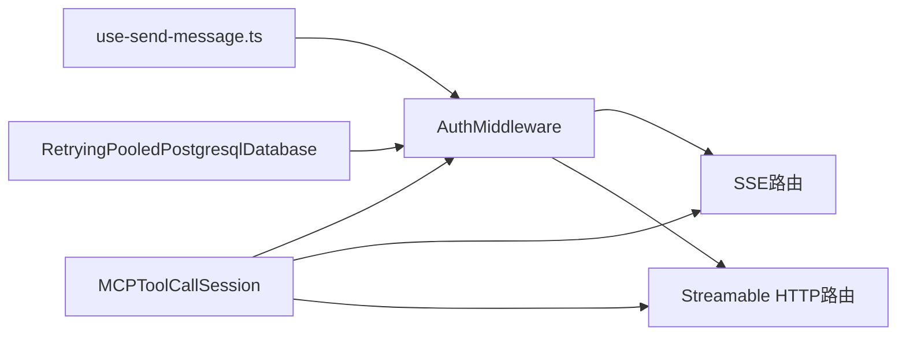

# WebSocket连接管理

<cite>
**本文引用的文件**
- [mcp/server/server.py](file://mcp/server/server.py)
- [common/mcp_tool_call_conn.py](file://common/mcp_tool_call_conn.py)
- [web/src/hooks/use-send-message.ts](file://web/src/hooks/use-send-message.ts)
- [web/src/interfaces/database/mcp-server.ts](file://web/src/interfaces/database/mcp-server.ts)
- [rag/llm/tts_model.py](file://rag/llm/tts_model.py)
- [api/db/db_models.py](file://api/db/db_models.py)
- [admin/client/http_client.py](file://admin/client/http_client.py)
- [common/connection_utils.py](file://common/connection_utils.py)
- [sandbox/scripts/wait-for-it.sh](file://sandbox/scripts/wait-for-it.sh)
- [sandbox/scripts/wait-for-it-http.sh](file://sandbox/scripts/wait-for-it-http.sh)
</cite>

## 目录
1. [简介](#简介)
2. [项目结构](#项目结构)
3. [核心组件](#核心组件)
4. [架构总览](#架构总览)
5. [详细组件分析](#详细组件分析)
6. [依赖分析](#依赖分析)
7. [性能考虑](#性能考虑)
8. [故障排查指南](#故障排查指南)
9. [结论](#结论)
10. [附录](#附录)

## 简介
本技术文档聚焦于RagFlow项目中的WebSocket与流式传输（SSE）连接管理能力，涵盖连接建立流程、认证机制、握手协议、连接状态管理（心跳、断线检测、自动重连）、连接池与资源优化、错误处理与异常恢复、监控与调试工具以及性能优化建议。文档以实际源码为依据，提供分层次的解释与可视化图示，帮助开发者快速理解并高效使用连接管理功能。

## 项目结构
围绕WebSocket/SSE连接管理的关键模块分布如下：
- 后端服务层：提供SSE与Streamable HTTP两种传输模式的接入点与认证中间件
- 客户端会话层：封装SSE/Streamable HTTP客户端会话，负责初始化、任务调度与错误处理
- 前端事件流层：通过SSE解析器消费后端流式事件，支持中断与结果聚合
- 连接与资源层：数据库连接重试、连接池配置、等待脚本等基础设施
- 辅助工具：健康检查脚本、连接工具函数

**图表来源**
- [mcp/server/server.py:501-527](file://mcp/server/server.py#L501-L527)
- [mcp/server/server.py:530-574](file://mcp/server/server.py#L530-L574)
- [common/mcp_tool_call_conn.py:70-114](file://common/mcp_tool_call_conn.py#L70-L114)
- [web/src/hooks/use-send-message.ts:109-178](file://web/src/hooks/use-send-message.ts#L109-L178)
- [api/db/db_models.py:298-320](file://api/db/db_models.py#L298-L320)
- [common/connection_utils.py](file://common/connection_utils.py)
- [sandbox/scripts/wait-for-it.sh:1-50](file://sandbox/scripts/wait-for-it.sh#L1-L50)
- [sandbox/scripts/wait-for-it-http.sh:1-31](file://sandbox/scripts/wait-for-it-http.sh#L1-L31)

**章节来源**
- [mcp/server/server.py:501-527](file://mcp/server/server.py#L501-L527)
- [mcp/server/server.py:530-574](file://mcp/server/server.py#L530-L574)
- [common/mcp_tool_call_conn.py:70-114](file://common/mcp_tool_call_conn.py#L70-L114)
- [web/src/hooks/use-send-message.ts:109-178](file://web/src/hooks/use-send-message.ts#L109-L178)
- [api/db/db_models.py:298-320](file://api/db/db_models.py#L298-L320)
- [common/connection_utils.py](file://common/connection_utils.py)
- [sandbox/scripts/wait-for-it.sh:1-50](file://sandbox/scripts/wait-for-it.sh#L1-L50)
- [sandbox/scripts/wait-for-it-http.sh:1-31](file://sandbox/scripts/wait-for-it-http.sh#L1-L31)

## 核心组件
- 认证中间件与路由
  - 在HTTP阶段对特定路径进行认证校验，支持Bearer Token或API Key
  - 提供SSE与Streamable HTTP两类传输入口
- 客户端会话管理
  - 统一封装SSE与Streamable HTTP客户端会话，负责初始化、任务队列、错误处理与关闭
- 前端SSE事件消费
  - 使用EventSource解析器逐条消费后端事件，支持中止与结果聚合
- 数据库连接重试
  - 针对MySQL类连接丢失场景提供指数回退与重连策略
- 连接池与超时
  - 提供连接池参数配置与等待脚本，保障服务可用性

**章节来源**
- [mcp/server/server.py:501-527](file://mcp/server/server.py#L501-L527)
- [mcp/server/server.py:530-574](file://mcp/server/server.py#L530-L574)
- [common/mcp_tool_call_conn.py:70-114](file://common/mcp_tool_call_conn.py#L70-L114)
- [web/src/hooks/use-send-message.ts:109-178](file://web/src/hooks/use-send-message.ts#L109-L178)
- [api/db/db_models.py:298-320](file://api/db/db_models.py#L298-L320)

## 架构总览
下图展示从浏览器到后端服务，再到客户端会话的完整链路，包括认证、SSE/HTTP传输与错误处理。

**图表来源**
- [web/src/hooks/use-send-message.ts:109-178](file://web/src/hooks/use-send-message.ts#L109-L178)
- [mcp/server/server.py:501-527](file://mcp/server/server.py#L501-L527)
- [mcp/server/server.py:530-574](file://mcp/server/server.py#L530-L574)
- [common/mcp_tool_call_conn.py:70-114](file://common/mcp_tool_call_conn.py#L70-L114)

## 详细组件分析

### 认证与握手协议
- 认证范围
  - 对以“/messages/”、“/sse”、“/mcp”开头的路径进行认证拦截
  - 支持Authorization头（Bearer Token）与API Key两种方式
- 握手与路由
  - SSE：/sse与/messages/前缀路由
  - Streamable HTTP：/mcp前缀路由
- 传输模式选择
  - 可通过环境变量启用/禁用SSE或Streamable HTTP
  - 支持JSON响应模式或SSE风格事件模式

**图表来源**
- [mcp/server/server.py:501-527](file://mcp/server/server.py#L501-L527)
- [mcp/server/server.py:530-574](file://mcp/server/server.py#L530-L574)

**章节来源**
- [mcp/server/server.py:501-527](file://mcp/server/server.py#L501-L527)
- [mcp/server/server.py:530-574](file://mcp/server/server.py#L530-L574)

### 客户端会话生命周期与任务调度
- 会话类型
  - SSE与Streamable HTTP两种传输类型
- 初始化与超时
  - 初始化阶段设置超时，避免阻塞
- 任务队列
  - 异步队列承载工具调用与列举工具任务
- 错误处理
  - 认证失败、超时、取消等异常均转化为可上报的错误
- 关闭流程
  - 清理队列、停止事件循环、释放线程池

**图表来源**
- [common/mcp_tool_call_conn.py:42-249](file://common/mcp_tool_call_conn.py#L42-L249)

**章节来源**
- [common/mcp_tool_call_conn.py:70-114](file://common/mcp_tool_call_conn.py#L70-L114)
- [common/mcp_tool_call_conn.py:115-189](file://common/mcp_tool_call_conn.py#L115-L189)
- [common/mcp_tool_call_conn.py:220-249](file://common/mcp_tool_call_conn.py#L220-L249)

### 前端SSE事件消费与中断
- 请求构造
  - 使用fetch发送POST请求，携带认证头
- 事件解析
  - 通过TextDecoderStream与EventSourceParserStream逐条解析事件
- 中断与清理
  - 支持AbortController中断；完成或异常后清理定时器与状态
- 结果聚合
  - 将事件数据追加到列表，统一返回最终响应

**图表来源**
- [web/src/hooks/use-send-message.ts:109-178](file://web/src/hooks/use-send-message.ts#L109-L178)

**章节来源**
- [web/src/hooks/use-send-message.ts:109-178](file://web/src/hooks/use-send-message.ts#L109-L178)

### 连接状态管理与自动重连
- 心跳与断线检测
  - SSE/HTTP长连接在空闲时无心跳；可通过业务侧在应用层实现心跳
- 自动重连
  - 客户端会话层对初始化超时、取消、异常进行捕获与反馈
  - 数据库层对连接丢失采用指数回退重试
- 资源回收
  - 会话关闭时清理队列、停止事件循环、释放线程池

**图表来源**
- [common/mcp_tool_call_conn.py:76-88](file://common/mcp_tool_call_conn.py#L76-L88)
- [api/db/db_models.py:298-320](file://api/db/db_models.py#L298-L320)

**章节来源**
- [common/mcp_tool_call_conn.py:76-114](file://common/mcp_tool_call_conn.py#L76-L114)
- [api/db/db_models.py:298-320](file://api/db/db_models.py#L298-L320)

### 连接池管理与资源优化
- 连接池参数
  - 通过连接池配置文件设置最大连接数、超时时间等
- 并发控制
  - 客户端会话使用线程池与异步事件循环隔离IO与CPU任务
- 超时设置
  - 初始化与任务调用均设置超时，避免阻塞
- 复用策略
  - SSE/Streamable HTTP会话复用同一连接通道，减少握手开销

**章节来源**
- [common/connection_utils.py](file://common/connection_utils.py)
- [common/mcp_tool_call_conn.py:54-57](file://common/mcp_tool_call_conn.py#L54-L57)

### 错误处理与异常恢复
- 网络异常
  - 初始化超时、连接取消、认证失败等均被捕获并上报
- 服务器错误
  - 401未授权、5xx错误由后端返回，前端根据code提示用户
- 客户端异常
  - 会话关闭、线程池释放、队列清理确保资源安全回收
- 数据库异常
  - 连接丢失时按指数回退重试，避免瞬时故障放大

**章节来源**
- [common/mcp_tool_call_conn.py:76-114](file://common/mcp_tool_call_conn.py#L76-L114)
- [web/src/hooks/use-send-message.ts:148-150](file://web/src/hooks/use-send-message.ts#L148-L150)
- [api/db/db_models.py:298-320](file://api/db/db_models.py#L298-L320)

### 监控与调试工具
- 健康检查
  - 提供TCP与HTTP健康检查脚本，用于等待目标服务可用
- 日志与告警
  - 关键节点输出日志，便于定位初始化、超时、取消等问题
- 前端调试
  - 控制台输出事件数据，便于观察SSE事件流

**章节来源**
- [sandbox/scripts/wait-for-it.sh:1-50](file://sandbox/scripts/wait-for-it.sh#L1-L50)
- [sandbox/scripts/wait-for-it-http.sh:1-31](file://sandbox/scripts/wait-for-it-http.sh#L1-L31)
- [web/src/hooks/use-send-message.ts:144-159](file://web/src/hooks/use-send-message.ts#L144-L159)

### 性能优化建议
- 连接复用
  - 复用SSE/HTTP会话，减少握手与TLS开销
- 批量处理
  - 合并小事件，降低解析与渲染频率
- 延迟优化
  - 合理设置初始化与任务超时，避免长时间阻塞
- 并发控制
  - 限制同时发起的任务数量，避免资源争用

[本节为通用建议，不直接分析具体文件]

## 依赖分析
- 模块耦合
  - 前端Hook依赖认证头与SSE解析器；后端认证中间件依赖路由配置
  - 客户端会话依赖SSE/HTTP客户端库与事件循环
- 外部依赖
  - SSE/HTTP客户端库、EventSource解析器、连接池库
- 循环依赖
  - 未发现直接循环依赖；各模块职责清晰

**图表来源**
- [web/src/hooks/use-send-message.ts:109-178](file://web/src/hooks/use-send-message.ts#L109-L178)
- [mcp/server/server.py:501-527](file://mcp/server/server.py#L501-L527)
- [mcp/server/server.py:530-574](file://mcp/server/server.py#L530-L574)
- [common/mcp_tool_call_conn.py:70-114](file://common/mcp_tool_call_conn.py#L70-L114)
- [api/db/db_models.py:298-320](file://api/db/db_models.py#L298-L320)

**章节来源**
- [web/src/hooks/use-send-message.ts:109-178](file://web/src/hooks/use-send-message.ts#L109-L178)
- [mcp/server/server.py:501-527](file://mcp/server/server.py#L501-L527)
- [mcp/server/server.py:530-574](file://mcp/server/server.py#L530-L574)
- [common/mcp_tool_call_conn.py:70-114](file://common/mcp_tool_call_conn.py#L70-L114)
- [api/db/db_models.py:298-320](file://api/db/db_models.py#L298-L320)

## 性能考虑
- 传输模式选择
  - SSE适合事件驱动场景；Streamable HTTP适合高吞吐与低延迟
- 超时与重试
  - 合理设置初始化与任务超时，结合指数回退重试提升稳定性
- 连接池参数
  - 根据并发与资源情况调整最大连接数与超时，避免资源枯竭
- 前端渲染
  - 事件聚合与节流，减少频繁重渲染

[本节为通用建议，不直接分析具体文件]

## 故障排查指南
- 401未授权
  - 检查Authorization头或API Key是否正确传递
- 初始化超时
  - 检查后端路由可达性与认证中间件逻辑
- 连接中断
  - 观察前端AbortController使用与后端会话状态
- 数据库连接丢失
  - 查看重试日志与回退策略是否生效

**章节来源**
- [mcp/server/server.py:501-527](file://mcp/server/server.py#L501-L527)
- [common/mcp_tool_call_conn.py:76-114](file://common/mcp_tool_call_conn.py#L76-L114)
- [web/src/hooks/use-send-message.ts:162-166](file://web/src/hooks/use-send-message.ts#L162-L166)
- [api/db/db_models.py:298-320](file://api/db/db_models.py#L298-L320)

## 结论
RagFlow的WebSocket/SSE连接管理通过认证中间件、SSE/Streamable HTTP路由、客户端会话与前端事件消费形成完整的链路。配合数据库连接重试、连接池与超时配置，以及健康检查与日志监控，能够有效保障连接稳定性与性能。建议在生产环境中合理选择传输模式、设置超时与重试策略，并结合前端事件聚合与节流以优化用户体验。

## 附录
- 传输模式枚举
  - SSE与Streamable HTTP
- 相关接口定义
  - MCP服务器类型与信息接口

**章节来源**
- [web/src/interfaces/database/mcp-server.ts:1-19](file://web/src/interfaces/database/mcp-server.ts#L1-L19)