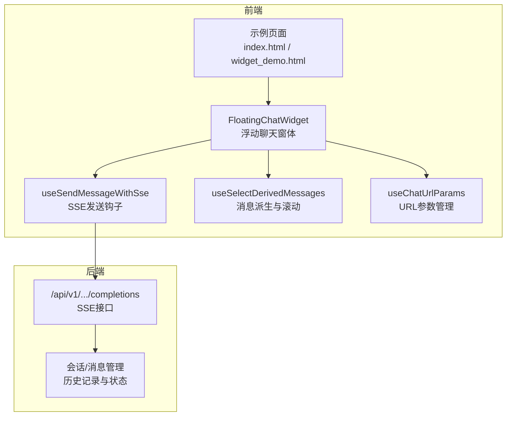
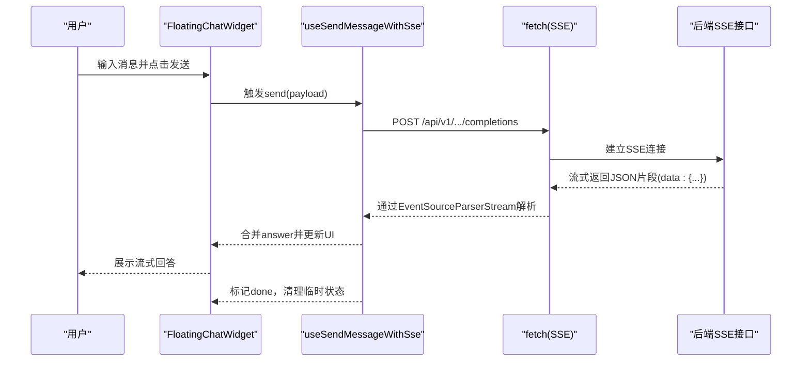
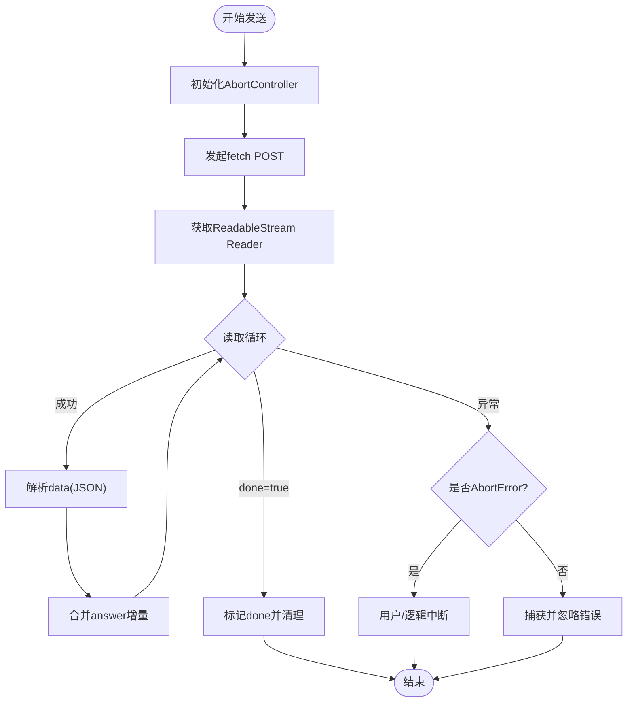
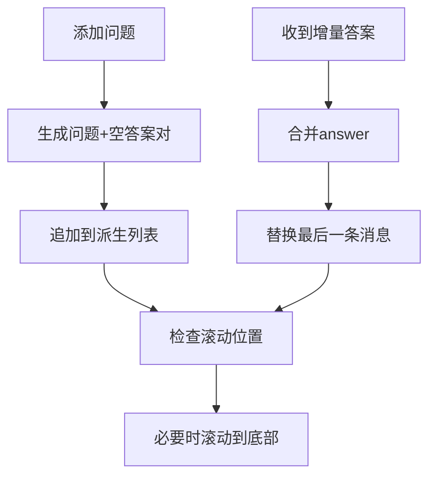
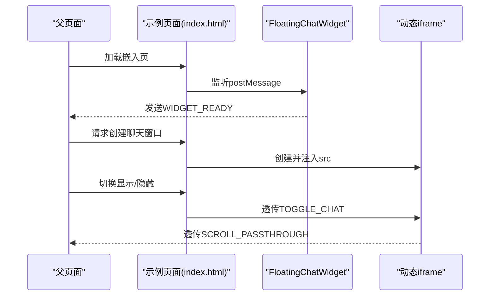
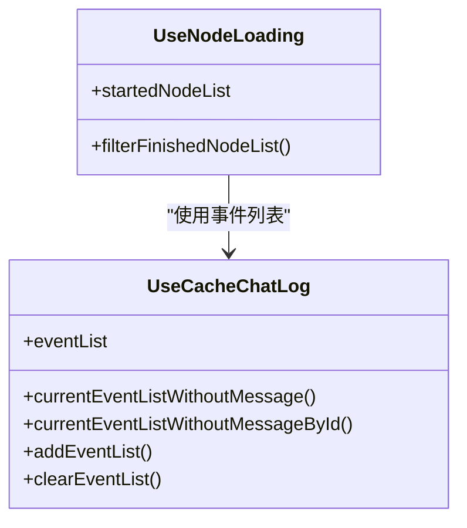
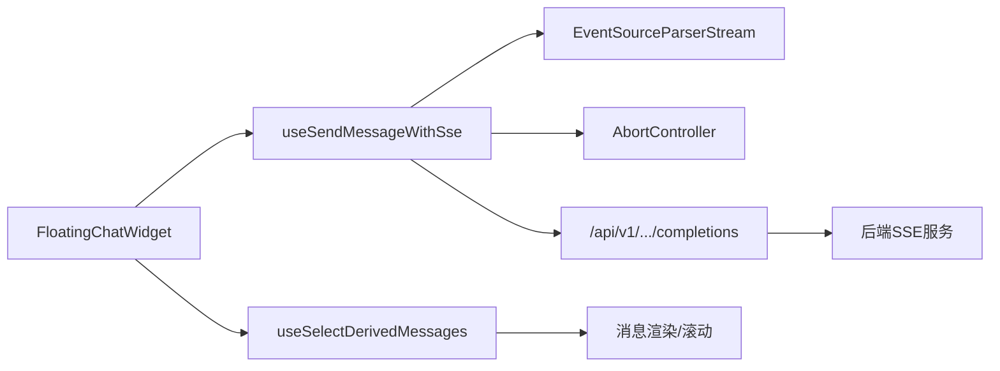

# 实时通信

<cite>
**本文引用的文件**
- [web/src/components/floating-chat-widget.tsx](file://web/src/components/floating-chat-widget.tsx)
- [web/src/pages/next-chats/hooks/use-send-shared-message.ts](file://web/src/pages/next-chats/hooks/use-send-shared-message.ts)
- [web/src/hooks/logic-hooks.ts](file://web/src/hooks/logic-hooks.ts)
- [web/src/pages/next-chats/hooks/use-chat-url.ts](file://web/src/pages/next-chats/hooks/use-chat-url.ts)
- [web/src/pages/next-chats/widget/index.tsx](file://web/src/pages/next-chats/widget/index.tsx)
- [chat_demo/index.html](file://chat_demo/index.html)
- [chat_demo/widget_demo.html](file://chat_demo/widget_demo.html)
- [api/apps/sdk/agents.py](file://api/apps/sdk/agents.py)
- [mcp/server/server.py](file://mcp/server/server.py)
- [web/src/interfaces/database/mcp-server.ts](file://web/src/interfaces/database/mcp-server.ts)
- [web/src/pages/agent/hooks/use-node-loading.ts](file://web/src/pages/agent/hooks/use-node-loading.ts)
- [web/src/pages/agent/hooks/use-cache-chat-log.ts](file://web/src/pages/agent/hooks/use-cache-chat-log.ts)
- [web/src/pages/memory/memory-message/hook.ts](file://web/src/pages/memory/memory-message/hook.ts)
- [web/src/components/fallback-component/index.tsx](file://web/src/components/fallback-component/index.tsx)
- [api/utils/crypt.py](file://api/utils/crypt.py)
- [common/crypto_utils.py](file://common/crypto_utils.py)
</cite>

## 目录
1. [简介](#简介)
2. [项目结构](#项目结构)
3. [核心组件](#核心组件)
4. [架构总览](#架构总览)
5. [详细组件分析](#详细组件分析)
6. [依赖关系分析](#依赖关系分析)
7. [性能考量](#性能考量)
8. [故障排查指南](#故障排查指南)
9. [结论](#结论)
10. [附录](#附录)

## 简介
本文件聚焦于RAGFlow前端的实时通信能力，重点覆盖以下方面：
- 基于服务端事件（SSE）的消息流式传输与前端解析
- 聊天系统的消息发送、接收、展示与历史记录管理
- 实时状态同步：消息队列、状态更新与UI刷新策略
- 错误处理与异常恢复：网络异常、服务器错误、客户端异常
- 性能优化：消息压缩、批量处理、连接池与资源回收
- 安全考虑：认证授权、消息加密、防刷与跨域策略
- 调试与监控：日志、事件追踪与可视化

## 项目结构
RAGFlow前端通过SSE实现近实时的对话交互，核心由以下模块构成：
- 组件层：浮动聊天窗体负责用户输入、滚动控制、音频提示与消息渲染
- 钩子层：封装SSE发送、消息派生、滚动与状态管理
- 页面层：共享聊天参数解析、会话创建与URL参数管理
- 示例与嵌入：iframe嵌入与主窗口联动的消息桥接

**图表来源**
- [web/src/components/floating-chat-widget.tsx](file://web/src/components/floating-chat-widget.tsx)
- [web/src/hooks/logic-hooks.ts](file://web/src/hooks/logic-hooks.ts)
- [web/src/pages/next-chats/hooks/use-chat-url.ts](file://web/src/pages/next-chats/hooks/use-chat-url.ts)
- [chat_demo/index.html](file://chat_demo/index.html)
- [chat_demo/widget_demo.html](file://chat_demo/widget_demo.html)

**章节来源**
- [web/src/components/floating-chat-widget.tsx](file://web/src/components/floating-chat-widget.tsx)
- [web/src/hooks/logic-hooks.ts](file://web/src/hooks/logic-hooks.ts)
- [web/src/pages/next-chats/hooks/use-chat-url.ts](file://web/src/pages/next-chats/hooks/use-chat-url.ts)
- [chat_demo/index.html](file://chat_demo/index.html)
- [chat_demo/widget_demo.html](file://chat_demo/widget_demo.html)

## 核心组件
- 浮动聊天窗体（FloatingChatWidget）
  - 支持按钮模式、窗口模式、主从模式三种形态
  - 内置音频提示（通知与AI回复）
  - 消息显示策略：支持流式与非流式两种模式
  - 与父窗口通过postMessage进行动态iframe创建与显示切换
- SSE发送钩子（useSendMessageWithSse）
  - 封装fetch + SSE Reader + EventSourceParserStream
  - 解析增量数据块并合并到answer中，支持停止输出
  - 提供done状态与多聊天框并发done记录
- 消息派生与滚动（useSelectDerivedMessages）
  - 维护派生消息列表，支持添加问题/答案、删除、清理
  - 自动滚动到底部，保持用户阅读体验
- URL参数与会话（useChatUrlParams / useCreateConversationBeforeSendMessage）
  - 解析共享聊天参数（shared_id、from、locale等）
  - 在首次发送前创建会话并写入URL参数

**章节来源**
- [web/src/components/floating-chat-widget.tsx](file://web/src/components/floating-chat-widget.tsx)
- [web/src/hooks/logic-hooks.ts](file://web/src/hooks/logic-hooks.ts)
- [web/src/pages/next-chats/hooks/use-chat-url.ts](file://web/src/pages/next-chats/hooks/use-chat-url.ts)

## 架构总览
下图展示了从用户输入到后端SSE响应的完整链路，以及前端如何解析与渲染：

**图表来源**
- [web/src/components/floating-chat-widget.tsx](file://web/src/components/floating-chat-widget.tsx)
- [web/src/hooks/logic-hooks.ts](file://web/src/hooks/logic-hooks.ts)
- [web/src/pages/next-chats/hooks/use-send-shared-message.ts](file://web/src/pages/next-chats/hooks/use-send-shared-message.ts)

## 详细组件分析

### 组件A：SSE发送与解析（useSendMessageWithSse）
- 连接建立
  - 使用AbortController管理请求生命周期，支持主动中断
  - 通过fetch发起POST请求，启用SSE流式读取
- 数据解析
  - 使用TextDecoderStream解码字节流，再用EventSourceParserStream解析事件
  - 逐段解析data字段，合并answer增量内容
- 状态管理
  - done与doneRecord用于跟踪每个聊天框的完成状态
  - resetAnswer在流结束或异常后清理临时answer
- 异常处理
  - 捕获DOMException中的AbortError，区分用户中断与逻辑中断
  - 其他网络错误静默处理，避免阻塞UI

**图表来源**
- [web/src/hooks/logic-hooks.ts](file://web/src/hooks/logic-hooks.ts)

**章节来源**
- [web/src/hooks/logic-hooks.ts](file://web/src/hooks/logic-hooks.ts)

### 组件B：消息派生与UI刷新（useSelectDerivedMessages）
- 消息队列
  - 维护IMessage数组，支持添加问题/答案、删除最新、按ID删除
  - 支持清理当前消息之后的内容，便于“重新生成”场景
- 滚动控制
  - 记录容器滚动位置，自动判断是否需要滚动到底部
  - 在消息新增后延迟滚动，保证视觉连续性
- 历史记录
  - 通过URL参数与会话创建钩子，确保首次消息前会话已存在

**图表来源**
- [web/src/hooks/logic-hooks.ts](file://web/src/hooks/logic-hooks.ts)
- [web/src/pages/next-chats/hooks/use-chat-url.ts](file://web/src/pages/next-chats/hooks/use-chat-url.ts)

**章节来源**
- [web/src/hooks/logic-hooks.ts](file://web/src/hooks/logic-hooks.ts)
- [web/src/pages/next-chats/hooks/use-chat-url.ts](file://web/src/pages/next-chats/hooks/use-chat-url.ts)

### 组件C：嵌入与主从模式（FloatingChatWidget + 示例页面）
- 主从模式
  - master模式仅渲染悬浮按钮，通过postMessage动态创建并控制窗口iframe
  - window模式直接渲染完整聊天窗口
- 消息桥接
  - 示例页面监听来自iframe的消息类型，执行创建窗口、切换显示、滚动透传等操作
- 本地化与就绪信号
  - 组件加载完成后向父窗口发送WIDGET_READY消息，便于父页面控制显示时机

**图表来源**
- [web/src/components/floating-chat-widget.tsx](file://web/src/components/floating-chat-widget.tsx)
- [chat_demo/index.html](file://chat_demo/index.html)
- [chat_demo/widget_demo.html](file://chat_demo/widget_demo.html)

**章节来源**
- [web/src/components/floating-chat-widget.tsx](file://web/src/components/floating-chat-widget.tsx)
- [chat_demo/index.html](file://chat_demo/index.html)
- [chat_demo/widget_demo.html](file://chat_demo/widget_demo.html)

### 组件D：实时状态同步与事件缓存（Agent/Agent事件）
- 事件缓存
  - 通过use-cache-chat-log维护事件列表，按message_id聚合
  - 提供过滤与查询方法，支持节点事件与任务状态
- 节点加载状态
  - use-node-loading基于事件列表计算节点启动/完成状态，去重并驱动UI

**图表来源**
- [web/src/pages/agent/hooks/use-cache-chat-log.ts](file://web/src/pages/agent/hooks/use-cache-chat-log.ts)
- [web/src/pages/agent/hooks/use-node-loading.ts](file://web/src/pages/agent/hooks/use-node-loading.ts)

**章节来源**
- [web/src/pages/agent/hooks/use-cache-chat-log.ts](file://web/src/pages/agent/hooks/use-cache-chat-log.ts)
- [web/src/pages/agent/hooks/use-node-loading.ts](file://web/src/pages/agent/hooks/use-node-loading.ts)

## 依赖关系分析
- 组件耦合
  - FloatingChatWidget依赖useSendMessageWithSse与useSelectDerivedMessages
  - useSendSharedMessage进一步封装SSE调用与会话创建
- 外部依赖
  - EventSourceParserStream用于SSE事件解析
  - AbortController用于请求取消与资源回收
- 后端集成
  - SSE路由位于/api/v1/.../completions
  - MCP服务器支持SSE与可流式HTTP传输

**图表来源**
- [web/src/components/floating-chat-widget.tsx](file://web/src/components/floating-chat-widget.tsx)
- [web/src/hooks/logic-hooks.ts](file://web/src/hooks/logic-hooks.ts)
- [mcp/server/server.py](file://mcp/server/server.py)

**章节来源**
- [web/src/components/floating-chat-widget.tsx](file://web/src/components/floating-chat-widget.tsx)
- [web/src/hooks/logic-hooks.ts](file://web/src/hooks/logic-hooks.ts)
- [mcp/server/server.py](file://mcp/server/server.py)

## 性能考量
- 消息压缩与传输
  - SSE以文本流传输，建议后端对大块内容进行分片与压缩（需后端配合）
- 批量处理
  - 增量answer合并采用字符串拼接，避免频繁重渲染；可在前端引入虚拟滚动以提升长列表性能
- 连接池与资源回收
  - 使用AbortController统一管理请求生命周期，及时释放资源
  - done与doneRecord用于并发场景下的状态收敛，减少重复渲染
- UI渲染优化
  - 滚动控制与懒加载结合，仅在可见区域渲染消息
  - 使用React.memo与key稳定化降低重绘

[本节为通用性能指导，不直接分析具体文件]

## 故障排查指南
- 网络异常
  - 检查SSE连接是否被浏览器拦截（跨域、证书、CORS），确认后端已正确配置
  - 查看控制台是否有AbortError，确认是否被stopOutputMessage触发
- 服务器错误
  - 关注后端SSE响应头与状态码，确保事件格式符合EventSource规范
  - 若出现解析失败，检查data字段格式与编码
- 客户端异常
  - 使用FallbackComponent兜底，定位具体组件错误边界
  - 检查消息派生逻辑，确认answer合并策略未产生重复或截断
- 嵌入场景
  - 确认postMessage目标源与消息类型一致，避免跨域限制导致消息丢失

**章节来源**
- [web/src/components/fallback-component/index.tsx](file://web/src/components/fallback-component/index.tsx)
- [web/src/hooks/logic-hooks.ts](file://web/src/hooks/logic-hooks.ts)

## 结论
RAGFlow前端通过SSE实现了低延迟、高可用的实时对话体验。组件层与钩子层清晰分离职责，消息派生与滚动控制保障了良好的用户体验。通过事件缓存与并发状态管理，系统能够应对复杂流程与多节点场景。建议在生产环境中完善后端SSE压缩与限流策略，并持续优化前端虚拟渲染与资源回收。

[本节为总结性内容，不直接分析具体文件]

## 附录

### 安全与合规
- 认证授权
  - 前端通过Authorization头携带令牌；后端SSE路由统一校验Bearer或api_key
- 消息加密
  - 可参考后端加密工具与通用加密工具，对敏感数据进行端到端保护
- 防刷与风控
  - 建议在后端增加速率限制、IP白名单与会话超时策略

**章节来源**
- [mcp/server/server.py](file://mcp/server/server.py)
- [api/utils/crypt.py](file://api/utils/crypt.py)
- [common/crypto_utils.py](file://common/crypto_utils.py)

### 调试与监控
- 日志与追踪
  - 前端SSE解析过程可增加日志开关，记录事件到达时间与answer长度
  - 后端SSE服务应输出事件ID与会话上下文，便于问题复现
- 可视化
  - 使用浏览器开发者工具Network面板观察SSE连接与事件流
  - 在Widget中加入“调试模式”，显示当前会话ID、事件计数与延迟指标

[本节为通用指导，不直接分析具体文件]