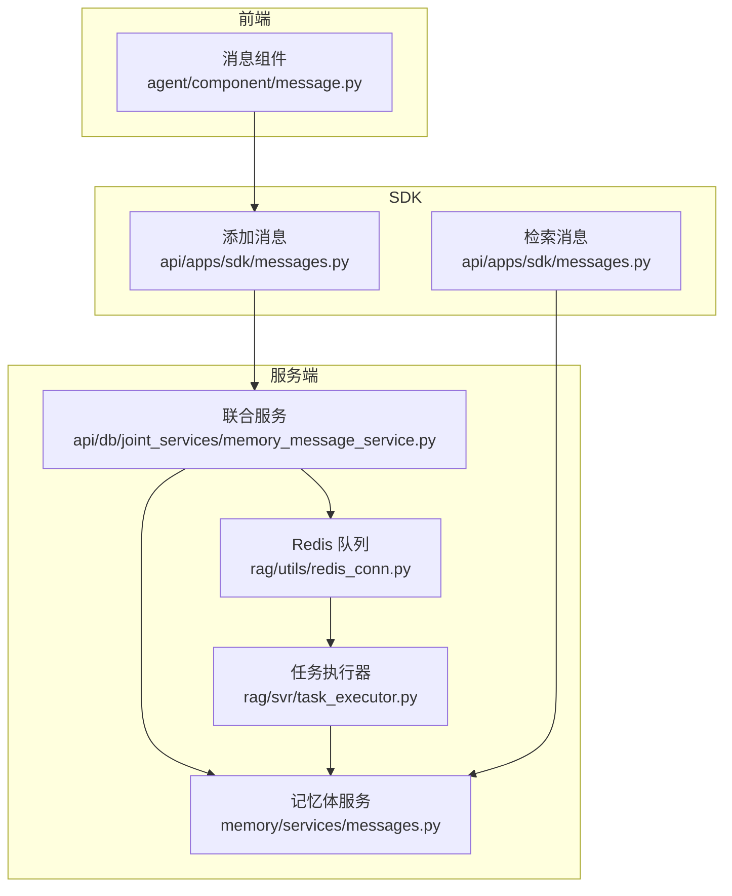
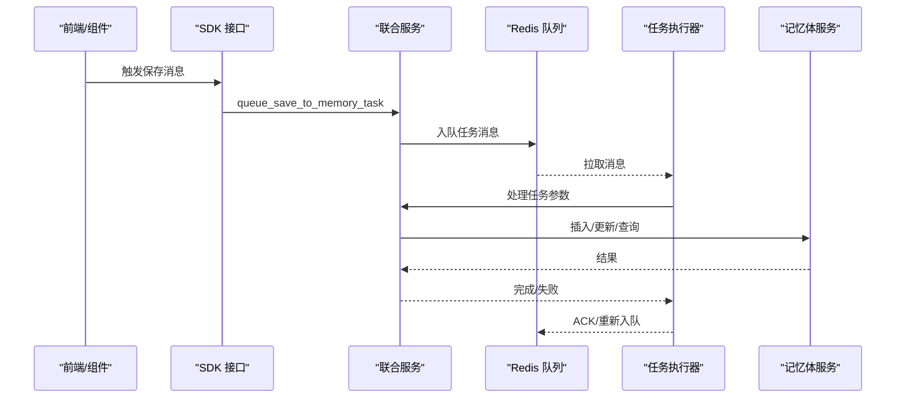
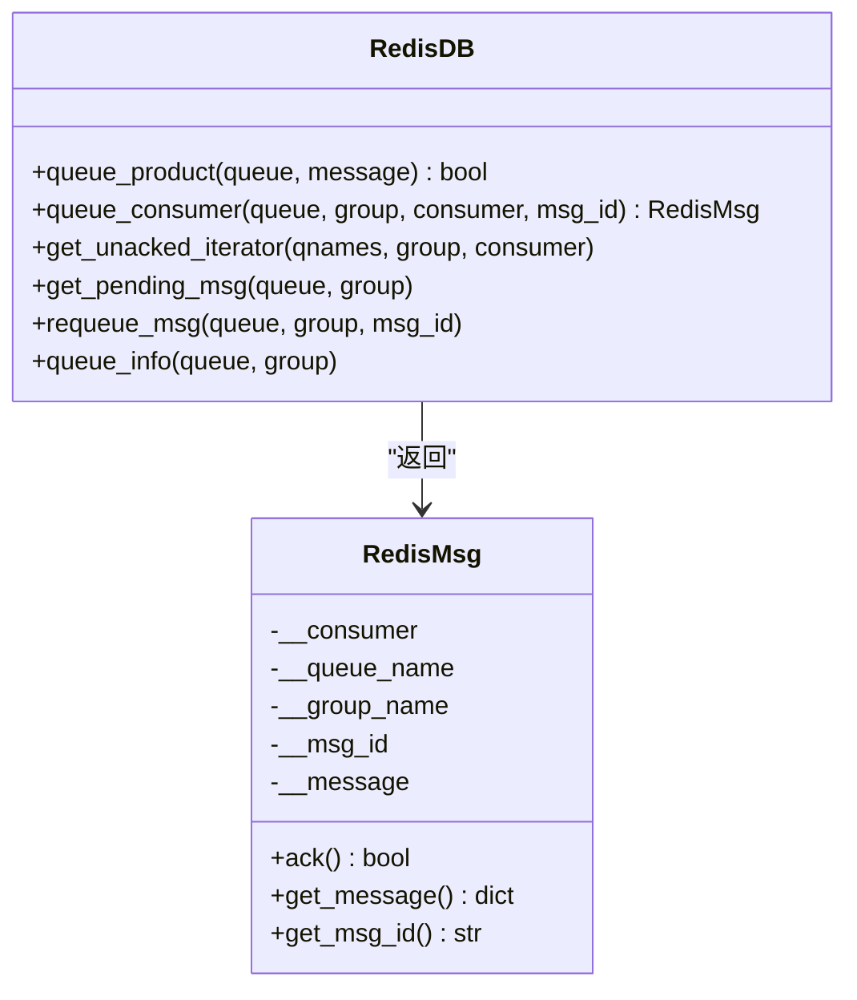
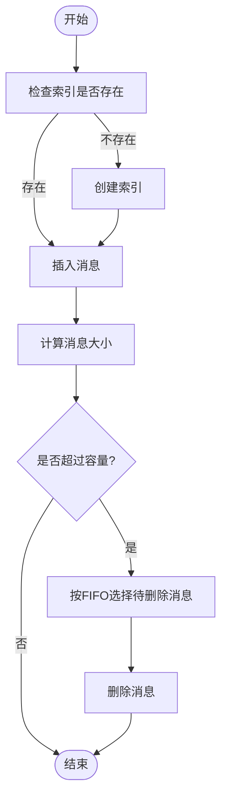
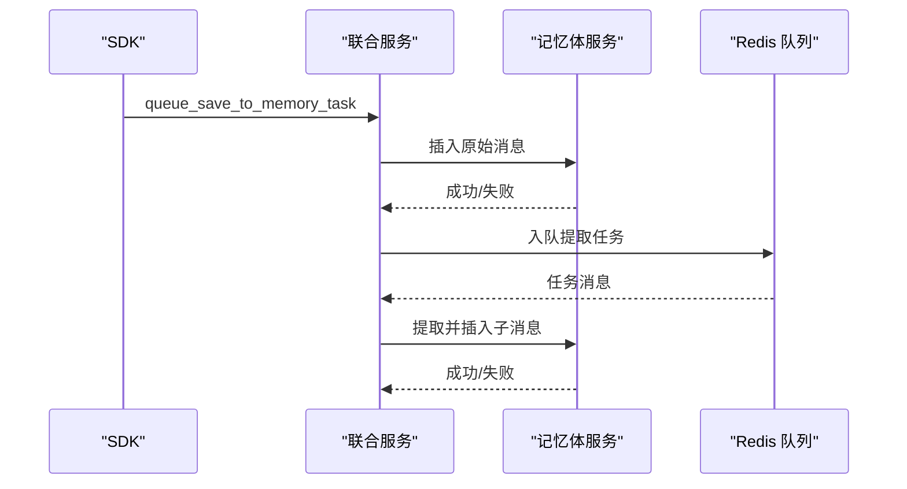
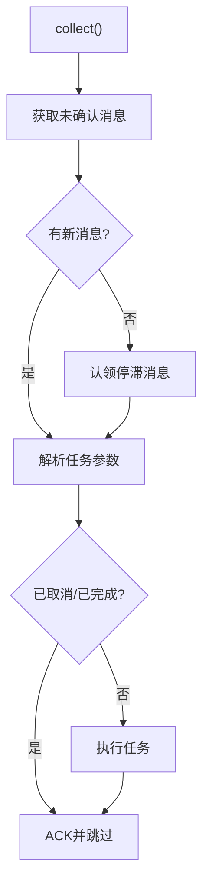
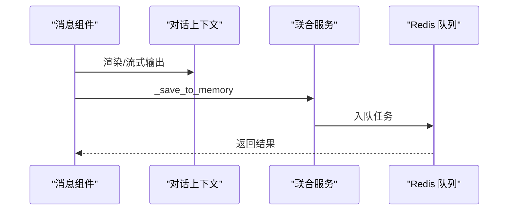
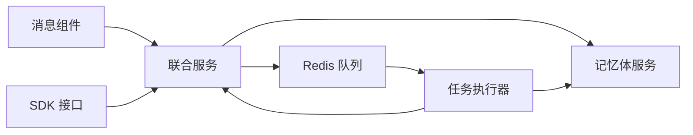

# 消息处理机制

<cite>
**本文档引用的文件**
- [task_executor.py](file://rag/svr/task_executor.py)
- [redis_conn.py](file://rag/utils/redis_conn.py)
- [messages.py](file://memory/services/messages.py)
- [memory_message_service.py](file://api/db/joint_services/memory_message_service.py)
- [message.py](file://agent/component/message.py)
- [messages.py](file://api/apps/sdk/messages.py)
- [json_encode.py](file://api/utils/json_encode.py)
</cite>

## 目录
1. [简介](#简介)
2. [项目结构](#项目结构)
3. [核心组件](#核心组件)
4. [架构总览](#架构总览)
5. [详细组件分析](#详细组件分析)
6. [依赖关系分析](#依赖关系分析)
7. [性能考虑](#性能考虑)
8. [故障排查指南](#故障排查指南)
9. [结论](#结论)

## 简介
本文件系统性梳理 RAGFlow 的消息处理机制，覆盖消息的发送与接收、消息格式与序列化、生命周期管理（创建、路由、转发、存储、清理）、消息队列实现（缓冲、优先级、批量）、去重与幂等策略（消息 ID 生成、重复检测、状态确认）、消息格式规范（文本、富文本、图片、表格等）以及压缩与传输优化方案。目标是帮助开发者与运维人员快速理解并高效扩展消息处理能力。

## 项目结构
消息处理涉及前后端与服务端多层协作：
- 前端组件：消息组件负责渲染、流式输出与内容转换，并在合适时机触发保存到记忆体的任务。
- SDK 接口：提供消息增删改查与检索接口，统一对外暴露消息能力。
- 记忆体服务：封装消息的插入、查询、统计与清理逻辑。
- 队列与任务执行：基于 Redis Streams 的消息队列，配合消费者任务执行器完成异步处理。
- 序列化工具：统一 JSON 编解码，确保跨模块数据一致性。

**图表来源**
- [message.py:429-441](file://agent/component/message.py#L429-L441)
- [messages.py:27-48](file://api/apps/sdk/messages.py#L27-L48)
- [memory_message_service.py:332-403](file://api/db/joint_services/memory_message_service.py#L332-L403)
- [messages.py:45-63](file://memory/services/messages.py#L45-L63)
- [redis_conn.py:363-408](file://rag/utils/redis_conn.py#L363-L408)
- [task_executor.py:257-349](file://rag/svr/task_executor.py#L257-L349)

**章节来源**
- [message.py:1-441](file://agent/component/message.py#L1-L441)
- [messages.py:1-159](file://api/apps/sdk/messages.py#L1-L159)
- [memory_message_service.py:1-439](file://api/db/joint_services/memory_message_service.py#L1-L439)
- [messages.py:1-295](file://memory/services/messages.py#L1-L295)
- [redis_conn.py:1-517](file://rag/utils/redis_conn.py#L1-L517)
- [task_executor.py:1-800](file://rag/svr/task_executor.py#L1-L800)

## 核心组件
- Redis 消息队列与消息封装
  - RedisDB 提供队列生产与消费、未确认迭代器、Pending 消息查询、重新入队等能力；RedisMsg 封装消息体与 ACK。
- 记忆体消息服务
  - 提供消息插入、更新、删除、查询、最近消息获取、大小计算与 FIFO 清理等。
- 联合服务（SDK 与任务编排）
  - 负责消息提取、向量嵌入、索引创建、容量控制与任务入队。
- 任务执行器
  - 从队列拉取消息，解析任务参数，执行消息保存流程，支持取消与进度上报。
- 消息组件（前端）
  - 支持流式输出、模板渲染、Markdown 表格解析与多种格式导出，完成后触发保存到记忆体。

**章节来源**
- [redis_conn.py:37-517](file://rag/utils/redis_conn.py#L37-L517)
- [messages.py:27-295](file://memory/services/messages.py#L27-L295)
- [memory_message_service.py:38-214](file://api/db/joint_services/memory_message_service.py#L38-L214)
- [task_executor.py:161-349](file://rag/svr/task_executor.py#L161-L349)
- [message.py:61-441](file://agent/component/message.py#L61-L441)

## 架构总览
消息处理采用“前端/SDK → 队列 → 执行器 → 存储”的异步流水线模式。消息以 JSON 形式进入 Redis Streams，执行器按组消费并执行对应任务，最终写入记忆体索引。

**图表来源**
- [message.py:429-441](file://agent/component/message.py#L429-L441)
- [messages.py:27-48](file://api/apps/sdk/messages.py#L27-L48)
- [memory_message_service.py:332-403](file://api/db/joint_services/memory_message_service.py#L332-L403)
- [redis_conn.py:363-408](file://rag/utils/redis_conn.py#L363-L408)
- [task_executor.py:257-349](file://rag/svr/task_executor.py#L257-L349)
- [messages.py:45-63](file://memory/services/messages.py#L45-L63)

## 详细组件分析

### 组件一：Redis 消息队列与消息封装
- 生产与消费
  - 生产：将消息字典序列化为 JSON 后通过 xadd 入队。
  - 消费：使用 xreadgroup 创建消费者组，支持阻塞等待与批量消费。
- 未确认消息与 Pending
  - 提供未确认迭代器与 Pending 查询，便于恢复与重试。
- 重新入队与 ACK
  - 通过 xclaim 获取过期消息，或显式 ACK 完成消费。
- 消息封装
  - RedisMsg 将 payload 解析为 Python 字典，提供 ack/get_message/get_msg_id。

**图表来源**
- [redis_conn.py:363-408](file://rag/utils/redis_conn.py#L363-L408)
- [redis_conn.py:37-58](file://rag/utils/redis_conn.py#L37-L58)

**章节来源**
- [redis_conn.py:350-472](file://rag/utils/redis_conn.py#L350-L472)

### 组件二：记忆体消息服务
- 功能
  - 索引创建/删除/存在性检查。
  - 插入、更新、删除消息。
  - 列表、最近消息、全文检索与匹配表达式融合查询。
  - 计算消息大小、统计记忆体大小、按 FIFO 选择待删除消息。
- 关键点
  - 消息 ID 与记忆体 ID 组合唯一标识。
  - 状态字段统一为布尔值存储。
  - 支持按 agent_id/session_id 等条件过滤。

**图表来源**
- [messages.py:34-63](file://memory/services/messages.py#L34-L63)
- [messages.py:180-248](file://memory/services/messages.py#L180-L248)

**章节来源**
- [messages.py:27-295](file://memory/services/messages.py#L27-L295)

### 组件三：联合服务（SDK 与任务编排）
- 保存原始消息并可选提取子消息，生成向量并写入记忆体。
- 提供检索接口，融合关键词与向量相似度。
- 初始化消息 ID 序列与记忆体大小缓存，支持容量淘汰策略。

**图表来源**
- [memory_message_service.py:332-403](file://api/db/joint_services/memory_message_service.py#L332-L403)
- [memory_message_service.py:405-439](file://api/db/joint_services/memory_message_service.py#L405-L439)
- [messages.py:45-63](file://memory/services/messages.py#L45-L63)

**章节来源**
- [memory_message_service.py:38-214](file://api/db/joint_services/memory_message_service.py#L38-L214)
- [messages.py:90-159](file://api/apps/sdk/messages.py#L90-L159)

### 组件四：任务执行器
- 消费循环
  - 优先处理当前消费者未确认消息，再消费新消息，最后尝试认领“停滞”消息。
- 任务解析与去重
  - 解析任务参数，检查数据库中是否已完成或被取消，避免重复执行。
- 进度与取消
  - 更新任务进度，支持取消信号抛出。

**图表来源**
- [task_executor.py:257-349](file://rag/svr/task_executor.py#L257-L349)
- [task_executor.py:192-255](file://rag/svr/task_executor.py#L192-L255)

**章节来源**
- [task_executor.py:161-349](file://rag/svr/task_executor.py#L161-L349)

### 组件五：前端消息组件
- 流式输出与模板渲染
  - 支持变量注入与异步生成器流式输出，逐步设置输出内容。
- 内容转换
  - 支持 Markdown/HTML/PDF/DOCX/XLSX 等格式转换与上传。
- 记忆体保存
  - 完成渲染后调用队列保存到记忆体任务。

**图表来源**
- [message.py:109-171](file://agent/component/message.py#L109-L171)
- [message.py:429-441](file://agent/component/message.py#L429-L441)
- [memory_message_service.py:332-403](file://api/db/joint_services/memory_message_service.py#L332-L403)

**章节来源**
- [message.py:61-441](file://agent/component/message.py#L61-L441)

## 依赖关系分析
- 模块耦合
  - 前端消息组件依赖联合服务进行消息持久化。
  - SDK 接口依赖联合服务与记忆体服务。
  - 任务执行器依赖联合服务与记忆体服务。
  - RedisDB 作为通用基础设施被多处复用。
- 外部依赖
  - Redis Streams 用于消息队列。
  - 存储实现（STORAGE_IMPL）用于附件上传。
  - 向量模型用于嵌入。

**图表来源**
- [message.py:429-441](file://agent/component/message.py#L429-L441)
- [messages.py:27-48](file://api/apps/sdk/messages.py#L27-L48)
- [memory_message_service.py:332-403](file://api/db/joint_services/memory_message_service.py#L332-L403)
- [redis_conn.py:363-408](file://rag/utils/redis_conn.py#L363-L408)
- [task_executor.py:257-349](file://rag/svr/task_executor.py#L257-L349)

**章节来源**
- [message.py:1-441](file://agent/component/message.py#L1-L441)
- [messages.py:1-159](file://api/apps/sdk/messages.py#L1-L159)
- [memory_message_service.py:1-439](file://api/db/joint_services/memory_message_service.py#L1-L439)
- [redis_conn.py:1-517](file://rag/utils/redis_conn.py#L1-L517)
- [task_executor.py:1-800](file://rag/svr/task_executor.py#L1-L800)

## 性能考虑
- 并发与限流
  - 任务执行器使用信号量限制并发任务数、分块构建、嵌入与对象存储操作，避免资源争用。
- 批量处理
  - 嵌入编码采用批处理，减少模型调用次数。
- 缓冲与重试
  - Redis 队列支持阻塞读取与 Pending 消息认领，提升吞吐与可靠性。
- 存储与索引
  - 记忆体大小按 FIFO 清理，避免无限增长；向量维度固定后批量写入。

**章节来源**
- [task_executor.py:123-133](file://rag/svr/task_executor.py#L123-L133)
- [task_executor.py:762-787](file://rag/svr/task_executor.py#L762-L787)
- [redis_conn.py:381-408](file://rag/utils/redis_conn.py#L381-L408)
- [memory_message_service.py:194-203](file://api/db/joint_services/memory_message_service.py#L194-L203)

## 故障排查指南
- 队列消费异常
  - 检查消费者组是否正确创建，Pending 消息是否过多导致停滞。
  - 使用认领函数获取长时间未处理的消息。
- 任务重复执行
  - 检查任务是否已在数据库中标记完成或被取消。
  - 确认未确认迭代器是否正确推进。
- 存储容量不足
  - 查看记忆体大小缓存与 FIFO 清理策略是否生效。
  - 检查向量维度与消息大小计算逻辑。
- 序列化问题
  - 统一使用 JSON 编解码工具，确保跨模块数据一致。

**章节来源**
- [task_executor.py:192-255](file://rag/svr/task_executor.py#L192-L255)
- [task_executor.py:327-338](file://rag/svr/task_executor.py#L327-L338)
- [memory_message_service.py:194-203](file://api/db/joint_services/memory_message_service.py#L194-L203)
- [redis_conn.py:368-380](file://rag/utils/redis_conn.py#L368-L380)
- [json_encode.py:79-94](file://api/utils/json_encode.py#L79-L94)

## 结论
RAGFlow 的消息处理机制以 Redis Streams 为核心，结合前端组件、SDK 接口与服务端联合服务，形成完整的异步消息流水线。通过明确的生命周期管理、容量控制与幂等策略，系统在保证可靠性的同时具备良好的扩展性与性能表现。建议在实际部署中关注并发配置、队列健康与存储容量监控，以获得稳定高效的实时通信体验。