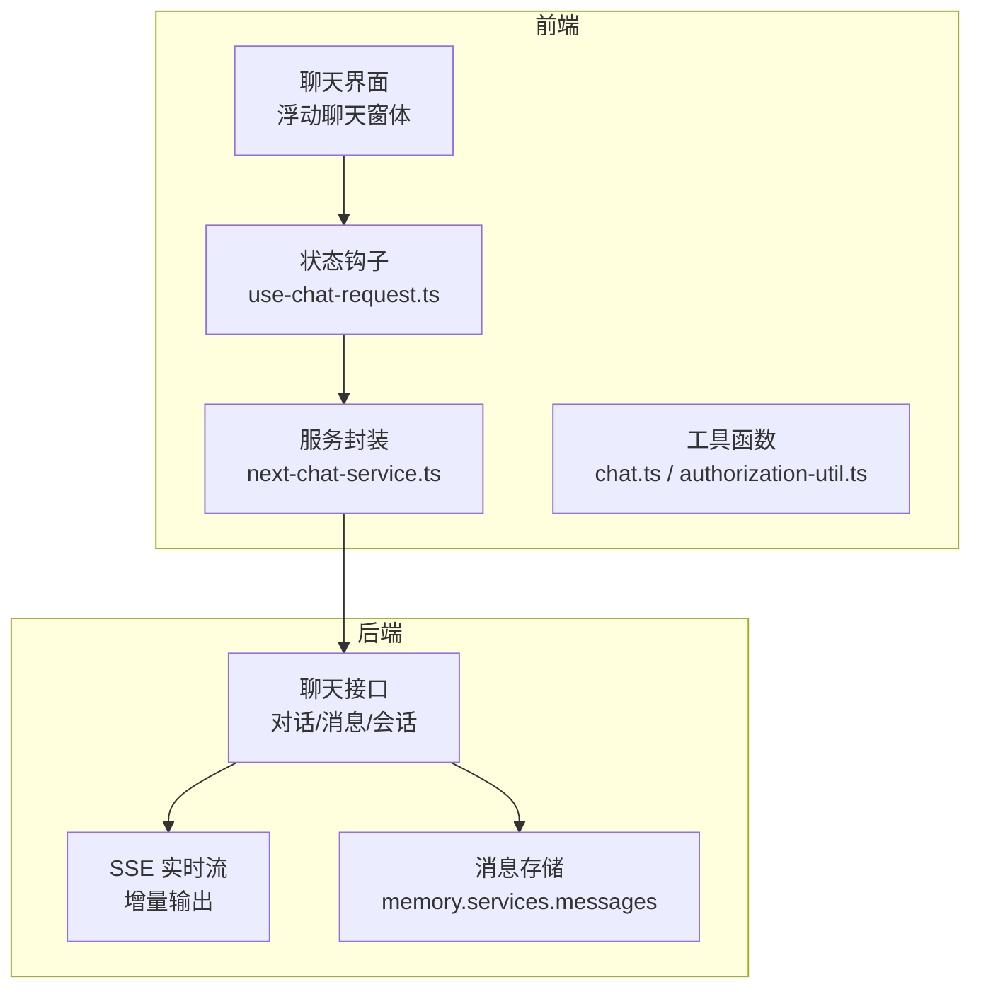
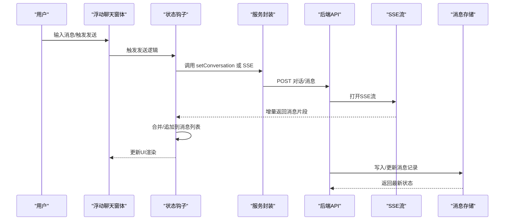
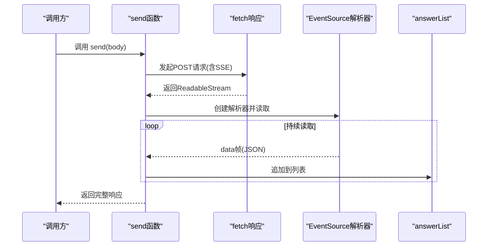
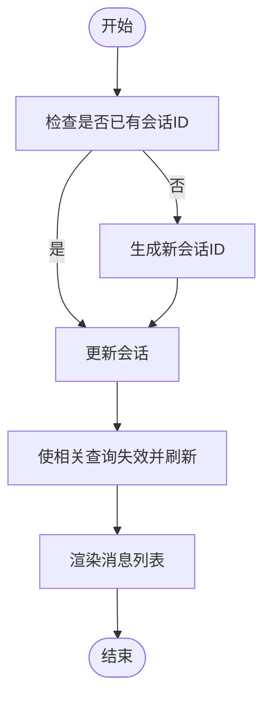
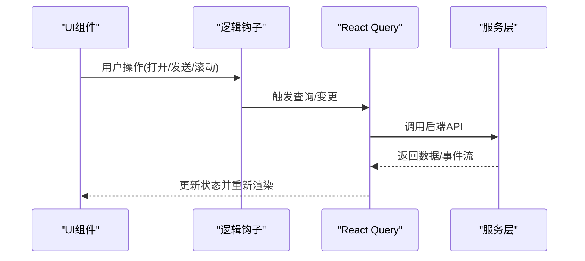
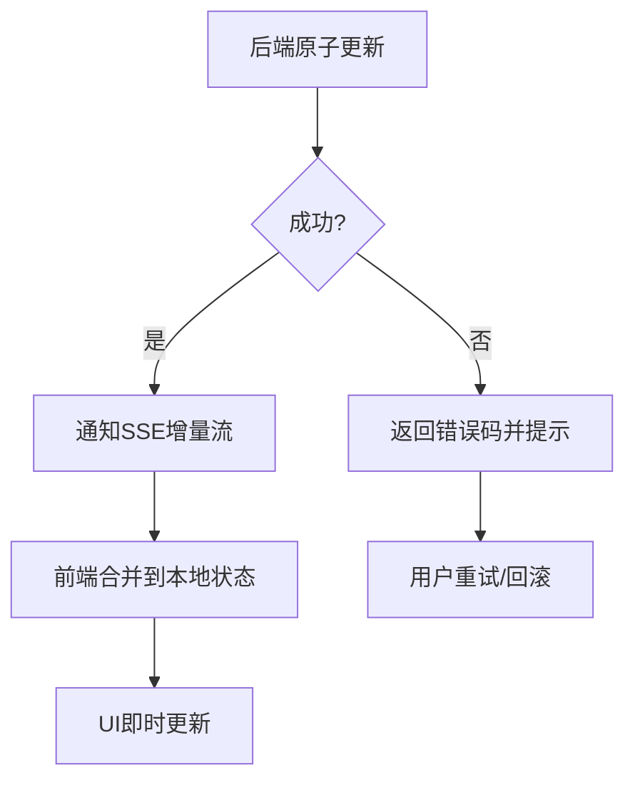
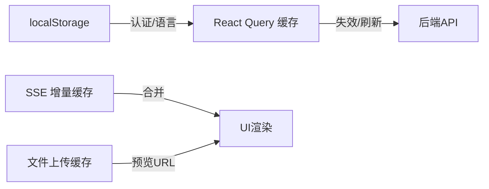
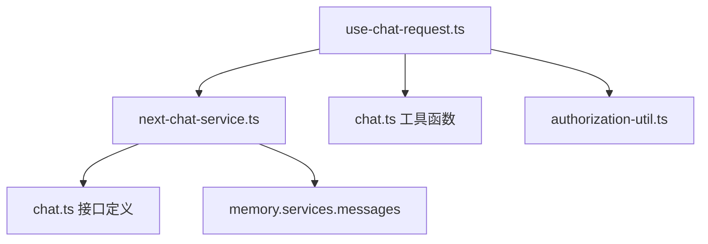

# 状态同步

<cite>
**本文引用的文件**
- [web/src/constants/chat.ts](file://web/src/constants/chat.ts)
- [web/src/utils/chat.ts](file://web/src/utils/chat.ts)
- [web/src/hooks/use-chat-request.ts](file://web/src/hooks/use-chat-request.ts)
- [web/src/services/next-chat-service.ts](file://web/src/services/next-chat-service.ts)
- [web/src/interfaces/database/chat.ts](file://web/src/interfaces/database/chat.ts)
- [web/src/hooks/use-send-message.ts](file://web/src/hooks/use-send-message.ts)
- [web/src/hooks/logic-hooks.ts](file://web/src/hooks/logic-hooks.ts)
- [web/src/components/floating-chat-widget.tsx](file://web/src/components/floating-chat-widget.tsx)
- [web/src/components/message-item/hooks.ts](file://web/src/components/message-item/hooks.ts)
- [web/src/utils/authorization-util.ts](file://web/src/utils/authorization-util.ts)
- [web/src/components/file-upload.tsx](file://web/src/components/file-upload.tsx)
- [web/src/pages/next-chats/hooks/use-set-conversation.ts](file://web/src/pages/next-chats/hooks/use-set-conversation.ts)
- [web/src/pages/next-chats/constants.ts](file://web/src/pages/next-chats/constants.ts)
- [memory/services/messages.py](file://memory/services/messages.py)
- [test/testcases/test_web_api/test_message_app/test_update_message_status.py](file://test/testcases/test_web_api/test_message_app/test_update_message_status.py)
- [test/testcases/test_sdk_api/test_message_management/test_update_message_status.py](file://test/testcases/test_sdk_api/test_message_management/test_update_message_status.py)
</cite>

## 目录
1. [引言](#引言)
2. [项目结构](#项目结构)
3. [核心组件](#核心组件)
4. [架构总览](#架构总览)
5. [详细组件分析](#详细组件分析)
6. [依赖分析](#依赖分析)
7. [性能考虑](#性能考虑)
8. [故障排查指南](#故障排查指南)
9. [结论](#结论)
10. [附录](#附录)

## 引言
本技术文档围绕“状态同步”主题，系统性阐述 RAGFlow 在前端与后端之间的实时状态同步机制，重点覆盖以下方面：
- 实时状态同步：状态变更检测、增量更新、冲突处理
- 聊天状态管理：会话状态、消息状态、用户状态的同步策略
- UI 状态与业务状态映射：状态转换、视图更新、用户交互响应
- 分布式一致性：最终一致性与强一致性的选择与实现
- 状态缓存与持久化：本地缓存、离线存储、数据同步策略
- 状态监控与调试：帮助开发者理解与优化状态同步性能

## 项目结构
本项目采用前后端分离架构，前端使用 React + TypeScript，通过服务层封装调用后端 API；后端提供 REST 接口与 SSE 流式输出，支撑实时对话与状态更新。

图表来源
- [web/src/services/next-chat-service.ts:1-144](file://web/src/services/next-chat-service.ts#L1-L144)
- [web/src/hooks/use-chat-request.ts:1-549](file://web/src/hooks/use-chat-request.ts#L1-L549)
- [web/src/interfaces/database/chat.ts:1-211](file://web/src/interfaces/database/chat.ts#L1-L211)
- [memory/services/messages.py:279-294](file://memory/services/messages.py#L279-L294)

章节来源
- [web/src/services/next-chat-service.ts:1-144](file://web/src/services/next-chat-service.ts#L1-L144)
- [web/src/hooks/use-chat-request.ts:1-549](file://web/src/hooks/use-chat-request.ts#L1-L549)
- [web/src/interfaces/database/chat.ts:1-211](file://web/src/interfaces/database/chat.ts#L1-L211)

## 核心组件
- 前端状态钩子：统一管理对话列表、会话列表、消息增删改查、SSE 实时流等
- 服务封装：对后端 API 的统一封装，支持 GET/POST、SSE、上传解析等
- 数据模型：定义对话、会话、消息、引用等结构
- 工具函数：UUID 生成、消息去重、LaTeX 预处理、变量启用字段映射等
- 本地缓存与持久化：基于 localStorage 的认证信息与语言设置存储

章节来源
- [web/src/hooks/use-chat-request.ts:1-549](file://web/src/hooks/use-chat-request.ts#L1-L549)
- [web/src/services/next-chat-service.ts:1-144](file://web/src/services/next-chat-service.ts#L1-L144)
- [web/src/interfaces/database/chat.ts:1-211](file://web/src/interfaces/database/chat.ts#L1-L211)
- [web/src/utils/chat.ts:1-96](file://web/src/utils/chat.ts#L1-L96)
- [web/src/utils/authorization-util.ts:1-44](file://web/src/utils/authorization-util.ts#L1-L44)

## 架构总览
前端通过 React Query 管理查询缓存与失效，结合 SSE 实现增量消息流式渲染；后端提供 REST 接口与 SSE，消息存储在内存/向量库中，支持按需检索与聚合。

图表来源
- [web/src/components/floating-chat-widget.tsx:257-275](file://web/src/components/floating-chat-widget.tsx#L257-L275)
- [web/src/hooks/use-chat-request.ts:263-290](file://web/src/hooks/use-chat-request.ts#L263-L290)
- [web/src/hooks/use-send-message.ts:94-194](file://web/src/hooks/use-send-message.ts#L94-L194)
- [web/src/services/next-chat-service.ts:59-62](file://web/src/services/next-chat-service.ts#L59-L62)
- [memory/services/messages.py:279-294](file://memory/services/messages.py#L279-L294)

## 详细组件分析

### 组件A：实时状态同步与增量更新（SSE）
- 功能要点
  - 使用 SSE 流式接收后端增量消息，避免全量轮询
  - 前端维护 answerList/answer 缓存，逐条合并渲染
  - 支持中断（Abort）与错误处理，保证稳定性
- 关键流程
  - 初始化 AbortController
  - 发起 SSE 请求，读取事件流
  - 解析每条数据帧，追加到消息列表
  - 完成后清理定时器与状态

图表来源
- [web/src/hooks/use-send-message.ts:94-194](file://web/src/hooks/use-send-message.ts#L94-L194)
- [web/src/hooks/logic-hooks.ts:301-356](file://web/src/hooks/logic-hooks.ts#L301-L356)

章节来源
- [web/src/hooks/use-send-message.ts:94-194](file://web/src/hooks/use-send-message.ts#L94-L194)
- [web/src/hooks/logic-hooks.ts:301-356](file://web/src/hooks/logic-hooks.ts#L301-L356)

### 组件B：聊天状态管理（会话/消息/用户）
- 会话状态
  - 通过 useUpdateConversation 创建或更新会话，确保 conversation_id 唯一
  - 列表与详情通过 useFetchDialogList/useFetchDialog/useFetchConversationList 管理
- 消息状态
  - 新增消息时为每条消息生成唯一 id，避免重复渲染
  - 删除消息通过 useDeleteMessage 触发后端删除并刷新缓存
- 用户状态
  - 认证信息与语言设置通过 localStorage 存储，便于跨页面保持

图表来源
- [web/src/hooks/use-chat-request.ts:263-290](file://web/src/hooks/use-chat-request.ts#L263-L290)
- [web/src/utils/chat.ts:29-31](file://web/src/utils/chat.ts#L29-L31)
- [web/src/pages/next-chats/hooks/use-set-conversation.ts:1-37](file://web/src/pages/next-chats/hooks/use-set-conversation.ts#L1-L37)
- [web/src/pages/next-chats/constants.ts:1-1](file://web/src/pages/next-chats/constants.ts#L1-L1)

章节来源
- [web/src/hooks/use-chat-request.ts:203-290](file://web/src/hooks/use-chat-request.ts#L203-L290)
- [web/src/utils/chat.ts:1-96](file://web/src/utils/chat.ts#L1-L96)
- [web/src/pages/next-chats/hooks/use-set-conversation.ts:1-37](file://web/src/pages/next-chats/hooks/use-set-conversation.ts#L1-L37)
- [web/src/pages/next-chats/constants.ts:1-1](file://web/src/pages/next-chats/constants.ts#L1-L1)

### 组件C：UI 状态与业务状态映射
- UI 状态
  - 浮动聊天窗体负责显示/隐藏、最小化、未读计数等
  - 输入框状态通过 useHandleMessageInputChange 管理
  - 滚动位置与自动滚动通过 useScrollToBottom 控制
- 业务状态
  - 通过 React Query 的 queryClient.invalidateQueries 触发缓存失效
  - SSE 增量更新直接合并到本地状态，驱动 UI 即时变化

图表来源
- [web/src/components/floating-chat-widget.tsx:227-275](file://web/src/components/floating-chat-widget.tsx#L227-L275)
- [web/src/hooks/logic-hooks.ts:397-429](file://web/src/hooks/logic-hooks.ts#L397-L429)
- [web/src/hooks/use-chat-request.ts:118-173](file://web/src/hooks/use-chat-request.ts#L118-L173)

章节来源
- [web/src/components/floating-chat-widget.tsx:227-275](file://web/src/components/floating-chat-widget.tsx#L227-L275)
- [web/src/hooks/logic-hooks.ts:397-429](file://web/src/hooks/logic-hooks.ts#L397-L429)
- [web/src/hooks/use-chat-request.ts:118-173](file://web/src/hooks/use-chat-request.ts#L118-L173)

### 组件D：分布式一致性与冲突解决
- 最终一致性
  - SSE 增量推送 + 本地状态合并，优先保证用户体验流畅
  - 查询缓存通过 invalidateQueries 触发后端拉取最新数据，修复漂移
- 冲突解决
  - 消息唯一 id 生成与去重，避免重复渲染
  - 上传进度与取消控制，防止并发写入冲突
- 强一致性场景
  - 关键状态（如消息可用性开关）通过后端原子更新与校验，测试覆盖验证

图表来源
- [test/testcases/test_web_api/test_message_app/test_update_message_status.py:63-75](file://test/testcases/test_web_api/test_message_app/test_update_message_status.py#L63-L75)
- [test/testcases/test_sdk_api/test_message_management/test_update_message_status.py:65-73](file://test/testcases/test_sdk_api/test_message_management/test_update_message_status.py#L65-L73)
- [memory/services/messages.py:279-294](file://memory/services/messages.py#L279-L294)

章节来源
- [test/testcases/test_web_api/test_message_app/test_update_message_status.py:63-75](file://test/testcases/test_web_api/test_message_app/test_update_message_status.py#L63-L75)
- [test/testcases/test_sdk_api/test_message_management/test_update_message_status.py:65-73](file://test/testcases/test_sdk_api/test_message_management/test_update_message_status.py#L65-L73)
- [memory/services/messages.py:279-294](file://memory/services/messages.py#L279-L294)

### 组件E：状态缓存与持久化
- 本地缓存
  - React Query 默认缓存策略，支持 gcTime、refetchOnWindowFocus 等配置
  - SSE 增量缓存 answerList/answer，避免重复计算
- 离线存储
  - localStorage 存储认证令牌与用户信息，语言设置持久化
- 数据同步
  - 通过 queryClient.invalidateQueries 主动触发后端同步
  - 文件上传使用 URL.createObjectURL 缓存预览，清理时回收

图表来源
- [web/src/hooks/use-chat-request.ts:68-98](file://web/src/hooks/use-chat-request.ts#L68-L98)
- [web/src/utils/authorization-util.ts:1-44](file://web/src/utils/authorization-util.ts#L1-L44)
- [web/src/components/file-upload.tsx:184-243](file://web/src/components/file-upload.tsx#L184-L243)

章节来源
- [web/src/hooks/use-chat-request.ts:68-98](file://web/src/hooks/use-chat-request.ts#L68-L98)
- [web/src/utils/authorization-util.ts:1-44](file://web/src/utils/authorization-util.ts#L1-L44)
- [web/src/components/file-upload.tsx:184-243](file://web/src/components/file-upload.tsx#L184-L243)

## 依赖分析
- 前端依赖
  - React Query：统一查询与缓存管理
  - 自定义 SSE 工具：解析后端事件流
  - 本地存储工具：认证与语言设置
- 后端依赖
  - 消息存储服务：提供消息 ID 递增与最新消息查询能力

图表来源
- [web/src/hooks/use-chat-request.ts:1-50](file://web/src/hooks/use-chat-request.ts#L1-L50)
- [web/src/services/next-chat-service.ts:1-32](file://web/src/services/next-chat-service.ts#L1-L32)
- [web/src/utils/chat.ts:1-96](file://web/src/utils/chat.ts#L1-L96)
- [web/src/utils/authorization-util.ts:1-44](file://web/src/utils/authorization-util.ts#L1-L44)
- [memory/services/messages.py:279-294](file://memory/services/messages.py#L279-L294)

章节来源
- [web/src/hooks/use-chat-request.ts:1-50](file://web/src/hooks/use-chat-request.ts#L1-L50)
- [web/src/services/next-chat-service.ts:1-32](file://web/src/services/next-chat-service.ts#L1-L32)
- [web/src/utils/chat.ts:1-96](file://web/src/utils/chat.ts#L1-L96)
- [web/src/utils/authorization-util.ts:1-44](file://web/src/utils/authorization-util.ts#L1-L44)
- [memory/services/messages.py:279-294](file://memory/services/messages.py#L279-L294)

## 性能考虑
- 减少重绘与回流
  - 使用 requestAnimationFrame 与 setTimeout 控制滚动与渲染时机
  - 消息列表按需渲染，避免一次性渲染大量节点
- 缓存与懒加载
  - React Query gcTime 与 refetchOnWindowFocus 配置降低无效请求
  - SSE 增量渲染减少 DOM 操作
- 并发控制
  - AbortController 取消上一次请求，避免竞态
  - 文件上传进度与成功回调解耦，提升交互体验

## 故障排查指南
- 常见问题
  - SSE 中断：检查 AbortController 是否被意外触发
  - 消息重复：确认消息 id 生成与去重逻辑
  - 缓存不一致：调用 queryClient.invalidateQueries 触发刷新
- 调试建议
  - 打开浏览器网络面板观察 SSE 事件流
  - 在控制台打印 answerList 变化轨迹
  - 使用测试用例验证消息状态切换的正确性

章节来源
- [web/src/hooks/use-send-message.ts:162-177](file://web/src/hooks/use-send-message.ts#L162-L177)
- [web/src/hooks/logic-hooks.ts:309-323](file://web/src/hooks/logic-hooks.ts#L309-L323)
- [test/testcases/test_web_api/test_message_app/test_update_message_status.py:63-75](file://test/testcases/test_web_api/test_message_app/test_update_message_status.py#L63-L75)

## 结论
本项目通过 React Query 与 SSE 的组合，在前端实现了高效、低延迟的状态同步：以增量更新为核心，辅以本地缓存与主动失效策略，兼顾最终一致性与用户体验。聊天状态（会话/消息/用户）通过统一的钩子与服务层进行管理，具备良好的扩展性与可维护性。

## 附录
- 关键常量与类型
  - 聊天消息角色、变量启用字段、空会话标识等
- 开发建议
  - 在新增状态字段时，同步完善测试用例与缓存策略
  - 对高并发场景增加幂等与重试机制

章节来源
- [web/src/constants/chat.ts:1-42](file://web/src/constants/chat.ts#L1-L42)
- [web/src/interfaces/database/chat.ts:1-211](file://web/src/interfaces/database/chat.ts#L1-L211)