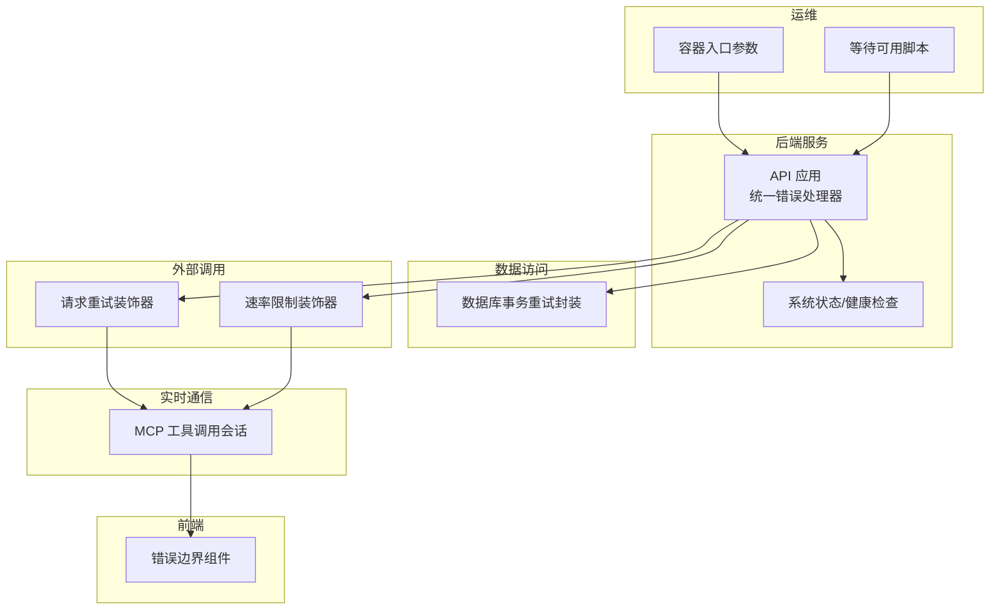
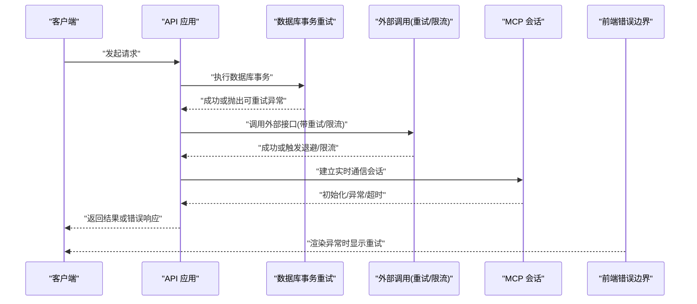
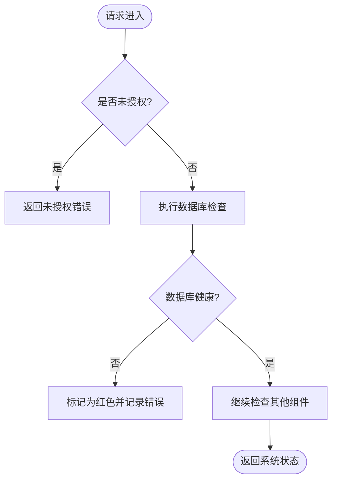
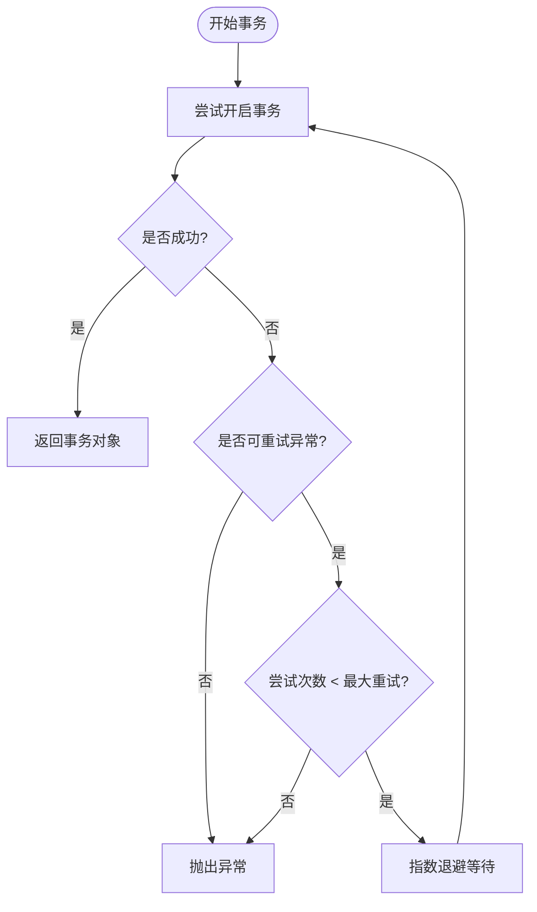
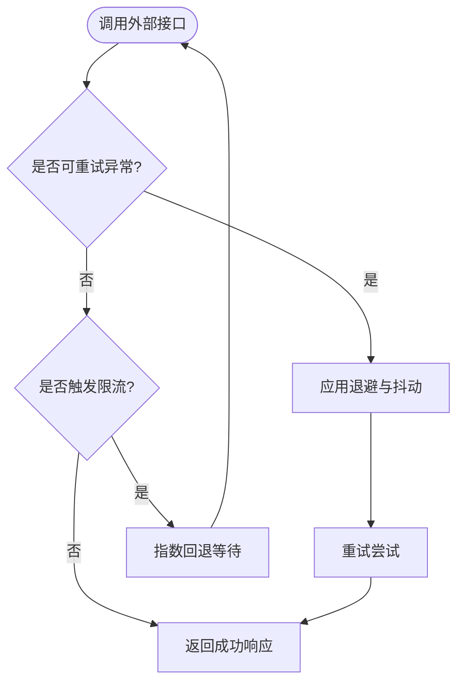
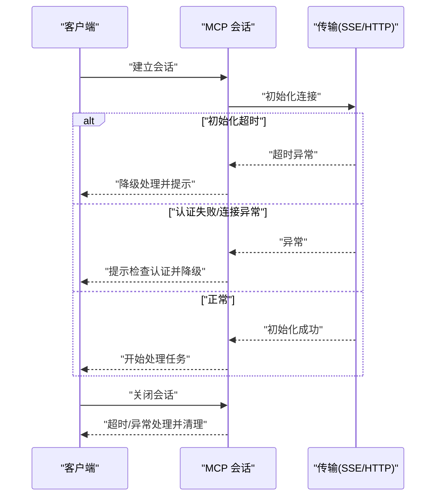
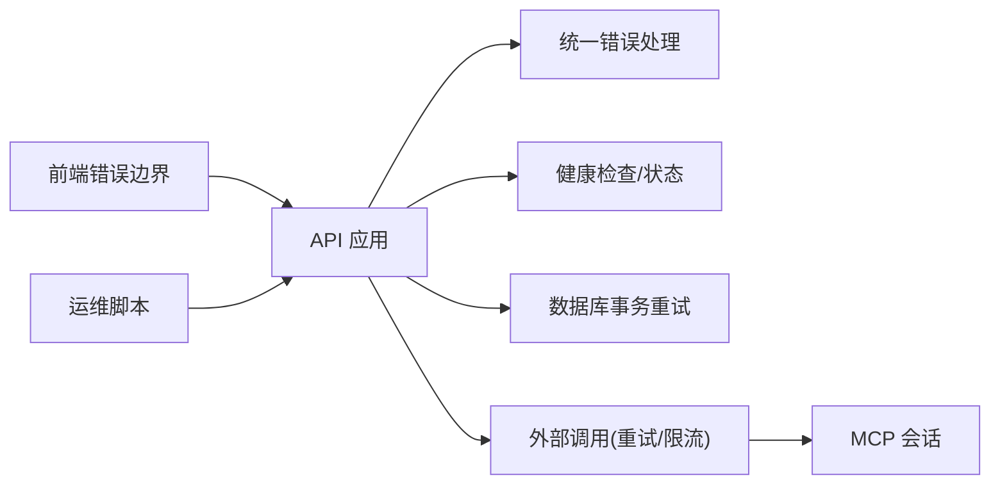

# 错误处理与恢复

<cite>
**本文引用的文件**
- [common/data_source/cross_connector_utils/retry_wrapper.py](file://common/data_source/cross_connector_utils/retry_wrapper.py)
- [common/data_source/utils.py](file://common/data_source/utils.py)
- [common/data_source/cross_connector_utils/rate_limit_wrapper.py](file://common/data_source/cross_connector_utils/rate_limit_wrapper.py)
- [common/data_source/exceptions.py](file://common/data_source/exceptions.py)
- [api/db/db_models.py](file://api/db/db_models.py)
- [api/apps/__init__.py](file://api/apps/__init__.py)
- [api/apps/system_app.py](file://api/apps/system_app.py)
- [api/utils/health_utils.py](file://api/utils/health_utils.py)
- [common/log_utils.py](file://common/log_utils.py)
- [common/mcp_tool_call_conn.py](file://common/mcp_tool_call_conn.py)
- [web/src/components/fallback-component/index.tsx](file://web/src/components/fallback-component/index.tsx)
- [docker/entrypoint.sh](file://docker/entrypoint.sh)
- [sandbox/scripts/wait-for-it.sh](file://sandbox/scripts/wait-for-it.sh)
- [api/apps/sdk/agents.py](file://api/apps/sdk/agents.py)
</cite>

## 目录
1. [引言](#引言)
2. [项目结构](#项目结构)
3. [核心组件](#核心组件)
4. [架构总览](#架构总览)
5. [详细组件分析](#详细组件分析)
6. [依赖分析](#依赖分析)
7. [性能考量](#性能考量)
8. [故障排查指南](#故障排查指南)
9. [结论](#结论)
10. [附录](#附录)

## 引言
本文件聚焦于实时通信与数据交互场景下的错误处理与恢复机制，覆盖网络错误、协议错误、业务错误、系统错误等分类，并给出断线重连策略（含退避算法、最大重试次数）、错误恢复手段（状态回滚、数据补偿、服务降级）、用户友好提示与引导、错误监控与告警、以及运维层面的故障排查路径。内容基于仓库中实际实现进行梳理与可视化，帮助开发者在复杂分布式系统中快速定位并解决问题。

## 项目结构
围绕错误处理与恢复的关键模块分布如下：
- 后端服务层：统一错误处理器、健康检查、系统状态接口
- 数据访问层：数据库连接重试封装
- 外部调用层：通用重试与速率限制装饰器
- 实时通信层：MCP 工具调用会话的连接与异常处理
- 前端层：错误边界组件，用于捕获前端渲染异常
- 运维脚本：容器启动参数与等待脚本，辅助系统可用性

图示来源
- [api/apps/__init__.py](file://api/apps/__init__.py)
- [api/apps/system_app.py](file://api/apps/system_app.py)
- [api/db/db_models.py](file://api/db/db_models.py)
- [common/data_source/cross_connector_utils/retry_wrapper.py](file://common/data_source/cross_connector_utils/retry_wrapper.py)
- [common/data_source/cross_connector_utils/rate_limit_wrapper.py](file://common/data_source/cross_connector_utils/rate_limit_wrapper.py)
- [common/mcp_tool_call_conn.py](file://common/mcp_tool_call_conn.py)
- [web/src/components/fallback-component/index.tsx](file://web/src/components/fallback-component/index.tsx)
- [docker/entrypoint.sh](file://docker/entrypoint.sh)
- [sandbox/scripts/wait-for-it.sh](file://sandbox/scripts/wait-for-it.sh)

章节来源
- [api/apps/__init__.py](file://api/apps/__init__.py)
- [api/apps/system_app.py](file://api/apps/system_app.py)
- [api/db/db_models.py](file://api/db/db_models.py)
- [common/data_source/cross_connector_utils/retry_wrapper.py](file://common/data_source/cross_connector_utils/retry_wrapper.py)
- [common/data_source/cross_connector_utils/rate_limit_wrapper.py](file://common/data_source/cross_connector_utils/rate_limit_wrapper.py)
- [common/mcp_tool_call_conn.py](file://common/mcp_tool_call_conn.py)
- [web/src/components/fallback-component/index.tsx](file://web/src/components/fallback-component/index.tsx)
- [docker/entrypoint.sh](file://docker/entrypoint.sh)
- [sandbox/scripts/wait-for-it.sh](file://sandbox/scripts/wait-for-it.sh)

## 核心组件
- 统一错误处理器与状态页
  - 全局错误处理与未授权处理，确保请求失败时记录日志并返回标准化响应。
  - 系统状态页聚合文档引擎、存储、数据库、Redis 等关键组件健康状态。
- 数据库事务重试
  - 针对连接丢失、接口错误等可重试异常，按指数退避策略自动重试，支持最大重试次数与延迟配置。
- 外部调用重试与速率限制
  - 通用重试装饰器：指数退避 + 抖动，支持最大延迟与异常类型过滤。
  - 速率限制装饰器：周期内限流，超限时指数回退等待，支持最大等待次数。
- 实时通信会话恢复
  - MCP 工具调用会话在初始化超时、认证失败、异常中断等情况下进行降级处理与错误上报。
- 前端错误边界
  - 捕获前端渲染异常，提供重试按钮与提示，提升用户体验。
- 运维与可用性
  - 容器启动参数控制各子服务启停；等待脚本用于探测端口可用性，避免启动风暴。

章节来源
- [api/apps/__init__.py](file://api/apps/__init__.py)
- [api/apps/system_app.py](file://api/apps/system_app.py)
- [api/db/db_models.py](file://api/db/db_models.py)
- [common/data_source/cross_connector_utils/retry_wrapper.py](file://common/data_source/cross_connector_utils/retry_wrapper.py)
- [common/data_source/cross_connector_utils/rate_limit_wrapper.py](file://common/data_source/cross_connector_utils/rate_limit_wrapper.py)
- [common/mcp_tool_call_conn.py](file://common/mcp_tool_call_conn.py)
- [web/src/components/fallback-component/index.tsx](file://web/src/components/fallback-component/index.tsx)
- [docker/entrypoint.sh](file://docker/entrypoint.sh)
- [sandbox/scripts/wait-for-it.sh](file://sandbox/scripts/wait-for-it.sh)

## 架构总览
下图展示了从请求进入、到数据库访问、再到外部调用与实时通信的整体流程，以及错误发生时的恢复与降级路径。

图示来源
- [api/apps/__init__.py](file://api/apps/__init__.py)
- [api/db/db_models.py](file://api/db/db_models.py)
- [common/data_source/cross_connector_utils/retry_wrapper.py](file://common/data_source/cross_connector_utils/retry_wrapper.py)
- [common/data_source/cross_connector_utils/rate_limit_wrapper.py](file://common/data_source/cross_connector_utils/rate_limit_wrapper.py)
- [common/mcp_tool_call_conn.py](file://common/mcp_tool_call_conn.py)
- [web/src/components/fallback-component/index.tsx](file://web/src/components/fallback-component/index.tsx)

## 详细组件分析

### 统一错误处理与系统状态
- 统一错误处理
  - 对未授权、认证异常进行专门处理，记录警告日志并返回标准错误响应。
  - 请求结束时关闭数据库连接，异常时记录异常详情。
- 系统状态与健康检查
  - 聚合文档引擎、存储、数据库、Redis 的健康状态，返回绿色/红色与耗时。
  - 提供健康检查接口，便于外部探活与编排。

图示来源
- [api/apps/__init__.py](file://api/apps/__init__.py)
- [api/apps/system_app.py](file://api/apps/system_app.py)

章节来源
- [api/apps/__init__.py](file://api/apps/__init__.py)
- [api/apps/system_app.py](file://api/apps/system_app.py)

### 数据库事务重试与断线恢复
- 可重试条件
  - 针对接口错误、连接丢失等异常，判断是否应重试。
- 退避策略
  - 指数退避乘以尝试次数，避免雪崩效应。
- 最大重试次数
  - 通过构造函数参数配置，超过阈值则抛出异常。

图示来源
- [api/db/db_models.py](file://api/db/db_models.py)

章节来源
- [api/db/db_models.py](file://api/db/db_models.py)

### 外部调用重试与速率限制
- 通用重试装饰器
  - 支持最大重试次数、基础延迟、最大延迟、退避系数、抖动、异常类型过滤。
  - 对 HTTP 错误进行日志记录与异常抛出，便于上层处理。
- 速率限制装饰器
  - 周期内限制调用次数，超限后指数回退等待，支持最大等待次数并抛出自定义异常。

图示来源
- [common/data_source/cross_connector_utils/retry_wrapper.py](file://common/data_source/cross_connector_utils/retry_wrapper.py)
- [common/data_source/utils.py](file://common/data_source/utils.py)
- [common/data_source/cross_connector_utils/rate_limit_wrapper.py](file://common/data_source/cross_connector_utils/rate_limit_wrapper.py)

章节来源
- [common/data_source/cross_connector_utils/retry_wrapper.py](file://common/data_source/cross_connector_utils/retry_wrapper.py)
- [common/data_source/utils.py](file://common/data_source/utils.py)
- [common/data_source/cross_connector_utils/rate_limit_wrapper.py](file://common/data_source/cross_connector_utils/rate_limit_wrapper.py)

### 实时通信会话恢复（MCP）
- 传输类型
  - SSE 与可流式 HTTP 两种传输方式，分别进行初始化与异常处理。
- 初始化超时与取消
  - 对初始化超时与任务取消进行明确日志与降级处理。
- 认证失败与异常
  - 捕获连接异常，提示检查认证设置，并进行降级处理。
- 关闭与清理
  - 提供同步关闭与超时处理，避免资源泄漏。

图示来源
- [common/mcp_tool_call_conn.py](file://common/mcp_tool_call_conn.py)

章节来源
- [common/mcp_tool_call_conn.py](file://common/mcp_tool_call_conn.py)

### 前端错误边界与用户引导
- 渲染异常捕获
  - 在组件渲染异常时显示错误信息与重试按钮，提升用户体验。
- 国际化与本地化
  - 使用翻译函数提供多语言提示，增强可读性。

章节来源
- [web/src/components/fallback-component/index.tsx](file://web/src/components/fallback-component/index.tsx)

### 运维与可用性
- 容器启动参数
  - 通过命令行参数启用/禁用 Web 服务器、任务执行器、数据同步、MCP 服务等，便于按需部署。
- 端口可用性等待
  - 等待脚本轮询主机端口，超时退出，避免启动风暴与依赖不可用。

章节来源
- [docker/entrypoint.sh](file://docker/entrypoint.sh)
- [sandbox/scripts/wait-for-it.sh](file://sandbox/scripts/wait-for-it.sh)

## 依赖分析
- 组件耦合
  - API 层依赖统一错误处理与健康检查；数据库层依赖事务重试封装；外部调用层依赖重试与限流装饰器；实时通信层依赖会话管理与传输抽象。
- 外部依赖
  - 日志系统、Redis、数据库、外部 HTTP 接口、MCP 服务端。
- 循环依赖
  - 当前结构未见明显循环依赖；装饰器与工具类以函数形式存在，降低耦合。

图示来源
- [api/apps/__init__.py](file://api/apps/__init__.py)
- [api/apps/system_app.py](file://api/apps/system_app.py)
- [api/db/db_models.py](file://api/db/db_models.py)
- [common/data_source/cross_connector_utils/retry_wrapper.py](file://common/data_source/cross_connector_utils/retry_wrapper.py)
- [common/data_source/cross_connector_utils/rate_limit_wrapper.py](file://common/data_source/cross_connector_utils/rate_limit_wrapper.py)
- [common/mcp_tool_call_conn.py](file://common/mcp_tool_call_conn.py)
- [web/src/components/fallback-component/index.tsx](file://web/src/components/fallback-component/index.tsx)
- [docker/entrypoint.sh](file://docker/entrypoint.sh)
- [sandbox/scripts/wait-for-it.sh](file://sandbox/scripts/wait-for-it.sh)

## 性能考量
- 指数退避与抖动
  - 减少同时重试导致的拥塞，提高整体吞吐稳定性。
- 最大延迟与等待上限
  - 防止过长等待影响响应时间，必要时触发快速失败。
- 限流保护
  - 控制对外部服务的调用量，避免被限流或触发熔断。
- 日志与可观测性
  - 通过统一日志与健康检查接口，降低定位成本，提升系统可观测性。

## 故障排查指南
- 网络错误
  - 检查外部接口可达性与超时设置；确认重试装饰器配置是否合理；查看限流装饰器是否触发。
- 协议错误
  - 关注认证头缺失或无效、状态码异常、响应体解析失败等问题；在 SDK 代理与 webhook 处理中定位。
- 业务错误
  - 查看系统状态页与健康检查接口，确认数据库、存储、Redis 是否可用；核对权限与白名单配置。
- 系统错误
  - 检查容器启动参数与服务启停状态；使用等待脚本验证端口可用性；关注日志级别与输出位置。
- 实时通信问题
  - 观察 MCP 会话初始化超时、认证失败、异常中断等日志；确认传输类型与服务端配置一致。

章节来源
- [api/apps/__init__.py](file://api/apps/__init__.py)
- [api/apps/system_app.py](file://api/apps/system_app.py)
- [api/utils/health_utils.py](file://api/utils/health_utils.py)
- [docker/entrypoint.sh](file://docker/entrypoint.sh)
- [sandbox/scripts/wait-for-it.sh](file://sandbox/scripts/wait-for-it.sh)
- [common/mcp_tool_call_conn.py](file://common/mcp_tool_call_conn.py)
- [api/apps/sdk/agents.py](file://api/apps/sdk/agents.py)

## 结论
本项目在错误处理与恢复方面形成了“统一错误处理 + 数据库事务重试 + 外部调用退避与限流 + 实时通信降级 + 前端错误边界 + 运维可用性脚本”的完整闭环。通过指数退避、最大重试次数、速率限制与健康检查等机制，有效提升了系统的韧性与可维护性。建议在生产环境中结合日志级别、告警策略与容量规划，持续优化退避参数与限流阈值，确保在高并发与不稳定网络环境下仍能保持稳定运行。

## 附录
- 错误分类与处理策略
  - 网络错误：指数退避重试、最大延迟、超时处理。
  - 协议错误：认证校验、状态码校验、响应体解析与日志记录。
  - 业务错误：权限校验、白名单与速率限制、错误码与消息标准化。
  - 系统错误：健康检查、状态页、容器参数与端口等待。
- 用户友好提示
  - 前端错误边界提供重试按钮与国际化提示；SDK 代理与 webhook 提供事件追踪与调试接口。
- 错误监控与告警
  - 健康检查接口返回状态与耗时；日志系统集中输出；建议结合外部监控平台进行趋势分析与异常检测。
- 故障排查清单
  - 外部接口可达性、超时与限流；数据库连接与事务重试；MCP 会话初始化与认证；容器服务启停与端口可用性。