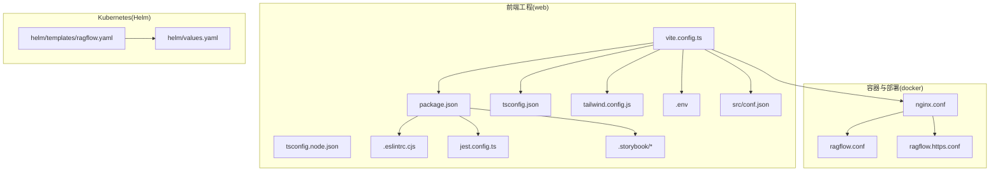
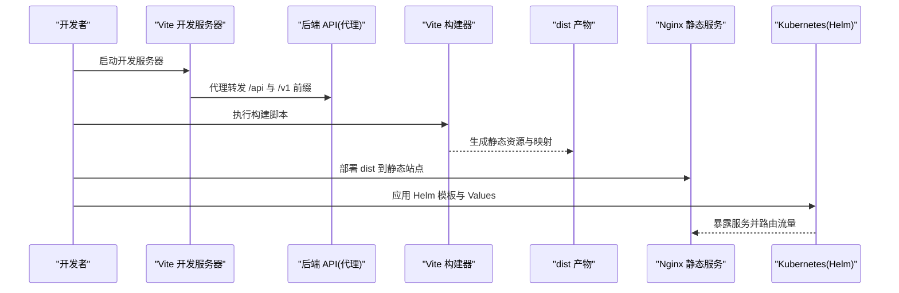
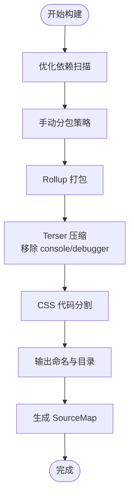
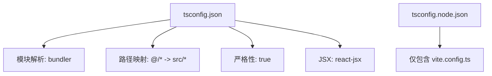
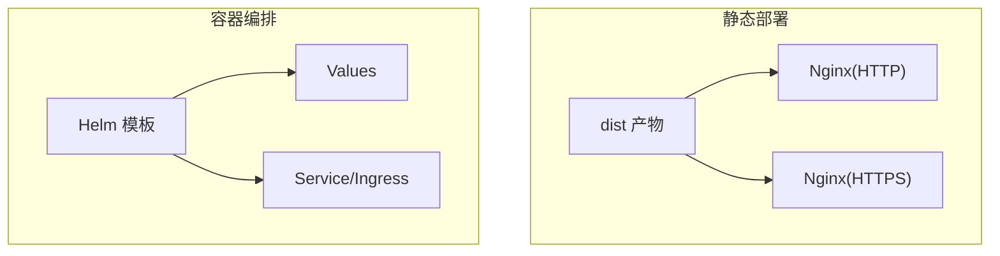
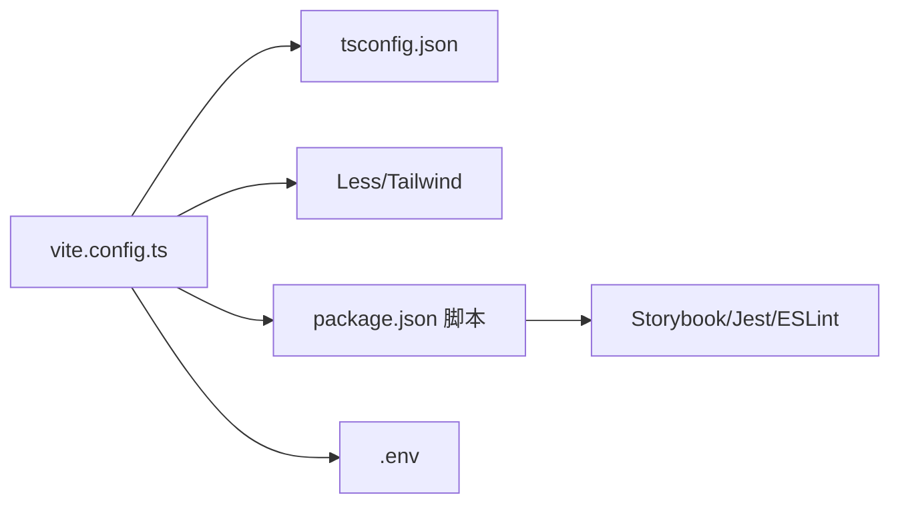

# 构建与部署

<cite>
**本文引用的文件**
- [vite.config.ts](file://web/vite.config.ts)
- [package.json](file://web/package.json)
- [tsconfig.json](file://web/tsconfig.json)
- [tsconfig.node.json](file://web/tsconfig.node.json)
- [.env](file://web/.env)
- [src/conf.json](file://web/src/conf.json)
- [tailwind.config.js](file://web/tailwind.config.js)
- [.eslintrc.cjs](file://web/.eslintrc.cjs)
- [jest.config.ts](file://web/jest.config.ts)
- [.storybook/main.ts](file://web/.storybook/main.ts)
- [.storybook/preview.ts](file://web/.storybook/preview.ts)
- [docker/nginx/nginx.conf](file://docker/nginx/nginx.conf)
- [docker/nginx/ragflow.conf](file://docker/nginx/ragflow.conf)
- [docker/nginx/ragflow.https.conf](file://docker/nginx/ragflow.https.conf)
- [helm/templates/ragflow.yaml](file://helm/templates/ragflow.yaml)
- [helm/values.yaml](file://helm/values.yaml)
</cite>

## 目录
1. [简介](#简介)
2. [项目结构](#项目结构)
3. [核心组件](#核心组件)
4. [架构总览](#架构总览)
5. [详细组件分析](#详细组件分析)
6. [依赖关系分析](#依赖关系分析)
7. [性能考量](#性能考量)
8. [故障排查指南](#故障排查指南)
9. [结论](#结论)
10. [附录](#附录)

## 简介
本指南面向前端构建与部署，聚焦于基于 Vite 的前端工程化实践，覆盖开发服务器、打包配置、TypeScript 编译、包管理策略、构建产物优化（代码分割、资源压缩、缓存策略）、部署配置（静态资源部署、CDN 配置、HTTPS 设置）、环境变量管理（开发/测试/生产差异）、CI/CD 集成以及生产环境的性能监控与错误追踪建议。文档以仓库中的实际配置为依据，提供可操作的步骤与最佳实践。

## 项目结构
前端工程位于 web 目录，采用 Vite 作为构建工具，配合 React、Less、TailwindCSS、Storybook、Jest 等生态组件。关键配置文件如下：
- 构建与开发：vite.config.ts、package.json、tsconfig.json、tsconfig.node.json
- 样式与主题：tailwind.config.js、postcss.config.cjs（通过 Vite 引用）
- 质量保障：.eslintrc.cjs、jest.config.ts、.storybook/*
- 部署与容器：docker/nginx/*、helm/templates/*

图表来源
- [vite.config.ts:1-174](file://web/vite.config.ts#L1-L174)
- [package.json:1-195](file://web/package.json#L1-L195)
- [tsconfig.json:1-37](file://web/tsconfig.json#L1-L37)
- [tsconfig.node.json:1-11](file://web/tsconfig.node.json#L1-L11)
- [tailwind.config.js:1-229](file://web/tailwind.config.js#L1-L229)
- [.eslintrc.cjs:1-74](file://web/.eslintrc.cjs#L1-L74)
- [jest.config.ts:1-34](file://web/jest.config.ts#L1-L34)
- [.storybook/main.ts:1-64](file://web/.storybook/main.ts#L1-L64)
- [.storybook/preview.ts:1-24](file://web/.storybook/preview.ts#L1-L24)
- [docker/nginx/nginx.conf](file://docker/nginx/nginx.conf)
- [docker/nginx/ragflow.conf](file://docker/nginx/ragflow.conf)
- [docker/nginx/ragflow.https.conf](file://docker/nginx/ragflow.https.conf)
- [helm/templates/ragflow.yaml:1-119](file://helm/templates/ragflow.yaml#L1-L119)
- [helm/values.yaml:182-258](file://helm/values.yaml#L182-L258)

章节来源
- [vite.config.ts:1-174](file://web/vite.config.ts#L1-L174)
- [package.json:1-195](file://web/package.json#L1-L195)
- [tsconfig.json:1-37](file://web/tsconfig.json#L1-L37)
- [tsconfig.node.json:1-11](file://web/tsconfig.node.json#L1-L11)
- [tailwind.config.js:1-229](file://web/tailwind.config.js#L1-L229)
- [.eslintrc.cjs:1-74](file://web/.eslintrc.cjs#L1-L74)
- [jest.config.ts:1-34](file://web/jest.config.ts#L1-L34)
- [.storybook/main.ts:1-64](file://web/.storybook/main.ts#L1-L64)
- [.storybook/preview.ts:1-24](file://web/.storybook/preview.ts#L1-L24)
- [docker/nginx/nginx.conf](file://docker/nginx/nginx.conf)
- [docker/nginx/ragflow.conf](file://docker/nginx/ragflow.conf)
- [docker/nginx/ragflow.https.conf](file://docker/nginx/ragflow.https.conf)
- [helm/templates/ragflow.yaml:1-119](file://helm/templates/ragflow.yaml#L1-L119)
- [helm/values.yaml:182-258](file://helm/values.yaml#L182-L258)

## 核心组件
- Vite 构建与开发服务器：定义插件、别名、CSS 预处理、开发代理、构建输出、压缩与分包策略等。
- TypeScript 编译：严格模式、模块解析、路径映射、JSX 支持、类型声明等。
- 包管理与脚本：统一的构建、预览、测试、Storybook、Lint 脚本；引擎版本要求。
- 质量体系：ESLint 规则、Jest 测试配置、Storybook 开发体验。
- 部署与容器：Nginx 静态资源服务、HTTPS 配置、Helm 模板与 Values。

章节来源
- [vite.config.ts:10-174](file://web/vite.config.ts#L10-L174)
- [package.json:7-24](file://web/package.json#L7-L24)
- [tsconfig.json:2-32](file://web/tsconfig.json#L2-L32)
- [tsconfig.node.json:2-9](file://web/tsconfig.node.json#L2-L9)
- [.eslintrc.cjs:1-74](file://web/.eslintrc.cjs#L1-L74)
- [jest.config.ts:1-34](file://web/jest.config.ts#L1-L34)
- [.storybook/main.ts:1-64](file://web/.storybook/main.ts#L1-L64)

## 架构总览
下图展示从开发到生产的整体流程：本地开发使用 Vite HMR 与代理；构建阶段进行代码分割与压缩；产物通过 Nginx 提供静态服务，或在 Kubernetes 中由 Helm 部署。

图表来源
- [vite.config.ts:61-79](file://web/vite.config.ts#L61-L79)
- [vite.config.ts:97-161](file://web/vite.config.ts#L97-L161)
- [docker/nginx/ragflow.conf](file://docker/nginx/ragflow.conf)
- [helm/templates/ragflow.yaml:1-119](file://helm/templates/ragflow.yaml#L1-L119)

## 详细组件分析

### Vite 构建配置与优化
- 插件与工具链
  - React 插件、HTML 注入、静态资源复制、React Dev Inspector。
  - Less 预处理、PostCSS 配置、CSS Modules 命名规范。
- 路径别名与解析
  - @ 指向 src，@parent 指向上级目录，便于跨模块引用。
- 开发服务器
  - 端口来自环境变量 PORT，默认 9222；关闭 HMR 遮罩；配置 /api/v1/admin 与 /api、/v1 前缀代理至后端。
- 依赖优化
  - 预扫描常用依赖，加速冷启动。
- 构建输出与分包
  - 自定义 manualChunks 将第三方库按包名或特征分组，提升缓存命中率。
  - 输出命名规则：chunk/js、entry/js、assets/{ext}/。
  - CSS 分块、警告阈值、最小分块大小。
- 压缩与源码映射
  - Terser 压缩，移除 console 与 debugger，去除注释；开启 sourcemap。
- 入口与基础路径
  - 入口为 src/main.tsx；base 来自 VITE_BASE_URL 环境变量。
- ESBuild 编译选项
  - 关闭严格模式相关校验，跳过库检查，提升构建速度。

图表来源
- [vite.config.ts:84-161](file://web/vite.config.ts#L84-L161)

章节来源
- [vite.config.ts:14-36](file://web/vite.config.ts#L14-L36)
- [vite.config.ts:37-60](file://web/vite.config.ts#L37-L60)
- [vite.config.ts:61-79](file://web/vite.config.ts#L61-L79)
- [vite.config.ts:84-96](file://web/vite.config.ts#L84-L96)
- [vite.config.ts:97-161](file://web/vite.config.ts#L97-L161)
- [vite.config.ts:162-172](file://web/vite.config.ts#L162-L172)

### TypeScript 编译配置
- 目标与模块
  - 目标 ES2022，模块 ESNext，Bundler 模式解析，支持 TS/JSON 导入与隔离模块。
- 严格性与 JSX
  - 严格模式、未使用变量/参数检查、switch 无穿透检查；JSX 使用 react-jsx。
- 路径映射与类型
  - baseUrl 与 paths 映射 @/* 与 @parent/*；内置类型包含 vite/client、node、@testing-library/jest-dom。
- 参考配置
  - tsconfig.node.json 仅包含 Vite 配置文件，避免类型污染。

图表来源
- [tsconfig.json:2-32](file://web/tsconfig.json#L2-L32)
- [tsconfig.node.json:2-9](file://web/tsconfig.node.json#L2-L9)

章节来源
- [tsconfig.json:2-32](file://web/tsconfig.json#L2-L32)
- [tsconfig.node.json:2-9](file://web/tsconfig.node.json#L2-L9)

### 包管理策略
- 依赖与脚本
  - 生产依赖覆盖 UI、状态管理、HTTP、国际化、可视化等；开发依赖覆盖构建、测试、样式、Storybook、ESLint、Prettier。
  - 脚本涵盖 dev、build、preview、test、storybook、lint 等。
- 版本与引擎
  - Node 引擎要求 >= 18.20.4；通过 overrides 控制特定包版本。
- 代码质量
  - ESLint 推荐规则与 TS 插件；Jest 使用 esbuild 转换；Storybook 开发样式与别名配置。

章节来源
- [package.json:7-24](file://web/package.json#L7-L24)
- [package.json:25-133](file://web/package.json#L25-L133)
- [package.json:134-190](file://web/package.json#L134-L190)
- [package.json:191-194](file://web/package.json#L191-L194)
- [.eslintrc.cjs:1-74](file://web/.eslintrc.cjs#L1-L74)
- [jest.config.ts:1-34](file://web/jest.config.ts#L1-L34)
- [.storybook/main.ts:1-64](file://web/.storybook/main.ts#L1-L64)

### 构建产物优化
- 代码分割
  - manualChunks 将 d3、ajv、@antv 等独立拆分；utils 组合 lodash/dayjs/axios/date-fns；XML/JS 工具归类 xml-js；其余第三方按包名拆分。
- 资源压缩
  - Terser 压缩、移除 console 与 debugger、去除注释；CSS 分块与按扩展命名。
- 缓存策略
  - 文件名包含哈希，利于浏览器缓存；按类型与入口分别命名，便于长期缓存与增量更新。
- SourceMap
  - 生产环境启用 SourceMap，便于问题定位与回溯。

章节来源
- [vite.config.ts:105-137](file://web/vite.config.ts#L105-L137)
- [vite.config.ts:142-158](file://web/vite.config.ts#L142-L158)
- [vite.config.ts:159-161](file://web/vite.config.ts#L159-L161)

### 部署配置
- 静态资源部署
  - Nginx 配置用于提供 dist 静态资源；支持 HTTP 与 HTTPS 两种站点配置。
- CDN 配置
  - 可在 Nginx 或上游网关层配置 CDN 加速；结合文件名哈希与缓存头实现最优缓存效果。
- HTTPS 设置
  - 使用 HTTPS 配置文件启用 TLS；结合证书与反向代理策略。
- Kubernetes(Helm) 部署
  - Helm 模板定义 Deployment、Service、ConfigMap；Values 控制镜像、资源、Ingress 等；Ingress 默认关闭，需按需启用。

图表来源
- [docker/nginx/ragflow.conf](file://docker/nginx/ragflow.conf)
- [docker/nginx/ragflow.https.conf](file://docker/nginx/ragflow.https.conf)
- [helm/templates/ragflow.yaml:1-119](file://helm/templates/ragflow.yaml#L1-L119)
- [helm/values.yaml:182-258](file://helm/values.yaml#L182-L258)

章节来源
- [docker/nginx/nginx.conf](file://docker/nginx/nginx.conf)
- [docker/nginx/ragflow.conf](file://docker/nginx/ragflow.conf)
- [docker/nginx/ragflow.https.conf](file://docker/nginx/ragflow.https.conf)
- [helm/templates/ragflow.yaml:1-119](file://helm/templates/ragflow.yaml#L1-L119)
- [helm/values.yaml:182-258](file://helm/values.yaml#L182-L258)

### 环境变量管理
- 开发环境
  - PORT 默认 9222；DID_YOU_KNOW 示例变量；VITE_BASE_URL 用于设置基础路径。
- 测试/生产环境
  - 通过 CI 注入环境变量覆盖默认值；Vite 会将以 VITE_ 前缀的变量注入客户端代码。
- 配置文件
  - src/conf.json 用于注入 HTML 标题等应用元信息。

章节来源
- [.env:1-2](file://web/.env#L1-L2)
- [vite.config.ts:10-11](file://web/vite.config.ts#L10-L11)
- [vite.config.ts:81-82](file://web/vite.config.ts#L81-L82)
- [src/conf.json:1-4](file://web/src/conf.json#L1-L4)

### CI/CD 集成
- 构建与发布
  - 使用 package.json 中的构建脚本；在 CI 中安装 Node 与依赖后执行构建。
- 容器化
  - 结合 Dockerfile 与 docker-compose 进行本地或云端部署；也可直接使用 Helm 在集群中部署。
- Kubernetes 部署
  - 通过 Helm 模板与 Values 管理部署参数；如需 Ingress，可在 Values 中启用并配置域名与证书。

章节来源
- [package.json:7-16](file://web/package.json#L7-L16)
- [helm/templates/ragflow.yaml:1-119](file://helm/templates/ragflow.yaml#L1-L119)
- [helm/values.yaml:182-258](file://helm/values.yaml#L182-L258)

### 性能监控与错误追踪
- 建议
  - 生产环境启用 SourceMap 并配置错误上报（如 Sentry）；对关键页面与接口埋点监控加载时长与失败率；结合 CDN 缓存与 HTTP/2 多路复用提升传输效率。
- 说明
  - 本节为通用实践建议，不涉及具体代码实现。

## 依赖关系分析
- 组件耦合
  - Vite 配置依赖 tsconfig 与样式配置；开发代理依赖后端服务；构建产物受分包策略影响。
- 外部依赖
  - React、Ant Design、Less、TailwindCSS、Storybook、Jest、ESLint 等生态组件共同构成前端栈。
- 潜在循环依赖
  - 通过模块化与路径别名降低循环依赖风险；TS 严格模式有助于发现潜在问题。

图表来源
- [vite.config.ts:1-174](file://web/vite.config.ts#L1-L174)
- [tsconfig.json:1-37](file://web/tsconfig.json#L1-L37)
- [package.json:1-195](file://web/package.json#L1-L195)
- [.eslintrc.cjs:1-74](file://web/.eslintrc.cjs#L1-L74)
- [jest.config.ts:1-34](file://web/jest.config.ts#L1-L34)
- [.storybook/main.ts:1-64](file://web/.storybook/main.ts#L1-L64)

章节来源
- [vite.config.ts:1-174](file://web/vite.config.ts#L1-L174)
- [tsconfig.json:1-37](file://web/tsconfig.json#L1-L37)
- [package.json:1-195](file://web/package.json#L1-L195)
- [.eslintrc.cjs:1-74](file://web/.eslintrc.cjs#L1-L74)
- [jest.config.ts:1-34](file://web/jest.config.ts#L1-L34)
- [.storybook/main.ts:1-64](file://web/.storybook/main.ts#L1-L64)

## 性能考量
- 代码分割
  - 合理划分 vendor 与业务包，提升缓存命中率；避免单个包过大导致首屏加载慢。
- 资源压缩
  - 启用 Terser 压缩与 Tree Shaking；移除调试语句与注释，减小体积。
- 样式与字体
  - Tailwind 按需引入与内容扫描，减少未使用样式；字体与图标资源 CDN 化。
- 缓存与传输
  - 文件名带哈希、合理设置缓存头；启用 HTTP/2 与 Gzip/Brotli 压缩。
- 开发体验
  - HMR 与代理提升迭代效率；ESLint/Jest/Storybook 保证质量。

## 故障排查指南
- 构建失败
  - 检查 Node 版本是否满足引擎要求；确认依赖安装完整；查看 Terser 压缩日志与分包异常。
- 开发代理不通
  - 核对代理前缀与目标地址；确认后端服务已启动；检查 CORS 与 WebSocket 代理配置。
- 样式异常
  - 检查 Less 变量与 Mixin 注入顺序；Tailwind 内容扫描路径是否覆盖新增组件。
- 测试与 Storybook
  - Jest 覆盖率阈值与忽略路径；Storybook 样式加载与别名解析。
- 部署问题
  - Nginx 静态路径与索引页；Helm Values 与 Ingress 配置；证书与域名解析。

章节来源
- [vite.config.ts:61-79](file://web/vite.config.ts#L61-L79)
- [vite.config.ts:142-158](file://web/vite.config.ts#L142-L158)
- [jest.config.ts:27-31](file://web/jest.config.ts#L27-L31)
- [.storybook/main.ts:53-61](file://web/.storybook/main.ts#L53-L61)

## 结论
本指南基于仓库现有配置，系统梳理了前端构建与部署的关键环节。通过合理的 Vite 配置、TypeScript 类型约束、包管理策略与构建优化，可显著提升开发效率与产物质量。结合 Nginx 与 Helm 的部署方案，能够快速落地到生产环境。建议在生产环境中完善性能监控与错误追踪机制，持续优化用户体验与稳定性。

## 附录
- 快速参考
  - 开发：npm run dev
  - 构建：npm run build
  - 预览：npm run preview
  - 测试：npm run test
  - Lint：npm run lint
  - Storybook：npm run storybook

章节来源
- [package.json:7-16](file://web/package.json#L7-L16)