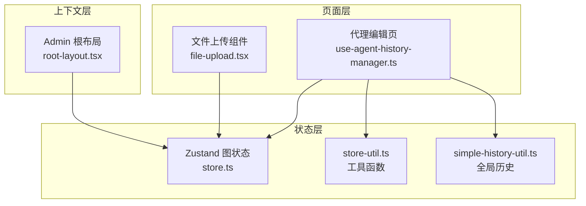
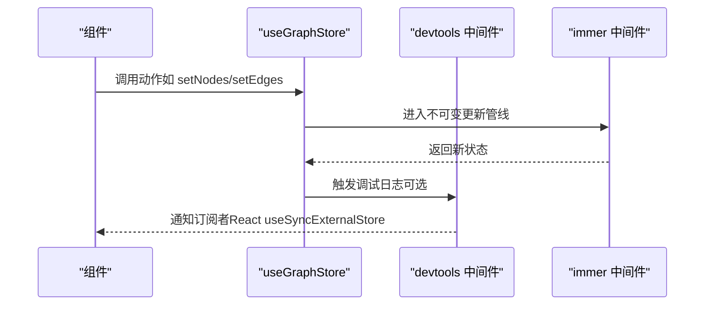
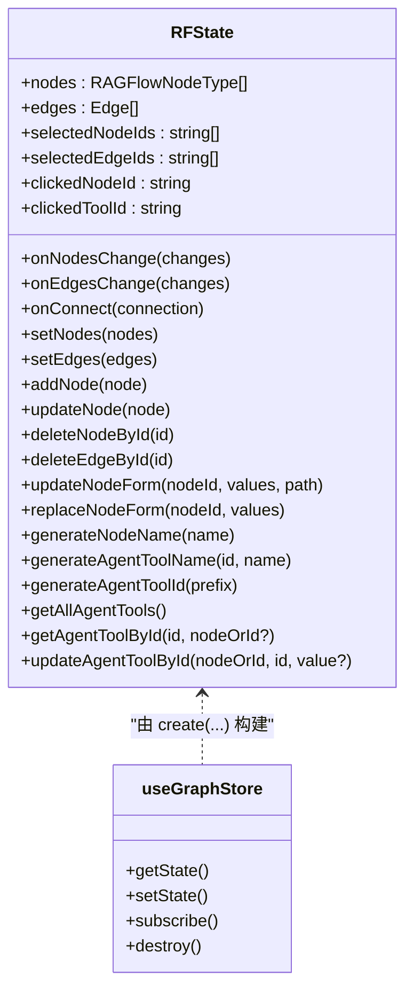
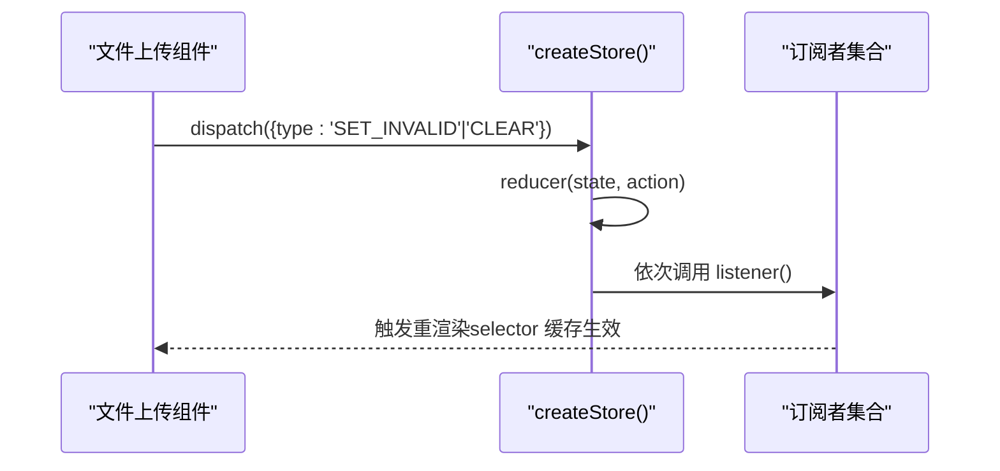
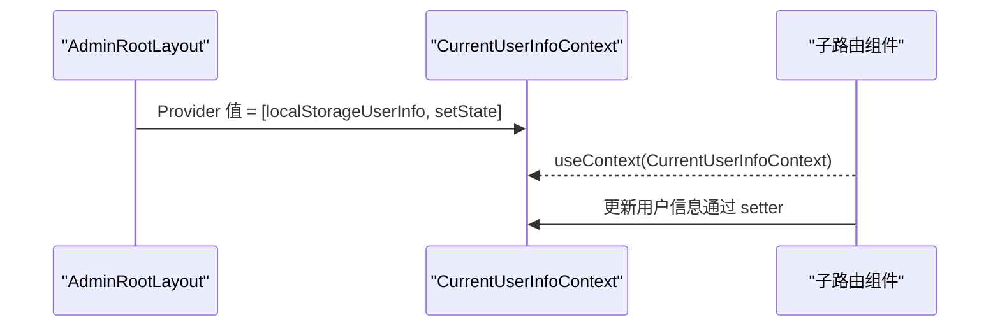
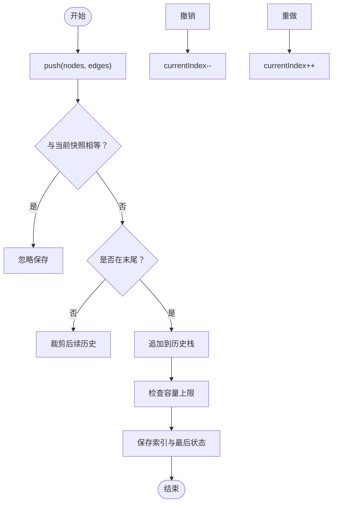
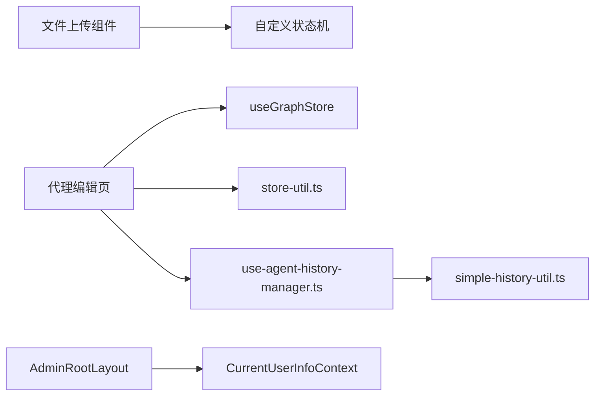

# 全局状态管理

<cite>
**本文引用的文件**
- [store.ts](file://web/src/pages/agent/store.ts)
- [file-upload.tsx](file://web/src/components/file-upload.tsx)
- [root-layout.tsx](file://web/src/pages/admin/layouts/root-layout.tsx)
- [store-util.ts](file://web/src/utils/store-util.ts)
- [simple-history-util.ts](file://web/src/utils/simple-history-util.ts)
- [use-agent-history-manager.ts](file://web/src/pages/agent/use-agent-history-manager.ts)
</cite>

## 目录
1. [引言](#引言)
2. [项目结构](#项目结构)
3. [核心组件](#核心组件)
4. [架构总览](#架构总览)
5. [详细组件分析](#详细组件分析)
6. [依赖关系分析](#依赖关系分析)
7. [性能考虑](#性能考虑)
8. [故障排查指南](#故障排查指南)
9. [结论](#结论)
10. [附录](#附录)

## 引言
本文件系统性梳理 RAGFlow 前端（web）中的全局状态管理设计与实现，重点覆盖以下方面：
- 状态树结构：以 Zustand 为基础的状态容器，定义节点与边、选中态、点击态等状态域
- 状态更新机制：基于不可变更新与中间件（devtools、immer）的更新流程
- 订阅模式：结合 React 的 useSyncExternalStore 实现细粒度订阅
- store-util 工具函数：命名空间加载态聚合、延时等辅助能力
- Provider 模式：通过 React Context 提供状态上下文，实现跨组件共享
- 生命周期管理：状态创建、更新、销毁（组件卸载）过程
- 调试与性能：Redux DevTools 集成、选择器优化、历史记录与撤销重做
- 组件通信：状态驱动的 UI 更新与事件处理

## 项目结构
RAGFlow 前端采用 React + TypeScript 技术栈，全局状态主要集中在页面级 store 中，并辅以通用工具函数与历史管理模块：
- 页面级状态：以 Zustand store 为核心，集中管理图编辑器的节点、边、选中与表单数据
- 通用工具：store-util 提供命名空间效果加载态聚合、延时等工具
- 历史管理：HistoryManager 结合 useGraphStore 实现撤销/重做与历史快照
- 上下文共享：通过 React Context 将 store 注入到组件树，实现 Provider 模式

图表来源
- [store.ts:120-662](file://web/src/pages/agent/store.ts#L120-L662)
- [file-upload.tsx:232-286](file://web/src/components/file-upload.tsx#L232-L286)
- [root-layout.tsx:41-53](file://web/src/pages/admin/layouts/root-layout.tsx#L41-L53)
- [store-util.ts:1-14](file://web/src/utils/store-util.ts#L1-L14)
- [simple-history-util.ts:1-54](file://web/src/utils/simple-history-util.ts#L1-L54)
- [use-agent-history-manager.ts:1-130](file://web/src/pages/agent/use-agent-history-manager.ts#L1-L130)

章节来源
- [store.ts:120-662](file://web/src/pages/agent/store.ts#L120-L662)
- [file-upload.tsx:232-286](file://web/src/components/file-upload.tsx#L232-L286)
- [root-layout.tsx:41-53](file://web/src/pages/admin/layouts/root-layout.tsx#L41-L53)
- [store-util.ts:1-14](file://web/src/utils/store-util.ts#L1-L14)
- [simple-history-util.ts:1-54](file://web/src/utils/simple-history-util.ts#L1-L54)
- [use-agent-history-manager.ts:1-130](file://web/src/pages/agent/use-agent-history-manager.ts#L1-L130)

## 核心组件
- Zustand 图状态容器（useGraphStore）
  - 状态域：nodes、edges、selectedNodeIds、selectedEdgeIds、clickedNodeId、clickedToolId 等
  - 动作：节点增删改、边增删改、连接、选择变更、表单更新、工具生成与查找、名称与 ID 生成等
  - 中间件：devtools（开发调试）、immer（简化不可变更新）
- 文件上传本地状态（file-upload.tsx）
  - 自定义状态机：reducer + dispatch + subscribe，支持 getState、dispatch、subscribe
  - 通过 React Context 提供状态上下文，useStore(selector) 基于 useSyncExternalStore 订阅
- 管理后台用户信息上下文（root-layout.tsx）
  - 使用 React Context 存储当前用户信息与更新函数，通过 Provider 在路由层级共享
- store-util 工具函数
  - getOneNamespaceEffectsLoading：按命名空间聚合 effects 加载态
  - delay：延时工具
- 历史管理（use-agent-history-manager.ts + simple-history-util.ts）
  - HistoryManager：维护历史栈、撤销/重做、去重与最大容量控制
  - GlobalHistory：封装浏览器 history API，提供 push/replace/pop 监听

章节来源
- [store.ts:55-119](file://web/src/pages/agent/store.ts#L55-L119)
- [store.ts:122-659](file://web/src/pages/agent/store.ts#L122-L659)
- [file-upload.tsx:184-230](file://web/src/components/file-upload.tsx#L184-L230)
- [file-upload.tsx:244-265](file://web/src/components/file-upload.tsx#L244-L265)
- [root-layout.tsx:41-53](file://web/src/pages/admin/layouts/root-layout.tsx#L41-L53)
- [store-util.ts:1-14](file://web/src/utils/store-util.ts#L1-L14)
- [simple-history-util.ts:1-54](file://web/src/utils/simple-history-util.ts#L1-L54)
- [use-agent-history-manager.ts:5-100](file://web/src/pages/agent/use-agent-history-manager.ts#L5-L100)

## 架构总览
RAGFlow 的全局状态采用“页面级 Zustand + 通用工具 + 历史管理 + Context Provider”的组合：
- 页面级状态：useGraphStore 聚合图编辑相关状态，动作统一在 store 内部实现
- 通用工具：store-util 提供加载态聚合与延时等辅助
- 历史管理：HistoryManager 与 GlobalHistory 分别负责业务状态历史与浏览器历史
- Provider 模式：root-layout.tsx 通过 Context 将用户信息注入到子路由；file-upload.tsx 通过自定义 Context 提供本地状态上下文

图表来源
- [store.ts:122-659](file://web/src/pages/agent/store.ts#L122-L659)

章节来源
- [store.ts:122-659](file://web/src/pages/agent/store.ts#L122-L659)

## 详细组件分析

### Zustand 图状态容器（useGraphStore）
- 设计理念
  - 将图编辑器的核心状态（节点、边、选中、点击、表单）收敛在一个 store 中，便于统一管理与调试
  - 使用 immer 简化不可变更新，避免深层拷贝与重复代码
  - 使用 devtools 中间件开启 Redux DevTools 支持，便于追踪状态变化
- 关键数据结构
  - nodes：RAGFlowNodeType[]，存储所有节点及其表单数据
  - edges：Edge[]，存储连接关系
  - selectedNodeIds/selectedEdgeIds：当前选中集合
  - clickedNodeId/clickedToolId：当前点击目标
- 主要动作
  - onNodesChange/onEdgesChange：应用节点/边变更
  - onConnect/addEdge：建立新连接并联动表单
  - updateNodeForm/replaceNodeForm：更新节点表单字段或整包替换
  - deleteNodeById/deleteEdgeById/deleteAgentDownstreamNodesById：删除节点与下游关联
  - duplicateNode/duplicateIterationNode：复制节点与迭代节点
  - generateNodeName/generateAgentToolName/generateAgentToolId：名称与 ID 生成策略
  - getAllAgentTools/getAgentToolById/updateAgentToolById：工具查询与更新
- 订阅与选择器
  - 通过 useGraphStore(selector) 获取部分状态，减少不必要重渲染

图表来源
- [store.ts:55-119](file://web/src/pages/agent/store.ts#L55-L119)
- [store.ts:122-659](file://web/src/pages/agent/store.ts#L122-L659)

章节来源
- [store.ts:55-119](file://web/src/pages/agent/store.ts#L55-L119)
- [store.ts:122-659](file://web/src/pages/agent/store.ts#L122-L659)

### 文件上传本地状态（file-upload.tsx）
- 设计理念
  - 为特定 UI 场景（文件上传）提供轻量级本地状态机，避免污染全局 store
  - 通过自定义 Context 与 useStore(selector) 实现细粒度订阅
- 状态机结构
  - reducer：根据动作类型更新状态（如 SET_INVALID/CLEAR）
  - dispatch：触发 reducer 并通知所有订阅者
  - subscribe：注册/注销监听器
  - getState：获取当前状态
- 订阅与选择器
  - useStore(selector) 基于 useSyncExternalStore，结合 selector 缓存避免重复渲染

图表来源
- [file-upload.tsx:184-230](file://web/src/components/file-upload.tsx#L184-L230)
- [file-upload.tsx:244-265](file://web/src/components/file-upload.tsx#L244-L265)

章节来源
- [file-upload.tsx:184-230](file://web/src/components/file-upload.tsx#L184-L230)
- [file-upload.tsx:232-286](file://web/src/components/file-upload.tsx#L232-L286)
- [file-upload.tsx:244-265](file://web/src/components/file-upload.tsx#L244-L265)

### 管理后台用户信息上下文（root-layout.tsx）
- 设计理念
  - 将用户信息与更新函数通过 Context Provider 注入到路由层级，实现跨页面共享
  - 支持从本地存储恢复用户信息，保证刷新后状态一致
- 关键点
  - CurrentUserInfoContext：提供 [当前用户信息, 更新函数]
  - AdminRootLayout：在根路由层提供 Provider

图表来源
- [root-layout.tsx:41-53](file://web/src/pages/admin/layouts/root-layout.tsx#L41-L53)

章节来源
- [root-layout.tsx:41-53](file://web/src/pages/admin/layouts/root-layout.tsx#L41-L53)

### store-util 工具函数
- getOneNamespaceEffectsLoading(namespace, effects, effectNames)
  - 作用：按命名空间聚合多个 effect 的加载态，任一 effect 处于加载即视为加载中
  - 适用场景：多请求并发时的统一加载态判断
- delay(ms)
  - 作用：返回指定毫秒数的 Promise，用于异步节流或测试
  - 适用场景：防抖、动画延迟、测试等待

章节来源
- [store-util.ts:1-14](file://web/src/utils/store-util.ts#L1-L14)

### 历史管理与浏览器历史
- HistoryManager（业务状态历史）
  - 维护 nodes/edges 的历史快照，支持撤销/重做、去重与最大容量控制
  - 通过 useGraphStore 的 nodes/edges 变更自动保存快照
- GlobalHistory（浏览器历史）
  - 封装 window.history 的 pushState/replaceState 与 popstate 监听
  - 提供 push/replace 方法与监听器注册，便于路由级状态同步

图表来源
- [use-agent-history-manager.ts:29-99](file://web/src/pages/agent/use-agent-history-manager.ts#L29-L99)

章节来源
- [use-agent-history-manager.ts:1-130](file://web/src/pages/agent/use-agent-history-manager.ts#L1-L130)
- [simple-history-util.ts:1-54](file://web/src/utils/simple-history-util.ts#L1-L54)

## 依赖关系分析
- 组件对 store 的依赖
  - useGraphStore 被代理编辑页与历史管理模块广泛使用
  - 文件上传组件通过自定义状态机与 Context 提供独立状态域
- 工具与历史模块
  - store-util 为业务逻辑提供加载态聚合与延时
  - simple-history-util 为浏览器历史提供统一抽象
- Provider 模式
  - root-layout.tsx 通过 Context 提供用户信息上下文
  - file-upload.tsx 通过自定义 Context 提供本地状态上下文

图表来源
- [store.ts:122-659](file://web/src/pages/agent/store.ts#L122-L659)
- [file-upload.tsx:232-286](file://web/src/components/file-upload.tsx#L232-L286)
- [store-util.ts:1-14](file://web/src/utils/store-util.ts#L1-L14)
- [simple-history-util.ts:1-54](file://web/src/utils/simple-history-util.ts#L1-L54)
- [use-agent-history-manager.ts:1-130](file://web/src/pages/agent/use-agent-history-manager.ts#L1-L130)
- [root-layout.tsx:41-53](file://web/src/pages/admin/layouts/root-layout.tsx#L41-L53)

章节来源
- [store.ts:122-659](file://web/src/pages/agent/store.ts#L122-L659)
- [file-upload.tsx:232-286](file://web/src/components/file-upload.tsx#L232-L286)
- [store-util.ts:1-14](file://web/src/utils/store-util.ts#L1-L14)
- [simple-history-util.ts:1-54](file://web/src/utils/simple-history-util.ts#L1-L54)
- [use-agent-history-manager.ts:1-130](file://web/src/pages/agent/use-agent-history-manager.ts#L1-L130)
- [root-layout.tsx:41-53](file://web/src/pages/admin/layouts/root-layout.tsx#L41-L53)

## 性能考虑
- 状态分割
  - 将图编辑状态与通用业务状态分离，避免无关状态变更引发的重渲染
  - 文件上传等局部状态使用自定义状态机，降低全局 store 的复杂度
- 选择器优化
  - 使用 useGraphStore(selector) 仅订阅所需字段，结合 selector 缓存（见 file-upload.tsx 中的 lastValueRef）减少不必要的渲染
- 不可变更新
  - 通过 immer 中间件简化不可变更新，避免深层拷贝带来的性能损耗
- 调试与追踪
  - devtools 中间件开启 Redux DevTools，便于定位状态变更路径与性能瓶颈
- 历史管理
  - HistoryManager 对历史快照进行去重与容量限制，避免内存膨胀
  - 浏览器历史通过 GlobalHistory 统一封装，减少重复逻辑

## 故障排查指南
- 状态未更新或未触发重渲染
  - 检查是否使用了正确的 selector，确保 selector 返回值稳定且可比较
  - 确认订阅者是否正确注册与注销（自定义状态机的 subscribe 返回值用于注销）
- 加载态判断异常
  - 使用 store-util 的 getOneNamespaceEffectsLoading 聚合命名空间下的多个 effect，确保任一 effect 加载即视为加载中
- 历史记录无效或无法撤销
  - 确认 HistoryManager 的 push 是否被正确调用（useEffect 监听 nodes/edges）
  - 检查 statesEqual 判等逻辑与 JSON 序列化一致性
- 浏览器历史不同步
  - 确认 GlobalHistory 的 push/replace 是否被调用，以及 popstate 监听是否生效

章节来源
- [file-upload.tsx:244-265](file://web/src/components/file-upload.tsx#L244-L265)
- [store-util.ts:1-14](file://web/src/utils/store-util.ts#L1-L14)
- [use-agent-history-manager.ts:21-27](file://web/src/pages/agent/use-agent-history-manager.ts#L21-L27)
- [simple-history-util.ts:9-20](file://web/src/utils/simple-history-util.ts#L9-L20)

## 结论
RAGFlow 的全局状态管理以 Zustand 为核心，结合 devtools 与 immer 中间件，实现了清晰、可调试、高性能的状态更新与订阅机制。通过 Provider 模式与 Context，状态在页面与组件之间高效共享；store-util 与历史管理模块进一步完善了加载态聚合与撤销/重做能力。建议在后续扩展中持续遵循“状态分割 + 选择器优化 + 中间件调试”的最佳实践，以保持系统的可维护性与性能。

## 附录
- 关键实现路径参考
  - Zustand 容器与动作：[store.ts:122-659](file://web/src/pages/agent/store.ts#L122-L659)
  - 自定义状态机与订阅：[file-upload.tsx:184-230](file://web/src/components/file-upload.tsx#L184-L230)、[file-upload.tsx:244-265](file://web/src/components/file-upload.tsx#L244-L265)
  - 用户信息上下文：[root-layout.tsx:41-53](file://web/src/pages/admin/layouts/root-layout.tsx#L41-L53)
  - store-util 工具函数：[store-util.ts:1-14](file://web/src/utils/store-util.ts#L1-L14)
  - 历史管理与浏览器历史：[use-agent-history-manager.ts:1-130](file://web/src/pages/agent/use-agent-history-manager.ts#L1-L130)、[simple-history-util.ts:1-54](file://web/src/utils/simple-history-util.ts#L1-L54)