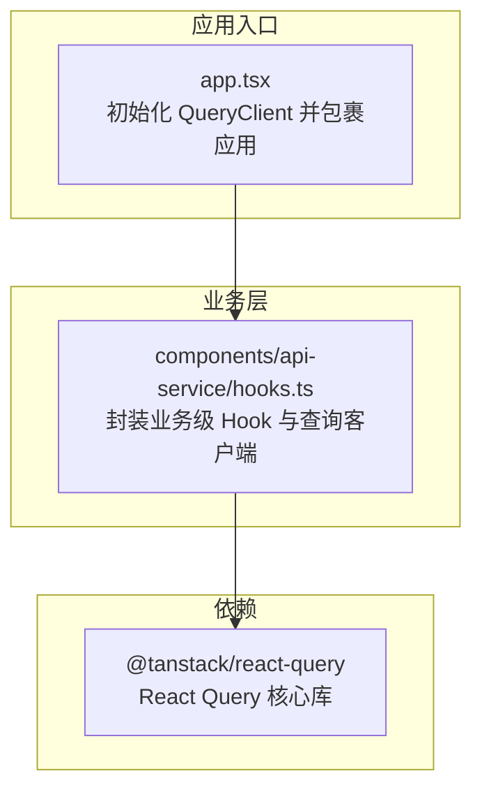
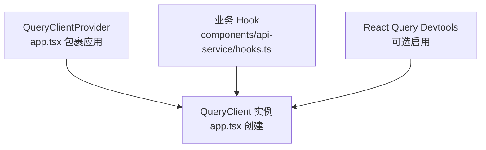
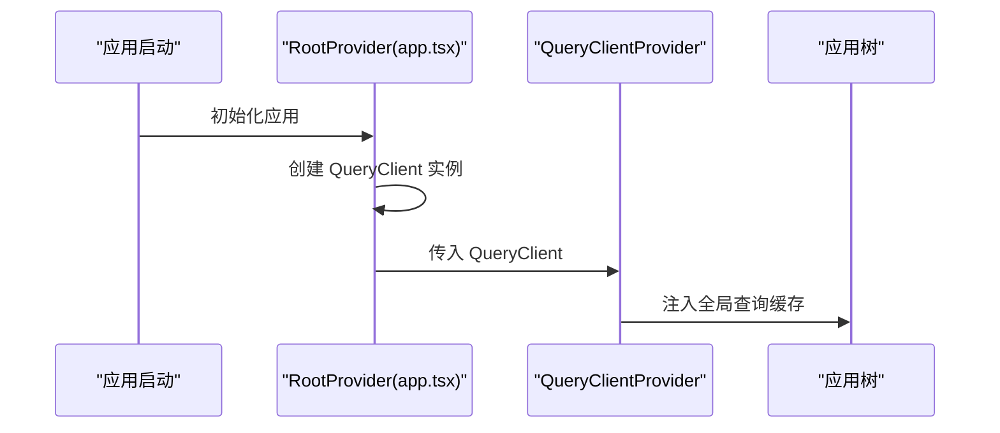
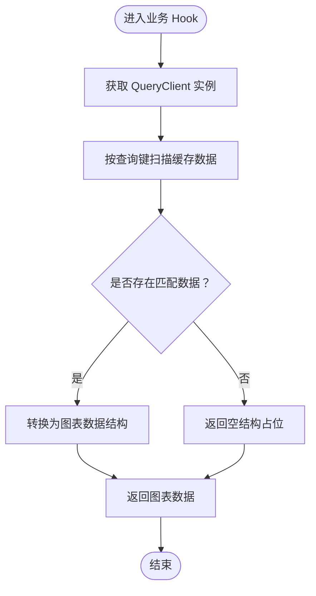
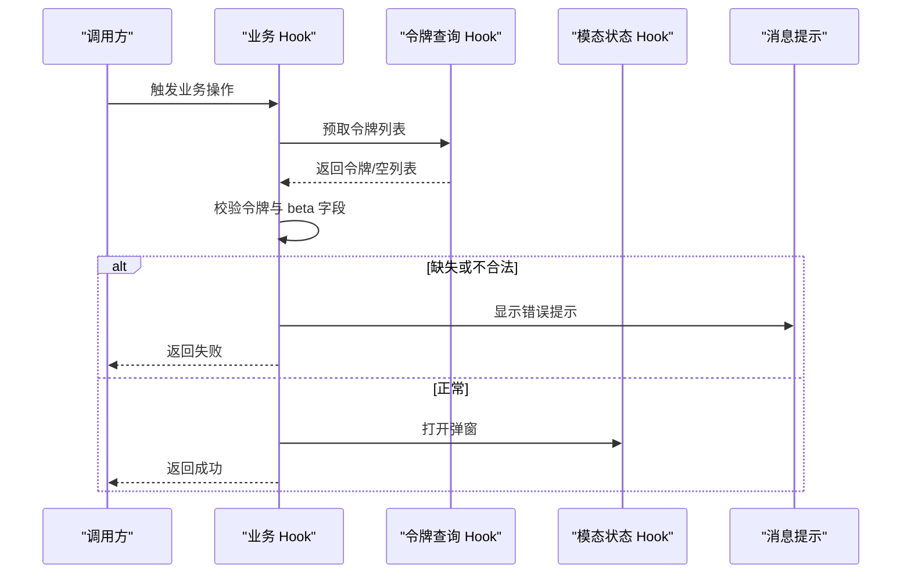
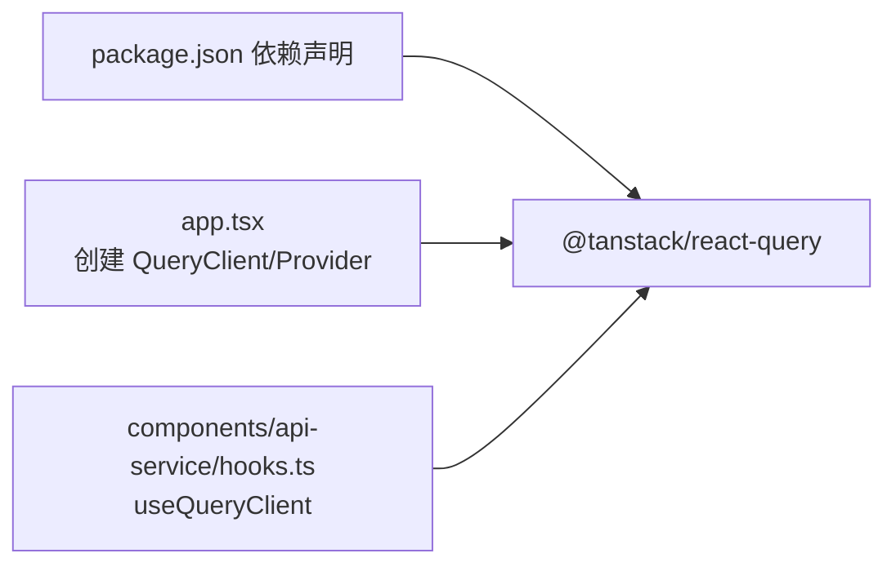

# 异步状态处理

<cite>
**本文引用的文件**
- [app.tsx](file://web/src/app.tsx)
- [hooks.ts](file://web/src/components/api-service/hooks.ts)
- [package.json](file://web/package.json)
</cite>

## 目录
1. [引言](#引言)
2. [项目结构](#项目结构)
3. [核心组件](#核心组件)
4. [架构总览](#架构总览)
5. [详细组件分析](#详细组件分析)
6. [依赖分析](#依赖分析)
7. [性能考虑](#性能考虑)
8. [故障排查指南](#故障排查指南)
9. [结论](#结论)
10. [附录](#附录)

## 引言
本技术指南聚焦于 RAGFlow 前端的异步状态管理模式，系统性阐述请求状态、加载状态与错误状态的统一处理机制；深入解析 React Query 在项目中的应用，包括 QueryClient 配置、缓存策略、数据预取与乐观更新等高级特性；总结自定义 Hook 的设计模式（如 use-chat-request、use-document-request 等）的参数配置、返回值结构与错误处理机制；并提供异步状态生命周期管理、并发请求处理策略以及性能优化技巧（请求去重、缓存失效策略等）。文档以仓库中已存在的实现为依据，结合可视化图示帮助读者快速理解与落地。

## 项目结构
RAGFlow 前端基于 Vite + React + TypeScript 构建，并通过 @tanstack/react-query 提供统一的异步状态管理能力。应用入口在根组件中初始化 QueryClient 并包裹整个应用树，确保全局可用的查询缓存与状态同步能力。

图表来源
- [app.tsx:80](file://web/src/app.tsx#L80)
- [app.tsx:131-139](file://web/src/app.tsx#L131-L139)
- [hooks.ts:13](file://web/src/components/api-service/hooks.ts#L13)
- [package.json:63](file://web/package.json#L63)

章节来源
- [app.tsx:1-162](file://web/src/app.tsx#L1-L162)
- [package.json:1-195](file://web/package.json#L1-L195)

## 核心组件
- QueryClient 全局实例：在应用入口创建并注入 Provider，为后续各页面与组件提供统一的缓存与状态管理能力。
- 组件层 Hook 封装：在业务组件中通过 useQueryClient 访问缓存，执行数据预取、读取缓存、触发无效化与乐观更新等操作。
- 业务 Hook 聚合：将多个查询与变更逻辑聚合到业务级 Hook 中，统一处理加载、错误与交互反馈。

章节来源
- [app.tsx:80](file://web/src/app.tsx#L80)
- [app.tsx:131-139](file://web/src/app.tsx#L131-L139)
- [hooks.ts:13](file://web/src/components/api-service/hooks.ts#L13)

## 架构总览
React Query 在 RAGFlow 前端扮演“全局状态中枢”的角色：应用启动时创建 QueryClient，组件通过 useQueryClient 获取实例，进行查询、缓存、预取与失效；同时通过 React Query Devtools 可选地辅助调试。

图表来源
- [app.tsx:80](file://web/src/app.tsx#L80)
- [app.tsx:131-139](file://web/src/app.tsx#L131-L139)
- [hooks.ts:13](file://web/src/components/api-service/hooks.ts#L13)

## 详细组件分析

### QueryClient 初始化与 Provider 注入
- 在应用入口创建 QueryClient 实例，并通过 QueryClientProvider 将其注入到整个应用树中，保证全局一致的缓存与状态行为。
- 应用层还集成了主题、国际化、路由等上下文，QueryClientProvider 位于主题 Provider 内部，确保 UI 与状态同步。

图表来源
- [app.tsx:80](file://web/src/app.tsx#L80)
- [app.tsx:131-139](file://web/src/app.tsx#L131-L139)

章节来源
- [app.tsx:80](file://web/src/app.tsx#L80)
- [app.tsx:131-139](file://web/src/app.tsx#L131-L139)

### 使用 useQueryClient 进行缓存读写与查询
- 在业务组件中通过 useQueryClient 获取缓存实例，实现：
  - 读取特定查询键的缓存数据
  - 查询键范围扫描与聚合
  - 触发查询失效与重新获取
- 示例场景：根据查询键获取统计数据集合，转换为图表所需格式。

图表来源
- [hooks.ts:47-62](file://web/src/components/api-service/hooks.ts#L47-L62)

章节来源
- [hooks.ts:47-62](file://web/src/components/api-service/hooks.ts#L47-L62)

### 业务 Hook 设计模式与错误处理
- 统一加载与错误提示：在业务 Hook 中组合查询 Hook 与本地状态，集中处理 loading、error 与用户提示。
- 条件校验与前置请求：在执行关键操作前，先拉取必要配置或令牌列表，若缺失则弹出错误提示并阻断后续流程。
- 模态框控制：通过统一的模态状态 Hook 控制弹窗显示/隐藏，配合前置校验决定是否展示。

图表来源
- [hooks.ts:82-120](file://web/src/components/api-service/hooks.ts#L82-L120)
- [hooks.ts:122-145](file://web/src/components/api-service/hooks.ts#L122-L145)

章节来源
- [hooks.ts:82-120](file://web/src/components/api-service/hooks.ts#L82-L120)
- [hooks.ts:122-145](file://web/src/components/api-service/hooks.ts#L122-L145)

### 自定义 Hook 的参数、返回值与错误处理
- 参数配置
  - 依赖键：通过查询键（queryKey）与查询过滤器（queryKeyRegex）实现精确或范围匹配。
  - 选项：可结合查询配置（如 staleTime、gcTime、refetch 策略）控制缓存生命周期与刷新行为。
- 返回值结构
  - 数据：查询结果对象，包含 data、error、isLoading、isFetching 等状态字段。
  - 方法：如 invalidateQueries、setQueryData、setQueriesData 等用于主动更新缓存。
- 错误处理机制
  - 统一错误提示：在业务 Hook 中对空列表、缺失字段等情况进行用户可见的错误提示。
  - 失败回退：当前置校验失败时，直接中断流程并返回失败状态，避免无意义的后续请求。

章节来源
- [hooks.ts:13](file://web/src/components/api-service/hooks.ts#L13)
- [hooks.ts:82-120](file://web/src/components/api-service/hooks.ts#L82-L120)

### 异步状态生命周期管理
- 请求发起：组件触发查询或变更操作，QueryClient 记录请求状态与缓存。
- 数据缓存：首次请求后缓存数据；后续相同查询键的请求优先命中缓存。
- 状态更新：通过 setQueryData/setQueriesData 或 invalidateQueries 主动更新缓存或触发重新获取。
- 错误恢复：捕获错误并提供重试、降级或提示，避免 UI 卡死。

章节来源
- [hooks.ts:47-62](file://web/src/components/api-service/hooks.ts#L47-L62)
- [hooks.ts:13](file://web/src/components/api-service/hooks.ts#L13)

### 并发请求处理与竞态避免
- 请求去重：通过唯一查询键与缓存命中策略，避免重复请求同一资源。
- 并发合并：对同一查询键的并发请求，React Query 默认复用底层 Promise，减少重复网络请求。
- 顺序控制：在业务 Hook 中对关键操作进行前置校验与顺序化处理，避免竞态条件。

章节来源
- [hooks.ts:82-120](file://web/src/components/api-service/hooks.ts#L82-L120)

### 性能优化技巧
- 请求去重：合理设计查询键，确保相同输入产生相同键，提升缓存命中率。
- 缓存失效策略：对写操作后使用 invalidateQueries 或定向失效，降低全量刷新成本。
- 懒加载与预取：仅在需要时发起请求，必要时使用 prefetchQuery 提前填充缓存。
- 分页与增量：对长列表采用分页或增量加载，避免一次性渲染大量数据。

章节来源
- [hooks.ts:47-62](file://web/src/components/api-service/hooks.ts#L47-L62)
- [hooks.ts:13](file://web/src/components/api-service/hooks.ts#L13)

## 依赖分析
- React Query 版本：项目依赖 @tanstack/react-query，版本号在 package.json 中声明。
- 依赖关系：应用入口引入 QueryClient 与 Provider，业务组件通过 useQueryClient 访问缓存；React Query Devtools 可选集成。

图表来源
- [package.json:63](file://web/package.json#L63)
- [app.tsx:4](file://web/src/app.tsx#L4)
- [app.tsx:80](file://web/src/app.tsx#L80)
- [hooks.ts:13](file://web/src/components/api-service/hooks.ts#L13)

章节来源
- [package.json:1-195](file://web/package.json#L1-L195)
- [app.tsx:1-162](file://web/src/app.tsx#L1-L162)
- [hooks.ts:1-146](file://web/src/components/api-service/hooks.ts#L1-L146)

## 性能考虑
- 合理设置缓存生命周期：通过 staleTime/gcTime 控制缓存新鲜度与内存占用。
- 精准失效：使用查询键精确失效，避免不必要的全量刷新。
- 预取与懒加载：在路由切换或弹窗打开前预取关键数据，减少首屏等待。
- 并发合并：利用 React Query 的并发合并能力，避免重复请求。

## 故障排查指南
- 查询未命中：确认查询键是否一致，是否被错误失效或清理。
- 加载状态异常：检查查询配置与 refetch 策略，确保不会过度刷新。
- 错误提示缺失：在业务 Hook 中补充错误分支与用户提示逻辑。
- 缓存污染：使用定向失效或手动更新，避免全局刷新导致的性能问题。

章节来源
- [hooks.ts:82-120](file://web/src/components/api-service/hooks.ts#L82-L120)
- [hooks.ts:122-145](file://web/src/components/api-service/hooks.ts#L122-L145)

## 结论
RAGFlow 前端通过在应用入口创建并注入 QueryClient，实现了统一的异步状态管理。业务组件通过 useQueryClient 进行缓存读写、查询扫描与失效控制，结合自定义 Hook 的设计模式，完成加载、错误与交互的统一处理。建议在后续开发中进一步完善查询配置、预取策略与缓存失效规则，持续优化用户体验与性能表现。

## 附录
- 相关实现参考路径
  - QueryClient 初始化与 Provider 注入：[app.tsx:80](file://web/src/app.tsx#L80)、[app.tsx:131-139](file://web/src/app.tsx#L131-L139)
  - 使用 useQueryClient 进行缓存读写与查询：[hooks.ts:13](file://web/src/components/api-service/hooks.ts#L13)、[hooks.ts:47-62](file://web/src/components/api-service/hooks.ts#L47-L62)
  - 业务 Hook 设计与错误处理：[hooks.ts:82-120](file://web/src/components/api-service/hooks.ts#L82-L120)、[hooks.ts:122-145](file://web/src/components/api-service/hooks.ts#L122-L145)
  - 依赖声明（React Query）：[package.json:63](file://web/package.json#L63)