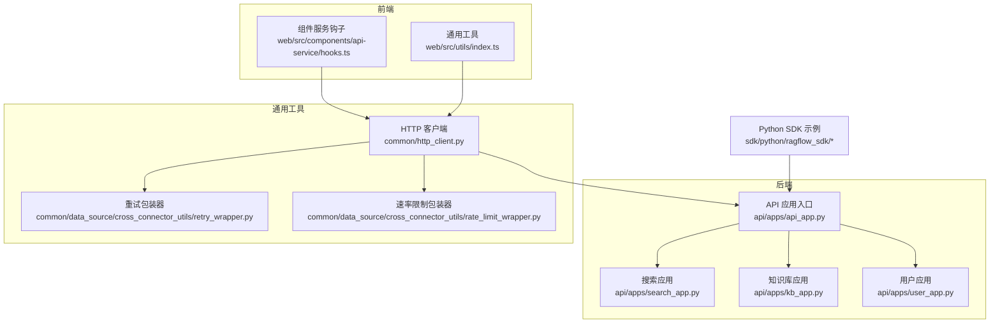
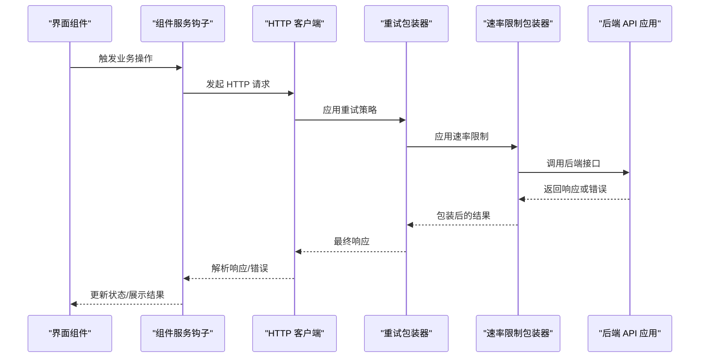
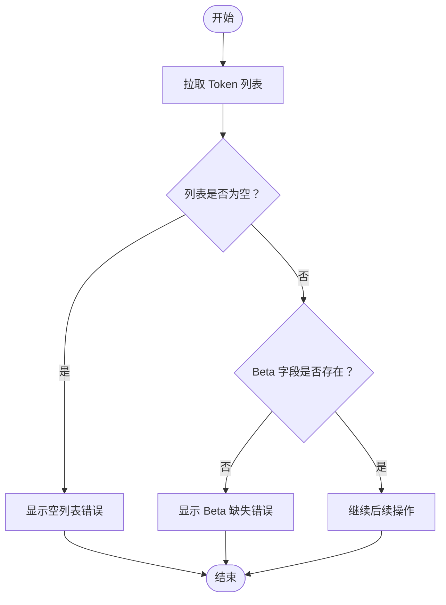
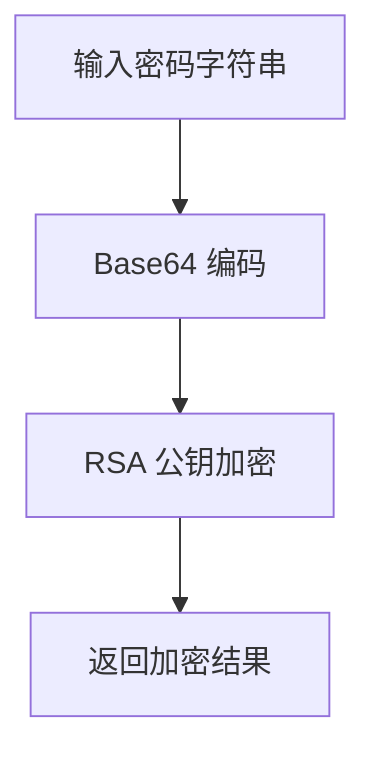
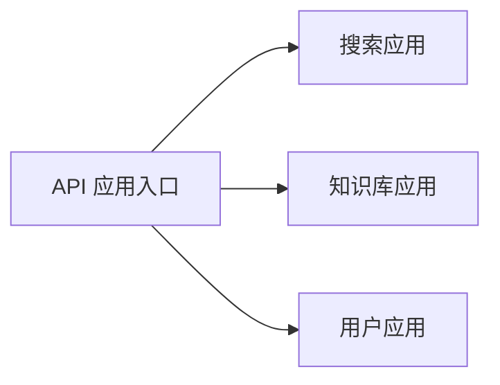
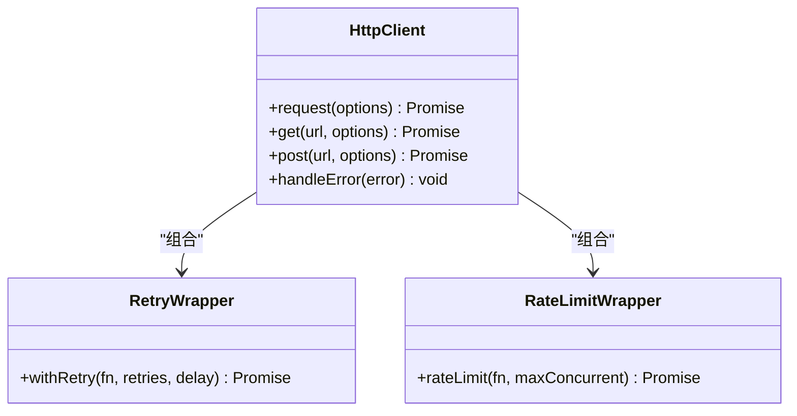
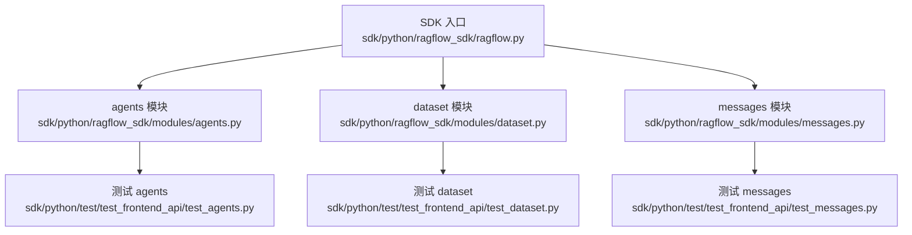
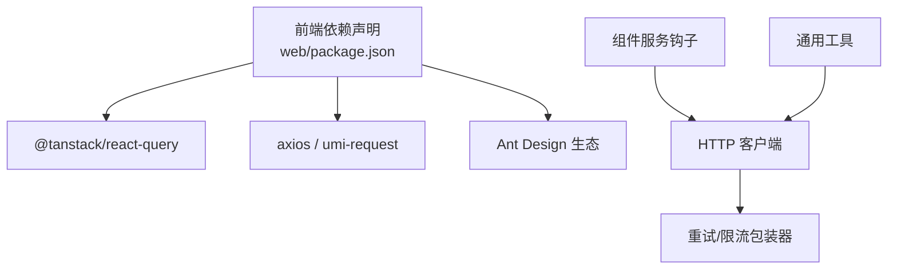

# 服务层设计

<cite>
**本文引用的文件**
- [web/package.json](file://web/package.json)
- [web/src/components/api-service/hooks.ts](file://web/src/components/api-service/hooks.ts)
- [web/src/utils/index.ts](file://web/src/utils/index.ts)
- [api/apps/api_app.py](file://api/apps/api_app.py)
- [api/apps/search_app.py](file://api/apps/search_app.py)
- [api/apps/kb_app.py](file://api/apps/kb_app.py)
- [api/apps/user_app.py](file://api/apps/user_app.py)
- [api/db/services/search_service.py](file://api/db/services/search_service.py)
- [api/db/services/knowledgebase_service.py](file://api/db/services/knowledgebase_service.py)
- [api/db/services/user_service.py](file://api/db/services/user_service.py)
- [common/http_client.py](file://common/http_client.py)
- [common/data_source/cross_connector_utils/retry_wrapper.py](file://common/data_source/cross_connector_utils/retry_wrapper.py)
- [common/data_source/cross_connector_utils/rate_limit_wrapper.py](file://common/data_source/cross_connector_utils/rate_limit_wrapper.py)
- [sdk/python/ragflow_sdk/ragflow.py](file://sdk/python/ragflow_sdk/ragflow.py)
- [sdk/python/ragflow_sdk/modules/agents.py](file://sdk/python/ragflow_sdk/modules/agents.py)
- [sdk/python/ragflow_sdk/modules/dataset.py](file://sdk/python/ragflow_sdk/modules/dataset.py)
- [sdk/python/ragflow_sdk/modules/messages.py](file://sdk/python/ragflow_sdk/modules/messages.py)
- [sdk/python/test/test_frontend_api/test_agents.py](file://sdk/python/test/test_frontend_api/test_agents.py)
- [sdk/python/test/test_frontend_api/test_dataset.py](file://sdk/python/test/test_frontend_api/test_dataset.py)
- [sdk/python/test/test_frontend_api/test_messages.py](file://sdk/python/test/test_frontend_api/test_messages.py)
</cite>

## 目录
1. [引言](#引言)
2. [项目结构](#项目结构)
3. [核心组件](#核心组件)
4. [架构总览](#架构总览)
5. [详细组件分析](#详细组件分析)
6. [依赖分析](#依赖分析)
7. [性能考虑](#性能考虑)
8. [故障排查指南](#故障排查指南)
9. [结论](#结论)
10. [附录](#附录)

## 引言
本文件面向前端服务层设计，系统性梳理 RAGFlow 前端在“服务层”的架构与实现要点，重点覆盖以下方面：
- 服务抽象与职责划分：如何通过服务层封装后端 API，形成稳定的调用契约
- API 封装与交互模式：HTTP 请求封装、响应处理、错误传递与统一处理
- 错误处理与重试机制：错误分类、降级策略、指数退避与速率限制
- 配置管理：基础 URL、认证信息、请求头、超时与并发控制
- 扩展方法：新增服务模块、修改既有服务的实现路径
- 测试策略与调试技巧：单元测试、集成测试与本地调试建议

本设计文档以“前端服务层”为核心视角，结合后端 API 层与通用工具层（HTTP 客户端、重试与限流包装器）进行跨层说明，帮助读者快速理解并高效扩展服务层能力。

## 项目结构
前端服务层位于 web/src 目录下，主要由“组件服务钩子”和“通用工具”组成；同时，后端提供多条业务 API（如搜索、知识库、用户等），并通过统一的 HTTP 客户端与重试/限流机制保障稳定性。SDK 提供 Python 端的调用示例，便于验证接口行为与测试。

图表来源
- [web/src/components/api-service/hooks.ts:1-146](file://web/src/components/api-service/hooks.ts#L1-L146)
- [web/src/utils/index.ts:1-31](file://web/src/utils/index.ts#L1-L31)
- [api/apps/api_app.py](file://api/apps/api_app.py)
- [api/apps/search_app.py](file://api/apps/search_app.py)
- [api/apps/kb_app.py](file://api/apps/kb_app.py)
- [api/apps/user_app.py](file://api/apps/user_app.py)
- [common/http_client.py](file://common/http_client.py)
- [common/data_source/cross_connector_utils/retry_wrapper.py](file://common/data_source/cross_connector_utils/retry_wrapper.py)
- [common/data_source/cross_connector_utils/rate_limit_wrapper.py](file://common/data_source/cross_connector_utils/rate_limit_wrapper.py)
- [sdk/python/ragflow_sdk/ragflow.py](file://sdk/python/ragflow_sdk/ragflow.py)

章节来源
- [web/package.json:1-195](file://web/package.json#L1-L195)
- [web/src/components/api-service/hooks.ts:1-146](file://web/src/components/api-service/hooks.ts#L1-L146)
- [web/src/utils/index.ts:1-31](file://web/src/utils/index.ts#L1-L31)
- [api/apps/api_app.py](file://api/apps/api_app.py)
- [api/apps/search_app.py](file://api/apps/search_app.py)
- [api/apps/kb_app.py](file://api/apps/kb_app.py)
- [api/apps/user_app.py](file://api/apps/user_app.py)
- [common/http_client.py](file://common/http_client.py)
- [common/data_source/cross_connector_utils/retry_wrapper.py](file://common/data_source/cross_connector_utils/retry_wrapper.py)
- [common/data_source/cross_connector_utils/rate_limit_wrapper.py](file://common/data_source/cross_connector_utils/rate_limit_wrapper.py)
- [sdk/python/ragflow_sdk/ragflow.py](file://sdk/python/ragflow_sdk/ragflow.py)

## 核心组件
- 组件服务钩子：封装具体业务的请求逻辑与状态管理，例如系统 Token 的增删查、嵌入弹窗的触发流程等，统一对外暴露可复用的 Hook 接口。
- 通用工具：提供通用函数（如 RSA 加密、文件扩展名解析等），为服务层提供基础能力支撑。
- 后端 API 应用：按领域拆分的应用入口（搜索、知识库、用户等），统一对外提供 REST 接口。
- 通用 HTTP 客户端与中间件：封装 HTTP 请求、统一错误处理、重试与速率限制等横切关注点。
- SDK 示例：提供 Python 端调用样例，便于联调与回归测试。

章节来源
- [web/src/components/api-service/hooks.ts:17-41](file://web/src/components/api-service/hooks.ts#L17-L41)
- [web/src/utils/index.ts:14-22](file://web/src/utils/index.ts#L14-L22)
- [api/apps/search_app.py](file://api/apps/search_app.py)
- [api/apps/kb_app.py](file://api/apps/kb_app.py)
- [api/apps/user_app.py](file://api/apps/user_app.py)
- [common/http_client.py](file://common/http_client.py)
- [sdk/python/ragflow_sdk/ragflow.py](file://sdk/python/ragflow_sdk/ragflow.py)

## 架构总览
前端服务层通过组件服务钩子对接后端 API 应用，底层依赖通用 HTTP 客户端与重试/限流包装器，确保请求的可靠性与稳定性。SDK 作为外部集成参考，验证接口行为与参数约定。

图表来源
- [web/src/components/api-service/hooks.ts:100-113](file://web/src/components/api-service/hooks.ts#L100-L113)
- [common/http_client.py](file://common/http_client.py)
- [common/data_source/cross_connector_utils/retry_wrapper.py](file://common/data_source/cross_connector_utils/retry_wrapper.py)
- [common/data_source/cross_connector_utils/rate_limit_wrapper.py](file://common/data_source/cross_connector_utils/rate_limit_wrapper.py)
- [api/apps/api_app.py](file://api/apps/api_app.py)

## 详细组件分析

### 组件服务钩子（API 封装与交互）
- 职责
  - 将业务操作（如系统 Token 的创建、删除、列表查询）封装为可复用的 Hook，统一处理加载态、错误提示与后续动作。
  - 在关键流程前进行前置校验（如 Token 列表为空、Beta 字段缺失），并在 UI 中给出明确提示。
  - 与消息组件配合，向用户反馈操作结果与异常信息。
- 关键流程
  - 创建 Token：在确认对话框后调用创建接口，并刷新列表。
  - 删除 Token：二次确认后执行删除。
  - 嵌入弹窗：在拉取 Token 列表并完成前置校验后打开弹窗。
- 错误处理
  - 当 Token 列表为空或 Beta 字段缺失时，使用国际化消息提示用户。
  - 使用统一的消息组件展示错误，保证用户体验一致。

图表来源
- [web/src/components/api-service/hooks.ts:82-119](file://web/src/components/api-service/hooks.ts#L82-L119)

章节来源
- [web/src/components/api-service/hooks.ts:17-41](file://web/src/components/api-service/hooks.ts#L17-L41)
- [web/src/components/api-service/hooks.ts:82-119](file://web/src/components/api-service/hooks.ts#L82-L119)
- [web/src/components/api-service/hooks.ts:122-145](file://web/src/components/api-service/hooks.ts#L122-L145)

### 通用工具（加密与文件处理）
- RSA 加密：对密码进行 Base64 编码后再使用公钥加密，避免明文传输。
- 文件扩展名解析：从文件名中提取小写的扩展名，用于类型判断与处理。

图表来源
- [web/src/utils/index.ts:14-22](file://web/src/utils/index.ts#L14-L22)

章节来源
- [web/src/utils/index.ts:14-22](file://web/src/utils/index.ts#L14-L22)
- [web/src/utils/index.ts:29-31](file://web/src/utils/index.ts#L29-L31)

### 后端 API 应用（按领域拆分）
- 搜索应用：提供检索相关接口，支持关键词匹配、排序与过滤。
- 知识库应用：提供知识库的 CRUD 与关联操作。
- 用户应用：提供用户信息、权限与系统配置相关接口。
- API 应用入口：统一路由与鉴权，协调各子应用。

图表来源
- [api/apps/api_app.py](file://api/apps/api_app.py)
- [api/apps/search_app.py](file://api/apps/search_app.py)
- [api/apps/kb_app.py](file://api/apps/kb_app.py)
- [api/apps/user_app.py](file://api/apps/user_app.py)

章节来源
- [api/apps/api_app.py](file://api/apps/api_app.py)
- [api/apps/search_app.py](file://api/apps/search_app.py)
- [api/apps/kb_app.py](file://api/apps/kb_app.py)
- [api/apps/user_app.py](file://api/apps/user_app.py)

### 通用 HTTP 客户端与中间件
- HTTP 客户端：封装请求发送、响应解析、错误拦截与统一处理。
- 重试包装器：基于指数退避与最大重试次数策略，自动重试临时性失败。
- 速率限制包装器：控制并发与频率，避免触发后端限流或过载。

图表来源
- [common/http_client.py](file://common/http_client.py)
- [common/data_source/cross_connector_utils/retry_wrapper.py](file://common/data_source/cross_connector_utils/retry_wrapper.py)
- [common/data_source/cross_connector_utils/rate_limit_wrapper.py](file://common/data_source/cross_connector_utils/rate_limit_wrapper.py)

章节来源
- [common/http_client.py](file://common/http_client.py)
- [common/data_source/cross_connector_utils/retry_wrapper.py](file://common/data_source/cross_connector_utils/retry_wrapper.py)
- [common/data_source/cross_connector_utils/rate_limit_wrapper.py](file://common/data_source/cross_connector_utils/rate_limit_wrapper.py)

### SDK 示例（Python 端）
- SDK 提供统一入口与模块化封装，便于在外部环境快速集成。
- 示例模块：agents、dataset、messages 等，分别对应不同业务域的调用方式。
- 测试用例：通过前端 API 测试套件验证 SDK 行为与接口一致性。

图表来源
- [sdk/python/ragflow_sdk/ragflow.py](file://sdk/python/ragflow_sdk/ragflow.py)
- [sdk/python/ragflow_sdk/modules/agents.py](file://sdk/python/ragflow_sdk/modules/agents.py)
- [sdk/python/ragflow_sdk/modules/dataset.py](file://sdk/python/ragflow_sdk/modules/dataset.py)
- [sdk/python/ragflow_sdk/modules/messages.py](file://sdk/python/ragflow_sdk/modules/messages.py)
- [sdk/python/test/test_frontend_api/test_agents.py](file://sdk/python/test/test_frontend_api/test_agents.py)
- [sdk/python/test/test_frontend_api/test_dataset.py](file://sdk/python/test/test_frontend_api/test_dataset.py)
- [sdk/python/test/test_frontend_api/test_messages.py](file://sdk/python/test/test_frontend_api/test_messages.py)

章节来源
- [sdk/python/ragflow_sdk/ragflow.py](file://sdk/python/ragflow_sdk/ragflow.py)
- [sdk/python/ragflow_sdk/modules/agents.py](file://sdk/python/ragflow_sdk/modules/agents.py)
- [sdk/python/ragflow_sdk/modules/dataset.py](file://sdk/python/ragflow_sdk/modules/dataset.py)
- [sdk/python/ragflow_sdk/modules/messages.py](file://sdk/python/ragflow_sdk/modules/messages.py)
- [sdk/python/test/test_frontend_api/test_agents.py](file://sdk/python/test/test_frontend_api/test_agents.py)
- [sdk/python/test/test_frontend_api/test_dataset.py](file://sdk/python/test/test_frontend_api/test_dataset.py)
- [sdk/python/test/test_frontend_api/test_messages.py](file://sdk/python/test/test_frontend_api/test_messages.py)

## 依赖分析
- 前端依赖：React Query（缓存与状态）、Axios/Umi Request（HTTP 客户端）、Ant Design 生态等。
- 服务层耦合：组件服务钩子仅依赖通用 HTTP 客户端与 UI 工具，保持低耦合高内聚。
- 后端耦合：API 应用按领域拆分，降低单点复杂度；服务层（如 search_service、knowledgebase_service、user_service）进一步细化业务逻辑。

图表来源
- [web/package.json:25-132](file://web/package.json#L25-L132)
- [web/src/components/api-service/hooks.ts:1-146](file://web/src/components/api-service/hooks.ts#L1-L146)
- [web/src/utils/index.ts:1-31](file://web/src/utils/index.ts#L1-L31)
- [common/http_client.py](file://common/http_client.py)
- [common/data_source/cross_connector_utils/retry_wrapper.py](file://common/data_source/cross_connector_utils/retry_wrapper.py)
- [common/data_source/cross_connector_utils/rate_limit_wrapper.py](file://common/data_source/cross_connector_utils/rate_limit_wrapper.py)

章节来源
- [web/package.json:25-132](file://web/package.json#L25-L132)
- [web/src/components/api-service/hooks.ts:1-146](file://web/src/components/api-service/hooks.ts#L1-L146)
- [web/src/utils/index.ts:1-31](file://web/src/utils/index.ts#L1-L31)
- [common/http_client.py](file://common/http_client.py)
- [common/data_source/cross_connector_utils/retry_wrapper.py](file://common/data_source/cross_connector_utils/retry_wrapper.py)
- [common/data_source/cross_connector_utils/rate_limit_wrapper.py](file://common/data_source/cross_connector_utils/rate_limit_wrapper.py)

## 性能考虑
- 请求缓存：利用 React Query 的缓存与预取能力，减少重复请求与网络开销。
- 并发控制：通过速率限制包装器控制并发数，避免后端压力过大。
- 重试策略：指数退避与最大重试次数，平衡成功率与资源消耗。
- 超时与取消：为长耗时请求设置合理超时与取消机制，提升交互体验。
- 响应压缩与分页：后端接口支持分页与压缩，前端按需加载，降低首屏压力。

## 故障排查指南
- 常见错误类型
  - 认证失败：检查 Token 列表是否为空、Beta 字段是否缺失。
  - 网络异常：查看重试日志与错误提示，确认网络连通性。
  - 速率限制：观察限流包装器输出，适当降低并发或增加等待时间。
- 调试技巧
  - 使用 React DevTools 与 React Query Devtools 定位缓存与状态问题。
  - 在组件服务钩子中加入日志输出，记录请求参数与响应状态。
  - 通过 SDK 示例快速复现问题，缩小定位范围。
- 回归测试
  - 基于 SDK 的测试用例，验证接口变更对前端的影响。
  - 对关键流程（创建、删除、列表查询）编写端到端测试。

章节来源
- [web/src/components/api-service/hooks.ts:64-80](file://web/src/components/api-service/hooks.ts#L64-L80)
- [web/src/components/api-service/hooks.ts:82-119](file://web/src/components/api-service/hooks.ts#L82-L119)
- [sdk/python/test/test_frontend_api/test_agents.py](file://sdk/python/test/test_frontend_api/test_agents.py)
- [sdk/python/test/test_frontend_api/test_dataset.py](file://sdk/python/test/test_frontend_api/test_dataset.py)
- [sdk/python/test/test_frontend_api/test_messages.py](file://sdk/python/test/test_frontend_api/test_messages.py)

## 结论
前端服务层通过“组件服务钩子 + 通用工具 + HTTP 客户端 + 重试/限流中间件”的组合，实现了稳定、可扩展且易维护的 API 封装。后端按领域拆分的应用与服务层进一步明确了职责边界。借助 SDK 与测试用例，可以高效验证与扩展服务层能力，满足复杂业务场景下的需求。

## 附录
- 新增服务模块步骤
  - 在组件服务钩子中新增对应 Hook，封装请求与状态。
  - 在通用工具中补充必要的工具函数（如加密、格式化）。
  - 在后端新增对应 API 应用与服务层，遵循现有命名与目录规范。
  - 编写 SDK 示例与测试用例，确保接口一致性。
- 修改现有服务实现
  - 优先通过 Hook 参数化与配置化调整行为，避免破坏既有接口。
  - 在 HTTP 客户端层面统一处理错误与重试，减少重复代码。
  - 通过测试用例验证修改影响面，确保兼容性。