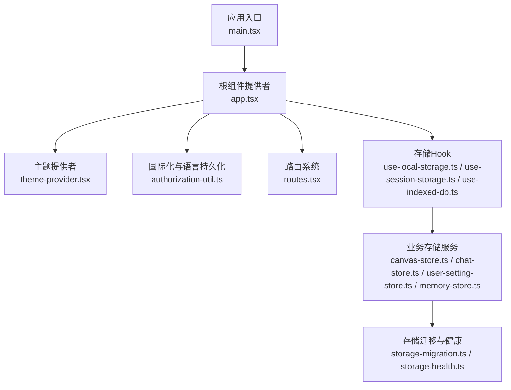
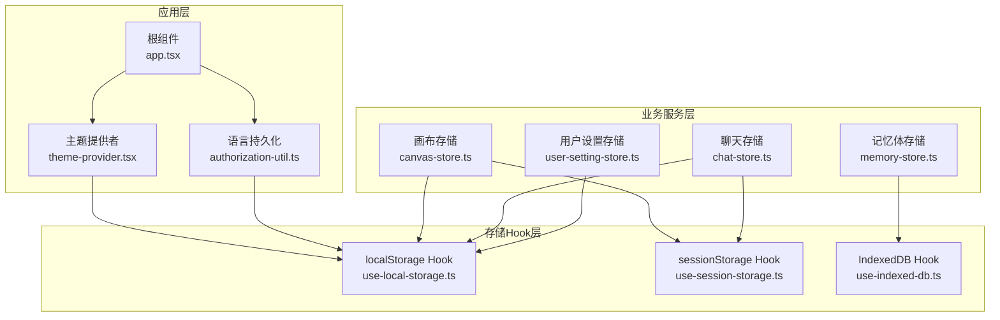
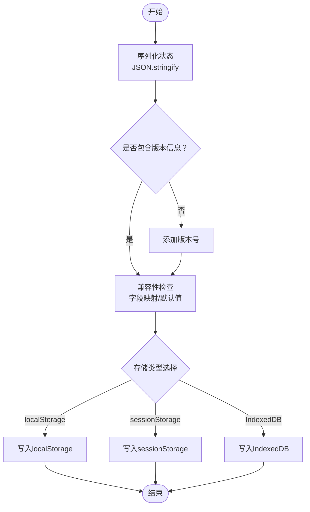
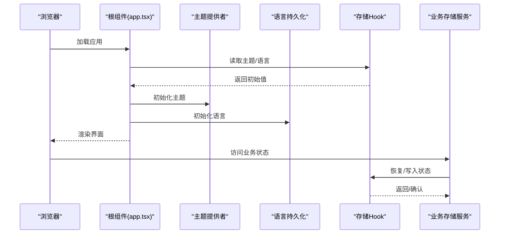
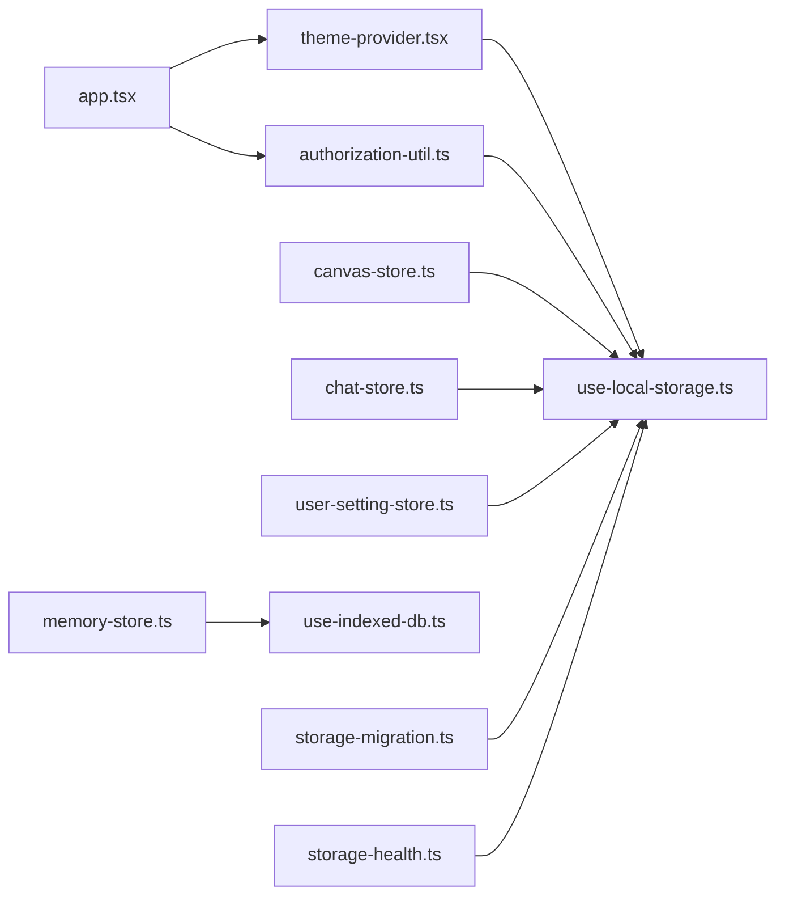

# 状态持久化

<cite>
**本文引用的文件**
- [app.tsx](file://web/src/app.tsx)
- [main.tsx](file://web/src/main.tsx)
- [routes.tsx](file://web/src/routes.tsx)
- [theme-provider.tsx](file://web/src/components/theme-provider.tsx)
- [authorization-util.ts](file://web/src/utils/authorization-util.ts)
- [use-local-storage.ts](file://web/src/hooks/use-local-storage.ts)
- [use-session-storage.ts](file://web/src/hooks/use-session-storage.ts)
- [use-indexed-db.ts](file://web/src/hooks/use-indexed-db.ts)
- [canvas-store.ts](file://web/src/services/canvas-store.ts)
- [chat-store.ts](file://web/src/services/chat-store.ts)
- [user-setting-store.ts](file://web/src/services/user-setting-store.ts)
- [memory-store.ts](file://web/src/services/memory-store.ts)
- [storage-migration.ts](file://web/src/utils/storage-migration.ts)
- [storage-health.ts](file://web/src/utils/storage-health.ts)
</cite>

## 目录
1. [简介](#简介)
2. [项目结构](#项目结构)
3. [核心组件](#核心组件)
4. [架构总览](#架构总览)
5. [详细组件分析](#详细组件分析)
6. [依赖关系分析](#依赖关系分析)
7. [性能考量](#性能考量)
8. [故障排查指南](#故障排查指南)
9. [结论](#结论)
10. [附录](#附录)

## 简介
本技术指南聚焦于RAGFlow前端的状态持久化策略与实现方法，覆盖localStorage、sessionStorage、IndexedDB三种存储方案的选择与适用场景；详解状态序列化/反序列化、版本兼容、存储空间限制等关键问题的解决方案；阐述自动保存与手动保存的平衡策略；解释跨页面状态同步（页面刷新、浏览器重启后）的恢复机制；并提供状态清理与迁移、性能优化（存储频率控制、增量更新）等最佳实践。

## 项目结构
RAGFlow前端采用React + Vite构建，状态持久化相关代码主要分布在以下模块：
- 应用根配置与主题/语言持久化：应用启动、国际化与主题在根组件中初始化并持久化
- 路由与页面：路由定义集中于routes.tsx，页面按功能域组织
- 存储Hook与工具：封装localStorage/sessionStorage/IndexedDB的通用Hook与工具函数
- 业务服务层：针对画布、聊天、用户设置、记忆体等业务域的状态持久化服务
- 迁移与健康检查：提供存储迁移与容量/错误监控能力

**图示来源**
- [main.tsx:1-14](file://web/src/main.tsx#L1-L14)
- [app.tsx:84-142](file://web/src/app.tsx#L84-L142)
- [routes.tsx:68-444](file://web/src/routes.tsx#L68-L444)

**章节来源**
- [main.tsx:1-14](file://web/src/main.tsx#L1-L14)
- [app.tsx:84-142](file://web/src/app.tsx#L84-L142)
- [routes.tsx:68-444](file://web/src/routes.tsx#L68-L444)

## 核心组件
- 主题持久化：通过ThemeProvider将主题状态写入localStorage，键名可配置，默认使用"ragflow-ui-theme"
- 语言持久化：通过i18n事件监听语言变更，调用storage工具写入本地语言设置
- 存储Hook体系：
  - use-local-storage：封装localStorage的读写与订阅
  - use-session-storage：封装sessionStorage的读写与订阅
  - use-indexed-db：封装IndexedDB的事务式读写与批量操作
- 业务存储服务：
  - canvas-store：画布编辑器状态持久化
  - chat-store：聊天会话与消息历史持久化
  - user-setting-store：用户偏好设置持久化
  - memory-store：记忆体相关状态持久化
- 迁移与健康：
  - storage-migration：版本升级时的数据结构迁移
  - storage-health：存储容量监控与异常告警

**章节来源**
- [app.tsx:121-142](file://web/src/app.tsx#L121-L142)
- [theme-provider.tsx](file://web/src/components/theme-provider.tsx)
- [authorization-util.ts](file://web/src/utils/authorization-util.ts)
- [use-local-storage.ts](file://web/src/hooks/use-local-storage.ts)
- [use-session-storage.ts](file://web/src/hooks/use-session-storage.ts)
- [use-indexed-db.ts](file://web/src/hooks/use-indexed-db.ts)
- [canvas-store.ts](file://web/src/services/canvas-store.ts)
- [chat-store.ts](file://web/src/services/chat-store.ts)
- [user-setting-store.ts](file://web/src/services/user-setting-store.ts)
- [memory-store.ts](file://web/src/services/memory-store.ts)
- [storage-migration.ts](file://web/src/utils/storage-migration.ts)
- [storage-health.ts](file://web/src/utils/storage-health.ts)

## 架构总览
前端状态持久化采用“Hook抽象 + 业务服务”的分层设计：
- Hook层：统一localStorage/sessionStorage/IndexedDB访问接口，屏蔽底层差异
- 服务层：面向业务域的状态聚合与持久化策略，负责序列化/反序列化、版本兼容、增量更新
- 应用层：根组件负责全局状态（主题、语言）的初始化与持久化

**图示来源**
- [app.tsx:84-142](file://web/src/app.tsx#L84-L142)
- [theme-provider.tsx](file://web/src/components/theme-provider.tsx)
- [authorization-util.ts](file://web/src/utils/authorization-util.ts)
- [use-local-storage.ts](file://web/src/hooks/use-local-storage.ts)
- [use-session-storage.ts](file://web/src/hooks/use-session-storage.ts)
- [use-indexed-db.ts](file://web/src/hooks/use-indexed-db.ts)
- [canvas-store.ts](file://web/src/services/canvas-store.ts)
- [chat-store.ts](file://web/src/services/chat-store.ts)
- [user-setting-store.ts](file://web/src/services/user-setting-store.ts)
- [memory-store.ts](file://web/src/services/memory-store.ts)

## 详细组件分析

### localStorage与sessionStorage选择策略
- localStorage适用于：
  - 长期稳定的用户偏好（主题、语言）
  - 跨会话共享的轻量数据（如画布草稿）
- sessionStorage适用于：
  - 临时会话数据（如未保存的表单草稿）
  - 不希望跨标签页共享的状态
- 选择原则：
  - 数据体量小且需要长期保存 → localStorage
  - 数据仅限当前会话使用 → sessionStorage
  - 大体量或复杂对象 → IndexedDB

**章节来源**
- [use-local-storage.ts](file://web/src/hooks/use-local-storage.ts)
- [use-session-storage.ts](file://web/src/hooks/use-session-storage.ts)
- [canvas-store.ts](file://web/src/services/canvas-store.ts)

### IndexedDB适用场景与优势
- 适用场景：
  - 大量消息记录、检索结果缓存
  - 结构化查询与索引需求
  - 需要事务一致性与并发控制
- 优势：
  - 容量大、支持复杂数据模型
  - 支持异步事务，不阻塞UI线程
  - 可进行范围查询与复合索引

**章节来源**
- [use-indexed-db.ts](file://web/src/hooks/use-indexed-db.ts)
- [memory-store.ts](file://web/src/services/memory-store.ts)

### 序列化与反序列化处理
- JSON序列化：
  - 使用结构化克隆算法，支持基本类型、Date、ArrayBuffer等
  - 对函数、undefined、Symbol等不可序列化属性需特殊处理
- 版本兼容：
  - 引入版本字段，升级时对旧字段做映射与默认值填充
  - 提供迁移脚本，保证向后兼容
- 存储空间限制：
  - localStorage约5-10MB，超限时降级到sessionStorage或IndexedDB
  - 定期清理无用数据，避免触发配额限制

**图示来源**
- [storage-migration.ts](file://web/src/utils/storage-migration.ts)
- [storage-health.ts](file://web/src/utils/storage-health.ts)

**章节来源**
- [storage-migration.ts](file://web/src/utils/storage-migration.ts)
- [storage-health.ts](file://web/src/utils/storage-health.ts)

### 自动保存与手动保存策略
- 自动保存：
  - 低频、非阻塞的变更（如主题切换、语言选择）可立即持久化
  - 中高频变更（如输入框内容）采用防抖/节流，合并写入
- 手动保存：
  - 关键业务（如画布完成态、聊天归档）提供显式保存按钮
  - 导航离开前提示保存，避免数据丢失
- 平衡点：
  - 用户体验：减少不必要的等待
  - 数据安全：确保关键状态不丢失

**章节来源**
- [canvas-store.ts](file://web/src/services/canvas-store.ts)
- [chat-store.ts](file://web/src/services/chat-store.ts)

### 跨页面状态同步与恢复
- 页面刷新与重启恢复：
  - 在根组件初始化阶段读取localStorage中的主题与语言
  - 路由切换时保持状态一致性，必要时从IndexedDB恢复大量数据
- 同步机制：
  - 使用React Query客户端缓存配合localStorage，实现跨组件状态共享
  - 对于跨标签页共享，可通过BroadcastChannel或Service Worker广播

**图示来源**
- [app.tsx:121-142](file://web/src/app.tsx#L121-L142)
- [routes.tsx:68-444](file://web/src/routes.tsx#L68-L444)

**章节来源**
- [app.tsx:121-142](file://web/src/app.tsx#L121-L142)
- [routes.tsx:68-444](file://web/src/routes.tsx#L68-L444)

### 状态清理与迁移
- 清理策略：
  - 周期性扫描过期数据（如临时草稿、失效缓存）
  - 提供一键清理功能，允许用户主动释放空间
- 迁移策略：
  - 升级时自动检测版本，执行字段重命名、类型转换、默认值注入
  - 迁移失败回滚至原版本，保证稳定性

**章节来源**
- [storage-migration.ts](file://web/src/utils/storage-migration.ts)
- [storage-health.ts](file://web/src/utils/storage-health.ts)

### 性能优化
- 存储频率控制：
  - 防抖/节流：对高频输入进行合并写入
  - 批量写入：累积一定数量后再一次性持久化
- 增量更新：
  - 仅持久化变化的部分，减少IO开销
  - 对大对象采用分片存储或延迟加载
- 缓存与降级：
  - 优先使用localStorage，超限时自动降级到sessionStorage或IndexedDB
  - 监控存储容量，提前预警并清理

**章节来源**
- [use-local-storage.ts](file://web/src/hooks/use-local-storage.ts)
- [use-session-storage.ts](file://web/src/hooks/use-session-storage.ts)
- [use-indexed-db.ts](file://web/src/hooks/use-indexed-db.ts)
- [storage-health.ts](file://web/src/utils/storage-health.ts)

## 依赖关系分析
- 组件耦合：
  - 根组件依赖主题与语言持久化工具
  - 业务服务依赖存储Hook，形成清晰的分层
- 外部依赖：
  - React Query用于状态缓存与同步
  - Day.js用于时间格式化与本地化
- 循环依赖：
  - 通过Hook抽象避免业务服务与根组件之间的循环引用

**图示来源**
- [app.tsx:84-142](file://web/src/app.tsx#L84-L142)
- [theme-provider.tsx](file://web/src/components/theme-provider.tsx)
- [authorization-util.ts](file://web/src/utils/authorization-util.ts)
- [use-local-storage.ts](file://web/src/hooks/use-local-storage.ts)
- [use-indexed-db.ts](file://web/src/hooks/use-indexed-db.ts)
- [canvas-store.ts](file://web/src/services/canvas-store.ts)
- [chat-store.ts](file://web/src/services/chat-store.ts)
- [user-setting-store.ts](file://web/src/services/user-setting-store.ts)
- [memory-store.ts](file://web/src/services/memory-store.ts)
- [storage-migration.ts](file://web/src/utils/storage-migration.ts)
- [storage-health.ts](file://web/src/utils/storage-health.ts)

**章节来源**
- [app.tsx:84-142](file://web/src/app.tsx#L84-L142)
- [routes.tsx:68-444](file://web/src/routes.tsx#L68-L444)

## 性能考量
- 写入频率：
  - 输入类高频写入采用防抖（如500ms），避免频繁IO
  - 业务关键状态采用即时写入，确保可靠性
- 存储容量：
  - 监控localStorage使用率，超过阈值时启用降级策略
  - 大数据采用IndexedDB分片存储，按需加载
- 并发与一致性：
  - IndexedDB事务串行执行，避免竞态条件
  - localStorage写入为同步，建议在空闲时机或批量提交

[本节为通用性能指导，无需特定文件引用]

## 故障排查指南
- 常见问题：
  - 浏览器禁用localStorage：降级到sessionStorage或IndexedDB
  - 存储空间不足：清理过期数据或提示用户释放空间
  - 版本不兼容导致解析失败：执行迁移脚本或回退版本
- 排查步骤：
  - 检查存储Hook返回值与错误日志
  - 校验序列化/反序列化过程中的字段映射
  - 验证迁移脚本是否正确执行
- 工具支持：
  - storage-health提供容量监控与异常告警
  - storage-migration提供版本迁移与回滚

**章节来源**
- [storage-health.ts](file://web/src/utils/storage-health.ts)
- [storage-migration.ts](file://web/src/utils/storage-migration.ts)

## 结论
RAGFlow前端通过Hook抽象与业务服务分层，实现了主题、语言、画布、聊天、记忆体等多维度的状态持久化。结合localStorage、sessionStorage与IndexedDB的差异化选择，以及完善的序列化/迁移/健康监控机制，既保障了用户体验，又提升了系统的可靠性与可维护性。建议在实际项目中根据数据体量与访问模式灵活选用存储方案，并持续优化存储频率与增量更新策略。

[本节为总结性内容，无需特定文件引用]

## 附录
- 最佳实践清单：
  - 明确区分localStorage/sessionStorage/IndexedDB的适用场景
  - 对所有持久化数据进行版本化管理与兼容性校验
  - 实施防抖/节流与批量写入，降低IO压力
  - 定期清理过期数据，监控存储容量
  - 提供手动保存与一键清理功能，增强用户掌控感

[本节为概念性内容，无需特定文件引用]