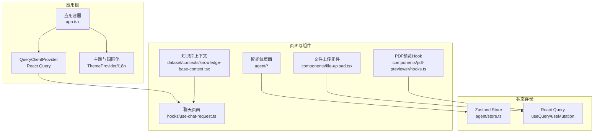
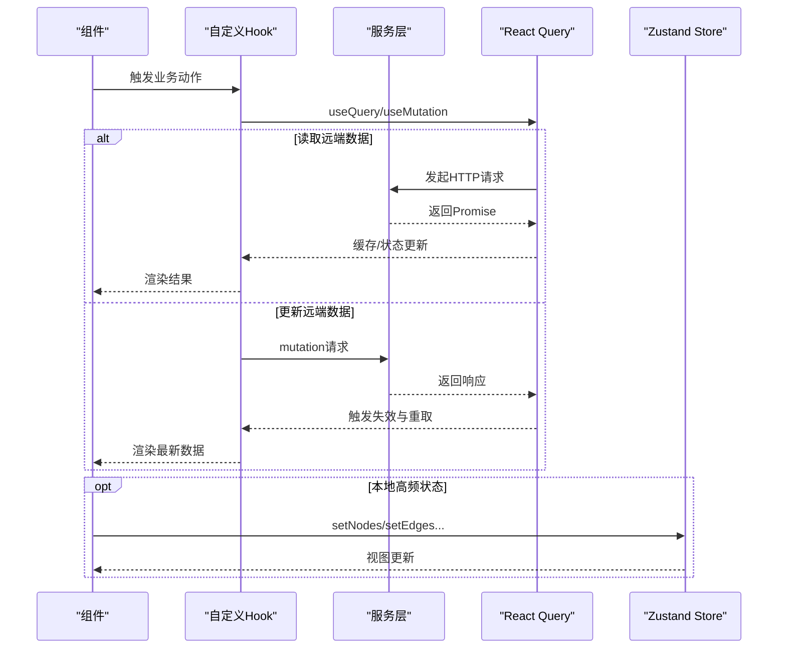
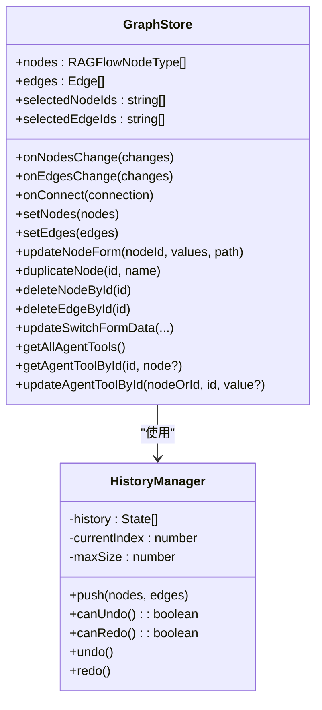
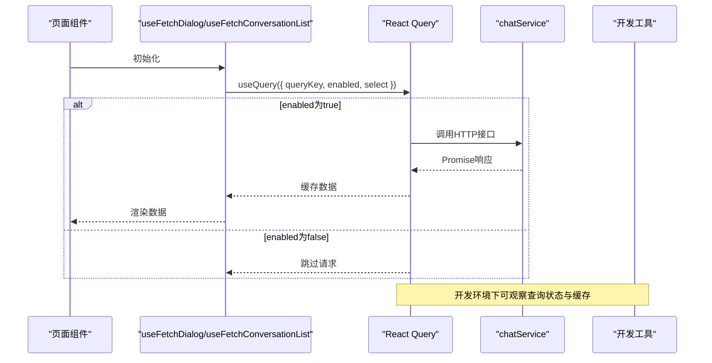
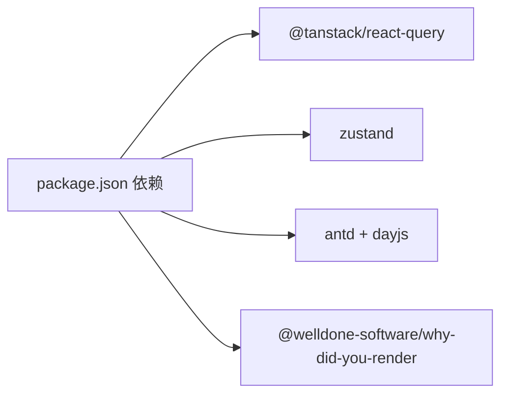

# 状态管理

<cite>
**本文引用的文件**
- [web/src/app.tsx](file://web/src/app.tsx)
- [web/package.json](file://web/package.json)
- [web/src/pages/agent/store.ts](file://web/src/pages/agent/store.ts)
- [web/src/pages/agent/use-agent-history-manager.ts](file://web/src/pages/agent/use-agent-history-manager.ts)
- [web/src/pages/agent/hooks/use-set-graph.ts](file://web/src/pages/agent/hooks/use-set-graph.ts)
- [web/src/pages/agent/hooks/use-fetch-data.ts](file://web/src/pages/agent/hooks/use-fetch-data.ts)
- [web/src/pages/dataset/contexts/knowledge-base-context.tsx](file://web/src/pages/dataset/contexts/knowledge-base-context.tsx)
- [web/src/components/pdf-previewer/hooks.ts](file://web/src/components/pdf-previewer/hooks.ts)
- [web/src/components/file-upload.tsx](file://web/src/components/file-upload.tsx)
- [web/src/hooks/use-chat-request.ts](file://web/src/hooks/use-chat-request.ts)
- [web/src/hooks/logic-hooks.ts](file://web/src/hooks/logic-hooks.ts)
- [web/src/hooks/use-login-request.ts](file://web/src/hooks/use-login-request.ts)
</cite>

## 目录
1. [引言](#引言)
2. [项目结构](#项目结构)
3. [核心组件](#核心组件)
4. [架构总览](#架构总览)
5. [详细组件分析](#详细组件分析)
6. [依赖分析](#依赖分析)
7. [性能考虑](#性能考虑)
8. [故障排查指南](#故障排查指南)
9. [结论](#结论)
10. [附录](#附录)

## 引言
本技术指南聚焦于RAGFlow前端的状态管理模式，系统性梳理全局状态、局部状态与异步状态的处理策略；详解React Query在查询客户端配置、缓存策略与数据同步方面的应用；总结自定义Hook的设计与实现（业务封装、状态抽象、副作用处理）；阐述服务层设计（API封装、错误处理、重试机制）；并给出状态持久化方案（localStorage/sessionStorage）与调试监控方法，最后提供性能优化的最佳实践。

## 项目结构
RAGFlow前端采用Vite + React 18 + TypeScript构建，状态管理由多层策略协同完成：
- 全局状态：基于Zustand的本地状态存储，用于画布编辑器等高频交互场景。
- 局部状态：组件内部useState/useRef，用于UI交互态与轻量数据。
- 异步状态：基于@tanstack/react-query进行请求、缓存与失效控制。
- 服务层：统一通过service模块封装HTTP调用，结合React Query进行数据获取与更新。
- 上下文：少量场景使用React Context进行跨层级共享。

图表来源
- [web/src/app.tsx:80-142](file://web/src/app.tsx#L80-L142)
- [web/src/pages/agent/store.ts:122-661](file://web/src/pages/agent/store.ts#L122-L661)
- [web/src/hooks/use-chat-request.ts:175-223](file://web/src/hooks/use-chat-request.ts#L175-L223)
- [web/src/components/file-upload.tsx:244-265](file://web/src/components/file-upload.tsx#L244-L265)
- [web/src/components/pdf-previewer/hooks.ts:1-18](file://web/src/components/pdf-previewer/hooks.ts#L1-L18)
- [web/src/pages/dataset/contexts/knowledge-base-context.tsx:1-34](file://web/src/pages/dataset/contexts/knowledge-base-context.tsx#L1-L34)

章节来源
- [web/src/app.tsx:80-142](file://web/src/app.tsx#L80-L142)
- [web/package.json:63-132](file://web/package.json#L63-L132)

## 核心组件
- 应用根容器与查询客户端
  - 在应用根节点注入QueryClientProvider，并在开发环境启用why-did-you-render辅助调试。
  - 配置Ant Design主题与国际化语言映射，确保全局一致的视觉与文案体验。
- Zustand Store（智能体画布）
  - 提供节点、边、选中态、表单联动、工具节点管理等状态操作，支持devtools与immer中间件以提升可追踪性与不可变更新效率。
- React Query Hooks（聊天与对话）
  - 使用useQuery获取会话与对话列表，结合select做本地筛选；使用useMutation执行新增/修改等变更型操作；通过enabled/refetchOnWindowFocus等策略控制请求时机。
- 自定义Hook（登录/登出、滚动、文件上传上下文）
  - 登录/登出：封装mutation流程，统一错误提示与路由跳转。
  - 滚动：监听容器滚动，自动判断是否保持底部。
  - 文件上传：基于useSyncExternalStore订阅自定义store快照，避免不必要的重渲染。
- 上下文（知识库）
  - 轻量上下文提供知识库对象与加载态，便于跨组件共享。

章节来源
- [web/src/app.tsx:80-142](file://web/src/app.tsx#L80-L142)
- [web/src/pages/agent/store.ts:122-661](file://web/src/pages/agent/store.ts#L122-L661)
- [web/src/hooks/use-chat-request.ts:175-223](file://web/src/hooks/use-chat-request.ts#L175-L223)
- [web/src/hooks/use-login-request.ts:93-133](file://web/src/hooks/use-login-request.ts#L93-L133)
- [web/src/components/file-upload.tsx:244-265](file://web/src/components/file-upload.tsx#L244-L265)
- [web/src/pages/dataset/contexts/knowledge-base-context.tsx:1-34](file://web/src/pages/dataset/contexts/knowledge-base-context.tsx#L1-L34)

## 架构总览
RAGFlow前端状态管理采用“分层协作”模式：
- UI层：组件负责渲染与用户交互，局部状态为主。
- Hook层：封装业务逻辑与副作用，统一调用服务层或Query客户端。
- 服务层：封装HTTP请求，返回Promise，交由React Query进行缓存与同步。
- 存储层：Zustand用于高频交互的本地状态；React Query用于远端数据；必要时结合localStorage/sessionStorage进行持久化。

图表来源
- [web/src/hooks/use-chat-request.ts:175-223](file://web/src/hooks/use-chat-request.ts#L175-L223)
- [web/src/pages/agent/store.ts:122-661](file://web/src/pages/agent/store.ts#L122-L661)

## 详细组件分析

### 全局状态：Zustand Store（智能体画布）
- 设计要点
  - 使用create + devtools + immer组合，兼顾可观测性与高效更新。
  - 将节点、边、选中态、表单联动、工具节点管理等聚合在一个store中，降低跨组件通信成本。
  - 对复杂变更（如连接、复制、删除）提供原子化方法，保证状态一致性。
- 关键能力
  - 连接与变更：onConnect/onEdgesChange/onNodesChange，配合addEdge/applyEdgeChanges/applyNodeChanges。
  - 表单联动：根据连接事件动态更新Switch等节点的条件字段。
  - 工具节点管理：增删改查工具节点及其关联边。
  - 历史管理：HistoryManager类记录节点/边历史，支持撤销与前进。
- 性能与调试
  - devtools中间件开启命名空间trace，便于定位状态变化。
  - immer中间件减少深拷贝开销，提升大图编辑性能。

图表来源
- [web/src/pages/agent/store.ts:55-119](file://web/src/pages/agent/store.ts#L55-L119)
- [web/src/pages/agent/store.ts:122-661](file://web/src/pages/agent/store.ts#L122-L661)
- [web/src/pages/agent/use-agent-history-manager.ts:5-44](file://web/src/pages/agent/use-agent-history-manager.ts#L5-L44)

章节来源
- [web/src/pages/agent/store.ts:122-661](file://web/src/pages/agent/store.ts#L122-L661)
- [web/src/pages/agent/use-agent-history-manager.ts:1-44](file://web/src/pages/agent/use-agent-history-manager.ts#L1-L44)
- [web/src/pages/agent/hooks/use-set-graph.ts:1-17](file://web/src/pages/agent/hooks/use-set-graph.ts#L1-L17)
- [web/src/pages/agent/hooks/use-fetch-data.ts:1-19](file://web/src/pages/agent/hooks/use-fetch-data.ts#L1-L19)

### 局部状态：组件内useState/useRef与上下文
- 组件内状态
  - 文件上传组件通过useStore(selector)与useSyncExternalStore订阅store快照，避免无关重渲染。
  - PDF预览Hook通过useState保存文档获取错误信息，配合axios请求进行校验。
- 上下文
  - 知识库上下文提供knowledgeBase与loading，约束使用范围，避免全局污染。

章节来源
- [web/src/components/file-upload.tsx:244-265](file://web/src/components/file-upload.tsx#L244-L265)
- [web/src/components/pdf-previewer/hooks.ts:1-18](file://web/src/components/pdf-previewer/hooks.ts#L1-L18)
- [web/src/pages/dataset/contexts/knowledge-base-context.tsx:1-34](file://web/src/pages/dataset/contexts/knowledge-base-context.tsx#L1-L34)

### 异步状态：React Query的使用
- 查询客户端与Provider
  - 在应用根注入QueryClientProvider，全局启用React Query。
- 查询与选择
  - useQuery用于获取对话详情与会话列表，结合select做本地过滤，减少上游渲染压力。
  - 通过enabled控制请求触发时机，避免无意义请求。
- 变更与失效
  - useMutation封装新增/修改等写操作，成功后自动触发相关查询失效与重取。
- 错误处理与提示
  - 在逻辑Hook中对非0返回码进行消息提示，保证用户体验一致性。

图表来源
- [web/src/hooks/use-chat-request.ts:175-223](file://web/src/hooks/use-chat-request.ts#L175-L223)
- [web/src/app.tsx:80-142](file://web/src/app.tsx#L80-L142)

章节来源
- [web/src/hooks/use-chat-request.ts:175-223](file://web/src/hooks/use-chat-request.ts#L175-L223)
- [web/src/hooks/logic-hooks.ts:352-401](file://web/src/hooks/logic-hooks.ts#L352-L401)

### 自定义Hook的设计与实现
- 业务封装
  - useSetGraphInfo：将远端DSL图形数据写入Zustand Store，避免组件重复拉取。
  - useFetchDataOnMount：在挂载时触发请求并刷新，确保初始状态正确。
- 状态抽象
  - useScrollToBottom：抽象滚动行为，暴露isAtBottom与容器引用，复用性强。
- 副作用处理
  - useCatchDocumentError：封装axios请求与错误提示，集中处理非0返回码。
- 登录/登出
  - useLogout：封装退出流程，统一清理授权信息并跳转登录页。

章节来源
- [web/src/pages/agent/hooks/use-set-graph.ts:1-17](file://web/src/pages/agent/hooks/use-set-graph.ts#L1-L17)
- [web/src/pages/agent/hooks/use-fetch-data.ts:1-19](file://web/src/pages/agent/hooks/use-fetch-data.ts#L1-L19)
- [web/src/hooks/use-login-request.ts:93-133](file://web/src/hooks/use-login-request.ts#L93-L133)
- [web/src/components/pdf-previewer/hooks.ts:1-18](file://web/src/components/pdf-previewer/hooks.ts#L1-L18)

### 服务层设计模式
- API封装
  - 服务函数返回Promise，由React Query统一调度；错误码与消息在Hook层或服务层进行处理。
- 错误处理
  - 在逻辑Hook中对非0返回码进行消息提示，避免异常冒泡到组件层。
- 重试机制
  - React Query默认具备基础重试策略；对于关键写操作，可在useMutation中配置retry/backoff策略。

章节来源
- [web/src/hooks/logic-hooks.ts:352-401](file://web/src/hooks/logic-hooks.ts#L352-L401)

### 状态持久化方案
- localStorage/sessionStorage适用场景
  - 用户偏好（主题、语言）、临时草稿、轻量UI状态（如展开/收起）。
- 注意事项
  - 避免持久化敏感信息；仅持久化可序列化数据；注意版本迁移与兼容性。
- 结合现有实现
  - 应用根已使用localStorage保存语言设置；可借鉴该模式持久化UI偏好。

章节来源
- [web/src/app.tsx:121-128](file://web/src/app.tsx#L121-L128)

## 依赖分析
- React Query
  - 版本：^5.40.0；提供查询、缓存、失效与重取能力。
- Zustand
  - 版本：^4.5.2；用于高频交互的本地状态管理。
- Ant Design与国际化
  - AntD提供UI与主题；i18n负责多语言切换。
- 其他
  - dayjs用于时间处理；why-did-you-render用于开发期渲染优化诊断。

图表来源
- [web/package.json:63-132](file://web/package.json#L63-L132)

章节来源
- [web/package.json:63-132](file://web/package.json#L63-L132)

## 性能考虑
- 状态选择
  - 将高频交互放入Zustand，避免父组件重渲染影响子树；对大数组使用稳定引用与浅比较。
- 渲染优化
  - 使用useMemo/useCallback缓存计算结果；组件内按需拆分，避免全量重渲染。
  - 文件上传组件使用useSyncExternalStore订阅快照，减少无关订阅。
- 内存管理
  - 合理设置Query的gcTime与cacheTime；对大列表使用分页或虚拟化。
  - 清理定时器与事件监听，避免内存泄漏。
- 开发期诊断
  - why-did-you-render在开发环境启用，帮助识别不必要渲染。

章节来源
- [web/src/components/file-upload.tsx:244-265](file://web/src/components/file-upload.tsx#L244-L265)
- [web/src/app.tsx:68-79](file://web/src/app.tsx#L68-L79)

## 故障排查指南
- React Query相关
  - 检查queryKey是否稳定；确认enabled/refetchOnWindowFocus策略；利用devtools观察查询状态与缓存命中。
- Zustand相关
  - 打开devtools trace，定位状态变更来源；核对setEdgesByNodeId等复杂方法的输入输出。
- Hook与服务层
  - 在逻辑Hook中捕获非0返回码并提示；检查useMutation的retry/backoff配置。
- UI与上下文
  - 确认Context Provider包裹范围；检查上下文值是否按约定传递。

章节来源
- [web/src/app.tsx:80-142](file://web/src/app.tsx#L80-L142)
- [web/src/pages/agent/store.ts:122-661](file://web/src/pages/agent/store.ts#L122-L661)
- [web/src/hooks/logic-hooks.ts:352-401](file://web/src/hooks/logic-hooks.ts#L352-L401)

## 结论
RAGFlow前端通过Zustand与React Query的分层协作，实现了从高频交互到远端数据的全栈状态管理。自定义Hook将业务逻辑与副作用抽象，服务层统一HTTP封装，配合上下文与持久化策略，形成清晰、可维护且高性能的状态体系。建议在后续迭代中进一步完善查询key稳定性、缓存策略与错误链路的统一处理。

## 附录
- 快速定位
  - 全局状态入口：[web/src/pages/agent/store.ts:122-661](file://web/src/pages/agent/store.ts#L122-L661)
  - React Query根Provider：[web/src/app.tsx:80-142](file://web/src/app.tsx#L80-L142)
  - 聊天查询示例：[web/src/hooks/use-chat-request.ts:175-223](file://web/src/hooks/use-chat-request.ts#L175-L223)
  - 登录/登出Hook：[web/src/hooks/use-login-request.ts:93-133](file://web/src/hooks/use-login-request.ts#L93-L133)
  - 文件上传上下文订阅：[web/src/components/file-upload.tsx:244-265](file://web/src/components/file-upload.tsx#L244-L265)
  - PDF错误捕获Hook：[web/src/components/pdf-previewer/hooks.ts:1-18](file://web/src/components/pdf-previewer/hooks.ts#L1-L18)
  - 知识库上下文：[web/src/pages/dataset/contexts/knowledge-base-context.tsx:1-34](file://web/src/pages/dataset/contexts/knowledge-base-context.tsx#L1-L34)