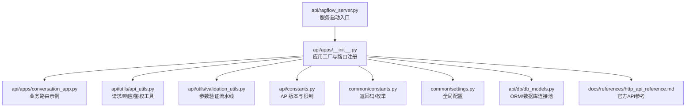
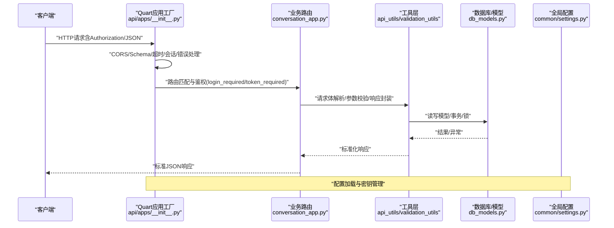
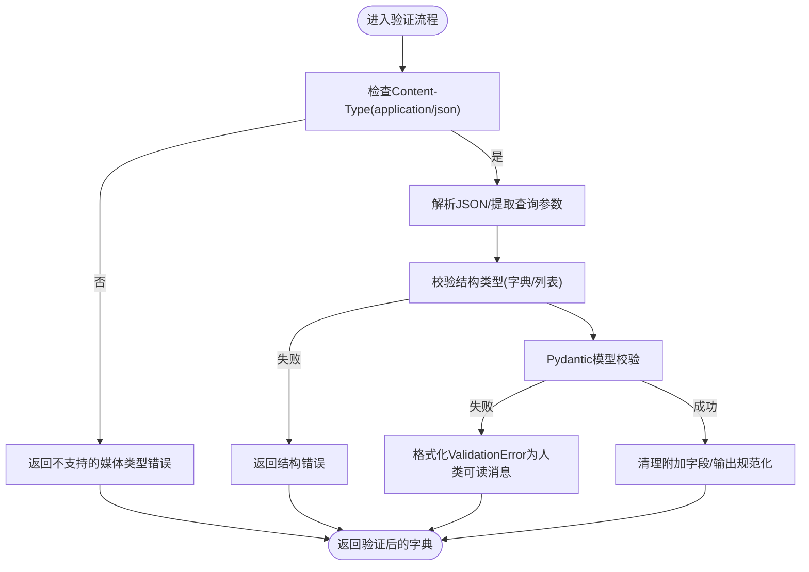
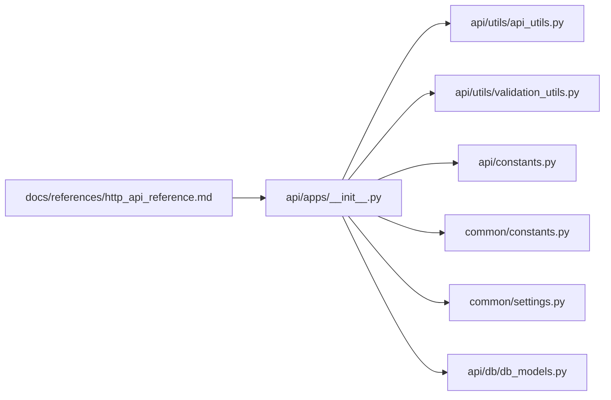

# API开发规范

<cite>
**本文引用的文件**
- [api/ragflow_server.py](file://api/ragflow_server.py)
- [api/apps/__init__.py](file://api/apps/__init__.py)
- [api/constants.py](file://api/constants.py)
- [api/utils/api_utils.py](file://api/utils/api_utils.py)
- [api/utils/validation_utils.py](file://api/utils/validation_utils.py)
- [api/common/exceptions.py](file://api/common/exceptions.py)
- [api/db/db_models.py](file://api/db/db_models.py)
- [common/constants.py](file://common/constants.py)
- [common/settings.py](file://common/settings.py)
- [docs/references/http_api_reference.md](file://docs/references/http_api_reference.md)
- [api/apps/conversation_app.py](file://api/apps/conversation_app.py)
</cite>

## 目录
1. [简介](#简介)
2. [项目结构](#项目结构)
3. [核心组件](#核心组件)
4. [架构总览](#架构总览)
5. [详细组件分析](#详细组件分析)
6. [依赖关系分析](#依赖关系分析)
7. [性能考虑](#性能考虑)
8. [故障排查指南](#故障排查指南)
9. [结论](#结论)
10. [附录](#附录)

## 简介
本文件面向API开发与维护团队，系统化梳理RAGFlow项目的RESTful API设计与实现，覆盖资源命名与URL设计、HTTP方法使用、状态码规范、版本控制策略、参数验证与数据校验、文档生成与维护、安全设计（CORS、认证授权、输入校验）、以及性能优化实践。内容以仓库现有实现为依据，结合官方HTTP API参考文档，形成可执行、可落地的开发规范。

## 项目结构
RAGFlow后端基于Quart（异步WSGI框架）构建，API入口在应用工厂模块中集中注册各业务模块蓝图，并通过统一的装饰器与工具函数实现鉴权、请求解析、响应封装与错误处理。核心目录与职责概览如下：
- api/ragflow_server.py：服务启动入口，初始化数据库、运行时配置与HTTP服务。
- api/apps/__init__.py：应用工厂，注册蓝图、CORS、OpenAPI Schema、超时与会话配置、统一错误处理。
- api/constants.py：API版本常量、通用长度限制等。
- api/utils/api_utils.py：请求解析、响应封装、鉴权装饰器、错误结果构造、压力测试辅助等。
- api/utils/validation_utils.py：请求体与查询参数的Pydantic驱动验证流水线、错误消息格式化、UUID与字符串规范化等。
- api/common/exceptions.py：管理员相关异常类型定义。
- api/db/db_models.py：ORM模型与数据库连接池、重试、分布式锁等基础设施。
- common/constants.py：返回码、任务状态、解析器类型等枚举常量。
- common/settings.py：全局配置加载、密钥生成、存储与检索引擎初始化、加密存储开关等。
- docs/references/http_api_reference.md：官方HTTP API参考，包含端点、参数、示例与错误码。
- api/apps/conversation_app.py：对话类API示例，展示鉴权、请求校验、流式响应与错误处理的实际用法。

图表来源
- [api/ragflow_server.py:1-157](file://api/ragflow_server.py#L1-L157)
- [api/apps/__init__.py:1-320](file://api/apps/__init__.py#L1-L320)
- [api/utils/api_utils.py:1-736](file://api/utils/api_utils.py#L1-L736)
- [api/utils/validation_utils.py:1-728](file://api/utils/validation_utils.py#L1-L728)
- [api/constants.py:1-29](file://api/constants.py#L1-L29)
- [common/constants.py:1-252](file://common/constants.py#L1-L252)
- [common/settings.py:1-396](file://common/settings.py#L1-L396)
- [api/db/db_models.py:1-800](file://api/db/db_models.py#L1-L800)
- [docs/references/http_api_reference.md:1-800](file://docs/references/http_api_reference.md#L1-L800)

章节来源
- [api/ragflow_server.py:1-157](file://api/ragflow_server.py#L1-L157)
- [api/apps/__init__.py:1-320](file://api/apps/__init__.py#L1-L320)

## 核心组件
- 应用工厂与路由注册
  - 统一注册蓝图，自动扫描并注册各业务模块（如对话、数据集等），支持SDK与客户端两种前缀路径。
  - 配置CORS、OpenAPI Schema、严格斜杠、自定义JSON编码器与统一异常处理。
- 鉴权与会话
  - 支持基于Access Token与API Key两种鉴权方式，统一通过装饰器或中间件进行拦截。
  - 使用Redis作为会话存储，配置最大内容长度与超时。
- 请求解析与参数验证
  - JSON请求体与查询参数采用多阶段验证：Content-Type检查、语法解析、结构校验、Pydantic模型校验与错误格式化。
  - 提供UUID规范化、字符串标准化、嵌套对象合并等实用工具。
- 响应封装与错误处理
  - 统一返回结构（code/message/data），错误码来自公共常量，异常统一由错误处理器转换为标准响应。
- 数据库与模型
  - 基于Peewee的ORM模型，提供连接池、重试、分布式锁与自动迁移能力。
- 全局配置
  - 加载数据库、存储、检索引擎、默认模型、密钥与安全策略等配置。

章节来源
- [api/apps/__init__.py:60-259](file://api/apps/__init__.py#L60-L259)
- [api/utils/api_utils.py:132-236](file://api/utils/api_utils.py#L132-L236)
- [api/utils/validation_utils.py:37-177](file://api/utils/validation_utils.py#L37-L177)
- [api/db/db_models.py:562-604](file://api/db/db_models.py#L562-L604)
- [common/settings.py:169-396](file://common/settings.py#L169-L396)

## 架构总览
下图展示了从客户端到业务服务的整体调用链路与关键组件交互：

图表来源
- [api/apps/__init__.py:60-259](file://api/apps/__init__.py#L60-L259)
- [api/apps/conversation_app.py:168-251](file://api/apps/conversation_app.py#L168-L251)
- [api/utils/api_utils.py:233-325](file://api/utils/api_utils.py#L233-L325)
- [api/utils/validation_utils.py:37-112](file://api/utils/validation_utils.py#L37-L112)
- [api/db/db_models.py:562-604](file://api/db/db_models.py#L562-L604)
- [common/settings.py:169-231](file://common/settings.py#L169-L231)

## 详细组件分析

### RESTful设计原则与URL规范
- 版本化路径
  - API版本通过常量统一管理，蓝图注册时根据是否SDK路径决定前缀，确保版本与功能域清晰分离。
- 资源命名与URL设计
  - 复数名词表示资源集合（如“/datasets”），单数ID用于具体资源（如“/datasets/{id}”）。
  - 动作通过HTTP方法表达（GET/POST/PUT/DELETE），避免动词冗余。
- HTTP方法使用
  - 列表查询使用GET（带分页与排序参数），创建使用POST，更新使用PUT，删除使用DELETE。
- 状态码规范
  - 成功：200/201；未授权：401；禁止访问：403；未找到：404；参数错误：400；服务器内部错误：500；业务错误：自定义code（参考返回码枚举）。

章节来源
- [api/constants.py:20](file://api/constants.py#L20)
- [api/apps/__init__.py:266-271](file://api/apps/__init__.py#L266-L271)
- [common/constants.py:42-58](file://common/constants.py#L42-L58)
- [docs/references/http_api_reference.md:18-28](file://docs/references/http_api_reference.md#L18-L28)

### 参数验证与数据校验
- 多阶段验证流水线
  - Content-Type检查（必须为application/json）
  - JSON语法解析
  - 结构类型校验（字典/列表）
  - Pydantic模型校验与字段级约束
  - 错误消息格式化（字段路径、消息、截断输入值）
- 查询参数与请求体
  - 分别提供针对查询参数与请求体的验证函数，支持额外字段合并与输出清理。
- 实用校验器
  - UUID v1规范化与去重校验
  - 字符串标准化（去空白、小写）
  - Base64头与MIME类型校验
  - 嵌套配置JSON长度限制
  - 模型标识符格式校验（name@factory）

图表来源
- [api/utils/validation_utils.py:37-112](file://api/utils/validation_utils.py#L37-L112)
- [api/utils/validation_utils.py:114-177](file://api/utils/validation_utils.py#L114-L177)
- [api/utils/validation_utils.py:179-218](file://api/utils/validation_utils.py#L179-L218)

章节来源
- [api/utils/validation_utils.py:37-218](file://api/utils/validation_utils.py#L37-L218)

### API版本控制策略
- 版本号管理
  - 版本常量集中定义，蓝图注册时按路径规则拼接版本前缀，保证所有端点版本一致。
- 向后兼容性
  - 新增字段建议使用可选字段与默认值，避免破坏既有客户端行为。
  - 对于废弃字段，保留读取但不在新响应中返回，配合错误码提示迁移。
- 弃用策略
  - 在API参考文档中标注废弃端点与替代方案，设置过渡期并逐步移除。

章节来源
- [api/constants.py:20](file://api/constants.py#L20)
- [api/apps/__init__.py:266-271](file://api/apps/__init__.py#L266-L271)
- [docs/references/http_api_reference.md:1-800](file://docs/references/http_api_reference.md#L1-L800)

### 文档生成与维护
- OpenAPI/Swagger集成
  - 应用工厂启用QuartSchema，自动暴露OpenAPI文档，便于联调与SDK生成。
- 自动化文档生成
  - 官方HTTP API参考文档提供端点清单、请求/响应示例与错误码，建议与代码注释保持同步。
- 接口测试
  - 建议在CI中集成HTTP接口测试，覆盖关键路径与边界条件。

章节来源
- [api/apps/__init__.py:62-63](file://api/apps/__init__.py#L62-L63)
- [docs/references/http_api_reference.md:1-800](file://docs/references/http_api_reference.md#L1-L800)

### 安全设计
- CORS配置
  - 开发环境允许跨域（通配），生产需按域名白名单收紧。
- 认证与授权
  - 支持Access Token与API Key两种鉴权方式，登录装饰器统一拦截未认证请求。
  - 密钥生成与持久化遵循最小暴露原则，建议使用环境变量与配置中心。
- 输入校验与防注入
  - 所有请求体与查询参数均经过严格校验，避免SQL注入与命令注入风险。
- 会话与超时
  - Redis会话存储、最大内容长度限制与长请求超时配置，降低资源滥用风险。

章节来源
- [api/apps/__init__.py:60-84](file://api/apps/__init__.py#L60-L84)
- [api/apps/__init__.py:95-141](file://api/apps/__init__.py#L95-L141)
- [common/settings.py:136-151](file://common/settings.py#L136-L151)

### 性能优化
- 缓存策略
  - 使用Redis作为会话存储，减少重复鉴权开销；对热点查询结果可引入应用层缓存。
- 分页查询
  - 列表接口统一支持page/page_size/orderby/desc，建议前端分页拉取，避免一次性返回大量数据。
- 批量操作
  - 对批量删除/更新场景，建议使用批量接口并限制单次批量大小，防止阻塞。
- 压缩传输
  - 建议启用Gzip/Deflate压缩，降低大响应体积。
- 超时与并发
  - 针对LLM推理等慢响应场景，已提高响应与请求体超时阈值，建议结合限流与熔断策略。

章节来源
- [api/apps/__init__.py:69-72](file://api/apps/__init__.py#L69-L72)
- [api/utils/api_utils.py:304-325](file://api/utils/api_utils.py#L304-L325)

## 依赖关系分析
- 组件耦合与内聚
  - 应用工厂集中管理CORS、Schema、超时、会话与错误处理，内聚度高、便于统一治理。
  - 业务路由通过工具层与模型层解耦，便于扩展与测试。
- 外部依赖
  - Quart、Peewee、itsdangerous、quart-auth、quart-schema等。
- 循环依赖
  - 当前结构未见循环导入迹象，蓝图注册与模块导入顺序合理。

图表来源
- [api/apps/__init__.py:1-320](file://api/apps/__init__.py#L1-L320)
- [api/utils/api_utils.py:1-736](file://api/utils/api_utils.py#L1-L736)
- [api/utils/validation_utils.py:1-728](file://api/utils/validation_utils.py#L1-L728)
- [api/constants.py:1-29](file://api/constants.py#L1-L29)
- [common/constants.py:1-252](file://common/constants.py#L1-L252)
- [common/settings.py:1-396](file://common/settings.py#L1-L396)
- [api/db/db_models.py:1-800](file://api/db/db_models.py#L1-L800)
- [docs/references/http_api_reference.md:1-800](file://docs/references/http_api_reference.md#L1-L800)

章节来源
- [api/apps/__init__.py:1-320](file://api/apps/__init__.py#L1-L320)

## 性能考虑
- 连接池与重试
  - 数据库连接池与重试机制可显著提升稳定性，建议结合监控与告警。
- 流式响应
  - 对长文本生成与语音转写等场景，采用SSE/流式响应降低等待时间。
- 并发与限流
  - 结合业务特性设置并发上限与速率限制，避免资源争用导致延迟飙升。

章节来源
- [api/db/db_models.py:242-321](file://api/db/db_models.py#L242-L321)
- [api/apps/conversation_app.py:221-251](file://api/apps/conversation_app.py#L221-L251)

## 故障排查指南
- 常见错误与定位
  - 401未授权：检查Authorization头格式与令牌有效性。
  - 400参数错误：查看工具层返回的格式化错误消息，定位具体字段。
  - 500服务器错误：查看统一错误处理器输出，结合日志定位异常。
- 数据库连接问题
  - 观察重试日志与错误码，必要时调整重试次数与延迟。
- 鉴权失败
  - 确认Access Token与API Key配置，检查用户状态与租户绑定。

章节来源
- [api/utils/api_utils.py:132-148](file://api/utils/api_utils.py#L132-L148)
- [api/utils/api_utils.py:233-236](file://api/utils/api_utils.py#L233-L236)
- [api/db/db_models.py:242-321](file://api/db/db_models.py#L242-L321)

## 结论
本规范以RAGFlow现有实现为基础，总结了RESTful API设计、参数验证、版本治理、文档与安全、性能优化等方面的最佳实践。建议在后续迭代中持续完善：
- 将参数验证与响应封装抽象为通用装饰器或基类，减少重复代码。
- 对关键端点增加速率限制与熔断保护。
- 完善单元测试与集成测试覆盖，确保变更质量。

## 附录
- 关键端点示例（节选）
  - 创建数据集：POST /api/v1/datasets
  - 更新数据集：PUT /api/v1/datasets/{dataset_id}
  - 删除数据集：DELETE /api/v1/datasets
  - 对话补全：POST /api/v1/conversations/{conversation_id}/completion
  - 问答检索：POST /api/v1/conversations/ask
  - 思维导图：POST /api/v1/conversations/mindmap

章节来源
- [docs/references/http_api_reference.md:423-476](file://docs/references/http_api_reference.md#L423-L476)
- [docs/references/http_api_reference.md:687-797](file://docs/references/http_api_reference.md#L687-L797)
- [docs/references/http_api_reference.md:630-684](file://docs/references/http_api_reference.md#L630-L684)
- [api/apps/conversation_app.py:168-251](file://api/apps/conversation_app.py#L168-L251)
- [api/apps/conversation_app.py:394-424](file://api/apps/conversation_app.py#L394-L424)
- [api/apps/conversation_app.py:426-442](file://api/apps/conversation_app.py#L426-L442)