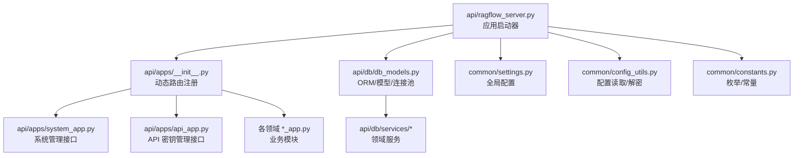
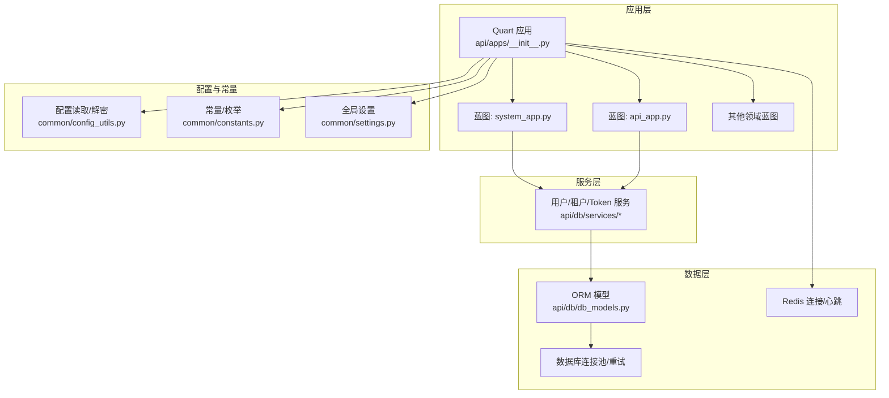
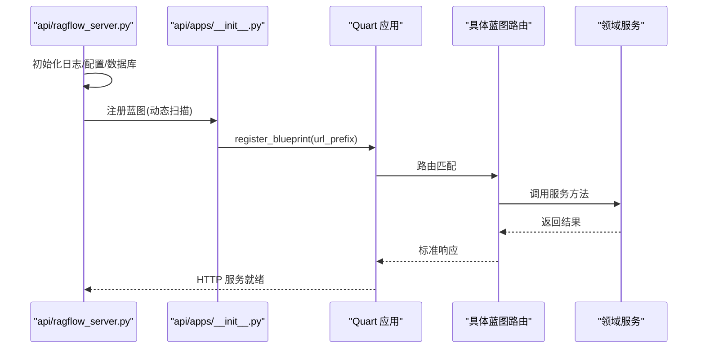
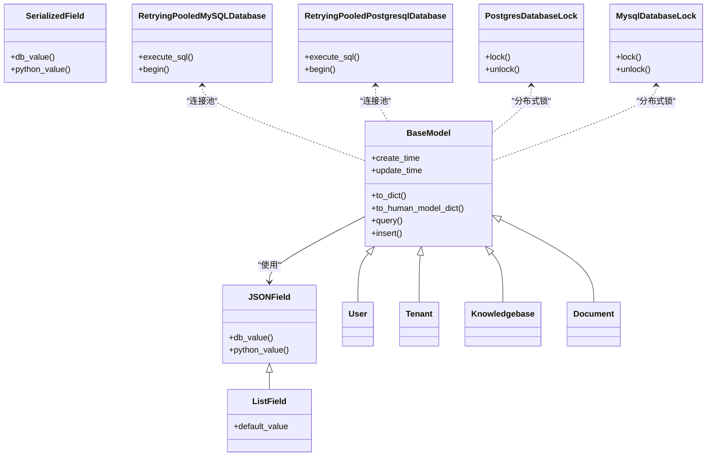
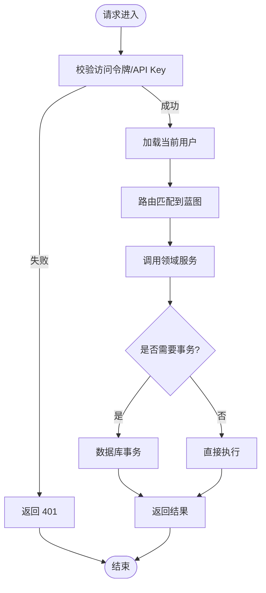
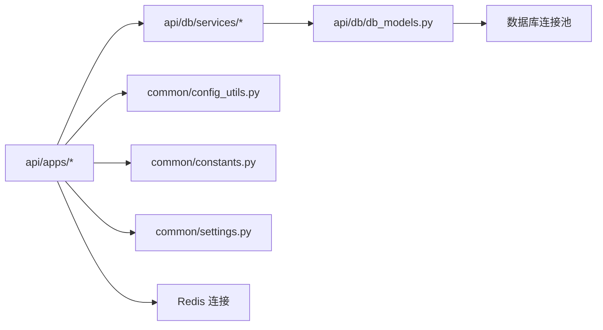

# 后端开发

<cite>
**本文引用的文件**
- [api/ragflow_server.py](file://api/ragflow_server.py)
- [api/apps/__init__.py](file://api/apps/__init__.py)
- [api/apps/api_app.py](file://api/apps/api_app.py)
- [api/apps/system_app.py](file://api/apps/system_app.py)
- [api/db/db_models.py](file://api/db/db_models.py)
- [api/db/services/user_service.py](file://api/db/services/user_service.py)
- [api/utils/api_utils.py](file://api/utils/api_utils.py)
- [common/constants.py](file://common/constants.py)
- [common/settings.py](file://common/settings.py)
- [common/config_utils.py](file://common/config_utils.py)
- [api/db/runtime_config.py](file://api/db/runtime_config.py)
- [admin/server/admin_server.py](file://admin/server/admin_server.py)
- [api/common/exceptions.py](file://api/common/exceptions.py)
</cite>

## 目录
1. [简介](#简介)
2. [项目结构](#项目结构)
3. [核心组件](#核心组件)
4. [架构总览](#架构总览)
5. [详细组件分析](#详细组件分析)
6. [依赖分析](#依赖分析)
7. [性能考虑](#性能考虑)
8. [故障排查指南](#故障排查指南)
9. [结论](#结论)
10. [附录](#附录)

## 简介
本文件面向后端服务开发，围绕基于 Python 的微服务架构进行系统化技术文档整理，重点覆盖以下方面：
- 基于 Quart/FastAPI 的服务框架与路由组织方式
- 微服务拆分原则与模块边界
- 接口设计规范（RESTful、参数校验、错误处理、版本控制）
- 数据库设计与 ORM 使用（Peewee、连接池、重试、分布式锁）
- 缓存与性能优化（Redis、查询优化、并发控制）
- 安全机制（认证、授权、密钥管理、加密）
- 异步任务与消息队列集成
- 日志与监控告警
- 单元测试与集成测试最佳实践

## 项目结构
后端采用“多应用蓝图 + 统一入口”的组织方式：
- 应用入口：api/ragflow_server.py 负责初始化数据库、运行时配置、插件加载与 HTTP 服务启动
- 路由注册：api/apps/__init__.py 动态扫描各业务模块的 *_app.py 并注册到统一的 Quart 应用
- 业务模块：如 api/apps/system_app.py、api/apps/api_app.py 等，按功能域划分蓝图
- 数据访问：api/db/db_models.py 定义 ORM 模型与数据库连接；api/db/services/* 提供领域服务
- 配置与常量：common/settings.py、common/constants.py、common/config_utils.py 提供配置解析与常量枚举
- 管理服务：admin/server/admin_server.py 提供独立的 Flask 管理服务

图示来源
- [api/ragflow_server.py:1-157](file://api/ragflow_server.py#L1-L157)
- [api/apps/__init__.py:1-320](file://api/apps/__init__.py#L1-L320)
- [api/apps/system_app.py:1-339](file://api/apps/system_app.py#L1-L339)
- [api/apps/api_app.py:1-118](file://api/apps/api_app.py#L1-L118)
- [api/db/db_models.py:1-800](file://api/db/db_models.py#L1-L800)
- [common/settings.py:1-396](file://common/settings.py#L1-L396)
- [common/config_utils.py:1-156](file://common/config_utils.py#L1-L156)
- [common/constants.py:1-252](file://common/constants.py#L1-L252)

章节来源
- [api/ragflow_server.py:1-157](file://api/ragflow_server.py#L1-L157)
- [api/apps/__init__.py:1-320](file://api/apps/__init__.py#L1-L320)

## 核心组件
- 应用启动与生命周期
  - 初始化根日志、版本信息、配置展示、数据库表初始化与数据初始化
  - 注册信号处理器，优雅关闭 MCP 会话与线程
  - 启动定时任务线程（如进度更新），随后启动 Quart HTTP 服务
- 路由与中间件
  - 统一 CORS、OpenAPI 支持、超时配置
  - 全局错误处理器、404/401 处理
  - 登录装饰器 login_required、当前用户代理 current_user
  - 请求结束自动关闭数据库连接
- 数据库与模型
  - 自定义 BaseModel、JSON/List/序列化字段
  - 连接池封装与重试机制（MySQL/PostgreSQL）
  - 分布式锁（PostgreSQL advisory lock / MySQL GET_LOCK）
  - 表初始化与迁移
- 服务层
  - 用户、租户、API Token 等领域服务，提供原子操作与事务封装
- 工具与通用能力
  - 请求体解析、参数校验、标准响应格式、OpenAI 风格输出
  - 健康检查、版本/状态查询、配置读取与解密

章节来源
- [api/ragflow_server.py:1-157](file://api/ragflow_server.py#L1-L157)
- [api/apps/__init__.py:1-320](file://api/apps/__init__.py#L1-L320)
- [api/db/db_models.py:1-800](file://api/db/db_models.py#L1-L800)
- [api/db/services/user_service.py:1-323](file://api/db/services/user_service.py#L1-L323)
- [api/utils/api_utils.py:1-736](file://api/utils/api_utils.py#L1-L736)
- [common/settings.py:1-396](file://common/settings.py#L1-L396)
- [common/config_utils.py:1-156](file://common/config_utils.py#L1-L156)
- [common/constants.py:1-252](file://common/constants.py#L1-L252)

## 架构总览
整体采用“单体服务 + 多蓝图模块 + 统一配置/常量”的微服务风格：
- 服务发现与路由：通过动态扫描注册蓝图，支持 SDK 与客户端接口分离
- 认证与授权：基于访问令牌与 API Key 双通道；登录装饰器强制鉴权
- 数据持久化：Peewee + 连接池 + 重试 + 分布式锁
- 配置中心：YAML 配置 + 环境变量覆盖 + 敏感信息解密
- 健康与可观测：统一健康检查、状态查询、Redis 心跳监控

图示来源
- [api/apps/__init__.py:1-320](file://api/apps/__init__.py#L1-L320)
- [api/apps/system_app.py:1-339](file://api/apps/system_app.py#L1-L339)
- [api/apps/api_app.py:1-118](file://api/apps/api_app.py#L1-L118)
- [api/db/db_models.py:1-800](file://api/db/db_models.py#L1-L800)
- [common/config_utils.py:1-156](file://common/config_utils.py#L1-L156)
- [common/constants.py:1-252](file://common/constants.py#L1-L252)
- [common/settings.py:1-396](file://common/settings.py#L1-L396)

## 详细组件分析

### 组件A：应用启动与路由注册
- 启动流程
  - 初始化日志、版本、项目路径、配置展示
  - 加载运行时配置、插件管理器
  - 初始化数据库与基础数据
  - 注册信号处理器，启动后台定时任务线程
  - 启动 Quart HTTP 服务器
- 路由注册机制
  - 动态扫描目录下的 *_app.py 与 sdk 子目录
  - 将模块包装为 Blueprint 并按路径前缀注册
  - 统一处理 404/401 错误，注入 JSON 编码器与异常处理器
- 认证与会话
  - 从 Authorization 头解析访问令牌或 API Key
  - 当前用户代理 current_user 通过 UserService 查询
  - 登录装饰器 login_required 强制鉴权

图示来源
- [api/ragflow_server.py:1-157](file://api/ragflow_server.py#L1-L157)
- [api/apps/__init__.py:1-320](file://api/apps/__init__.py#L1-L320)

章节来源
- [api/ragflow_server.py:1-157](file://api/ragflow_server.py#L1-L157)
- [api/apps/__init__.py:1-320](file://api/apps/__init__.py#L1-L320)

### 组件B：数据库与ORM
- 模型基类与字段
  - BaseModel 提供 create/update 时间戳自动填充、to_dict/to_human_model_dict
  - JSONField/ListField/SerializedField 支持复杂数据类型序列化
- 连接池与重试
  - RetryingPooledMySQLDatabase / RetryingPooledPostgresqlDatabase 实现断连重试
  - with_retry 装饰器为任意数据库操作提供指数退避重试
- 分布式锁
  - PostgresDatabaseLock / MysqlDatabaseLock 基于数据库原生锁实现
- 表初始化与迁移
  - init_database_tables 扫描模型并创建/迁移表，带锁避免并发冲突

图示来源
- [api/db/db_models.py:1-800](file://api/db/db_models.py#L1-L800)

章节来源
- [api/db/db_models.py:1-800](file://api/db/db_models.py#L1-L800)

### 组件C：服务层与领域逻辑
- 用户服务
  - 访问令牌校验与短令牌拒绝策略
  - 用户密码哈希存储与查询
  - 租户与角色关联查询
- API Token 服务
  - 生成、查询、删除 API Token
  - 与对话/画布场景绑定
- 系统状态与健康检查
  - 文档引擎、存储、数据库、Redis 健康检查
  - 任务执行器心跳收集

图示来源
- [api/apps/__init__.py:1-320](file://api/apps/__init__.py#L1-L320)
- [api/db/services/user_service.py:1-323](file://api/db/services/user_service.py#L1-L323)
- [api/apps/system_app.py:1-339](file://api/apps/system_app.py#L1-L339)

章节来源
- [api/db/services/user_service.py:1-323](file://api/db/services/user_service.py#L1-L323)
- [api/apps/system_app.py:1-339](file://api/apps/system_app.py#L1-L339)

### 组件D：API 设计与工具
- 参数校验与请求体解析
  - validate_request 装饰器对必填参数与取值范围进行校验
  - get_request_json 统一解析 JSON 或表单
- 标准响应与错误处理
  - get_json_result / server_error_response 统一响应结构
  - 401/404 等错误码与消息规范化
- OpenAI 风格输出
  - get_data_openai 生成流式/非流式的 OpenAI 兼容响应

章节来源
- [api/utils/api_utils.py:1-736](file://api/utils/api_utils.py#L1-L736)
- [api/apps/__init__.py:1-320](file://api/apps/__init__.py#L1-L320)

### 组件E：配置与常量
- 配置读取与解密
  - 本地/全局 YAML 合并、FileLock 写入、敏感信息解密
- 全局设置
  - 数据库、文档引擎、存储实现、LLM 默认模型、邮件、限流参数等
- 常量与枚举
  - 返回码、状态枚举、任务状态、解析器类型、存储类型等

章节来源
- [common/config_utils.py:1-156](file://common/config_utils.py#L1-L156)
- [common/settings.py:1-396](file://common/settings.py#L1-L396)
- [common/constants.py:1-252](file://common/constants.py#L1-L252)

### 组件F：管理服务（Flask）
- 独立 Flask 应用用于后台管理
- 文件系统会话、登录管理、默认管理员初始化
- 配置加载与版本展示

章节来源
- [admin/server/admin_server.py:1-85](file://admin/server/admin_server.py#L1-L85)

## 依赖分析
- 组件耦合
  - 路由层仅依赖服务层，服务层依赖模型层，模型层依赖数据库连接
  - 配置与常量被广泛使用，形成跨层依赖
- 外部依赖
  - 数据库：MySQL/PostgreSQL（连接池 + 重试）
  - 文档引擎：Elasticsearch/OpenSearch/Infinity/OceanBase
  - 存储：S3/Azure/GCS/OSS/MinIO/OpenDAL
  - Redis：会话、心跳、分布式锁
- 循环依赖
  - 通过延迟导入与模块边界控制，避免循环依赖

图示来源
- [api/apps/__init__.py:1-320](file://api/apps/__init__.py#L1-L320)
- [api/db/db_models.py:1-800](file://api/db/db_models.py#L1-L800)
- [common/config_utils.py:1-156](file://common/config_utils.py#L1-L156)
- [common/constants.py:1-252](file://common/constants.py#L1-L252)
- [common/settings.py:1-396](file://common/settings.py#L1-L396)

章节来源
- [api/apps/__init__.py:1-320](file://api/apps/__init__.py#L1-L320)
- [api/db/db_models.py:1-800](file://api/db/db_models.py#L1-L800)
- [common/settings.py:1-396](file://common/settings.py#L1-L396)

## 性能考虑
- 数据库性能
  - 连接池与重试：减少断连影响，提升可用性
  - 分布式锁：避免并发写冲突导致的回滚与重试风暴
  - 字段索引：时间戳、状态、名称等常用过滤字段建立索引
- 缓存与会话
  - Redis 会话存储，降低数据库压力
  - 任务执行器心跳通过 Redis 轻量监控
- 并发控制
  - 请求超时配置（RESPONSE_TIMEOUT/BODY_TIMEOUT）适配长耗时 LLM
  - 线程池与异步任务结合，避免阻塞主线程
- 查询优化
  - 服务层使用精确字段选择与条件过滤，避免 N+1 查询
  - 大对象序列化采用 Pickle/JSON 二选一，平衡兼容性与体积

## 故障排查指南
- 认证失败
  - 检查 Authorization 头格式与长度；确认访问令牌未被登出标记
  - API Key 无效时返回 403，核对 Token 是否存在且属于当前租户
- 数据库异常
  - 断连/连接异常自动重试；若持续失败，检查连接池配置与网络
  - 事务开始失败时，确认数据库状态与锁竞争
- 健康检查失败
  - 文档引擎/存储/数据库/Redis 健康检查失败时，查看对应实现的 health 方法
  - 任务执行器心跳缺失：检查 Redis 集群与任务执行器进程
- 配置问题
  - YAML 配置读取失败或字段缺失：使用 show_configs 输出当前配置
  - 敏感信息解密失败：核对加密模块与私钥

章节来源
- [api/apps/__init__.py:1-320](file://api/apps/__init__.py#L1-L320)
- [api/utils/api_utils.py:1-736](file://api/utils/api_utils.py#L1-L736)
- [api/apps/system_app.py:1-339](file://api/apps/system_app.py#L1-L339)
- [common/config_utils.py:1-156](file://common/config_utils.py#L1-L156)

## 结论
该后端服务以 Quart 为核心，采用“蓝图 + 服务层 + ORM”的清晰分层，配合连接池重试、分布式锁与统一配置体系，实现了高可用、可扩展的微服务风格后端。通过标准化的参数校验、错误处理与健康检查，提升了可观测性与可维护性。建议在生产环境中进一步完善：
- 引入更细粒度的指标与告警
- 对热点接口增加缓存与限流
- 逐步引入 FastAPI 的 Pydantic 校验与 OpenAPI 自动生成
- 增加异步任务队列与消息中间件的深度集成

## 附录
- 版本与环境
  - 通过 /system/version 获取版本号
  - 通过 /system/status 获取系统状态与耗时
- 管理服务
  - 独立 Flask 管理服务，提供文件系统会话与默认管理员初始化

章节来源
- [api/apps/system_app.py:1-339](file://api/apps/system_app.py#L1-L339)
- [admin/server/admin_server.py:1-85](file://admin/server/admin_server.py#L1-L85)