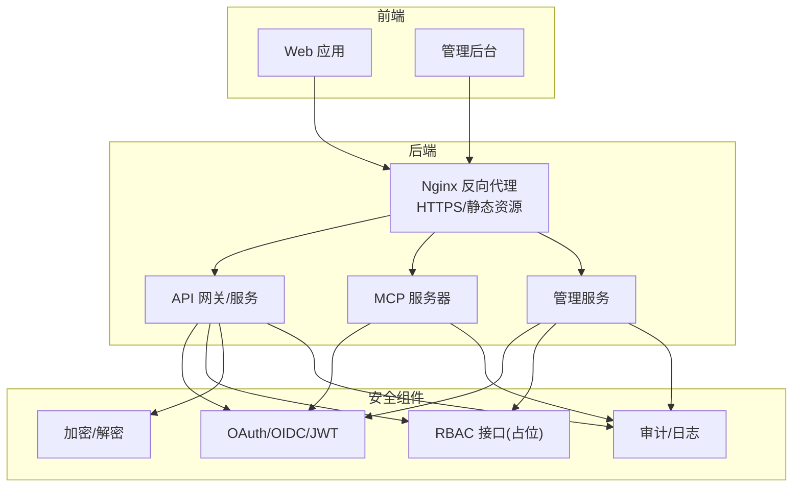
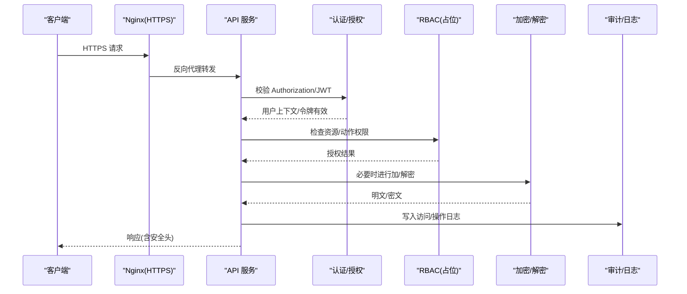
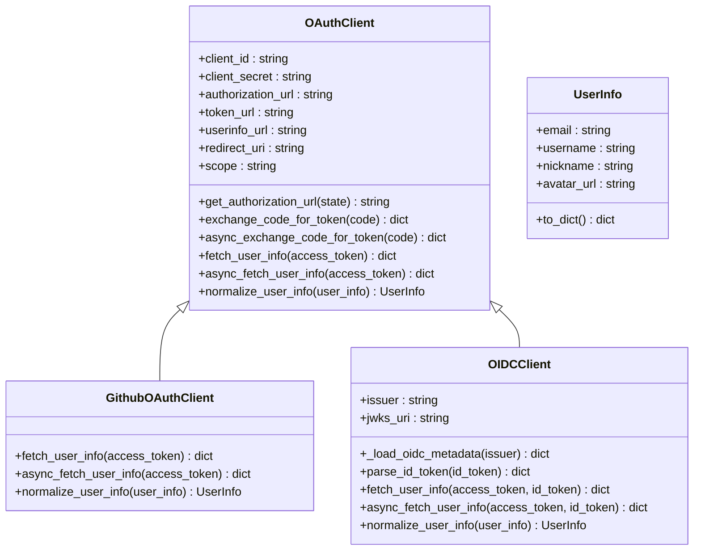
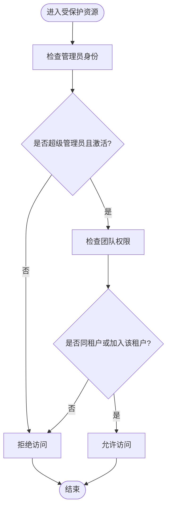
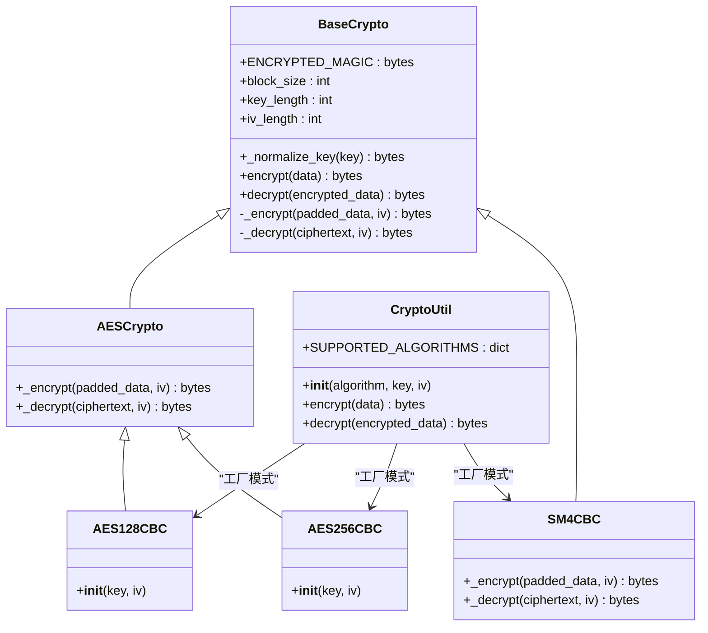
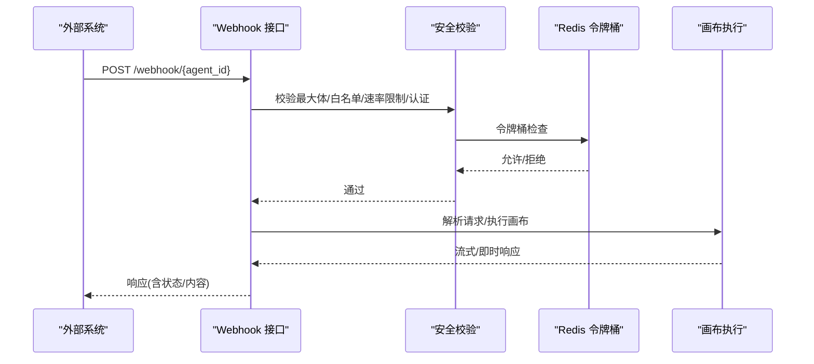
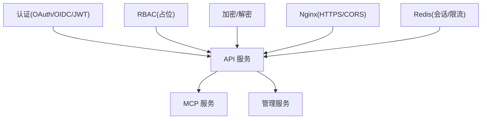

# 安全机制实现

<cite>
**本文档引用的文件**
- [SECURITY.md](file://SECURITY.md)
- [oauth.py](file://api/apps/auth/oauth.py)
- [github.py](file://api/apps/auth/github.py)
- [oidc.py](file://api/apps/auth/oidc.py)
- [auth.py](file://admin/server/auth.py)
- [roles.py](file://admin/server/roles.py)
- [agents.py](file://api/apps/sdk/agents.py)
- [crypt.py](file://api/utils/crypt.py)
- [crypto_utils.py](file://common/crypto_utils.py)
- [ragflow.https.conf](file://docker/nginx/ragflow.https.conf)
- [validation_utils.py](file://api/utils/validation_utils.py)
- [check_team_permission.py](file://api/common/check_team_permission.py)
- [server.py](file://mcp/server/server.py)
- [api_app.py](file://api/apps/api_app.py)
- [routes.py](file://admin/server/routes.py)
</cite>

## 目录
1. [引言](#引言)
2. [项目结构](#项目结构)
3. [核心组件](#核心组件)
4. [架构总览](#架构总览)
5. [详细组件分析](#详细组件分析)
6. [依赖分析](#依赖分析)
7. [性能考虑](#性能考虑)
8. [故障排除指南](#故障排除指南)
9. [结论](#结论)

## 引言
本文件面向安全工程师与开发团队，系统化梳理 RAGFlow 的安全机制实现，覆盖身份认证（OAuth2.0、OIDC、JWT）、权限控制（RBAC）、数据加密与解密、网络安全防护、API 安全策略以及安全审计与日志。文档以代码为依据，结合架构图与流程图，帮助读者快速理解并落地安全实践。

## 项目结构
RAGFlow 的安全相关能力分布在多个模块：
- 认证与授权：OAuth2/OIDC、JWT、Flask-Login、管理员鉴权
- 权限控制：RBAC 角色管理接口占位、团队权限检查工具
- 数据加密：RSA 非对称加密、对称加密（AES/SM4）工具类
- 网络安全：Nginx HTTPS 配置、CORS/安全头策略建议
- API 安全：SDK Webhook 安全校验（IP 白名单、速率限制、Token/JWT/Bearer）
- 审计与日志：统一响应封装、错误日志记录

**图表来源**
- [ragflow.https.conf:1-47](file://docker/nginx/ragflow.https.conf#L1-L47)
- [oauth.py:1-152](file://api/apps/auth/oauth.py#L1-L152)
- [oidc.py:1-108](file://api/apps/auth/oidc.py#L1-L108)
- [auth.py:1-189](file://admin/server/auth.py#L1-L189)
- [roles.py:1-77](file://admin/server/roles.py#L1-L77)
- [crypt.py:1-65](file://api/utils/crypt.py#L1-L65)
- [crypto_utils.py:1-375](file://common/crypto_utils.py#L1-L375)

**章节来源**
- [ragflow.https.conf:1-47](file://docker/nginx/ragflow.https.conf#L1-L47)
- [SECURITY.md:1-75](file://SECURITY.md#L1-L75)

## 核心组件
- 身份认证与授权
  - OAuth2/OIDC 客户端：支持授权码交换、用户信息获取、ID Token 解析与签名校验
  - JWT 管理：基于 SECRET_KEY 的序列化/反序列化，用于会话与令牌传递
  - 管理员登录：URL 安全序列化器 + 用户态管理
- 权限控制
  - RBAC 接口占位：角色 CRUD、授权/撤销、用户角色更新等接口预留
  - 团队权限检查：跨知识库/文件的团队共享权限判定
- 数据加密与解密
  - RSA 非对称加密：前端/CLI 使用公钥加密，服务端私钥解密
  - 对称加密：AES-128/256-CBC、SM4-CBC 工具类，PBKDF2 密钥派生
- 网络安全
  - HTTPS：Nginx 强制跳转 HTTPS、证书配置
  - CORS/安全头：建议在网关层统一处理
- API 安全
  - SDK Webhook：最大体、IP 白名单、速率限制、Token/JWT/Bearer 校验
  - MCP 服务器：基于 Bearer 或自定义头部的认证中间件
- 审计与日志
  - 统一响应封装与错误日志记录
  - Webhook 执行追踪写入 Redis

**章节来源**
- [oauth.py:1-152](file://api/apps/auth/oauth.py#L1-L152)
- [oidc.py:1-108](file://api/apps/auth/oidc.py#L1-L108)
- [auth.py:1-189](file://admin/server/auth.py#L1-L189)
- [roles.py:1-77](file://admin/server/roles.py#L1-L77)
- [check_team_permission.py:1-60](file://api/common/check_team_permission.py#L1-L60)
- [crypt.py:1-65](file://api/utils/crypt.py#L1-L65)
- [crypto_utils.py:1-375](file://common/crypto_utils.py#L1-L375)
- [ragflow.https.conf:1-47](file://docker/nginx/ragflow.https.conf#L1-L47)
- [agents.py:1-800](file://api/apps/sdk/agents.py#L1-L800)
- [server.py:509-539](file://mcp/server/server.py#L509-L539)

## 架构总览
下图展示从客户端到后端服务的典型安全交互路径，包括认证、授权、API 安全与审计。

**图表来源**
- [ragflow.https.conf:1-47](file://docker/nginx/ragflow.https.conf#L1-L47)
- [oauth.py:1-152](file://api/apps/auth/oauth.py#L1-L152)
- [oidc.py:1-108](file://api/apps/auth/oidc.py#L1-L108)
- [auth.py:1-189](file://admin/server/auth.py#L1-L189)
- [roles.py:1-77](file://admin/server/roles.py#L1-L77)
- [crypt.py:1-65](file://api/utils/crypt.py#L1-L65)
- [crypto_utils.py:1-375](file://common/crypto_utils.py#L1-L375)

## 详细组件分析

### 身份认证系统
- OAuth2.0 协议集成
  - 授权码交换、用户信息获取、作用域与重定向 URI 管理
  - 支持同步/异步调用，超时控制
- OIDC 集成
  - 发现元数据、ID Token 解析与签名校验、受众与发行者验证
- JWT 令牌管理
  - 基于 SECRET_KEY 的序列化/反序列化，支持 Audience/Issuer 校验
  - 管理端使用 URL 安全序列化器生成带时效的令牌
- 会话状态维护
  - Flask-Login 管理用户会话，Redis 作为会话存储
  - 管理端登录成功后更新最后登录时间与访问令牌

**图表来源**
- [oauth.py:1-152](file://api/apps/auth/oauth.py#L1-L152)
- [github.py:1-89](file://api/apps/auth/github.py#L1-L89)
- [oidc.py:1-108](file://api/apps/auth/oidc.py#L1-L108)

**章节来源**
- [oauth.py:1-152](file://api/apps/auth/oauth.py#L1-L152)
- [github.py:1-89](file://api/apps/auth/github.py#L1-L89)
- [oidc.py:1-108](file://api/apps/auth/oidc.py#L1-L108)
- [auth.py:1-189](file://admin/server/auth.py#L1-L189)
- [api_app.py](file://api/apps/api_app.py)

### 权限控制系统
- RBAC 模型实现现状
  - 角色管理接口处于占位状态，抛出未实现异常；实际业务需补充具体实现
  - 管理端路由中存在角色授权/撤销/更新等装饰器与接口定义
- 资源访问控制
  - 团队权限检查：根据知识库/文件的租户权限与用户加入的租户集合判断是否允许访问
  - 管理端装饰器：校验管理员身份与激活状态

**图表来源**
- [auth.py:92-105](file://admin/server/auth.py#L92-L105)
- [check_team_permission.py:1-60](file://api/common/check_team_permission.py#L1-L60)
- [routes.py:359-396](file://admin/server/routes.py#L359-L396)

**章节来源**
- [roles.py:1-77](file://admin/server/roles.py#L1-L77)
- [auth.py:1-189](file://admin/server/auth.py#L1-L189)
- [check_team_permission.py:1-60](file://api/common/check_team_permission.py#L1-L60)
- [routes.py:359-396](file://admin/server/routes.py#L359-L396)

### 数据加密与解密技术
- 非对称加密（RSA）
  - 前端/CLI 使用公钥加密，服务端使用私钥解密，确保凭据传输安全
- 对称加密（AES/SM4）
  - 提供 AES-128/256-CBC 与 SM4-CBC 实现，采用 PKCS7 填充与 PBKDF2 密钥派生
  - 加密数据包含魔数标识，便于识别与解密流程控制

**图表来源**
- [crypt.py:1-65](file://api/utils/crypt.py#L1-L65)
- [crypto_utils.py:1-375](file://common/crypto_utils.py#L1-L375)

**章节来源**
- [crypt.py:1-65](file://api/utils/crypt.py#L1-L65)
- [crypto_utils.py:1-375](file://common/crypto_utils.py#L1-L375)

### 网络安全防护
- HTTPS 配置
  - Nginx 将 80 端口重定向至 443，并配置 SSL 证书路径
  - 启用 Gzip 压缩与静态资源缓存策略
- CORS 策略
  - 当前未见显式 CORS 头部设置，建议在网关层统一配置
- XSS/CSRF 防护
  - 建议在网关层启用安全响应头（如 X-Frame-Options、Content-Security-Policy、SameSite 等）
- SQL 注入防护
  - 使用 ORM/参数化查询（代码中未直接暴露原生 SQL），建议持续遵循此最佳实践

**章节来源**
- [ragflow.https.conf:1-47](file://docker/nginx/ragflow.https.conf#L1-L47)

### API 安全保护
- API 密钥管理
  - 管理端提供 API Key 设置接口，需校验密钥与主机字段
- 请求签名验证
  - SDK Webhook 支持多种认证方式：Token、Basic、JWT；可扩展签名验证
- 频率限制
  - 基于 Redis Lua 令牌桶实现，支持按秒/分钟/小时/天配置
- IP 白名单
  - 支持单 IP 与 CIDR 表达式，仅允许白名单内来源访问
- 其他安全策略
  - 最大请求体大小限制、内容类型校验、Schema 严格提取与类型验证

**图表来源**
- [agents.py:183-394](file://api/apps/sdk/agents.py#L183-L394)
- [agents.py:262-302](file://api/apps/sdk/agents.py#L262-L302)

**章节来源**
- [agents.py:1-800](file://api/apps/sdk/agents.py#L1-L800)
- [server.py:509-539](file://mcp/server/server.py#L509-L539)

### 安全审计与日志记录
- 访问日志与操作日志
  - 统一响应封装与错误日志记录，便于审计
- 异常日志
  - 关键流程捕获异常并记录，避免敏感信息泄露
- 安全事件监控
  - Webhook 执行追踪写入 Redis，支持测试模式下的事件记录与耗时统计

**章节来源**
- [agents.py:650-747](file://api/apps/sdk/agents.py#L650-L747)

## 依赖分析
- 组件耦合
  - 认证模块与授权模块松耦合，通过中间件/装饰器接入
  - 加密模块独立，被多处服务调用
  - Webhook 安全校验集中于单一入口，便于统一治理
- 外部依赖
  - Nginx 作为统一入口负责 TLS/压缩/CORS
  - Redis 用于会话与令牌桶限流
- 潜在风险点
  - RBAC 接口占位，若未及时补齐可能导致权限控制失效
  - 管理端登录流程依赖 SECRET_KEY，需妥善保管

**图表来源**
- [oauth.py:1-152](file://api/apps/auth/oauth.py#L1-L152)
- [oidc.py:1-108](file://api/apps/auth/oidc.py#L1-L108)
- [auth.py:1-189](file://admin/server/auth.py#L1-L189)
- [roles.py:1-77](file://admin/server/roles.py#L1-L77)
- [crypt.py:1-65](file://api/utils/crypt.py#L1-L65)
- [crypto_utils.py:1-375](file://common/crypto_utils.py#L1-L375)
- [ragflow.https.conf:1-47](file://docker/nginx/ragflow.https.conf#L1-L47)

**章节来源**
- [oauth.py:1-152](file://api/apps/auth/oauth.py#L1-L152)
- [oidc.py:1-108](file://api/apps/auth/oidc.py#L1-L108)
- [auth.py:1-189](file://admin/server/auth.py#L1-L189)
- [roles.py:1-77](file://admin/server/roles.py#L1-L77)
- [crypt.py:1-65](file://api/utils/crypt.py#L1-L65)
- [crypto_utils.py:1-375](file://common/crypto_utils.py#L1-L375)
- [ragflow.https.conf:1-47](file://docker/nginx/ragflow.https.conf#L1-L47)

## 性能考虑
- 加密性能
  - AES-256-CBC 与 SM4-CBC 在大体量数据上具备良好吞吐，建议根据场景选择合适算法
  - PBKDF2 迭代次数已固定，兼顾安全性与性能
- 限流策略
  - 令牌桶算法在高并发下表现稳定，建议结合 Redis 集群部署
- 日志与审计
  - Webhook 追踪写入 Redis，注意 TTL 与内存占用，建议定期清理

## 故障排除指南
- 常见问题定位
  - 认证失败：检查 Authorization 头格式、JWT 签名与声明校验
  - RBAC 未生效：确认接口实现是否补齐，或临时绕过装饰器进行验证
  - 加密异常：核对密钥长度与格式，确保前后端密钥一致
  - Webhook 被拒：检查最大体、白名单、速率限制与认证配置
- 安全漏洞修复
  - 参考安全策略文档中的漏洞修复建议，严格过滤模块导入与反序列化行为

**章节来源**
- [SECURITY.md:1-75](file://SECURITY.md#L1-L75)
- [validation_utils.py:1-728](file://api/utils/validation_utils.py#L1-L728)

## 结论
RAGFlow 的安全体系以“认证+授权+加密+网络防护+API 安全+审计”为主线，具备 OAuth2/OIDC、JWT、RBAC 接口占位、RSA/AES/SM4 加密、Nginx HTTPS、Webhook 多维安全校验等能力。建议优先补齐 RBAC 实现、完善 CORS/安全头策略、强化密钥轮换与审计留痕，以构建更稳健的整体安全防线。